## AB-13.1 Nostr topology — relay, gateway, pod bridge, mirror, mesh

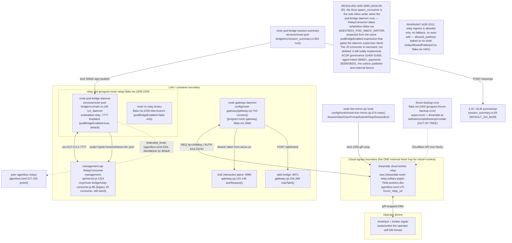

## AB-13.2 Relay ingress admission — allowlist gate before store/broadcast/OK

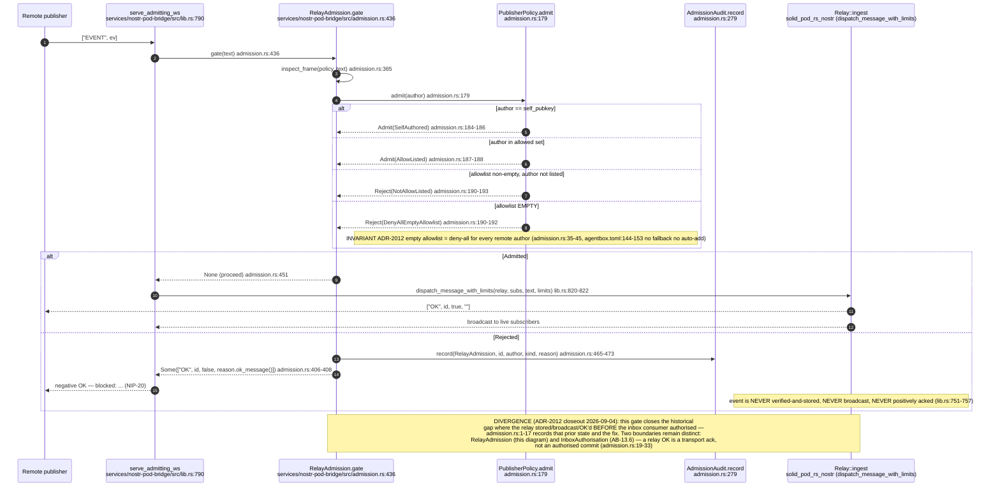

## AB-13.3 Allowlist projection at nix build — relay implementation selection

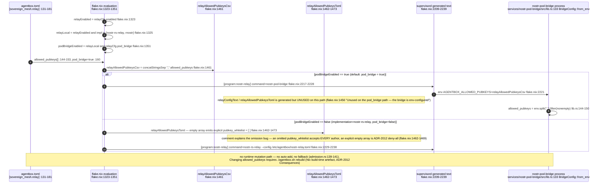

## AB-13.4 Event-kind map part 1 — transport, auth and reference kinds

```mermaid
classDiagram
    class Kind1059_GiftWrap {
        kind = 1059
        producer nostr-live-mirror.cjs:408 nip59.wrapEvent
        producer gateway.cjs:279 buildWrap
        consumer lib.rs:266 effective_message unwrap_gift
        consumer gateway.cjs:705 handleWrap
        signer mirror child key HMAC derived, nostr-live-mirror.cjs:211
    }
    class Kind14_DmRumor {
        kind = 14 NIP-17 rumor inside the gift wrap
        producer nostr-live-mirror.cjs:398 rumor
        producer gateway.cjs:278 rumor
        consumer nostr-pod-bridge unwrap_gift lib.rs:268
        signer sealed sender see AB-13.9
    }
    class Kind22242_NIP42Auth {
        kind = 22242 KIND_AUTH relay session AUTH
        producer gateway.cjs:667 authenticate finalizeEvent
        consumer cloud relay and embedded relay AUTH check
        signer operator or derived child key gateway.cjs:176-179
    }
    class Kind27235_NIP98 {
        kind = 27235 nostr-bridge.js:55 kinds.AUTH
        producer nostr-bridge.js verifyNip98 callers see AB-10.4
        consumer management-api HTTP auth middleware see AB-10.4
        note see AB-10.4 for full verification path
    }
    class Kind30078_AgentState {
        kind = 30078 nostr-bridge.js:57 AGENT_STATE
        producer see AB-17.x agent-event publishing
        consumer nostr-bridge.js:290 default subscribeKinds
    }
    class Kind30000_30001_Refs {
        kind = 30000 BRIEF_REF nostr-bridge.js:58
        kind = 30001 BEAD_REF nostr-bridge.js:59
        federated agentbox.toml:233 federated_kinds
    }
    class Kind30910_Invite {
        kind = 30910 NIP-58 invite agentbox.toml multi_user invite_kind
        federated agentbox.toml:233
    }
    Kind1059_GiftWrap --> Kind14_DmRumor : unwraps to
    note for Kind27235_NIP98 "identity minting and the DID behind every signer on this page is AB-11.2. Full NIP-98 verification is AB-10.4."
```

## AB-13.15 Event-kind map part 2 — session record and ACSP governance kinds

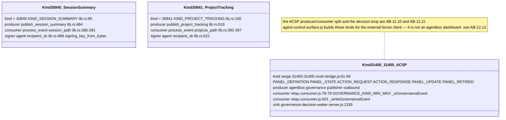

## AB-13.16 Event-kind map part 3 — federation, job and marketplace kinds

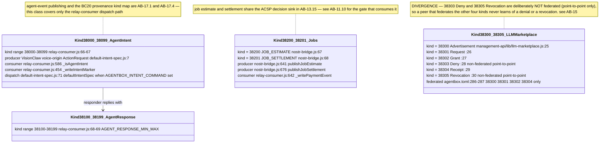

## AB-13.5 nostr-gateway command flow — relay subscribe to reply

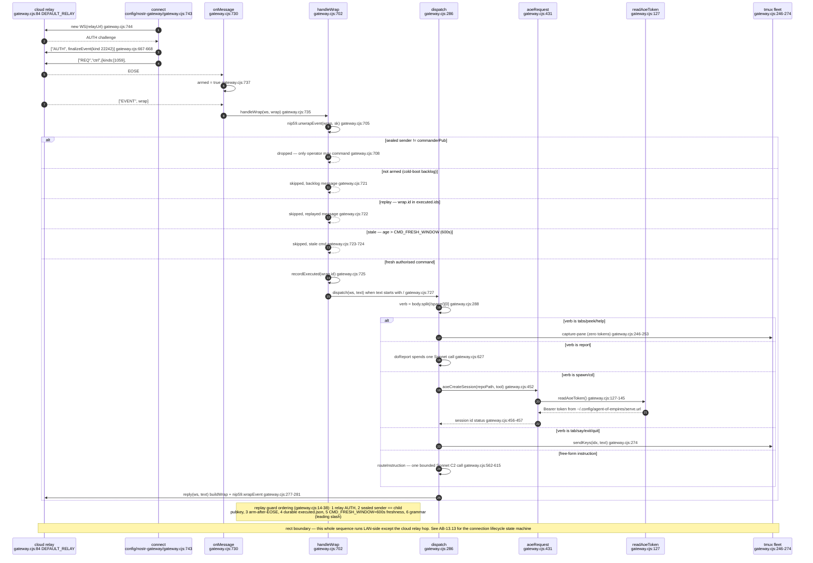

## AB-13.6 nostr-pod-bridge inbox write — authorise, unwrap, persist

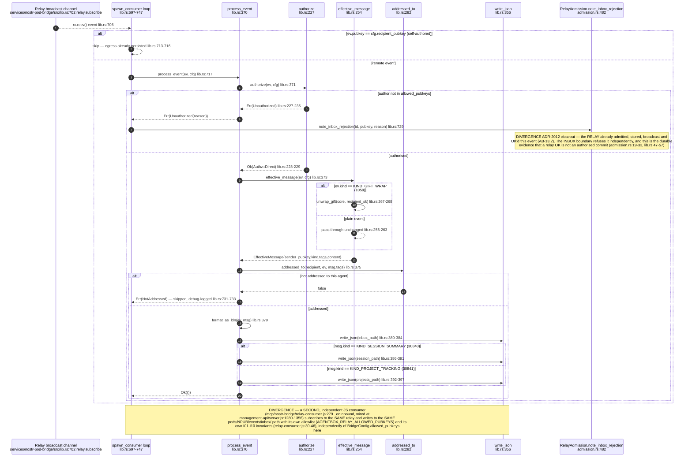

## AB-13.7 nostr-bridge / relay-consumer — in-process library, not an MCP tool server

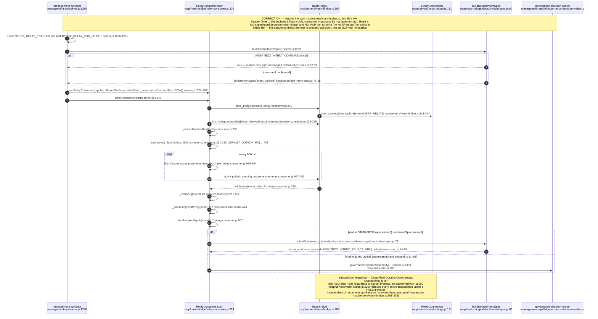

## AB-13.8 Control gateway — operator command to handler mapping

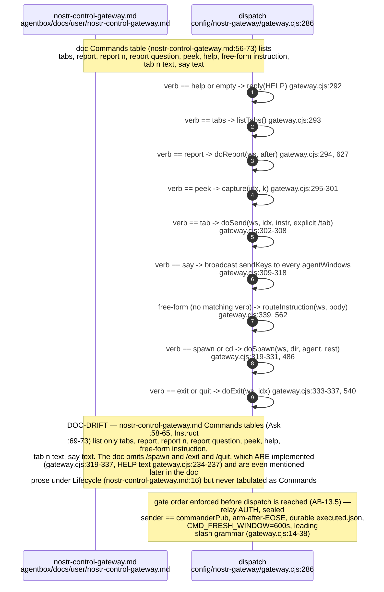

## AB-13.9 Session-mirror egress — per-turn NIP-59 gift wrap to the cloud relay

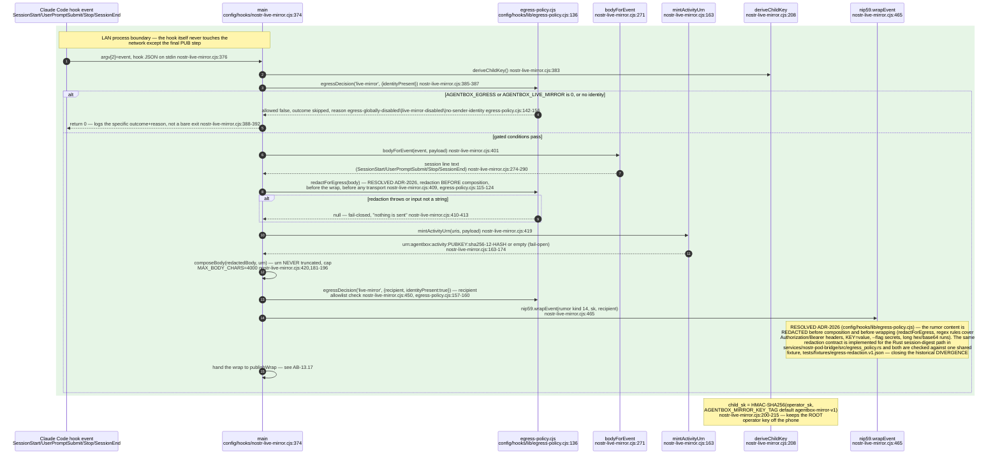

## AB-13.17 Session-mirror egress phase 2 — publish, deadline and fail-open

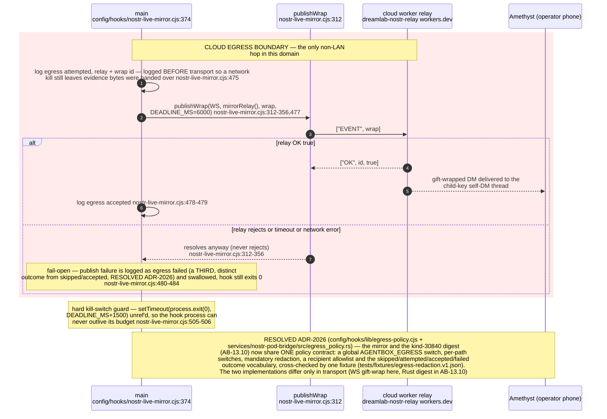

## AB-13.10 kind-30840 session-summary digest — Z.AI distil, sign, dual-write

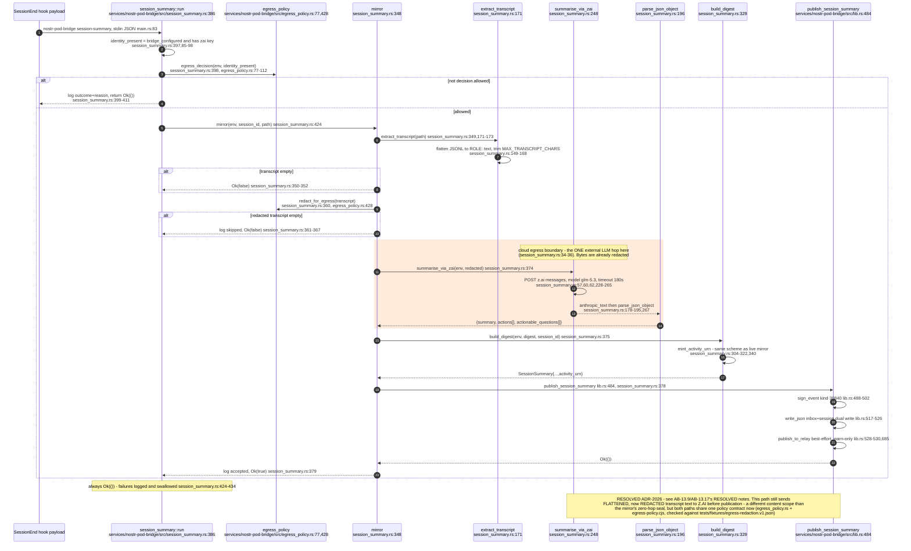

## AB-13.11 forum-backup-cron — supervised schedule (script out of tree)

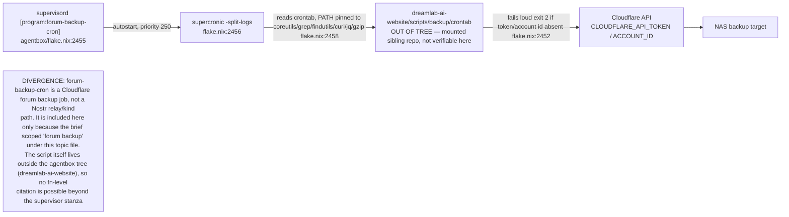

## AB-13.12 Federation — agentbox mesh peers vs the agentbox to VisionClaw URN bridge

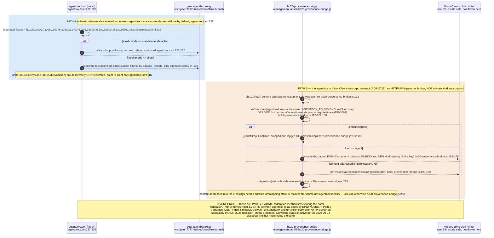

## AB-13.13 nostr-gateway relay connection — subscribe, live, reconnect lifecycle

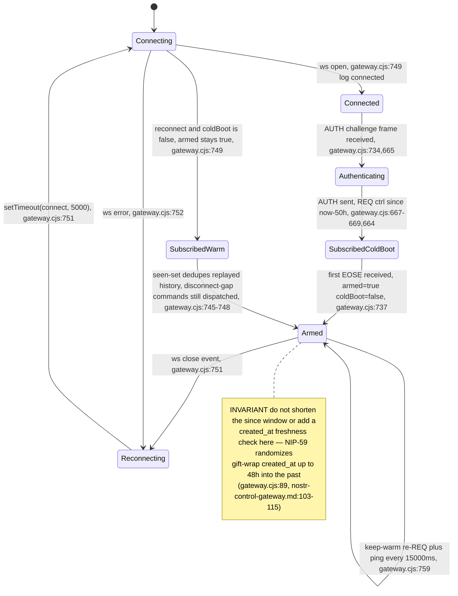

## AB-13.14 nostr-pod-bridge main — the four entry points of one binary

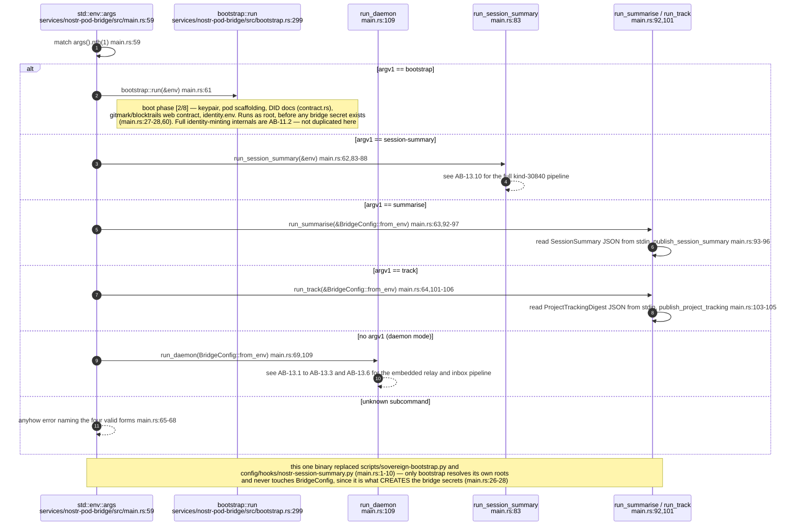

