## AB-14.1 Governance plane — surfaces that reach the decision point vs surfaces that miss it

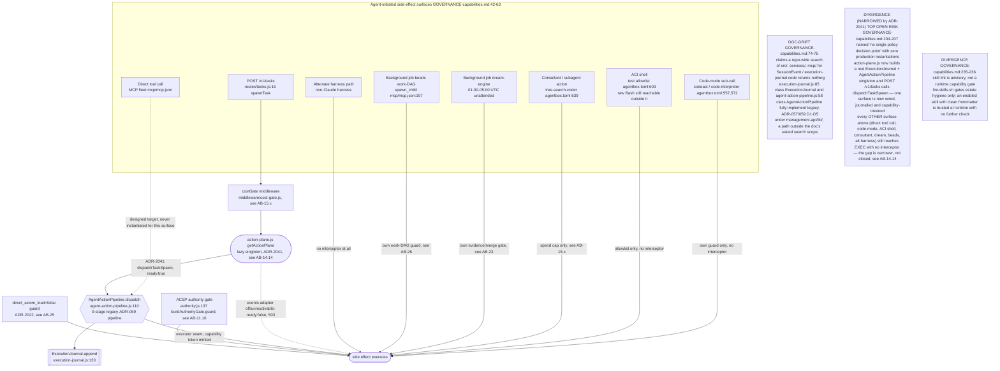

## AB-14.2 Action lifecycle — intent through policy, approval, execution, receipt, journal

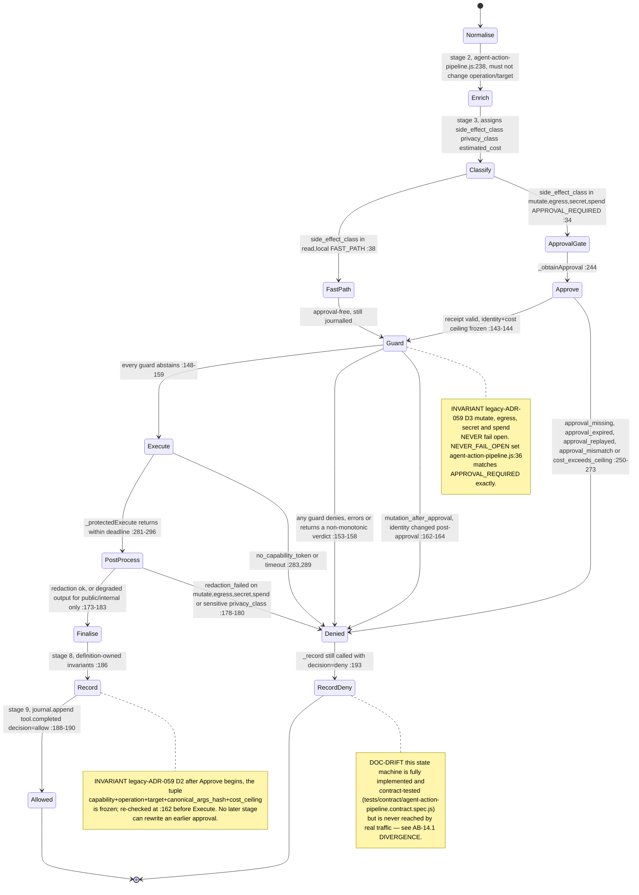

## AB-14.3 AgentActionPipeline.dispatch — intentSpec construction and policy evaluation

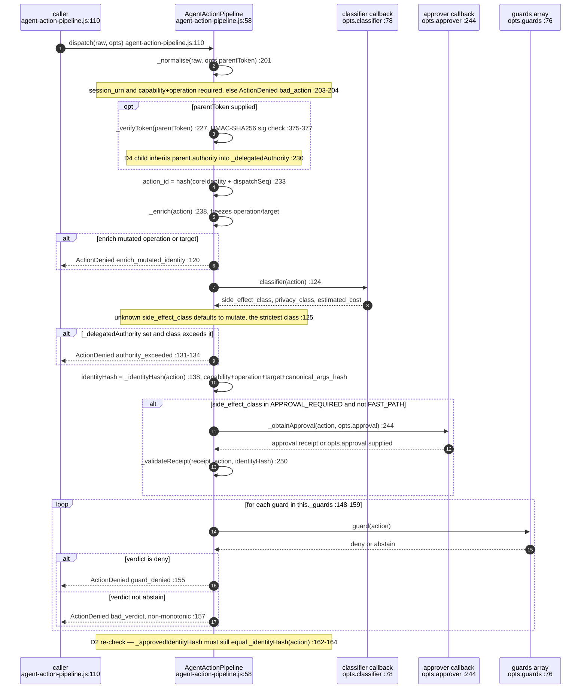

## AB-14.4 F2 operator-gated approval — pending, decide, 409 already-decided

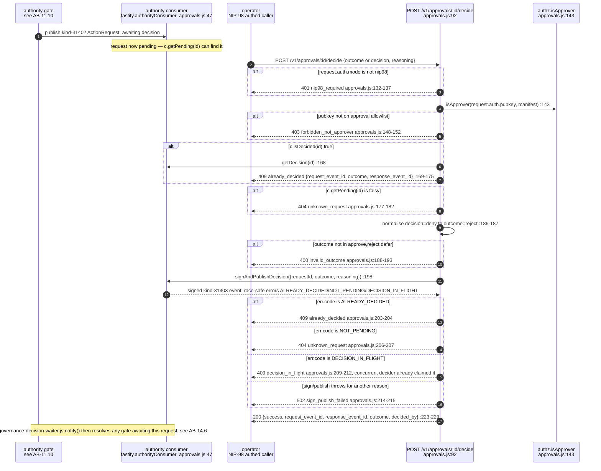

## AB-14.5 routes/approvals.js — every route and status code

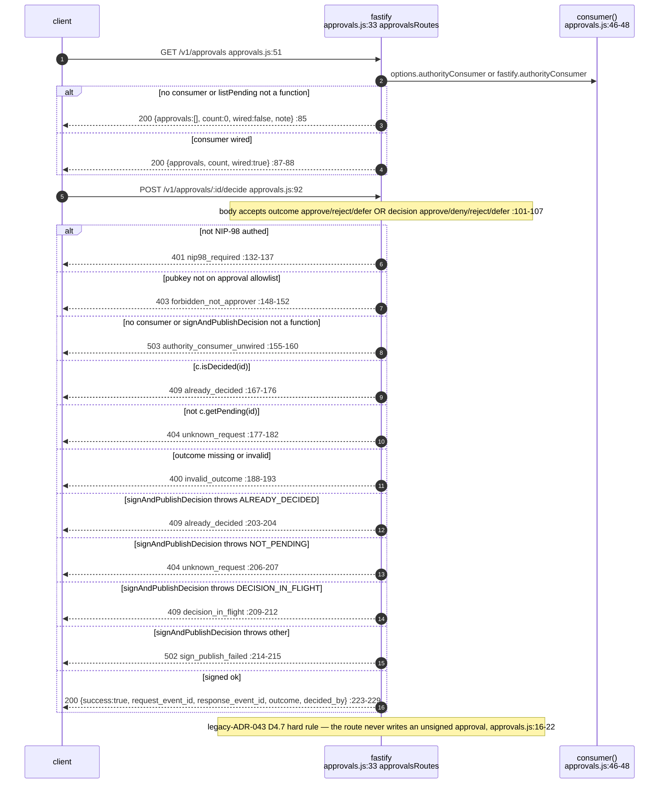

## AB-14.6 Decision waiter — exact request and bounded timeout

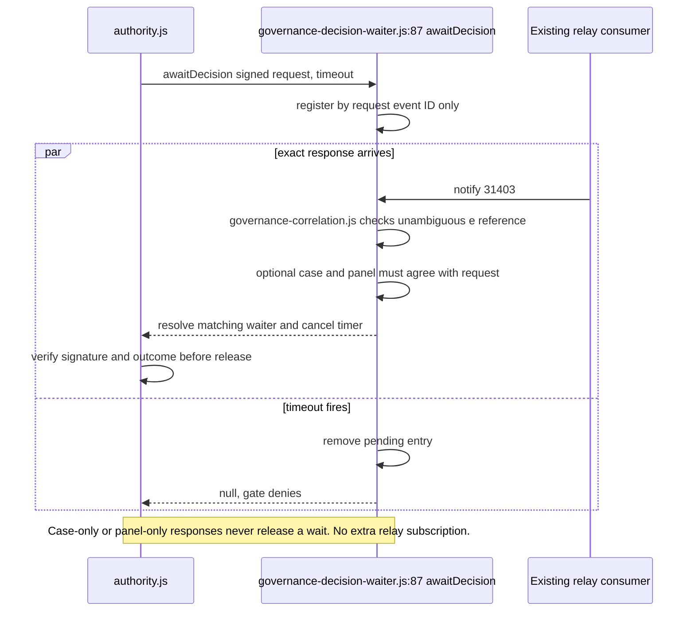

## AB-14.7 ExecutionJournal.append — what is written, where, and the ordering guarantee

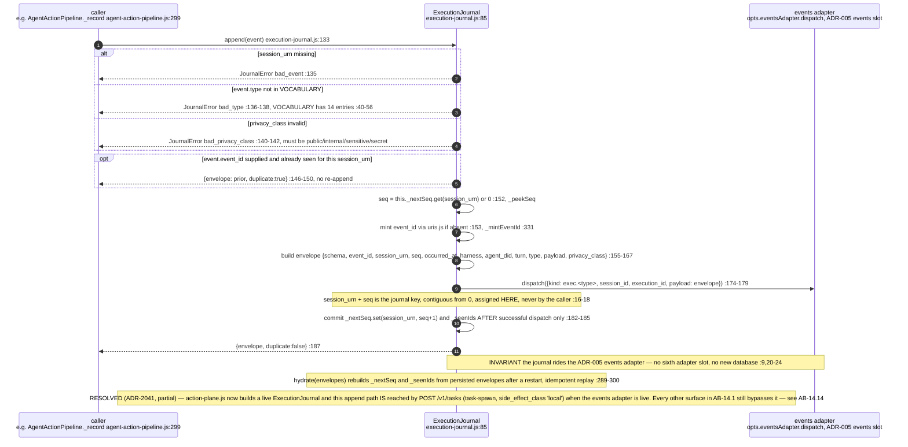

## AB-14.8 execution-projections and execution-coverage over the journal

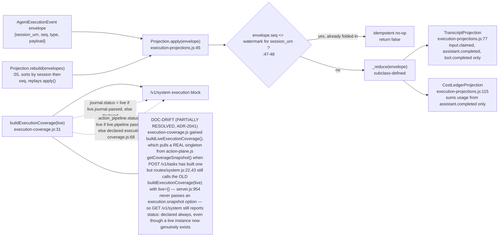

## AB-14.9 receipt-minter then audit-chain — the hash chain link and break detection

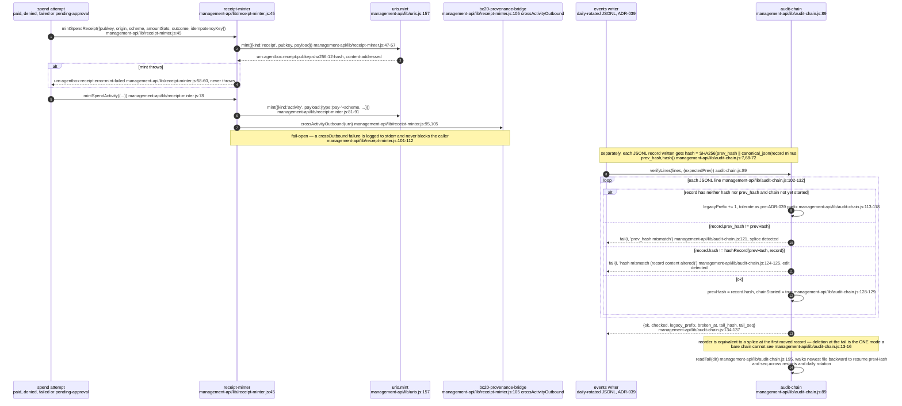

## AB-14.10 failure-taxonomy — the 14 MAST failure modes

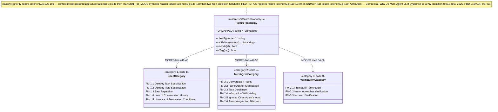

## AB-14.11 Precedent match, promote and retire — PrecedentService and the MCP bridge

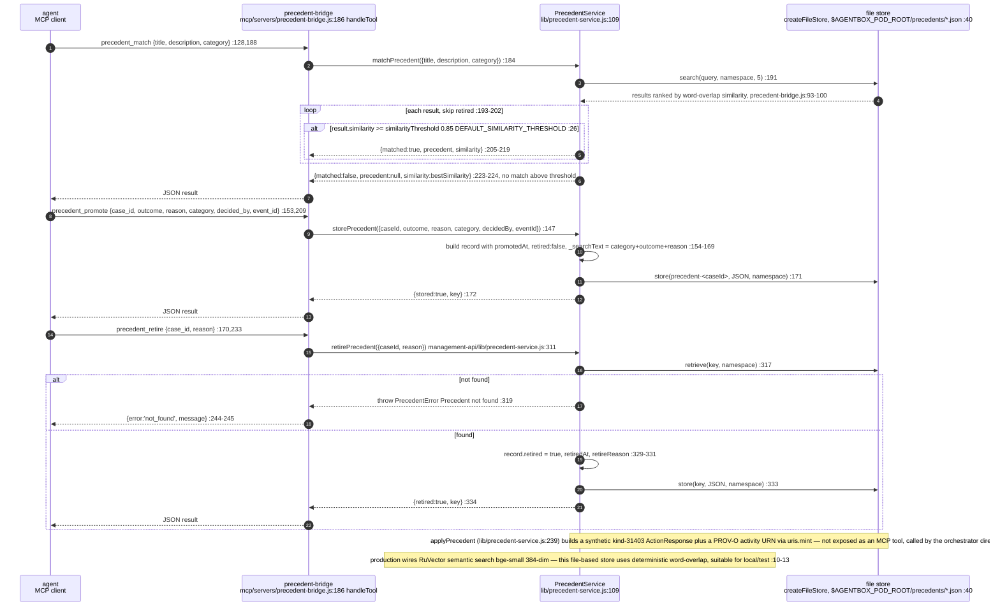

## AB-14.12 project-tracker.js publish path and /v1/projects

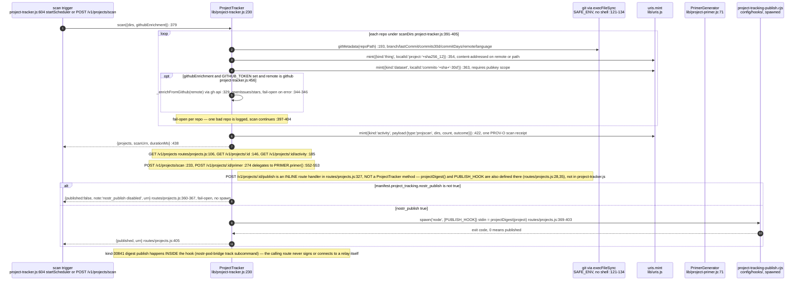

## AB-14.13 elevation-publisher.js — outbound elevation boundary to VisionClaw

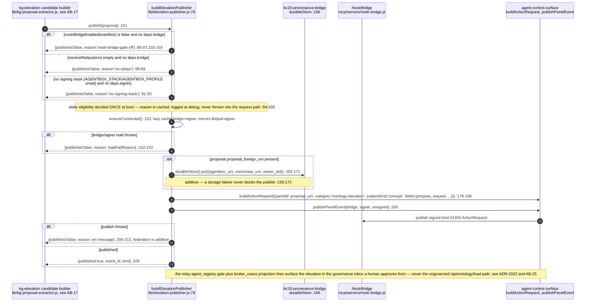

## AB-14.14 action-plane.js — the one wired production instantiation (ADR-2041)

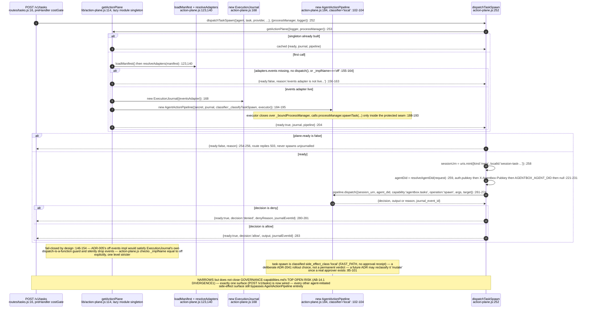
