## AB-15.1 Gate lattice — manifest to package set to supervisor to runtime trace
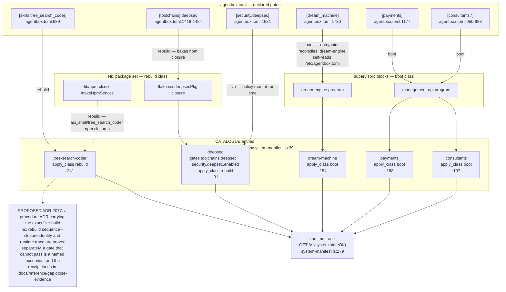

## AB-15.2 A gated tool call — off, on, and spend-capped branches
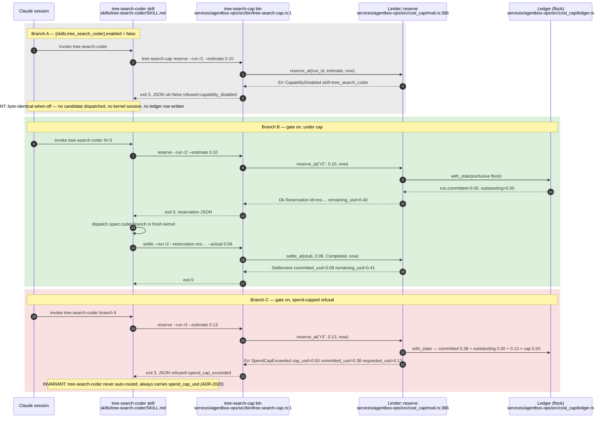

## AB-15.3 Boot projection — manifest to catalogue to runtime state
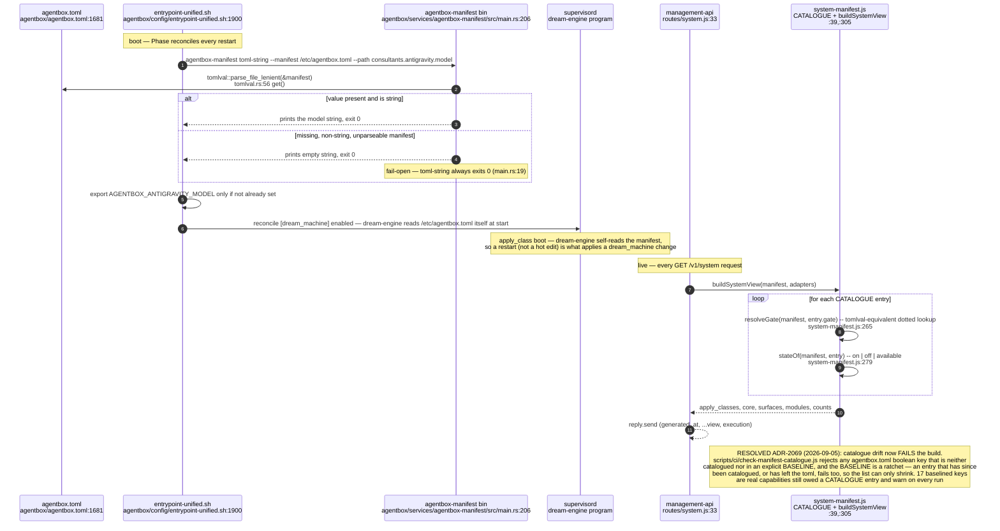

## AB-15.4 Apply-class lifecycle of a gate
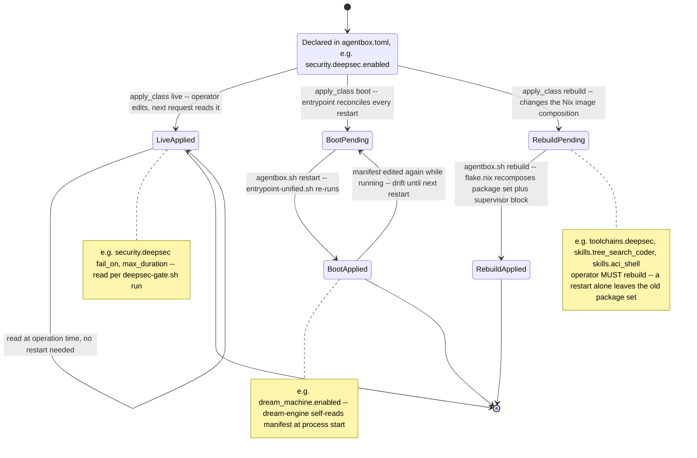

## AB-15.5 tree-search-coder spend cap — manifest to validator to enforcement
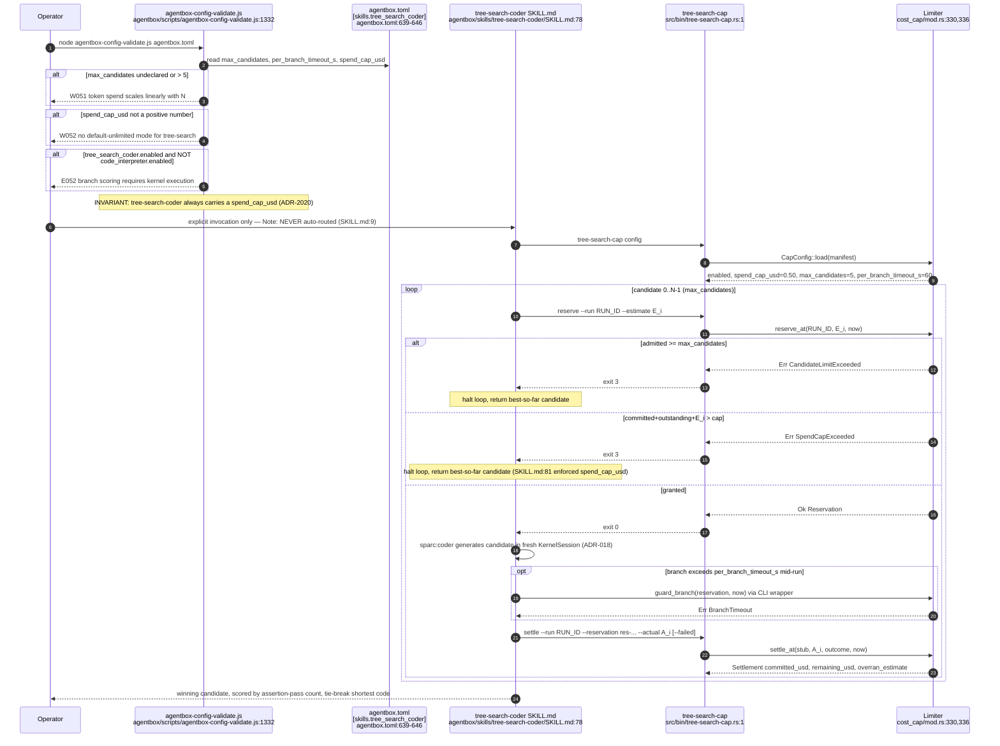

## AB-15.6 Full HTTP 402 challenge, payment, retry, settle
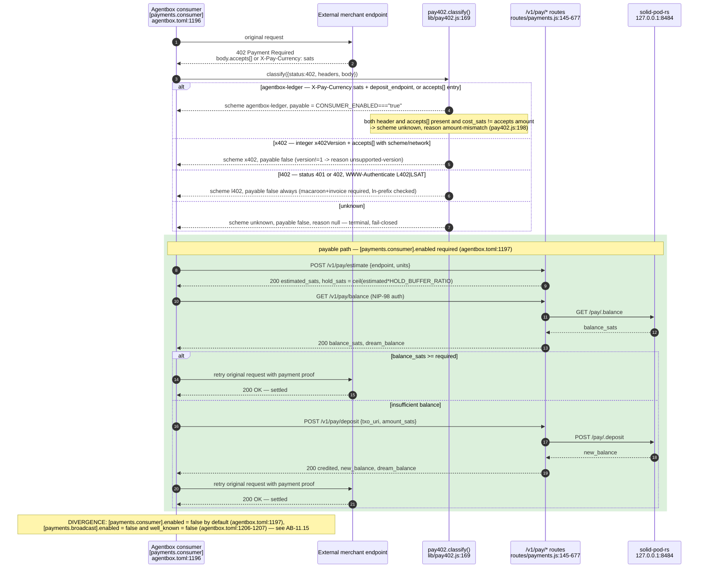

## AB-15.7 routes/payments.js — GET info, GET balance, POST deposit
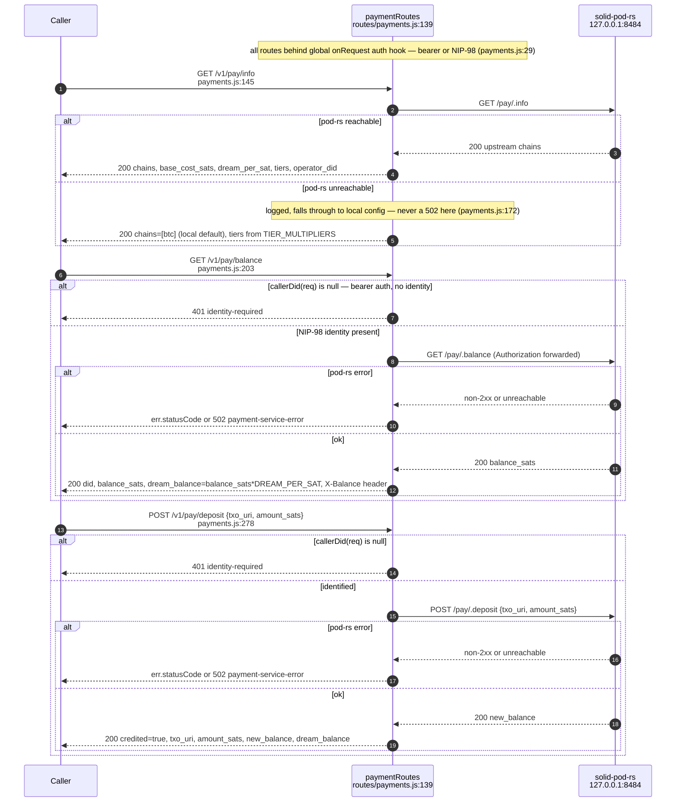

## AB-15.8 routes/payments.js — POST estimate, POST buy, POST withdraw
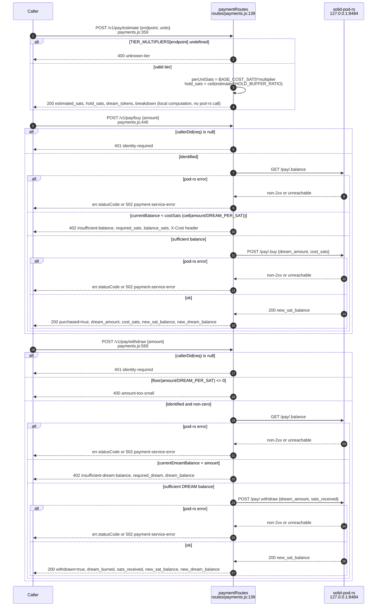

## AB-15.9 LLM marketplace — advertise, discover, request, grant, receipt, revoke
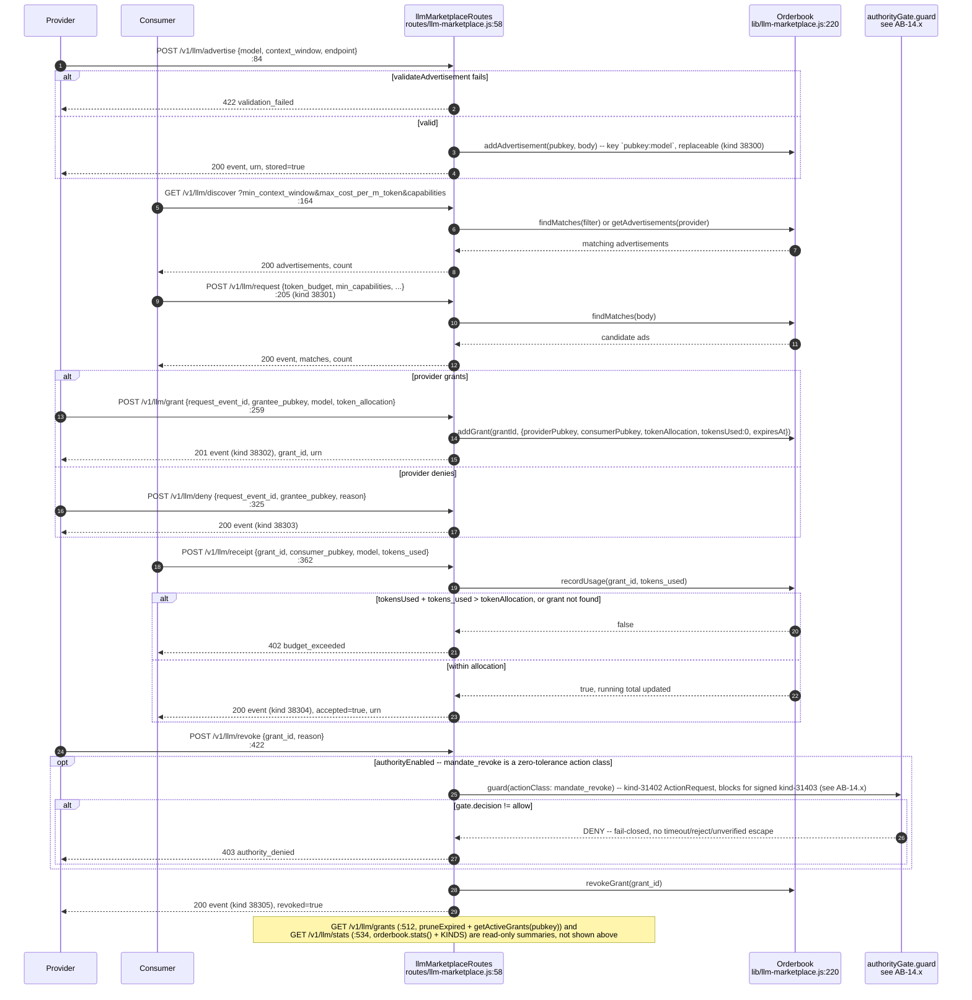

## AB-15.10 headroom compression-capacity model and its 3 MCP tools
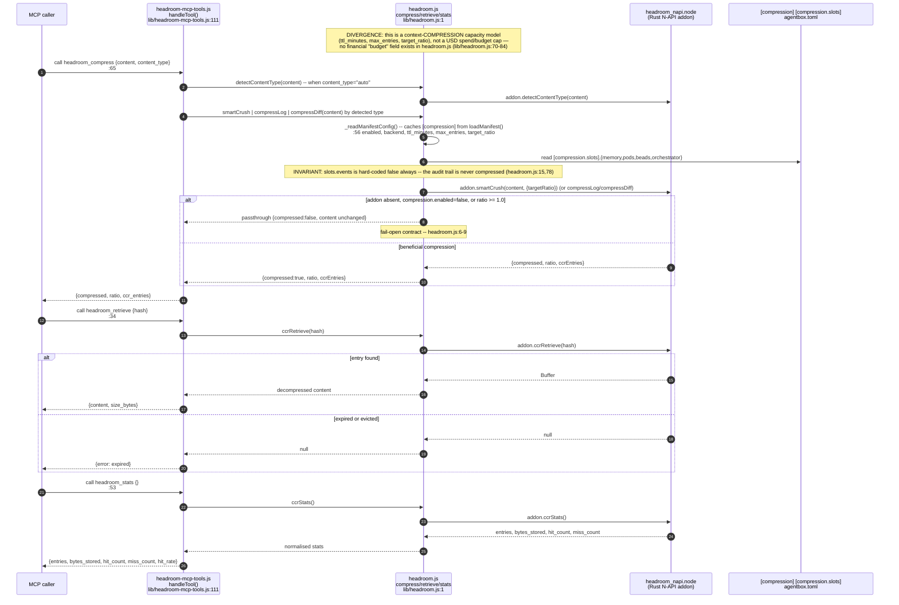

## AB-15.11 Consultant model projection at boot — env wins, TUI preserves (ADR-2031)
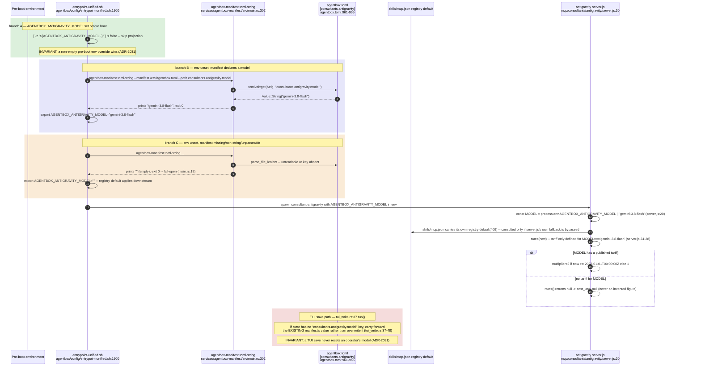

## AB-15.12 Consultant consult() call — consultant-base.js, model-diversity, memory-logger
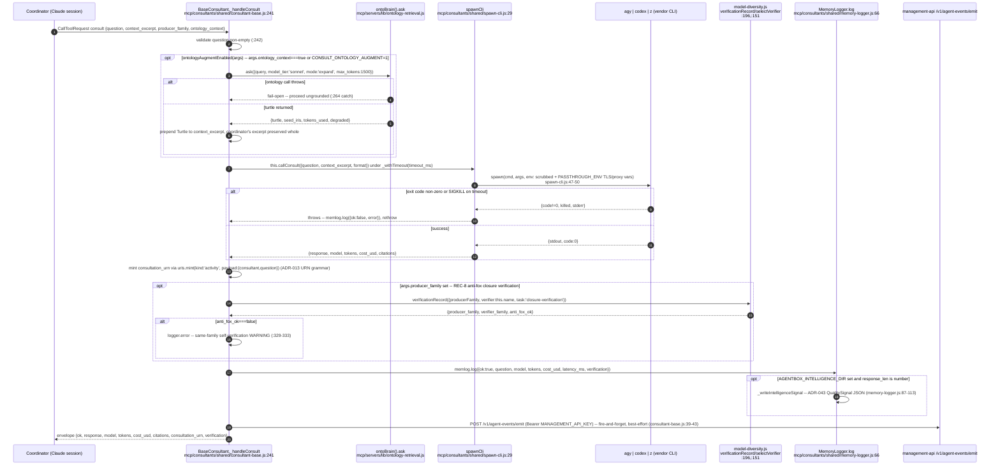

## AB-15.13 deepsec gate — invocation, route selection, egress bound
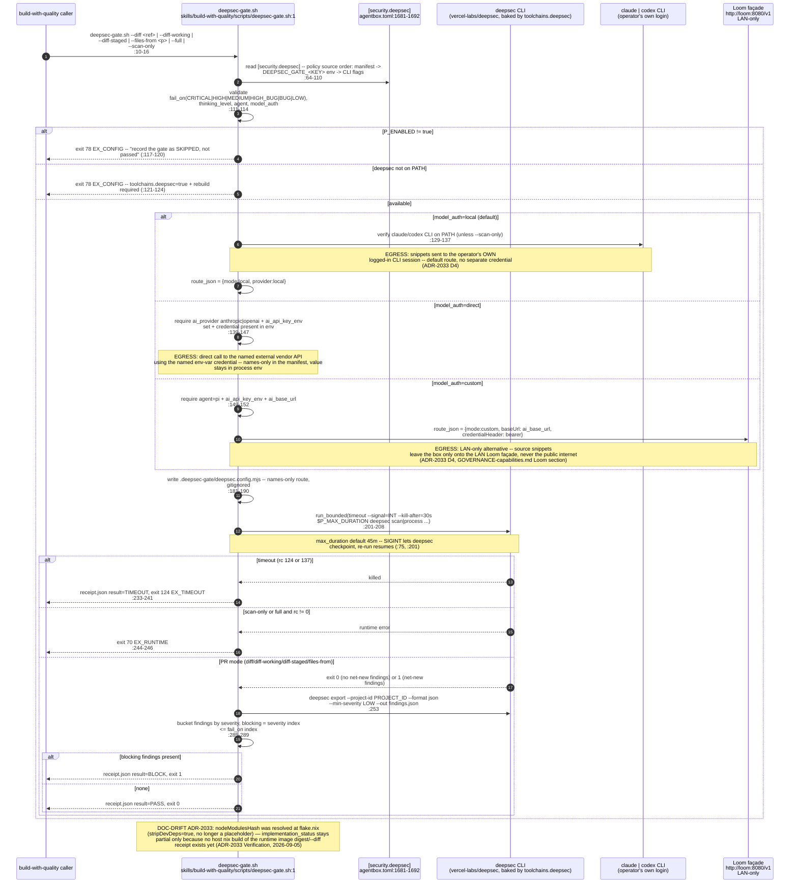

## AB-15.14 ADR-2080 — the metaharness router console gate (new since verified_commit)
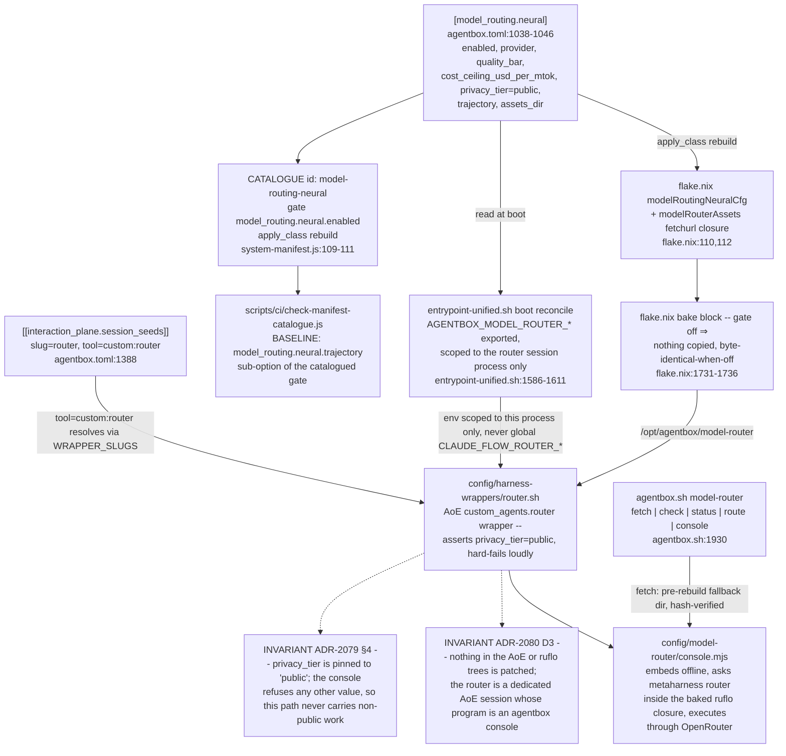

