## AB-16.1 Container hardening posture — what actually confines the box

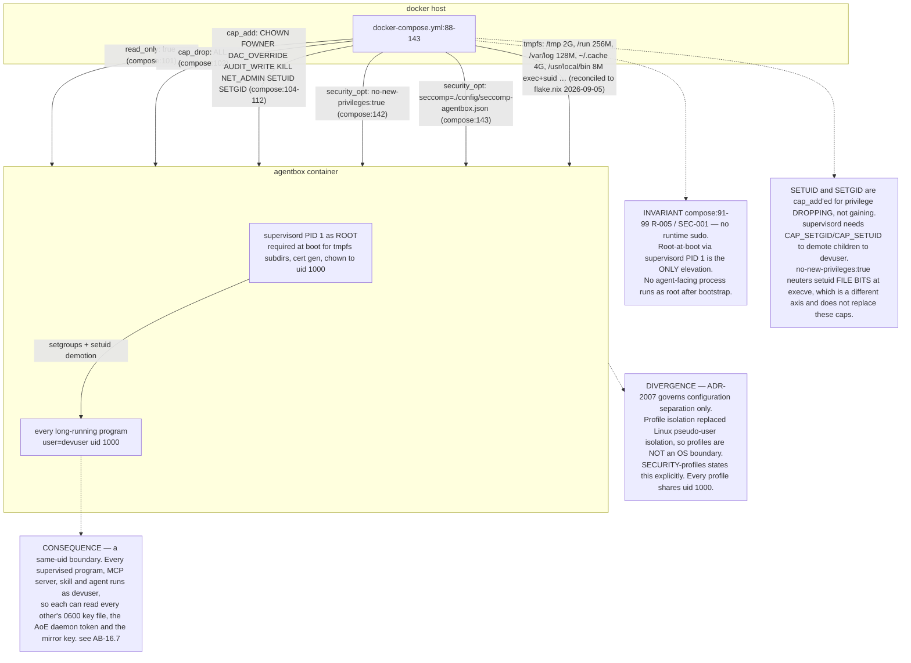

## AB-16.2 The seccomp profile is a supplemental denylist, not a sandbox

```mermaid
classDiagram
    class SeccompProfile {
        <<agentbox/config/seccomp-agentbox.json>>
        +string defaultAction
        +List~string~ architectures
        +List~SyscallRule~ syscalls
    }
    class RuleAfAlg {
        <<syscalls[0]>>
        +names socket
        +action SCMP_ACT_ERRNO
        +errnoRet 1
        +arg index 0 value 38 op SCMP_CMP_EQ
    }
    class RuleHighRisk {
        <<syscalls[1] — 46 names>>
        +action SCMP_ACT_ERRNO
        +errnoRet 1
        +args empty
    }
    class DockerDefault {
        <<overridden by explicit profile selection>>
        +not implicitly stacked
    }
    SeccompProfile --> RuleAfAlg
    SeccompProfile --> RuleHighRisk
    SeccompProfile ..> DockerDefault : explicit security_opt overrides default
    note for SeccompProfile "defaultAction = SCMP_ACT_ALLOW. This is INTENTIONALLY allow-by-default.<br/>The file calls itself supplemental, but explicit Docker security_opt selects it IN PLACE OF the default profile.<br/>An allowlist was REJECTED deliberately — the workload surface (Chromium, CUDA, Godot) is too wide to enumerate safely without breakage.<br/>architectures: SCMP_ARCH_X86_64, X86, AARCH64, ARM."
    note for RuleAfAlg "CVE-2026-31431 'Copy Fail' — blocks AF_ALG (family 38) socket creation,<br/>the algif_aead local privesc via splice(). Arg-indexed, so other socket families are unaffected."
    note for RuleHighRisk "add_key bpf clock_adjtime clock_settime create_module delete_module finit_module get_kernel_syms get_mempolicy<br/>init_module ioperm iopl kcmp kexec_file_load kexec_load keyctl lookup_dcookie mbind mount move_pages nfsservctl<br/>perf_event_open pivot_root process_vm_readv process_vm_writev ptrace query_module quotactl reboot request_key<br/>set_mempolicy setns settimeofday stime swapon swapoff sysfs _sysctl umount umount2 unshare uselib userfaultfd ustat vm86 vm86old"
    note for DockerDefault "DIVERGENCE — reading this file as the confinement boundary is wrong.<br/>Confinement comes from the COMBINATION: cap_drop ALL, read_only root, uid 1000, no-new-privileges,<br/>plus the selected custom seccomp profile and any independently configured host controls. Docker's default is not automatically stacked. see AB-16.1"
```

## AB-16.3 check-seccomp.sh — the invariant gate

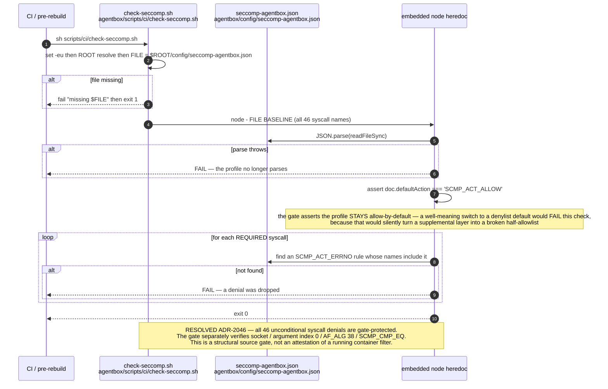

## AB-16.4 Boot privilege drop and the trust-seed hook

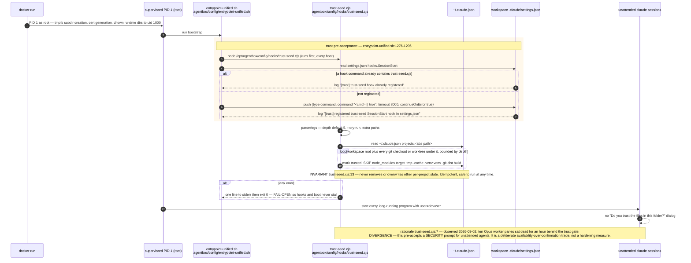

## AB-16.5 Derived keys — HMAC-SHA256 domain separation

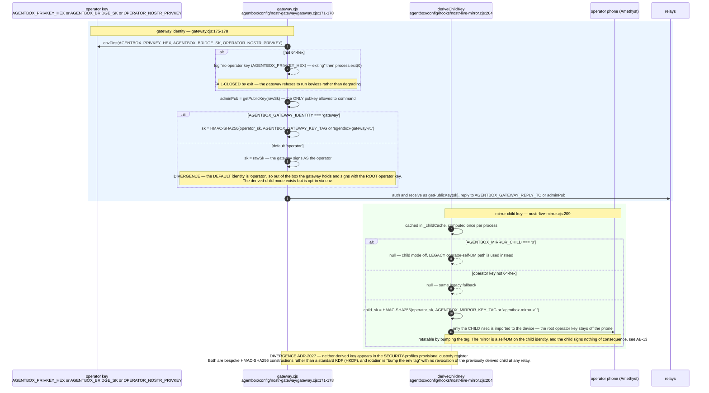

## AB-16.6 Break-glass — the least governed credential

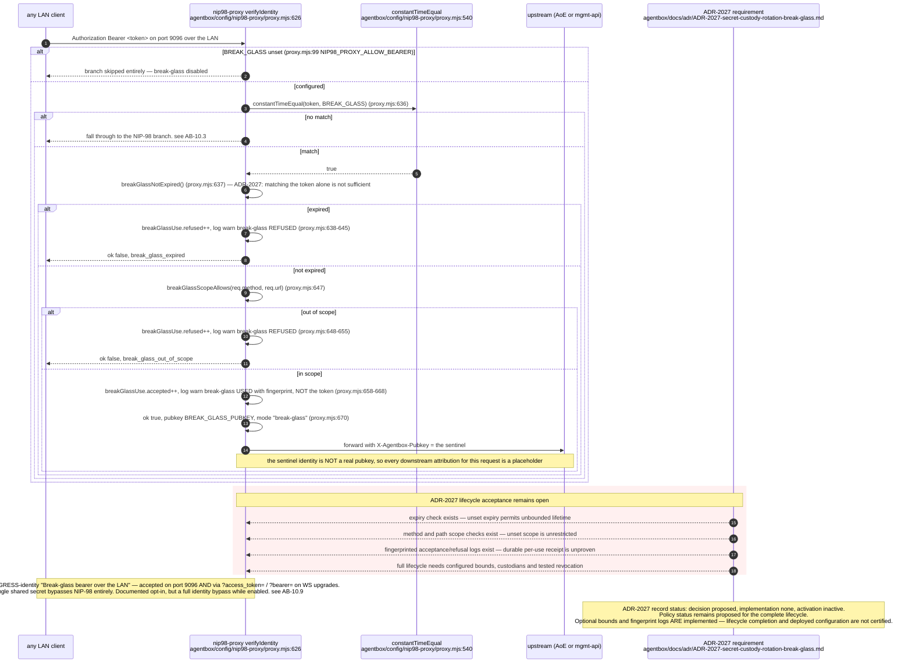

## AB-16.7 Key files at 0600 — what that boundary is and is not

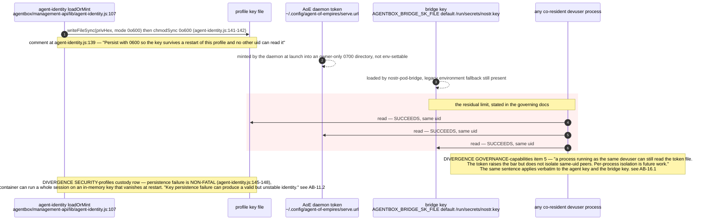

## AB-16.8 A secret's lifecycle — implemented versus proposed

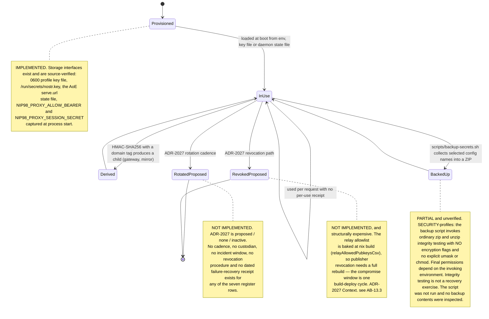

## AB-16.9 Provisional custody register — seven roles, zero confirmed custodians

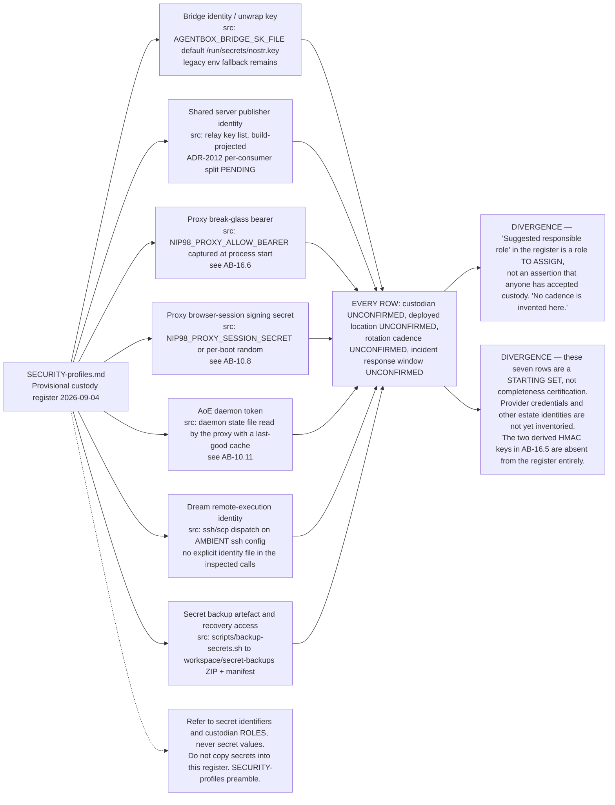

## AB-16.10 email-search — the owner-authorised break-glass tier

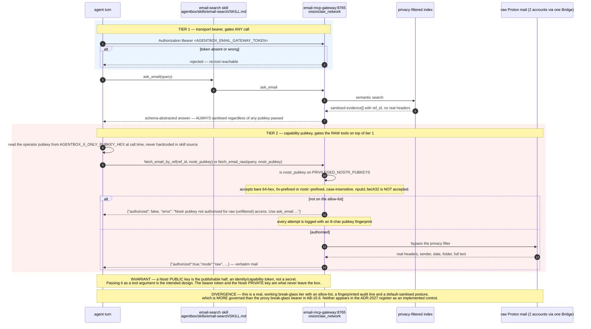

## AB-16.11 Egress profiles — mirror versus digest have different contracts

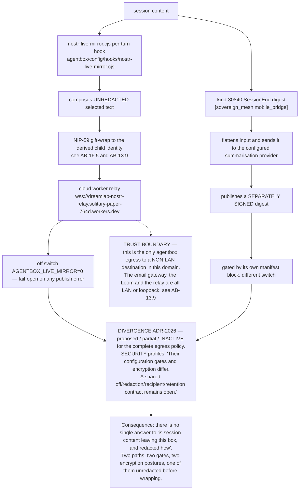

## Audit qualification — 2026-09-07

AB-16.2 corrects an upstream comment as well as the previous drawing: Docker explicitly selected seccomp profiles override the default; they are not automatically stacked ([Docker seccomp documentation](https://docs.docker.com/engine/security/seccomp/)). No running filter or credential contents were inspected. AB-16.3 passed `check-seccomp.sh` against the current source. The same-UID custody limitation remains. See [audit](../../estate-review/2026-09-07-agentbox-audit.md).

## AB-16.12 agentbox-secret-backup — an age-encrypted archive tool packaged for explicit invocation

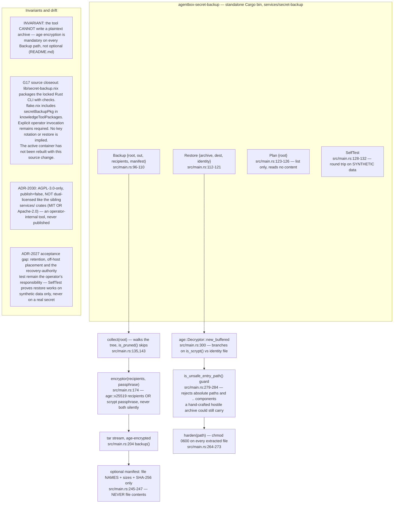
