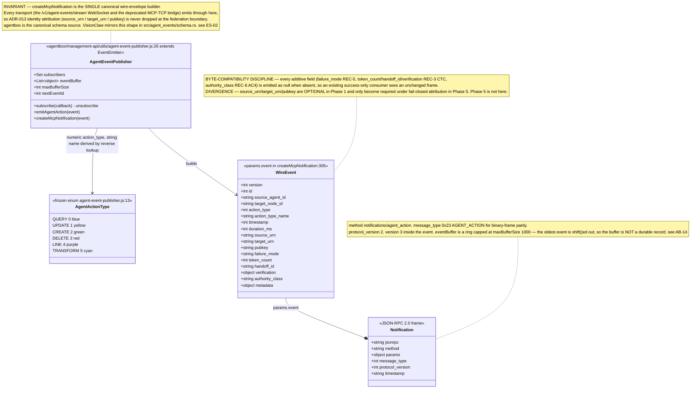
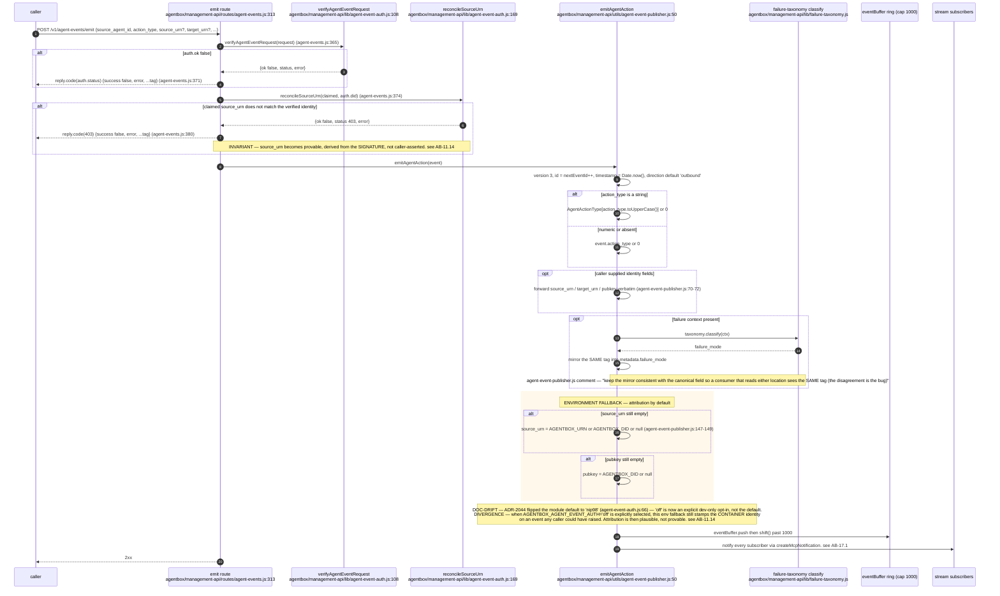
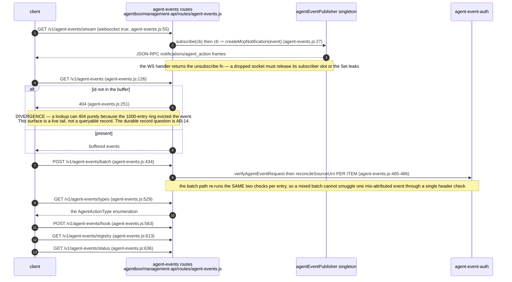
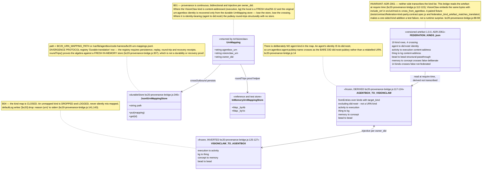
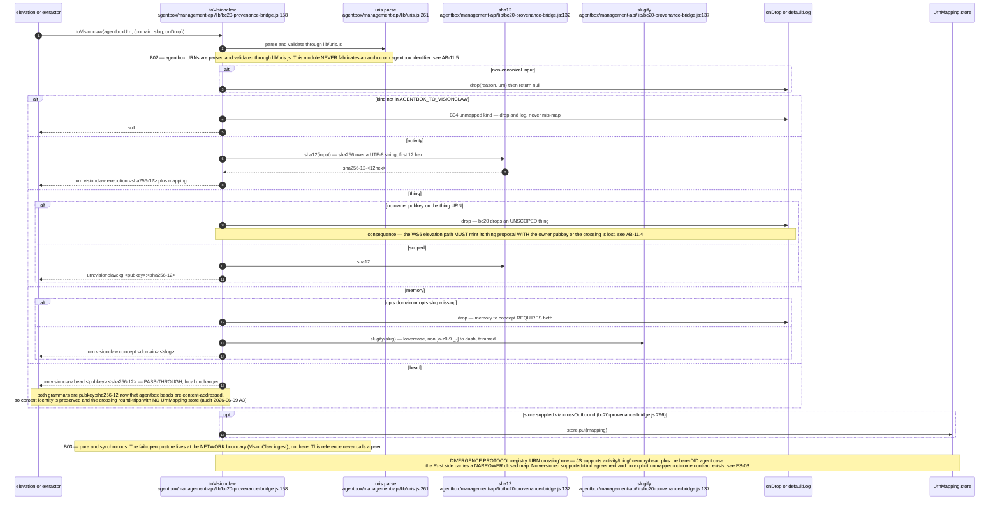
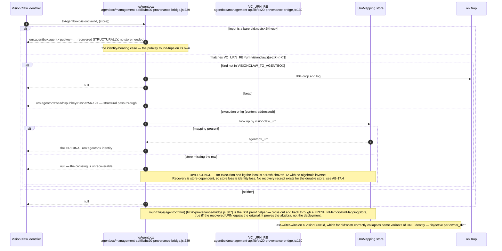
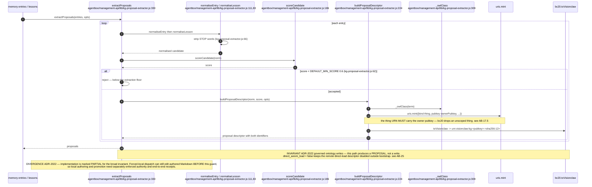
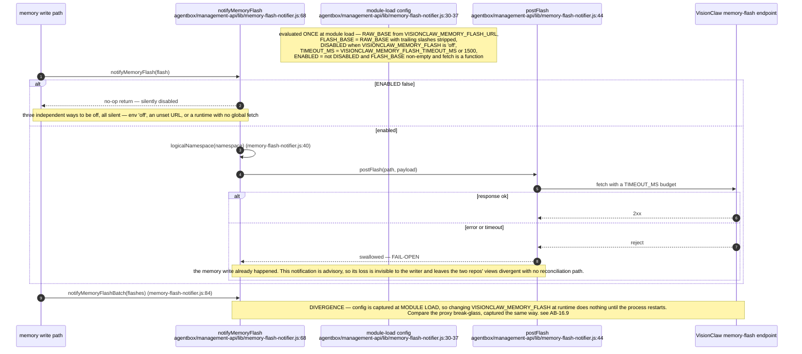
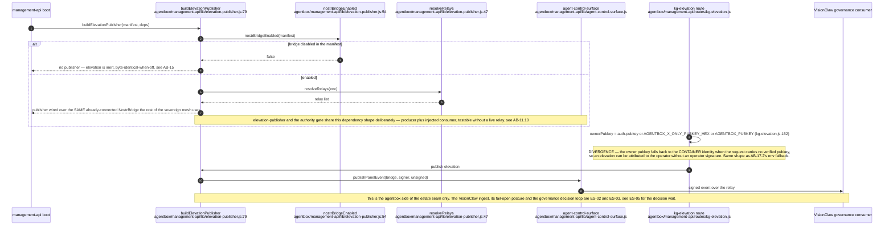
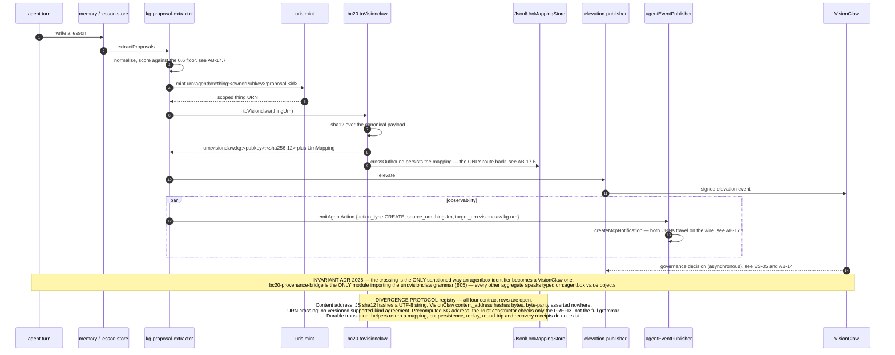

## AB-17.1 The agent-event wire envelope — single canonical builder

## AB-17.2 POST /v1/agent-events/emit — provable attribution

## AB-17.3 The rest of the agent-events surface

## AB-17.4 BC20 kind map — the closed cross-namespace contract

## AB-17.5 toVisionclaw — outbound crossing and its drops

## AB-17.6 toAgentbox — inbound recovery

## AB-17.7 kg-proposal-extractor — lessons to governed KG proposals

## AB-17.8 memory-flash-notifier — fail-open cross-repo notification

## AB-17.9 elevation-publisher — the outbound governance boundary

## AB-17.10 End-to-end — a lesson becoming a VisionClaw KG proposal

