## AB-20.1 Server boot — fail-closed on Postgres, advisory on Xinference

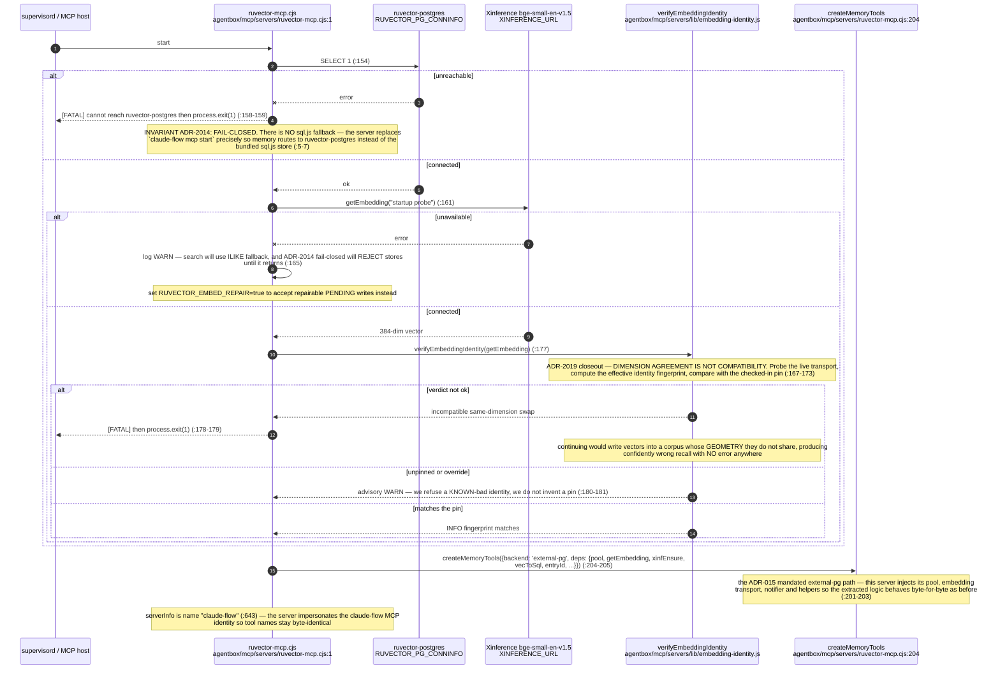

## AB-20.2 memory_store — the write path

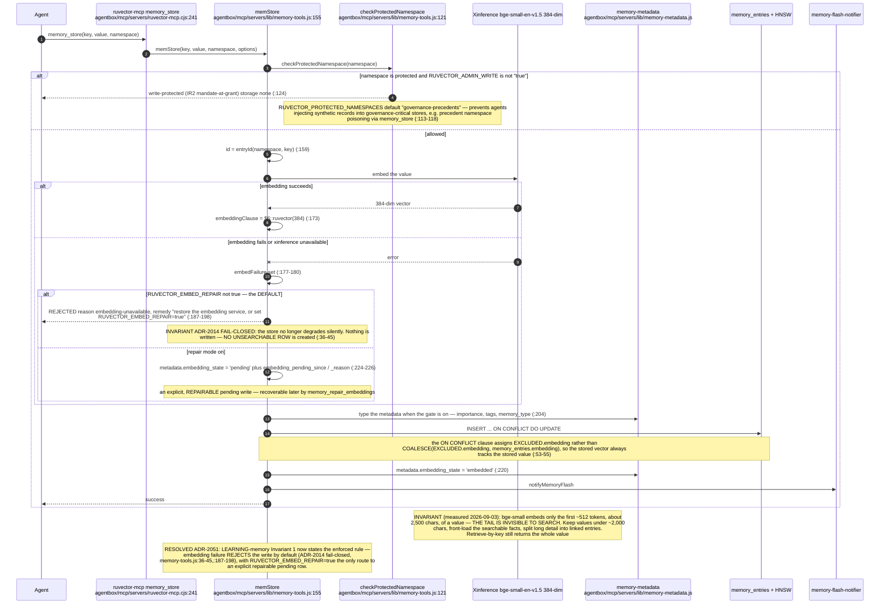

## AB-20.3 memory_search — vector ANN, namespace scope and the degraded fallback

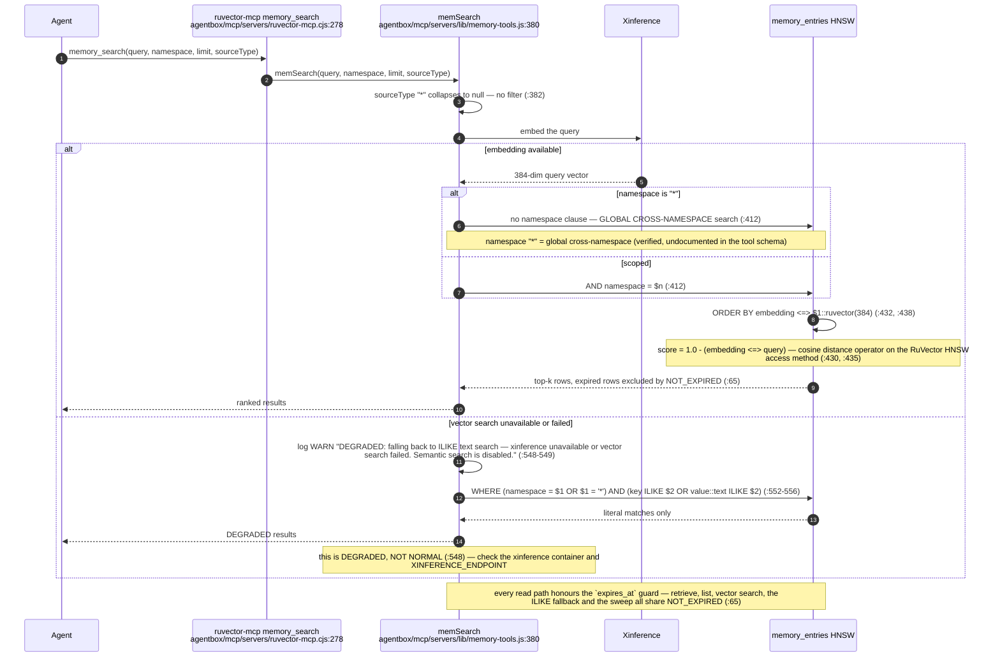

## AB-20.4 memory_retrieve and memory_list

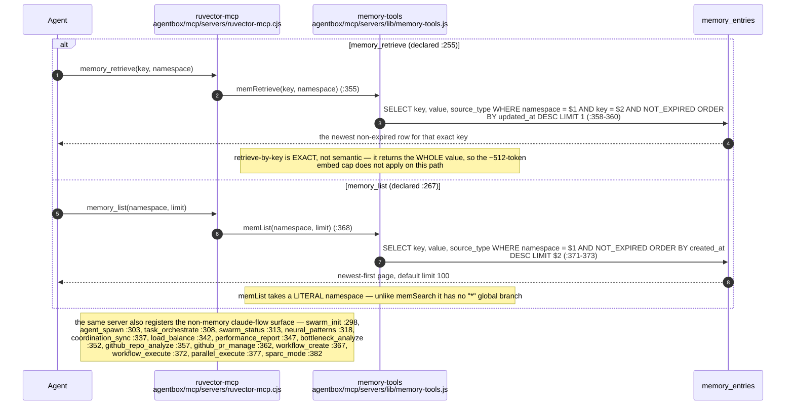

## AB-20.5 memory_hybrid_search

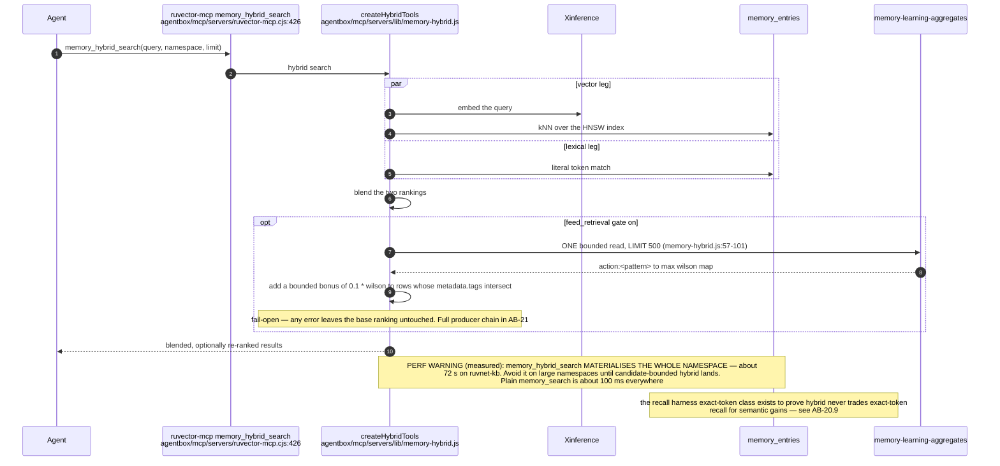

## AB-20.6 memory_orient — the OODA cold-start bundle

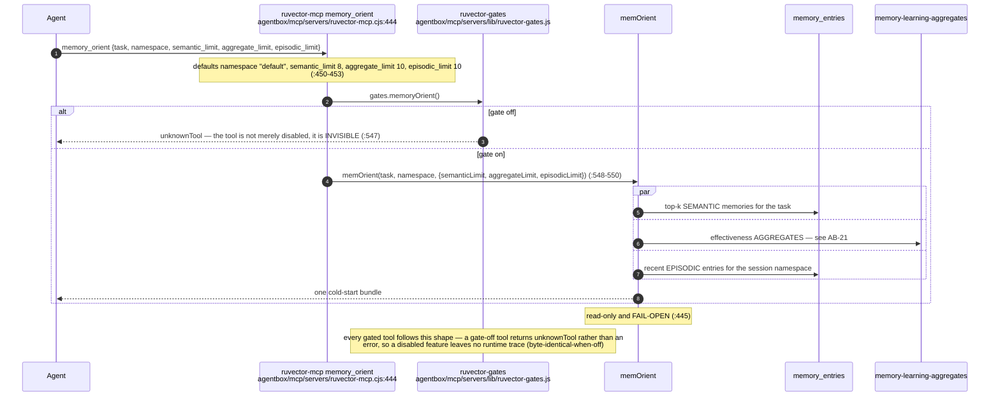

## AB-20.7 memory_sweep_episodic and memory_repair_embeddings

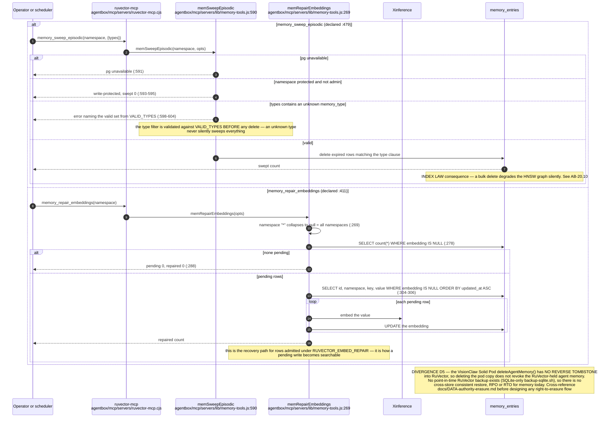

## AB-20.8 The FORBIDDEN write paths

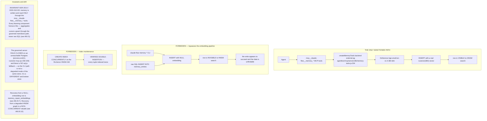

## AB-20.9 The recall harness — the geometry merge gate

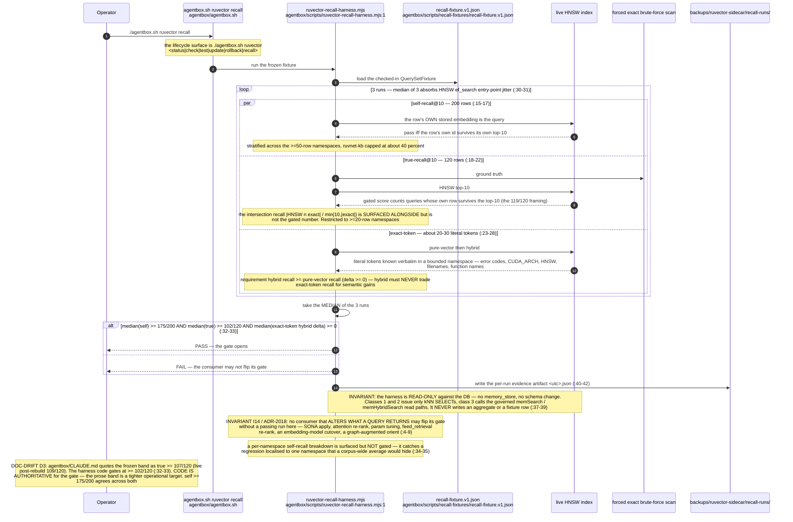

## AB-20.10 The index law

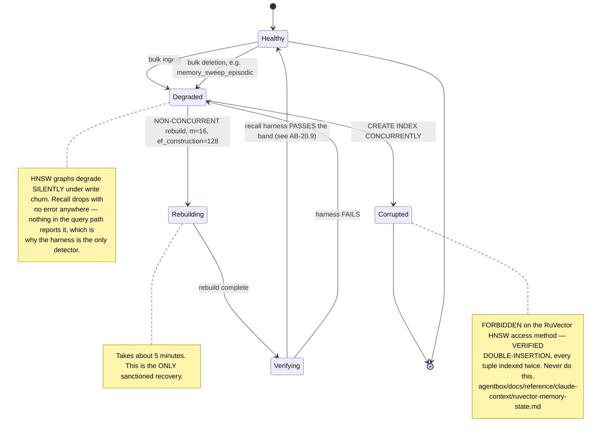

## AB-20.11 384-dim freeze and the inert SONA branch

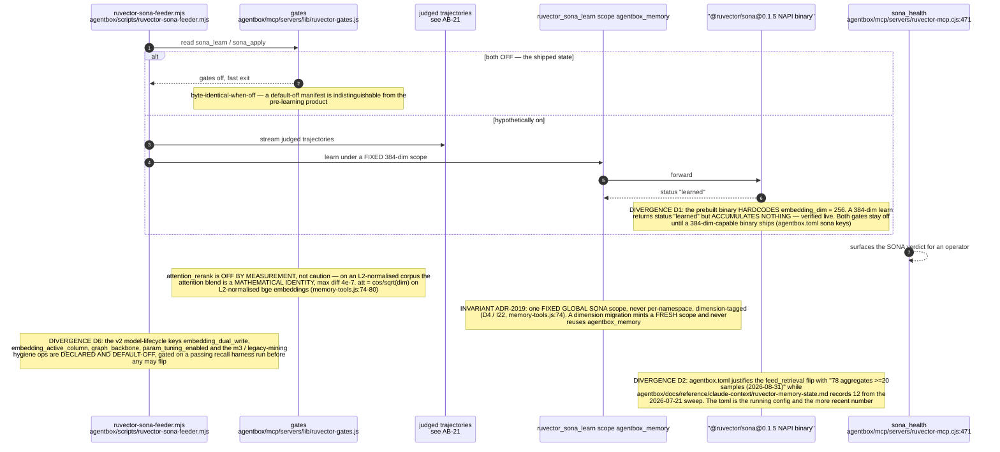

## AB-20.12 memory_health and the store schema

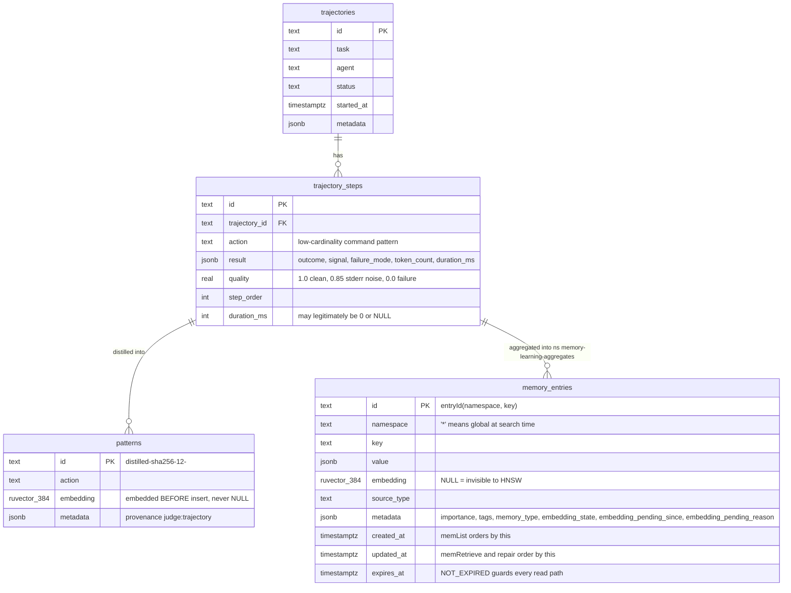
