## AB-20.1 Server boot — fail-closed on Postgres, advisory on Xinference

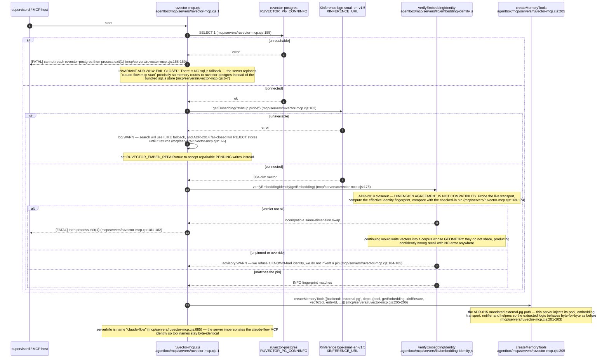
```mermaid
sequenceDiagram
    autonumber
    participant SUP as supervisord / MCP host
    participant SRV as ruvector-mcp.cjs<br/>agentbox/mcp/servers/ruvector-mcp.cjs:1
    participant PG as ruvector-postgres<br/>RUVECTOR_PG_CONNINFO
    participant XI as Xinference bge-small-en-v1.5<br/>XINFERENCE_URL
    participant EI as verifyEmbeddingIdentity<br/>agentbox/mcp/servers/lib/embedding-identity.js
    participant MT as createMemoryTools<br/>agentbox/mcp/servers/ruvector-mcp.cjs:205

    SUP->>SRV: start
    SRV->>PG: SELECT 1 (mcp/servers/ruvector-mcp.cjs:155)
    alt unreachable
        PG--xSRV: error
        SRV-->>SUP: [FATAL] cannot reach ruvector-postgres then process.exit(1) (mcp/servers/ruvector-mcp.cjs:158-159)
        Note over SRV: INVARIANT ADR-2014: FAIL-CLOSED. There is NO sql.js fallback — the server replaces<br/>`claude-flow mcp start` precisely so memory routes to ruvector-postgres instead of the<br/>bundled sql.js store (mcp/servers/ruvector-mcp.cjs:6-7)
    else connected
        PG-->>SRV: ok
        SRV->>XI: getEmbedding("startup probe") (mcp/servers/ruvector-mcp.cjs:162)
        alt unavailable
            XI--xSRV: error
            SRV->>SRV: log WARN — search will use ILIKE fallback, and ADR-2014 fail-closed will REJECT stores<br/>until it returns (mcp/servers/ruvector-mcp.cjs:166)
            Note over SRV: set RUVECTOR_EMBED_REPAIR=true to accept repairable PENDING writes instead
        else connected
            XI-->>SRV: 384-dim vector
            SRV->>EI: verifyEmbeddingIdentity(getEmbedding) (mcp/servers/ruvector-mcp.cjs:178)
            Note over EI: ADR-2019 closeout — DIMENSION AGREEMENT IS NOT COMPATIBILITY. Probe the live transport,<br/>compute the effective identity fingerprint, compare with the checked-in pin (mcp/servers/ruvector-mcp.cjs:169-174)
            alt verdict not ok
                EI-->>SRV: incompatible same-dimension swap
                SRV-->>SUP: [FATAL] then process.exit(1) (mcp/servers/ruvector-mcp.cjs:181-182)
                Note over EI: continuing would write vectors into a corpus whose GEOMETRY they do not share, producing<br/>confidently wrong recall with NO error anywhere
            else unpinned or override
                EI-->>SRV: advisory WARN — we refuse a KNOWN-bad identity, we do not invent a pin (mcp/servers/ruvector-mcp.cjs:184-185)
            else matches the pin
                EI-->>SRV: INFO fingerprint matches
            end
        end
    end
    SRV->>MT: createMemoryTools({backend: 'external-pg', deps: {pool, getEmbedding, xinfEnsure,<br/>vecToSql, entryId, ...}}) (mcp/servers/ruvector-mcp.cjs:205-206)
    Note over MT: the ADR-015 mandated external-pg path — this server injects its pool, embedding<br/>transport, notifier and helpers so the extracted logic behaves byte-for-byte as before<br/>(mcp/servers/ruvector-mcp.cjs:201-203)
    Note over SRV: serverInfo is name "claude-flow" (mcp/servers/ruvector-mcp.cjs:685) — the server impersonates the claude-flow MCP<br/>identity so tool names stay byte-identical
```

## AB-20.2 memory_store — the write path

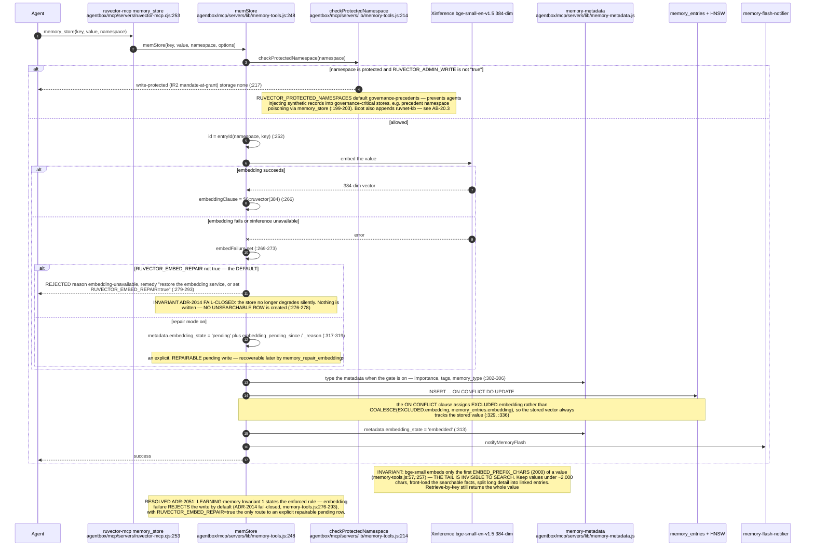
```mermaid
sequenceDiagram
    autonumber
    participant AG as Agent
    participant SRV as ruvector-mcp memory_store<br/>agentbox/mcp/servers/ruvector-mcp.cjs:253
    participant MS as memStore<br/>agentbox/mcp/servers/lib/memory-tools.js:248
    participant PROT as checkProtectedNamespace<br/>agentbox/mcp/servers/lib/memory-tools.js:214
    participant XI as Xinference bge-small-en-v1.5 384-dim
    participant MD as memory-metadata<br/>agentbox/mcp/servers/lib/memory-metadata.js
    participant PG as memory_entries + HNSW
    participant NOT as memory-flash-notifier

    AG->>SRV: memory_store(key, value, namespace)
    SRV->>MS: memStore(key, value, namespace, options)
    MS->>PROT: checkProtectedNamespace(namespace)
    alt namespace is protected and RUVECTOR_ADMIN_WRITE is not "true"
        PROT-->>AG: write-protected (IR2 mandate-at-grant) storage none (:217)
        Note over PROT: RUVECTOR_PROTECTED_NAMESPACES default governance-precedents — prevents agents<br/>injecting synthetic records into governance-critical stores, e.g. precedent namespace<br/>poisoning via memory_store (:199-203). Boot also appends ruvnet-kb — see AB-20.3
    else allowed
        MS->>MS: id = entryId(namespace, key) (:252)
        MS->>XI: embed the value
        alt embedding succeeds
            XI-->>MS: 384-dim vector
            MS->>MS: embeddingClause = $6::ruvector(384) (:266)
        else embedding fails or xinference unavailable
            XI--xMS: error
            MS->>MS: embedFailure set (:269-273)
            alt RUVECTOR_EMBED_REPAIR not true — the DEFAULT
                MS-->>AG: REJECTED reason embedding-unavailable, remedy "restore the embedding service, or set<br/>RUVECTOR_EMBED_REPAIR=true" (:279-293)
                Note over MS: INVARIANT ADR-2014 FAIL-CLOSED: the store no longer degrades silently. Nothing is<br/>written — NO UNSEARCHABLE ROW is created (:276-278)
            else repair mode on
                MS->>MS: metadata.embedding_state = 'pending' plus embedding_pending_since / _reason (:317-319)
                Note over MS: an explicit, REPAIRABLE pending write — recoverable later by memory_repair_embeddings
            end
        end
        MS->>MD: type the metadata when the gate is on — importance, tags, memory_type (:302-306)
        MS->>PG: INSERT ... ON CONFLICT DO UPDATE
        Note over MS,PG: the ON CONFLICT clause assigns EXCLUDED.embedding rather than<br/>COALESCE(EXCLUDED.embedding, memory_entries.embedding), so the stored vector always<br/>tracks the stored value (:329, :336)
        MS->>MD: metadata.embedding_state = 'embedded' (:313)
        MS->>NOT: notifyMemoryFlash
        MS-->>AG: success
    end
    Note over XI: INVARIANT: bge-small embeds only the first EMBED_PREFIX_CHARS (2000) of a value<br/>(memory-tools.js:57,:257) — THE TAIL IS INVISIBLE TO SEARCH. Keep values under ~2,000<br/>chars, front-load the searchable facts, split long detail into linked entries.<br/>Retrieve-by-key still returns the whole value
    Note over MS: RESOLVED ADR-2051: LEARNING-memory Invariant 1 states the enforced rule — embedding<br/>failure REJECTS the write by default (ADR-2014 fail-closed, memory-tools.js:276-293),<br/>with RUVECTOR_EMBED_REPAIR=true the only route to an explicit repairable pending row.
```

## AB-20.3 memory_search — vector ANN, wildcard namespace exclusion, output shaping and the degraded fallback

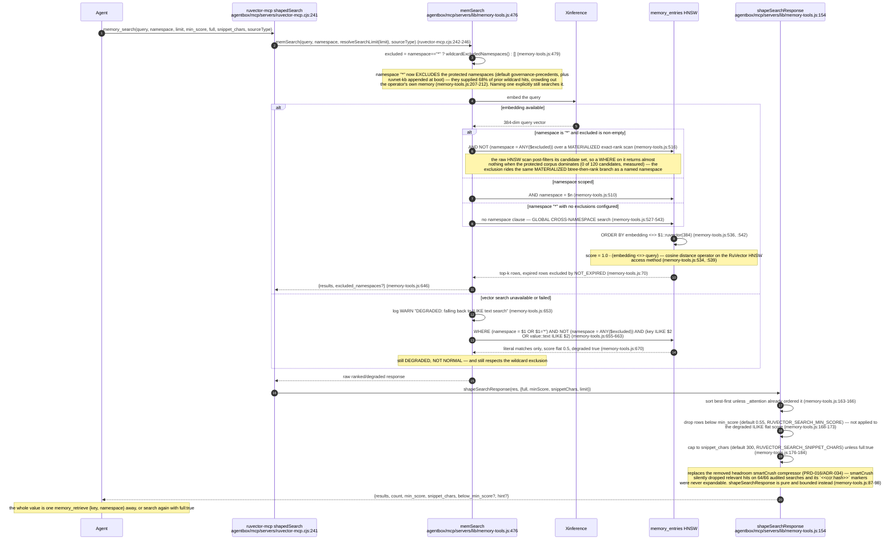
```mermaid
sequenceDiagram
    autonumber
    participant AG as Agent
    participant SRV as ruvector-mcp shapedSearch<br/>agentbox/mcp/servers/ruvector-mcp.cjs:241
    participant MS as memSearch<br/>agentbox/mcp/servers/lib/memory-tools.js:476
    participant XI as Xinference
    participant PG as memory_entries HNSW
    participant SH as shapeSearchResponse<br/>agentbox/mcp/servers/lib/memory-tools.js:154

    AG->>SRV: memory_search(query, namespace, limit, min_score, full, snippet_chars, sourceType)
    SRV->>MS: memSearch(query, namespace, resolveSearchLimit(limit), sourceType) (ruvector-mcp.cjs:242-246)
    MS->>MS: excluded = namespace=="*" ? wildcardExcludedNamespaces() : [] (memory-tools.js:479)
    Note over MS: namespace "*" now EXCLUDES the protected namespaces (default governance-precedents, plus<br/>ruvnet-kb appended at boot) — they supplied 68% of prior wildcard hits, crowding out<br/>the operator's own memory (memory-tools.js:207-212). Naming one explicitly still searches it.
    MS->>XI: embed the query
    alt embedding available
        XI-->>MS: 384-dim query vector
        alt namespace is "*" and excluded is non-empty
            MS->>PG: AND NOT (namespace = ANY($excluded)) over a MATERIALIZED exact-rank scan (memory-tools.js:516)
            Note over MS,PG: the raw HNSW scan post-filters its candidate set, so a WHERE on it returns almost<br/>nothing when the protected corpus dominates (0 of 120 candidates, measured) — the<br/>exclusion rides the same MATERIALIZED btree-then-rank branch as a named namespace
        else namespace scoped
            MS->>PG: AND namespace = $n (memory-tools.js:510)
        else namespace "*" with no exclusions configured
            MS->>PG: no namespace clause — GLOBAL CROSS-NAMESPACE search (memory-tools.js:527-543)
        end
        PG->>PG: ORDER BY embedding <=> $1::ruvector(384) (memory-tools.js:536, :542)
        Note over PG: score = 1.0 - (embedding <=> query) — cosine distance operator on the RuVector HNSW<br/>access method (memory-tools.js:534, :539)
        PG-->>MS: top-k rows, expired rows excluded by NOT_EXPIRED (memory-tools.js:70)
        MS-->>SRV: {results, excluded_namespaces?} (memory-tools.js:646)
    else vector search unavailable or failed
        MS->>MS: log WARN "DEGRADED: falling back to ILIKE text search" (memory-tools.js:653)
        MS->>PG: WHERE (namespace = $1 OR $1='*') AND NOT (namespace = ANY($excluded)) AND (key ILIKE $2<br/>OR value::text ILIKE $2) (memory-tools.js:655-663)
        PG-->>MS: literal matches only, score flat 0.5, degraded true (memory-tools.js:670)
        Note over MS: still DEGRADED, NOT NORMAL — and still respects the wildcard exclusion
    end
    MS-->>SRV: raw ranked/degraded response
    SRV->>SH: shapeSearchResponse(res, {full, minScore, snippetChars, limit})
    SH->>SH: sort best-first unless _attention already ordered it (memory-tools.js:163-166)
    SH->>SH: drop rows below min_score (default 0.55, RUVECTOR_SEARCH_MIN_SCORE) — not applied to<br/>the degraded ILIKE flat score (memory-tools.js:168-173)
    SH->>SH: cap to snippet_chars (default 300, RUVECTOR_SEARCH_SNIPPET_CHARS) unless full:true<br/>(memory-tools.js:176-184)
    Note over SH: replaces the removed headroom smartCrush compressor (PRD-016/ADR-034) — smartCrush<br/>silently dropped relevant hits on 64/66 audited searches and its `<<ccr:hash>>` markers<br/>were never expandable. shapeSearchResponse is pure and bounded instead (memory-tools.js:87-98)
    SH-->>AG: {results, count, min_score, snippet_chars, below_min_score?, hint?}
    Note over AG: the whole value is one memory_retrieve {key, namespace} away, or search again with full:true
```

## AB-20.4 memory_retrieve and memory_list

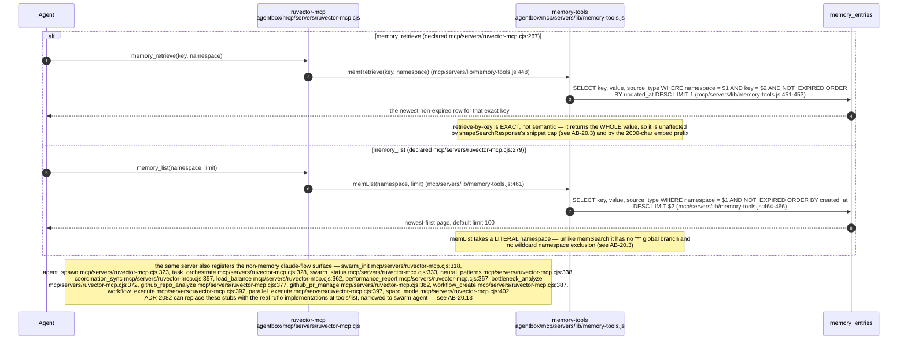
```mermaid
sequenceDiagram
    autonumber
    participant AG as Agent
    participant SRV as ruvector-mcp<br/>agentbox/mcp/servers/ruvector-mcp.cjs
    participant MT as memory-tools<br/>agentbox/mcp/servers/lib/memory-tools.js
    participant PG as memory_entries

    alt memory_retrieve (declared mcp/servers/ruvector-mcp.cjs:267)
        AG->>SRV: memory_retrieve(key, namespace)
        SRV->>MT: memRetrieve(key, namespace) (mcp/servers/lib/memory-tools.js:448)
        MT->>PG: SELECT key, value, source_type WHERE namespace = $1 AND key = $2 AND NOT_EXPIRED ORDER<br/>BY updated_at DESC LIMIT 1 (mcp/servers/lib/memory-tools.js:451-453)
        PG-->>AG: the newest non-expired row for that exact key
        Note over MT: retrieve-by-key is EXACT, not semantic — it returns the WHOLE value, so it is unaffected<br/>by shapeSearchResponse's snippet cap (see AB-20.3) and by the 2000-char embed prefix
    else memory_list (declared mcp/servers/ruvector-mcp.cjs:279)
        AG->>SRV: memory_list(namespace, limit)
        SRV->>MT: memList(namespace, limit) (mcp/servers/lib/memory-tools.js:461)
        MT->>PG: SELECT key, value, source_type WHERE namespace = $1 AND NOT_EXPIRED ORDER BY created_at<br/>DESC LIMIT $2 (mcp/servers/lib/memory-tools.js:464-466)
        PG-->>AG: newest-first page, default limit 100
        Note over MT: memList takes a LITERAL namespace — unlike memSearch it has no "*" global branch and<br/>no wildcard namespace exclusion (see AB-20.3)
    end
    Note over SRV: the same server also registers the non-memory claude-flow surface — swarm_init mcp/servers/ruvector-mcp.cjs:318,<br/>agent_spawn mcp/servers/ruvector-mcp.cjs:323, task_orchestrate mcp/servers/ruvector-mcp.cjs:328, swarm_status mcp/servers/ruvector-mcp.cjs:333, neural_patterns mcp/servers/ruvector-mcp.cjs:338,<br/>coordination_sync mcp/servers/ruvector-mcp.cjs:357, load_balance mcp/servers/ruvector-mcp.cjs:362, performance_report mcp/servers/ruvector-mcp.cjs:367, bottleneck_analyze<br/>mcp/servers/ruvector-mcp.cjs:372, github_repo_analyze mcp/servers/ruvector-mcp.cjs:377, github_pr_manage mcp/servers/ruvector-mcp.cjs:382, workflow_create mcp/servers/ruvector-mcp.cjs:387,<br/>workflow_execute mcp/servers/ruvector-mcp.cjs:392, parallel_execute mcp/servers/ruvector-mcp.cjs:397, sparc_mode mcp/servers/ruvector-mcp.cjs:402<br/>ADR-2082 can replace these stubs with the real ruflo implementations at tools/list, narrowed to swarm,agent — see AB-20.13
```

## AB-20.5 memory_hybrid_search

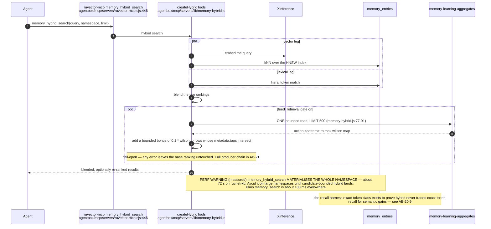
```mermaid
sequenceDiagram
    autonumber
    participant AG as Agent
    participant SRV as ruvector-mcp memory_hybrid_search<br/>agentbox/mcp/servers/ruvector-mcp.cjs:446
    participant HY as createHybridTools<br/>agentbox/mcp/servers/lib/memory-hybrid.js
    participant XI as Xinference
    participant PG as memory_entries
    participant AGG as memory-learning-aggregates

    AG->>SRV: memory_hybrid_search(query, namespace, limit)
    SRV->>HY: hybrid search
    par vector leg
        HY->>XI: embed the query
        HY->>PG: kNN over the HNSW index
    and lexical leg
        HY->>PG: literal token match
    end
    HY->>HY: blend the two rankings
    opt feed_retrieval gate on
        HY->>AGG: ONE bounded read, LIMIT 500 (memory-hybrid.js:77-91)
        AGG-->>HY: action:<pattern> to max wilson map
        HY->>HY: add a bounded bonus of 0.1 * wilson to rows whose metadata.tags intersect
        Note over HY: fail-open — any error leaves the base ranking untouched. Full producer chain in AB-21
    end
    HY-->>AG: blended, optionally re-ranked results
    Note over HY,PG: PERF WARNING (measured): memory_hybrid_search MATERIALISES THE WHOLE NAMESPACE — about<br/>72 s on ruvnet-kb. Avoid it on large namespaces until candidate-bounded hybrid lands.<br/>Plain memory_search is about 100 ms everywhere
    Note over PG: the recall harness exact-token class exists to prove hybrid never trades exact-token<br/>recall for semantic gains — see AB-20.9
```

## AB-20.6 memory_orient — the OODA cold-start bundle

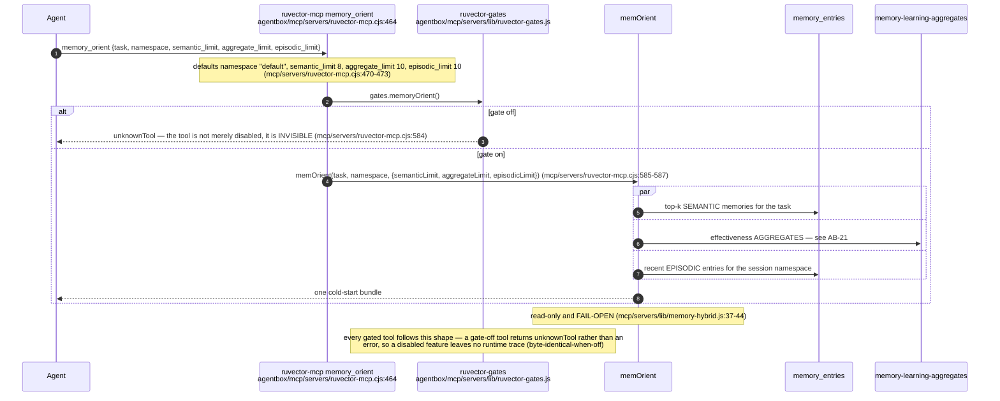
```mermaid
sequenceDiagram
    autonumber
    participant AG as Agent
    participant SRV as ruvector-mcp memory_orient<br/>agentbox/mcp/servers/ruvector-mcp.cjs:464
    participant G as ruvector-gates<br/>agentbox/mcp/servers/lib/ruvector-gates.js
    participant OR as memOrient
    participant PG as memory_entries
    participant AGG as memory-learning-aggregates

    AG->>SRV: memory_orient {task, namespace, semantic_limit, aggregate_limit, episodic_limit}
    Note over SRV: defaults namespace "default", semantic_limit 8, aggregate_limit 10, episodic_limit 10<br/>(mcp/servers/ruvector-mcp.cjs:470-473)
    SRV->>G: gates.memoryOrient()
    alt gate off
        G-->>AG: unknownTool — the tool is not merely disabled, it is INVISIBLE (mcp/servers/ruvector-mcp.cjs:584)
    else gate on
        SRV->>OR: memOrient(task, namespace, {semanticLimit, aggregateLimit, episodicLimit}) (mcp/servers/ruvector-mcp.cjs:585-587)
        par
            OR->>PG: top-k SEMANTIC memories for the task
        and
            OR->>AGG: effectiveness AGGREGATES — see AB-21
        and
            OR->>PG: recent EPISODIC entries for the session namespace
        end
        OR-->>AG: one cold-start bundle
    end
    Note over OR: read-only and FAIL-OPEN (mcp/servers/lib/memory-hybrid.js:37-44)
    Note over G: every gated tool follows this shape — a gate-off tool returns unknownTool rather than an<br/>error, so a disabled feature leaves no runtime trace (byte-identical-when-off)
```

## AB-20.7 memory_sweep_episodic and memory_repair_embeddings

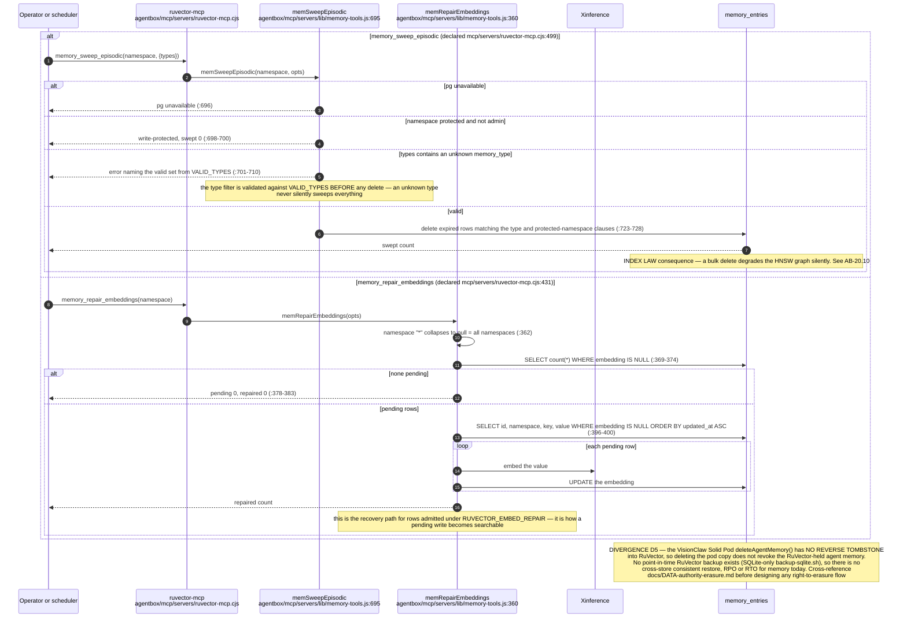
```mermaid
sequenceDiagram
    autonumber
    participant OP as Operator or scheduler
    participant SRV as ruvector-mcp<br/>agentbox/mcp/servers/ruvector-mcp.cjs
    participant SW as memSweepEpisodic<br/>agentbox/mcp/servers/lib/memory-tools.js:695
    participant RP as memRepairEmbeddings<br/>agentbox/mcp/servers/lib/memory-tools.js:360
    participant XI as Xinference
    participant PG as memory_entries

    alt memory_sweep_episodic (declared mcp/servers/ruvector-mcp.cjs:499)
        OP->>SRV: memory_sweep_episodic(namespace, {types})
        SRV->>SW: memSweepEpisodic(namespace, opts)
        alt pg unavailable
            SW-->>OP: pg unavailable (:696)
        else namespace protected and not admin
            SW-->>OP: write-protected, swept 0 (:698-700)
        else types contains an unknown memory_type
            SW-->>OP: error naming the valid set from VALID_TYPES (:701-710)
            Note over SW: the type filter is validated against VALID_TYPES BEFORE any delete — an unknown type<br/>never silently sweeps everything
        else valid
            SW->>PG: delete expired rows matching the type and protected-namespace clauses (:723-728)
            PG-->>OP: swept count
            Note over PG: INDEX LAW consequence — a bulk delete degrades the HNSW graph silently. See AB-20.10
        end
    else memory_repair_embeddings (declared mcp/servers/ruvector-mcp.cjs:431)
        OP->>SRV: memory_repair_embeddings(namespace)
        SRV->>RP: memRepairEmbeddings(opts)
        RP->>RP: namespace "*" collapses to null = all namespaces (:362)
        RP->>PG: SELECT count(*) WHERE embedding IS NULL (:369-374)
        alt none pending
            RP-->>OP: pending 0, repaired 0 (:378-383)
        else pending rows
            RP->>PG: SELECT id, namespace, key, value WHERE embedding IS NULL ORDER BY updated_at ASC<br/>(:396-400)
            loop each pending row
                RP->>XI: embed the value
                RP->>PG: UPDATE the embedding
            end
            RP-->>OP: repaired count
            Note over RP: this is the recovery path for rows admitted under RUVECTOR_EMBED_REPAIR — it is how a<br/>pending write becomes searchable
        end
    end
    Note over PG: DIVERGENCE D5 — the VisionClaw Solid Pod deleteAgentMemory() has NO REVERSE TOMBSTONE<br/>into RuVector, so deleting the pod copy does not revoke the RuVector-held agent memory.<br/>No point-in-time RuVector backup exists (SQLite-only backup-sqlite.sh), so there is no<br/>cross-store consistent restore, RPO or RTO for memory today. Cross-reference<br/>docs/DATA-authority-erasure.md before designing any right-to-erasure flow
```

## AB-20.8 The FORBIDDEN write paths

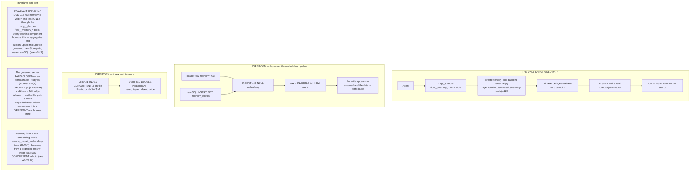
```mermaid
flowchart TB
    subgraph ok["THE ONLY SANCTIONED PATH"]
        A["Agent"] --> B["mcp__claude-flow__memory_* MCP tools"]
        B --> C["createMemoryTools backend external-pg<br/>agentbox/mcp/servers/lib/memory-tools.js:228"]
        C --> D["Xinference bge-small-en-v1.5 384-dim"]
        D --> E["INSERT with a real ruvector(384) vector"]
        E --> F["row is VISIBLE to HNSW search"]
    end
    subgraph bad["FORBIDDEN — bypasses the embedding pipeline"]
        G["claude-flow memory * CLI"] --> I["INSERT with NULL embedding"]
        H["raw SQL INSERT INTO memory_entries"] --> I
        I --> J["row is INVISIBLE to HNSW search"]
        J --> K["the write appears to succeed and the data is unfindable"]
    end
    subgraph idx["FORBIDDEN — index maintenance"]
        L["CREATE INDEX CONCURRENTLY on the RuVector HNSW AM"] --> M["VERIFIED DOUBLE-INSERTION —<br/>every tuple indexed twice"]
    end
    subgraph notes["Invariants and drift"]
        direction TB
        N1["INVARIANT ADR-2014 / DDD-016 I03: memory is written and read ONLY through the<br/>mcp__claude-flow__memory_* tools. Every learning component honours this — aggregates and<br/>cursors upsert through the governed memStore path, never raw SQL (see AB-21)"]
        N2["The governed server FAILS CLOSED on an unreachable Postgres (process.exit(1),<br/>ruvector-mcp.cjs:158-159) and there is NO sql.js fallback — so the CLI path is not a<br/>degraded mode of the same store, it is a DIFFERENT and broken store"]
        N3["Recovery from a NULL-embedding row is memory_repair_embeddings (see AB-20.7). Recovery<br/>from a degraded HNSW graph is a NON-CONCURRENT rebuild (see AB-20.10)"]
        N1 ~~~ N2 ~~~ N3
    end
```

## AB-20.9 The recall harness — the geometry merge gate

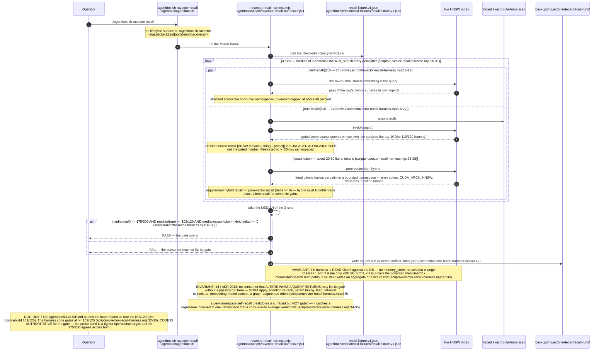
```mermaid
sequenceDiagram
    autonumber
    participant OP as Operator
    participant SH as agentbox.sh ruvector recall<br/>agentbox/agentbox.sh
    participant H as ruvector-recall-harness.mjs<br/>agentbox/scripts/ruvector-recall-harness.mjs:1
    participant FIX as recall-fixture.v1.json<br/>agentbox/scripts/recall-fixtures/recall-fixture.v1.json
    participant PG as live HNSW index
    participant EX as forced exact brute-force scan
    participant ART as backups/ruvector-sidecar/recall-runs/

    OP->>SH: ./agentbox.sh ruvector recall
    Note over SH: the lifecycle surface is ./agentbox.sh ruvector<br/><status|check|test|update|rollback|recall>
    SH->>H: run the frozen fixture
    H->>FIX: load the checked-in QuerySetFixture
    loop 3 runs — median of 3 absorbs HNSW ef_search entry-point jitter (scripts/ruvector-recall-harness.mjs:30-31)
        par self-recall@10 — 200 rows (scripts/ruvector-recall-harness.mjs:15-17)
            H->>PG: the row's OWN stored embedding is the query
            PG-->>H: pass iff the row's own id survives its own top-10
            Note over H: stratified across the >=50-row namespaces, ruvnet-kb capped at about 40 percent
        and true-recall@10 — 120 rows (scripts/ruvector-recall-harness.mjs:18-22)
            H->>EX: ground truth
            H->>PG: HNSW top-10
            PG-->>H: gated score counts queries whose own row survives the top-10 (the 119/120 framing)
            Note over H: the intersection recall |HNSW n exact| / min(10,|exact|) is SURFACED ALONGSIDE but is<br/>not the gated number. Restricted to >=20-row namespaces
        and exact-token — about 20-30 literal tokens (scripts/ruvector-recall-harness.mjs:23-28)
            H->>PG: pure-vector then hybrid
            PG-->>H: literal tokens known verbatim in a bounded namespace — error codes, CUDA_ARCH, HNSW,<br/>filenames, function names
            Note over H: requirement hybrid recall >= pure-vector recall (delta >= 0) — hybrid must NEVER trade<br/>exact-token recall for semantic gains
        end
    end
    H->>H: take the MEDIAN of the 3 runs
    alt median(self) >= 175/200 AND median(true) >= 102/120 AND median(exact-token hybrid delta) >= 0 (scripts/ruvector-recall-harness.mjs:32-33)
        H-->>OP: PASS — the gate opens
    else
        H-->>OP: FAIL — the consumer may not flip its gate
    end
    H->>ART: write the per-run evidence artifact <utc>.json (scripts/ruvector-recall-harness.mjs:40-42)
    Note over H,PG: INVARIANT: the harness is READ-ONLY against the DB — no memory_store, no schema change.<br/>Classes 1 and 2 issue only kNN SELECTs, class 3 calls the governed memSearch /<br/>memHybridSearch read paths. It NEVER writes an aggregate or a fixture row (scripts/ruvector-recall-harness.mjs:37-39)
    Note over H: INVARIANT I14 / ADR-2018: no consumer that ALTERS WHAT A QUERY RETURNS may flip its gate<br/>without a passing run here — SONA apply, attention re-rank, param tuning, feed_retrieval<br/>re-rank, an embedding-model cutover, a graph-augmented orient (scripts/ruvector-recall-harness.mjs:4-9)
    Note over H: a per-namespace self-recall breakdown is surfaced but NOT gated — it catches a<br/>regression localised to one namespace that a corpus-wide average would hide (scripts/ruvector-recall-harness.mjs:34-35)
    Note over OP: DOC-DRIFT D3: agentbox/CLAUDE.md quotes the frozen band as true >= 107/120 (live<br/>post-rebuild 109/120). The harness code gates at >= 102/120 (scripts/ruvector-recall-harness.mjs:32-33). CODE IS<br/>AUTHORITATIVE for the gate — the prose band is a tighter operational target. self >=<br/>175/200 agrees across both
```

## AB-20.10 The index law

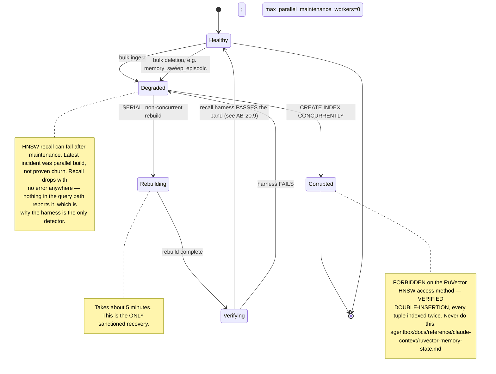
```mermaid
stateDiagram-v2
    [*] --> Healthy
    Healthy --> Degraded : bulk ingest
    Healthy --> Degraded : bulk deletion, e.g. memory_sweep_episodic
    note right of Degraded
        HNSW recall can fall after maintenance. Latest incident was parallel build, not proven churn. Recall drops with
        no error anywhere — nothing in the query path reports it, which is
        why the harness is the only detector.
    end note
    Degraded --> Rebuilding : SERIAL, non-concurrent rebuild; max_parallel_maintenance_workers=0
    note right of Rebuilding
        Takes about 5 minutes. This is the ONLY sanctioned recovery.
    end note
    Rebuilding --> Verifying : rebuild complete
    Verifying --> Healthy : recall harness PASSES the band (see AB-20.9)
    Verifying --> Degraded : harness FAILS
    Corrupted --> [*]
    Degraded --> Corrupted : CREATE INDEX CONCURRENTLY
    note right of Corrupted
        FORBIDDEN on the RuVector HNSW access method — VERIFIED
        DOUBLE-INSERTION, every tuple indexed twice. Never do this.
        agentbox/docs/reference/claude-context/ruvector-memory-state.md
    end note
    Healthy --> [*]
```

## AB-20.11 384-dim freeze and the inert SONA branch

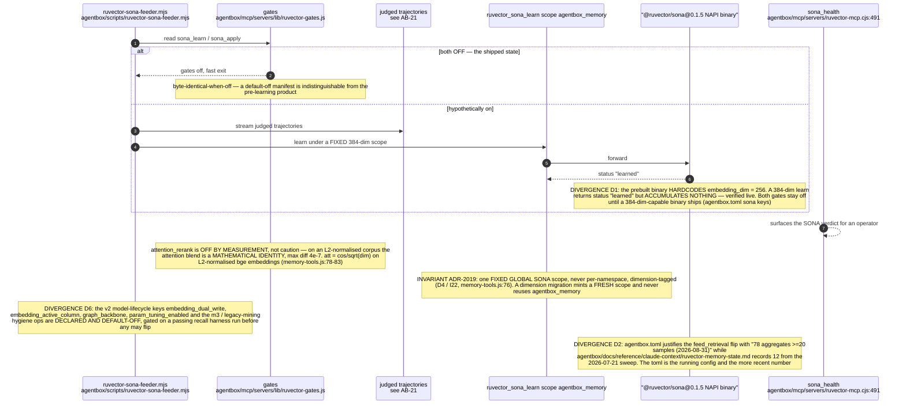
```mermaid
sequenceDiagram
    autonumber
    participant SW as ruvector-sona-feeder.mjs<br/>agentbox/scripts/ruvector-sona-feeder.mjs
    participant G as gates<br/>agentbox/mcp/servers/lib/ruvector-gates.js
    participant TR as judged trajectories<br/>see AB-21
    participant SONA as ruvector_sona_learn scope agentbox_memory
    participant BIN as "@ruvector/sona@0.1.5 NAPI binary"
    participant SH as sona_health<br/>agentbox/mcp/servers/ruvector-mcp.cjs:491

    SW->>G: read sona_learn / sona_apply
    alt both OFF — the shipped state
        G-->>SW: gates off, fast exit
        Note over G: byte-identical-when-off — a default-off manifest is indistinguishable from the<br/>pre-learning product
    else hypothetically on
        SW->>TR: stream judged trajectories
        SW->>SONA: learn under a FIXED 384-dim scope
        SONA->>BIN: forward
        BIN-->>SONA: status "learned"
        Note over BIN: DIVERGENCE D1: the prebuilt binary HARDCODES embedding_dim = 256. A 384-dim learn<br/>returns status "learned" but ACCUMULATES NOTHING — verified live. Both gates stay off<br/>until a 384-dim-capable binary ships (agentbox.toml sona keys)
    end
    SH-->>SH: surfaces the SONA verdict for an operator
    Note over G: attention_rerank is OFF BY MEASUREMENT, not caution — on an L2-normalised corpus the<br/>attention blend is a MATHEMATICAL IDENTITY, max diff 4e-7. att = cos/sqrt(dim) on<br/>L2-normalised bge embeddings (memory-tools.js:78-83)
    Note over SONA: INVARIANT ADR-2019: one FIXED GLOBAL SONA scope, never per-namespace, dimension-tagged<br/>(D4 / I22, memory-tools.js:76). A dimension migration mints a FRESH scope and never<br/>reuses agentbox_memory
    Note over SW: DIVERGENCE D6: the v2 model-lifecycle keys embedding_dual_write,<br/>embedding_active_column, graph_backbone, param_tuning_enabled and the m3 / legacy-mining<br/>hygiene ops are DECLARED AND DEFAULT-OFF, gated on a passing recall harness run before<br/>any may flip
    Note over BIN: DIVERGENCE D2: agentbox.toml justifies the feed_retrieval flip with "78 aggregates >=20<br/>samples (2026-08-31)" while<br/>agentbox/docs/reference/claude-context/ruvector-memory-state.md records 12 from the<br/>2026-07-21 sweep. The toml is the running config and the more recent number
```

## AB-20.12 memory_health and the store schema

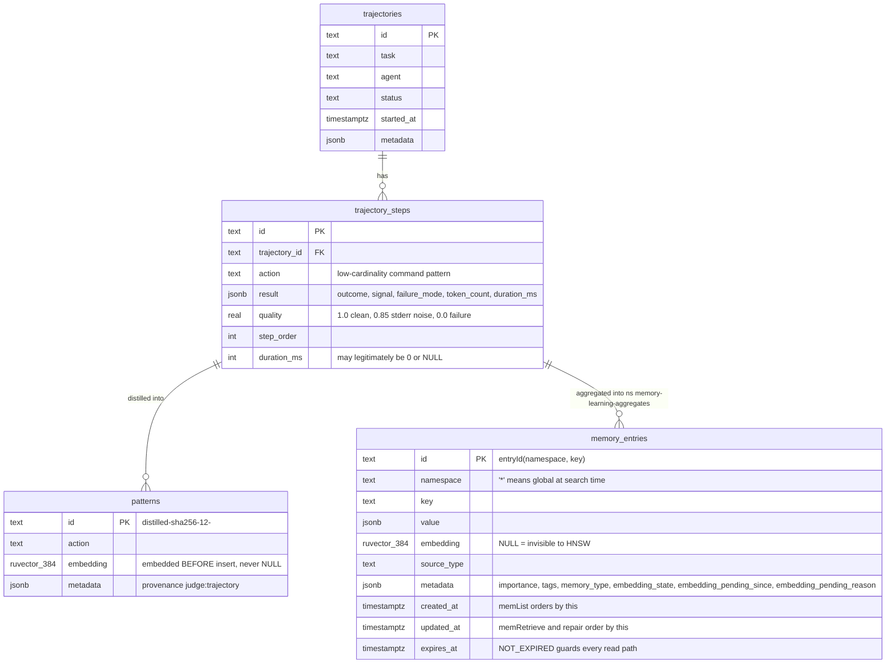
```mermaid
erDiagram
    memory_entries {
        text id PK "entryId(namespace, key)"
        text namespace "'*' means global at search time"
        text key
        jsonb value
        ruvector_384 embedding "NULL = invisible to HNSW"
        text source_type
        jsonb metadata "importance, tags, memory_type, embedding_state, embedding_pending_since, embedding_pending_reason"
        timestamptz created_at "memList orders by this"
        timestamptz updated_at "memRetrieve and repair order by this"
        timestamptz expires_at "NOT_EXPIRED guards every read path"
    }
    patterns {
        text id PK "distilled-sha256-12-<hash(action)>"
        text action
        ruvector_384 embedding "embedded BEFORE insert, never NULL"
        jsonb metadata "provenance judge:trajectory"
    }
    trajectories {
        text id PK
        text task
        text agent
        text status
        timestamptz started_at
        jsonb metadata
    }
    trajectory_steps {
        text id PK
        text trajectory_id FK
        text action "low-cardinality command pattern"
        jsonb result "outcome, signal, failure_mode, token_count, duration_ms"
        real quality "1.0 clean, 0.85 stderr noise, 0.0 failure"
        int step_order
        int duration_ms "may legitimately be 0 or NULL"
    }
    trajectories ||--o{ trajectory_steps : "has"
    trajectory_steps ||--o{ patterns : "distilled into"
    trajectory_steps ||--o{ memory_entries : "aggregated into ns memory-learning-aggregates"
```

## AB-20.13 ADR-2082 — orchestration forwarded to a filtered ruflo child, memory never

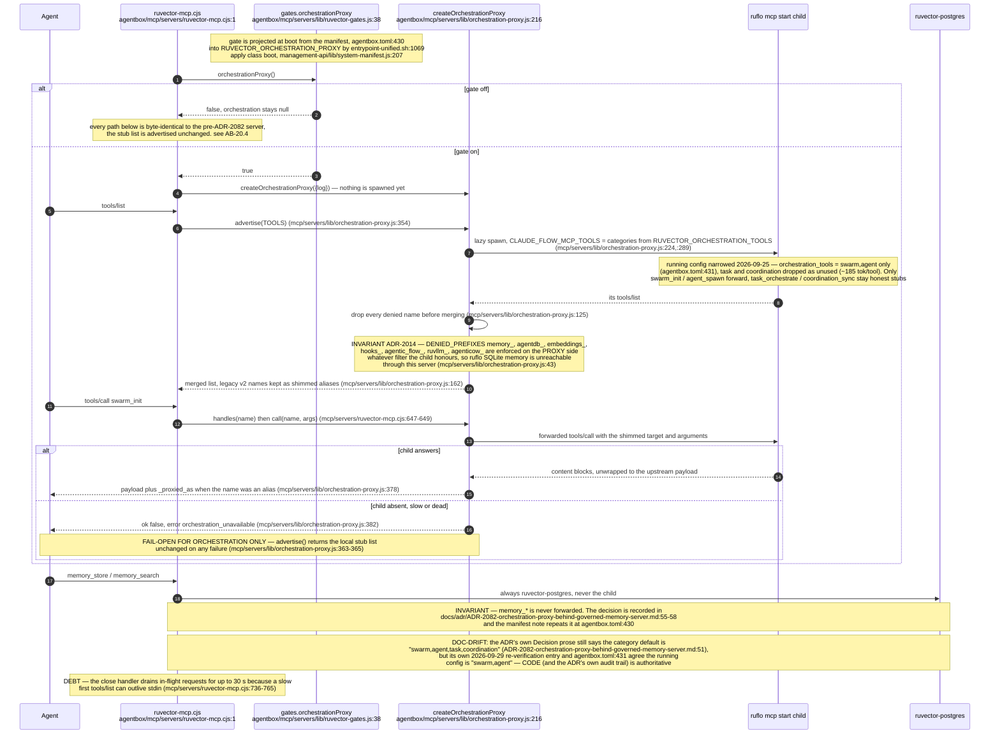
```mermaid
sequenceDiagram
    autonumber
    participant AG as Agent
    participant SRV as ruvector-mcp.cjs<br/>agentbox/mcp/servers/ruvector-mcp.cjs:1
    participant G as gates.orchestrationProxy<br/>agentbox/mcp/servers/lib/ruvector-gates.js:38
    participant OP as createOrchestrationProxy<br/>agentbox/mcp/servers/lib/orchestration-proxy.js:216
    participant CH as ruflo mcp start child
    participant PG as ruvector-postgres

    Note over G: gate is projected at boot from the manifest, agentbox.toml:430<br/>into RUVECTOR_ORCHESTRATION_PROXY by entrypoint-unified.sh:1069<br/>apply class boot, management-api/lib/system-manifest.js:207
    SRV->>G: orchestrationProxy()
    alt gate off
        G-->>SRV: false, orchestration stays null
        Note over SRV: every path below is byte-identical to the pre-ADR-2082 server,<br/>the stub list is advertised unchanged. see AB-20.4
    else gate on
        G-->>SRV: true
        SRV->>OP: createOrchestrationProxy({log}) — nothing is spawned yet
        AG->>SRV: tools/list
        SRV->>OP: advertise(TOOLS) (mcp/servers/lib/orchestration-proxy.js:354)
        OP->>CH: lazy spawn, CLAUDE_FLOW_MCP_TOOLS = categories from RUVECTOR_ORCHESTRATION_TOOLS<br/>(mcp/servers/lib/orchestration-proxy.js:224,:289)
        Note over CH: running config narrowed 2026-09-25 — orchestration_tools = swarm,agent only<br/>(agentbox.toml:431), task and coordination dropped as unused (~185 tok/tool). Only<br/>swarm_init / agent_spawn forward, task_orchestrate / coordination_sync stay honest stubs
        CH-->>OP: its tools/list
        OP->>OP: drop every denied name before merging (mcp/servers/lib/orchestration-proxy.js:125)
        Note over OP: INVARIANT ADR-2014 — DENIED_PREFIXES memory_, agentdb_, embeddings_,<br/>hooks_, agentic_flow_, ruvllm_, agenticow_ are enforced on the PROXY side<br/>whatever filter the child honours, so ruflo SQLite memory is unreachable<br/>through this server (mcp/servers/lib/orchestration-proxy.js:43)
        OP-->>SRV: merged list, legacy v2 names kept as shimmed aliases (mcp/servers/lib/orchestration-proxy.js:162)
        AG->>SRV: tools/call swarm_init
        SRV->>OP: handles(name) then call(name, args) (mcp/servers/ruvector-mcp.cjs:647-649)
        OP->>CH: forwarded tools/call with the shimmed target and arguments
        alt child answers
            CH-->>OP: content blocks, unwrapped to the upstream payload
            OP-->>AG: payload plus _proxied_as when the name was an alias (mcp/servers/lib/orchestration-proxy.js:378)
        else child absent, slow or dead
            OP-->>AG: ok false, error orchestration_unavailable (mcp/servers/lib/orchestration-proxy.js:382)
            Note over OP,AG: FAIL-OPEN FOR ORCHESTRATION ONLY — advertise() returns the local stub list<br/>unchanged on any failure (mcp/servers/lib/orchestration-proxy.js:363-365)
        end
    end
    AG->>SRV: memory_store / memory_search
    SRV->>PG: always ruvector-postgres, never the child
    Note over SRV,PG: INVARIANT — memory_* is never forwarded. The decision is recorded in<br/>docs/adr/ADR-2082-orchestration-proxy-behind-governed-memory-server.md:55-58<br/>and the manifest note repeats it at agentbox.toml:430
    Note over SRV,PG: DOC-DRIFT: the ADR's own Decision prose still says the category default is<br/>"swarm,agent,task,coordination" (ADR-2082-orchestration-proxy-behind-governed-memory-server.md:51),<br/>but its own 2026-09-29 re-verification entry and agentbox.toml:431 agree the running<br/>config is "swarm,agent" — CODE (and the ADR's own audit trail) is authoritative
    Note over SRV: DEBT — the close handler drains in-flight requests for up to 30 s because a slow<br/>first tools/list can outlive stdin (mcp/servers/ruvector-mcp.cjs:736-765)
```

## Audit qualification — 2026-09-07

The 2026-09-05 Agentbox recall closeout records self 189/200 and true 115/120 after a **serial** rebuild, versus self 151/200 after parallel rebuilding. These are historical receipts, not a fresh benchmark. The local RuVector source contains `hnsw_bulkdelete` and deleted-node flags; neither proves a deployed bulk-delete recall regression. Keep cross-store reverse tombstones (ADR-2060) distinct from index tombstones. No database mutation or reindex was performed. See [audit](../../estate-review/2026-09-07-agentbox-audit.md).
