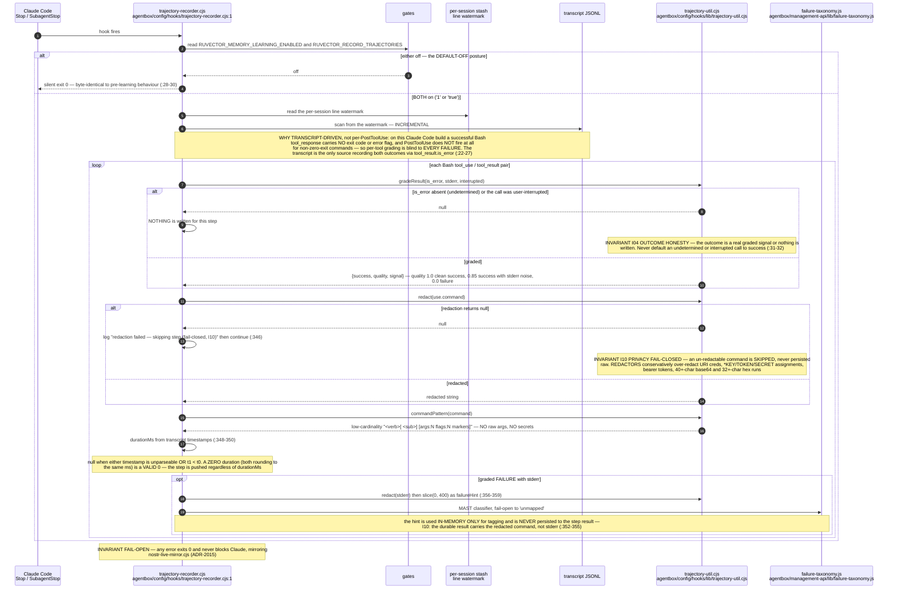
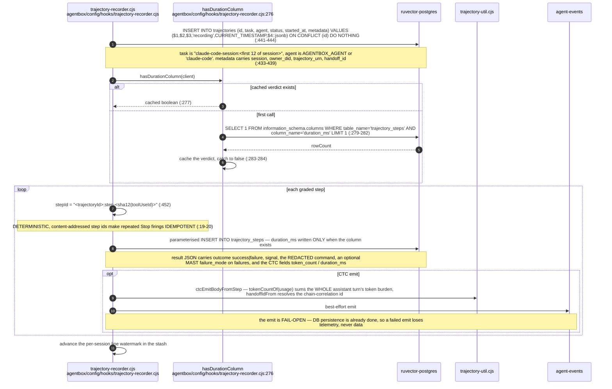
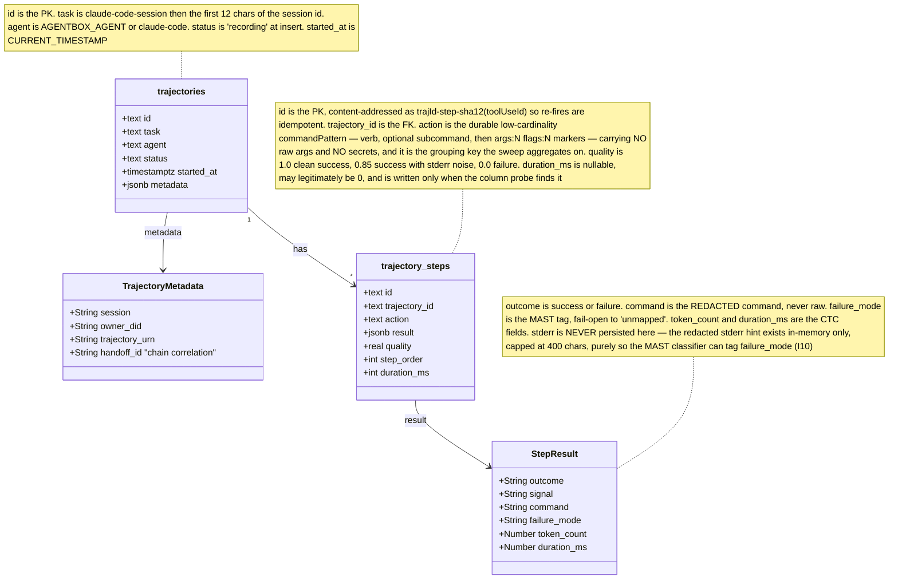
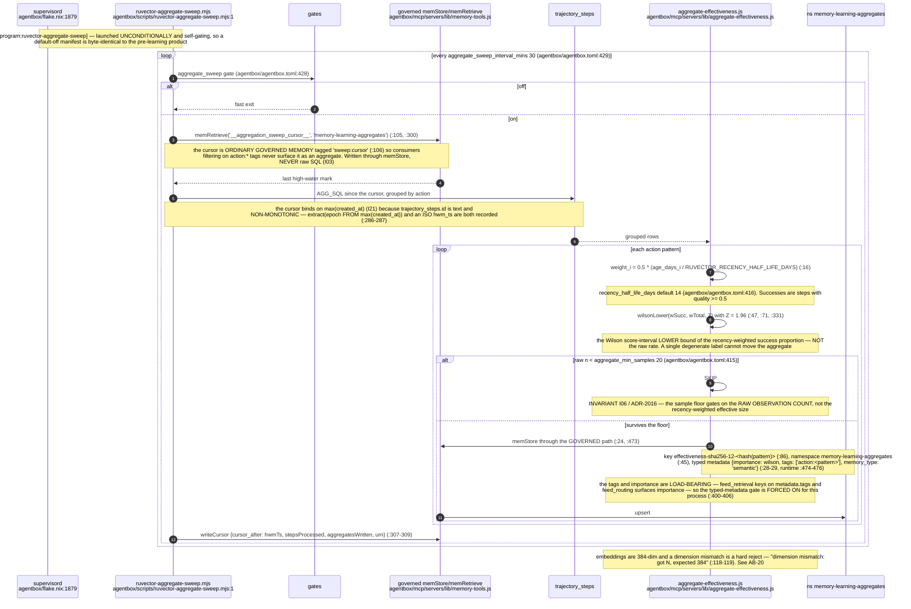
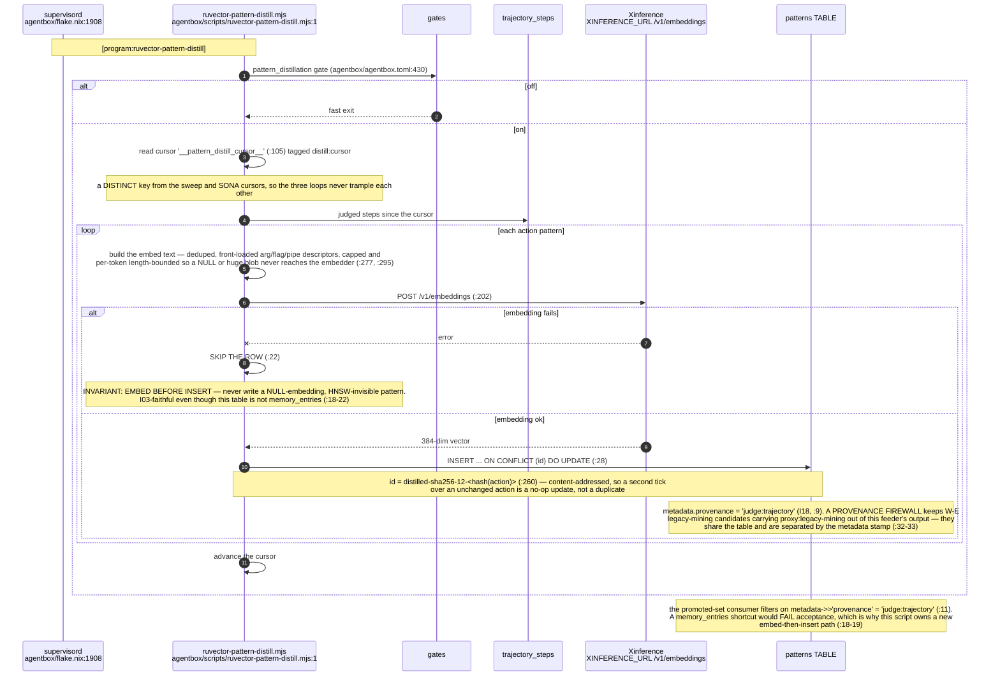
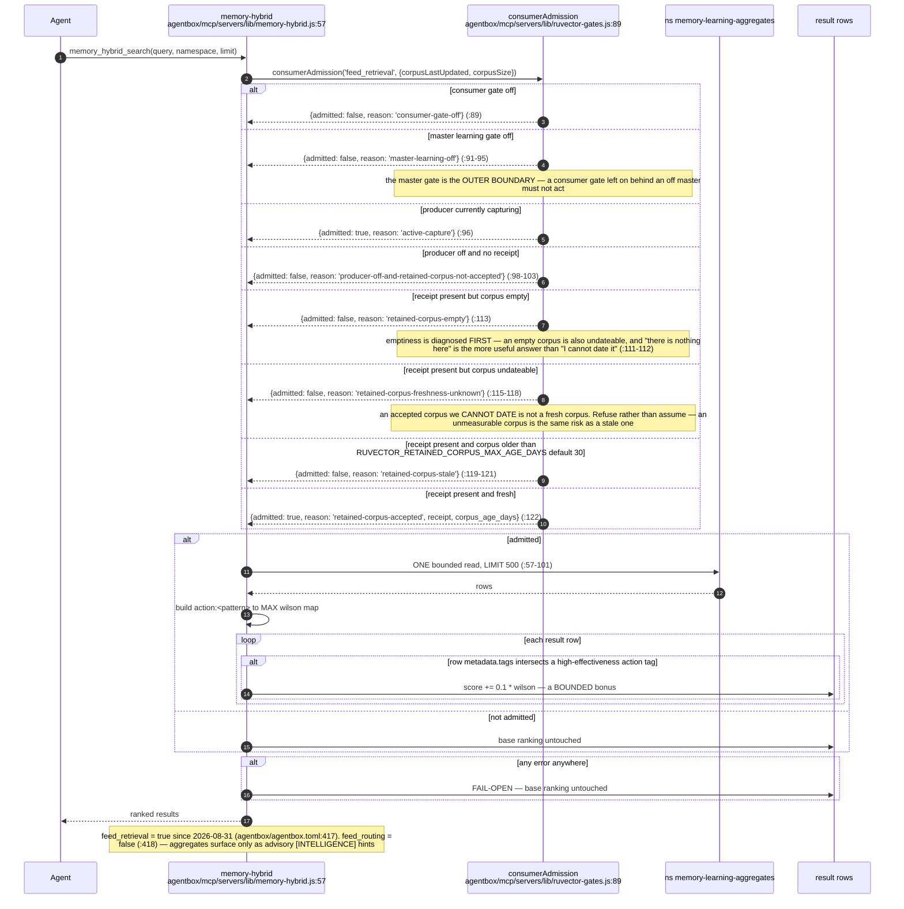
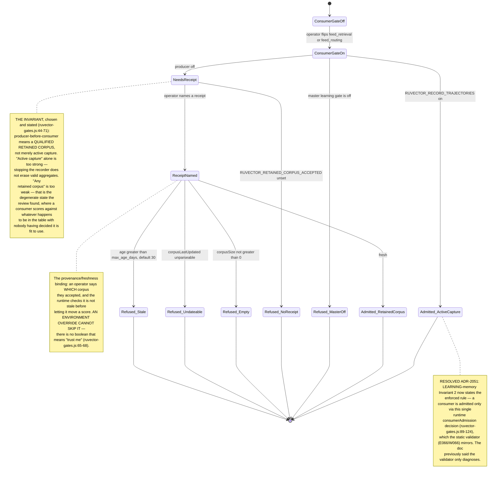
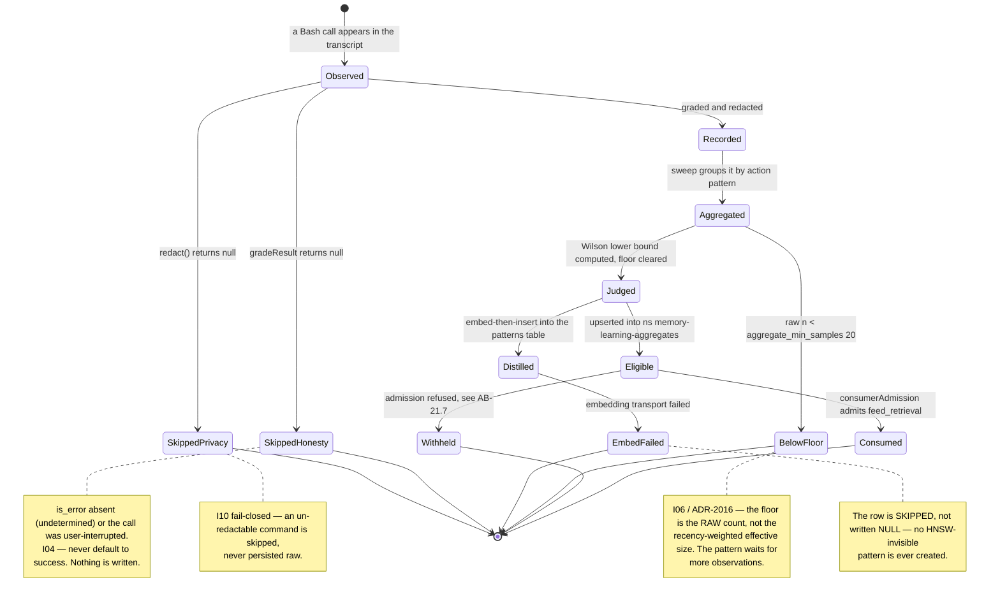
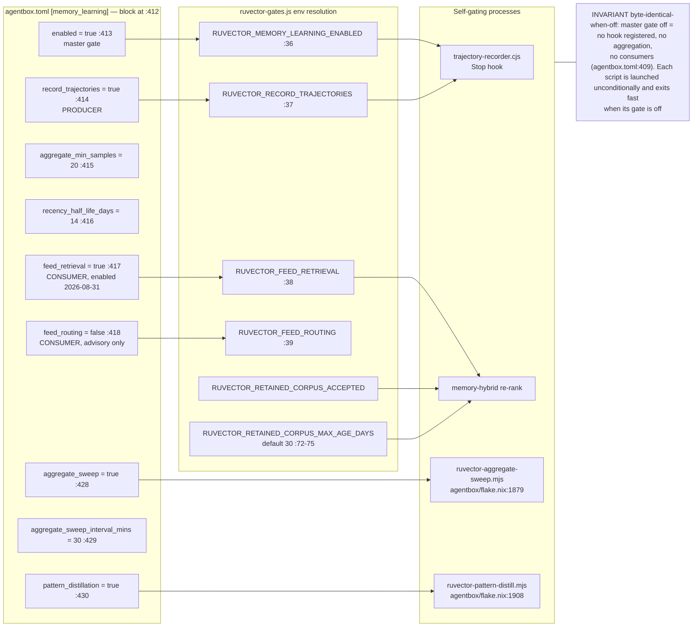
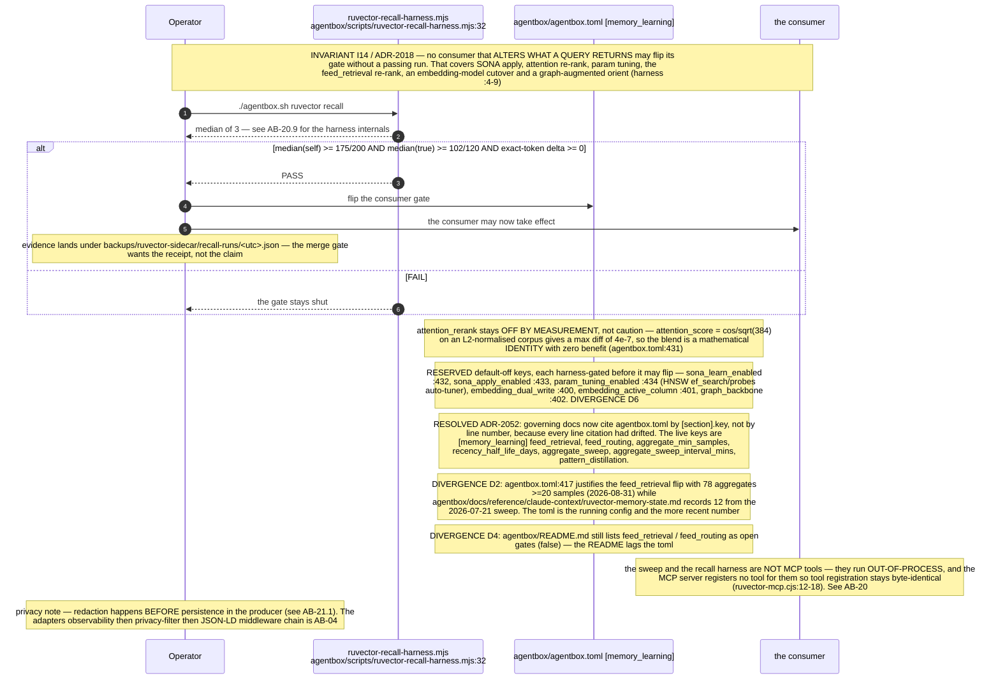

## AB-21.1 Capture — transcript-driven grading

## AB-21.2 Capture — persistence

## AB-21.3 Trajectory schema

## AB-21.4 Judge — the aggregate sweep

## AB-21.5 Distil — patterns table

## AB-21.6 Consume — the feed_retrieval re-rank

## AB-21.7 ADR-2017 producer-before-consumer

## AB-21.8 A trajectory's life

## AB-21.9 Gate topology

## AB-21.10 The recall gate on any consumer flip

## Audit qualification — 2026-09-07

ADR-2015 is transcript-driven but uses the **structured `tool_result.is_error` flag**, not an LLM's error prose. Unknown or interrupted outcomes are skipped. Current source keeps the watermark unchanged when pg is unavailable and records `usage_id`, turn-level scope and queue overflow metadata. The 57 selected Jest assertions in the [audit](../../estate-review/2026-09-07-agentbox-audit.md) passed. They do not establish a complete failure denominator or live recorder-to-dashboard delivery: non-Bash work, skipped outcomes, crash-before-Stop, HTTP status handling and downstream usage deduplication remain separate obligations.
