## AB-22.1 Skill discovery and JIT load at a turn

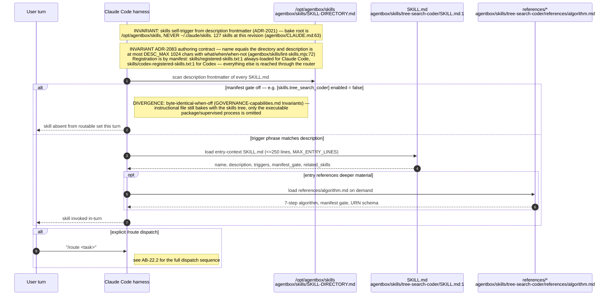

## AB-22.2 Routing — the live Jev router, and the table it falls open to

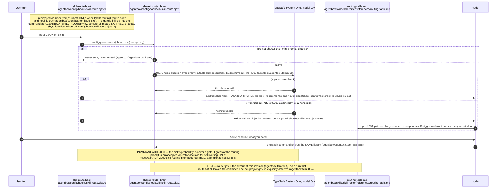

## AB-22.3 Lint gate (ADR-2021) — findings and the advisory divergence

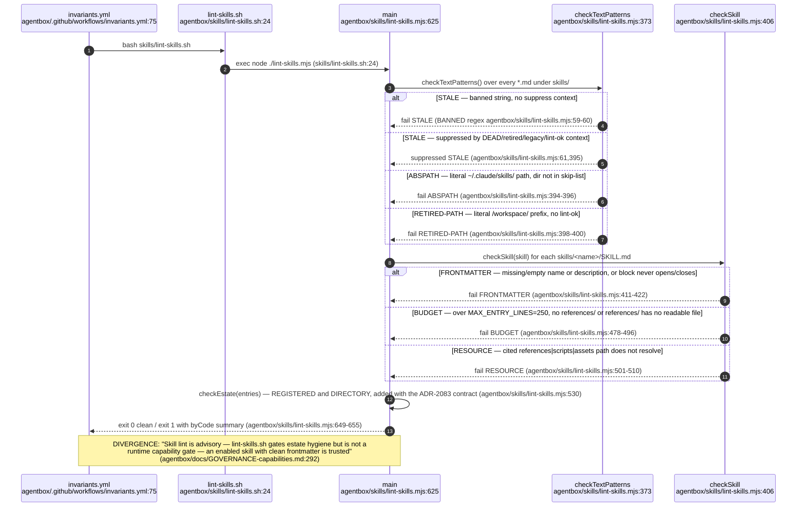

## AB-22.4 SKILL-DIRECTORY.md maintenance vs the machine-checked count

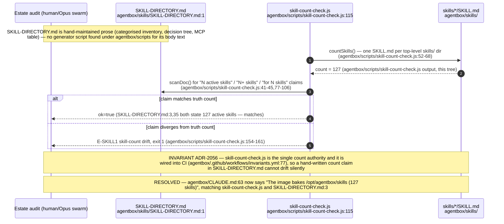

## AB-22.5 harness-bridge MCP — list/inspect/validate

## AB-22.6 harness_audit — pairing ratio across all templates

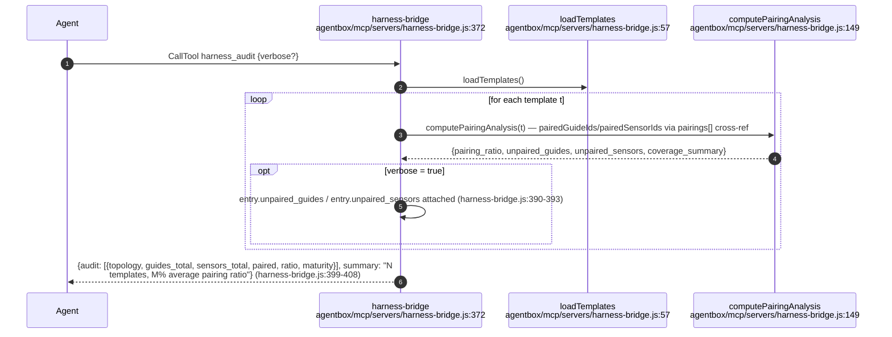

## AB-22.7 Colloquy knowledge-unit lifecycle — the replacement for the precedent bridge

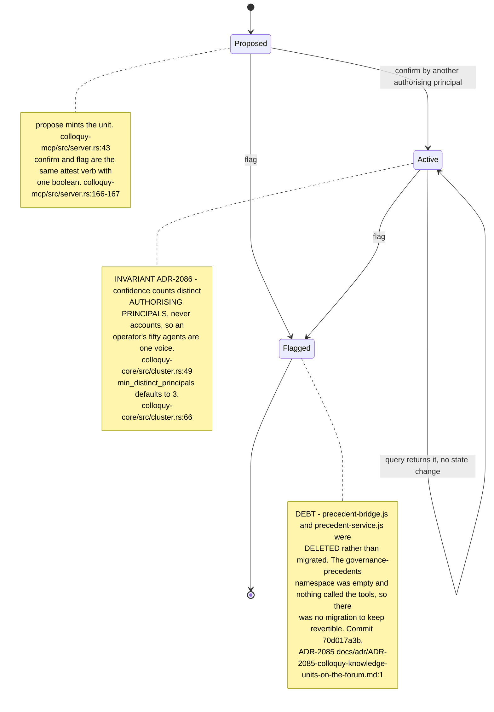

## AB-22.8 colloquy-mcp — six verbs over stdio, tier chosen by env

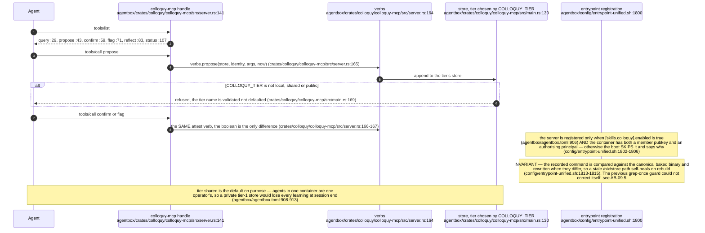

## AB-22.9 continual-harness — evidence-anchored signed refine

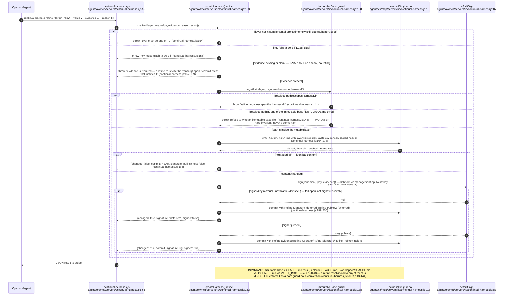

## AB-22.10 Skills-side MCP projection boundary — skills/mcp.json to workspace .mcp.json

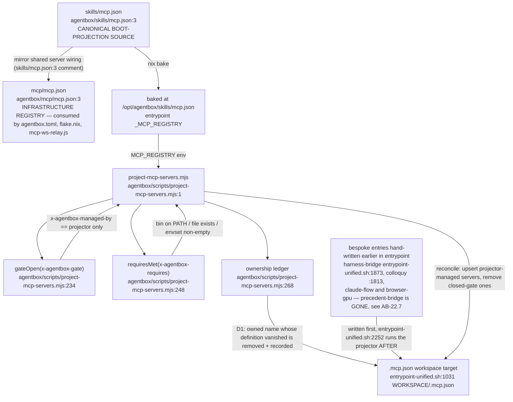

## AB-22.11 Vault path authority for skill-side corpus readers (ADR-2028)

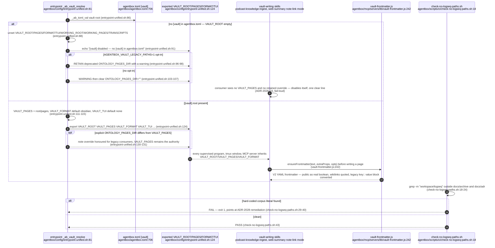

## AB-22.12 tree-search-coder — execution-gated branching with enforced spend cap

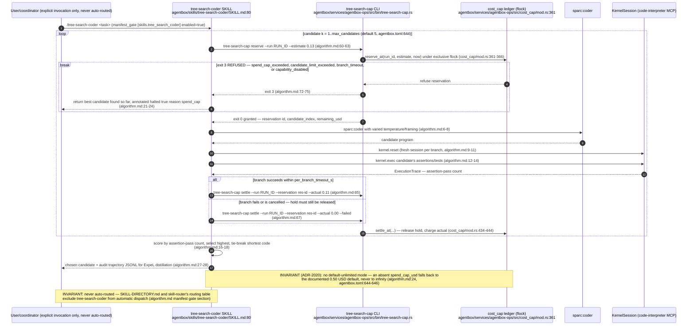

## AB-22.13 [skills.*] manifest gate table (ADR-2020, catalogue parity closed)

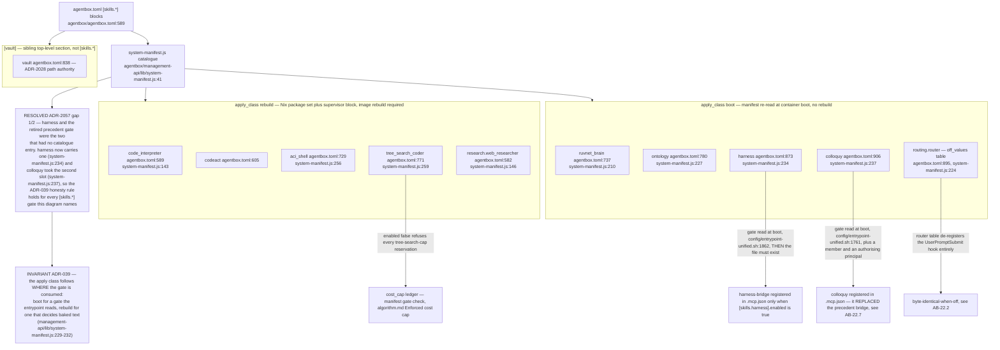

## AB-22.14 Generated discovery — the table nobody hand-edits (ADR-2083)

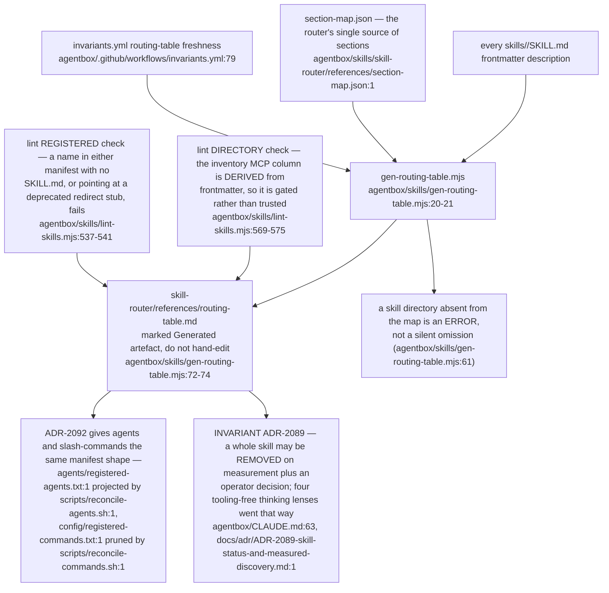
