## AB-22.1 Skill discovery and JIT load at a turn

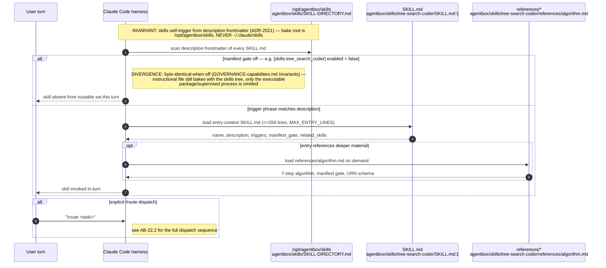

## AB-22.2 /route dispatch — skill-router

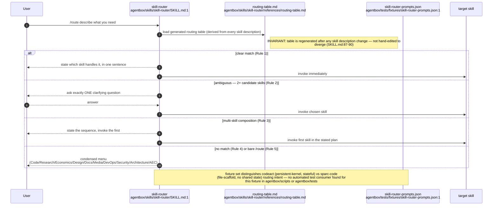

## AB-22.3 Lint gate (ADR-2021) — findings and the advisory divergence

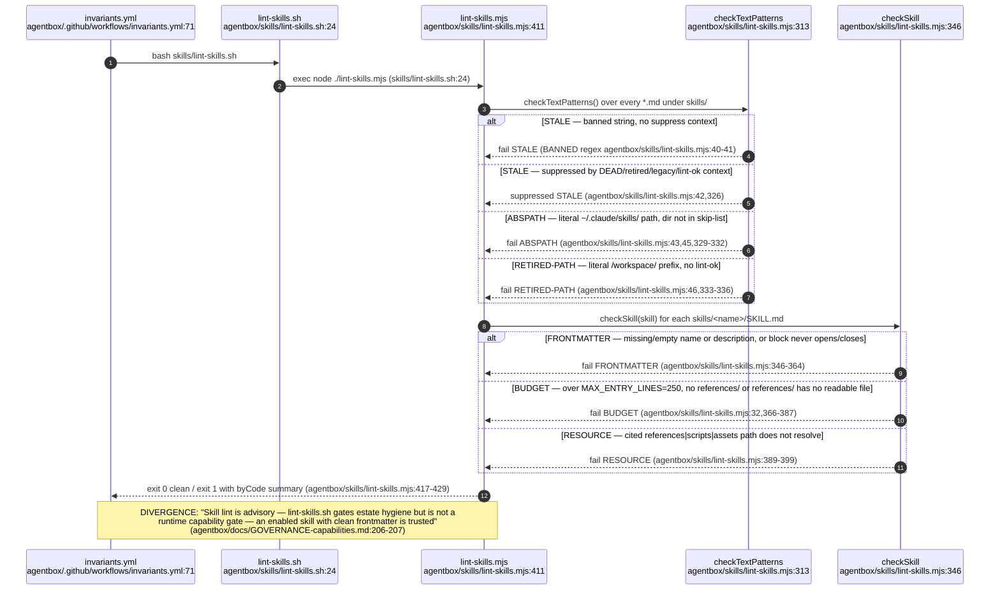

## AB-22.4 SKILL-DIRECTORY.md maintenance vs the machine-checked count

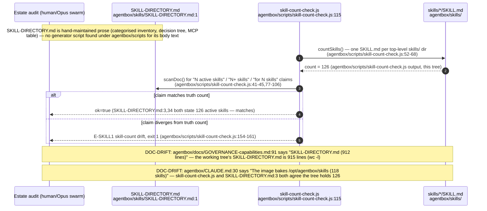

## AB-22.5 harness-bridge MCP — list/inspect/validate

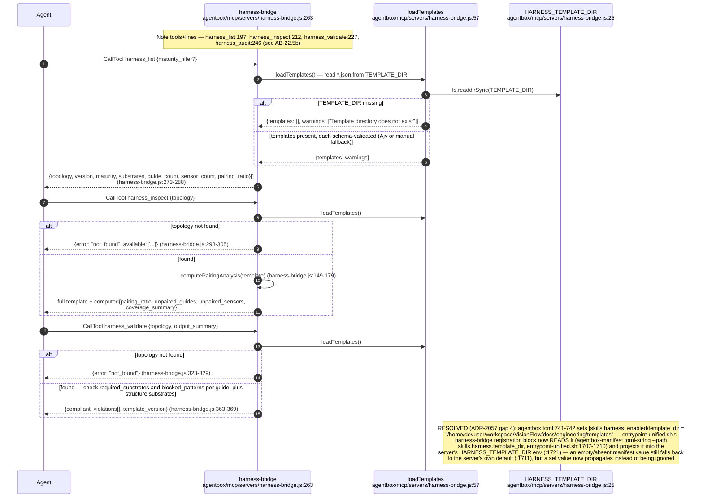

## AB-22.6 harness_audit — pairing ratio across all templates

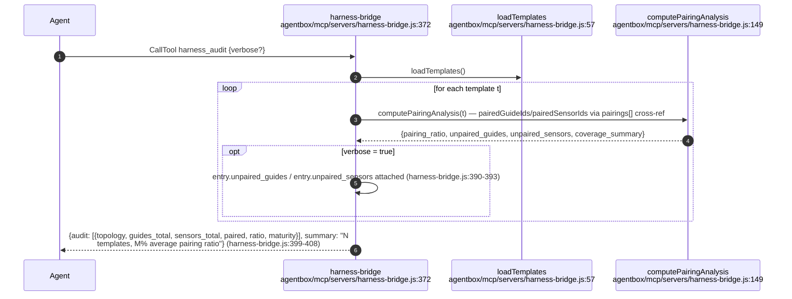

## AB-22.7 Precedent lifecycle

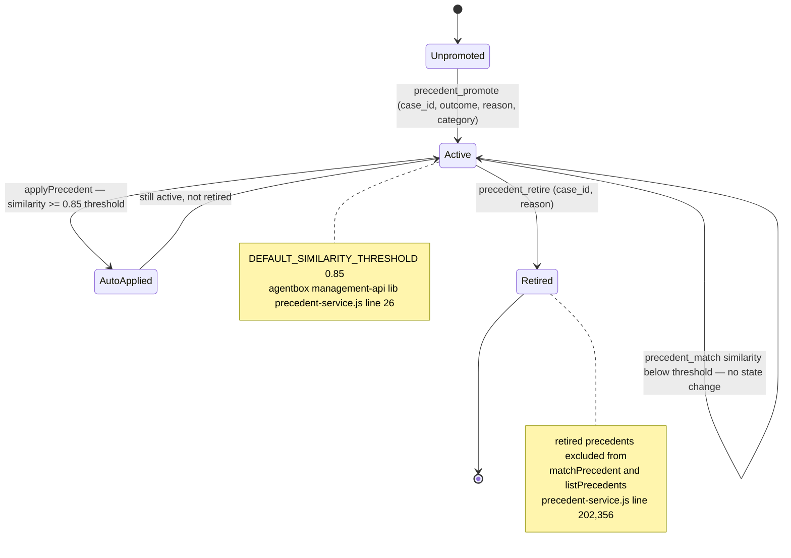

## AB-22.8 precedent_match — file-store word-overlap search

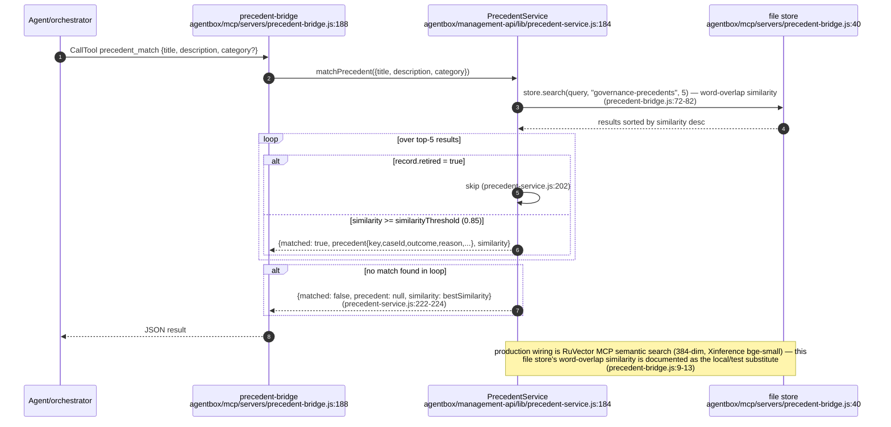

## AB-22.9 continual-harness — evidence-anchored signed refine

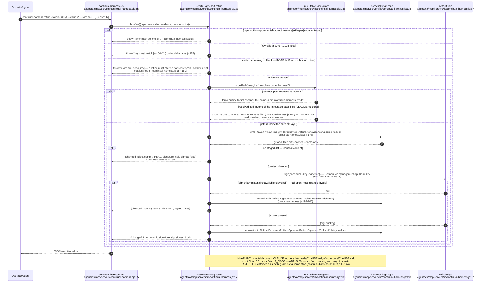

## AB-22.10 Skills-side MCP projection boundary — skills/mcp.json to workspace .mcp.json

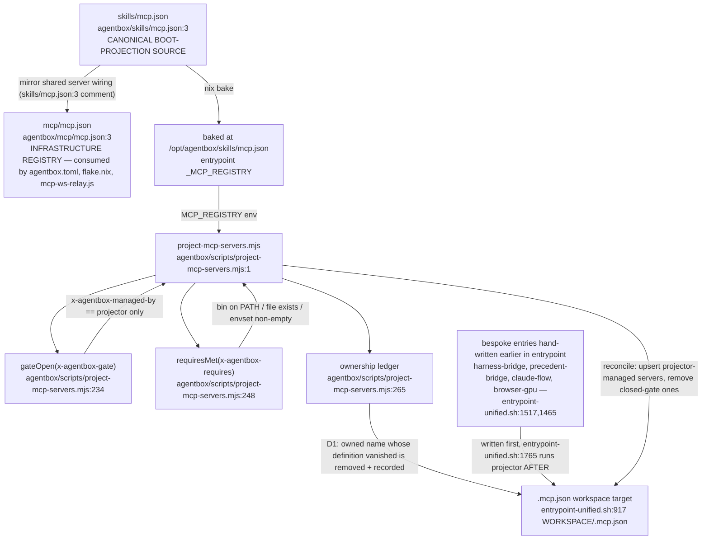

## AB-22.11 Vault path authority for skill-side corpus readers (ADR-2028)

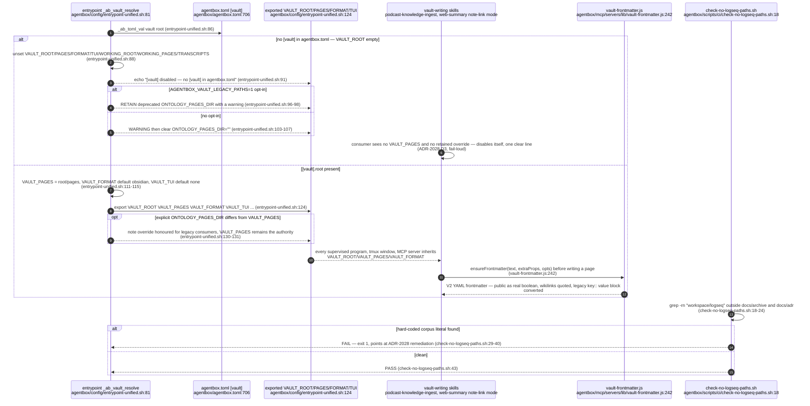

## AB-22.12 tree-search-coder — execution-gated branching with enforced spend cap

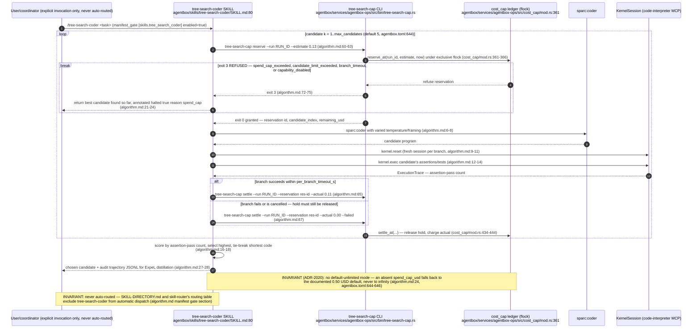

## AB-22.13 [skills.*] manifest gate table (ADR-2020)

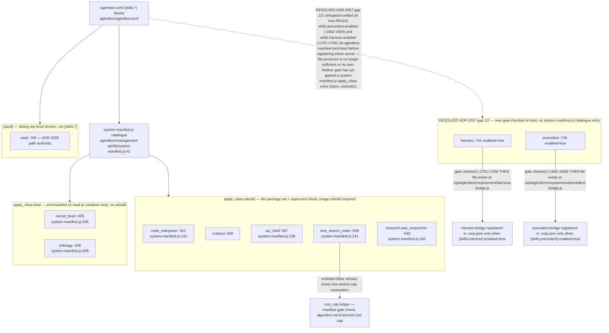
