## AB-23.1 One repo-night — run phases

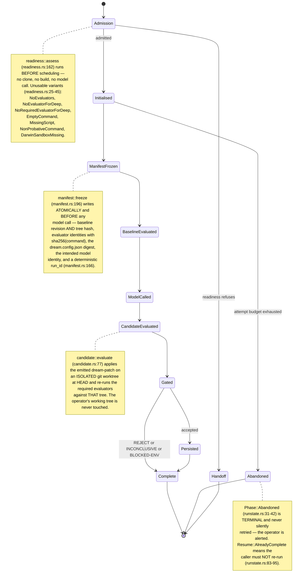

## AB-23.2 Nightly cycle — every gate as a branch

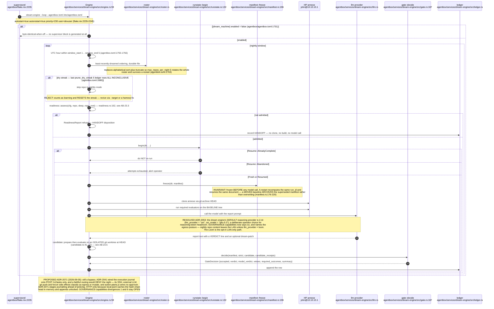

## AB-23.3 Evaluator-readiness admission — refusal before scheduling

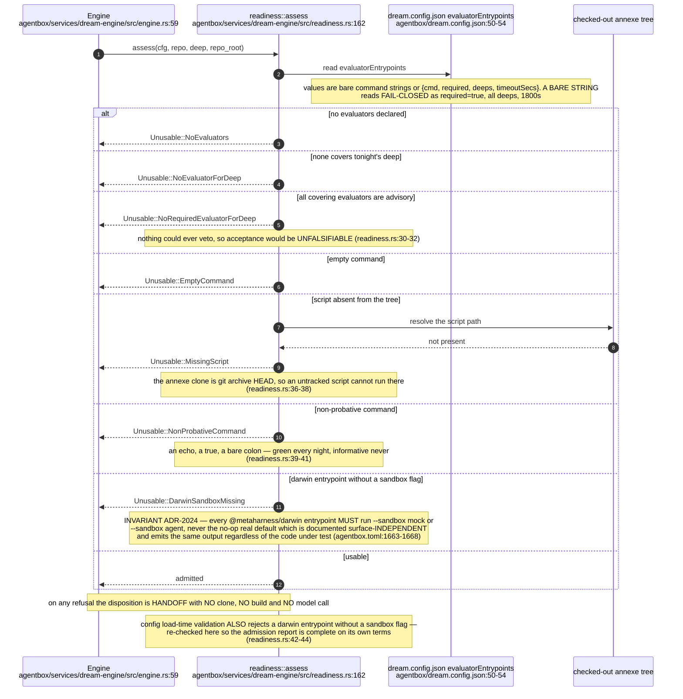

## AB-23.4 The deterministic required-check gate

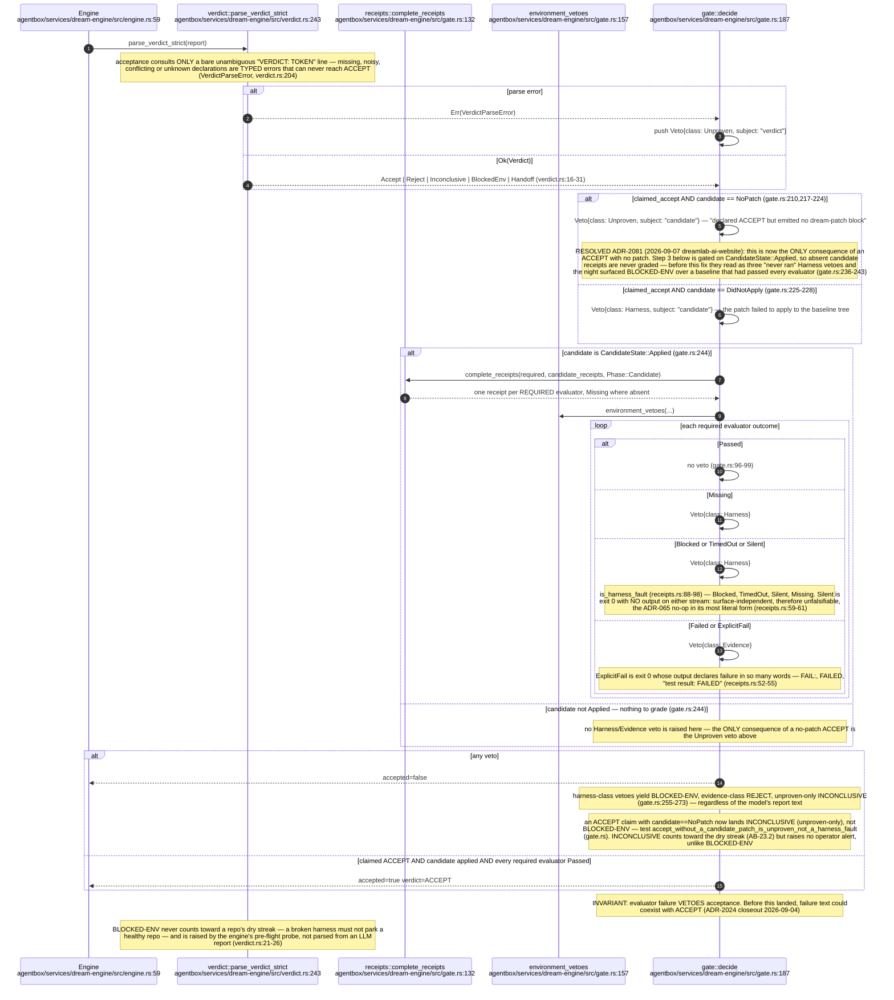

## AB-23.5 Candidate re-evaluation on an isolated worktree

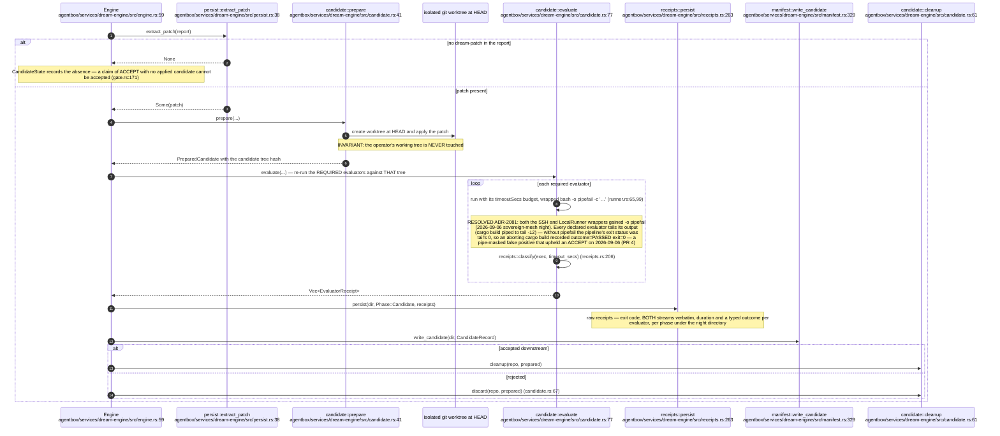

## AB-23.6 Persistence and the human merge gate

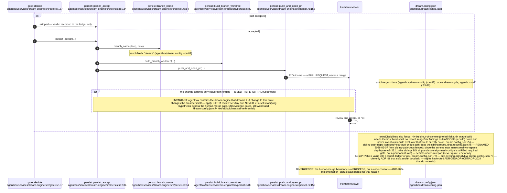

## AB-23.7 Run journal — restart, resume and abandonment

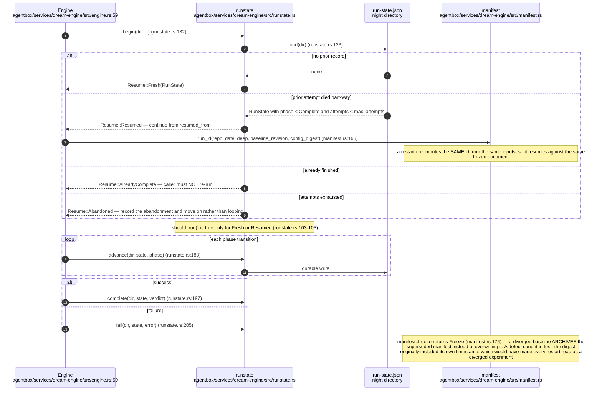

## AB-23.8 Core types

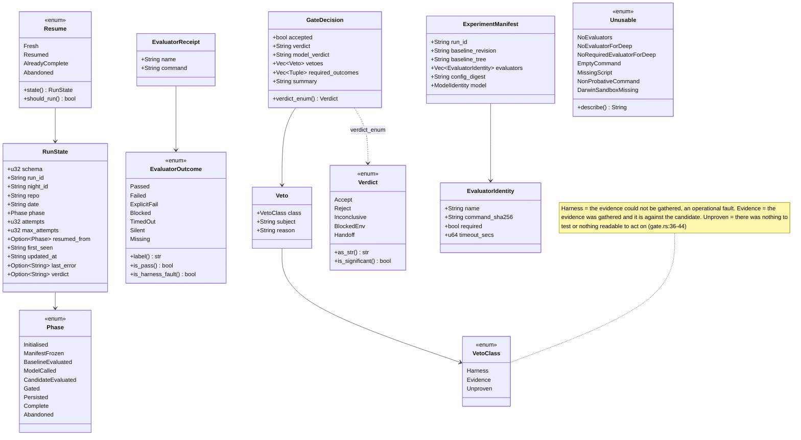

## AB-23.9 Dream-inbox surfacing hook

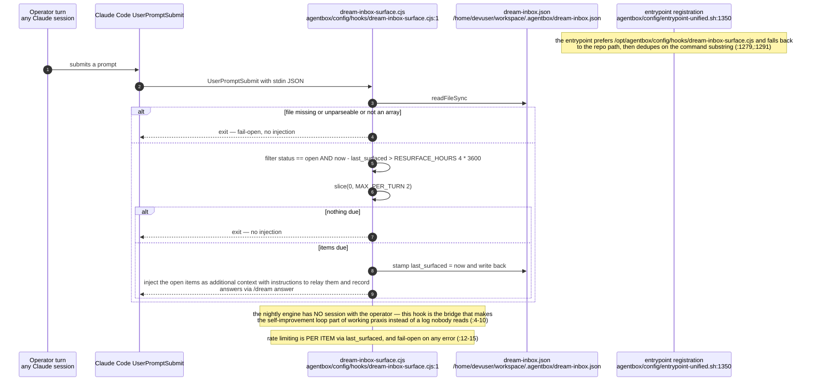

## AB-23.10 Control and reporting surfaces

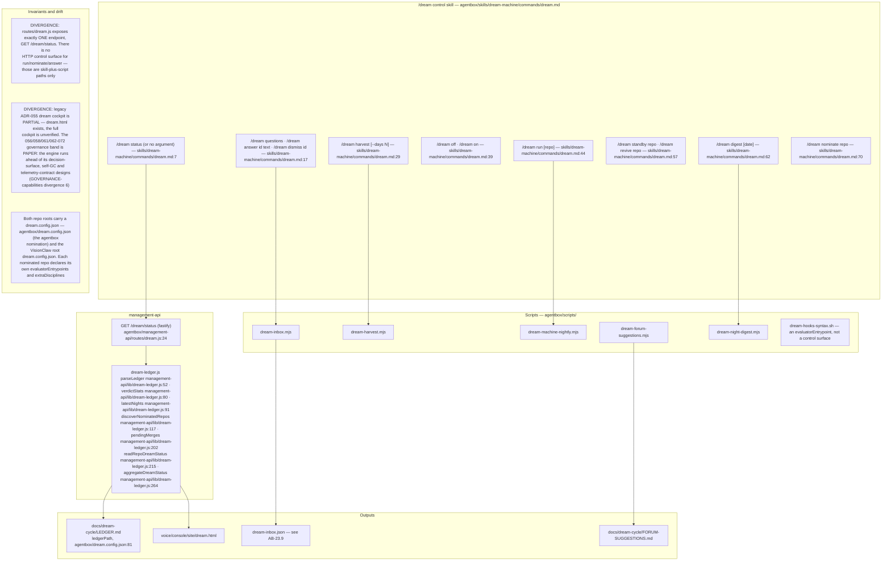

## AB-23.11 ADR-2081 — the annexe mirrors real workspace depth

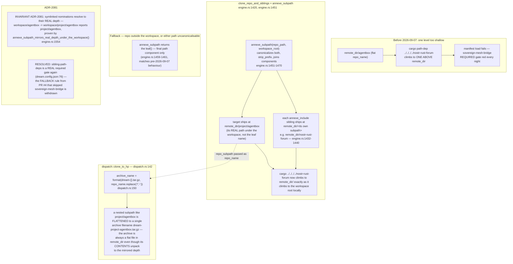

## AB-23.12 ADR-2081 — pipefail closes the tail-masking false positive

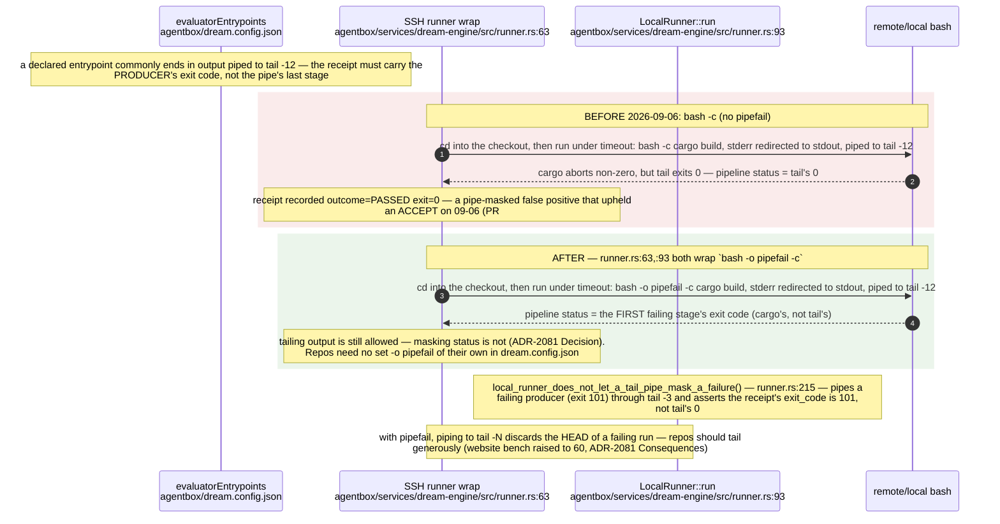

## AB-23.13 ADR-2081 — a no-patch ACCEPT is unproven, not a harness fault

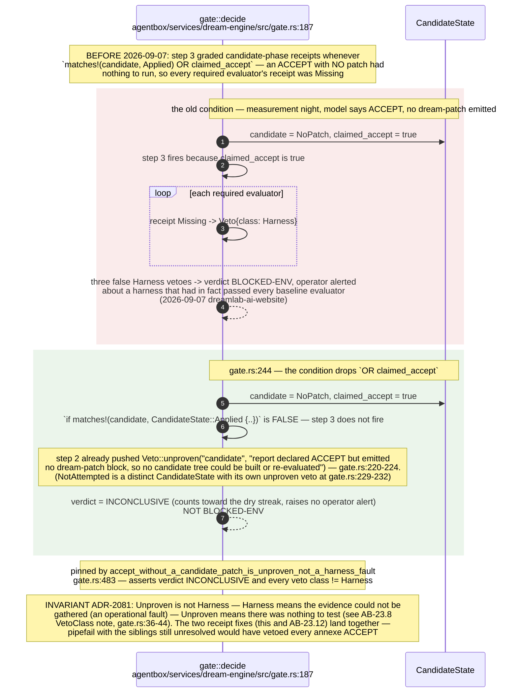

## AB-23.14 ADR-2081 — Step-19 ledger cell provenance

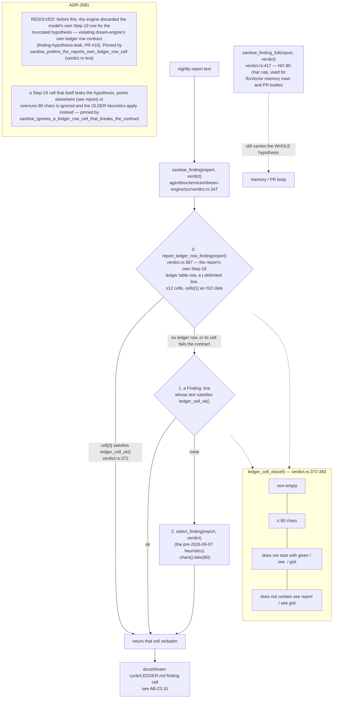

## Audit qualification — 2026-09-07

ADR-2081 source corrections above remain **staged** for the supervised nightly loop. Its loaded Nix-store binary requires an image rebuild and process-identity receipt before these source fixes can be called live. This audit did not rebuild or activate it.
