This topic draws the adapter and the boundary after the 2026-10-15 extraction (agentbox ADR-2141). The judgement and the loop mechanism moved to the permissive repository DreamLab-AI/dream-engine, mapped in DE-01 and in its own corpus at `../dream-engine/docs/diagrams/README.md`, which is not duplicated here. AB-23.9 onward are adapter-owned and re-cited at the new revision.

State at this stamp: the adapter pins `dream-core =0.4.0` and `dream-gate =0.3.0` from the registry (`../project/agentbox/services/dream-engine/Cargo.toml:26-27`), and the extraction is live: ADR-2141 is `accepted`, `complete`, `live`, with the operator's rebuild activated on 2026-10-16 and later releases adopted since (`../project/agentbox/docs/adr/ADR-2141-extract-the-dream-engine-core-into-a-standalone-permissive-repo.md:6-8`). Three adapter-owned changes since the first stamp are drawn here: source supply as plumbing (AB-23.21, ADR-2143), the opt-in Jev triage before the candidate build (AB-23.22, AB-23-S1-01) and the formatter step inside the core's candidate run (AB-23.4, ADR-DE-009). The crates.io versions are recorded in DE-01.

## AB-23.1 One repo-night — run phases

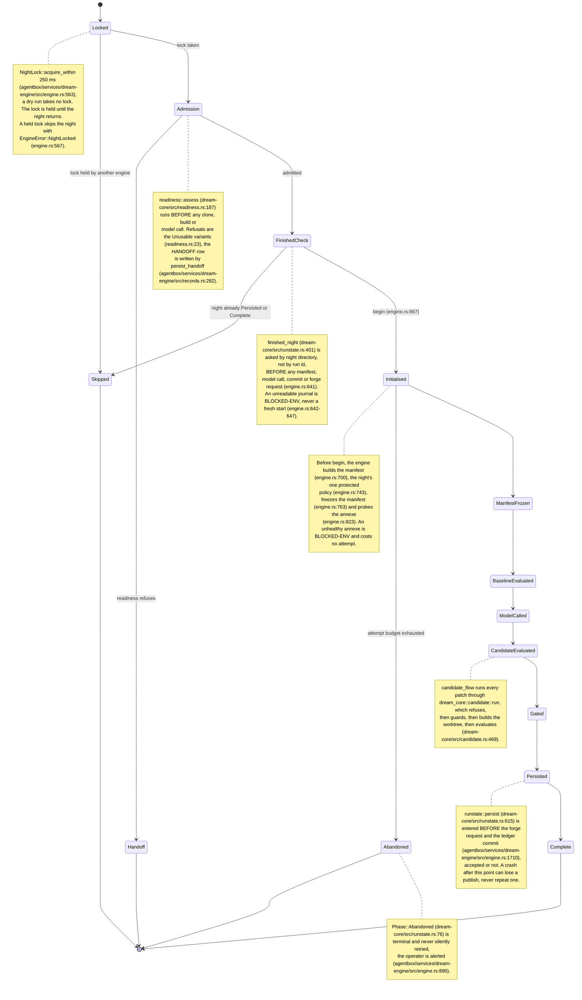
```mermaid
stateDiagram-v2
    [*] --> Locked
    note right of Locked
        NightLock::acquire_within 250 ms (agentbox/services/dream-engine/src/engine.rs:563),
        a dry run takes no lock. The lock is held until the night returns.
        A held lock skips the night with EngineError::NightLocked (engine.rs:567).
    end note
    Locked --> Skipped : lock held by another engine
    Locked --> Admission : lock taken
    Admission --> Handoff : readiness refuses
    note right of Admission
        readiness::assess (dream-core/src/readiness.rs:187) runs BEFORE any clone, build or
        model call. Refusals are the Unusable variants (readiness.rs:23), the HANDOFF row
        is written by persist_handoff (agentbox/services/dream-engine/src/records.rs:282).
    end note
    Admission --> FinishedCheck : admitted
    FinishedCheck --> Skipped : night already Persisted or Complete
    note right of FinishedCheck
        finished_night (dream-core/src/runstate.rs:401) is asked by night directory, not by run id,
        BEFORE any manifest, model call, commit or forge request (engine.rs:641).
        An unreadable journal is BLOCKED-ENV, never a fresh start (engine.rs:642-647).
    end note
    FinishedCheck --> Initialised : begin (engine.rs:867)
    note right of Initialised
        Before begin, the engine builds the manifest (engine.rs:700), the night's one protected
        policy (engine.rs:743), freezes the manifest (engine.rs:763) and probes the annexe
        (engine.rs:823). An unhealthy annexe is BLOCKED-ENV and costs no attempt.
    end note
    Initialised --> Abandoned : attempt budget exhausted
    Initialised --> ManifestFrozen
    ManifestFrozen --> BaselineEvaluated
    BaselineEvaluated --> ModelCalled
    ModelCalled --> CandidateEvaluated
    note right of CandidateEvaluated
        candidate_flow runs every patch through dream_core::candidate::run, which refuses,
        then guards, then builds the worktree, then evaluates (dream-core/src/candidate.rs:469).
    end note
    CandidateEvaluated --> Gated
    Gated --> Persisted
    note right of Persisted
        runstate::persist (dream-core/src/runstate.rs:615) is entered BEFORE the forge
        request and the ledger commit (agentbox/services/dream-engine/src/engine.rs:1710),
        accepted or not. A crash after this point can lose a publish, never repeat one.
    end note
    Persisted --> Complete
    Complete --> [*]
    Abandoned --> [*]
    Handoff --> [*]
    Skipped --> [*]
    note right of Abandoned
        Phase::Abandoned (dream-core/src/runstate.rs:76) is terminal and never silently retried,
        the operator is alerted (agentbox/services/dream-engine/src/engine.rs:890).
    end note
```

**What it shows.** The states one repo-night can pass through, now including the per-night lock that comes first and the `Persisted` phase that sits between the gate and `Complete`. Every night that reaches the gate passes through `Persisted`, whatever the verdict, because the journal write at `engine.rs:1710` precedes the accepted-or-not match.

**Why it is this way.** ADR-2141 and the core repository's ADR-DE-007 (`../dream-engine/docs/adr/ADR-DE-007-a-night-is-identified-by-its-directory.md:21`) make the night, not the run id, the unit of "finished": the run id folds in the baseline commit, which the engine's own ledger commit moves.

**Open:** admission (`../project/agentbox/services/dream-engine/src/engine.rs:576`) runs before the finished-night check (`../project/agentbox/services/dream-engine/src/engine.rs:641`), and a refusal writes a HANDOFF ledger row (`../project/agentbox/services/dream-engine/src/records.rs:282`). A night that already finished, whose evaluator configuration was then edited into an unusable state, would therefore be re-judged at admission rather than skipped. The record does not say whether that ordering is intended.

## AB-23.2 Scheduling, admission and finished-night boundaries

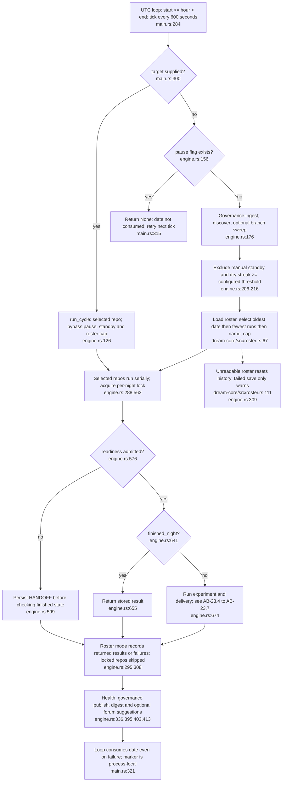
```mermaid
flowchart TB
    LOOP["UTC loop: start <= hour < end; tick every 600 seconds<br/>main.rs:284"]
    TARGET{"target supplied?<br/>main.rs:300"}
    LOOP --> TARGET
    TARGET -->|yes| SINGLE["run_cycle: selected repo; bypass pause, standby and roster cap<br/>engine.rs:126"]
    TARGET -->|no| PAUSE{"pause flag exists?<br/>engine.rs:156"}
    PAUSE -->|yes| RETRY["Return None: date not consumed; retry next tick<br/>main.rs:315"]
    PAUSE -->|no| NIGHT["Governance ingest; discover; optional branch sweep<br/>engine.rs:176"]
    NIGHT --> FILTER["Exclude manual standby and dry streak >= configured threshold<br/>engine.rs:206-216"]
    FILTER --> ROS["Load roster, select oldest date then fewest runs then name; cap<br/>dream-core/src/roster.rs:67"]
    ROS --> LOCK["Selected repos run serially; acquire per-night lock<br/>engine.rs:288,563"]
    SINGLE --> LOCK
    LOCK --> READY{"readiness admitted?<br/>engine.rs:576"}
    READY -->|no| HAND["Persist HANDOFF before checking finished state<br/>engine.rs:599"]
    READY -->|yes| DONE{"finished_night?<br/>engine.rs:641"}
    DONE -->|yes| OLD["Return stored result<br/>engine.rs:655"]
    DONE -->|no| CYCLE["Run experiment and delivery; see AB-23.4 to AB-23.7<br/>engine.rs:674"]
    HAND --> RECORD["Roster mode records returned results or failures; locked repos skipped<br/>engine.rs:295,308"]
    OLD --> RECORD
    CYCLE --> RECORD
    RECORD --> HEALTH["Health, governance publish, digest and optional forum suggestions<br/>engine.rs:336,395,403,413"]
    HEALTH --> DATE["Loop consumes date even on failure; marker is process-local<br/>main.rs:321"]
    ROS -.-> LOSS["Unreadable roster resets history; failed save only warns<br/>dream-core/src/roster.rs:111<br/>engine.rs:309"]
```

**Limits.** The window controls start time, not a night deadline. Pause is checked only at roster entry, not during a night or targeted execution. Readiness can append HANDOFF to an already finished night; see the 1 November controls audit.

## AB-23.3 Module map and the licence boundary

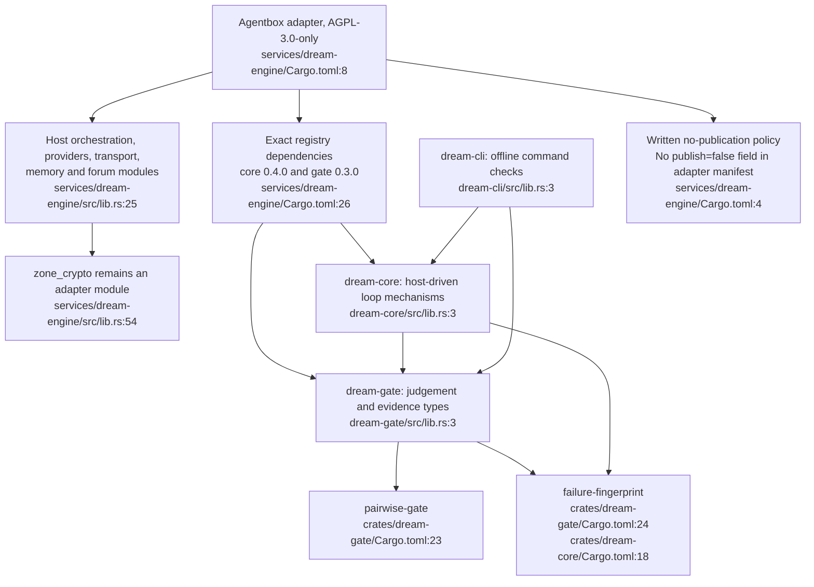
```mermaid
flowchart TB
    AD["Agentbox adapter, AGPL-3.0-only<br/>services/dream-engine/Cargo.toml:8"] --> MODULES["Host orchestration, providers, transport,<br/>memory and forum modules<br/>services/dream-engine/src/lib.rs:25"]
    MODULES --> ENVELOPE["zone_crypto remains an adapter module<br/>services/dream-engine/src/lib.rs:54"]
    AD --> PIN["Exact registry dependencies<br/>core 0.4.0 and gate 0.3.0<br/>services/dream-engine/Cargo.toml:26"]
    PIN --> CORE["dream-core: host-driven loop mechanisms<br/>dream-core/src/lib.rs:3"]
    PIN --> GATE["dream-gate: judgement and evidence types<br/>dream-gate/src/lib.rs:3"]
    CORE --> GATE
    GATE --> PAIR["pairwise-gate<br/>crates/dream-gate/Cargo.toml:23"]
    GATE --> FP["failure-fingerprint<br/>crates/dream-gate/Cargo.toml:24<br/>crates/dream-core/Cargo.toml:18"]
    CORE --> FP
    CLI["dream-cli: offline command checks<br/>dream-cli/src/lib.rs:3"] --> CORE
    CLI --> GATE
    AD --> POLICY["Written no-publication policy<br/>No publish=false field in adapter manifest<br/>services/dream-engine/Cargo.toml:4"]
```

**What it shows.** The adapter imports the reusable engine and retains product-specific modules. Its exact pins resolve to one dream-gate version. The [migration/provenance audit](../../estate-review/2026-11-01-dream-migration-and-provenance.md) compares all 36 Rust source files in the four consumed crate releases and checks their cached archives against the consumer lockfile.

**Why it is this way.** ADR-2141 separates the engine mechanism from host orchestration. That dependency boundary does not itself enforce the adapter's no-publication policy: offline Cargo metadata leaves publication unrestricted and the selected package files include zone_crypto. No package was uploaded.

**Open (publication control):** the adapter's manifest declares its licence and version but no publication restriction (`../project/agentbox/services/dream-engine/Cargo.toml:4`, `../project/agentbox/services/dream-engine/Cargo.toml:8`). Source placement and stated policy must not be presented as a registry guard.

**Drift (activation evidence):** ADR-2141 records activation on 16 October and a later 0.3.0 re-verification (`../project/agentbox/docs/adr/ADR-2141-extract-the-dream-engine-core-into-a-standalone-permissive-repo.md:47`, `../project/agentbox/docs/adr/ADR-2141-extract-the-dream-engine-core-into-a-standalone-permissive-repo.md:55`). Current source pins core 0.4.0 (`../project/agentbox/services/dream-engine/Cargo.toml:26`); those historical records do not establish its current running image. The local tests in the dated audit use fixture services.

## AB-23.4 The guard ordering and the deterministic gate

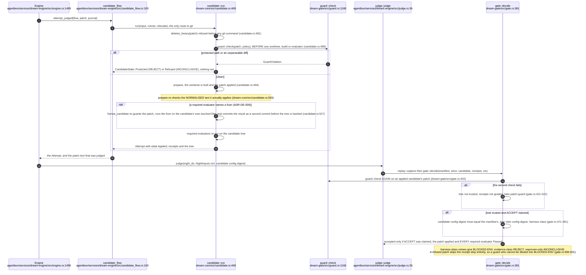
```mermaid
sequenceDiagram
    autonumber
    participant ENG as Engine<br/>agentbox/services/dream-engine/src/engine.rs:1499
    participant CF as candidate_flow<br/>agentbox/services/dream-engine/src/candidate_flow.rs:100
    participant RUN as candidate::run<br/>dream-core/src/candidate.rs:469
    participant GRD as guard::check<br/>dream-gate/src/guard.rs:1168
    participant J as judge::judge<br/>agentbox/services/dream-engine/src/judge.rs:36
    participant G as gate::decide<br/>dream-gate/src/gate.rs:381

    ENG->>CF: attempt_judged(flow, patch, journal)
    CF->>RUN: run(input, runner, relocate), the only route to git
    RUN->>RUN: deletes_binary(patch) refused before any git command (candidate.rs:481)
    RUN->>GRD: guard::check(patch, policy), BEFORE any worktree, build or evaluator (candidate.rs:489)
    alt protected path or an unparseable diff
        GRD-->>RUN: GuardViolation
        RUN-->>CF: CandidateState::Protected (REJECT) or Refused (INCONCLUSIVE), nothing ran
    else clean
        RUN->>RUN: prepare, the worktree is built and the patch applied (candidate.rs:494)
        Note over RUN: prepare re-checks the NORMALISED text it actually applies (dream-core/src/candidate.rs:503)
        opt a required evaluator names a fixer (ADR-DE-009)
            RUN->>RUN: format_candidate re-guards the patch, runs the fixer on the candidate's own touched files and commits the result as a second commit before the tree is hashed (candidate.rs:527)
        end
        RUN->>RUN: required evaluators re-run on the candidate tree
        RUN-->>CF: Attempt with state Applied, receipts and the tree
    end
    CF-->>ENG: the Attempt, and the patch text that was judged
    ENG->>J: judge(night_dir, NightInputs incl. candidate config digest)
    J->>G: replay::capture then gate::decide(manifest, strict, candidate, receipts, ctx)
    G->>GRD: guard::check AGAIN on an applied candidate's patch (dream-gate/src/gate.rs:420)
    alt the second check fails
        G->>G: tree not trusted, receipts not graded, Veto patch-guard (gate.rs:421-422)
    end
    alt tree trusted and ACCEPT claimed
        G->>G: candidate config digest must equal the manifest's, else Veto config-digest, harness class (gate.rs:471-481)
    end
    G-->>J: accepted only if ACCEPT was claimed, the patch applied and EVERY required evaluator Passed
    Note over G: harness-class vetoes give BLOCKED-ENV, evidence-class REJECT, unproven-only INCONCLUSIVE.<br/>A refused patch skips the receipt step entirely, so a guard veto cannot be diluted into BLOCKED-ENV (gate.rs:496-501)
```

**What it shows.** Where the protected-path guard sits: once inside `candidate::run` before anything is applied, and once more inside `gate::decide`, which re-derives the touched paths from the patch text rather than trusting the caller. The config-digest check binds the environment the candidate was evaluated in to the one the manifest froze.

**Why it is this way.** The old engine had no guard before apply (ADR-2141, Context). Making `candidate_flow` the only caller of `candidate::run` means the apply-repair pass is guarded too, because its corrected diff re-enters `run` (`../project/agentbox/services/dream-engine/src/candidate_flow.rs:5-9`). The second check is defence in depth, owned by the core (GAT-01).

**Open:** the formatter step is inert at this stamp, because it runs only when a required evaluator names a `fixer` and no evaluator in the repository's own `dream.config.json` does (`../dream-engine/crates/dream-core/src/candidate.rs:527`, `../project/agentbox/dream.config.json:43`); `judge.rs` asserts the adapter itself holds no `rustfmt` or `cargo fmt`, so the mechanism stays in the core (`../project/agentbox/services/dream-engine/src/judge.rs:303`).

**Invariant:** no path in the adapter builds a gate context without the night's one policy, and no path calls `gate::decide` directly (`../project/agentbox/services/dream-engine/src/judge.rs:11-12`, `../project/agentbox/services/dream-engine/src/policy.rs:5-9`).

**Invariant:** evaluator failure vetoes acceptance, and an ACCEPT with no applied candidate is unproven, not a harness fault (`../dream-engine/crates/dream-gate/src/gate.rs:461`, see AB-23.13).

## AB-23.5 Candidate re-evaluation on an isolated worktree

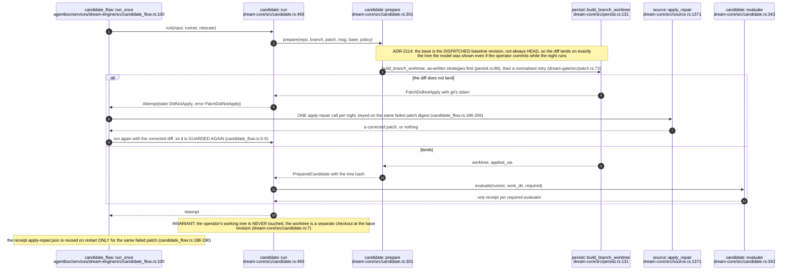
```mermaid
sequenceDiagram
    autonumber
    participant CF as candidate_flow::run_once<br/>agentbox/services/dream-engine/src/candidate_flow.rs:100
    participant RUN as candidate::run<br/>dream-core/src/candidate.rs:469
    participant PRE as candidate::prepare<br/>dream-core/src/candidate.rs:301
    participant BW as persist::build_branch_worktree<br/>dream-core/src/persist.rs:131
    participant SRC as source::apply_repair<br/>dream-core/src/source.rs:1371
    participant EV as candidate::evaluate<br/>dream-core/src/candidate.rs:343

    CF->>RUN: run(input, runner, relocate)
    RUN->>PRE: prepare(repo, branch, patch, msg, base, policy)
    Note over PRE,BW: ADR-2114: the base is the DISPATCHED baseline revision, not always HEAD, so the diff lands on exactly<br/>the tree the model was shown even if the operator commits while the night runs
    PRE->>BW: build_branch_worktree, as-written strategies first (persist.rs:86), then a normalised retry (dream-gate/src/patch.rs:73)
    alt the diff does not land
        BW-->>RUN: PatchDidNotApply with git's stderr
        RUN-->>CF: Attempt{state DidNotApply, error PatchDidNotApply}
        CF->>SRC: ONE apply-repair call per night, keyed on the same failed patch digest (candidate_flow.rs:186-206)
        SRC-->>CF: a corrected patch, or nothing
        CF->>RUN: run again with the corrected diff, so it is GUARDED AGAIN (candidate_flow.rs:5-9)
    else lands
        BW-->>PRE: worktree, applied_via
        PRE-->>RUN: PreparedCandidate with the tree hash
        RUN->>EV: evaluate(runner, work_dir, required)
        EV-->>RUN: one receipt per required evaluator
    end
    RUN-->>CF: Attempt
    Note over RUN: INVARIANT: the operator's working tree is NEVER touched, the worktree is a separate checkout at the base<br/>revision (dream-core/src/candidate.rs:7)
    Note over CF: the receipt apply-repair.json is reused on restart ONLY for the same failed patch (candidate_flow.rs:186-190)
```

**What it shows.** The adapter side of the candidate step and the core calls beneath it. The apply strategies, the normalisation rule that never edits a plus or minus line, and the typed `AttemptError` are all in the core and are drawn in NIT-01 and GAT-01 there.

**Why it is this way.** ADR-2114 (candidate diffs are written against engine-read source) fixed the base revision, and ADR-2141 collapsed the engine's four separate call sites into `candidate::run` so that the guard cannot be skipped.

## AB-23.6 Persistence and the human merge gate

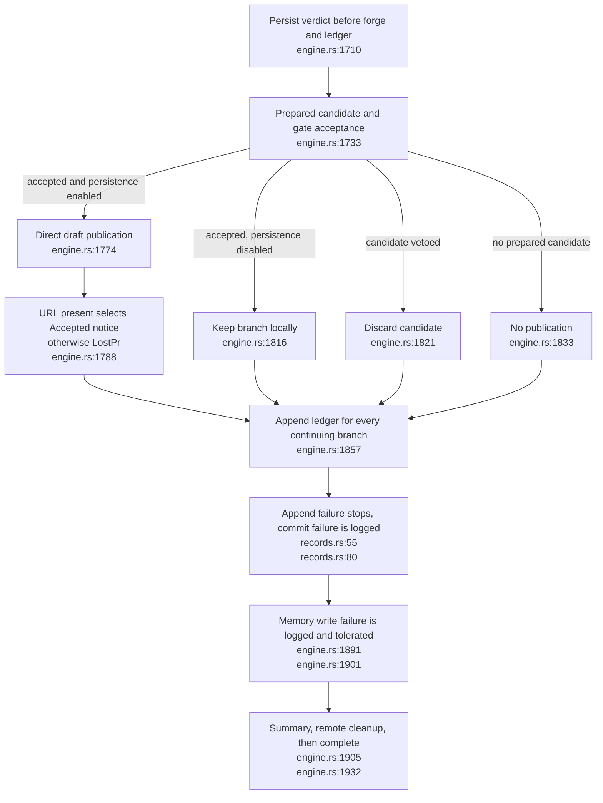
```mermaid
flowchart TB
    PERSIST["Persist verdict before forge and ledger<br/>engine.rs:1710"] --> CHOOSE["Prepared candidate and gate acceptance<br/>engine.rs:1733"]
    CHOOSE -->|"accepted and persistence enabled"| PUSH["Direct draft publication<br/>engine.rs:1774"]
    CHOOSE -->|"accepted, persistence disabled"| LOCAL["Keep branch locally<br/>engine.rs:1816"]
    CHOOSE -->|"candidate vetoed"| DISCARD["Discard candidate<br/>engine.rs:1821"]
    CHOOSE -->|"no prepared candidate"| NONE["No publication<br/>engine.rs:1833"]
    PUSH --> RESULT["URL present selects Accepted notice<br/>otherwise LostPr<br/>engine.rs:1788"]
    RESULT --> LED["Append ledger for every continuing branch<br/>engine.rs:1857"]
    LOCAL --> LED
    DISCARD --> LED
    NONE --> LED
    LED --> COMMIT["Append failure stops, commit failure is logged<br/>records.rs:55<br/>records.rs:80"]
    COMMIT --> MEMORY["Memory write failure is logged and tolerated<br/>engine.rs:1891<br/>engine.rs:1901"]
    MEMORY --> COMPLETE["Summary, remote cleanup, then complete<br/>engine.rs:1905<br/>engine.rs:1932"]
```

**What it shows.** The adapter checks publication eligibility before calling the forge, and calls `Forge::publish_draft` directly. The common ledger path follows all continuing branches, including vetoed and locally retained candidates. A publication failure does not erase the verdict; it changes the PR reference and notice. Earlier inbox and request-store effects precede the persistence boundary described here.

**Why it is this way.** A human still decides the merge. The core's `autoMerge` policy is only used by `persist::publish`, which this adapter does not call. The [1 November forge/seam audit](../../estate-review/2026-11-01-dream-forge-and-seam-contracts.md) exercises the real GhForge subprocess boundary with local Git remotes and an offline replacement for gh; it does not establish live GitHub behaviour or current deployment.

**Open (publication identity):** the PR request carries a branch name, not the verified commit hash (`../dream-engine/crates/dream-core/src/seams.rs:341`). A successful create command returns Some even for empty stdout (`../dream-engine/crates/dream-core/src/seams.rs:531`); the adapter then selects the acceptance notice by Option presence. The tested command boundary does not validate the URL or bind the pushed head to the evaluated tree.

**Tension (error ownership):** draft creation exposes only pushed and an optional URL, losing the command error detail (`../dream-engine/crates/dream-core/src/seams.rs:425`, `../dream-engine/crates/dream-core/src/seams.rs:512`). Memory errors are journalled and logged but tolerated (`../project/agentbox/services/dream-engine/src/engine.rs:1895`); they are not automatically written into the core run-state last_error field. ADR-DE-005's universal error-propagation wording is broader than this implementation.

## AB-23.7 Run journal — restart, resume, abandonment and the finished-night rule

```mermaid
flowchart TB
    LOCK["Acquire night lock<br/>engine.rs:563"] --> CHECK["Check finished night<br/>engine.rs:641"]
    CHECK -->|"matching terminal journal"| SKIP["Return recorded result<br/>engine.rs:649"]
    CHECK -->|"damaged journal"| BLOCK["Report journal fault<br/>engine.rs:644"]
    CHECK -->|"absent, unfinished or wrong night"| FREEZE["Build and freeze manifest<br/>engine.rs:700<br/>engine.rs:763"]
    FREEZE --> HEALTH["Annexe health before begin<br/>engine.rs:823"]
    HEALTH --> BEGIN["Begin checks night identity and attempts<br/>runstate.rs:523<br/>runstate.rs:542"]
    BEGIN -->|"same run, budget remains"| RESUME["Resumed with attempt increment<br/>runstate.rs:549"]
    BEGIN -->|"new run, budget remains"| FRESH["Fresh with carried attempt count<br/>runstate.rs:560"]
    BEGIN -->|"wrong night or exhausted"| STOP["Refuse or abandon<br/>runstate.rs:526<br/>runstate.rs:542"]
    RESUME --> PERSIST["Persist verdict before forge and ledger<br/>engine.rs:1710"]
    FRESH --> PERSIST
    PERSIST --> IO["Journal write uses temporary file and rename<br/>manifest.rs:328"]
```

**What it shows.** The early terminal check precedes manifest freezing, but it returns no result for a journal belonging to another night. `begin` rejects that identity later, after freezing and annexe health. Same-run retries increment the attempt; changed-run retries start at Initialised while carrying the night's count. A persisted verdict stops a restart even if HEAD moved.

**Why it is this way.** ADR-DE-007 repairs the earlier run-id-only rule. The [1 November recovery audit](../../estate-review/2026-11-01-dream-recovery-and-source-supply.md) verifies lock release and restart decisions after killing a fixture process before and after persistence. These tests cover process death, not power loss or successful publication. The writer does not synchronise file or directory contents (`../dream-engine/crates/dream-gate/src/manifest.rs:328`); the reset helper uses several link/unlink operations with best-effort rollback (`../dream-engine/crates/dream-core/src/runstate.rs:466`).

**Invariant:** the adapter checks the result of `persist` before attempting accepted-candidate publication (`../project/agentbox/services/dream-engine/src/engine.rs:1710`). At-most-once claims depend on the journal surviving, the lock being honoured and no explicit reset; the library does not reconcile forge outcomes.

## AB-23.8 Core types

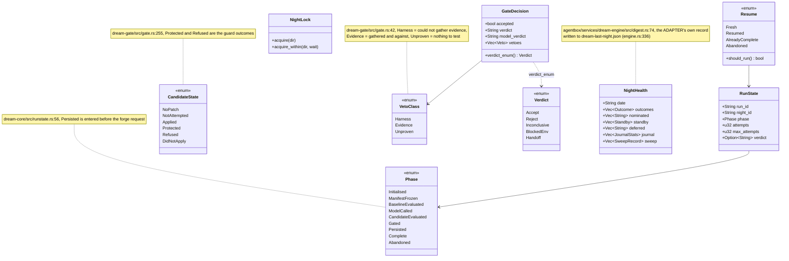
```mermaid
classDiagram
    class RunState {
        +String run_id
        +String night_id
        +Phase phase
        +u32 attempts
        +u32 max_attempts
        +Option~String~ verdict
    }
    class Phase {
        <<enum>>
        Initialised
        ManifestFrozen
        BaselineEvaluated
        ModelCalled
        CandidateEvaluated
        Gated
        Persisted
        Complete
        Abandoned
    }
    class Resume {
        <<enum>>
        Fresh
        Resumed
        AlreadyComplete
        Abandoned
        +should_run() bool
    }
    class NightLock {
        +acquire(dir)
        +acquire_within(dir, wait)
    }
    class CandidateState {
        <<enum>>
        NoPatch
        NotAttempted
        Applied
        Protected
        Refused
        DidNotApply
    }
    class GateDecision {
        +bool accepted
        +String verdict
        +String model_verdict
        +Vec~Veto~ vetoes
        +verdict_enum() Verdict
    }
    class VetoClass {
        <<enum>>
        Harness
        Evidence
        Unproven
    }
    class Verdict {
        <<enum>>
        Accept
        Reject
        Inconclusive
        BlockedEnv
        Handoff
    }
    class NightHealth {
        +String date
        +Vec~Outcome~ outcomes
        +Vec~String~ nominated
        +Vec~Standby~ standby
        +Vec~String~ deferred
        +Vec~JournalStats~ journal
        +Vec~SweepRecord~ sweep
    }
    RunState --> Phase
    Resume --> RunState
    GateDecision --> VetoClass
    GateDecision ..> Verdict : verdict_enum
    note for Phase "dream-core/src/runstate.rs:56, Persisted is entered before the forge request"
    note for CandidateState "dream-gate/src/gate.rs:255, Protected and Refused are the guard outcomes"
    note for VetoClass "dream-gate/src/gate.rs:42, Harness = could not gather evidence,<br/>Evidence = gathered and against, Unproven = nothing to test"
    note for NightHealth "agentbox/services/dream-engine/src/digest.rs:74, the ADAPTER's own record<br/>written to dream-last-night.json (engine.rs:336)"
```

**What it shows.** The types that cross the boundary. `Phase`, `Resume` and `NightLock` live in `dream-core`, the gate types in `dream-gate`, and `NightHealth` is the adapter's.

**Why it is this way.** The `Unusable` readiness variants and `ExperimentManifest` are omitted here: they are drawn in the core corpus. The `Persisted` phase and `NightLock` are new since the previous stamp, and `CandidateState` gained `Protected` for a guard refusal.

## AB-23.9 Reminder counts local open items, not confirmed forum cases

```mermaid
flowchart TB
    BOOT["Boot prefers baked hook, then checkout; dedupes command substring<br/>entrypoint-unified.sh:2208-2221"] --> INPUT["UserPromptSubmit stdin<br/>dream-inbox-surface.cjs:35-39"]
    INPUT --> MACHINE{"Prompt starts with a known machine-turn tag?<br/>dream-inbox-surface.cjs:31-41"}
    MACHINE -->|yes| EXIT["No context injection<br/>dream-inbox-surface.cjs:68-70"]
    MACHINE -->|no| READ["Read JSON array; count status=open<br/>No published_event_id or relay check<br/>dream-inbox-surface.cjs:42-45"]
    READ -->|"missing, malformed, empty"| EXIT
    READ -->|"open items"| TIME{"More than 4 hours since shared stamp?<br/>dream-inbox-surface.cjs:48-51"}
    TIME -->|no| EXIT
    TIME -->|yes| OUT["Emit additionalContext under<br/>hookSpecificOutput<br/>One count and panel URL, no item bodies<br/>dream-inbox-surface.cjs:51-56"]
    OUT --> STAMP["Write stamp in stdout callback; inbox untouched<br/>Stamp write failure is ignored<br/>dream-inbox-surface.cjs:59-61"]
```

**Meaning.** The pointer says decisions await on the panel even when all open items lack a publication receipt. It measures local backlog; publication success and panel visibility need separate evidence. Existing fixture tests use unpublished items and still receive that wording.
**Limits.** The timestamp is shared by sessions but read and written without locking, so four hours is a sequential suppression policy, not a concurrent delivery guarantee. Failed stamp writes permit another reminder. See the [governance audit](../../estate-review/2026-11-01-dream-governance-and-delivery.md).
**Source pin.** Boot citations use the existing topic revision. The selected registration block is unchanged at the current checkout but moved to lines 2171–2196; the audit manifest records that comparison.

## AB-23.10 Control and reporting surfaces

```mermaid
flowchart LR
    SKILL["Operator /dream commands<br/>commands/dream.md:7"]
    SKILL --> STATUS["status: supervisor, pause flag, roster, ledgers and last-night health<br/>commands/dream.md:10"]
    SKILL --> RUN["run: stop loop, invoke baked Rust binary --once, restart loop<br/>commands/dream.md:46"]
    RUN --> ALL["No target: run_night checks pause and standby<br/>main.rs:253"]
    RUN --> ONE["--target: run_cycle bypasses pause and standby<br/>main.rs:261"]
    SKILL --> PAUSE["off/on: create/remove dream-paused flag<br/>commands/dream.md:41"]
    SKILL --> STAND["standby/revive: create/remove repo marker<br/>commands/dream.md:61"]
    SKILL --> FORUM["questions/answer/dismiss: forum decisions; local inbox is break-glass<br/>commands/dream.md:17"]
    SKILL --> DIG["digest and governance use Rust subcommands<br/>main.rs:117"]
    SKILL --> NOM["nominate: author repo config and verify evaluators<br/>commands/dream.md:74"]
    SKILL --> HAR["harvest: dream-harvest.mjs<br/>commands/dream.md:31"]
    API["Separate HTTP surface: GET /dream/status only; no run control<br/>routes/dream.js:24"]
    API --> JS["aggregateDreamStatus reads nominated repo ledgers<br/>dream-ledger.js:397"]
    JS --> PATH["Ledger path and realpath containment; 5 MiB limit<br/>dream-ledger.js:346"]
    JS -.-> DIFF["Status discovery ignores symlink dirs; Rust scheduler follows them<br/>dream-ledger.js:248<br/>dream-engine/src/config.rs:223"]
    RESET["reset-night joins caller date/repo into artefact path<br/>main.rs:142"]
    RESET --> ARCH["Acquire night lock then archive state and manifest; see AB-23.7<br/>dream-core/src/runstate.rs:441"]
```

**Scope.** This corrects the stale route from `/dream run` to the legacy JavaScript orchestrator. The skill's fixed window/cap summary is guidance, not effective-config reporting; HTTP status and scheduler discovery can disagree on symlinked nominations.

## AB-23.11 Annexe depth preserves layout, not immutable input identity

```mermaid
flowchart TB
    BASE["Capture target HEAD commit and tree<br/>baseline.rs:37; engine.rs:681"]
    BASE --> SUB["Canonical repo path relative to canonical workspace<br/>dispatch.rs:295"]
    SUB -->|inside workspace| DEPTH["Preserve nested depth, including symlink resolution<br/>dispatch.rs:307"]
    SUB -->|outside or unresolved| LEAF["Fall back to leaf name<br/>dispatch.rs:296-305"]
    DEPTH --> SHIP["clone_repo_and_siblings ships target first<br/>dispatch.rs:272"]
    LEAF --> SHIP
    SHIP --> ARCH["git archive resolves HEAD again at dispatch time<br/>dispatch.rs:183-194"]
    ARCH --> TAR["Copy archive, then tar into remote_dir/subpath<br/>dispatch.rs:203-214"]
    TAR --> SIB["For each configured sibling: resolve path, derive subpath, archive<br/>dispatch.rs:275-285"]
    SIB --> MISSING["Missing directory: warn and skip<br/>dispatch.rs:277"]
    SIB --> OVERLAY["Same destination: extract over existing target files<br/>No destination uniqueness check<br/>dispatch.rs:283-285"]
    BASE -.-> DRIFT["Frozen A, dispatch after HEAD moves to B: archive ships B<br/>baseline.rs:38; dispatch.rs:191"]
    OVERLAY -.-> MIX["Outside sibling with target's leaf can replace target source<br/>while retaining target-only files<br/>dispatch.rs:203-214"]
```

**Boundary.** Canonical depth fixes ordinary relative path dependencies. It does not freeze target/sibling revisions or prevent leaf-name overlays; the receipt audit reproduces both using local transport substitutes. Missing siblings are skipped, while archive/transfer errors propagate.

## AB-23.12 Pipefail preserves pipeline failure, with classification limits

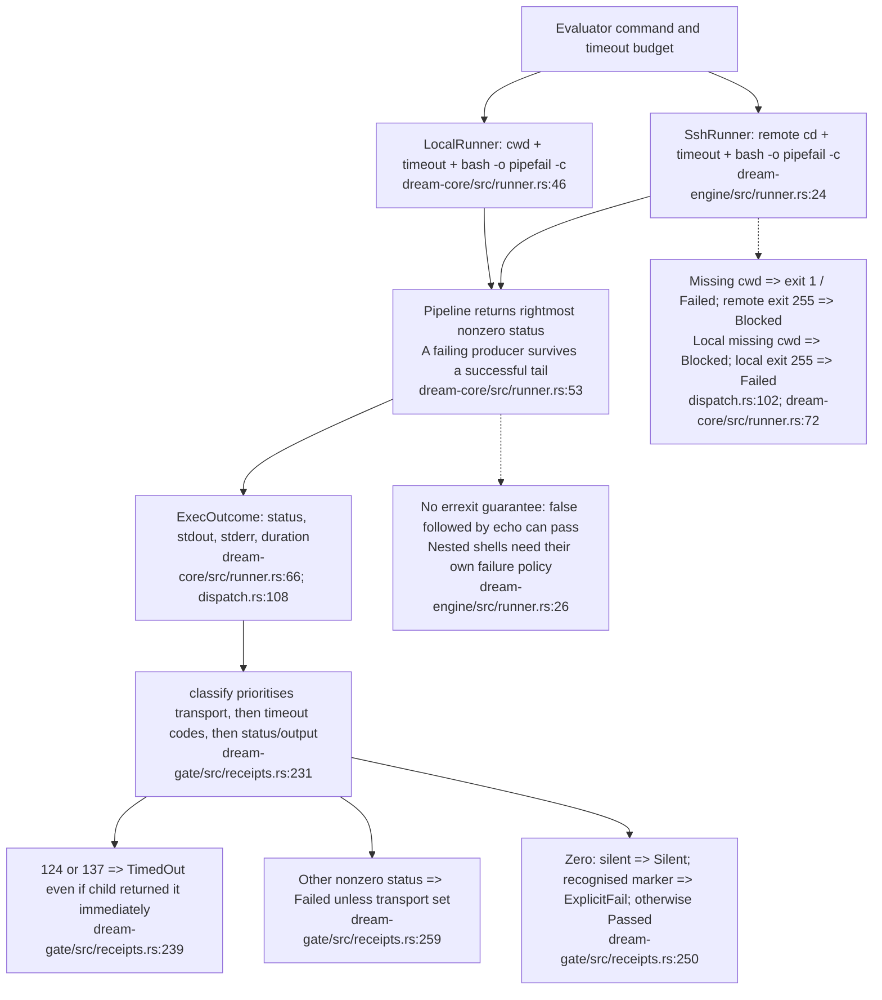
```mermaid
flowchart TB
    CMD["Evaluator command and timeout budget"]
    CMD --> LOC["LocalRunner: cwd + timeout + bash -o pipefail -c<br/>dream-core/src/runner.rs:46"]
    CMD --> SSH["SshRunner: remote cd + timeout + bash -o pipefail -c<br/>dream-engine/src/runner.rs:24"]
    LOC --> PIPE["Pipeline returns rightmost nonzero status<br/>A failing producer survives a successful tail<br/>dream-core/src/runner.rs:53"]
    SSH --> PIPE
    PIPE --> RAW["ExecOutcome: status, stdout, stderr, duration<br/>dream-core/src/runner.rs:66; dispatch.rs:108"]
    RAW --> CLASS["classify prioritises transport, then timeout codes, then status/output<br/>dream-gate/src/receipts.rs:231"]
    CLASS --> RESERVED["124 or 137 => TimedOut even if child returned it immediately<br/>dream-gate/src/receipts.rs:239"]
    CLASS --> FAIL["Other nonzero status => Failed unless transport set<br/>dream-gate/src/receipts.rs:259"]
    CLASS --> ZERO["Zero: silent => Silent; recognised marker => ExplicitFail; otherwise Passed<br/>dream-gate/src/receipts.rs:250"]
    SSH -.-> DIFFER["Missing cwd => exit 1 / Failed; remote exit 255 => Blocked<br/>Local missing cwd => Blocked; local exit 255 => Failed<br/>dispatch.rs:102; dream-core/src/runner.rs:72"]
    PIPE -.-> MASK["No errexit guarantee: false followed by echo can pass<br/>Nested shells need their own failure policy<br/>dream-engine/src/runner.rs:26"]
```

**Scope.** Pipefail preserves the status of this shell's pipeline; it does not prove evaluator sensitivity or identify which process failed. The local and SSH paths can classify the same environment fault differently. GNU Bash specifies the rightmost failing stage, correcting the former first-stage claim.

## AB-23.13 No-patch ACCEPT is unproven, but the adapter still alerts

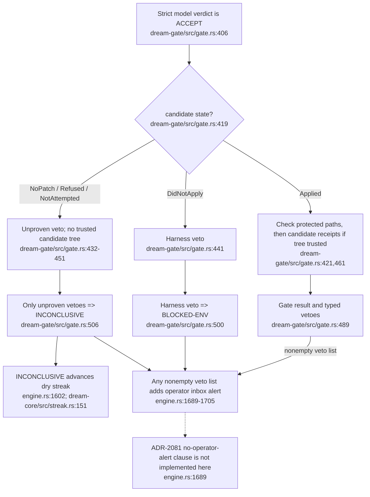
```mermaid
flowchart TB
    ACCEPT["Strict model verdict is ACCEPT<br/>dream-gate/src/gate.rs:406"]
    ACCEPT --> STATE{"candidate state?<br/>dream-gate/src/gate.rs:419"}
    STATE -->|NoPatch / Refused / NotAttempted| UNPROVEN["Unproven veto; no trusted candidate tree<br/>dream-gate/src/gate.rs:432-451"]
    STATE -->|DidNotApply| HARNESS["Harness veto<br/>dream-gate/src/gate.rs:441"]
    STATE -->|Applied| GUARD["Check protected paths, then candidate receipts if tree trusted<br/>dream-gate/src/gate.rs:421,461"]
    UNPROVEN --> VERDICT["Only unproven vetoes => INCONCLUSIVE<br/>dream-gate/src/gate.rs:506"]
    HARNESS --> BLOCK["Harness veto => BLOCKED-ENV<br/>dream-gate/src/gate.rs:500"]
    VERDICT --> STREAK["INCONCLUSIVE advances dry streak<br/>engine.rs:1602; dream-core/src/streak.rs:151"]
    VERDICT --> ALERT["Any nonempty veto list adds operator inbox alert<br/>engine.rs:1689-1705"]
    BLOCK --> ALERT
    GUARD --> RESULT["Gate result and typed vetoes<br/>dream-gate/src/gate.rs:489"]
    RESULT -->|nonempty veto list| ALERT
    ALERT -.-> GAP["ADR-2081 no-operator-alert clause is not implemented here<br/>engine.rs:1689"]
```

**Verified distinction.** The no-patch fixture yields INCONCLUSIVE and no Harness veto, but does add an alert. Candidate receipt grading and notification policy are separate; a verdict class alone does not suppress operator messages.

## AB-23.14 Finding selection, validation and append-time repair

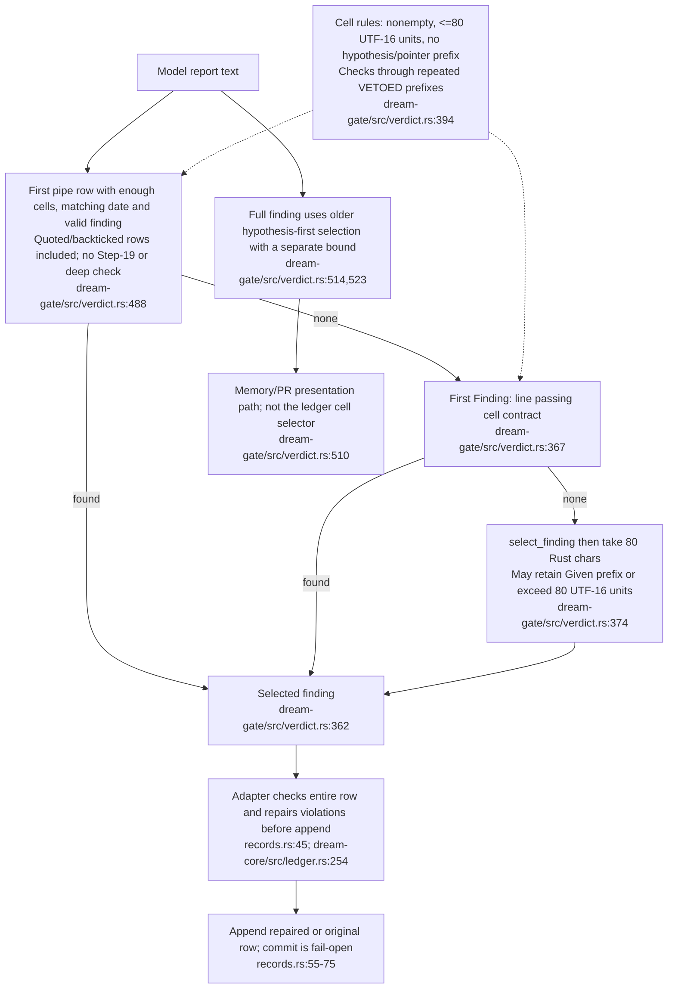
```mermaid
flowchart TB
    REPORT["Model report text"] --> TABLE["First pipe row with enough cells, matching date and valid finding<br/>Quoted/backticked rows included; no Step-19 or deep check<br/>dream-gate/src/verdict.rs:488"]
    TABLE -->|found| SELECTED["Selected finding<br/>dream-gate/src/verdict.rs:362"]
    TABLE -->|none| LINE["First Finding: line passing cell contract<br/>dream-gate/src/verdict.rs:367"]
    LINE -->|found| SELECTED
    LINE -->|none| FALL["select_finding then take 80 Rust chars<br/>May retain Given prefix or exceed 80 UTF-16 units<br/>dream-gate/src/verdict.rs:374"]
    FALL --> SELECTED
    SELECTED --> BACK["Adapter checks entire row and repairs violations before append<br/>records.rs:45; dream-core/src/ledger.rs:254"]
    BACK --> LEDGER["Append repaired or original row; commit is fail-open<br/>records.rs:55-75"]
    RULES["Cell rules: nonempty, <=80 UTF-16 units, no hypothesis/pointer prefix<br/>Checks through repeated VETOED prefixes<br/>dream-gate/src/verdict.rs:394"] -.-> TABLE
    RULES -.-> LINE
    REPORT --> FULL["Full finding uses older hypothesis-first selection with a separate bound<br/>dream-gate/src/verdict.rs:514,523"]
    FULL --> OTHER["Memory/PR presentation path; not the ledger cell selector<br/>dream-gate/src/verdict.rs:510"]
```

**Limits.** Selection establishes syntax and date, not provenance from a particular report section or evaluated deep. The fallback needs the adapter's repair backstop; UTF-16 validation does not make its character truncation equivalent. Unicode parity differences remain recorded in the migration audit.

## AB-23.15 Provider selection, retries and cross-provider fallback

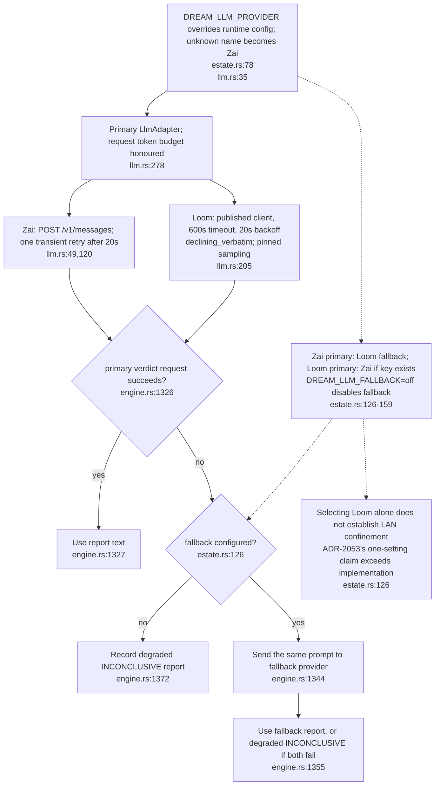
```mermaid
flowchart TB
    CFG["DREAM_LLM_PROVIDER overrides runtime config; unknown name becomes Zai<br/>estate.rs:78<br/>llm.rs:35"]
    CFG --> PRIMARY["Primary LlmAdapter; request token budget honoured<br/>llm.rs:278"]
    PRIMARY --> ZAI["Zai: POST /v1/messages; one transient retry after 20s<br/>llm.rs:49,120"]
    PRIMARY --> LOOM["Loom: published client, 600s timeout, 20s backoff<br/>declining_verbatim; pinned sampling<br/>llm.rs:205"]
    ZAI --> RESULT{"primary verdict request succeeds?<br/>engine.rs:1326"}
    LOOM --> RESULT
    RESULT -->|yes| REPORT["Use report text<br/>engine.rs:1327"]
    RESULT -->|no| FB{"fallback configured?<br/>estate.rs:126"}
    FB -->|no| DEG["Record degraded INCONCLUSIVE report<br/>engine.rs:1372"]
    FB -->|yes| SEND["Send the same prompt to fallback provider<br/>engine.rs:1344"]
    SEND --> OUT["Use fallback report, or degraded INCONCLUSIVE if both fail<br/>engine.rs:1355"]
    CFG -.-> POLICY["Zai primary: Loom fallback; Loom primary: Zai if key exists<br/>DREAM_LLM_FALLBACK=off disables fallback<br/>estate.rs:126-159"]
    POLICY -.-> FB
    POLICY -.-> EGRESS["Selecting Loom alone does not establish LAN confinement<br/>ADR-2053's one-setting claim exceeds implementation<br/>estate.rs:126"]
```

**Egress.** Retaining Z.AI as the default is the recorded operator decision. LAN confinement requires the effective primary, fallback and endpoint policy to agree; a provider label alone does not enforce it. Client-level guarantees remain owned by AB-28.11.

## AB-23.16 Placeholder and dispatch guards have limited coverage

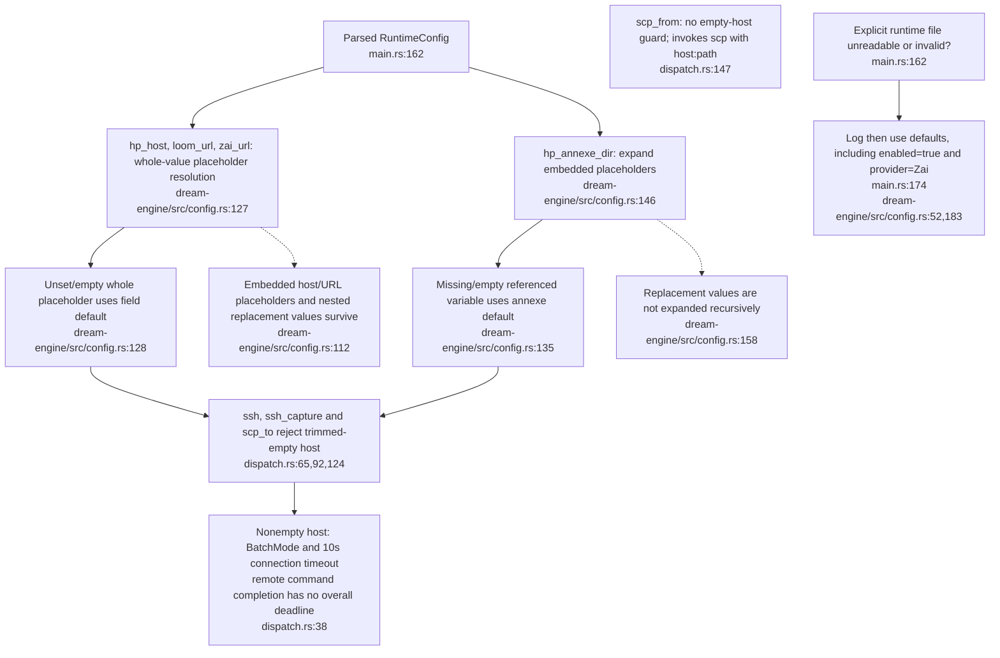
```mermaid
flowchart TB
    INPUT["Parsed RuntimeConfig<br/>main.rs:162"]
    INPUT --> WHOLE["hp_host, loom_url, zai_url: whole-value placeholder resolution<br/>dream-engine/src/config.rs:127"]
    INPUT --> INFIX["hp_annexe_dir: expand embedded placeholders<br/>dream-engine/src/config.rs:146"]
    WHOLE --> DEFAULT["Unset/empty whole placeholder uses field default<br/>dream-engine/src/config.rs:128"]
    INFIX --> DEFAULT2["Missing/empty referenced variable uses annexe default<br/>dream-engine/src/config.rs:135"]
    WHOLE -.-> REMAIN["Embedded host/URL placeholders and nested replacement values survive<br/>dream-engine/src/config.rs:112"]
    INFIX -.-> NESTED["Replacement values are not expanded recursively<br/>dream-engine/src/config.rs:158"]
    DEFAULT --> GUARD["ssh, ssh_capture and scp_to reject trimmed-empty host<br/>dispatch.rs:65,92,124"]
    DEFAULT2 --> GUARD
    GUARD --> EXEC["Nonempty host: BatchMode and 10s connection timeout<br/>remote command completion has no overall deadline<br/>dispatch.rs:38"]
    FROM["scp_from: no empty-host guard; invokes scp with host:path<br/>dispatch.rs:147"]
    BAD["Explicit runtime file unreadable or invalid?<br/>main.rs:162"]
    BAD --> FALL["Log then use defaults, including enabled=true and provider=Zai<br/>main.rs:174<br/>dream-engine/src/config.rs:52,183"]
```

**Limit.** Existing tests cover the original simple-placeholder failures, not a universal ban on unresolved placeholders. The isolated controls probe confirms nested values survive and empty-host scp_from launches a fake executable.

## AB-23.17 Forum decisions — local application and delivery boundaries

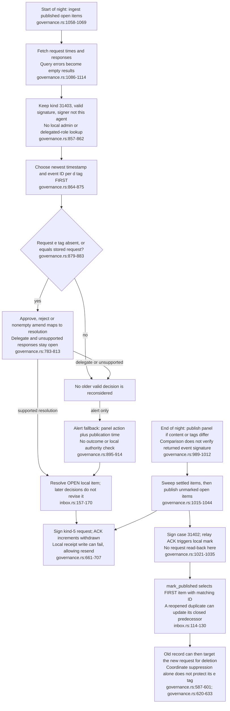
```mermaid
flowchart TB
    ING["Start of night: ingest published open items<br/>governance.rs:1058-1069"] --> FETCH["Fetch request times and responses<br/>Query errors become empty results<br/>governance.rs:1086-1114"]
    FETCH --> VALID["Keep kind 31403, valid signature, signer not this agent<br/>No local admin or delegated-role lookup<br/>governance.rs:857-862"]
    VALID --> NEW["Choose newest timestamp and event ID per d tag FIRST<br/>governance.rs:864-875"]
    NEW --> BIND{"Request e tag absent, or equals stored request?<br/>governance.rs:879-883"}
    BIND -->|yes| MAP["Approve, reject or nonempty amend maps to resolution<br/>Delegate and unsupported responses stay open<br/>governance.rs:783-813"]
    BIND -->|no| NONE["No older valid decision is reconsidered"]
    NONE -->|"alert only"| ACK["Alert fallback: panel action plus publication time<br/>No outcome or local authority check<br/>governance.rs:895-914"]
    MAP -->|"supported resolution"| SAVE["Resolve OPEN local item; later decisions do not revise it<br/>inbox.rs:157-170"]
    MAP -->|"delegate or unsupported"| NONE
    ACK --> SAVE
    SAVE --> WITHDRAW["Sign kind-5 request; ACK increments withdrawn<br/>Local receipt write can fail, allowing resend<br/>governance.rs:661-707"]
    PUB["End of night: publish panel if content or tags differ<br/>Comparison does not verify returned event signature<br/>governance.rs:989-1012"] --> SWEEP["Sweep settled items, then publish unmarked open items<br/>governance.rs:1015-1044"]
    SWEEP --> WITHDRAW
    SWEEP --> CASE["Sign case 31402; relay ACK triggers local mark<br/>No request read-back here<br/>governance.rs:1021-1035"]
    CASE --> REOPEN["mark_published selects FIRST item with matching ID<br/>A reopened duplicate can update its closed predecessor<br/>inbox.rs:114-130"]
    REOPEN --> RISK["Old record can then target the new request for deletion<br/>Coordinate suppression alone does not protect its e tag<br/>governance.rs:587-601; governance.rs:620-633"]
```

**Authority.** Signature validity and rejection of this agent's key do not establish a human decision. The configured relay supplies admission policy; current relay source allows admins and case-delegated reviewers. The adapter also accepts missing request binding and ignores supersession after local resolution; these boundaries are tested in the [governance audit](../../estate-review/2026-11-01-dream-governance-and-delivery.md).
**Delivery.** An accepted deletion is a request acknowledgement, not proof of remote removal, local persistence or live card removal. The relay deletes rows but ignores database errors; the current panel subscription excludes kind 5 and its registry ignores it. Those cross-repository source findings are recorded separately in the audit, without a live UI claim.
**Compatibility.** Shared wire types reduce duplication but do not prevent version drift: the adapter consumes core beta.16 while the inspected forum checkout is beta.19. Missing keys, transport failures and local write errors remain fail-open; a zero-count report is not proof that no work was pending.

## AB-23.18 Annexe preflight — the write-then-measure health probe

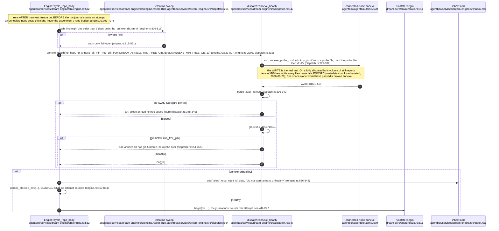
```mermaid
sequenceDiagram
    autonumber
    participant ENG as Engine::cycle_repo_body<br/>agentbox/services/dream-engine/src/engine.rs:532
    participant SWEEP as retention sweep<br/>agentbox/services/dream-engine/src/engine.rs:806-818, agentbox/services/dream-engine/src/dispatch.rs:64
    participant AH as dispatch::annexe_health<br/>agentbox/services/dream-engine/src/dispatch.rs:347
    participant HP as connected-node annexe<br/>agentbox/agentbox.toml:2570
    participant RS as runstate::begin<br/>dream-core/src/runstate.rs:511
    participant INBOX as inbox::add<br/>agentbox/services/dream-engine/src/inbox.rs:1

    Note over ENG: runs AFTER manifest::freeze but BEFORE the run journal counts an attempt,<br/>an unhealthy node costs the night, never the experiment's retry budget (engine.rs:793-797)
    ENG->>SWEEP: ssh, find night dirs older than 3 days under hp_annexe_dir, rm -rf (engine.rs:806-818)
    alt sweep fails
        SWEEP-->>ENG: warn only, fail-open (engine.rs:819-821)
    end
    ENG->>AH: annexe_health(hp_host, hp_annexe_dir, min_free_gib_from DREAM_ANNEXE_MIN_FREE_GIB, default ANNEXE_MIN_FREE_GIB 10) (engine.rs:823-827, engine.rs:2293, dispatch.rs:319)
    AH->>HP: ssh, annexe_probe_cmd: mkdir -p, printf ok to a probe file, rm -f the probe file,<br/>then df -Pk (dispatch.rs:327-332)
    Note over AH,HP: the WRITE is the real test. On a fully allocated btrfs volume df still reports<br/>tens of GiB free while every file create fails ENOSPC (metadata chunks exhausted,<br/>2026-09-26), free space alone would have passed a broken annexe
    HP-->>AH: AVAIL-KB=N line
    AH->>AH: parse_avail_kb(out) (dispatch.rs:336-340)
    alt no AVAIL-KB figure printed
        AH-->>ENG: Err, probe printed no free-space figure (dispatch.rs:348-349)
    else parsed
        AH->>AH: gib = kb / (1024*1024)
        alt gib below min_free_gib
            AH-->>ENG: Err, annexe dir has gib GiB free, below the floor (dispatch.rs:351-355)
        else healthy
            AH-->>ENG: Ok(gib)
        end
    end
    alt annexe unhealthy
        ENG->>INBOX: add("alert", repo, night_id, date, "did not start: annexe unhealthy") (engine.rs:836-848)
        ENG->>ENG: persist_blocked_env(...), BLOCKED-ENV, no attempt counted (engine.rs:850-864)
    else healthy
        ENG->>RS: begin(dir, ...), the journal now counts this attempt, see AB-23.7
    end
```

**Invariant:** the annexe probe writes and deletes a file before it trusts `df`'s free-space figure, so a metadata-exhausted btrfs volume that still reports free capacity is still caught (`../project/agentbox/services/dream-engine/src/dispatch.rs:327-332`).

## AB-23.19 ADR-2071 clause (c) — historical acceptance and retained tick

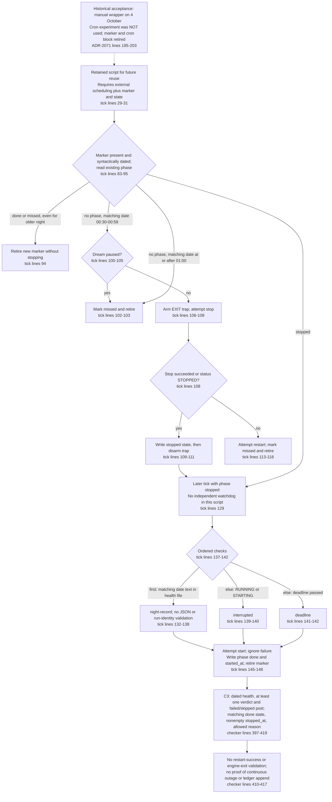
```mermaid
flowchart TB
    %% ADR-2071-journal-the-nightly-dream-cycle.md:195-203
    %% adr-2071-api-down-night.sh:29-31
    %% adr-2071-api-down-night.sh:83-95
    %% adr-2071-api-down-night.sh:94
    %% adr-2071-api-down-night.sh:100-105
    %% adr-2071-api-down-night.sh:102-103
    %% adr-2071-api-down-night.sh:106-108
    %% adr-2071-api-down-night.sh:108
    %% adr-2071-api-down-night.sh:109-111
    %% adr-2071-api-down-night.sh:113-118
    %% adr-2071-api-down-night.sh:129
    %% adr-2071-api-down-night.sh:137-142
    %% adr-2071-api-down-night.sh:132-138
    %% adr-2071-api-down-night.sh:139-140
    %% adr-2071-api-down-night.sh:141-142
    %% adr-2071-api-down-night.sh:145-148
    %% adr-2087-check.sh:397-419
    %% adr-2087-check.sh:410-417
    %% adr-2071-api-down-night.sh:121-124
    HIST["Historical acceptance: manual wrapper on 4 October<br/>Cron experiment was NOT used; marker and cron block retired<br/>ADR-2071 lines 195-203"]
    HIST -.-> TICK["Retained script for future reuse<br/>Requires external scheduling plus marker and state<br/>tick lines 29-31"]
    TICK --> PH{"Marker present and syntactically dated;<br/>read existing phase<br/>tick lines 83-95"}
    PH -->|"done or missed, even for older night"| RET["Retire new marker without stopping<br/>tick lines 94"]
    PH -->|"no phase, matching date 00:30-00:59"| PAUSE{"Dream paused?<br/>tick lines 100-105"}
    PAUSE -->|"yes"| MISS["Mark missed and retire<br/>tick lines 102-103"]
    PAUSE -->|"no"| TRY["Arm EXIT trap; attempt stop<br/>tick lines 106-108"]
    TRY --> OK{"Stop succeeded or status STOPPED?<br/>tick lines 108"}
    OK -->|"yes"| STOP["Write stopped state, then disarm trap<br/>tick lines 109-111"]
    OK -->|"no"| STOPFAIL["Attempt restart; mark missed and retire<br/>tick lines 113-118"]
    PH -->|"no phase, matching date at or after 01:00"| MISS
    STOP --> LATER["Later tick with phase stopped<br/>No independent watchdog in this script<br/>tick lines 129"]
    PH -->|"stopped"| LATER
    LATER --> WHY{"Ordered checks<br/>tick lines 137-142"}
    WHY -->|"first: matching date text in health file"| REC["night-record; no JSON or run-identity validation<br/>tick lines 132-138"]
    WHY -->|"else: RUNNING or STARTING"| INT["interrupted<br/>tick lines 139-140"]
    WHY -->|"else: deadline passed"| DEAD["deadline<br/>tick lines 141-142"]
    REC --> START["Attempt start; ignore failure<br/>Write phase done and started_at; retire marker<br/>tick lines 145-148"]
    INT --> START
    DEAD --> START
    START --> C3["C3: dated health, at least one verdict and failed/skipped post;<br/>matching done state, nonempty stopped_at, allowed reason<br/>checker lines 397-419"]
    C3 --> LIMIT["No restart-success or engine-exit validation;<br/>no proof of continuous outage or ledger append<br/>checker lines 410-417"]
```

**History.** ADR-2071 records a manual 4 October acceptance run, three newly dreamed repositories and one previously completed skip. This is historical evidence, not a fresh deployment check (`../project/agentbox/docs/adr/ADR-2071-journal-the-nightly-dream-cycle.md:195-203`).
**Current boundary.** The retained tick can consume a fresh marker using old done state, restart before the window from matching date text, mask an interruption and retire after a failed start. C3 trusts aggregate files rather than binding an outage to a specific completed run; see the [journal audit](../../estate-review/2026-11-01-dream-journal-and-api-down.md).
**Recovery limit.** The EXIT trap is removed after writing stopped state; later recovery depends on another tick and a successful supervisor start. It is not an unconditional guarantee that the API returns (`../project/agentbox/scripts/activation/adr-2071-api-down-night.sh:106-111`, `../project/agentbox/scripts/activation/adr-2071-api-down-night.sh:145-148`).

## AB-23.20 Signing keys — current loader and the unfinished port cutover

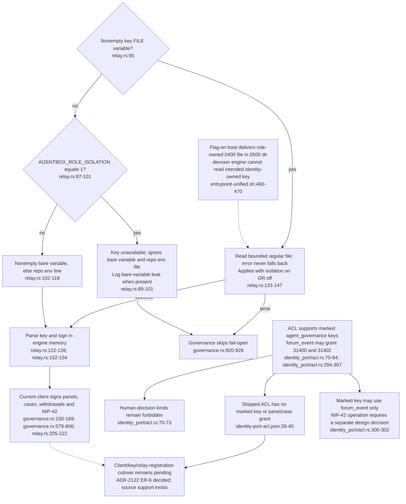
```mermaid
flowchart TB
    FILE{"Nonempty key FILE variable?<br/>relay.rs:95"}
    FILE -->|yes| READ["Read bounded regular file; error never falls back<br/>Applies with isolation on OR off<br/>relay.rs:133-147"]
    FILE -->|no| ISO{"AGENTBOX_ROLE_ISOLATION equals 1?<br/>relay.rs:87-101"}
    ISO -->|yes| ERR["Key unavailable; ignore bare variable and repo env file<br/>Log bare-variable leak when present<br/>relay.rs:89-101"]
    ISO -->|no| ENV["Nonempty bare variable, else repo env line<br/>relay.rs:102-118"]
    READ -->|success| KEY["Parse key and sign in engine memory<br/>relay.rs:122-126; relay.rs:152-154"]
    READ -->|error| SKIP
    ENV --> KEY
    ERR --> SKIP["Governance skips fail-open<br/>governance.rs:920-928"]
    BOOT["Flag-on boot delivers role-owned 0400 file in 0500 dir<br/>devuser engine cannot read intended identity-owned key<br/>entrypoint-unified.sh:460-470"] -.-> READ
    KEY --> SIGN["Current client signs panels, cases, withdrawals and NIP-42<br/>governance.rs:150-169; governance.rs:579-606; relay.rs:205-222"]
    PORT["ACL supports marked agent_governance keys<br/>forum_event may grant 31400 and 31402<br/>identity_port/acl.rs:75-84; identity_port/acl.rs:294-307"] --> HUMAN["Human-decision kinds remain forbidden<br/>identity_port/acl.rs:70-73"]
    PORT --> CONFIG["Shipped ACL has no marked key or panel/case grant<br/>identity-port-acl.json:28-40"]
    PORT --> AUTH["Marked key may use forum_event only<br/>NIP-42 operation requires a separate design decision<br/>identity_port/acl.rs:300-302"]
    CONFIG --> PENDING["Client/key/relay-registration cutover remains pending<br/>ADR-2122 ER-6 decided; source support exists"]
    SIGN -.-> PENDING
```

**Correction.** The former diagram said governance signing could never be granted. The loader already has the agent-key exception; its test also permits kind 5 in that grant (`../project/agentbox/services/nostr-pod-bridge/src/identity_port/acl.rs:423-430`). Human decision kinds remain forbidden. The shipped ACL and direct-key client still require cutover.
**Activation.** Flag-on behaviour depends on effective boot configuration, ownership and running identity. This pass reads those contracts but does not enable isolation, inspect keys or certify a running image. Key-file precedence alone does not imply the flag is on.
**Scope.** ADR-2122's ER-6 decision is assessed here, not its entire custody programme. Complete the signing, authentication and withdrawal design together, including old-key cases; see the [governance audit](../../estate-review/2026-11-01-dream-governance-and-delivery.md).

## AB-23.21 ADR-2143 — source supply is plumbing, not a decision

```mermaid
flowchart TB
    REPORT["Extract report requests and classify human actions<br/>engine.rs:1648<br/>wanted.rs:191"] --> STORE["Record pending keys or report a repeated inactive key<br/>wanted.rs:231"]
    STORE --> ALERT["Loop alert per record call<br/>engine.rs:1669"]
    STORE --> TAKE["Take active requests and increment each offer count<br/>wanted.rs:276"]
    TAKE --> SCAN["Append path-shaped scan entries<br/>engine.rs:1266"]
    SCAN --> CORE["Validate and select requested entries first<br/>source.rs:1091"]
    CORE --> RENDER["Clip then add markers and redact<br/>source.rs:850"]
    RENDER --> RECEIPT["Return receipt only if a file is marked inlined<br/>source.rs:1183"]
    RECEIPT --> SETTLE["Settle by path or directory prefix<br/>ranges are not compared<br/>wanted.rs:328"]
```

**What it shows.** Requests are offered before planner picks, with scan paths appended afterwards. Reservation counts candidate entries before validation, clipping markers can exceed the nominal byte allocation, and an empty line window can count as honoured. `take_for` counts invocations, not distinct night identifiers; `settle` treats any range from the same path as satisfying all its ranges (`../project/agentbox/services/dream-engine/src/wanted.rs:284`, `../project/agentbox/services/dream-engine/src/wanted.rs:328`). **Why it is this way.** ADR-2143 moves repetitive file requests out of the operator panel, but the [source-supply audit](../../estate-review/2026-11-01-dream-recovery-and-source-supply.md) finds that its completion markers do not prove the requested content was supplied. A requested directory is satisfied by any file under it. An all-refused read returns no source record (`../dream-engine/crates/dream-core/src/source.rs:1183`).

**Drift (question shape):** four fields are the prompt's desired format, not an enforced invariant. Parsing requires only Decision and If approved; unstructured questions pass through unchanged (`../project/agentbox/services/dream-engine/src/inbox.rs:278`, `../project/agentbox/services/dream-engine/src/inbox.rs:289`).

**Tension (expiry and evidence):** source receipt writes and settlement writes are best effort, and the shared request store has no transaction around read-modify-write (`../project/agentbox/services/dream-engine/src/engine.rs:1295`, `../project/agentbox/services/dream-engine/src/wanted.rs:91`). Current source does not establish three distinct nights, exact range delivery or one lifetime loop alert per request.

## AB-23.22 AB-23-S1-01 — the opt-in Jev triage before the candidate build

```mermaid
sequenceDiagram
    autonumber
    participant ENG as Engine, step 8b<br/>agentbox/services/dream-engine/src/engine.rs:1439
    participant JT as jev_triage::consider<br/>agentbox/services/dream-engine/src/jev_triage.rs:497
    participant S1 as System One endpoint, the proxy on 127.0.0.1:8094 or the vendor
    participant SCR as dream_core::screen<br/>dream-core/src/screen.rs:362
    participant REC as jev-triage.json in the night directory
    participant GATE as candidate build and the deterministic gate

    ENG->>ENG: only when the report claims ACCEPT (engine.rs:1439)
    ENG->>JT: Config::from_env, report, patch, evaluator names, declared disciplines (engine.rs:1440-1447)
    alt AGENTBOX_JEV_DREAM_TRIAGE not set, no endpoint, or a local-only refusal
        JT-->>ENG: false, nothing built and nothing sent (jev_triage.rs:147, jev_triage.rs:383)
    else enabled
        JT->>S1: one request, two typed questions: usefulness as a four-level Score, problem_supported as a Noul (jev_triage.rs:319, jev_triage.rs:383)<br/>to the keyless LAN local_backend only when AGENTBOX_JEV_DREAM_TRIAGE_LOCAL_ONLY is set (jev_triage.rs:151-158),<br/>else the proxy and its selected backend, refused only when local-only is set and the backend is not declared local (jev_triage.rs:165-167)
        S1-->>JT: signals, or a timeout of 15 seconds, a non-2xx or an unparsable body, each a fallback (jev_triage.rs:72, jev_triage.rs:346)
        JT->>SCR: a second call, the library screen of the hypothesis against declared_disciplines (jev_triage.rs:431, dream-core/src/screen.rs:91)
        JT->>REC: annotation only, authority none, written as jev-triage.json (jev_triage.rs:70, jev_triage.rs:497)
        alt AGENTBOX_JEV_DREAM_TRIAGE_DEFER_BELOW is set in 0 to 0.5 and problem_supported is below it
            JT-->>ENG: true, defer
            ENG->>GATE: the candidate build is skipped, the state stays NotAttempted and the gate vetoes the ACCEPT claim as unproven (engine.rs:1461-1465)
        else the default, no threshold
            JT-->>ENG: false
            ENG->>GATE: the build and the gate run exactly as before (engine.rs:1465)
        end
    end
    Note over GATE: INVARIANT: a high usefulness never means ACCEPT. The signals never reach the gate,<br/>the deferral is the only action and it is inert until a threshold is configured (jev_triage.rs:490)
```

**What it shows.** An optional annotation step between the model's report and the costly candidate build. **Why it is this way.** The candidate evaluation is the expensive part of a night, and a hypothesis that the evidence does not support is cheaper to hold back than to build; but the verdict is advice about where to spend measurement, never about the change, so the deterministic gate, the protected-path guard and the human merge gate decide everything that does run (`../project/agentbox/services/dream-engine/src/jev_triage.rs:1-30`). The screening mechanism itself lives in `dream-core` 0.4.0 (`../dream-engine/crates/dream-core/src/screen.rs:1-30`).

**Resolved (configured, not live):** the manifest sets `jev_triage = true` with `[system_one] enabled = true` (`../project/agentbox/agentbox.toml:2612`, `../project/agentbox/agentbox.toml:890`), and the projector now exports `AGENTBOX_JEV_DREAM_TRIAGE_LOCAL_ONLY=0` unless `dream_triage` is named in `[system_one].local_only`, which is empty (`../project/agentbox/services/agentbox-manifest/src/system_one.rs:535`, `../project/agentbox/services/agentbox-manifest/src/system_one.rs:564-577`, `../project/agentbox/agentbox.toml:895`), so triage takes the proxy and the selected `typesafe` backend, with the private LAN route still projected for the opt-in (`../project/agentbox/services/agentbox-manifest/src/system_one.rs:402`, `../project/agentbox/config/entrypoint-unified.sh:1259-1263`); the flake bakes `AGENTBOX_JEV_DREAM_TRIAGE=1` into the dream-engine program only when the System One proxy is on (`../project/agentbox/flake.nix:280-281`). All of this is configured, not live: it is rebuild-class and ADR-2155 records the consumer activation as `staged` (`../project/agentbox/docs/adr/ADR-2155-system-one-consumer-activation.md:7`), so no running night is annotated or deferred until an image carrying that manifest is activated.

**Debt:** the module re-implements the System One request body that `crates/system-one/system-one-client` speaks, because the service builds from `services/dream-engine` alone and the client is a workspace path dependency (`../project/agentbox/services/dream-engine/src/jev_triage.rs:44-48`).

## Audit qualification — 2026-10-29

1 November continuation: AB-23.7 and AB-23.21 were reassessed against matching current source and updated for recovery and source-supply limits. Later forge/seam and migration passes also reassessed AB-23.6 and AB-23.3. The controls pass reassessed AB-23.2, AB-23.10, AB-23.15 and AB-23.16. The receipt/depth pass reassessed AB-23.11 to AB-23.14. Ten other panels remain separately queued; rendering this topic does not close their semantic review.

This topic describes the extraction as source at the stamped revisions. ADR-2141 records `implementation_status: complete` and `activation_status: live`: the operator rebuilt and activated the registry-pinned image on 2026-10-16 and the supervised daemon was RUNNING with no degradation (`../project/agentbox/docs/adr/ADR-2141-extract-the-dream-engine-core-into-a-standalone-permissive-repo.md:47`). The later pins (0.2.0, 0.3.0, 0.4.0) are source in `Cargo.toml`; the record carries activation evidence for 0.2.0 only (`../project/agentbox/docs/adr/ADR-2143-source-supply-is-plumbing-and-decisions-are-plain-english.md:35`).

**Resolved:** the earlier follow-on that `ontomark/dream.config.json` (`"adrConvention": "ADR-OM-NNN"`) would not load under the stricter `dream-gate` validation is closed: the legacy free-form template is accepted and rendered with its prefix from `dream-gate` 0.1.1 (`../project/agentbox/docs/adr/ADR-2141-extract-the-dream-engine-core-into-a-standalone-permissive-repo.md:35`).

**Tension (activation records):** ADR-2141 says the image running the adapter was rebuilt and activated (`../project/agentbox/docs/adr/ADR-2141-extract-the-dream-engine-core-into-a-standalone-permissive-repo.md:8`), while ADR-2081 still records `activation_status: staged` for the annexe-depth and receipt corrections that the same engine source carries (`../project/agentbox/docs/adr/ADR-2081-annexe-depth-law-and-honest-evaluator-receipts.md:7`); its review_trigger names the first nightly run on the rebuilt image as the receipt that moves it to live (`../project/agentbox/docs/adr/ADR-2081-annexe-depth-law-and-honest-evaluator-receipts.md:13`); AB-23.11 to AB-23.14 describe source behaviour and claim no live receipt.

## AB-23.23 Journal delivery — local counters and remote evidence

```mermaid
flowchart TB
    SESSION["Night ID plus whole seconds, normalised and truncated to 160<br/>Not unique across all attempts or names<br/>journal.rs:300-315"] --> CALL["called: post tool.called, then increment open_calls<br/>journal.rs:165-187"]
    CALL --> EFFECT["Caller performs effect independently of delivery success<br/>Phase 1 is fail-open, not an approval gate<br/>journal.rs:11-17"]
    EFFECT --> DONE["completed: decrement open_calls BEFORE posting<br/>causation present only if called returned an event ID<br/>journal.rs:199-215"]
    CALL --> HTTP
    DONE --> HTTP
    HTTP{"Client enabled and fewer than 3 consecutive failures?<br/>journal.rs:236-244"}
    HTTP -->|"no client"| OFF["No delivery counters; open_calls still changes<br/>journal.rs:236"]
    HTTP -->|"breaker open"| SKIP["skipped++; no recovery probe this session<br/>journal.rs:237-243"]
    HTTP -->|"yes"| POST["POST /v1/exec/record<br/>same API journal singleton<br/>exec-record.js:59-62"]
    POST --> KEY["Caller key becomes deterministic event ID<br/>Duplicate ID returns prior envelope, without payload comparison<br/>exec-record.js:52-54; execution-journal.js:144-151"]
    KEY --> APPEND["Assign seq, await dispatch, then update in-memory state<br/>Concurrent appends can share seq; restart needs hydration<br/>execution-journal.js:152-185"]
    APPEND --> ACK{"HTTP success and string event_id?<br/>journal.rs:257-270"}
    ACK -->|"yes, including duplicate or empty ID"| REC["recorded++; reset failure streak<br/>journal.rs:267-270"]
    ACK -->|"no"| FAIL["failed++; increment streak; no retry or local outbox<br/>journal.rs:272-276"]
    DONE --> STATS["unpaired = current open_calls, not remote pair reconciliation<br/>journal.rs:224-229"]
    STATS --> HEALTH["Normal path records repo stats, then night-level stats<br/>Early returns and crashes have narrower coverage<br/>engine.rs:352-361; engine.rs:448-449; records.rs:382-399"]
```

**Evidence.** Loopback probes reproduce unmatched remote records with unpaired=0; route probes reproduce changed-payload deduplication, restart sequence reuse and concurrent duplicate sequence numbers while the on-disk hash chain verifies. These are separate integrity properties, detailed in the [journal audit](../../estate-review/2026-11-01-dream-journal-and-api-down.md).
**Coverage.** Several inbox writes have no tool pair, including shared-remote warnings, annexe-health failure and damaged-run alerts; inbox::add does not journal internally (`../project/agentbox/services/dream-engine/src/engine.rs:244`, `../project/agentbox/services/dream-engine/src/engine.rs:838`, `../project/agentbox/services/dream-engine/src/engine.rs:2061`, `../project/agentbox/services/dream-engine/src/inbox.rs:174-215`).
**Skip semantics.** The repo wrapper posts turn.started before calling the body and turn.completed afterwards, including locked or already-finished returns. No tool effect is required for those lifecycle events (`../project/agentbox/services/dream-engine/src/engine.rs:508-529`).

## AB-23.24 Digest — evidence limits and encryption configuration

```mermaid
flowchart TB
    DISK["Read health, configured ledgers and open-item count<br/>digest.rs:386-399"] --> DATE{"Matching health date?<br/>digest.rs:186"}
    DATE -->|no| ABSENT["Text says nothing was tested<br/>Missing evidence does not establish that conclusion<br/>digest.rs:187-191"]
    DATE -->|yes| ANY{"Any scheduled outcomes?<br/>digest.rs:193-217"}
    ANY -->|no| ZERO["No-eligible text and available standby reasons<br/>digest.rs:193-215"]
    ZERO --> LOCAL
    ANY -->|yes| WORDS["Compose from outcome labels and last ledger row<br/>ACCEPT says confirmed; REJECT says disproved<br/>digest.rs:242-275"]
    WORDS --> LOCAL["Append local open count as panel backlog<br/>digest.rs:220-227"]
    ABSENT --> LOCAL
    LOCAL --> ZONE["Resolve section and zone metadata; select encryption plan<br/>digest.rs:417-426"]
    ZONE --> PLAIN["Malformed or absent zones become empty;<br/>unknown section can select first configured zone<br/>zone_crypto.rs:86-105"]
    ZONE --> SECRET["Known encrypted zone with gate on: latest held epoch or refuse<br/>zone_crypto.rs:109-115; zone_crypto.rs:221-233"]
    PLAIN --> FALL["No encrypted match means plaintext plan<br/>zone_crypto.rs:222-224"]
    SECRET -->|"no held key"| STOP["Withhold digest<br/>digest.rs:427-428"]
    SECRET -->|"held key"| POST["Sign and publish; retry once after missing read-back<br/>digest.rs:454-480"]
    FALL --> POST
    POST --> VERIFY["Read-back match checks ID only<br/>Relay query does not verify signature or filter membership<br/>digest.rs:468-477; relay.rs:317-323"]
```

**Presentation.** A missing health file, REJECT label or unpublished inbox count is insufficient for the digest's stronger claims. Standby repositories disappear from the ordinary outcomes branch. Case context separately hard-codes the default ledger path, despite configurable ledgerPath (`../project/agentbox/services/dream-engine/src/governance.rs:274-278`).
**Privacy.** The no-key refusal applies only after zone policy identifies an encrypted zone. Malformed metadata produces plaintext selection even with the gate on; the probe does not publish plaintext or claim the live relay would admit it. No current zone-key epoch is fetched, so latest means latest locally held.
**Evidence.** The [governance audit](../../estate-review/2026-11-01-dream-governance-and-delivery.md) records isolated probes and the source boundary. Neither a publish ACK nor an ID-only read-back establishes delivery to the operator or a verified current deployment.
