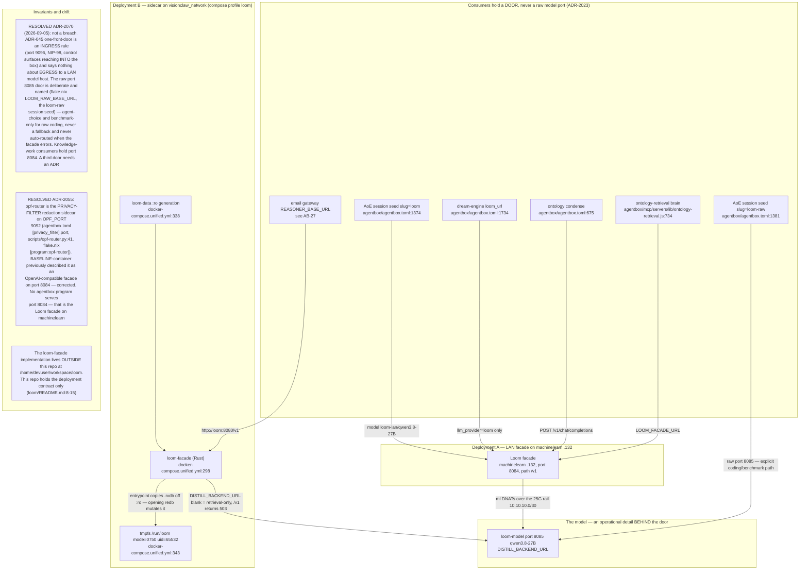
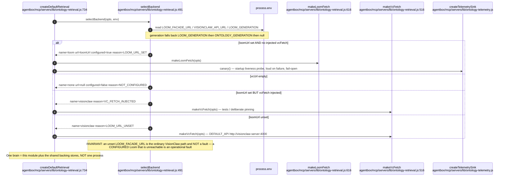
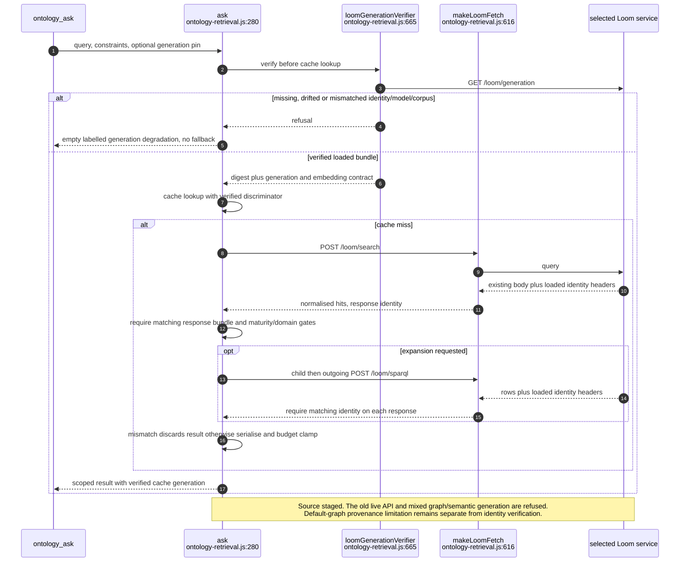
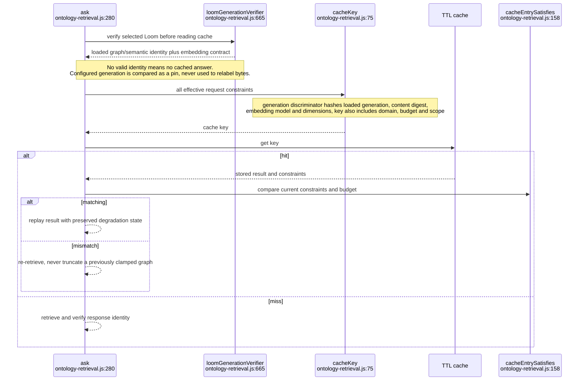
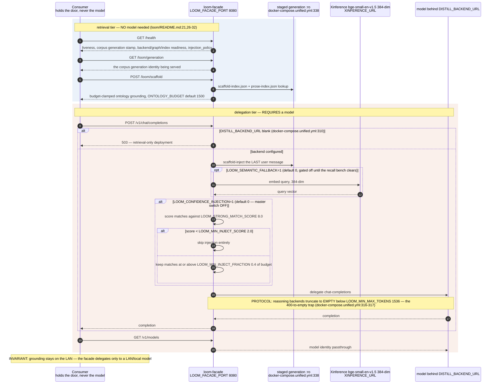
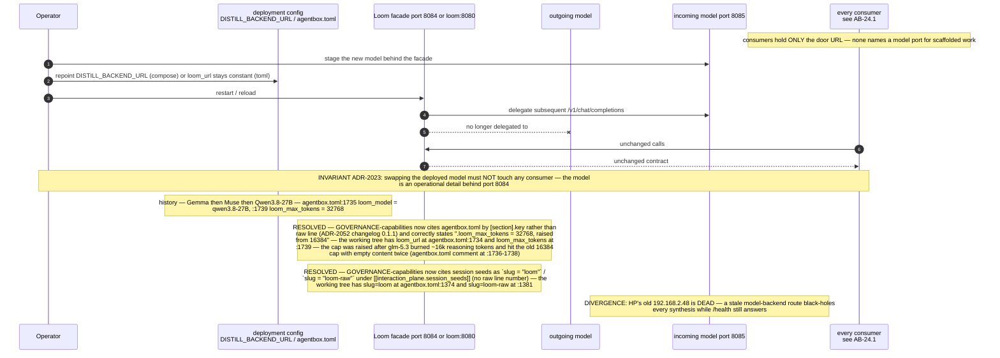
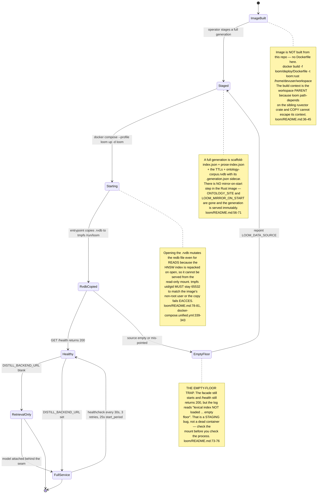
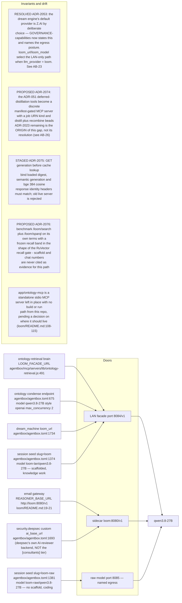

## AB-24.1 Two deployments of one facade contract — topology

## AB-24.2 selectBackend — which store answers, and why

## AB-24.3 Loom-backed retrieval — /loom/search seed then /loom/sparql expand

## AB-24.4 Cache key completeness and cache-hit constraint revalidation

## AB-24.5 Backend, stage and outcome vocabularies

## AB-24.6 POST /v1/chat/completions — scaffold injection then delegate

## AB-24.7 Model swap — zero consumer change

## AB-24.8 Deployment B bring-up and the staging traps

## AB-24.9 Consumer register — which door each one holds

## Audit qualification — 2026-09-07

The execution pass implements consumer verification in `ontology-retrieval.js::loomGenerationVerifier`: GET generation before every cache lookup, compare the configured pin and loaded digest/model/corpus, and validate identity headers on search/SPARQL responses. The local Loom route implementation preserves response bodies and adds those headers. This source is staged: the live façade was probed and still reports lexical generation 2026-08-22 versus semantic 2026-08-17, without loaded identity/embedding fields. A coordinated bundle/server rollout is required before activating the stricter client. See [execution evidence](../../estate-review/closeout/2026-09-07-execution-agentbox.md). The graph loader still uses the shared default graph, so ADR-2073 remains open. Generation reporting is not an automatic corpus reload.
