## AB-24.1 Two deployments of one facade contract — topology

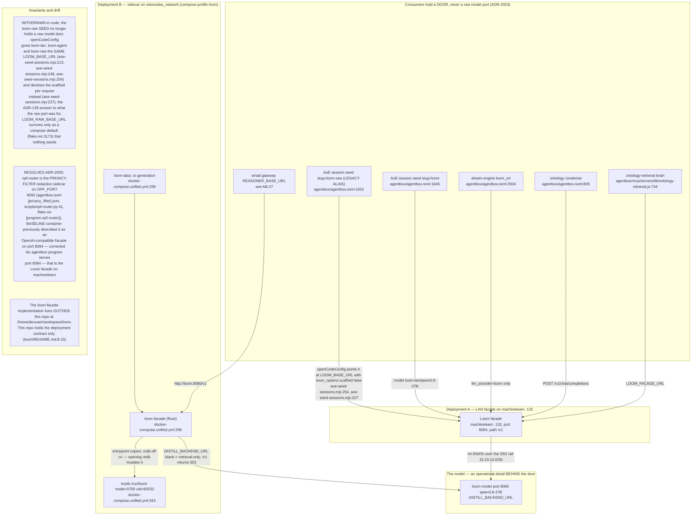

## AB-24.2 selectBackend — which store answers, and why

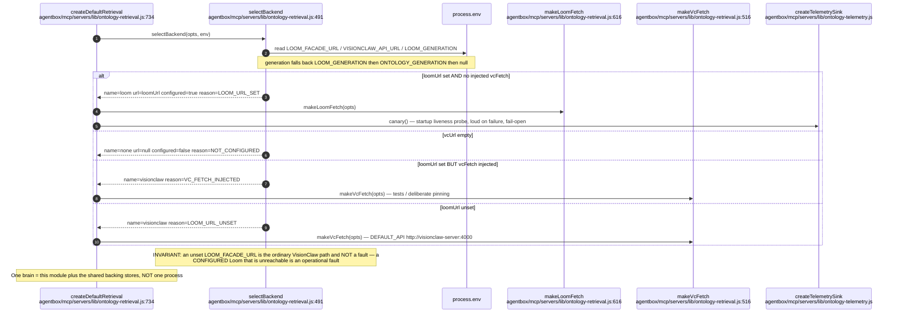

## AB-24.3 Loom-backed retrieval — /loom/search seed then /loom/sparql expand

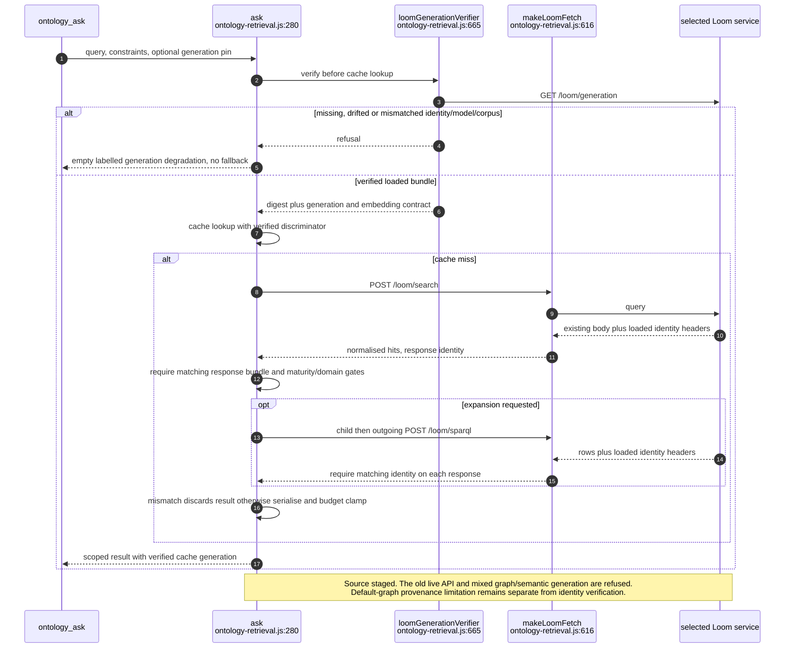

## AB-24.4 Cache key completeness and cache-hit constraint revalidation

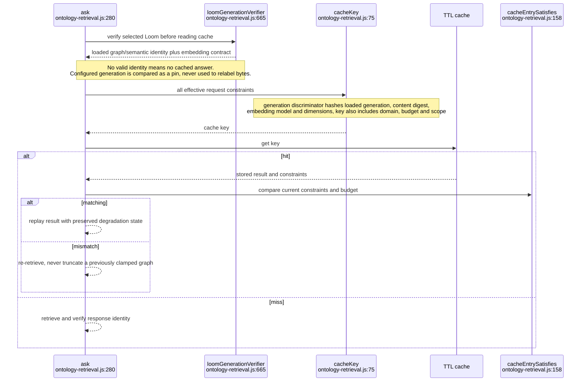

## AB-24.5 Backend, stage and outcome vocabularies

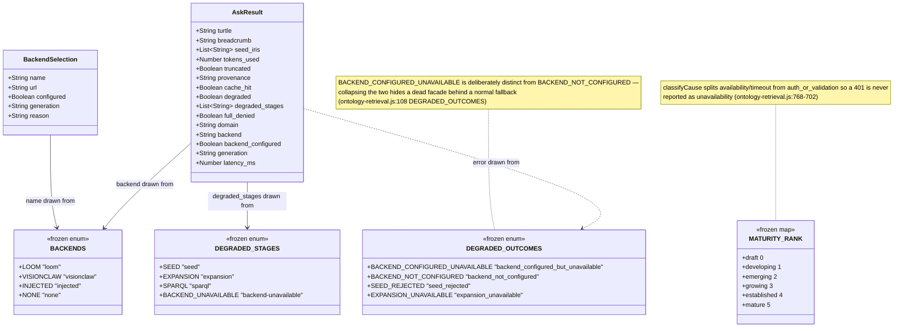

## AB-24.6 POST /v1/chat/completions — scaffold injection then delegate

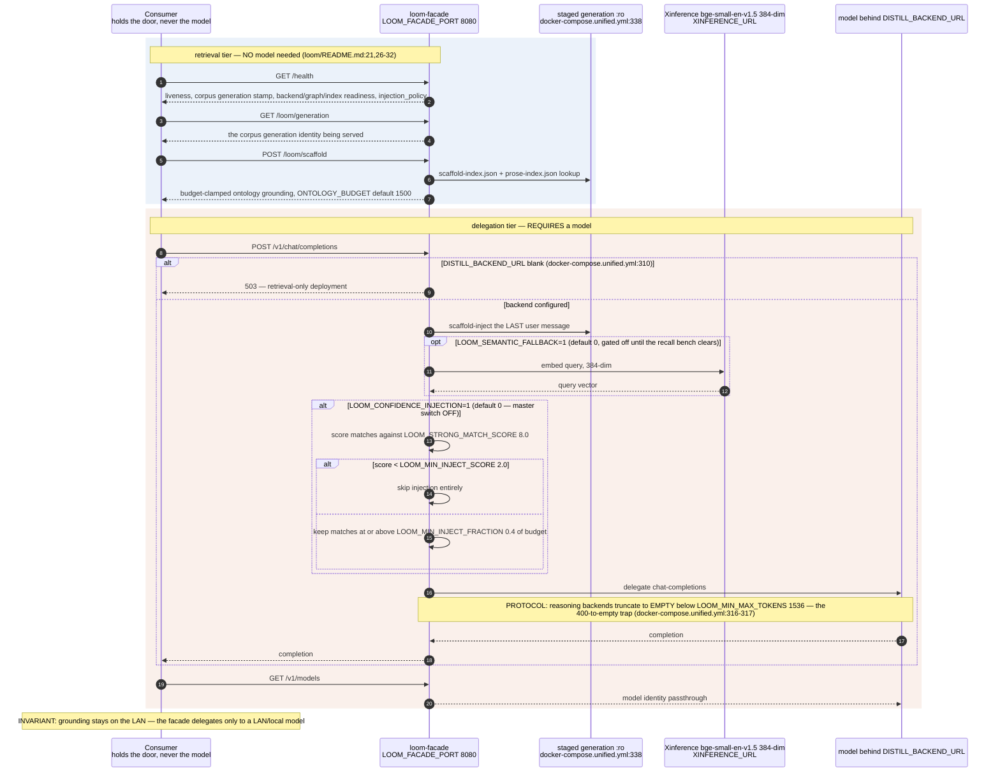

## AB-24.7 Model swap — zero consumer change

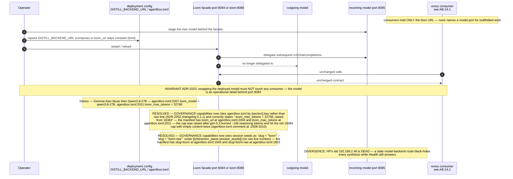

## AB-24.8 Deployment B bring-up and the staging traps

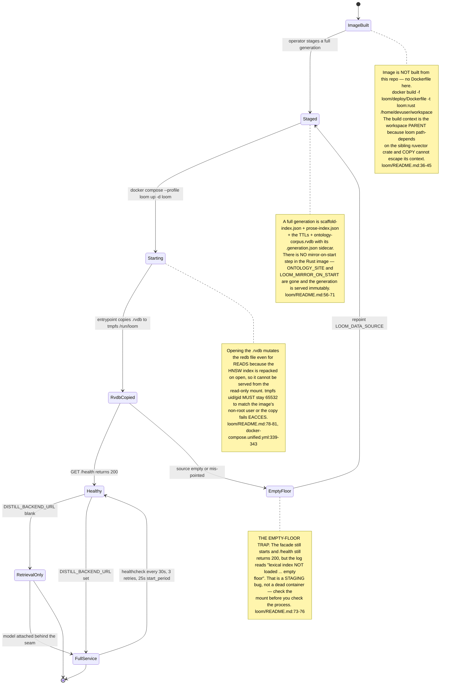

## AB-24.9 Consumer register — which door each one holds

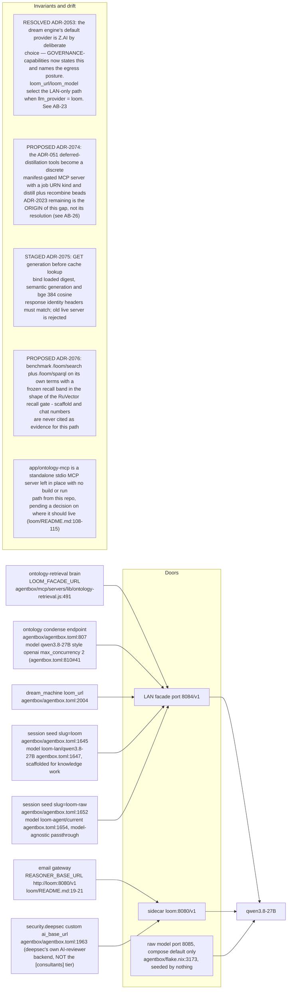

## AB-24.10 ADR-2084 - five callers, one published client

```mermaid
flowchart TB
    subgraph before["Before: five hand-rolled chat-completions clients"]
        B1["each knew a DIFFERENT subset of the same three traps<br/>ADR-2084-one-published-loom-client-for-every-facade-caller.md:21-28"]
        B2["only dream-engine knew a facade can answer 200 with ontology prose<br/>and never call the model"]
        B3["only loom-draft knew about truncation retries and the ADR-139 assertion"]
        B4["only agentbox-mcp floored max_tokens, so the others could ask a<br/>reasoning model for 400 and read empty content as success"]
        B1 --> B2 --> B3 --> B4
    end
    subgraph after["After: the loom-client crate, published from the loom repository"]
        C1["dream-engine call_loom<br/>agentbox/services/dream-engine/src/llm.rs:196"]
        C2["podcast-ingest extraction<br/>agentbox/services/podcast-ingest/src/ingest/loom.rs:34"]
        C3["podcast-ingest promotion<br/>agentbox/services/podcast-ingest/src/promote/loom.rs:69"]
        C4["explainer-loom-draft<br/>agentbox/services/explainer-tools/src/bin/loom_draft.rs:22"]
        C5["web-summary MCP server<br/>agentbox/services/agentbox-mcp/src/web_summary/llm.rs:65"]
    end
    B4 --> C1
    C1 --> C2 --> C3 --> C4 --> C5
    subgraph knows["What the one place now knows"]
        direction TB
        K1["INVARIANT ADR-2084: hand-rolled chat-completions construction against a<br/>facade is PROHIBITED - a sixth caller takes the crate<br/>ADR-2084-one-published-loom-client-for-every-facade-caller.md:37"]
        K2["verbatim and scaffold are INDEPENDENT switches. Three callers sent only<br/>the first and agentbox-mcp sent neither, so a page summary could be<br/>answered from the ontology without the page being read<br/>ADR-2084-one-published-loom-client-for-every-facade-caller.md:30-33"]
        K3["a reasoning model truncated below 1536 tokens returns EMPTY content,<br/>not a short answer - web_summary/llm.rs:20 floors every ask and<br/>web_summary/llm.rs:63 clamps the caller's number up to it"]
        K1 ~~~ K2 ~~~ K3
    end
    C5 -.-> knows
```

**Invariant:** the web-summary path clamps every request to at least 1536 tokens and is pinned by `max_tokens_is_always_clamped_to_at_least_1536` (`../project/agentbox/services/agentbox-mcp/src/web_summary/llm.rs:151`); a scaffold-only serve is reported as a failure, not an answer (`../project/agentbox/services/agentbox-mcp/src/web_summary/llm.rs:198`).

## AB-24.11 ADR-139 - the per-request scaffold opt-out

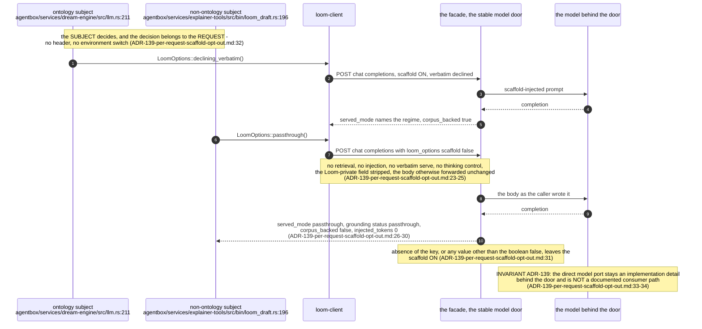

**Debt:** grounding applied to a subject the ontology does not cover is a WRONG answer, not a weak one: on 2026-09-09 a packet about a test script scored the blockchain class Node at 42 and was served from the corpus in 40 ms with zero completion tokens (`../loom/docs/design/ADR-139-per-request-scaffold-opt-out.md:13-16`), which is why `../project/agentbox/services/explainer-tools/src/draft.rs:4` declines the scaffold on every request.

## Audit qualification - 2026-09-07

The execution pass implements consumer verification in `ontology-retrieval.js::loomGenerationVerifier`: GET generation before every cache lookup, compare the configured pin and loaded digest/model/corpus, and validate identity headers on search/SPARQL responses. The local Loom route implementation preserves response bodies and adds those headers. This source is staged: the live façade was probed and still reports lexical generation 2026-08-22 versus semantic 2026-08-17, without loaded identity/embedding fields. A coordinated bundle/server rollout is required before activating the stricter client. See [execution evidence](../../estate-review/closeout/2026-09-07-execution-agentbox.md). The graph loader still uses the shared default graph, so ADR-2073 remains open. Generation reporting is not an automatic corpus reload.
