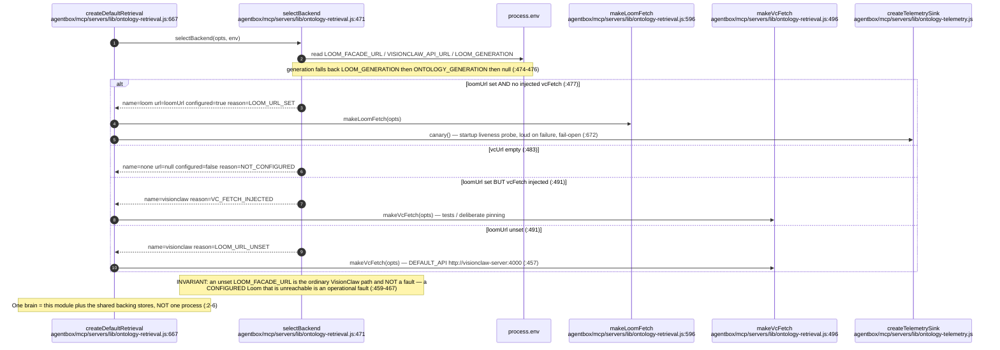
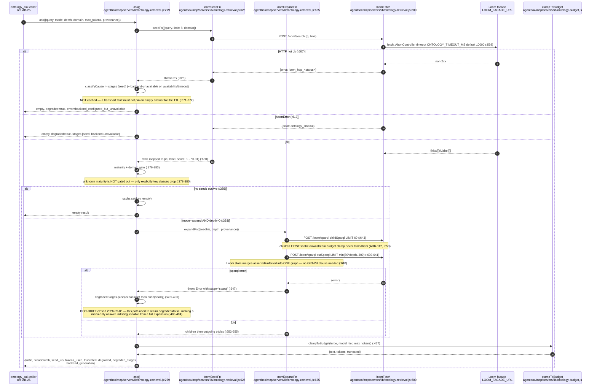
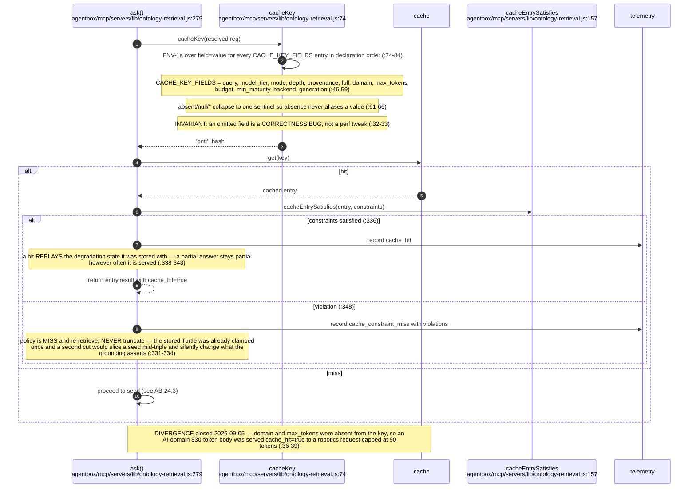
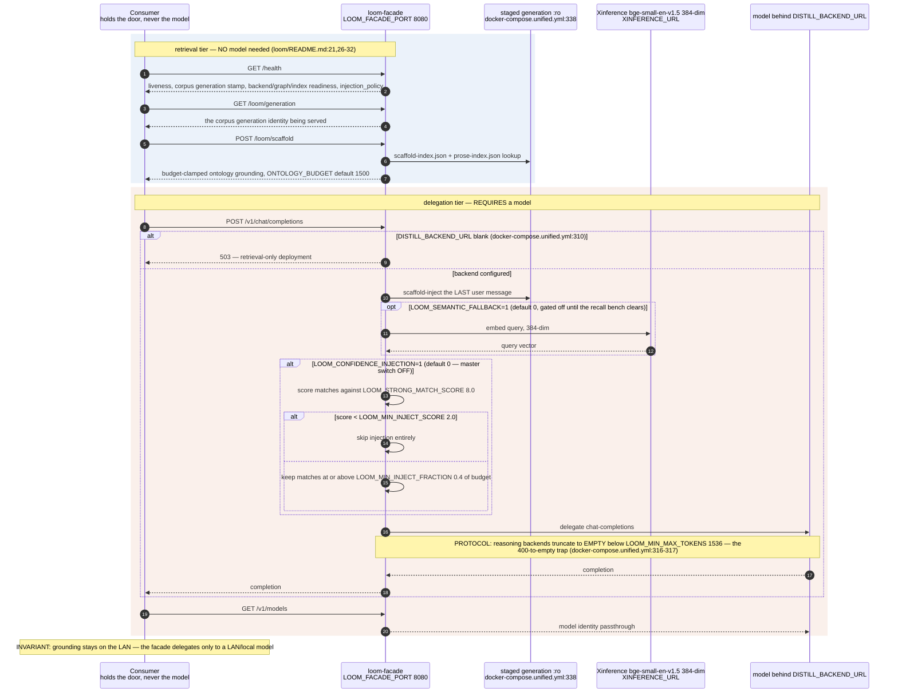
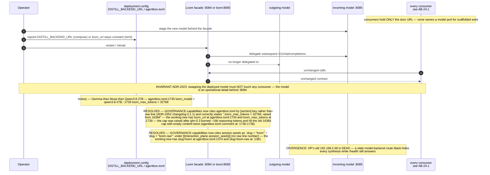
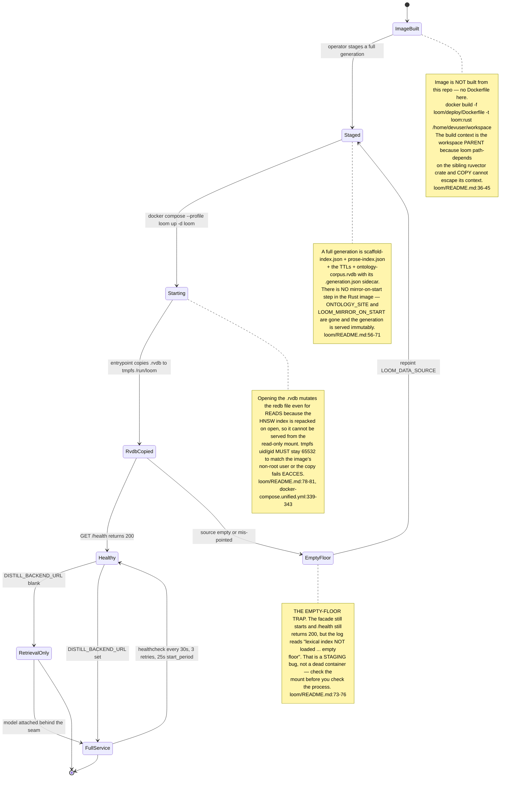
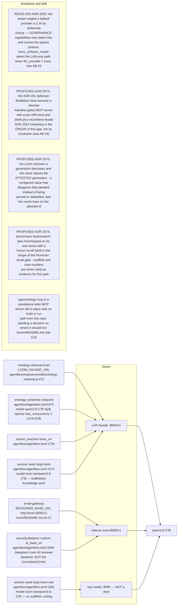

## AB-24.1 Two deployments of one facade contract — topology

## AB-24.2 selectBackend — which store answers, and why

## AB-24.3 Loom-backed retrieval — /loom/search seed then /loom/sparql expand

## AB-24.4 Cache key completeness and cache-hit constraint revalidation

## AB-24.5 Backend, stage and outcome vocabularies

## AB-24.6 POST /v1/chat/completions — scaffold injection then delegate

## AB-24.7 Model swap — zero consumer change

## AB-24.8 Deployment B bring-up and the staging traps

## AB-24.9 Consumer register — which door each one holds

## Audit qualification — 2026-09-07

The local Rust Loom already exposes `GET /loom/generation` in `crates/loom-facade/src/routes/mod.rs`, backed by generation verification in `bundle.rs`. Agentbox `ontology-retrieval.js::selectBackend` still obtains its generation from options/environment and its Loom transport calls only search/SPARQL. ADR-2075 therefore needs **client consumption and mismatch enforcement**, not an assertion that every Loom implementation lacks an identity endpoint. Deployment identity was not probed. The Loom graph loader still loads Turtle into the shared default graph; the helper omits provenance graph clauses, so ADR-2073 remains open.
