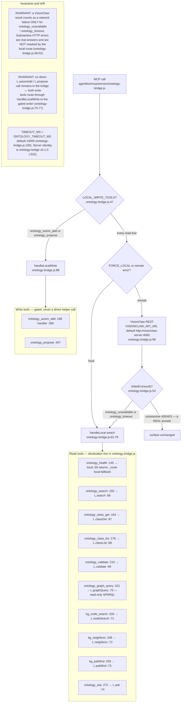
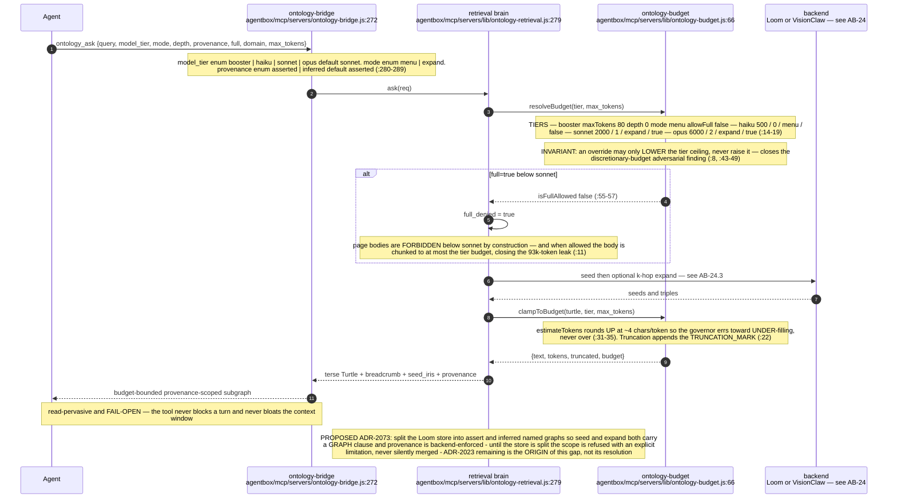
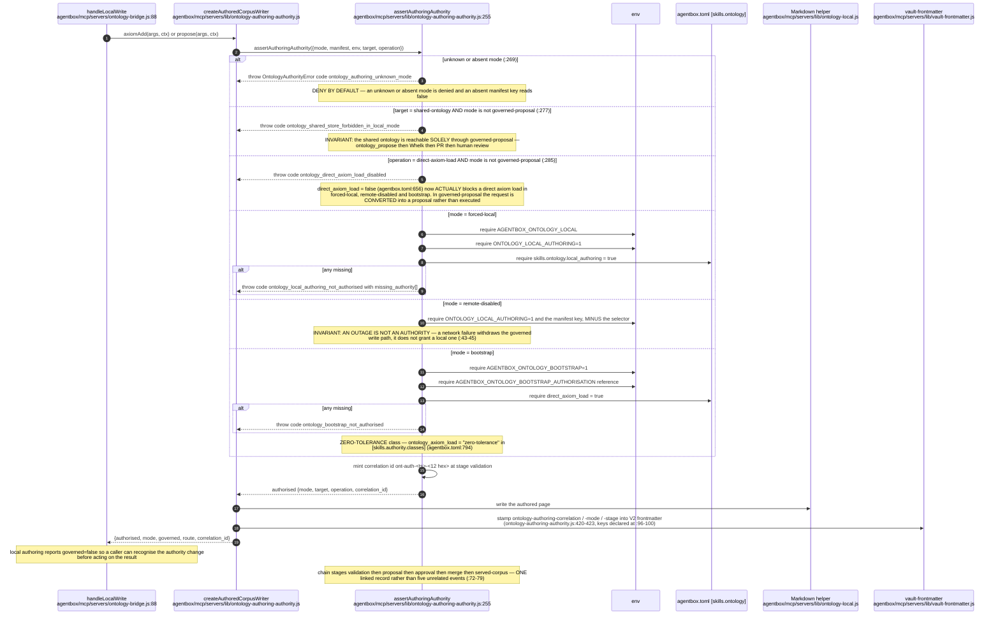
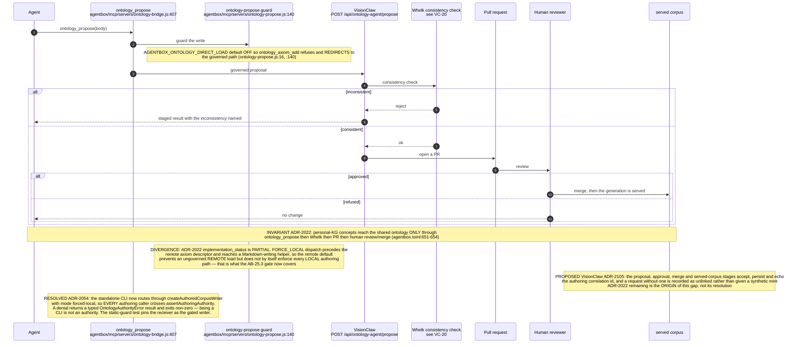
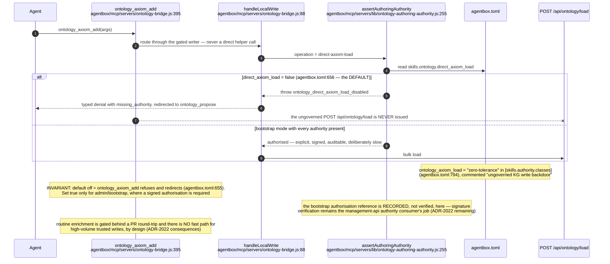
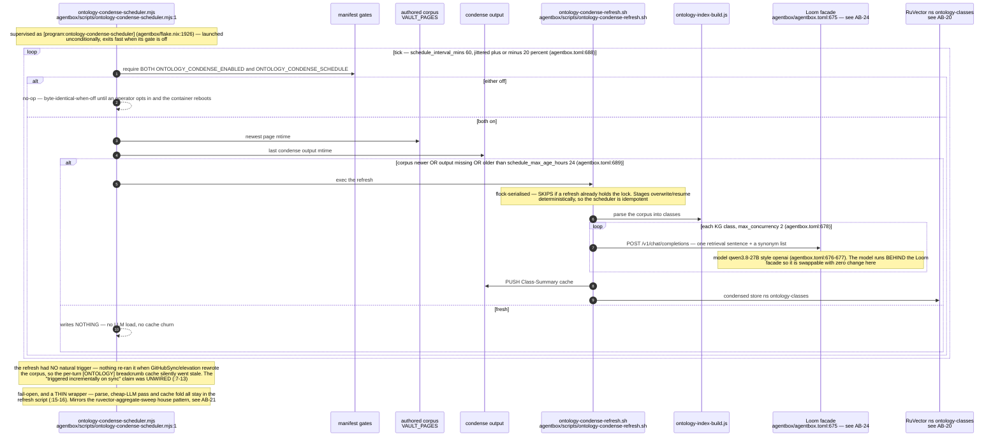
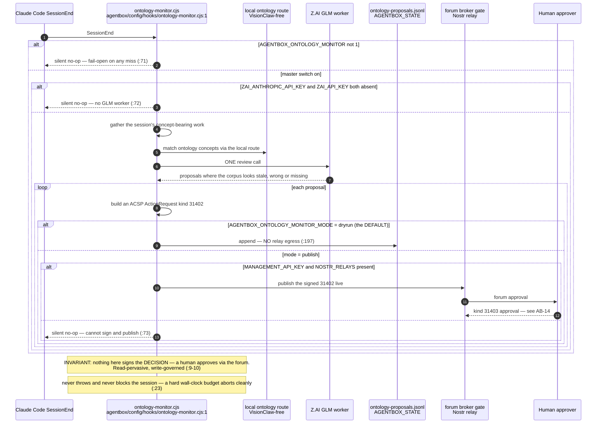
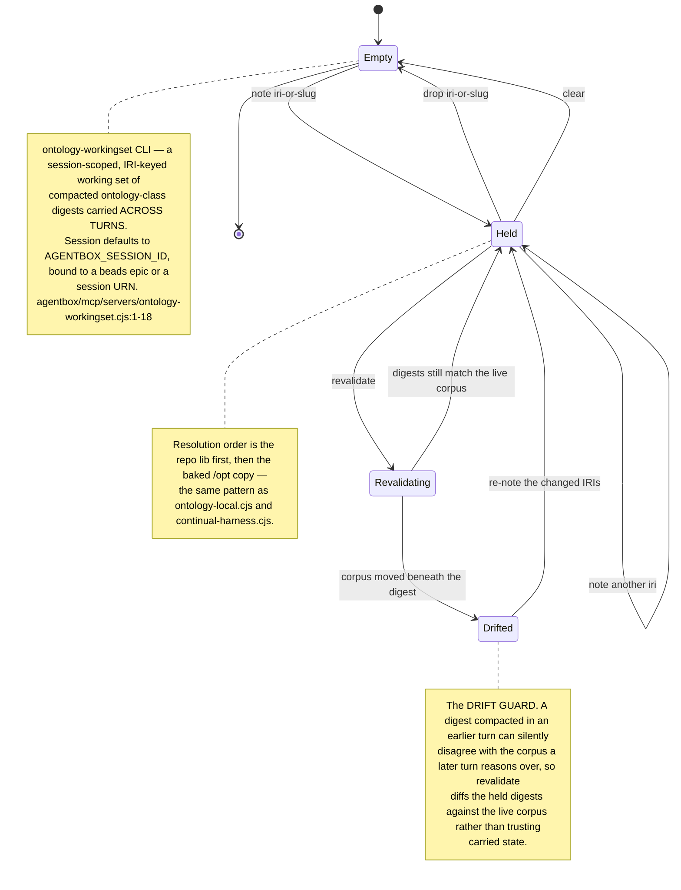
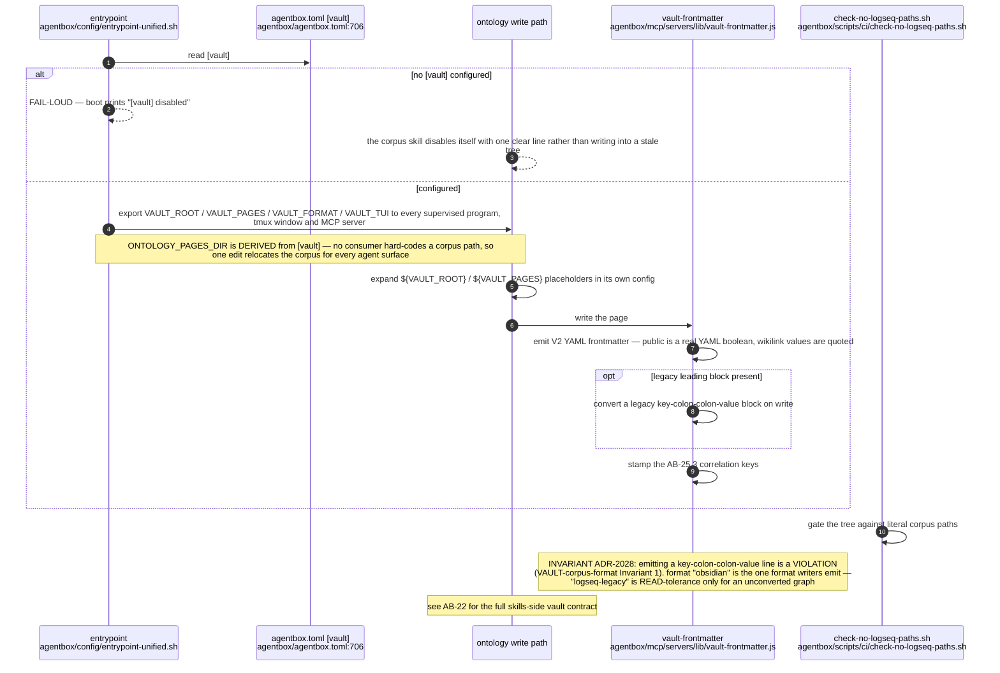

## AB-25.1 ontology-bridge tool surface and dispatch

## AB-25.2 ontology_ask — budget-bounded provenance-scoped subgraph

## AB-25.3 The authoring-authority gate — four modes, deny by default

## AB-25.4 Authority vocabularies

```mermaid
classDiagram
    class AUTHORING_MODES {
        <<frozen enum>>
        +FORCED_LOCAL "forced-local"
        +REMOTE_DISABLED "remote-disabled"
        +BOOTSTRAP "bootstrap"
        +GOVERNED_PROPOSAL "governed-proposal"
    }
    class AUTHORING_TARGETS {
        <<frozen enum>>
        +LOCAL_AUTHORED_CORPUS "local-authored-corpus"
        +SHARED_ONTOLOGY "shared-ontology"
    }
    class AUTHORING_OPERATIONS {
        <<frozen enum>>
        +LOCAL_AUTHORING_WRITE "local-authoring-write"
        +DIRECT_AXIOM_LOAD "direct-axiom-load"
        +PROPOSAL "proposal"
    }
    class DENIAL_CODES {
        <<frozen enum>>
        +UNKNOWN_MODE "ontology_authoring_unknown_mode"
        +LOCAL_AUTHORING_NOT_AUTHORISED "ontology_local_authoring_not_authorised"
        +SHARED_STORE_FORBIDDEN "ontology_shared_store_forbidden_in_local_mode"
        +DIRECT_AXIOM_LOAD_DISABLED "ontology_direct_axiom_load_disabled"
        +BOOTSTRAP_NOT_AUTHORISED "ontology_bootstrap_not_authorised"
        +GOVERNED_ROUTE_REQUIRED "ontology_governed_route_required"
    }
    class ENV_KEYS {
        <<frozen map>>
        +FORCE_LOCAL "AGENTBOX_ONTOLOGY_LOCAL"
        +LOCAL_AUTHORING "ONTOLOGY_LOCAL_AUTHORING"
        +BOOTSTRAP "AGENTBOX_ONTOLOGY_BOOTSTRAP"
        +BOOTSTRAP_AUTHORISATION "AGENTBOX_ONTOLOGY_BOOTSTRAP_AUTHORISATION"
    }
    class MANIFEST_KEYS {
        <<frozen map>>
        +LOCAL_AUTHORING "skills.ontology.local_authoring"
        +DIRECT_AXIOM_LOAD "skills.ontology.direct_axiom_load"
    }
    class CORRELATION_FRONTMATTER_KEYS {
        <<frozen map>>
        +ID "ontology-authoring-correlation"
        +MODE "ontology-authoring-mode"
        +STAGE "ontology-authoring-stage"
    }
    class OntologyAuthorityError {
        +String code
        +String message
        +String mode
        +String target
        +String operation
        +List~String~ missing_authority
        +toResult()
    }
    class AUTHORING_CHAIN_STAGES {
        <<frozen list>>
        validation
        proposal
        approval
        merge
        served-corpus
    }
    OntologyAuthorityError --> DENIAL_CODES
    OntologyAuthorityError --> AUTHORING_MODES
    OntologyAuthorityError --> AUTHORING_TARGETS
    note for OntologyAuthorityError "A denial is an ERROR, not a return value — a caller that forgets to check cannot<br/>silently proceed. missing_authority names the EXACT authorities that were absent: never<br/>a silent no-op and never a silent write (ontology-authoring-authority.js:106-131)"
    note for MANIFEST_KEYS "RESOLVED ADR-2054 follow-on: skills.ontology.local_authoring is now DECLARED explicitly<br/>as false in agentbox.toml (was undeclared-by-absence when ADR-2054 landed) — the deny is<br/>reviewable in a diff rather than implicit in an omission (agentbox.toml:663)"
```

## AB-25.5 The governed promotion route

## AB-25.6 ontology_axiom_add — the disabled backdoor

## AB-25.7 Condensation index — the staleness scheduler

## AB-25.8 ontology-monitor — SessionEnd governed elevation

## AB-25.9 Session working set and the drift guard

## AB-25.10 Vault path authority for ontology writes

