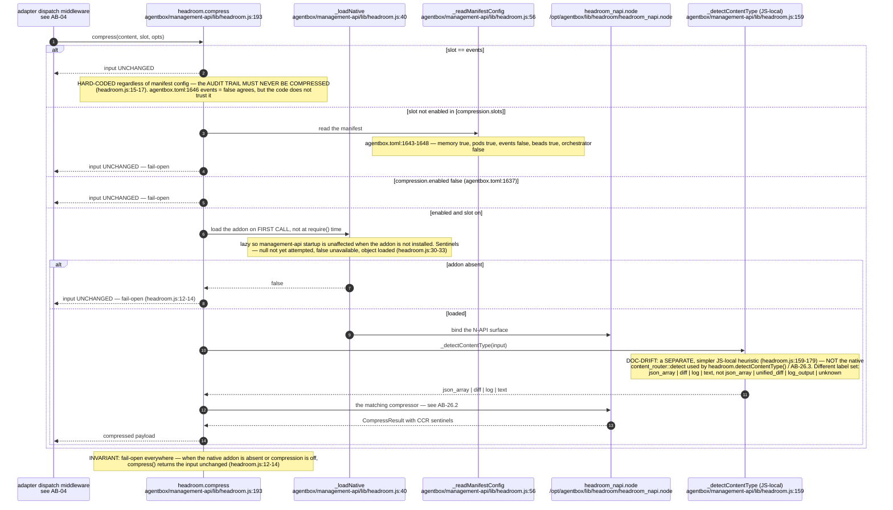
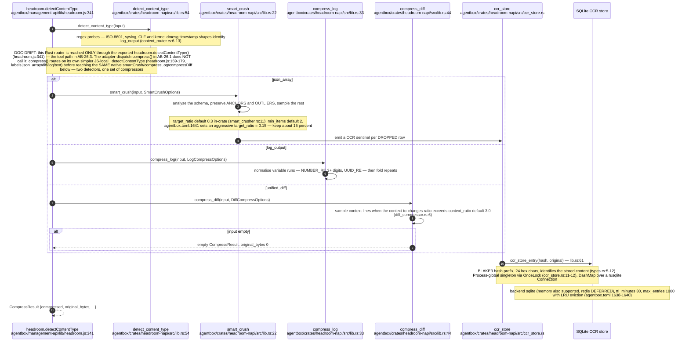
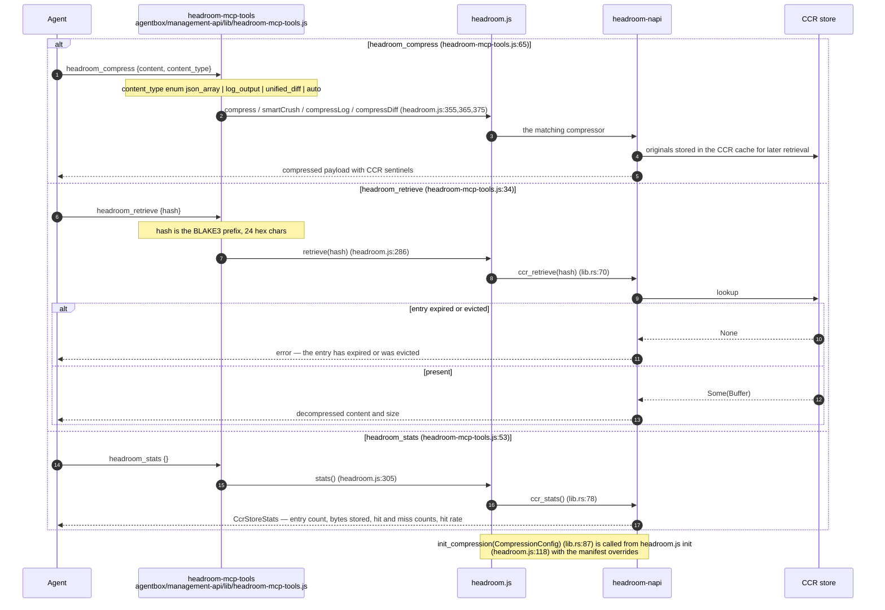
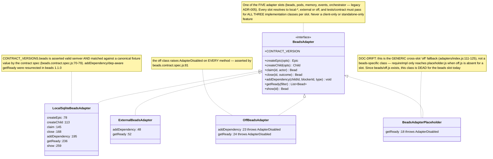
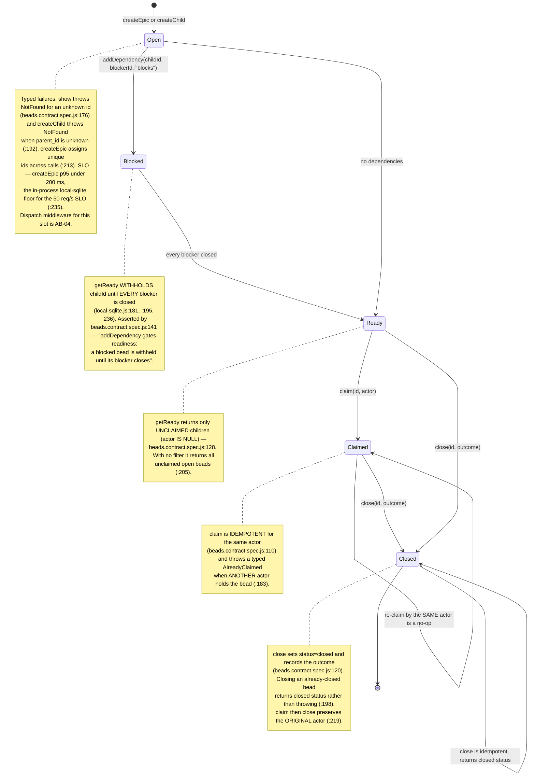
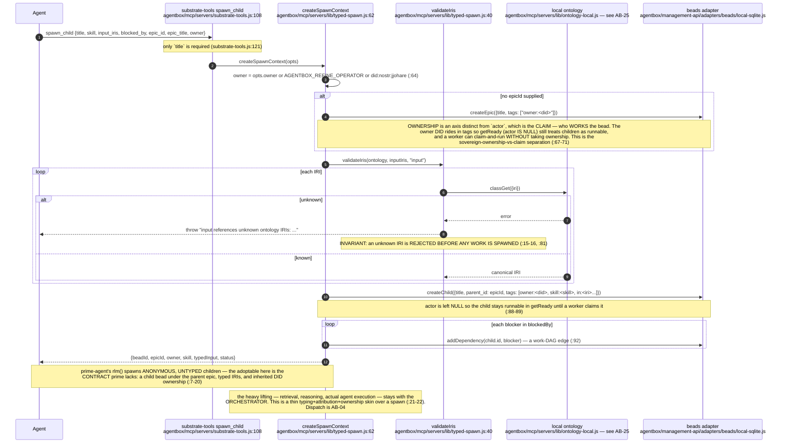
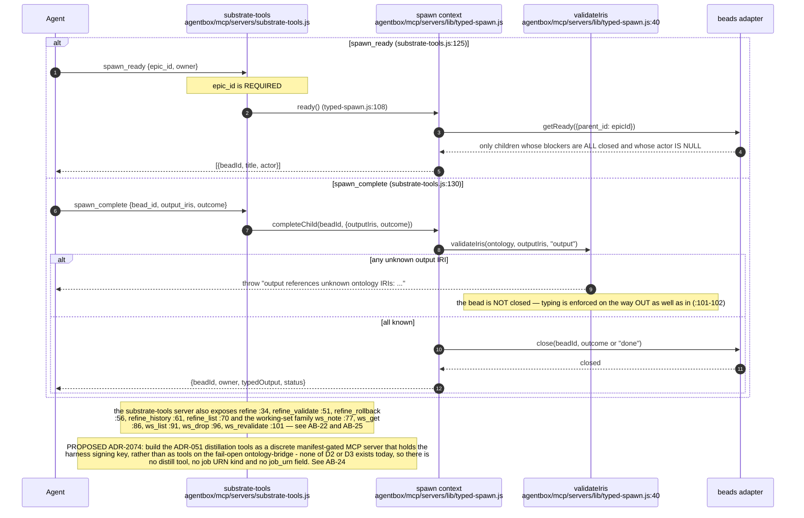
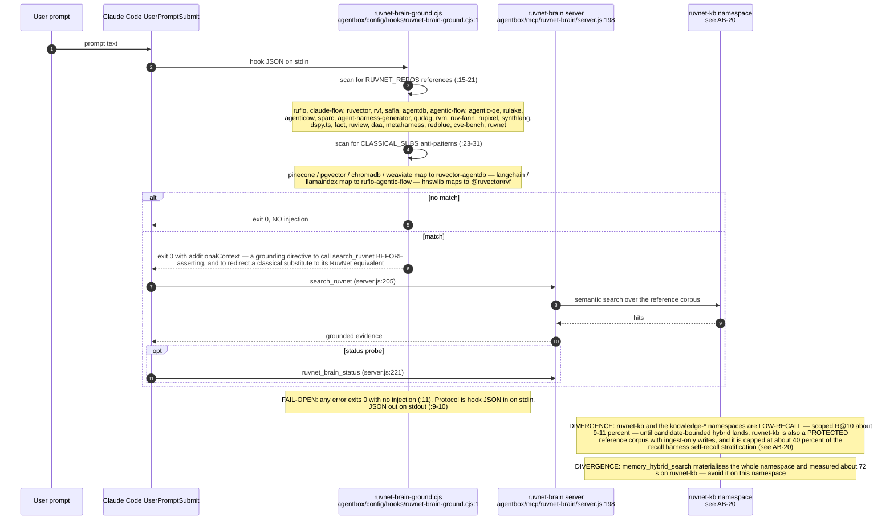
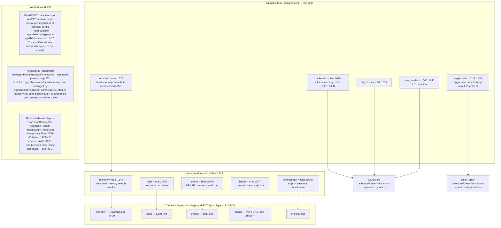

## AB-26.1 headroom — lazy native load and slot gating

## AB-26.2 The three content-aware compressors and the CCR store

## AB-26.3 headroom MCP tools

## AB-26.4 The beads adapter contract

## AB-26.5 Work-DAG readiness semantics

## AB-26.6 typed-spawn — typed, DID-owned recursive spawn

## AB-26.7 spawn_ready and spawn_complete

## AB-26.8 RuvNet Brain grounding

## AB-26.9 Compression slot topology

