## AB-27.1 ComfyUI — builtin loopback gate vs external sidecar integration

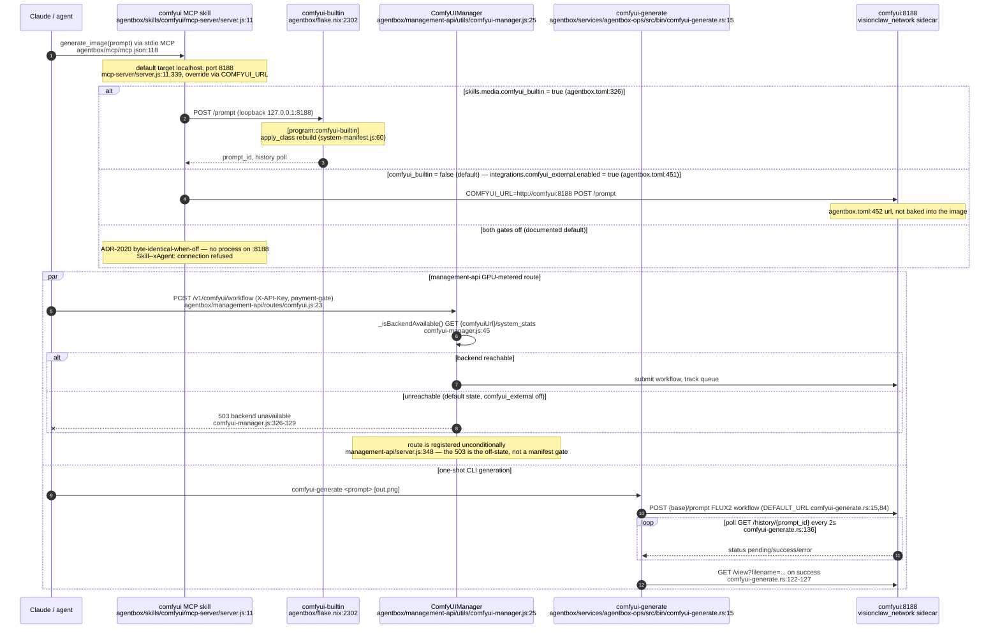

## AB-27.2 Blender MCP dispatch — proxy to the gui-tools GPU sidecar

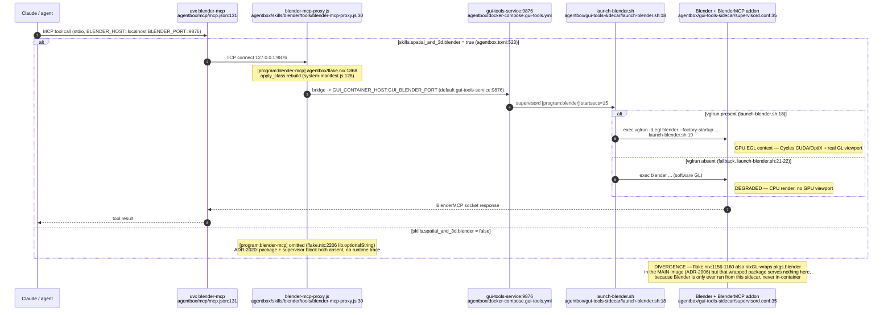

## AB-27.3 QGIS MCP dispatch — headless offscreen server in the same sidecar

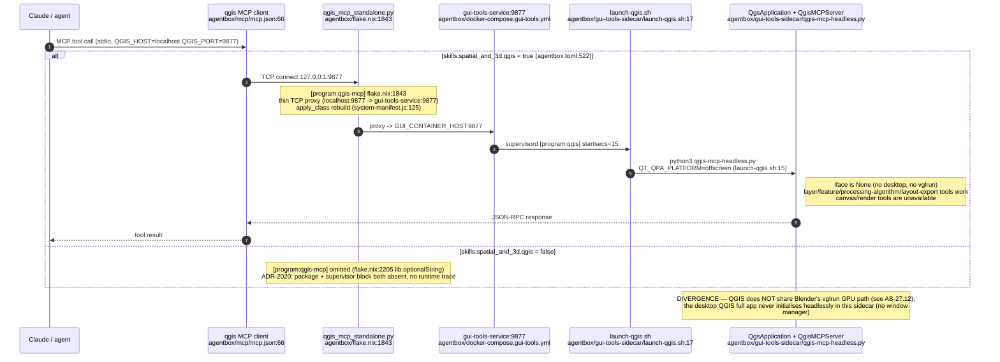

## AB-27.4 ImageMagick MCP dispatch — the 7 rmcp tools

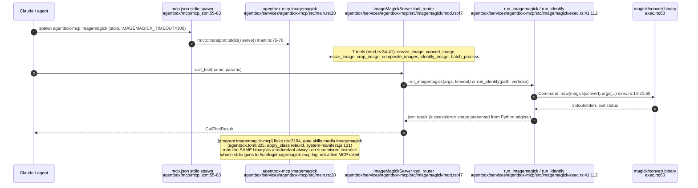

## AB-27.5 JupyterLab dispatch

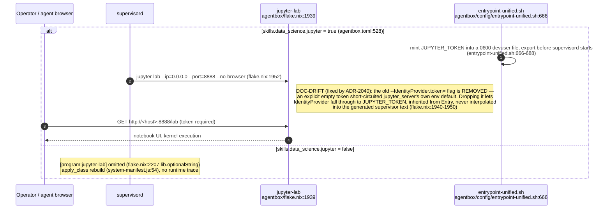

## AB-27.6 code-server dispatch

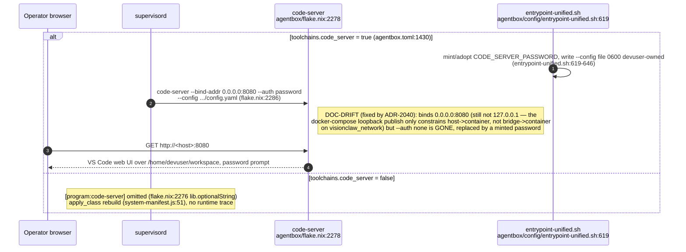

## AB-27.7 Voice / Unmute operator console dispatch — own-lifecycle sidecar

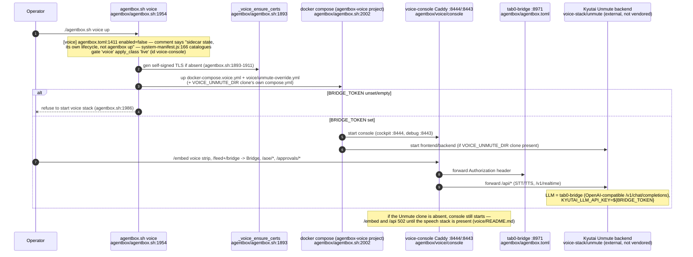

## AB-27.8 openmed clinical-PHI sidecar — triple fail-closed prerequisite gate

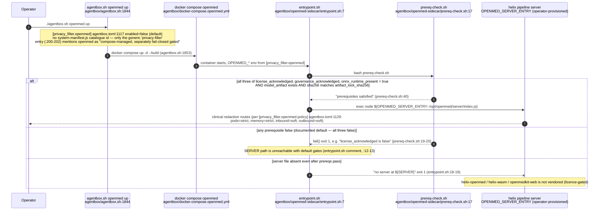

## AB-27.9 3D Gaussian Splatting / LichtFeld — two unrelated paths behind one skill name

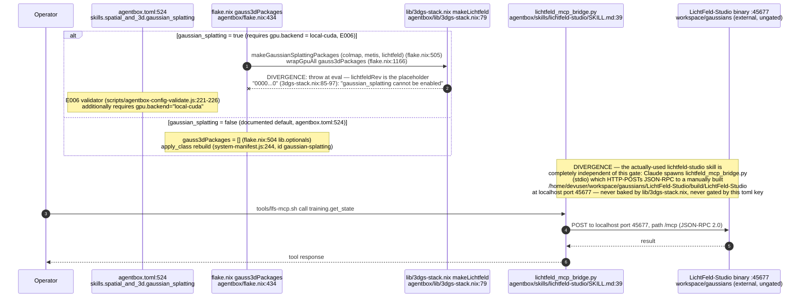

## AB-27.10 Supervision tree — media/GPU supervised programs, ports on the edges

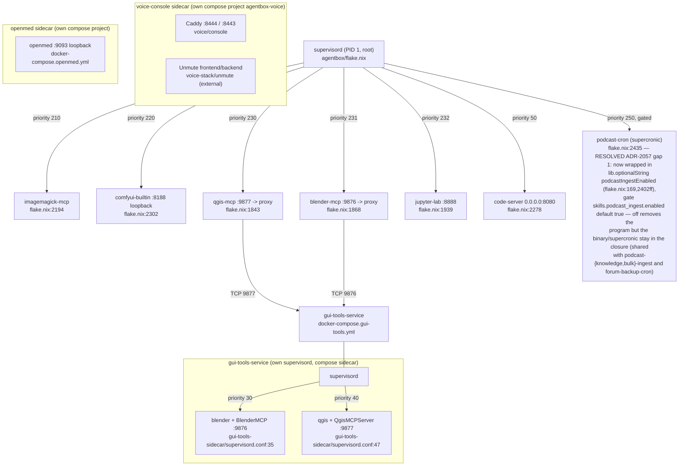

## AB-27.11 Manifest gate to apply_class — media/GPU capability catalogue

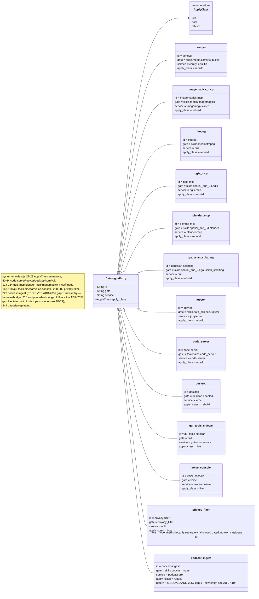

## AB-27.12 gui-tools sidecar GPU path — vglrun/nixGL, shared and unshared

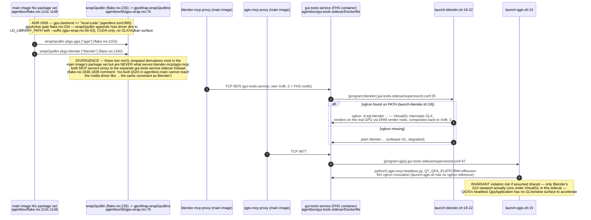

## AB-27.13 xr-runtime sidecar — Monado OpenXR plus Godot, behind Xvfb/VNC

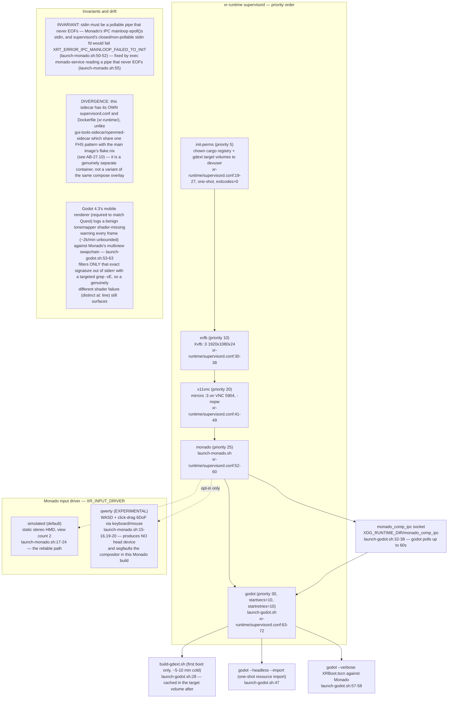
