## AB-28.1 agentbox-manifest — the boot-time projection surface

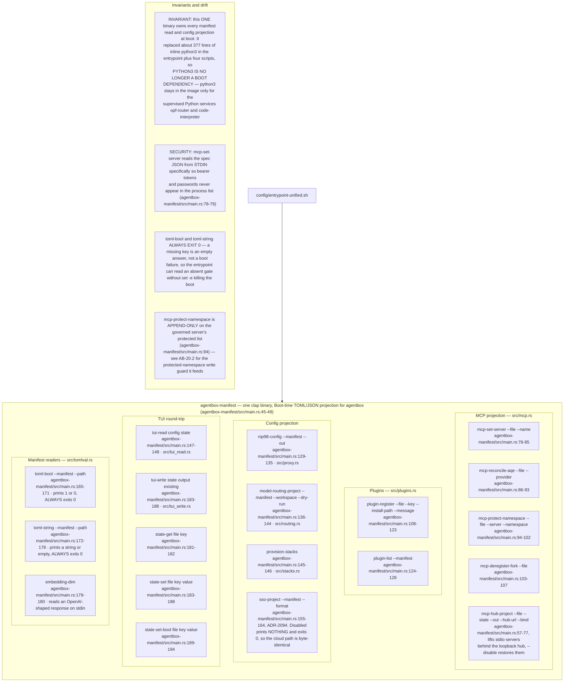

## AB-28.2 Boot projection sequence

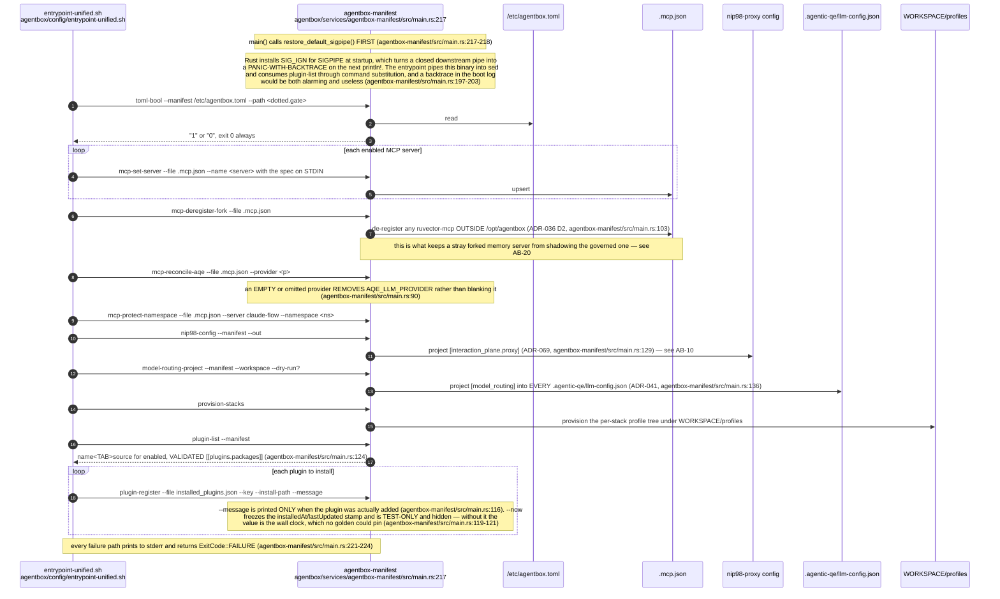

## AB-28.3 Consultant model projection (ADR-2031)

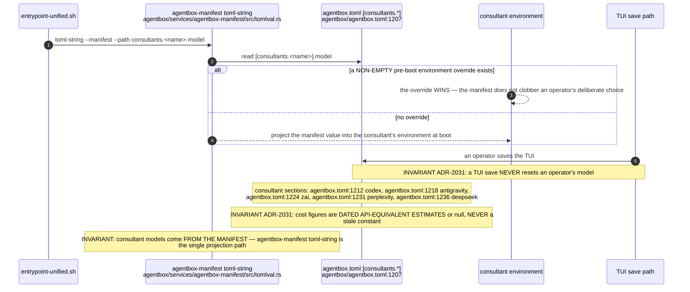

## AB-28.4 TUI manifest round-trip

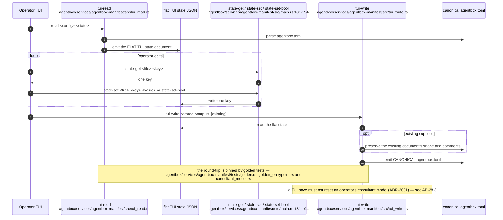

## AB-28.5 agentbox-ops — the retired-Python tool suite

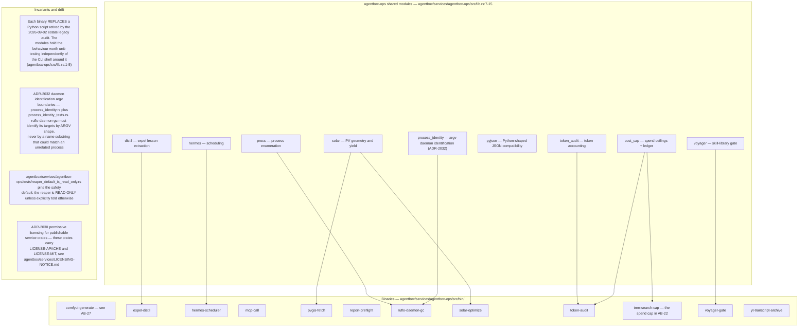

## AB-28.6 agentbox-mcp — one binary, three stdio MCP servers plus the streamable-HTTP hub

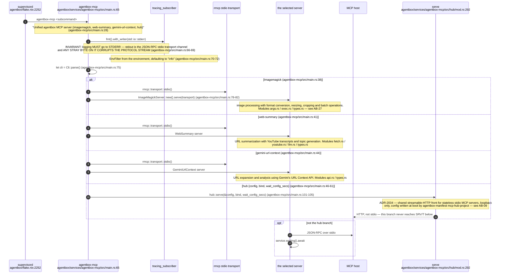

## AB-28.7 skill-tools — Rust ports backing three skills

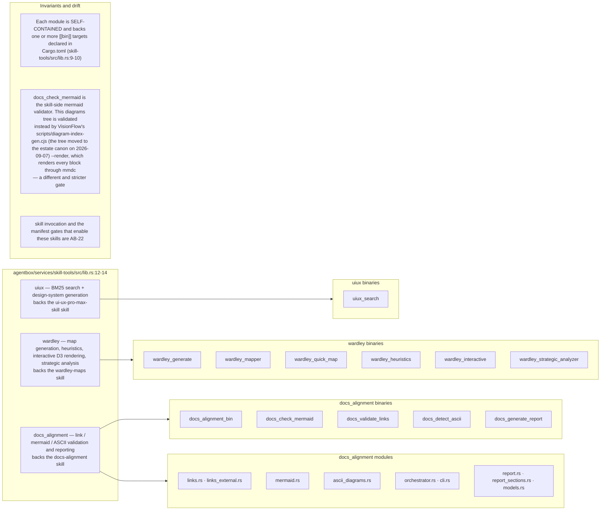

## AB-28.8 The MCP server fleet in mcp/servers

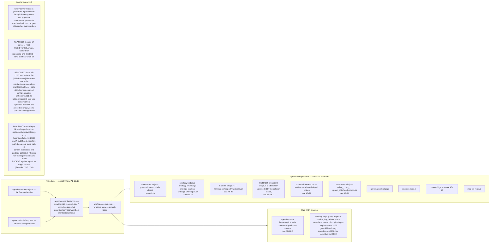

## AB-28.9 Service crate publishing posture

```mermaid
classDiagram
    class PublishableServiceCrate {
        <<ADR-2030>>
        +LICENSE-APACHE
        +LICENSE-MIT
        +README.md
        +Cargo.toml with repository metadata
        +inline rustdoc on every public item
    }
    class agentbox_manifest {
        boot-time TOML/JSON projection
        clap subcommands
        golden tests
    }
    class agentbox_ops {
        retired-Python tool suite
        12 binaries
        9 shared modules
    }
    class agentbox_mcp {
        3 stdio MCP servers
        rmcp transport
    }
    class skill_tools {
        uiux · wardley · docs_alignment
        12 binaries
    }
    class ontology_tools {
        parser · validator · writer · modifier
        enrichment · link_validator
        see AB-25
    }
    class podcast_ingest {
        corpus ingest
        see AB-27
    }
    class explainer_tools {
        explainer-loom-draft
        LICENSE-APACHE and LICENSE-MIT
        see AB-28.12
    }
    class dream_engine {
        nightly cycle
        see AB-23
    }
    class headroom_napi {
        NAPI compression addon
        see AB-26
    }
    PublishableServiceCrate <|-- agentbox_manifest
    PublishableServiceCrate <|-- agentbox_ops
    PublishableServiceCrate <|-- agentbox_mcp
    PublishableServiceCrate <|-- skill_tools
    PublishableServiceCrate <|-- ontology_tools
    PublishableServiceCrate <|-- podcast_ingest
    PublishableServiceCrate <|-- explainer_tools
    PublishableServiceCrate <|-- dream_engine
    PublishableServiceCrate <|-- headroom_napi
    note for PublishableServiceCrate "ADR-2030 permissive licensing for publishable service crates. Dual LICENSE-APACHE +<br/>LICENSE-MIT are present in agentbox-manifest, agentbox-ops, ontology-tools and<br/>podcast-ingest. The estate-wide notice is agentbox/services/LICENSING-NOTICE.md"
    note for agentbox_manifest "Nix packaging for each crate lives in agentbox/lib — agentbox-manifest.nix,<br/>agentbox-ops.nix, agentbox-mcp.nix, skill-tools.nix, ontology-tools.nix,<br/>podcast-ingest.nix, dream-engine.nix, headroom-compress.nix. A crate is in the package<br/>set only when its manifest gate is on, which is what makes byte-identical-when-off real<br/>at IMAGE level, not just runtime"
```

## AB-28.10 A new gate joins the TUI round-trip — [model_routing.neural] (ADR-2080)

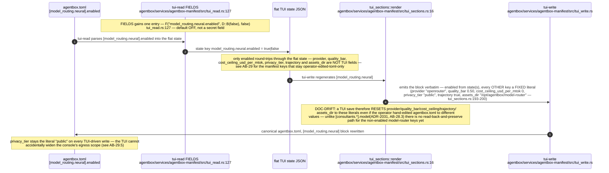

## AB-28.11 The precedent bridge is retired, colloquy is the successor (ADR-2085/2086)

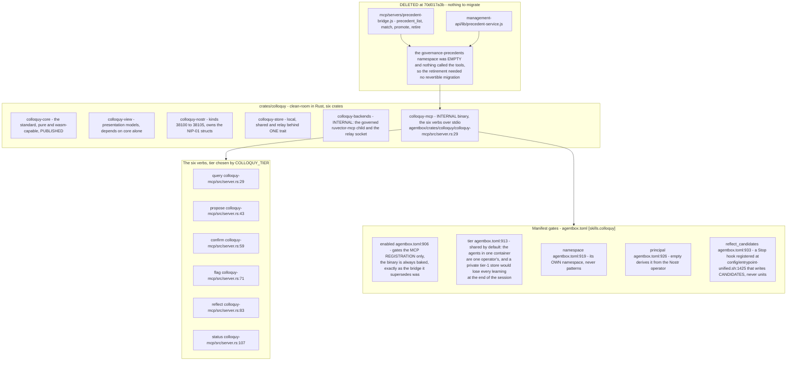

**Debt (corpus vs repo):** this topic listed the deleted `mcp/servers/precedent-bridge.js` in its own `sources:` until this pass, so every citation into it was an unresolvable warning and the file-existence check was failing the whole tree; the successor is `../project/agentbox/crates/colloquy/colloquy-mcp/src/server.rs:29`.

**Invariant:** mixing colloquy units into the `patterns` namespace would move the frozen recall band, so the shared tier gets its own (`../project/agentbox/agentbox.toml:919`).

**Invariant:** an agent that authorises itself defeats principal collapse, so the principal must never equal the agent's own member id and the binary exits rather than start that way (`../project/agentbox/agentbox.toml:923-925`).

## AB-28.12 ADR-2104 - the hub fails hard instead of lying

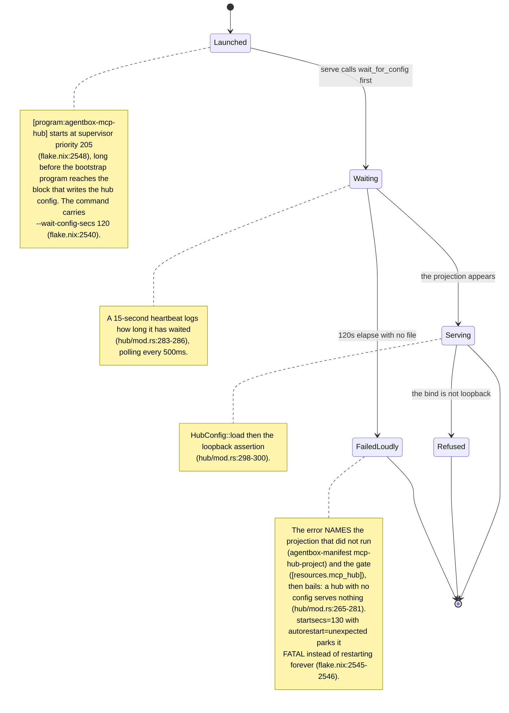

**Invariant:** the hub's wait is bounded and its failure is loud, because the unbounded version read `RUNNING` for three days over a port it had never bound while nine hub-routed servers refused connections (`../project/agentbox/services/agentbox-mcp/src/hub/mod.rs:261-264`, `../project/agentbox/docs/adr/ADR-2104-direct-control-over-mcp.md:23-32`).

**Open:** ADR-2104 is recorded `decision_status: proposed` with `implementation_status: partial` (`../project/agentbox/docs/adr/ADR-2104-direct-control-over-mcp.md:5-7`), so the wider rule that an MCP server is a disposable adapter over a crate (`:36-40`) is not yet a compliance surface for the servers in AB-28.8.

## AB-28.13 ADR-2084 - the facade client the service crates share

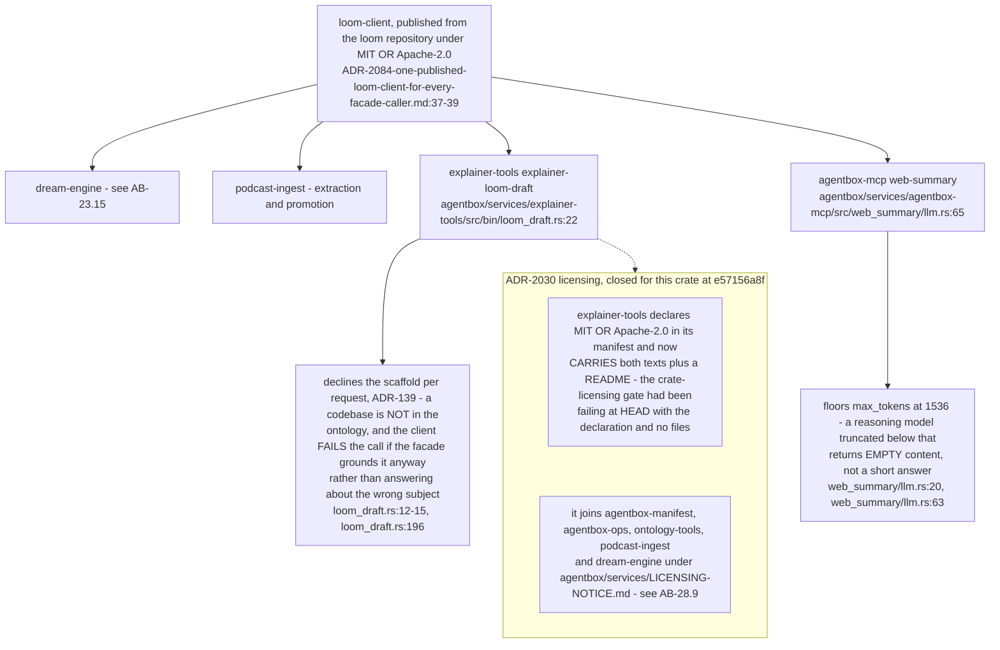

**Invariant:** `explainer-loom-draft` replaced `skills/explainer/scripts/loom-draft.mjs`, so the explainer path is a supervised Rust binary rather than a script, and the facade protocol it speaks comes from the published crate rather than being reimplemented (`../project/agentbox/services/explainer-tools/src/bin/loom_draft.rs:1-2`).

