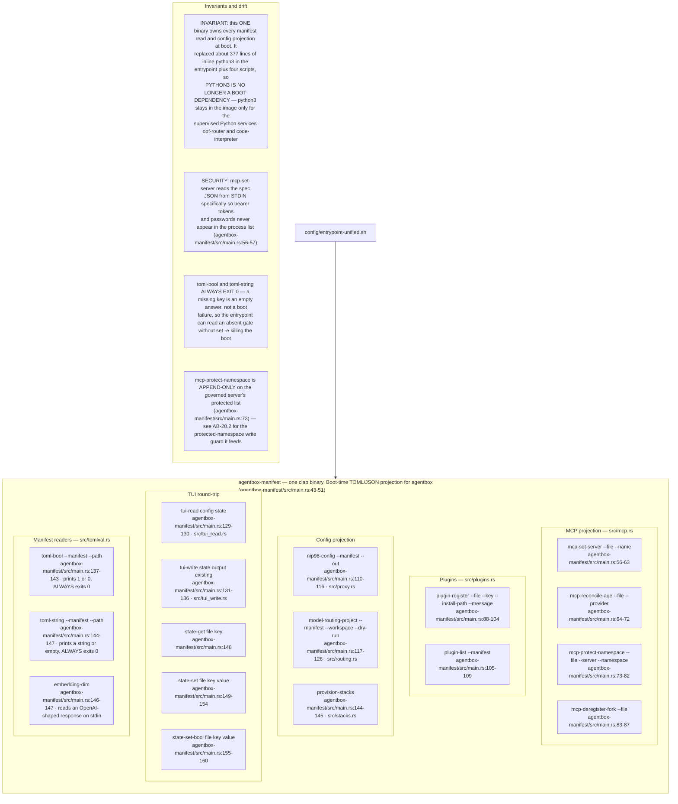
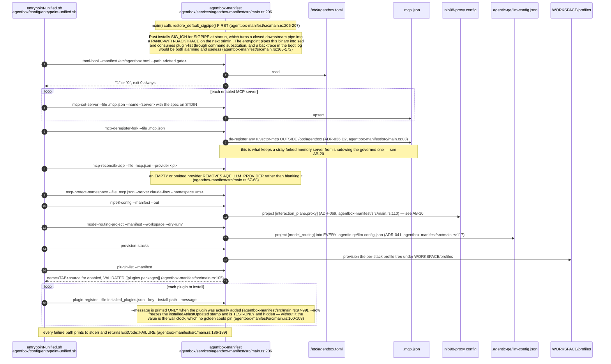
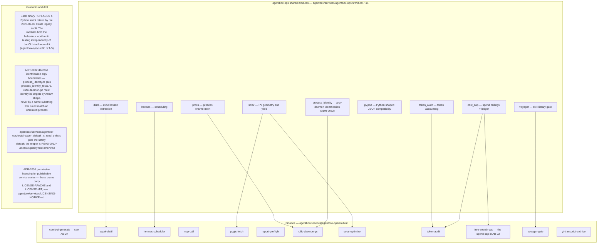
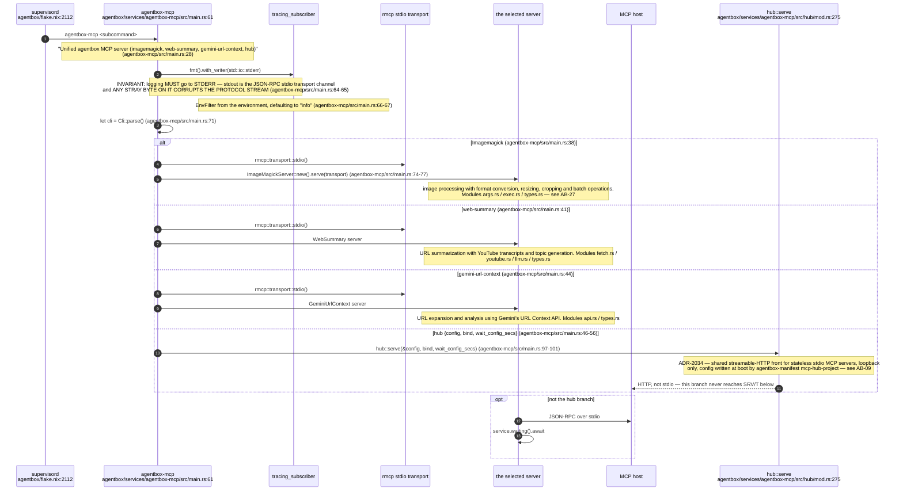
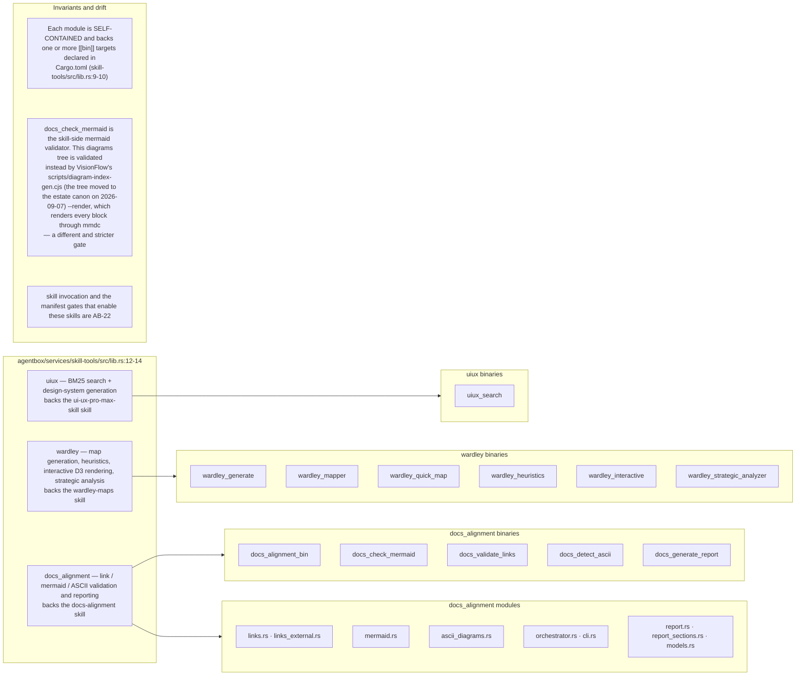
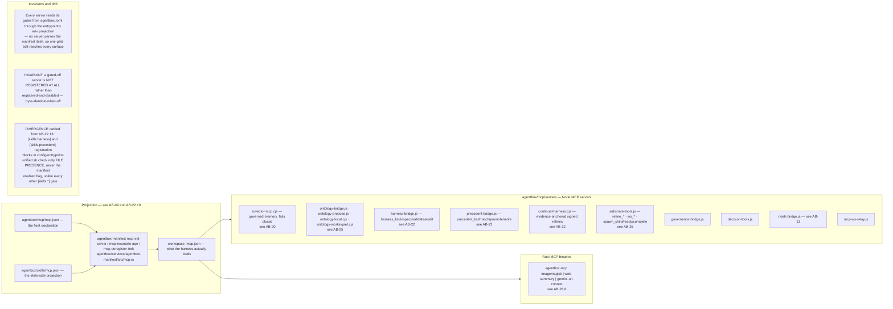
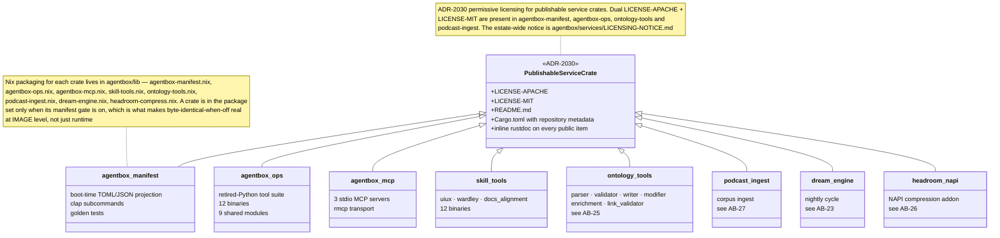
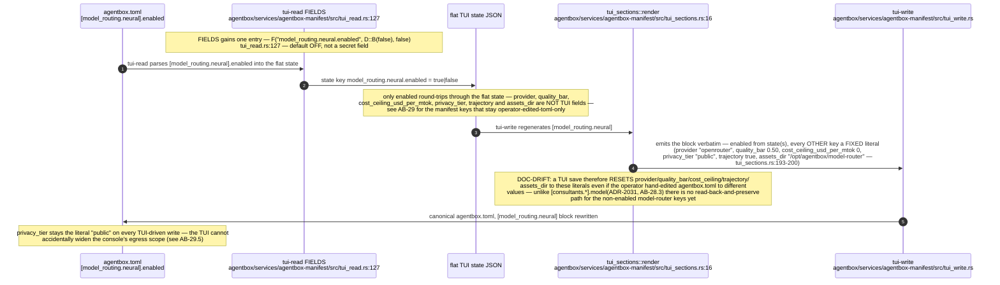

## AB-28.1 agentbox-manifest — the boot-time projection surface

## AB-28.2 Boot projection sequence

## AB-28.3 Consultant model projection (ADR-2031)

## AB-28.4 TUI manifest round-trip

## AB-28.5 agentbox-ops — the retired-Python tool suite

## AB-28.6 agentbox-mcp — one binary, three stdio MCP servers plus the streamable-HTTP hub

## AB-28.7 skill-tools — Rust ports backing three skills

## AB-28.8 The MCP server fleet in mcp/servers

## AB-28.9 Service crate publishing posture

## AB-28.10 A new gate joins the TUI round-trip — [model_routing.neural] (ADR-2080)

