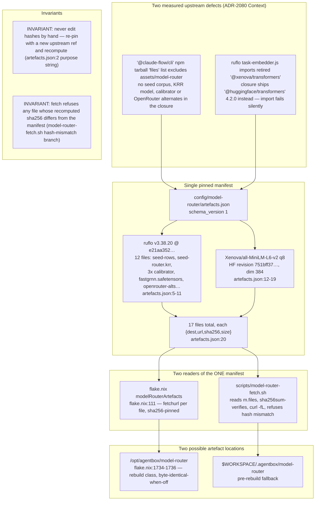
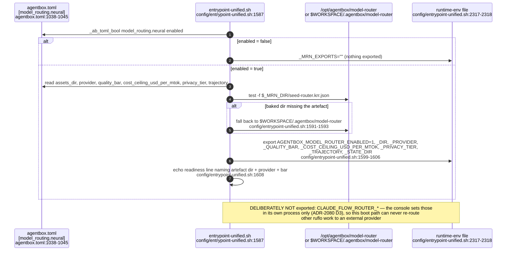
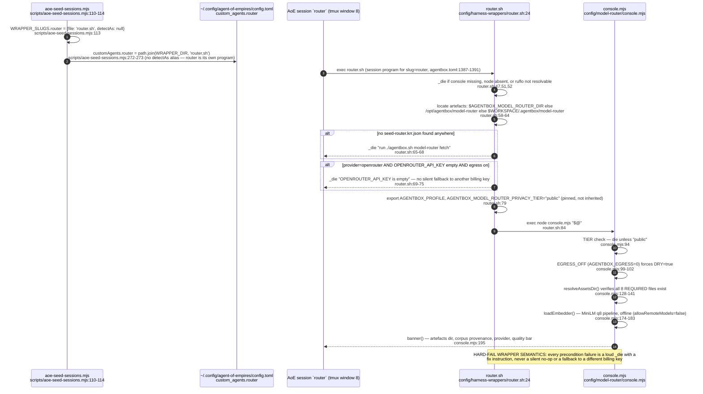
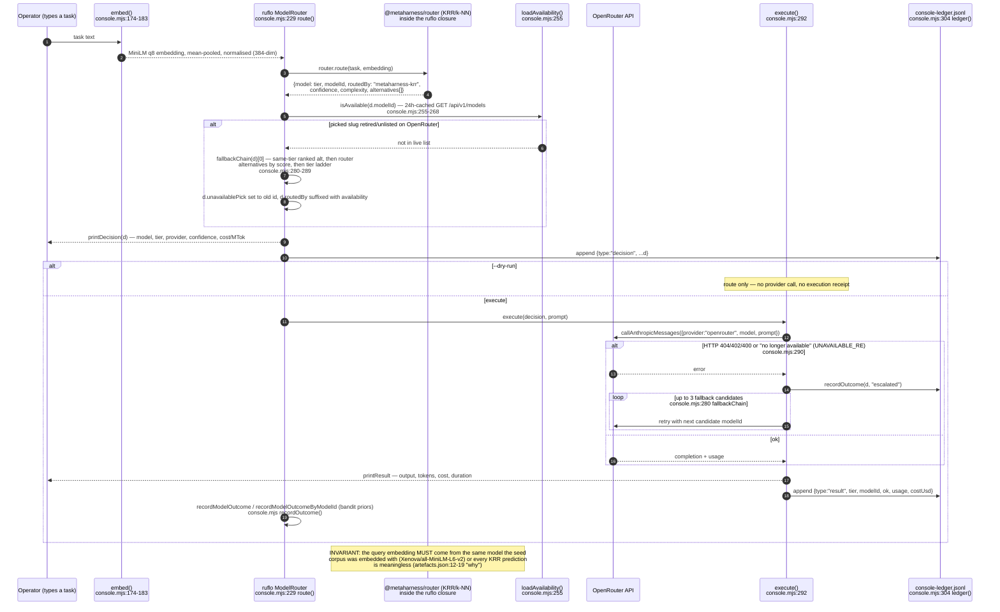
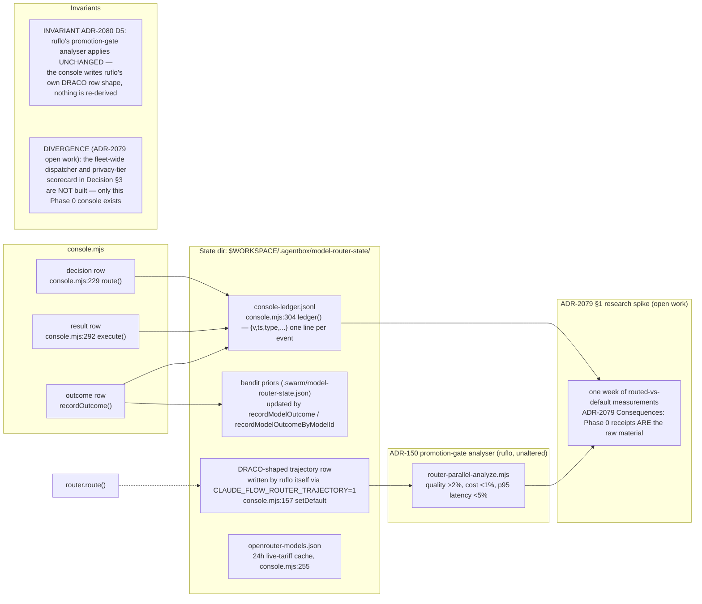
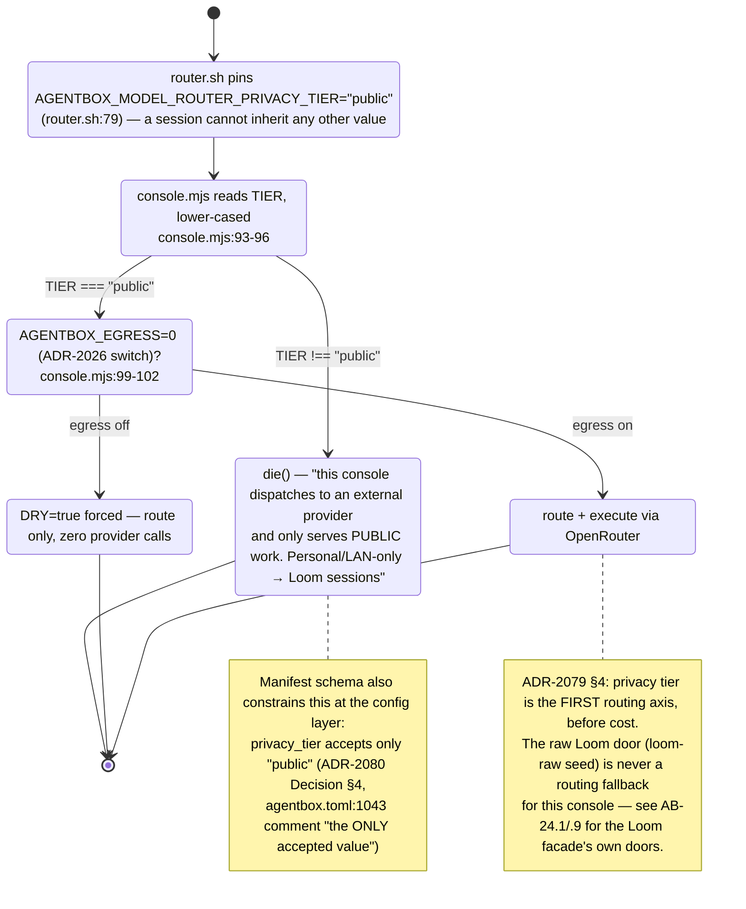
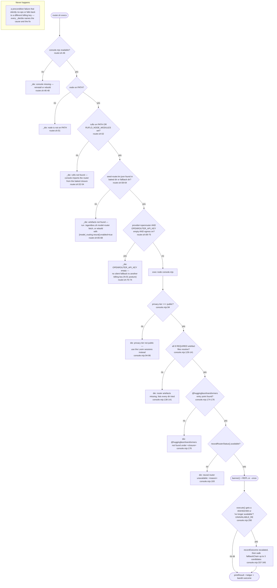
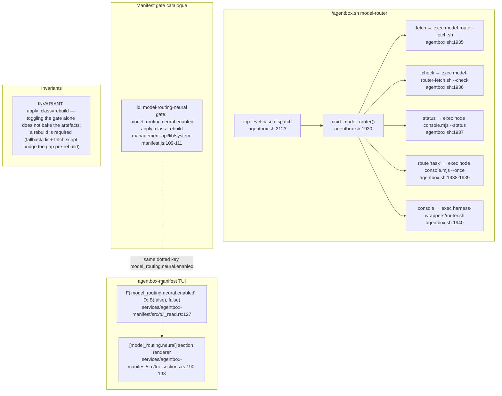

## AB-29.1 Composition — what is baked, and why the npm tarball lacks it

## AB-29.2 Boot env export — [model_routing.neural] to AGENTBOX_MODEL_ROUTER_*

## AB-29.3 Seed → wrapper → console sequence — a task typed in the AoE `router` session

## AB-29.4 Routing decision flow — embed, KRR predict, availability preflight, execute

## AB-29.5 Receipts, trajectory sink and the promotion-gate consumer

## AB-29.6 Privacy/public-only invariant — the tier gate at every layer

## AB-29.7 Failure modes — every hard-fail is loud, with a fix instruction

## AB-29.8 Surfaces — CLI, manifest catalogue gate and TUI field

