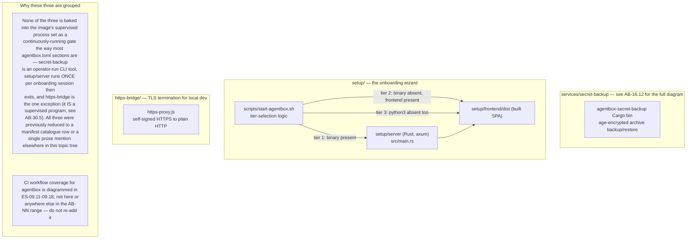
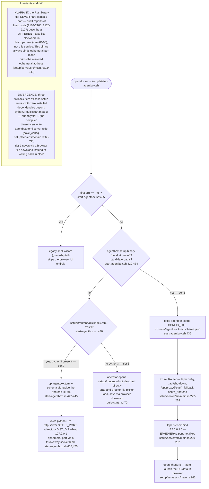
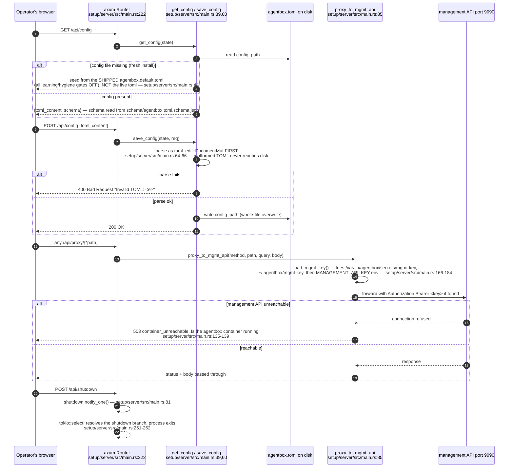
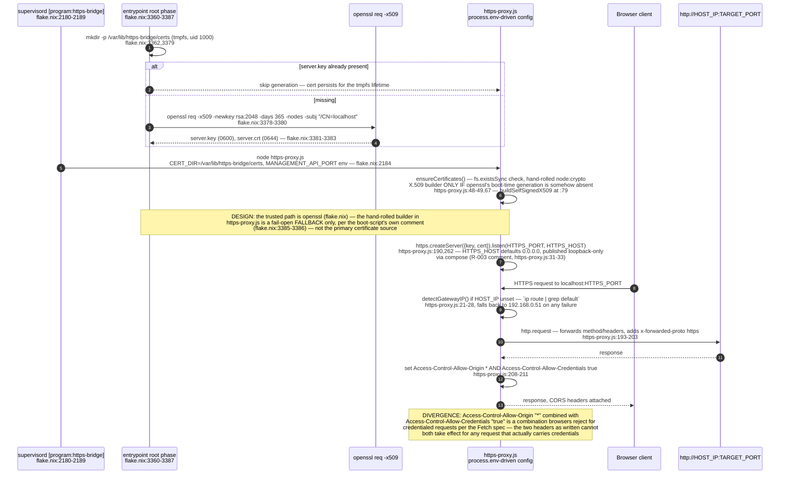
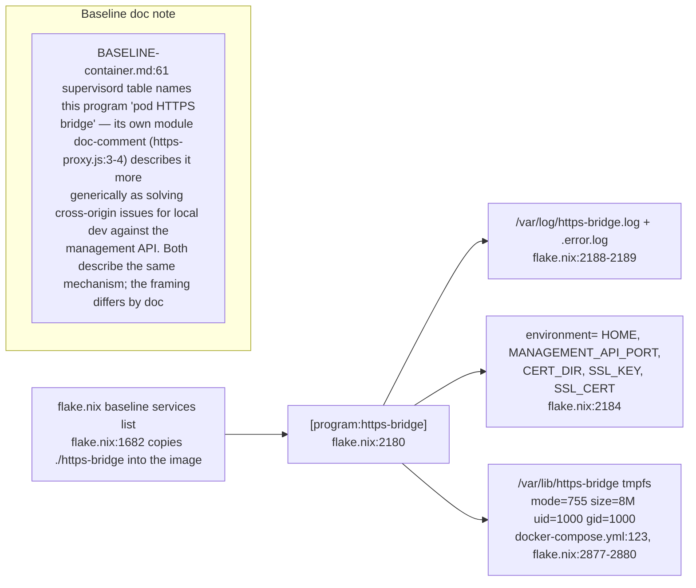

## AB-30.1 Three name-dropped services, three different lifecycles

## AB-30.2 setup/server — three-tier fallback (legacy-ADR-024 D1)

## AB-30.3 setup/server API surface — config round trip and the management-API proxy

## AB-30.4 https-bridge — self-signed TLS termination in front of a plain-HTTP target

## AB-30.5 https-bridge in the supervised process set — the one service of the three that IS

