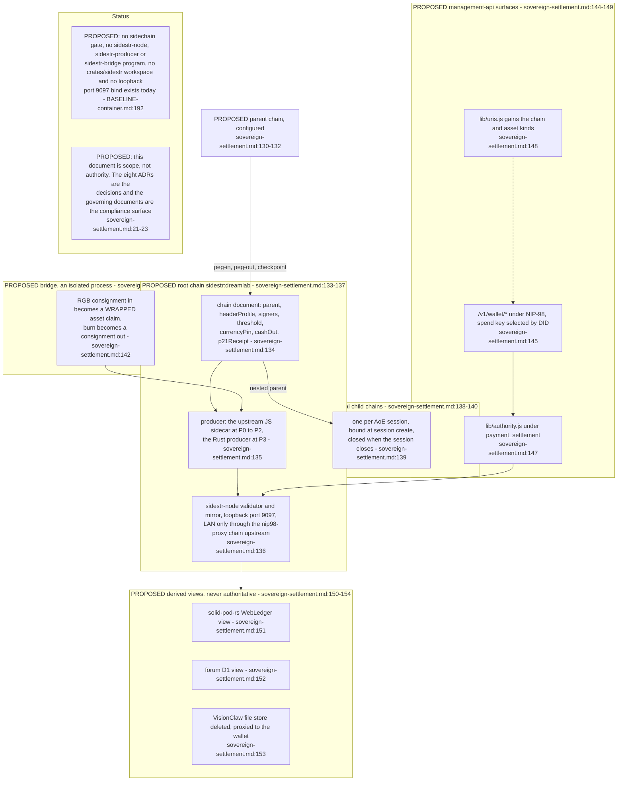
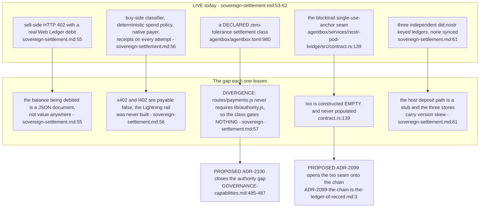
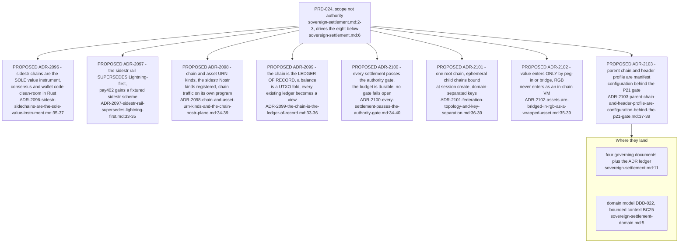
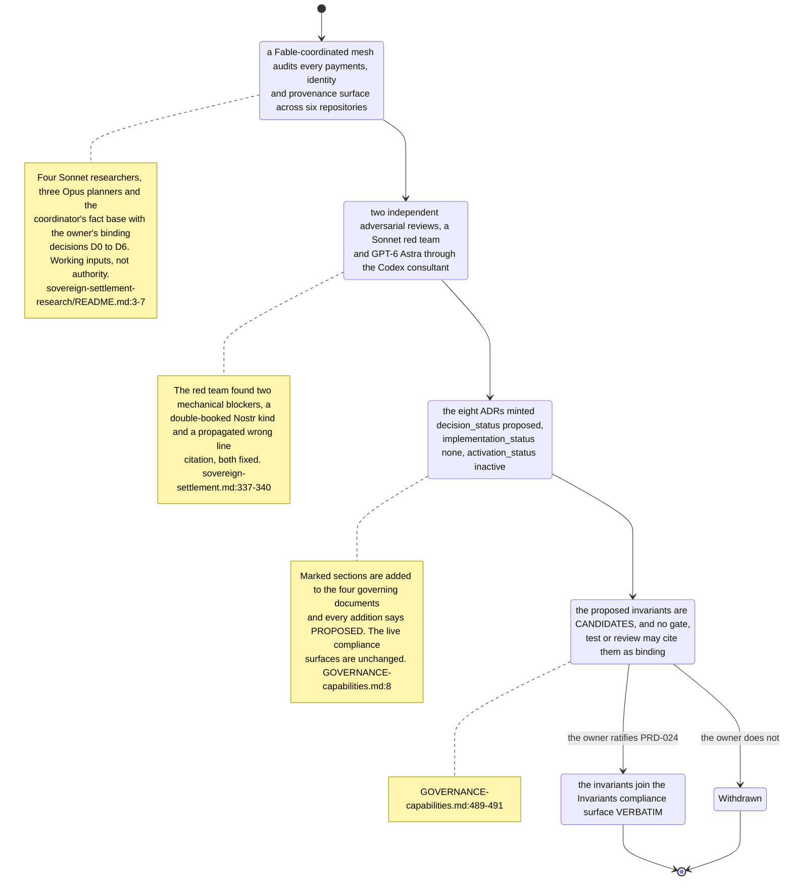
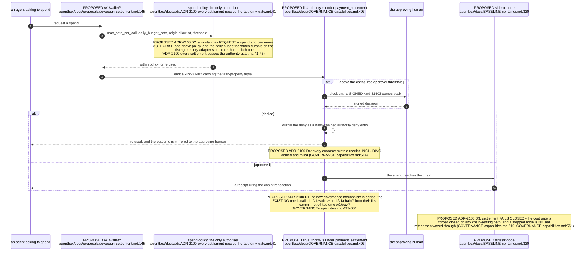
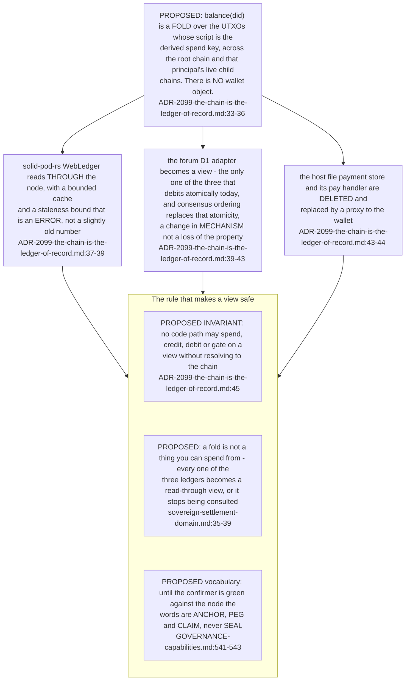
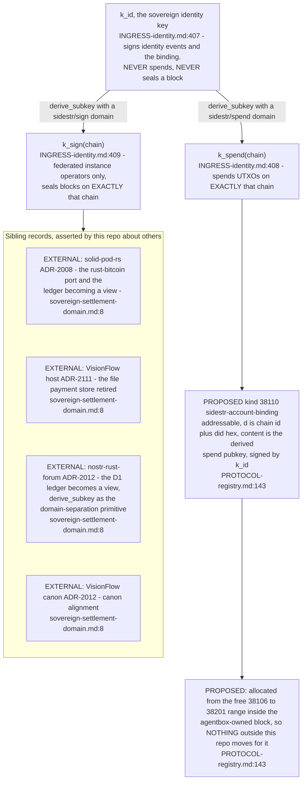
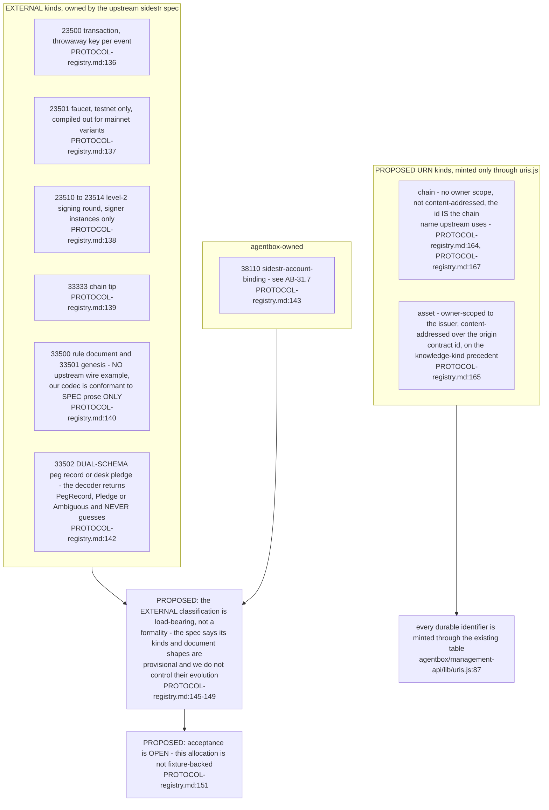
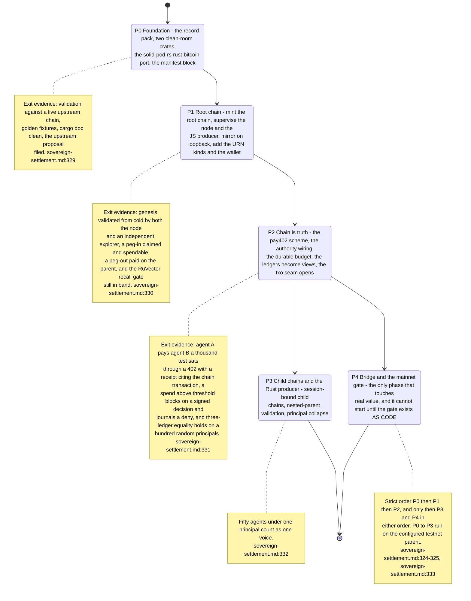

## For developers

This topic is the PRD-024 design, read at `1639f86ab` when nothing of it was running: every one of the eight decisions was minted `proposed` with `implementation_status: none` (ADR-2096-sidestr-sidechains-are-the-sole-value-instrument.md:5-7), carried by the four governing documents in explicitly marked PROPOSED sections that join the compliance surface only on ratification (GOVERNANCE-capabilities.md:489-491). Read every node and Note below as a design that cites the record proposing it.
Part of it has since been built. AB-32 is the sealed root chain, AB-33 the four published crates, AB-34 what is actually running, AB-35 the reviewed level-2 shape — each stamped at `ec60a8f14`. Where this topic and those disagree, they are the current claim and this one is the design it came from.

**Drift (this topic vs ADR-2112):** "AB-33 the four published crates" is superseded — on 2026-09-23 ADR-2112 moved the crates (now five) to `DreamLab-AI/sidestr-rs`; agentbox hosts the chain instance only. See SR-01.

## For the business

The estate can already charge for work and already refuses work it has not been paid for, but the balance it debits is a JSON document rather than value anywhere (sovereign-settlement.md:51-55). The proposal is to run the estate's own settlement chains so that a balance becomes something a third party can verify, with every payment above a threshold stopping for a human signature first. It is a costed plan in five ordered phases, only the last of which touches real money, and it has not been approved; the first two phases have since partly begun (AB-32, AB-34).

## AB-31.1 PROPOSED - the target architecture as PRD-024 draws it

## AB-31.2 PROPOSED - what exists, what is missing

**Drift (manifest vs routes):** `../project/agentbox/agentbox.toml:980` declares `payment_settlement = "zero-tolerance"` and `../project/agentbox/agentbox.toml:1028-1030` gives it `verifiability = inspectable` with `stakes = critical`, but the only two routes that require the gate are `../project/agentbox/management-api/routes/broker-bridge.js:48` and `../project/agentbox/management-api/routes/llm-marketplace.js:43`; the payment routes at `../project/agentbox/management-api/routes/payments.js:10-17` do not, so the class gates nothing today (recorded at `../project/agentbox/docs/GOVERNANCE-capabilities.md:485-487`).

**Debt:** `../project/agentbox/services/nostr-pod-bridge/src/contract.rs:139` ships the blocktrail `txo` field as an always-empty vector, a seam reserved years before anything could fill it.

## AB-31.3 PROPOSED - the eight decisions and what each one owns

**Open:** every one of the eight records carries an empty `verified_commit` and `verified_paths` (`../project/agentbox/docs/adr/ADR-2096-sidestr-sidechains-are-the-sole-value-instrument.md:10-11`), which is correct for a decision with no code, and means nothing in this topic can be re-derived from a symbol until P0 lands.

## AB-31.4 PROPOSED - the ratification lifecycle of a governing-document section

**Invariant:** a proposed section states its own non-authority in the document that carries it, so a reader who lands on it by search cannot mistake it for a live rule (`../project/agentbox/docs/BASELINE-container.md:192`, `../project/agentbox/docs/GOVERNANCE-capabilities.md:489-491`).

## AB-31.5 PROPOSED - a settlement through the authority gate

**Invariant (proposed):** spend authorisation counts authorising principals and never accounts, reusing the colloquy rule, so an operator's fifty agents are one voice (`../project/agentbox/docs/GOVERNANCE-capabilities.md:517-519`).

## AB-31.6 PROPOSED - the chain as the ledger of record

## AB-31.7 PROPOSED - key separation and the account binding

**Invariant (proposed):** the identity key never spends and never seals, which is what keeps a compromised wallet from being a compromised identity (`../project/agentbox/docs/INGRESS-identity.md:407`).

## AB-31.8 PROPOSED - the Nostr kind plane and two URN kinds

**Open:** the kind allocation is recorded but not fixture-backed, so nothing yet proves a decoder round-trips an upstream event (`../project/agentbox/docs/PROTOCOL-registry.md:151-152`).

## AB-31.9 PROPOSED - the five phases, and the one that touches real value

**Invariant (proposed):** the mainnet phase cannot begin until the regulatory gate exists as code rather than as an assertion, which is the correction of a prior record that called the same containment "architecturally enforced" while it was not built (`../project/agentbox/docs/proposals/sovereign-settlement.md:324-325`, `../project/agentbox/docs/proposals/sovereign-settlement.md:60`).

**Open:** PRD-024 lists its own outstanding questions and ranked risks (`../project/agentbox/docs/proposals/sovereign-settlement.md:420`, `../project/agentbox/docs/proposals/sovereign-settlement.md:456`); none is answered by anything in this repository today.

**Drift (this topic vs the repository since 1639f86ab):** the account binding moved from kind `38110` to `38420` (AB-34.4), `crates/sidestr/` now exists with four published crates (AB-33.1), and the root chain named here as proposed has been sealed (AB-32.1) — AB-31.1's and AB-31.2's status notes are true only at this topic's declared revision.
