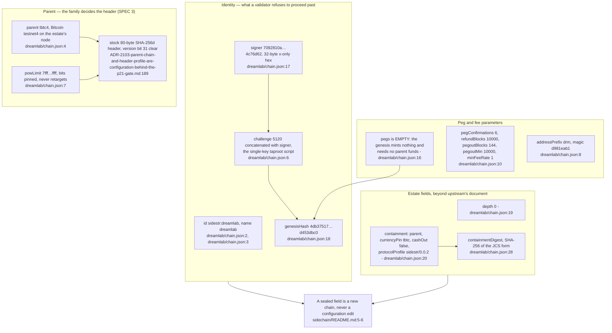
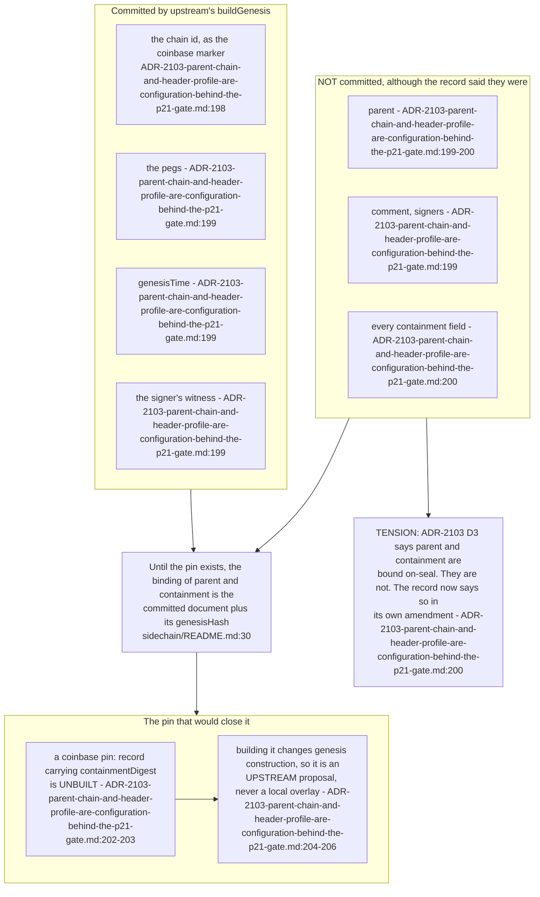
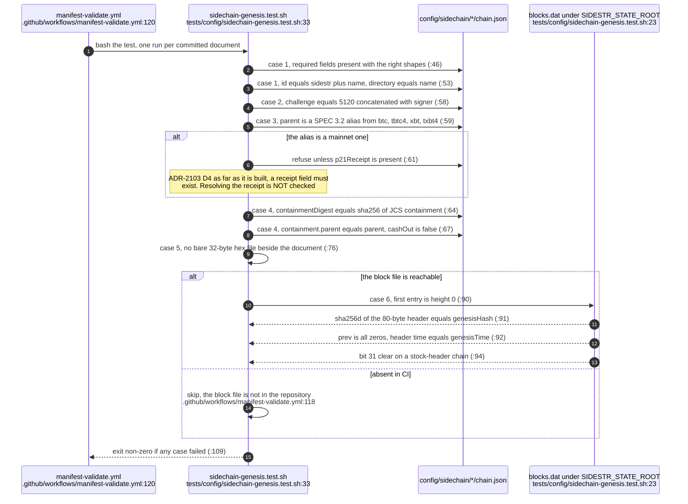
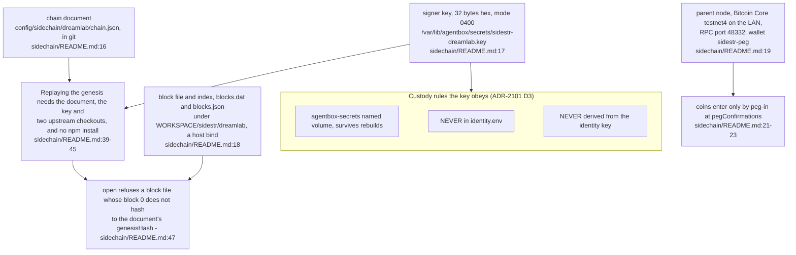
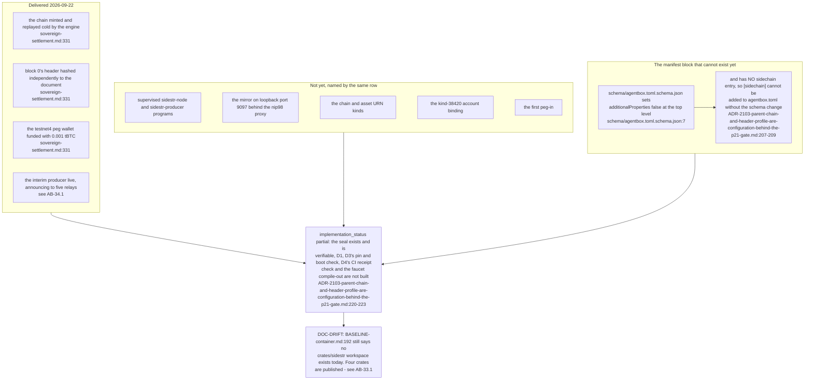

## For developers

On 2026-09-22 the estate stopped proposing a settlement chain and sealed one: `sidestr:dreamlab`, genesis `4db37517…d453dbc0`, one signer, prefix `drm`, no pegs, an 80-byte stock header beside Bitcoin testnet4 (`sidechain/README.md:10`). The committed chain document is the chain's identity, not its configuration — changing a sealed field is a new chain, never an edit (`sidechain/README.md:5-6`). AB-31 is the design this partly implements, AB-33 the crates that can now verify it, AB-34 what is actually running.

## For the business

The estate owns a settlement chain rather than a plan for one, and it deliberately carries no value: the parent is Bitcoin's test network, nothing was pegged to it at minting, and real money stays behind a legal gate that must exist as working code first. What the seal buys is that a later claim about a payment can be checked by someone outside the estate.

## AB-32.1 The sealed document, field by field

**Invariant:** `challenge` is `5120` concatenated with `signer`, so a document cannot name one key and be sealed by another — the genesis test asserts exactly that equality (`../project/agentbox/tests/config/sidechain-genesis.test.sh:58`).

## AB-32.2 What the genesis commits to, and what it does not

**Tension (ADR-2103 D3 vs the sealed chain):** D3 states that `parent`, `headerProfile`, `currencyPin`, `cashOut`, `pegConfirmations` and `refundBlocks` are committed as a `pin:` record in the genesis coinbase (`../project/agentbox/docs/adr/ADR-2103-parent-chain-and-header-profile-are-configuration-behind-the-p21-gate.md:63`), but the seal established that upstream commits only four things and the pin is unbuilt (`../project/agentbox/docs/adr/ADR-2103-parent-chain-and-header-profile-are-configuration-behind-the-p21-gate.md:200`).

**Open:** whether the pin lands at all depends on an upstream proposal to change genesis construction, which has not been filed (`../project/agentbox/docs/adr/ADR-2103-parent-chain-and-header-profile-are-configuration-behind-the-p21-gate.md:204`).

## AB-32.3 The engine-free genesis gate, case by case

**Invariant:** no key material can sit beside a chain document — case 5 greps the directory for a bare 32-byte hex file and fails the run if it finds one (`../project/agentbox/tests/config/sidechain-genesis.test.sh:76`).

**Debt:** case 3 enforces only that a mainnet parent carries a `p21Receipt` field. ADR-2103 D4 asks for a CI check that the receipt *resolves*, a second check forbidding a level-1 chain on a mainnet parent, and a node that refuses to open one; none is built (`../project/agentbox/docs/adr/ADR-2103-parent-chain-and-header-profile-are-configuration-behind-the-p21-gate.md:221-222`).

## AB-32.4 Where the three non-git things live

**Invariant:** the block file is reproducible from the document plus the key while the chain is at genesis, which is why the repository can hold the document alone and still let anyone rebuild block 0 (`../project/agentbox/config/sidechain/README.md:18`).

## AB-32.5 What P1 delivered, and what it did not

**Drift (BASELINE-container vs the repository):** the governing document's proposed section still asserts that no `crates/sidestr/` workspace exists (`../project/agentbox/docs/BASELINE-container.md:192`), which stopped being true on the same day — four crates are published at 0.1.0 (see AB-33.1).

**Debt:** `[sidechain]` is a specified manifest gate with a catalogue entry, an apply class and a supervised program set (`../project/agentbox/docs/BASELINE-container.md:277`, `../project/agentbox/docs/BASELINE-container.md:320`), and none of it is expressible until the schema gains the block (`../project/agentbox/schema/agentbox.toml.schema.json:7`). See AB-05.13 for where it would appear in the gate catalogue.

**Open:** PRD-024's question 9 is answered — the first seal is `tbtc4` with stock headers (`../project/agentbox/docs/proposals/sovereign-settlement.md:480-485`) — but questions 8, 13, 14 and 15 remain, and each changes what gets built (`../project/agentbox/docs/proposals/sovereign-settlement.md:487`).
