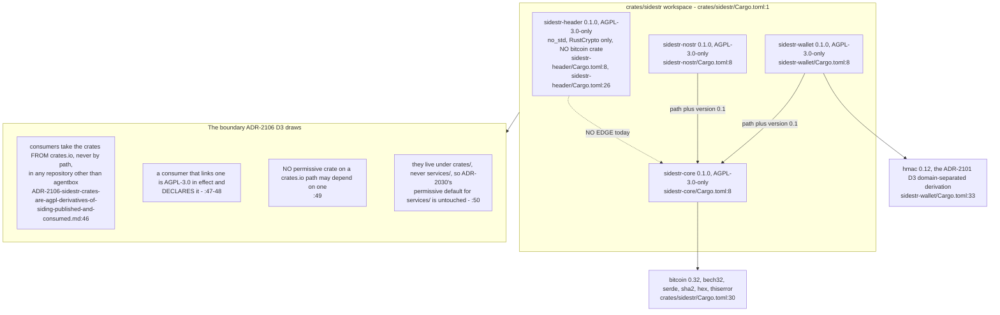
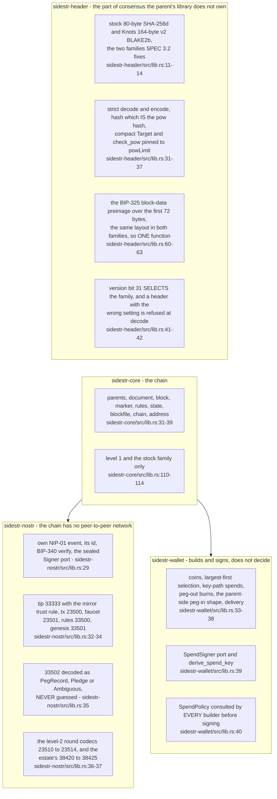
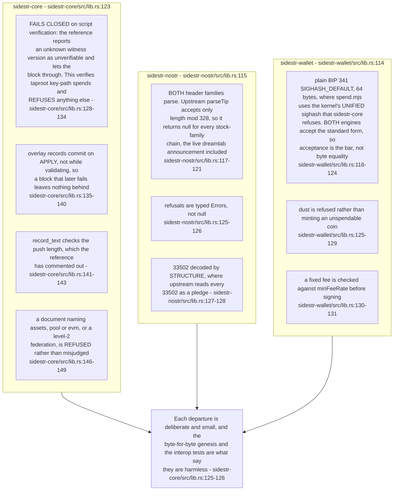
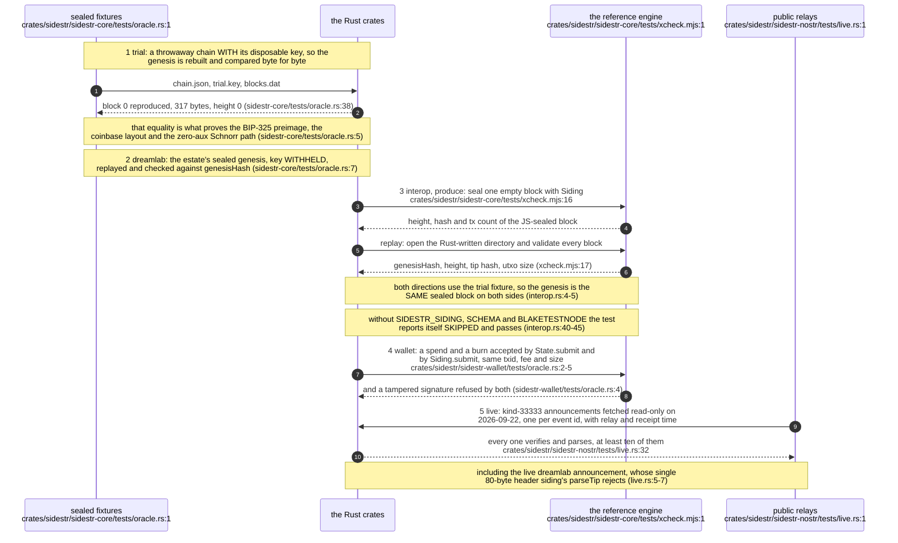
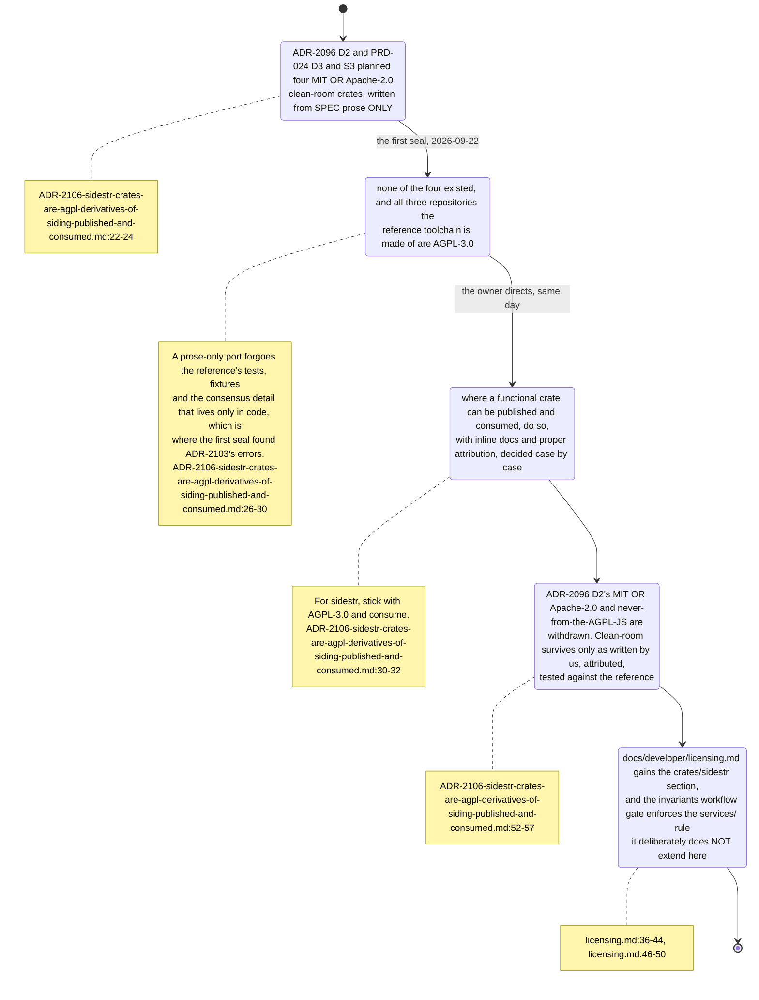

## For developers

Four crates under `crates/sidestr/` (`crates/sidestr/Cargo.toml:3-19`), all published at 0.1.0 and all `AGPL-3.0-only` because they are ports of Melvin Carvalho's `siding` rather than clean-room work from prose — ADR-2106 reversed ADR-2096 D2's permissive plan on the day the first seal showed a prose-only port would forgo the reference's tests and fixtures (`ADR-2106-sidestr-crates-are-agpl-derivatives-of-siding-published-and-consumed.md:22-32`). Every departure from the reference is listed in the crate's own rustdoc, and each is held down by an oracle test rather than by assertion.

**Drift (this topic vs agentbox since ad45e7bf8):** the crates this topic cites under `crates/sidestr/` no longer live in agentbox — on 2026-09-23 ADR-2112 moved them with their history and their CI to `DreamLab-AI/sidestr-rs`, leaving a pointer README; they are now five (`sidestr-round` joined) at 0.2.x. Citations here stay true at `ec60a8f14` and are not re-stamped; the current crate graph, oracle ladder and level status are SR-01.

## For the business

The estate can now check its own settlement chain with code it owns, instead of trusting a single reference implementation it did not write. The licence is the copyleft one the original carries, which means these four pieces are not reusable by anyone who wants to keep their own work private — accepted, because the estate is the consumer, and it keeps the estate's obligations to the original author clean.

## AB-33.1 The dependency graph and the AGPL boundary

**Tension (ADR-2103 D2 vs the workspace):** D2 says both header profiles are first-class in `sidestr-header`, "a crate `sidestr-core` depends on" (`../project/agentbox/docs/adr/ADR-2103-parent-chain-and-header-profile-are-configuration-behind-the-p21-gate.md:50`), but `sidestr-core` declares no such dependency (`../project/agentbox/crates/sidestr/sidestr-core/Cargo.toml:23-30`) and carries its own `HeaderFamily` instead, refusing a BLAKE2b parent as `Error::UnsupportedFamily` "until `sidestr-header` lands" (`../project/agentbox/crates/sidestr/sidestr-core/src/lib.rs:110-114`) — the convergence is 0.2's.

**Drift (BASELINE-container vs the workspace):** the governing document still describes the crates as a proposed permissive set with internal `sidestr-producer`, `sidestr-bridge` and `sidestr-mcp` members (`../project/agentbox/docs/BASELINE-container.md:340`, `../project/agentbox/docs/BASELINE-container.md:347`); four AGPL crates exist and none of those three does.

## AB-33.2 What each crate holds

**Invariant:** a key is reached only through named operations — `sidestr-nostr`'s `SignRequest` has no public constructor, so a signer is driven only through the `sign_*` functions and always sees the whole event (`../project/agentbox/crates/sidestr/sidestr-nostr/src/lib.rs:97-101`), and a `sidestr-wallet` builder computes the BIP-341 sighash and asks the port, never holding a secret (`../project/agentbox/crates/sidestr/sidestr-wallet/src/lib.rs:95-96`).

## AB-33.3 Where the ports depart from siding

**Invariant:** every crate signs with zero BIP-340 auxiliary randomness, so a block, an event and a spend are each a pure function of their inputs and the key, and two producers with the same key and mempool make the same block (`../project/agentbox/crates/sidestr/sidestr-core/src/lib.rs:103-106`).

**Debt:** `sidestr-core` verifies only taproot key-path spends and refuses everything else, so a block valid to the reference is invalid here — a full script interpreter is deferred to 0.2 (`../project/agentbox/crates/sidestr/sidestr-core/src/lib.rs:133-134`).

## AB-33.4 The oracle ladder — what proves the port

**Invariant:** the interop test skips rather than fails when the reference checkouts are absent, so the gate stays green on a runner while still being a real cross-check where the checkouts exist (`../project/agentbox/crates/sidestr/sidestr-core/tests/interop.rs:2-3`).

**Open:** nothing in this repository pins the reference checkouts, so which upstream revision the interop and wallet oracles ran against is not recorded by the test — only the ported commit `2de40bda…` in each crate's rustdoc is (`../project/agentbox/crates/sidestr/sidestr-core/src/lib.rs:19`).

## AB-33.5 The CI gate on the workspace

```mermaid
flowchart TB
    TRIG["pull_request or push to main touching crates/sidestr/**<br/>.github/workflows/sidestr-crates.yml:5-12"]
    TRIG --> FMT["cargo fmt --all --check<br/>.github/workflows/sidestr-crates.yml:33"]
    FMT --> CLIP["cargo clippy --all-targets with -D warnings<br/>.github/workflows/sidestr-crates.yml:36"]
    CLIP --> TEST["cargo test: the ported siding suites plus the sealed<br/>fixtures - the trial genesis rebuilt byte for byte and<br/>the dreamlab genesis replayed<br/>.github/workflows/sidestr-crates.yml:38-43"]
    TEST --> DOC["cargo doc --no-deps with RUSTDOCFLAGS -D warnings,<br/>because AGPL crates ship FULL rustdoc (ADR-2106 D1)<br/>.github/workflows/sidestr-crates.yml:45-49"]
    DOC --> OK["green"]
    subgraph skip["What CI cannot reach"]
        S1["the JS interop half skips without the reference<br/>checkouts - .github/workflows/sidestr-crates.yml:41"]
        S2["the on-disk block file, which is host state<br/>see AB-32.3"]
        S1 ~~~ S2
    end
    TEST --> skip
```

**Invariant:** the docs step is a gate, not a courtesy — ADR-2106 D1 requires full inline rustdoc and a clean `cargo doc --no-deps` before publication, and the workflow enforces it with `-D warnings` (`../project/agentbox/.github/workflows/sidestr-crates.yml:47-49`).

## AB-33.6 How the licensing decision was reached and where it is written down

**Invariant:** the crates sit under `crates/`, never `services/`, so ADR-2030's permissive default for service crates is untouched and `check-crate-licensing.sh` keeps enforcing it unchanged (`../project/agentbox/docs/developer/licensing.md:43-44`, `../project/agentbox/docs/developer/licensing.md:46-48`).

**Open:** ADR-2106's consequences flag that `solid-pod-rs` becomes AGPL-3.0 in effect the moment it links `sidestr-core` for `AnchorConfirmer`, and its manifest must say so before that edge is added — the edge does not exist yet (`../project/agentbox/docs/adr/ADR-2106-sidestr-crates-are-agpl-derivatives-of-siding-published-and-consumed.md:62-65`).
