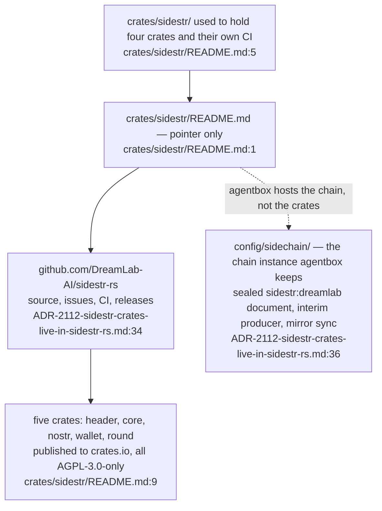
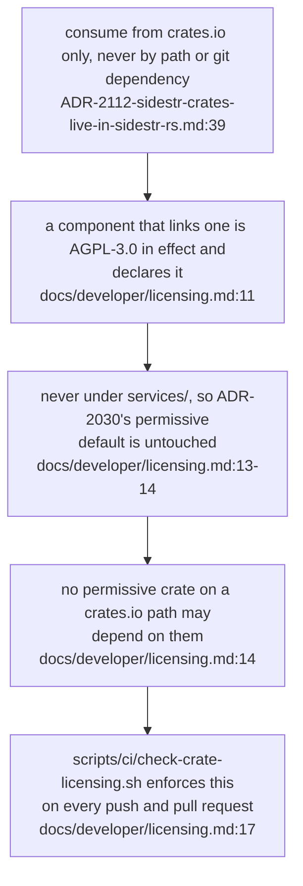

## For developers

On 2026-09-23 the four `sidestr-*` crates split out with their history to `DreamLab-AI/sidestr-rs` (now five, with `sidestr-round`); `crates/sidestr/` here holds only a pointer README (ADR-2112), and agentbox keeps the chain **instance** in `config/sidechain/` (see AB-31, AB-32, AB-34).

**Drift (this topic vs agentbox since ad45e7bf8):** the crates this topic cites under `crates/sidestr/` no longer live in agentbox — on 2026-09-23 ADR-2112 moved them with their history and their CI to `DreamLab-AI/sidestr-rs`, leaving a pointer README; they are now six (`sidestr-round` and `sidestr-agent` joined; 0.3.0 at sidestr-rs `592b2ff`). Citations here stay true at `ec60a8f14` and are not re-stamped; the current crate graph, oracle ladder and level status are SR-01.

## For the business

Splitting the crates gives them a repository of their own at the cost of a two-repository, crates.io-sequenced change; the licence stays AGPL-3.0-only and anything that depends on the published crates inherits that obligation.

## AB-33.7 The split: sidestr-rs owns the crates, agentbox keeps the chain instance

```mermaid
flowchart TB
    OLD["crates/sidestr/ used to hold four crates and their own CI<br/>crates/sidestr/README.md:5"]
    PTR["crates/sidestr/README.md — pointer only<br/>crates/sidestr/README.md:1"]
    REPO["github.com/DreamLab-AI/sidestr-rs<br/>source, issues, CI, releases<br/>ADR-2112-sidestr-crates-live-in-sidestr-rs.md:34"]
    FIVE["five crates: header, core, nostr, wallet, round<br/>published to crates.io, all AGPL-3.0-only<br/>crates/sidestr/README.md:9"]
    CHAIN["config/sidechain/ — the chain instance agentbox keeps<br/>sealed sidestr:dreamlab document, interim producer, mirror sync<br/>ADR-2112-sidestr-crates-live-in-sidestr-rs.md:36"]
    OLD --> PTR
    PTR --> REPO
    REPO --> FIVE
    PTR -.->|"agentbox hosts the chain, not the crates"| CHAIN
```

**Invariant:** nothing under `config/`, `scripts/`, `flake.nix`, `lib/` or `.github/` names `crates/sidestr`, and no `services/*/Cargo.toml` links a `sidestr-*` crate, so no agentbox build links the published crates today (`../project/agentbox/docs/adr/ADR-2112-sidestr-crates-live-in-sidestr-rs.md:61-65`).

## AB-33.8 The AGPL consumption boundary

```mermaid
flowchart TB
    R1["consume from crates.io only, never by path or git dependency<br/>ADR-2112-sidestr-crates-live-in-sidestr-rs.md:39"]
    R2["a component that links one is AGPL-3.0 in effect and<br/>declares it<br/>docs/developer/licensing.md:11"]
    R3["never under services/, so ADR-2030's permissive<br/>default is untouched<br/>docs/developer/licensing.md:13-14"]
    R4["no permissive crate on a crates.io path may<br/>depend on them<br/>docs/developer/licensing.md:14"]
    R5["scripts/ci/check-crate-licensing.sh enforces this<br/>on every push and pull request<br/>docs/developer/licensing.md:17"]
    R1 --> R2 --> R3 --> R4 --> R5
```

**Open:** `solid-pod-rs` becomes AGPL-3.0 in effect the moment it links `sidestr-core` for `AnchorConfirmer`, and its manifest must say so before that edge is added — the edge does not exist yet (`../project/agentbox/docs/adr/ADR-2106-sidestr-crates-are-agpl-derivatives-of-siding-published-and-consumed.md:65-67`).
