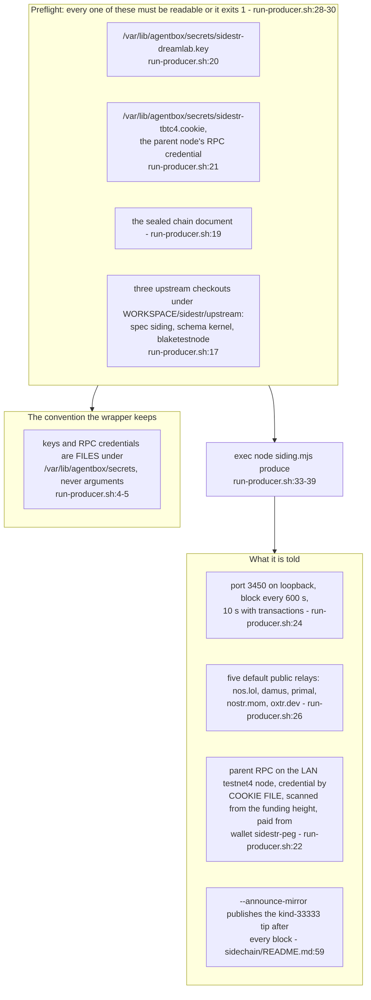
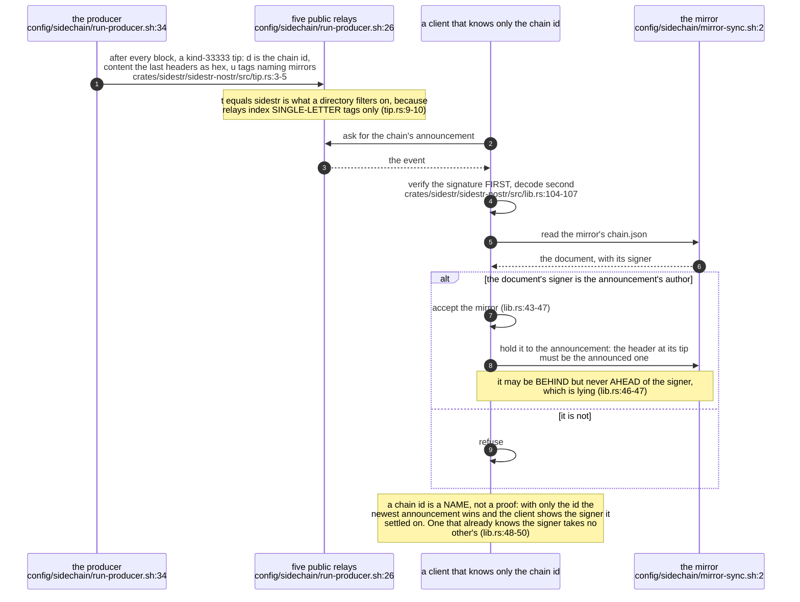
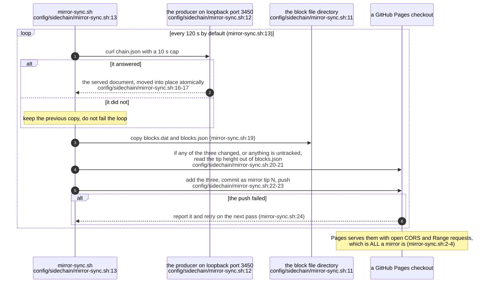
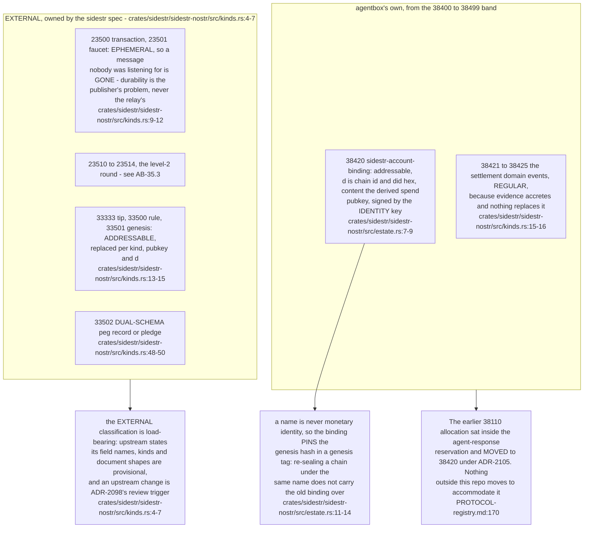
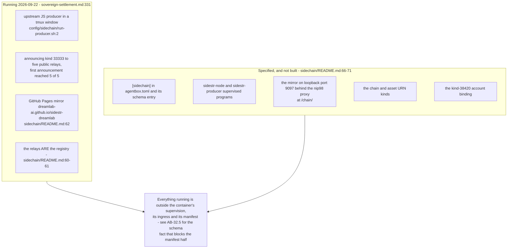

## For developers

The chain is live but nothing about it is supervised: `run-producer.sh` runs the upstream JS engine from durable checkouts in a tmux window until the specified `[program:sidestr-producer]` exists (`run-producer.sh:2-5`), and `mirror-sync.sh` pushes the block file into a GitHub Pages checkout because Pages already serves open CORS and Range requests, which is all a mirror is (`mirror-sync.sh:2-5`). There is no registry to register with: the relays are it, and any client asking for kind 33333 tagged `t=sidestr` lists every chain that has announced (`sidechain/README.md:59-62`).

## For the business

The settlement chain is reachable by anyone today, through public infrastructure the estate does not own or pay for, and it announces itself rather than being listed anywhere. The arrangement is explicitly temporary: it runs in a terminal window rather than as a managed service, so a container restart stops it, and the record says what must replace it.

## AB-34.1 The interim producer, and what it refuses to start without

**Debt:** this is a tmux program, not a supervised one — the record it implements specifies `[program:sidestr-node]` on loopback port 9097 and `[program:sidestr-producer]` behind `[sidechain.signer].enabled` (`../project/agentbox/docs/BASELINE-container.md:320-321`), and neither exists, so nothing restarts the chain after a container restart (`../project/agentbox/config/sidechain/run-producer.sh:2-3`).

**Invariant:** the producer never learns a secret from its command line — the key and the parent cookie are paths, checked for readability before `exec` and passed as `--key-file` and `--parent-cookie` (`../project/agentbox/config/sidechain/run-producer.sh:35`, `../project/agentbox/config/sidechain/run-producer.sh:38`).

## AB-34.2 The announcement and the mirror trust rule

**Invariant:** nothing from a relay is trusted before `Event::verify` — the signature is checked, and only then must the transaction itself validate (`../project/agentbox/crates/sidestr/sidestr-nostr/src/lib.rs:52-53`).

**Tension (upstream parseTip vs this chain):** upstream accepts only announcement content whose length divides by 328, so every stock-family chain is invisible to the directory, explorer and wallet — the live `sidestr:dreamlab` announcement among them, whose single header is 160 characters (`../project/agentbox/crates/sidestr/sidestr-nostr/src/tip.rs:22-25`); the estate's fix is filed as sidestr/spec PR #7 with three pin bumps to follow its merge (`../project/agentbox/docs/proposals/sovereign-settlement.md:331`).

## AB-34.3 The mirror loop, and why GitHub Pages is enough

**Debt:** the mirror is a public git repository rather than the specified loopback port 9097 behind the nip98 proxy at `/chain/`, and the script says so in its own header (`../project/agentbox/config/sidechain/mirror-sync.sh:4-5`, `../project/agentbox/docs/BASELINE-container.md:320`).

**Open:** the loop pushes whenever anything in the Pages checkout is untracked, not only when the three mirrored files changed, so an unrelated stray file triggers a commit (`../project/agentbox/config/sidechain/mirror-sync.sh:20`).

## AB-34.4 The kind plane as built, and the band it moved into

**Invariant:** the binding's `d` tag must name the event's own author, because the identity key is what signs it — `parse_account_binding` refuses any other pairing (`../project/agentbox/crates/sidestr/sidestr-nostr/src/estate.rs:10-11`).

**Drift (AB-31.7 and AB-31.8 vs the registry):** those diagrams record the account binding as kind `38110` allocated from the `38106`-`38201` range, which was true at their declared revision and is not true now — ADR-2105 moved it to `38420` (`../project/agentbox/docs/PROTOCOL-registry.md:170`).

## AB-34.5 Interim against specified

**Open:** none of the five specified pieces has a landing date, and PRD-024's P1 row lists them together with the first peg-in as outstanding (`../project/agentbox/docs/proposals/sovereign-settlement.md:331`).
