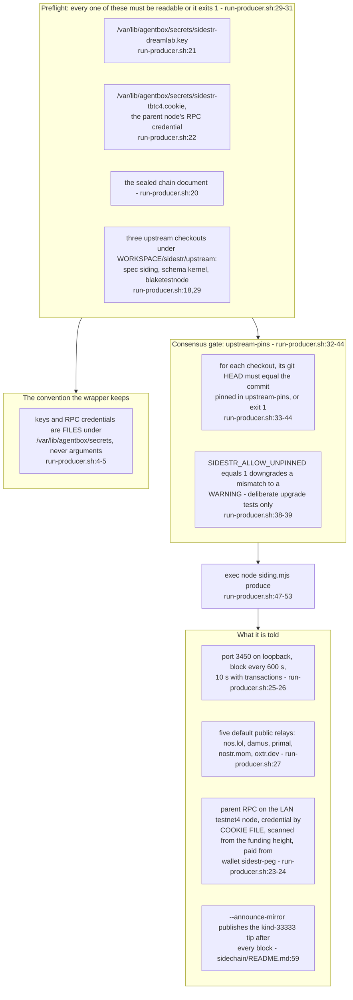
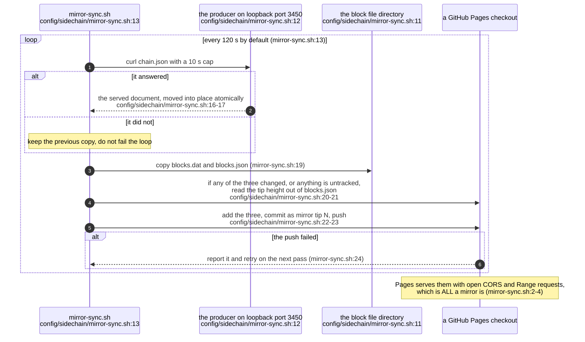
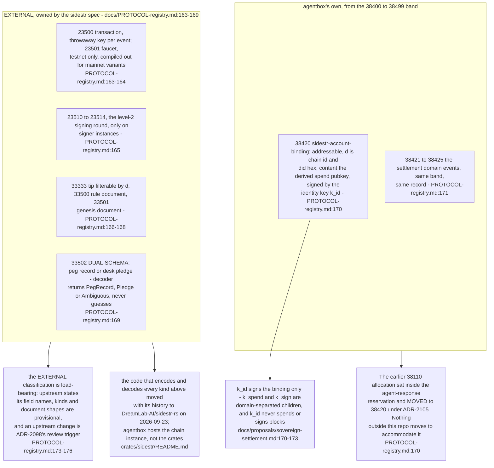
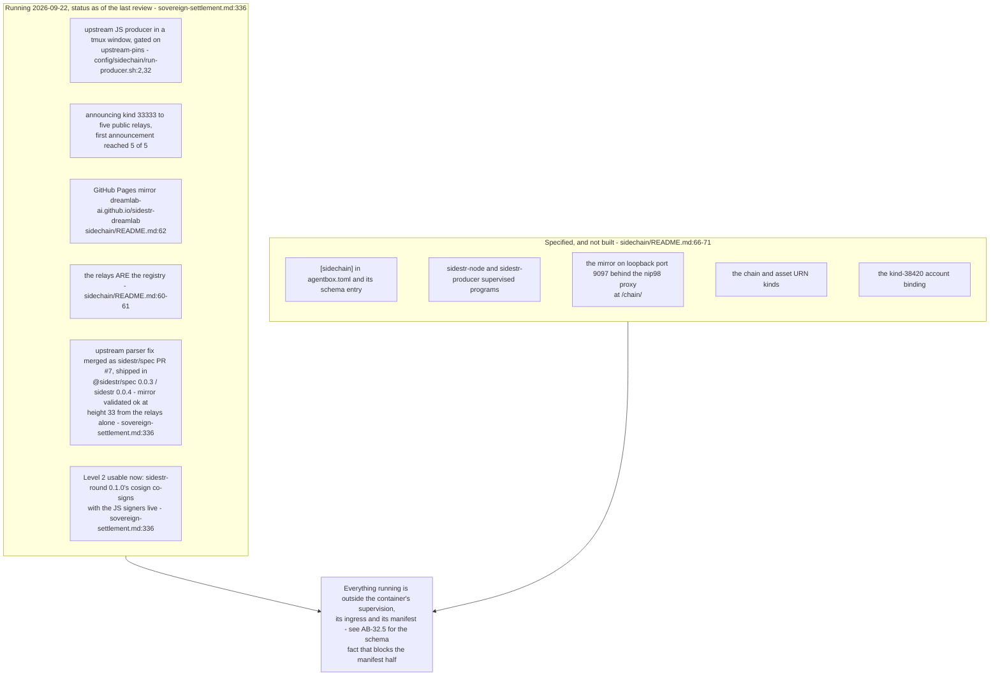

## For developers

The chain is live but nothing about it is supervised: `run-producer.sh` runs the upstream JS engine from durable checkouts, refuses to start unless every checkout matches a pinned commit (`upstream-pins`), and stays a tmux window until the specified `[program:sidestr-producer]` exists. `mirror-sync.sh` pushes the block file into a GitHub Pages checkout because Pages already serves open CORS and Range requests, which is all a mirror is (`mirror-sync.sh:2-5`). There is no registry to register with: the relays are it, and the five `sidestr-*` crates that read and verify this wire moved out of this repository entirely on 2026-09-23 (ADR-2112).

**Drift (this topic vs agentbox since ad45e7bf8):** the `sidestr-nostr` sources cited here were in agentbox's `crates/sidestr/` at `ec60a8f14`; ADR-2112 (2026-09-23) moved the crates to `DreamLab-AI/sidestr-rs`, and agentbox keeps only the chain instance in `config/sidechain/`. The producer and mirror described here are unaffected; the crates are SR-01.

## For the business

The settlement chain is reachable by anyone today, through public infrastructure the estate does not own or pay for, and it announces itself rather than being listed anywhere. It runs in a terminal window rather than as a managed service, so a container restart stops it. Since the last review, the upstream parser bug that hid this chain from the directory and wallet was fixed and shipped, and the software for multi-signer settlement (Level 2) became usable.

## AB-34.1 The interim producer, and what it refuses to start without

```mermaid
flowchart TB
    subgraph pre["Preflight: every one of these must be readable or it exits 1 - run-producer.sh:29-31"]
        P1["/var/lib/agentbox/secrets/sidestr-dreamlab.key<br/>run-producer.sh:21"]
        P2["/var/lib/agentbox/secrets/sidestr-tbtc4.cookie,<br/>the parent node's RPC credential<br/>run-producer.sh:22"]
        P3["the sealed chain document - run-producer.sh:20"]
        P4["three upstream checkouts under WORKSPACE/sidestr/upstream:<br/>spec siding, schema kernel, blaketestnode<br/>run-producer.sh:18,29"]
    end
    subgraph pins["Consensus gate: upstream-pins - run-producer.sh:32-44"]
        G1["for each checkout, its git HEAD must equal the commit<br/>pinned in upstream-pins, or exit 1<br/>run-producer.sh:33-44"]
        G2["SIDESTR_ALLOW_UNPINNED equals 1 downgrades a mismatch to a<br/>WARNING - deliberate upgrade tests only<br/>run-producer.sh:38-39"]
    end
    pre --> pins
    pins --> EXEC["exec node siding.mjs produce<br/>run-producer.sh:47-53"]
    subgraph args["What it is told"]
        A1["port 3450 on loopback, block every 600 s,<br/>10 s with transactions - run-producer.sh:25-26"]
        A2["five default public relays: nos.lol, damus, primal,<br/>nostr.mom, oxtr.dev - run-producer.sh:27"]
        A3["parent RPC on the LAN testnet4 node, credential by<br/>COOKIE FILE, scanned from the funding height, paid from<br/>wallet sidestr-peg - run-producer.sh:23-24"]
        A4["--announce-mirror publishes the kind-33333 tip after<br/>every block - sidechain/README.md:59"]
    end
    EXEC --> args
    subgraph rule["The convention the wrapper keeps"]
        R["keys and RPC credentials are FILES under<br/>/var/lib/agentbox/secrets, never arguments<br/>run-producer.sh:4-5"]
    end
    pre --> rule
```

**Debt:** this is a tmux program, not a supervised one — the record it implements specifies `[program:sidestr-node]` on loopback port 9097 and `[program:sidestr-producer]` behind `[sidechain.signer].enabled` (`../project/agentbox/docs/BASELINE-container.md:335-336`), and neither exists, so nothing restarts the chain after a container restart (`../project/agentbox/config/sidechain/run-producer.sh:2-3`).

**Invariant:** the producer never learns a secret from its command line — the key and the parent cookie are paths, checked for readability before `exec` and passed as `--key-file` and `--parent-cookie` (`../project/agentbox/config/sidechain/run-producer.sh:49`, `../project/agentbox/config/sidechain/run-producer.sh:51`).

**Invariant:** the upstream code this chain runs is a fact of this repository, not of the host — `upstream-pins` names one commit per checkout, bumped only after a restart and a block produced on it, and `SIDESTR_ALLOW_UNPINNED` is documented as an override for a deliberate upgrade test, never routine drift (`../project/agentbox/config/sidechain/upstream-pins:1-5`, `../project/agentbox/config/sidechain/README.md:64`).

## AB-34.2 The announcement and the mirror trust rule

```mermaid
sequenceDiagram
    autonumber
    participant PR as the producer<br/>config/sidechain/run-producer.sh:47
    participant RL as five public relays<br/>config/sidechain/run-producer.sh:27
    participant CL as a client that knows only the chain id
    participant MI as the mirror<br/>config/sidechain/mirror-sync.sh:2

    PR->>RL: after every block, a kind-33333 tip<br/>docs/PROTOCOL-registry.md:166, sidechain/README.md:59
    Note over RL: a client asking for kind 33333 tagged t equals sidestr<br/>lists every chain that has announced<br/>sidechain/README.md:60-61
    CL->>RL: ask for the chain's announcement
    RL-->>CL: the event
    CL->>CL: verify the signature first, decode second,<br/>then trust a mirror only when its own signer<br/>matches the announcement's author
    CL->>MI: read the mirror's chain.json
    MI-->>CL: the document, with its signer
    alt the document's signer is the announcement's author
        CL->>CL: accept the mirror
        CL->>MI: hold it to the announcement: the header at its tip<br/>must be the announced one
        Note over CL,MI: it may be BEHIND but never AHEAD of the signer,<br/>which is lying
    else it is not
        CL->>CL: refuse
    end
    Note over CL: EXTERNAL - this verification and mirror-trust logic<br/>is sidestr-nostr, moved with its history to<br/>DreamLab-AI/sidestr-rs on 2026-09-23<br/>crates/sidestr/README.md, docs/BASELINE-container.md:196
```

**Invariant:** kind 33333 is an addressable chain tip, filterable by `#d`, owned externally by the sidestr spec, not by this repository (`../project/agentbox/docs/PROTOCOL-registry.md:166`).

**EXTERNAL:** the signature-before-decode check and the mirror trust rule this diagram depicts are implemented in the `sidestr-nostr` crate, which this repository no longer hosts — it moved with its full history to [DreamLab-AI/sidestr-rs](https://github.com/DreamLab-AI/sidestr-rs) on 2026-09-23 and is consumed from crates.io (`../project/agentbox/crates/sidestr/README.md`, `../project/agentbox/docs/BASELINE-container.md:196`, ADR-2112). The pattern is still load-bearing for this repository's producer and mirror; its source can no longer be cited by `path:line` from here.

**Resolved:** the upstream parser that made stock-family chains such as `sidestr:dreamlab` invisible to the directory, explorer and wallet was fixed as sidestr/spec PR #7, merged 2026-09-22 and shipped in `@sidestr/spec` 0.0.3 / client `sidestr` 0.0.4; `upstream-pins` already carries the bumped commit (`../project/agentbox/docs/proposals/sovereign-settlement.md:336`, `../project/agentbox/config/sidechain/upstream-pins:6`).

## AB-34.3 The mirror loop, and why GitHub Pages is enough

```mermaid
sequenceDiagram
    autonumber
    participant M as mirror-sync.sh<br/>config/sidechain/mirror-sync.sh:13
    participant P as the producer on loopback port 3450<br/>config/sidechain/mirror-sync.sh:12
    participant S as the block file directory<br/>config/sidechain/mirror-sync.sh:11
    participant G as a GitHub Pages checkout

    loop every 120 s by default (mirror-sync.sh:13)
        M->>P: curl chain.json with a 10 s cap
        alt it answered
            P-->>M: the served document, moved into place atomically<br/>config/sidechain/mirror-sync.sh:16-17
        else it did not
            Note over M: keep the previous copy, do not fail the loop
        end
        M->>S: copy blocks.dat and blocks.json (mirror-sync.sh:19)
        M->>G: if any of the three changed, or anything is untracked,<br/>read the tip height out of blocks.json<br/>config/sidechain/mirror-sync.sh:20-21
        M->>G: add the three, commit as mirror tip N, push<br/>config/sidechain/mirror-sync.sh:22-23
        alt the push failed
            G-->>M: report it and retry on the next pass (mirror-sync.sh:24)
        end
    end
    Note over G: Pages serves them with open CORS and Range requests,<br/>which is ALL a mirror is (mirror-sync.sh:2-4)
```

**Debt:** the mirror is a public git repository rather than the specified loopback port 9097 behind the nip98 proxy at `/chain/`, and the script says so in its own header (`../project/agentbox/config/sidechain/mirror-sync.sh:4-5`, `../project/agentbox/docs/BASELINE-container.md:335`).

**Open:** the loop pushes whenever anything in the Pages checkout is untracked, not only when the three mirrored files changed, so an unrelated stray file triggers a commit (`../project/agentbox/config/sidechain/mirror-sync.sh:20`).

## AB-34.4 The kind plane as built, and the band it moved into

```mermaid
flowchart TB
    subgraph ext["EXTERNAL, owned by the sidestr spec - docs/PROTOCOL-registry.md:163-169"]
        E1["23500 transaction, throwaway key per event; 23501 faucet,<br/>testnet only, compiled out for mainnet variants<br/>PROTOCOL-registry.md:163-164"]
        E2["23510 to 23514, the level-2 signing round, only on<br/>signer instances - PROTOCOL-registry.md:165"]
        E3["33333 tip filterable by d, 33500 rule document, 33501<br/>genesis document - PROTOCOL-registry.md:166-168"]
        E4["33502 DUAL-SCHEMA: peg record or desk pledge - decoder<br/>returns PegRecord, Pledge or Ambiguous, never guesses<br/>PROTOCOL-registry.md:169"]
    end
    subgraph est["agentbox's own, from the 38400 to 38499 band"]
        B1["38420 sidestr-account-binding: addressable, d is chain id and<br/>did hex, content the derived spend pubkey, signed by the<br/>identity key k_id - PROTOCOL-registry.md:170"]
        B2["38421 to 38425 the settlement domain events, same band,<br/>same record - PROTOCOL-registry.md:171"]
    end
    MOVE["The earlier 38110 allocation sat inside the agent-response<br/>reservation and MOVED to 38420 under ADR-2105. Nothing<br/>outside this repo moves to accommodate it<br/>PROTOCOL-registry.md:170"]
    est --> MOVE
    B1 --> SEP["k_id signs the binding only - k_spend and k_sign are<br/>domain-separated children, and k_id never spends or<br/>signs blocks<br/>docs/proposals/sovereign-settlement.md:170-173"]
    ext --> PROV["the EXTERNAL classification is load-bearing: upstream states<br/>its field names, kinds and document shapes are provisional,<br/>and an upstream change is ADR-2098's review trigger<br/>PROTOCOL-registry.md:173-176"]
    ext --> RS["the code that encodes and decodes every kind above moved<br/>with its history to DreamLab-AI/sidestr-rs on 2026-09-23;<br/>agentbox hosts the chain instance, not the crates<br/>crates/sidestr/README.md"]
```

**Invariant:** the binding's `d` tag must name the event's own author, because the identity key is what signs it (`../project/agentbox/docs/PROTOCOL-registry.md:170`, `../project/agentbox/docs/proposals/sovereign-settlement.md:170-173`).

**Drift (AB-31.7 and AB-31.8 vs the registry):** those diagrams record the account binding as kind `38110` allocated from the `38106`-`38201` range, which was true at their declared revision and is not true now — ADR-2105 moved it to `38420` (`../project/agentbox/docs/PROTOCOL-registry.md:170`).

## AB-34.5 Interim against specified

```mermaid
flowchart TB
    subgraph now["Running 2026-09-22, status as of the last review - sovereign-settlement.md:336"]
        N1["upstream JS producer in a tmux window, gated on<br/>upstream-pins - config/sidechain/run-producer.sh:2,32"]
        N2["announcing kind 33333 to five public relays,<br/>first announcement reached 5 of 5"]
        N3["GitHub Pages mirror dreamlab-ai.github.io/sidestr-dreamlab<br/>sidechain/README.md:62"]
        N4["the relays ARE the registry - sidechain/README.md:60-61"]
        N5["upstream parser fix merged as sidestr/spec PR #7, shipped in<br/>@sidestr/spec 0.0.3 / sidestr 0.0.4 - mirror validated ok at<br/>height 33 from the relays alone - sovereign-settlement.md:336"]
        N6["Level 2 usable now: sidestr-round 0.1.0's cosign co-signs<br/>with the JS signers live - sovereign-settlement.md:336"]
    end
    subgraph spec["Specified, and not built - sidechain/README.md:66-71"]
        S1["[sidechain] in agentbox.toml and its schema entry"]
        S2["sidestr-node and sidestr-producer supervised programs"]
        S3["the mirror on loopback port 9097 behind the nip98 proxy<br/>at /chain/"]
        S4["the chain and asset URN kinds"]
        S5["the kind-38420 account binding"]
        S1 ~~~ S2 ~~~ S3 ~~~ S4 ~~~ S5
    end
    now --> GAP["Everything running is outside the container's supervision,<br/>its ingress and its manifest - see AB-32.5 for the schema<br/>fact that blocks the manifest half"]
    spec --> GAP
```

**Open:** none of the five specified pieces has a landing date, and PRD-024's P1 row lists them together with the first peg-in as outstanding (`../project/agentbox/docs/proposals/sovereign-settlement.md:336`).
