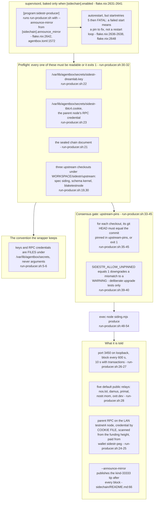
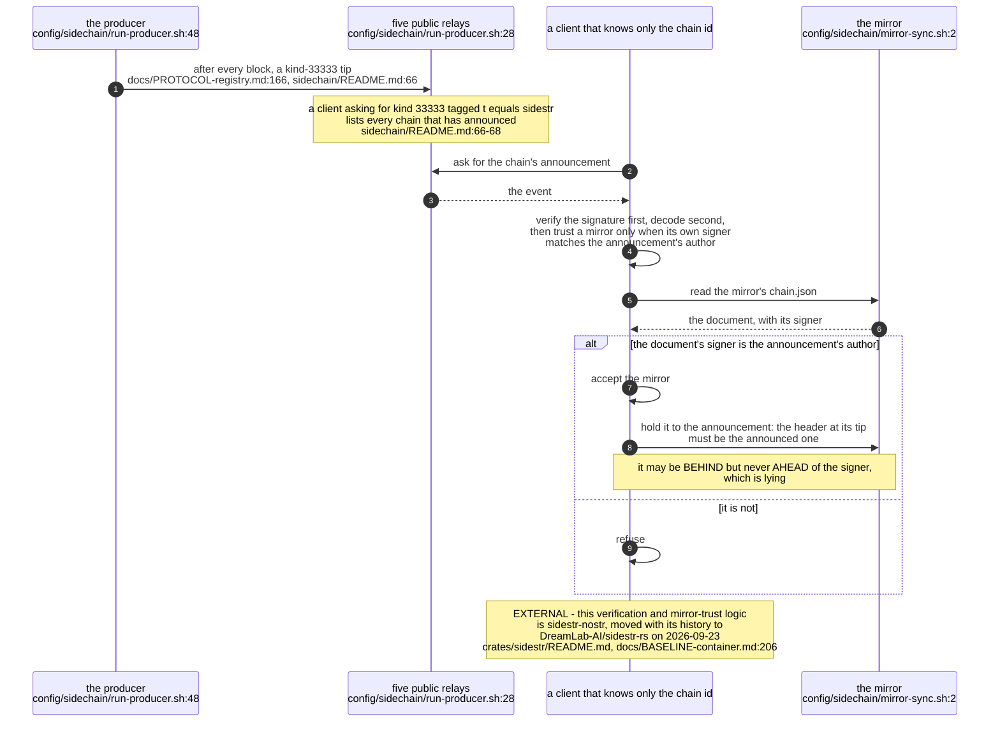
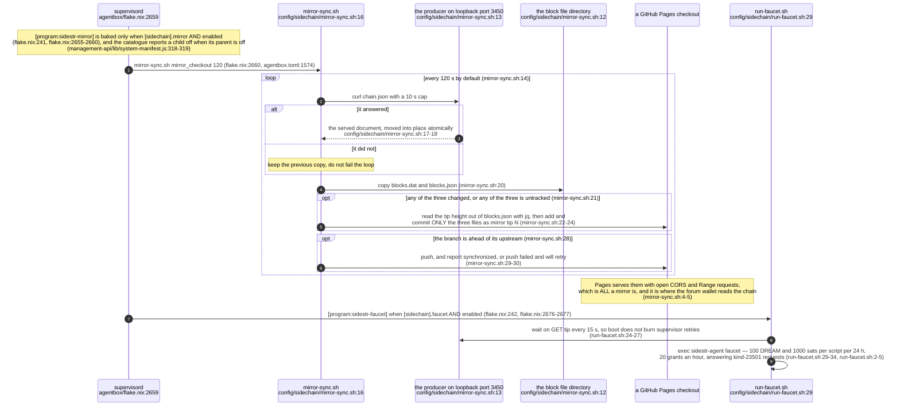
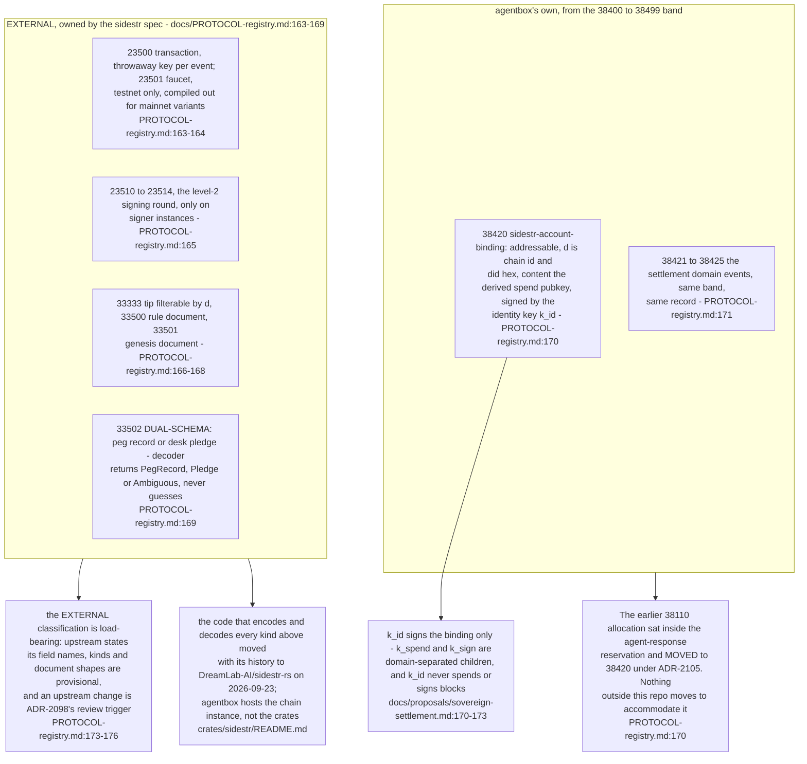
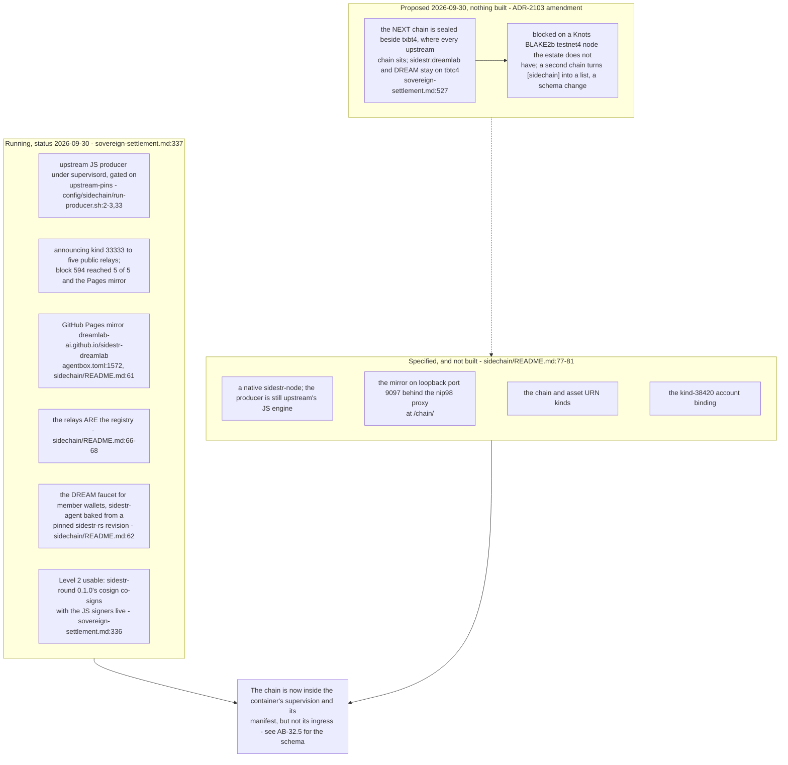

## For developers

Since `d0fa1b80b` (2026-09-30) the chain is supervised. `[sidechain]` in `agentbox.toml` bakes three supervisord programs, all REBUILD-class: `sidestr-producer` runs `run-producer.sh`, which still runs the upstream JS engine from durable checkouts and still refuses to start unless every checkout matches a pinned commit (`upstream-pins`); `sidestr-mirror` runs `mirror-sync.sh`, which pushes the block file into a GitHub Pages checkout because Pages already serves open CORS and Range requests, which is all a mirror is (`mirror-sync.sh:2-6`); and `sidestr-faucet` runs `run-faucet.sh`, which pays DREAM and testnet sats to the forum's member wallets through the baked `sidestr-agent`. The children apply only with the parent gate on, both in the Nix bake (`flake.nix:241-242`) and in the catalogue's state word (`system-manifest.js:318-319`). There is still no registry to register with: the relays are it, and the five `sidestr-*` crates that read and verify this wire moved out of this repository on 2026-09-23 (ADR-2112). What is still not built is the native half: a Rust `sidestr-node`, the loopback mirror on port 9097 behind the nip98 proxy, the `chain` and `asset` URN kinds and the kind-38420 binding (`config/sidechain/README.md:77-81`).

**Drift (this topic vs agentbox since ad45e7bf8):** the `sidestr-nostr` sources cited here were in agentbox's `crates/sidestr/` at `ec60a8f14`; ADR-2112 (2026-09-23) moved the crates to `DreamLab-AI/sidestr-rs`, and agentbox keeps only the chain instance in `config/sidechain/`. The producer and mirror described here are unaffected; the crates are SR-01.

## For the business

The settlement chain is reachable by anyone, through public infrastructure the estate does not own or pay for, and it announces itself rather than being listed anywhere. Until the end of September it ran in a terminal window, and a container restart on 25 September stopped it for four days with nothing to bring it back. It is now a managed service that restarts with the container, and a third service hands new forum members a small amount of the DREAM test token and test bitcoin so their wallets have something to use. It is still a test chain: nothing on it carries real value, and the parts that would let it hold real value are designed but not built.

## AB-34.1 The supervised producer, and what it refuses to start without

```mermaid
flowchart TB
    subgraph sup["supervisord, baked only when [sidechain].enabled - flake.nix:2631-2641"]
        SP["[program:sidestr-producer] runs run-producer.sh with --announce-mirror<br/>from [sidechain].announce_mirror - flake.nix:2642, agentbox.toml:1572"]
        SR["autorestart, but startretries 5 then FATAL: a failed start means<br/>a pin to fix, not a restart loop - flake.nix:2636-2638, flake.nix:2648"]
        SP --> SR
    end
    subgraph pre["Preflight: every one of these must be readable or it exits 1 - run-producer.sh:30-32"]
        P1["/var/lib/agentbox/secrets/sidestr-dreamlab.key<br/>run-producer.sh:22"]
        P2["/var/lib/agentbox/secrets/sidestr-tbtc4.cookie,<br/>the parent node's RPC credential<br/>run-producer.sh:23"]
        P3["the sealed chain document - run-producer.sh:21"]
        P4["three upstream checkouts under WORKSPACE/sidestr/upstream:<br/>spec siding, schema kernel, blaketestnode<br/>run-producer.sh:19,30"]
    end
    subgraph pins["Consensus gate: upstream-pins - run-producer.sh:33-45"]
        G1["for each checkout, its git HEAD must equal the commit<br/>pinned in upstream-pins, or exit 1<br/>run-producer.sh:35-45"]
        G2["SIDESTR_ALLOW_UNPINNED equals 1 downgrades a mismatch to a<br/>WARNING - deliberate upgrade tests only<br/>run-producer.sh:39-40"]
    end
    sup --> pre
    pre --> pins
    pins --> EXEC["exec node siding.mjs produce<br/>run-producer.sh:48-54"]
    subgraph args["What it is told"]
        A1["port 3450 on loopback, block every 600 s,<br/>10 s with transactions - run-producer.sh:26-27"]
        A2["five default public relays: nos.lol, damus, primal,<br/>nostr.mom, oxtr.dev - run-producer.sh:28"]
        A3["parent RPC on the LAN testnet4 node, credential by<br/>COOKIE FILE, scanned from the funding height, paid from<br/>wallet sidestr-peg - run-producer.sh:24-25"]
        A4["--announce-mirror publishes the kind-33333 tip after<br/>every block - sidechain/README.md:66"]
    end
    EXEC --> args
    subgraph rule["The convention the wrapper keeps"]
        R["keys and RPC credentials are FILES under<br/>/var/lib/agentbox/secrets, never arguments<br/>run-producer.sh:5-6"]
    end
    pre --> rule
```

**Tension (BASELINE proposed section vs flake.nix):** the proposed supervised set gates `sidestr-producer` on `[sidechain.signer].enabled` and gives `[sidechain].enabled` to a `sidestr-node` on loopback port 9097 (`../project/agentbox/docs/BASELINE-container.md:349-350`); as built, `[sidechain].enabled` gates the JS producer itself and there is no `sidestr-node` (`../project/agentbox/flake.nix:2631-2641`). ADR-2103's 2026-09-30 amendment approves the interim shape without amending that table (`../project/agentbox/docs/adr/ADR-2103-parent-chain-and-header-profile-are-configuration-behind-the-p21-gate.md:233-237`).

**Invariant:** the producer never learns a secret from its command line — the key and the parent cookie are paths, checked for readability before `exec` and passed as `--key-file` and `--parent-cookie` (`../project/agentbox/config/sidechain/run-producer.sh:50`, `../project/agentbox/config/sidechain/run-producer.sh:53`).

**Invariant:** the upstream code this chain runs is a fact of this repository, not of the host — `upstream-pins` names one commit per checkout, bumped only after a restart and a block produced on it, and `SIDESTR_ALLOW_UNPINNED` is documented as an override for a deliberate upgrade test, never routine drift (`../project/agentbox/config/sidechain/upstream-pins:1-5`, `../project/agentbox/config/sidechain/README.md:72-75`).

**Tension (upstream-pins rule vs its own bump):** the file's rule is to bump a line only after a block has been produced on that commit (`../project/agentbox/config/sidechain/upstream-pins:3`); the `blaketestnode` line was bumped on 2026-10-01 as an "operator-accepted active development head", a reason that is acceptance rather than a produced block (`../project/agentbox/config/sidechain/upstream-pins:8`, commit `47e187934`).

## AB-34.2 The announcement and the mirror trust rule

```mermaid
sequenceDiagram
    autonumber
    participant PR as the producer<br/>config/sidechain/run-producer.sh:48
    participant RL as five public relays<br/>config/sidechain/run-producer.sh:28
    participant CL as a client that knows only the chain id
    participant MI as the mirror<br/>config/sidechain/mirror-sync.sh:2

    PR->>RL: after every block, a kind-33333 tip<br/>docs/PROTOCOL-registry.md:166, sidechain/README.md:66
    Note over RL: a client asking for kind 33333 tagged t equals sidestr<br/>lists every chain that has announced<br/>sidechain/README.md:66-68
    CL->>RL: ask for the chain's announcement
    RL-->>CL: the event
    CL->>CL: verify the signature first, decode second,<br/>then trust a mirror only when its own signer<br/>matches the announcement's author
    CL->>MI: read the mirror's chain.json
    MI-->>CL: the document, with its signer
    alt the document's signer is the announcement's author
        CL->>CL: accept the mirror
        CL->>MI: hold it to the announcement: the header at its tip<br/>must be the announced one
        Note over CL,MI: it may be BEHIND but never AHEAD of the signer,<br/>which is lying
    else it is not
        CL->>CL: refuse
    end
    Note over CL: EXTERNAL - this verification and mirror-trust logic<br/>is sidestr-nostr, moved with its history to<br/>DreamLab-AI/sidestr-rs on 2026-09-23<br/>crates/sidestr/README.md, docs/BASELINE-container.md:206
```

**Invariant:** kind 33333 is an addressable chain tip, filterable by `#d`, owned externally by the sidestr spec, not by this repository (`../project/agentbox/docs/PROTOCOL-registry.md:166`).

**EXTERNAL:** the signature-before-decode check and the mirror trust rule this diagram depicts are implemented in the `sidestr-nostr` crate, which this repository no longer hosts — it moved with its full history to [DreamLab-AI/sidestr-rs](https://github.com/DreamLab-AI/sidestr-rs) on 2026-09-23 (`../project/agentbox/crates/sidestr/README.md`, `../project/agentbox/docs/BASELINE-container.md:206`, ADR-2112); the only sidestr-rs code the image now carries is the standalone `sidestr-agent` binary the faucet runs, baked from a pinned revision (AB-34.3). The pattern is still load-bearing for this repository's producer and mirror; its source can no longer be cited by `path:line` from here.

## AB-34.3 The mirror loop and the faucet, both children of the producer

```mermaid
sequenceDiagram
    autonumber
    participant SV as supervisord<br/>agentbox/flake.nix:2659
    participant M as mirror-sync.sh<br/>config/sidechain/mirror-sync.sh:16
    participant P as the producer on loopback port 3450<br/>config/sidechain/mirror-sync.sh:13
    participant S as the block file directory<br/>config/sidechain/mirror-sync.sh:12
    participant G as a GitHub Pages checkout
    participant F as run-faucet.sh<br/>config/sidechain/run-faucet.sh:29

    Note over SV: [program:sidestr-mirror] is baked only when [sidechain].mirror AND enabled<br/>(flake.nix:241, flake.nix:2655-2660), and the catalogue reports a child off when its parent is off<br/>(management-api/lib/system-manifest.js:318-319)
    SV->>M: mirror-sync.sh mirror_checkout 120 (flake.nix:2660, agentbox.toml:1574)
    loop every 120 s by default (mirror-sync.sh:14)
        M->>P: curl chain.json with a 10 s cap
        alt it answered
            P-->>M: the served document, moved into place atomically<br/>config/sidechain/mirror-sync.sh:17-18
        else it did not
            Note over M: keep the previous copy, do not fail the loop
        end
        M->>S: copy blocks.dat and blocks.json (mirror-sync.sh:20)
        opt any of the three changed, or any of the three is untracked (mirror-sync.sh:21)
            M->>G: read the tip height out of blocks.json with jq, then add and<br/>commit ONLY the three files as mirror tip N (mirror-sync.sh:22-24)
        end
        opt the branch is ahead of its upstream (mirror-sync.sh:28)
            M->>G: push, and report synchronized, or push failed and will retry<br/>(mirror-sync.sh:29-30)
        end
    end
    Note over G: Pages serves them with open CORS and Range requests,<br/>which is ALL a mirror is, and it is where the forum wallet reads the chain<br/>(mirror-sync.sh:4-5)
    SV->>F: [program:sidestr-faucet] when [sidechain].faucet AND enabled (flake.nix:242, flake.nix:2676-2677)
    F->>P: wait on GET tip every 15 s, so boot does not burn supervisor retries<br/>(run-faucet.sh:24-27)
    F->>F: exec sidestr-agent faucet — 100 DREAM and 1000 sats per script per 24 h,<br/>20 grants an hour, answering kind-23501 requests (run-faucet.sh:29-34, run-faucet.sh:2-5)
```

**Invariant:** a commit whose push failed is retried on the next pass even when the producer has made no new block, because the retry keys on the branch being ahead of its upstream, not on a changed file (`../project/agentbox/config/sidechain/mirror-sync.sh:26-31`).

**Debt:** the mirror is a public git repository rather than the specified loopback port 9097 behind the nip98 proxy at `/chain/`, and the script says so in its own header (`../project/agentbox/config/sidechain/mirror-sync.sh:5-6`, `../project/agentbox/docs/BASELINE-container.md:349`).

**Tension (secrets convention vs the faucet):** the producer's convention is that keys are files under `/var/lib/agentbox/secrets` (`../project/agentbox/config/sidechain/run-producer.sh:5-6`), but the faucet's treasury key defaults to, and the live manifest sets, a path in the workspace (`../project/agentbox/config/sidechain/run-faucet.sh:17`, `../project/agentbox/agentbox.toml:1576`). It is still passed as a file, never an argument value.

## AB-34.4 The kind plane as built, and the band it moved into

```mermaid
flowchart TB
    subgraph ext["EXTERNAL, owned by the sidestr spec - docs/PROTOCOL-registry.md:163-169"]
        E1["23500 transaction, throwaway key per event; 23501 faucet,<br/>testnet only, compiled out for mainnet variants<br/>PROTOCOL-registry.md:163-164"]
        E2["23510 to 23514, the level-2 signing round, only on<br/>signer instances - PROTOCOL-registry.md:165"]
        E3["33333 tip filterable by d, 33500 rule document, 33501<br/>genesis document - PROTOCOL-registry.md:166-168"]
        E4["33502 DUAL-SCHEMA: peg record or desk pledge - decoder<br/>returns PegRecord, Pledge or Ambiguous, never guesses<br/>PROTOCOL-registry.md:169"]
    end
    subgraph est["agentbox's own, from the 38400 to 38499 band"]
        B1["38420 sidestr-account-binding: addressable, d is chain id and<br/>did hex, content the derived spend pubkey, signed by the<br/>identity key k_id - PROTOCOL-registry.md:170"]
        B2["38421 to 38425 the settlement domain events, same band,<br/>same record - PROTOCOL-registry.md:171"]
    end
    MOVE["The earlier 38110 allocation sat inside the agent-response<br/>reservation and MOVED to 38420 under ADR-2105. Nothing<br/>outside this repo moves to accommodate it<br/>PROTOCOL-registry.md:170"]
    est --> MOVE
    B1 --> SEP["k_id signs the binding only - k_spend and k_sign are<br/>domain-separated children, and k_id never spends or<br/>signs blocks<br/>docs/proposals/sovereign-settlement.md:170-173"]
    ext --> PROV["the EXTERNAL classification is load-bearing: upstream states<br/>its field names, kinds and document shapes are provisional,<br/>and an upstream change is ADR-2098's review trigger<br/>PROTOCOL-registry.md:173-176"]
    ext --> RS["the code that encodes and decodes every kind above moved<br/>with its history to DreamLab-AI/sidestr-rs on 2026-09-23;<br/>agentbox hosts the chain instance, not the crates<br/>crates/sidestr/README.md"]
```

**Invariant:** the binding's `d` tag must name the event's own author, because the identity key is what signs it (`../project/agentbox/docs/PROTOCOL-registry.md:170`, `../project/agentbox/docs/proposals/sovereign-settlement.md:170-173`).

**Drift (AB-31.7 and AB-31.8 vs the registry):** those diagrams record the account binding as kind `38110` allocated from the `38106`-`38201` range, which was true at their declared revision and is not true now — ADR-2105 moved it to `38420` (`../project/agentbox/docs/PROTOCOL-registry.md:170`).

## AB-34.5 Supervised against specified

```mermaid
flowchart TB
    subgraph now["Running, status 2026-09-30 - sovereign-settlement.md:337"]
        N1["upstream JS producer under supervisord, gated on<br/>upstream-pins - config/sidechain/run-producer.sh:2-3,33"]
        N2["announcing kind 33333 to five public relays;<br/>block 594 reached 5 of 5 and the Pages mirror"]
        N3["GitHub Pages mirror dreamlab-ai.github.io/sidestr-dreamlab<br/>agentbox.toml:1572, sidechain/README.md:61"]
        N4["the relays ARE the registry - sidechain/README.md:66-68"]
        N5["the DREAM faucet for member wallets, sidestr-agent baked from a<br/>pinned sidestr-rs revision - sidechain/README.md:62"]
        N6["Level 2 usable: sidestr-round 0.1.0's cosign co-signs<br/>with the JS signers live - sovereign-settlement.md:336"]
    end
    subgraph spec["Specified, and not built - sidechain/README.md:77-81"]
        S2["a native sidestr-node; the producer is still upstream's JS engine"]
        S3["the mirror on loopback port 9097 behind the nip98 proxy<br/>at /chain/"]
        S4["the chain and asset URN kinds"]
        S5["the kind-38420 account binding"]
        S2 ~~~ S3 ~~~ S4 ~~~ S5
    end
    subgraph next["Proposed 2026-09-30, nothing built - ADR-2103 amendment"]
        X1["the NEXT chain is sealed beside txbt4, where every upstream<br/>chain sits; sidestr:dreamlab and DREAM stay on tbtc4<br/>sovereign-settlement.md:527"]
        X2["blocked on a Knots BLAKE2b testnet4 node the estate does not<br/>have; a second chain turns [sidechain] into a list, a schema change"]
        X1 --> X2
    end
    now --> GAP["The chain is now inside the container's supervision and its<br/>manifest, but not its ingress - see AB-32.5 for the schema"]
    spec --> GAP
    next -.-> spec
```

**Open:** none of the four pieces still specified has a landing date; PRD-024's 2026-09-30 status row lists them as "not yet" beside the supervised set (`../project/agentbox/docs/proposals/sovereign-settlement.md:337`); and the next chain's parent, PRD-024 open question 19, waits on the owner confirming a BLAKE2b testnet4 node, then the chain's name and purpose (`../project/agentbox/docs/proposals/sovereign-settlement.md:527-530`).
