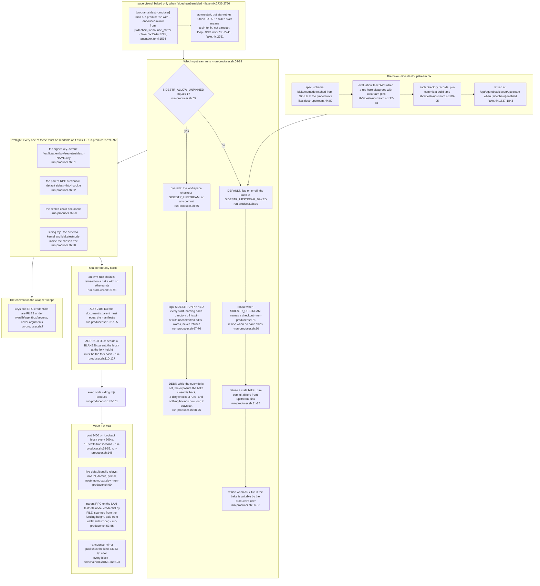
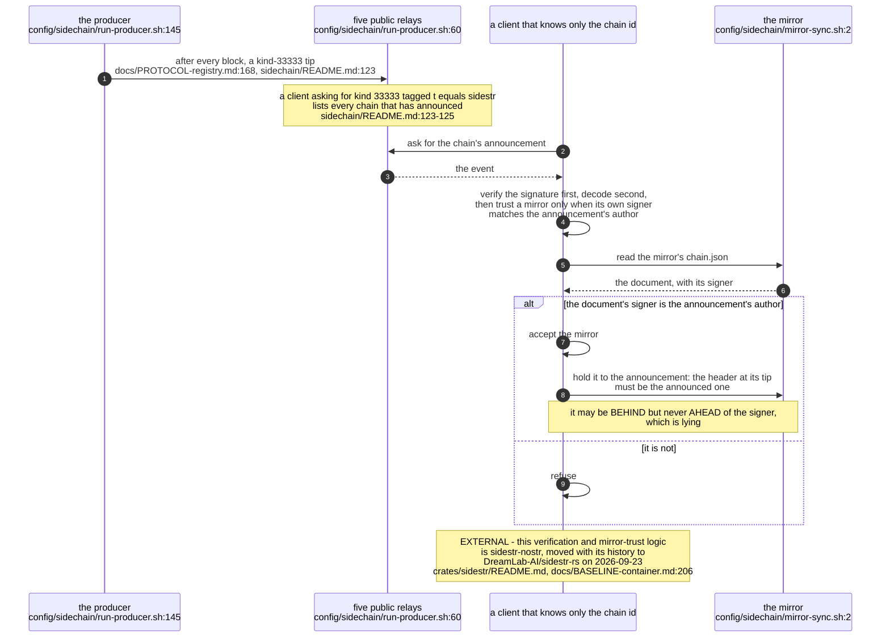
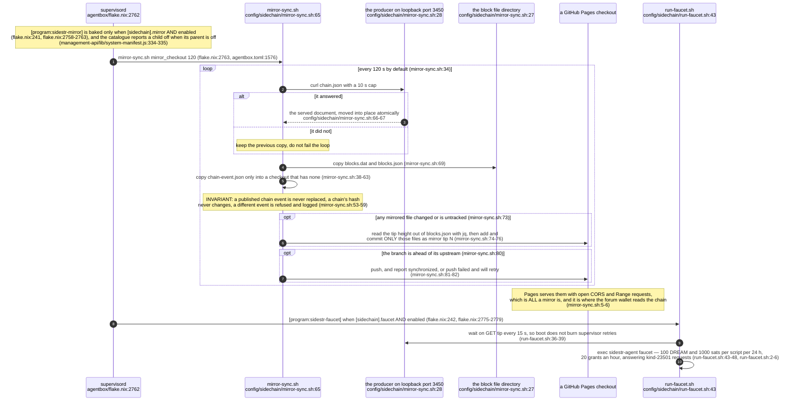
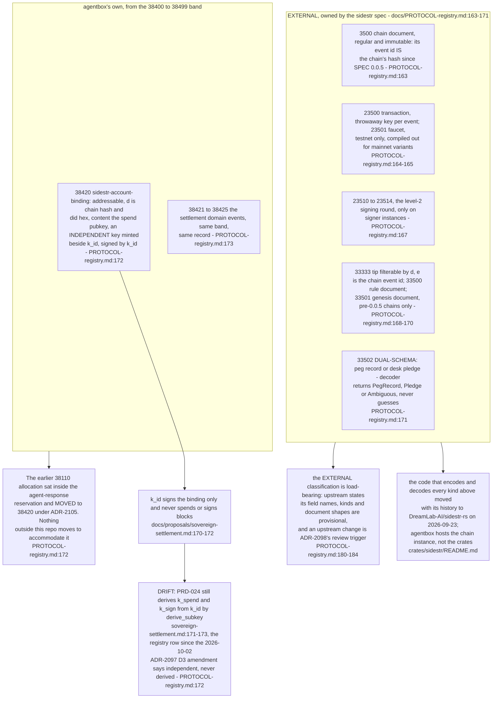
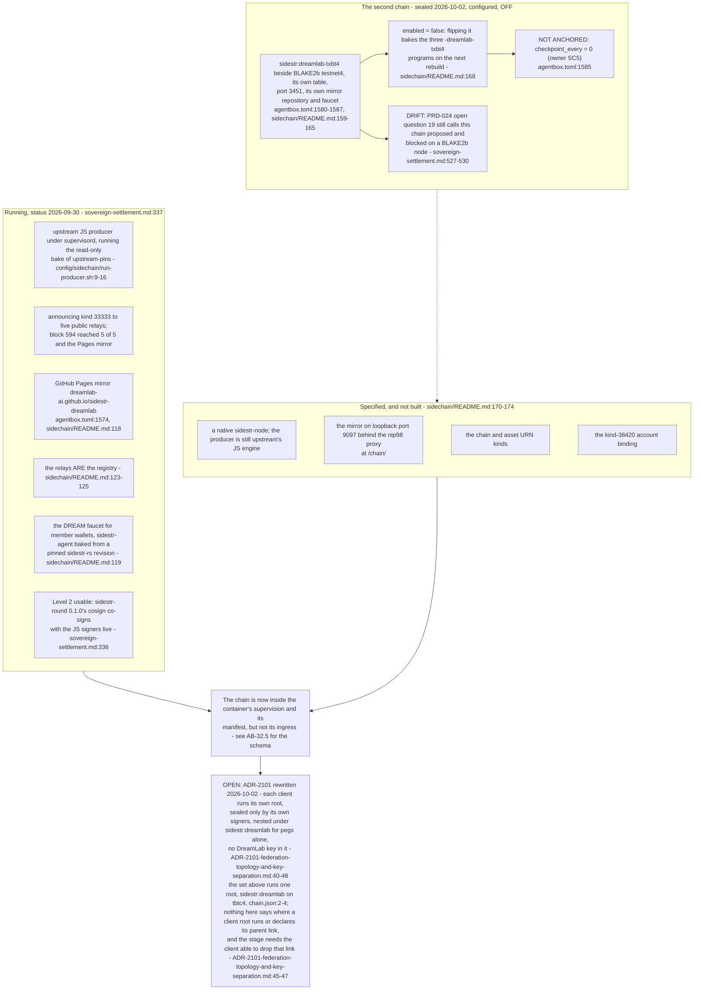
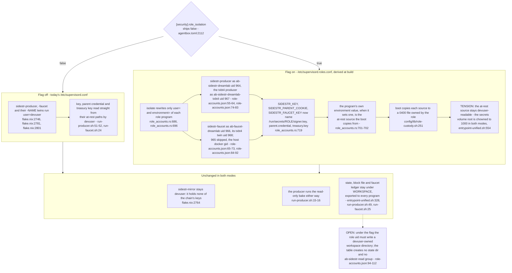

## For developers

Since `d0fa1b80b` (2026-09-30) the chain is supervised. `[sidechain]` in `agentbox.toml` bakes three supervisord programs, all REBUILD-class: `sidestr-producer` runs `run-producer.sh`, `sidestr-mirror` runs `mirror-sync.sh`, which pushes the block file into a GitHub Pages checkout because Pages already serves open CORS and Range requests, which is all a mirror is (`mirror-sync.sh:4-6`), and `sidestr-faucet` runs `run-faucet.sh`, which pays DREAM and testnet sats to the forum's member wallets through the baked `sidestr-agent`. Each further sealed chain is a `[sidechain.<name>]` table that bakes its own `-<name>` trio from the same runners (`config/sidechain/README.md:147-157`); the first, `sidestr:dreamlab-txbt4`, ships `enabled = false` (`agentbox.toml:1587`). The children apply only with the parent gate on, both in the Nix bake (`flake.nix:241-242`) and in the catalogue's state word (`system-manifest.js:331-335`). Custody X-1 step 1 (ADR-2122, 2026-10-03) changed two things here. The producer no longer runs the upstream JS engine out of workspace checkouts: by default it runs a read-only `/nix/store` bake of the commits in `upstream-pins` (`lib/sidestr-upstream.nix`), whatever `[security].role_isolation` says, and a workspace checkout runs only under `SIDESTR_ALLOW_UNPINNED=1` (AB-34.1). And with `[security].role_isolation = true` the producers and faucets become role programs under their own uids, reading their keys from root-delivered copies under `/run/secrets/<role>/` (AB-34.6; the mechanism is AB-36). The flag ships off. There is still no registry to register with: the relays are it, and the five `sidestr-*` crates that read and verify this wire moved out of this repository on 2026-09-23 (ADR-2112). What is still not built is the native half: a Rust `sidestr-node`, the loopback mirror on port 9097 behind the nip98 proxy, the `chain` and `asset` URN kinds and the kind-38420 binding (`config/sidechain/README.md:170-174`).

**Drift (this topic vs agentbox since ad45e7bf8):** the `sidestr-nostr` sources cited here were in agentbox's `crates/sidestr/` at `ec60a8f14`; ADR-2112 (2026-09-23) moved the crates to `DreamLab-AI/sidestr-rs`, and agentbox keeps only the chain instance in `config/sidechain/`. The producer and mirror described here are unaffected; the crates are SR-01.

## For the business

The settlement chain is reachable by anyone, through public infrastructure the estate does not own or pay for, and it announces itself rather than being listed anywhere. Until the end of September it ran in a terminal window, and a container restart on 25 September stopped it for four days with nothing to bring it back. It is now a managed service that restarts with the container, and a third service hands new forum members a small amount of the DREAM test token and test bitcoin so their wallets have something to use. Since 3 October the code that makes blocks is fixed into the container image itself, so nothing running inside the box, an agent included, can change the rules the chain is produced by. A second switch, not yet turned on, moves the chain's signing and treasury keys under accounts of their own. It is not complete: the stored copies of those keys are still readable from inside the box. It is still a test chain: nothing on it carries real value, and the parts that would let it hold real value are designed but not built.

## AB-34.1 The supervised producer, and what it refuses to start without

```mermaid
flowchart TB
    subgraph sup["supervisord, baked only when [sidechain].enabled - flake.nix:2733-2756"]
        SP["[program:sidestr-producer] runs run-producer.sh with --announce-mirror<br/>from [sidechain].announce_mirror - flake.nix:2744-2745, agentbox.toml:1574"]
        SR["autorestart, but startretries 5 then FATAL: a failed start means<br/>a pin to fix, not a restart loop - flake.nix:2738-2741, flake.nix:2751"]
        SP --> SR
    end
    subgraph bake["The bake - lib/sidestr-upstream.nix"]
        B1["spec, schema, blaketestnode fetched from GitHub at the pinned revs<br/>lib/sidestr-upstream.nix:80"]
        B2["evaluation THROWS when a rev here disagrees with upstream-pins<br/>lib/sidestr-upstream.nix:72-78"]
        B3["each directory records .pin-commit at build time<br/>lib/sidestr-upstream.nix:89-95"]
        B4["linked at /opt/agentbox/sidestr/upstream when [sidechain].enabled<br/>flake.nix:1837-1843"]
        B1 --> B2 --> B3 --> B4
    end
    subgraph pick["Which upstream runs - run-producer.sh:64-89"]
        D{"SIDESTR_ALLOW_UNPINNED equals 1?<br/>run-producer.sh:65"}
        BK["DEFAULT, flag on or off: the bake at SIDESTR_UPSTREAM_BAKED<br/>run-producer.sh:79"]
        BK1["refuse when SIDESTR_UPSTREAM names a checkout - run-producer.sh:78<br/>refuse when no bake ships - run-producer.sh:80"]
        BK2["refuse a stale bake: .pin-commit differs from upstream-pins<br/>run-producer.sh:81-85"]
        BK3["refuse when ANY file in the bake is writable by the producer's user<br/>run-producer.sh:86-88"]
        UN["override: the workspace checkout SIDESTR_UPSTREAM, at any commit<br/>run-producer.sh:66"]
        UN1["logs SIDESTR-UNPINNED every start, naming each directory off its pin<br/>or with uncommitted edits - warns, never refuses<br/>run-producer.sh:67-76"]
        UN2["DEBT: while the override is set, the exposure the bake closed is back,<br/>a dirty checkout runs, and nothing bounds how long it stays set<br/>run-producer.sh:68-76"]
        UN1 --> UN2
        D -->|no| BK --> BK1 --> BK2 --> BK3
        D -->|yes| UN --> UN1
    end
    subgraph pre["Preflight: every one of these must be readable or it exits 1 - run-producer.sh:90-92"]
        P1["the signer key, default /var/lib/agentbox/secrets/sidestr-NAME.key<br/>run-producer.sh:51"]
        P2["the parent RPC credential, default sidestr-tbtc4.cookie<br/>run-producer.sh:52"]
        P3["the sealed chain document - run-producer.sh:50"]
        P4["siding.mjs, the schema kernel and blaketestnode inside the chosen tree<br/>run-producer.sh:90"]
    end
    subgraph gates["Then, before any block"]
        G1["an evm-rule chain is refused on a bake with no ethereumjs<br/>run-producer.sh:96-98"]
        G2["ADR-2103 D3: the document's parent must equal the manifest's<br/>run-producer.sh:102-105"]
        G3["ADR-2103 D3a: beside a BLAKE2b parent, the block at the fork height<br/>must be the fork hash - run-producer.sh:110-127"]
    end
    sup --> pick
    bake --> BK
    pick --> pre --> gates
    gates --> EXEC["exec node siding.mjs produce<br/>run-producer.sh:145-151"]
    subgraph args["What it is told"]
        A1["port 3450 on loopback, block every 600 s,<br/>10 s with transactions - run-producer.sh:58-59, run-producer.sh:148"]
        A2["five default public relays: nos.lol, damus, primal,<br/>nostr.mom, oxtr.dev - run-producer.sh:60"]
        A3["parent RPC on the LAN testnet4 node, credential by<br/>FILE, scanned from the funding height, paid from<br/>wallet sidestr-peg - run-producer.sh:53-55"]
        A4["--announce-mirror publishes the kind-33333 tip after<br/>every block - sidechain/README.md:123"]
    end
    EXEC --> args
    subgraph rule["The convention the wrapper keeps"]
        R["keys and RPC credentials are FILES under<br/>/var/lib/agentbox/secrets, never arguments<br/>run-producer.sh:7"]
    end
    pre --> rule
```

**Tension (BASELINE proposed section vs flake.nix):** the proposed supervised set gates `sidestr-producer` on `[sidechain.signer].enabled` and gives `[sidechain].enabled` to a `sidestr-node` on loopback port 9097 (`../project/agentbox/docs/BASELINE-container.md:349-350`); as built, `[sidechain].enabled` gates the JS producer itself and there is no `sidestr-node` (`../project/agentbox/flake.nix:2733-2756`). ADR-2103's 2026-09-30 amendment approves the interim shape without amending that table (`../project/agentbox/docs/adr/ADR-2103-parent-chain-and-header-profile-are-configuration-behind-the-p21-gate.md:233-237`).

**Invariant:** the producer never learns a secret from its command line — the key and the parent credential are paths, checked for readability before `exec` and passed as `--key-file` and `--parent-cookie` (`../project/agentbox/config/sidechain/run-producer.sh:90-92`, `../project/agentbox/config/sidechain/run-producer.sh:147`, `../project/agentbox/config/sidechain/run-producer.sh:150`).

**Invariant:** the producer executes only consensus code its own user cannot modify, with `[security].role_isolation` on or off: the default tree is the read-only bake, a bake any file of which is writable by the running user is refused, and a workspace checkout runs only under the explicit `SIDESTR_ALLOW_UNPINNED=1` override (`../project/agentbox/config/sidechain/run-producer.sh:9-16`, `../project/agentbox/config/sidechain/run-producer.sh:78-88`). This resolves the earlier exposure that the producer ran devuser-writable checkouts whose pin check a dirty working tree passed. And the upstream code this chain runs is a fact of this repository, not of the host — `upstream-pins` names one commit per directory, `lib/sidestr-upstream.nix` bakes exactly those commits and Nix evaluation fails when the two disagree, and a stale bake is refused at start (`../project/agentbox/config/sidechain/upstream-pins:1-7`, `../project/agentbox/lib/sidestr-upstream.nix:72-78`, `../project/agentbox/config/sidechain/run-producer.sh:81-85`).

**Tension (upstream-pins rule vs its own bump):** the file's rule is to bump a line only after the chain has been restarted and a block produced on that commit (`../project/agentbox/config/sidechain/upstream-pins:5-7`); the `blaketestnode` line was bumped on 2026-10-01 as an "operator-accepted active development head", a reason that is acceptance rather than a produced block (`../project/agentbox/config/sidechain/upstream-pins:10`, commit `47e187934`). The bake now carries that same commit, so the acceptance is baked into the image as well (`../project/agentbox/lib/sidestr-upstream.nix:57-62`).

## AB-34.2 The announcement and the mirror trust rule

```mermaid
sequenceDiagram
    autonumber
    participant PR as the producer<br/>config/sidechain/run-producer.sh:145
    participant RL as five public relays<br/>config/sidechain/run-producer.sh:60
    participant CL as a client that knows only the chain id
    participant MI as the mirror<br/>config/sidechain/mirror-sync.sh:2

    PR->>RL: after every block, a kind-33333 tip<br/>docs/PROTOCOL-registry.md:168, sidechain/README.md:123
    Note over RL: a client asking for kind 33333 tagged t equals sidestr<br/>lists every chain that has announced<br/>sidechain/README.md:123-125
    CL->>RL: ask for the chain's announcement
    RL-->>CL: the event
    CL->>CL: verify the signature first, decode second,<br/>then trust a mirror only when its own signer<br/>matches the announcement's author
    CL->>MI: read the mirror's chain.json
    MI-->>CL: the document, with its signer
    alt the document's signer is the announcement's author
        CL->>CL: accept the mirror
        CL->>MI: hold it to the announcement: the header at its tip<br/>must be the announced one
        Note over CL,MI: it may be BEHIND but never AHEAD of the signer,<br/>which is lying
    else it is not
        CL->>CL: refuse
    end
    Note over CL: EXTERNAL - this verification and mirror-trust logic<br/>is sidestr-nostr, moved with its history to<br/>DreamLab-AI/sidestr-rs on 2026-09-23<br/>crates/sidestr/README.md, docs/BASELINE-container.md:206
```

**Invariant:** kind 33333 is an addressable chain tip, filterable by `#d`, owned externally by the sidestr spec, not by this repository; since SPEC 0.0.5 its `e` tag carries the chain event's id (`../project/agentbox/docs/PROTOCOL-registry.md:168`).

**EXTERNAL:** the signature-before-decode check and the mirror trust rule this diagram depicts are implemented in the `sidestr-nostr` crate, which this repository no longer hosts — it moved with its full history to [DreamLab-AI/sidestr-rs](https://github.com/DreamLab-AI/sidestr-rs) on 2026-09-23 (`../project/agentbox/crates/sidestr/README.md`, `../project/agentbox/docs/BASELINE-container.md:206`, ADR-2112); the only sidestr-rs code the image now carries is the standalone `sidestr-agent` binary the faucet runs, baked from a pinned revision (AB-34.3). The pattern is still load-bearing for this repository's producer and mirror; its source can no longer be cited by `path:line` from here.

## AB-34.3 The mirror loop and the faucet, both children of the producer

```mermaid
sequenceDiagram
    autonumber
    participant SV as supervisord<br/>agentbox/flake.nix:2762
    participant M as mirror-sync.sh<br/>config/sidechain/mirror-sync.sh:65
    participant P as the producer on loopback port 3450<br/>config/sidechain/mirror-sync.sh:28
    participant S as the block file directory<br/>config/sidechain/mirror-sync.sh:27
    participant G as a GitHub Pages checkout
    participant F as run-faucet.sh<br/>config/sidechain/run-faucet.sh:43

    Note over SV: [program:sidestr-mirror] is baked only when [sidechain].mirror AND enabled<br/>(flake.nix:241, flake.nix:2758-2763), and the catalogue reports a child off when its parent is off<br/>(management-api/lib/system-manifest.js:334-335)
    SV->>M: mirror-sync.sh mirror_checkout 120 (flake.nix:2763, agentbox.toml:1576)
    loop every 120 s by default (mirror-sync.sh:34)
        M->>P: curl chain.json with a 10 s cap
        alt it answered
            P-->>M: the served document, moved into place atomically<br/>config/sidechain/mirror-sync.sh:66-67
        else it did not
            Note over M: keep the previous copy, do not fail the loop
        end
        M->>S: copy blocks.dat and blocks.json (mirror-sync.sh:69)
        M->>M: copy chain-event.json only into a checkout that has none (mirror-sync.sh:38-63)
        Note over M: INVARIANT: a published chain event is never replaced, a chain's hash<br/>never changes, a different event is refused and logged (mirror-sync.sh:53-59)
        opt any mirrored file changed or is untracked (mirror-sync.sh:73)
            M->>G: read the tip height out of blocks.json with jq, then add and<br/>commit ONLY those files as mirror tip N (mirror-sync.sh:74-76)
        end
        opt the branch is ahead of its upstream (mirror-sync.sh:80)
            M->>G: push, and report synchronized, or push failed and will retry<br/>(mirror-sync.sh:81-82)
        end
    end
    Note over G: Pages serves them with open CORS and Range requests,<br/>which is ALL a mirror is, and it is where the forum wallet reads the chain<br/>(mirror-sync.sh:5-6)
    SV->>F: [program:sidestr-faucet] when [sidechain].faucet AND enabled (flake.nix:242, flake.nix:2775-2779)
    F->>P: wait on GET tip every 15 s, so boot does not burn supervisor retries<br/>(run-faucet.sh:36-39)
    F->>F: exec sidestr-agent faucet — 100 DREAM and 1000 sats per script per 24 h,<br/>20 grants an hour, answering kind-23501 requests (run-faucet.sh:43-48, run-faucet.sh:2-6)
```

**Invariant:** a commit whose push failed is retried on the next pass even when the producer has made no new block, because the retry keys on the branch being ahead of its upstream, not on a changed file (`../project/agentbox/config/sidechain/mirror-sync.sh:78-83`).

**Debt:** the mirror is a public git repository rather than the specified loopback port 9097 behind the nip98 proxy at `/chain/`, and the script says so in its own header (`../project/agentbox/config/sidechain/mirror-sync.sh:6-7`, `../project/agentbox/docs/BASELINE-container.md:349`).

**Tension (secrets convention vs the faucet), narrowed by role isolation:** the producer's convention is that keys are files under `/var/lib/agentbox/secrets` (`../project/agentbox/config/sidechain/run-producer.sh:7`), but the faucet's treasury key still defaults to, and the live manifest still sets, a path on the workspace bind (`../project/agentbox/config/sidechain/run-faucet.sh:24`, `../project/agentbox/agentbox.toml:1578`), and the role table names that same workspace path as the at-rest source (`../project/agentbox/config/role-accounts.json:71`). Under `[security].role_isolation` the faucet process reads a root-delivered 0400 copy instead (AB-34.6), but the delivery copies and never moves (`../project/agentbox/config/lib/role-custody.sh:251`), so the at-rest key stays readable by devuser and the host either way. The design's move to `agentbox-secrets` is not in the table at this revision.

## AB-34.4 The kind plane as built, and the band it moved into

```mermaid
flowchart TB
    subgraph ext["EXTERNAL, owned by the sidestr spec - docs/PROTOCOL-registry.md:163-171"]
        E0["3500 chain document, regular and immutable: its event id IS<br/>the chain's hash since SPEC 0.0.5 - PROTOCOL-registry.md:163"]
        E1["23500 transaction, throwaway key per event; 23501 faucet,<br/>testnet only, compiled out for mainnet variants<br/>PROTOCOL-registry.md:164-165"]
        E2["23510 to 23514, the level-2 signing round, only on<br/>signer instances - PROTOCOL-registry.md:167"]
        E3["33333 tip filterable by d, e is the chain event id; 33500 rule document;<br/>33501 genesis document, pre-0.0.5 chains only - PROTOCOL-registry.md:168-170"]
        E4["33502 DUAL-SCHEMA: peg record or desk pledge - decoder<br/>returns PegRecord, Pledge or Ambiguous, never guesses<br/>PROTOCOL-registry.md:171"]
    end
    subgraph est["agentbox's own, from the 38400 to 38499 band"]
        B1["38420 sidestr-account-binding: addressable, d is chain hash and<br/>did hex, content the spend pubkey, an INDEPENDENT key minted<br/>beside k_id, signed by k_id - PROTOCOL-registry.md:172"]
        B2["38421 to 38425 the settlement domain events, same band,<br/>same record - PROTOCOL-registry.md:173"]
    end
    MOVE["The earlier 38110 allocation sat inside the agent-response<br/>reservation and MOVED to 38420 under ADR-2105. Nothing<br/>outside this repo moves to accommodate it<br/>PROTOCOL-registry.md:172"]
    est --> MOVE
    B1 --> SEP["k_id signs the binding only and never spends or signs blocks<br/>docs/proposals/sovereign-settlement.md:170-172"]
    SEP --> DR["DRIFT: PRD-024 still derives k_spend and k_sign from k_id by derive_subkey<br/>sovereign-settlement.md:171-173, the registry row since the 2026-10-02<br/>ADR-2097 D3 amendment says independent, never derived - PROTOCOL-registry.md:172"]
    ext --> PROV["the EXTERNAL classification is load-bearing: upstream states<br/>its field names, kinds and document shapes are provisional,<br/>and an upstream change is ADR-2098's review trigger<br/>PROTOCOL-registry.md:180-184"]
    ext --> RS["the code that encodes and decodes every kind above moved<br/>with its history to DreamLab-AI/sidestr-rs on 2026-09-23;<br/>agentbox hosts the chain instance, not the crates<br/>crates/sidestr/README.md"]
```

**Invariant:** the binding's `d` tag must name the event's own author, because the identity key is what signs it (`../project/agentbox/docs/PROTOCOL-registry.md:172`, `../project/agentbox/docs/proposals/sovereign-settlement.md:170-173`).

**Drift (AB-31.7 and AB-31.8 vs the registry):** those diagrams record the account binding as kind `38110` allocated from the `38106`-`38201` range, which was true at their declared revision and is not true now — ADR-2105 moved it to `38420` (`../project/agentbox/docs/PROTOCOL-registry.md:172`).

## AB-34.5 Supervised against specified

```mermaid
flowchart TB
    subgraph now["Running, status 2026-09-30 - sovereign-settlement.md:337"]
        N1["upstream JS producer under supervisord, running the read-only<br/>bake of upstream-pins - config/sidechain/run-producer.sh:9-16"]
        N2["announcing kind 33333 to five public relays;<br/>block 594 reached 5 of 5 and the Pages mirror"]
        N3["GitHub Pages mirror dreamlab-ai.github.io/sidestr-dreamlab<br/>agentbox.toml:1574, sidechain/README.md:118"]
        N4["the relays ARE the registry - sidechain/README.md:123-125"]
        N5["the DREAM faucet for member wallets, sidestr-agent baked from a<br/>pinned sidestr-rs revision - sidechain/README.md:119"]
        N6["Level 2 usable: sidestr-round 0.1.0's cosign co-signs<br/>with the JS signers live - sovereign-settlement.md:336"]
    end
    subgraph spec["Specified, and not built - sidechain/README.md:170-174"]
        S2["a native sidestr-node; the producer is still upstream's JS engine"]
        S3["the mirror on loopback port 9097 behind the nip98 proxy<br/>at /chain/"]
        S4["the chain and asset URN kinds"]
        S5["the kind-38420 account binding"]
        S2 ~~~ S3 ~~~ S4 ~~~ S5
    end
    subgraph next["The second chain - sealed 2026-10-02, configured, OFF"]
        X1["sidestr:dreamlab-txbt4 beside BLAKE2b testnet4, its own table,<br/>port 3451, its own mirror repository and faucet<br/>agentbox.toml:1580-1587, sidechain/README.md:159-165"]
        X2["enabled = false: flipping it bakes the three -dreamlab-txbt4<br/>programs on the next rebuild - sidechain/README.md:168"]
        X3["NOT ANCHORED: checkpoint_every = 0 (owner SC5)<br/>agentbox.toml:1585"]
        X4["DRIFT: PRD-024 open question 19 still calls this chain proposed and<br/>blocked on a BLAKE2b node - sovereign-settlement.md:527-530"]
        X1 --> X2 --> X3
        X1 --> X4
    end
    now --> GAP["The chain is now inside the container's supervision and its<br/>manifest, but not its ingress - see AB-32.5 for the schema"]
    spec --> GAP
    next -.-> spec
    GAP --> FED["OPEN: ADR-2101 rewritten 2026-10-02 - each client runs its own root,<br/>sealed only by its own signers, nested under sidestr:dreamlab for pegs alone,<br/>no DreamLab key in it - ADR-2101-federation-topology-and-key-separation.md:40-48<br/>the set above runs one root, sidestr:dreamlab on tbtc4, chain.json:2-4;<br/>nothing here says where a client root runs or declares its parent link,<br/>and the stage needs the client able to drop that link - ADR-2101-federation-topology-and-key-separation.md:45-47"]
```

**Open:** none of the four pieces still specified has a landing date; PRD-024's 2026-09-30 status row lists them as "not yet" beside the supervised set (`../project/agentbox/docs/proposals/sovereign-settlement.md:337`).

## AB-34.6 Chain programs under role isolation — both modes

```mermaid
flowchart TB
    FLAG{"[security].role_isolation<br/>ships false - agentbox.toml:2112"}
    subgraph off["Flag off - today's /etc/supervisord.conf"]
        O1["sidestr-producer, -faucet and their -NAME twins run user=devuser<br/>flake.nix:2746, flake.nix:2781, flake.nix:2801"]
        O2["key, parent credential and treasury key read straight from<br/>their at-rest paths by devuser - run-producer.sh:51-52, run-faucet.sh:24"]
        O1 --> O2
    end
    subgraph on["Flag on - /etc/supervisord.roles.conf, derived at build"]
        R1["isolate rewrites only user= and environment= of each role program<br/>role_accounts.rs:686, role_accounts.rs:696"]
        R2["sidestr-producer as ab-sidestr-dreamlab uid 964, the txbt4 producer<br/>as ab-sidestr-dreamlab-txbt4 uid 967 - role-accounts.json:55-64, role-accounts.json:74-83"]
        R3["sidestr-faucet as ab-faucet-dreamlab uid 966, its txbt4 twin uid 968;<br/>965 skipped, the host docker gid - role-accounts.json:65-73, role-accounts.json:84-92"]
        R4["SIDESTR_KEY, SIDESTR_PARENT_COOKIE, SIDESTR_FAUCET_KEY now name<br/>/run/secrets/ROLE/signer.key, parent.credential, treasury.key<br/>role_accounts.rs:719"]
        R5["the program's own environment value, when it sets one, is the<br/>at-rest source the boot copies from - role_accounts.rs:701-702"]
        R6["boot copies each source to a 0400 file owned by the role<br/>config/lib/role-custody.sh:251"]
        R7["TENSION: the at-rest source stays devuser-readable - the secrets<br/>volume root is chowned to 1000 in both modes, entrypoint-unified.sh:554"]
        R6 --> R7
        R1 --> R2 --> R4
        R1 --> R3 --> R4
        R4 --> R5 --> R6
    end
    subgraph same["Unchanged in both modes"]
        U1["sidestr-mirror stays devuser: it holds none of the chain's keys<br/>flake.nix:2764"]
        U2["the producer runs the read-only bake either way<br/>run-producer.sh:15-16"]
        U3["state, block file and faucet ledger stay under WORKSPACE,<br/>exported to every program - entrypoint-unified.sh:328,<br/>run-producer.sh:49, run-faucet.sh:25"]
    end
    FLAG -->|false| off
    FLAG -->|true| on
    off --> same
    on --> same
    U3 -.-> Q["OPEN: under the flag the role uid must write a devuser-owned<br/>workspace directory; the table creates no state dir and no<br/>ab-sidestr-read group - role-accounts.json:94-112"]
```

**Tension (role isolation vs the at-rest copies):** under the flag the RUNTIME copies are role-only: each chain's key and credential is a 0400 file owned by its role under `/run/secrets/<role>/` (`../project/agentbox/config/role-accounts.json:55-92`, `../project/agentbox/config/lib/role-custody.sh:251`). The AT-REST copies are not. Boot still chowns the secrets volume root to devuser in both modes, with no flag guard (`../project/agentbox/config/entrypoint-unified.sh:526`, `../project/agentbox/config/entrypoint-unified.sh:554`). The treasury keys still sit on the workspace bind (`../project/agentbox/config/role-accounts.json:71`). ADR-2122 says so itself: until the W2 custody step, devuser can still read the at-rest copies in `/var/lib/agentbox/secrets` and the workspace treasury keys, so the flag gives no confidentiality on its own (`../project/agentbox/docs/adr/ADR-2122-role-service-accounts-run-secrets-and-the-identity-port.md:206-209`). "A chain's key is readable only by its producer" is therefore NOT true at this revision in either mode. With the flag off, which is how it ships (`../project/agentbox/agentbox.toml:2112`), every chain program runs as devuser anyway (`../project/agentbox/flake.nix:2746`, `../project/agentbox/flake.nix:2781`).

**Drift (ADR-2122 owed list vs the code):** ADR-2122 still lists the Nix-baked sidestr upstream under W4 as owed before the flag may be turned on (`../project/agentbox/docs/adr/ADR-2122-role-service-accounts-run-secrets-and-the-identity-port.md:227-229`). The bake has landed and is the runner's unconditional default (`../project/agentbox/config/sidechain/run-producer.sh:78-88`). The other half of that W4 item, moving state off the workspace and adding the `ab-sidestr-read` group, has not landed (next marker).

**Open:** under the flag the producers and faucets keep their state on the workspace bind: block files under `$WORKSPACE/sidestr/<name>` and the faucet's grant ledger beside the treasury key (`../project/agentbox/config/sidechain/run-producer.sh:49`, `../project/agentbox/config/sidechain/run-faucet.sh:25`), with `WORKSPACE` exported to every program (`../project/agentbox/config/entrypoint-unified.sh:328`). Those directories are devuser's. The design moved state to `/var/lib/agentbox/sidestr/<chain>` with an `ab-sidestr-read` group for the mirror, but the role table at this revision declares neither (`../project/agentbox/config/role-accounts.json:94-112`). Whether a role uid can write its own state is not settled by anything here; the rehearsal's check (d), a new block, is what would show it.
