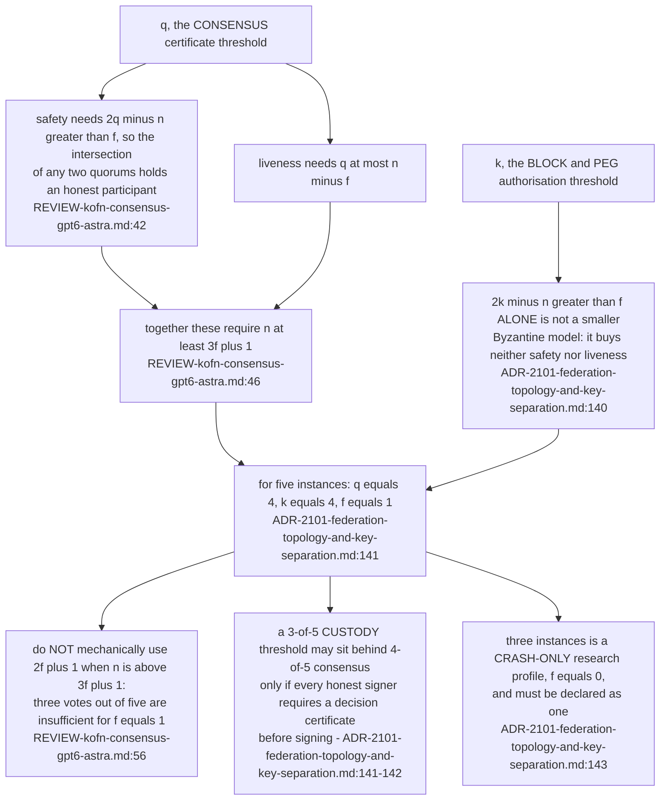
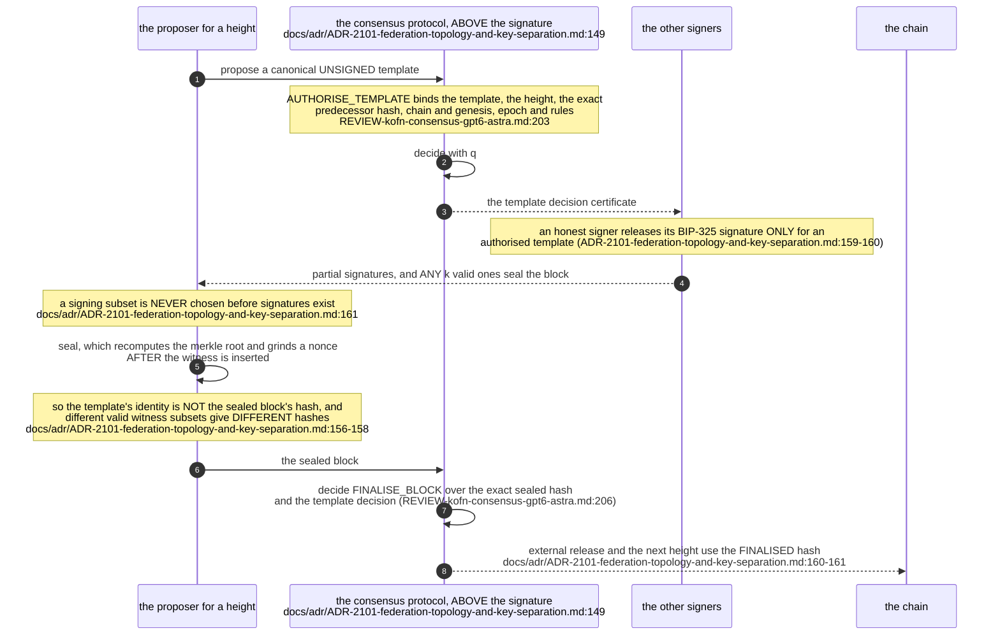
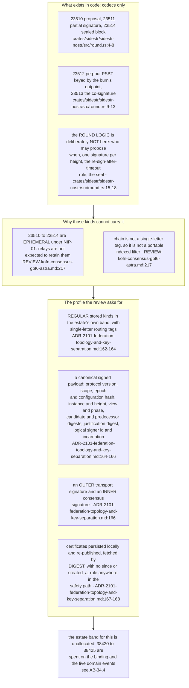
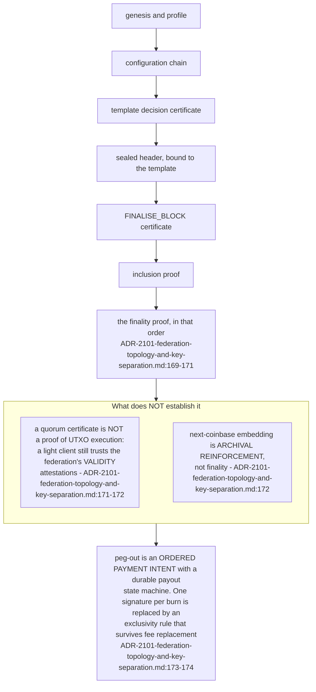
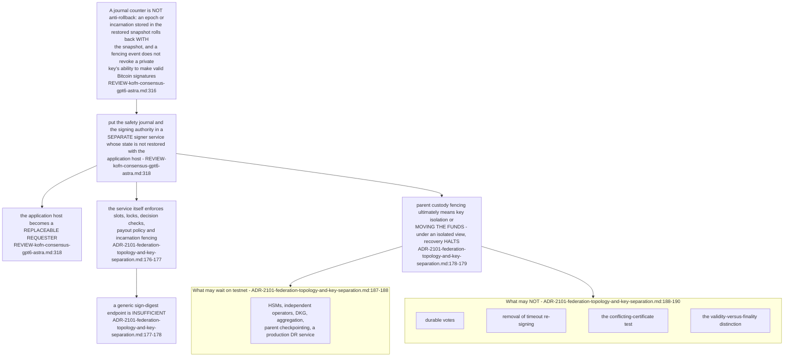

## For developers

Nothing here is built. A consultant review on 2026-09-22 (GPT-6 Astra through the Codex consultant tier, see AB-15.12 for that path) took ADR-2101's k-of-n federation apart and returned a different shape, which the record then adopted (`ADR-2101-federation-topology-and-key-separation.md:133-136`). The change that matters most: a threshold signature is not a consensus protocol, so `q` and `k` are two numbers, and the block a federation signs is not the block it finalises.

**Drift (this topic vs sidestr-rs):** "nothing here is built" held at `ec60a8f14`; since then `sidestr-round` (0.1.x, now 0.2.0) has shipped upstream's availability-tolerant round (not the reviewed BFT shape) and, with the other crates, moved to `DreamLab-AI/sidestr-rs` under ADR-2112. Not re-stamped here; see SR-01.6.

## For the business

The plan to have several machines jointly authorise payments was reviewed by an independent model and found to be under-specified in ways that could lose money rather than merely stall. The corrected design costs more to build, and the review separates what can wait until the chain carries real value from what cannot. Only the wire formats exist in code today.

## AB-35.1 Two thresholds, not one

**Invariant:** the safety inequality and the liveness inequality must both hold, which is what forces `n` at least `3f + 1`; assuming only the safety one produces a model with neither property (`../project/agentbox/docs/proposals/sovereign-settlement-research/REVIEW-kofn-consensus-gpt6-astra.md:46`).

**Open:** PRD-024 question 13 defers the fault model itself — how many Byzantine signers, and how independent the operators, credentials, release channels and parent nodes behind the `n` keys actually are (`../project/agentbox/docs/proposals/sovereign-settlement.md:494-496`).

## AB-35.2 Two decisions per block — authorise the template, then finalise the block

**Invariant:** because sealing changes the block's hash, one consensus decision cannot cover both the thing signed and the thing published — a design with a single decision per block is unsound however large its quorum (`../project/agentbox/docs/adr/ADR-2101-federation-topology-and-key-separation.md:156-158`).

**Tension (ADR-2101 amendment vs the review):** the earlier amendment's rule that a signer never signs two proposals at one height is over-stated — honest replicas may vote for different candidates in different views, and what is actually forbidden is a second value in one `(epoch, view, phase, instance)` slot, breaking a lock, or signing a conflicting decided block (`../project/agentbox/docs/adr/ADR-2101-federation-topology-and-key-separation.md:144-147`); `sidestr-nostr`'s codecs still carry the over-stated rule in their own prose (`../project/agentbox/crates/sidestr/sidestr-nostr/src/round.rs:20-22`).

## AB-35.3 The wire problem — five ephemeral kinds carrying a safety protocol

**Debt:** the five round kinds are ported and tested as wire formats while the protocol they were designed for has been rejected, so `sidestr-nostr` ships codecs for a shape the governing record no longer intends to run (`../project/agentbox/crates/sidestr/sidestr-nostr/src/round.rs:15-22`, `../project/agentbox/docs/adr/ADR-2101-federation-topology-and-key-separation.md:148`).

**Open:** the stored kinds the review requires have no allocation in the registry, whose sidestr section still records only the external `2xxxx`/`3xxxx` set and `38420`-`38425` (`../project/agentbox/docs/PROTOCOL-registry.md:163-171`).

## AB-35.4 What a finality proof is, and what a quorum certificate is not

**Invariant:** validity and finality are different claims, and conflating them is what makes a quorum certificate look like proof that the chain's rules were applied (`../project/agentbox/docs/adr/ADR-2101-federation-topology-and-key-separation.md:171-172`).

## AB-35.5 The signer service, outside the restore domain

**Invariant:** block-and-peg authorisation is ONE custody role, independent of identity and of bridge custody, because the same-descriptor convention makes the block challenge and the peg output necessarily share keys (`../project/agentbox/docs/adr/ADR-2101-federation-topology-and-key-separation.md:180-182`); AB-31.7 draws the identity, spend and sign separation this sits beside.

**Open:** ADR-2101 remains `proposed` with its ratification evidence unrun — three signer keys on three hosts sealing a block with the proposer down, and a known-answer test that `k_spend` and `k_sign` differ from `k_id` and from each other (`../project/agentbox/docs/adr/ADR-2101-federation-topology-and-key-separation.md:205-209`).
