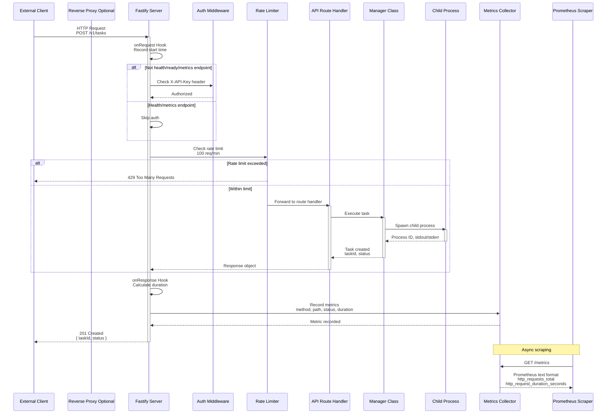
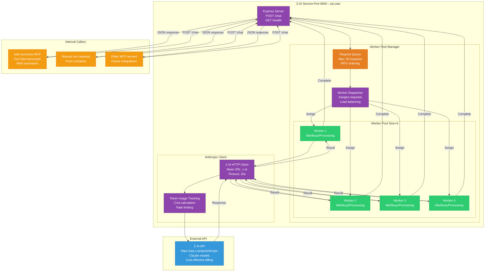
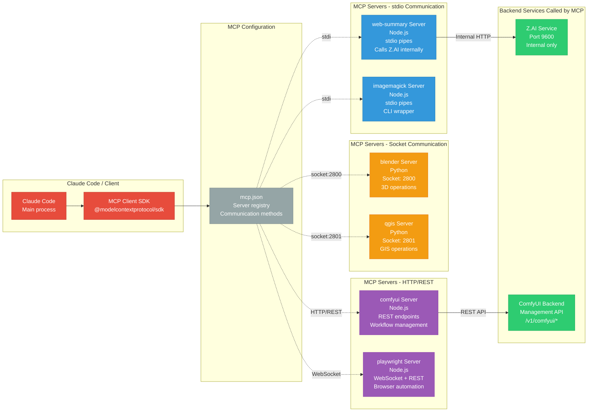
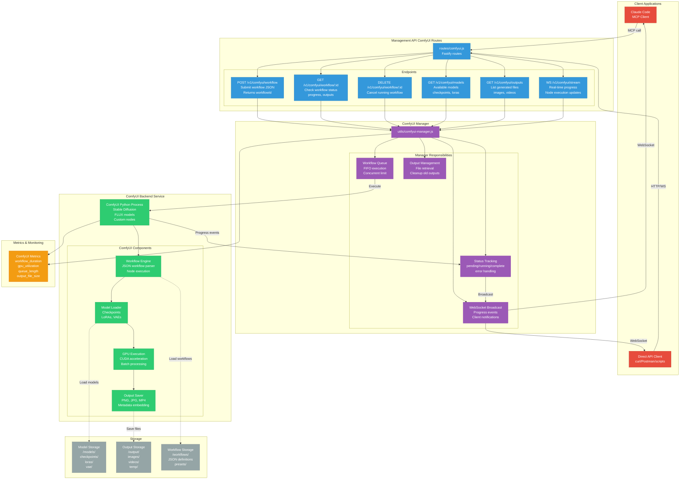
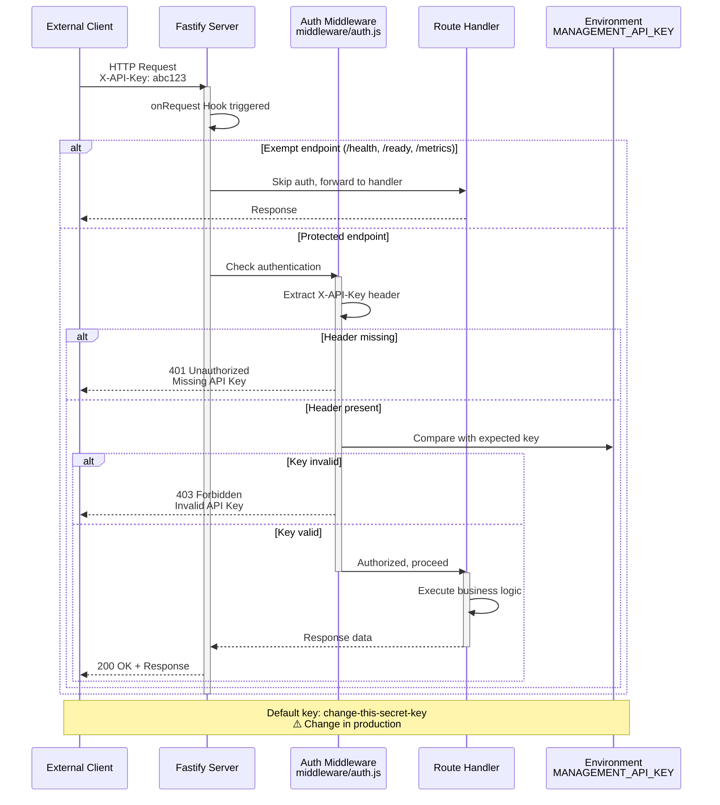
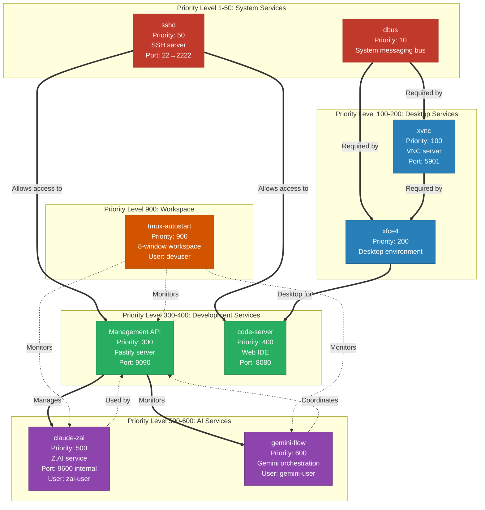
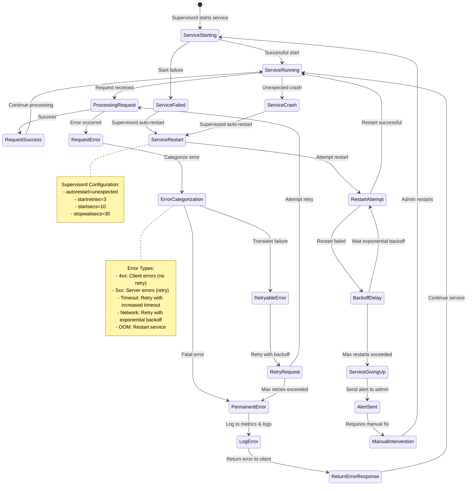

# Multi-Agent Docker - Complete Backend API Architecture

**Architecture Type**: Backend Services (No React Frontend)

**Key Finding**: This project does NOT contain a React client application. The architecture consists of:
- Backend APIs (Fastify/Express)
- MCP Servers (Model Context Protocol)
- Static HTML Visualizations (Wardley Maps, Algorithmic Art)
- Service Management Infrastructure

---

## Complete System Architecture

```mermaid
graph TB
    subgraph "External Access Points"
        SSH[SSH Port 2222]
        VNC[VNC Port 5901]
        CodeServer[code-server Port 8080]
        ManagementPort[Management API Port 9090]
        ZaiInternal[Z.AI Port 9600 Internal Only]
    end

    subgraph "Supervisord Service Manager"
        DBUS[dbus Service<br/>Priority: 10<br/>User: root]
        SSHD[sshd Service<br/>Priority: 50<br/>User: root]
        XVNC[xvnc Service<br/>Priority: 100<br/>User: devuser]
        XFCE4[xfce4 Service<br/>Priority: 200<br/>User: devuser]
        ManagementAPI[Management API Service<br/>Priority: 300<br/>User: devuser<br/>Port: 9090]
        CodeSrv[code-server Service<br/>Priority: 400<br/>User: devuser<br/>Port: 8080]
        ClaudeZai[claude-zai Service<br/>Priority: 500<br/>User: zai-user<br/>Port: 9600]
        GeminiFlow[gemini-flow Service<br/>Priority: 600<br/>User: gemini-user]
        TmuxAuto[tmux-autostart Service<br/>Priority: 900<br/>User: devuser]
    end

    subgraph "Multi-User Isolation System"
        DevUser[devuser UID:1000<br/>Primary Development<br/>Claude Code Access<br/>Full sudo privileges]
        GeminiUser[gemini-user UID:1001<br/>Google Gemini Tools<br/>Isolated credentials<br/>Switch: as-gemini]
        OpenAIUser[openai-user UID:1002<br/>OpenAI Tools<br/>Isolated credentials<br/>Switch: as-openai]
        ZaiUser[zai-user UID:1003<br/>Z.AI Service Only<br/>Cost-effective API<br/>Switch: as-zai]
    end

    subgraph "Management API Fastify Application"
        FastifyCore[Fastify Core<br/>server.js<br/>Port: 9090<br/>Host: 0.0.0.0]

        subgraph "Middleware Stack"
            CORS[CORS Middleware<br/>@fastify/cors<br/>Origin: true<br/>Credentials: true]
            WS[WebSocket Support<br/>@fastify/websocket]
            RateLimit[Rate Limiting<br/>100 req/min<br/>Whitelist: 127.0.0.1]
            Auth[Auth Middleware<br/>X-API-Key Header<br/>Exempt: health, metrics]
            Metrics[Metrics Tracking<br/>onRequest/onResponse<br/>Prometheus format]
        end

        subgraph "API Routes"
            TaskRoutes[Task Routes<br/>routes/tasks.js<br/>POST /v1/tasks<br/>GET /v1/tasks/:id<br/>GET /v1/tasks<br/>DELETE /v1/tasks/:id]
            StatusRoutes[Status Routes<br/>routes/status.js<br/>GET /v1/status<br/>GET /health<br/>GET /ready]
            ComfyUIRoutes[ComfyUI Routes<br/>routes/comfyui.js<br/>POST /v1/comfyui/workflow<br/>GET /v1/comfyui/workflow/:id<br/>DELETE /v1/comfyui/workflow/:id<br/>GET /v1/comfyui/models<br/>GET /v1/comfyui/outputs<br/>WS /v1/comfyui/stream]
            MetricsRoute[Metrics Endpoint<br/>GET /metrics<br/>Prometheus format<br/>No auth required]
            RootRoute[Root Endpoint<br/>GET /<br/>API information<br/>Endpoint listing]
        end

        subgraph "Manager Classes"
            ProcessMgr[ProcessManager<br/>utils/process-manager.js<br/>Task execution<br/>Process lifecycle<br/>Cleanup old tasks]
            SystemMon[SystemMonitor<br/>utils/system-monitor.js<br/>CPU/Memory monitoring<br/>Service status<br/>Health checks]
            ComfyUIMgr[ComfyUIManager<br/>utils/comfyui-manager.js<br/>Workflow submission<br/>Model management<br/>Output retrieval<br/>WebSocket streaming]
            MetricsUtil[Metrics Utility<br/>utils/metrics.js<br/>prom-client<br/>HTTP metrics<br/>Error tracking<br/>Custom counters/gauges]
        end

        subgraph "OpenAPI Documentation"
            Swagger[Swagger/OpenAPI<br/>@fastify/swagger<br/>Version: 3.0.0]
            SwaggerUI[Swagger UI<br/>@fastify/swagger-ui<br/>Route: /docs<br/>Interactive API docs]
        end
    end

    subgraph "Z.AI Service Express Application"
        ExpressCore[Express Core<br/>server.js<br/>Port: 9600<br/>User: zai-user<br/>Internal Only]

        subgraph "Z.AI Worker Pool"
            WorkerPool[Claude Worker Pool<br/>Size: 4 concurrent<br/>Max Queue: 50<br/>Configurable via env]
            AnthropicAPI[Anthropic API Client<br/>Base URL: z.ai<br/>Timeout: 30s<br/>Cost-effective calls]
        end

        subgraph "Z.AI Endpoints"
            ChatEndpoint[POST /chat<br/>Body: prompt, timeout<br/>Worker pool distribution]
            HealthEndpoint[GET /health<br/>Worker status<br/>Queue length<br/>Uptime metrics]
        end
    end

    subgraph "MCP Infrastructure"
        MCPConfig[MCP Configuration<br/>mcp-infrastructure/mcp.json<br/>Server definitions<br/>Tool registrations]

        subgraph "MCP Servers"
            WebSummary[web-summary MCP<br/>skills/web-summary/mcp-server<br/>YouTube transcripts<br/>Web summarization<br/>Uses Z.AI internally]
            ComfyUIMCP[comfyui MCP<br/>skills/comfyui/mcp-server<br/>Image generation<br/>Workflow management<br/>Node.js based]
            PlaywrightMCP[playwright MCP<br/>skills/playwright/mcp-server<br/>Browser automation<br/>Web scraping<br/>E2E testing]
            ImageMagickMCP[imagemagick MCP<br/>skills/imagemagick/mcp-server<br/>Image processing<br/>Format conversion]
            QGISMCP[qgis MCP<br/>skills/qgis/mcp-server<br/>GIS operations<br/>Geospatial analysis]
        end
    end

    subgraph "Static HTML Visualizations"
        WardleyMap[Wardley Map Viewer<br/>skills/wardley-maps/<br/>examples/visionflow_wardley_map.html<br/>SVG visualization<br/>Interactive components<br/>Export: SVG/PNG]
        AlgoArt[Algorithmic Art Viewer<br/>skills/algorithmic-art/<br/>templates/viewer.html<br/>Canvas rendering<br/>WebGL support]
    end

    subgraph "Configuration Files"
        EnvFile[.env File<br/>ANTHROPIC_API_KEY<br/>GOOGLE_GEMINI_API_KEY<br/>OPENAI_API_KEY<br/>ANTHROPIC_BASE_URL=z.ai<br/>GITHUB_TOKEN<br/>MANAGEMENT_API_KEY]
        SupervisordConf[supervisord.unified.conf<br/>Service definitions<br/>Priority ordering<br/>User assignments<br/>Log locations]
        RouterConfig[router.config.json<br/>Routing rules<br/>Service discovery]
        GeminiConfig[gemini-flow.config.ts<br/>Gemini orchestration<br/>A2A/MCP protocols]
    end

    subgraph "Tmux Workspace 8 Windows"
        Window0[Window 0: Claude-Main<br/>Primary workspace]
        Window1[Window 1: Claude-Agent<br/>Agent execution]
        Window2[Window 2: Services<br/>supervisorctl monitoring]
        Window3[Window 3: Development<br/>Python/Rust/CUDA dev]
        Window4[Window 4: Logs<br/>Service logs split panes]
        Window5[Window 5: System<br/>htop monitoring]
        Window6[Window 6: VNC-Status<br/>VNC connection info]
        Window7[Window 7: SSH-Shell<br/>General shell]
    end

    subgraph "Data Flow Patterns"
        ClientReq[External API Request<br/>HTTP/WebSocket]
        InternalCall[Internal Service Call<br/>Z.AI, MCP servers]
        ProcessExec[Process Execution<br/>Task spawning<br/>Shell commands]
        MetricsExport[Metrics Export<br/>Prometheus scraping]
    end

    %% External connections
    SSH --> SSHD
    VNC --> XVNC
    CodeServer --> CodeSrv
    ManagementPort --> ManagementAPI

    %% Supervisord manages all services
    SSHD -.-> DevUser
    XVNC -.-> DevUser
    CodeSrv -.-> DevUser
    ManagementAPI -.-> DevUser
    ClaudeZai -.-> ZaiUser
    GeminiFlow -.-> GeminiUser
    TmuxAuto -.-> DevUser

    %% Management API internal structure
    ManagementAPI --> FastifyCore
    FastifyCore --> CORS
    FastifyCore --> WS
    FastifyCore --> RateLimit
    FastifyCore --> Auth
    FastifyCore --> Metrics

    FastifyCore --> TaskRoutes
    FastifyCore --> StatusRoutes
    FastifyCore --> ComfyUIRoutes
    FastifyCore --> MetricsRoute
    FastifyCore --> RootRoute

    TaskRoutes --> ProcessMgr
    StatusRoutes --> SystemMon
    StatusRoutes --> ProcessMgr
    ComfyUIRoutes --> ComfyUIMgr

    ProcessMgr --> MetricsUtil
    SystemMon --> MetricsUtil
    ComfyUIMgr --> MetricsUtil
    MetricsRoute --> MetricsUtil

    FastifyCore --> Swagger
    Swagger --> SwaggerUI

    %% Z.AI Service structure
    ClaudeZai --> ExpressCore
    ExpressCore --> WorkerPool
    WorkerPool --> AnthropicAPI
    ExpressCore --> ChatEndpoint
    ExpressCore --> HealthEndpoint

    %% MCP Infrastructure
    MCPConfig --> WebSummary
    MCPConfig --> ComfyUIMCP
    MCPConfig --> PlaywrightMCP
    MCPConfig --> ImageMagickMCP
    MCPConfig --> QGISMCP

    WebSummary -.Internal API Call.-> ExpressCore
    ComfyUIRoutes -.Manages.-> ComfyUIMCP

    %% Configuration files
    EnvFile -.Loaded by.-> FastifyCore
    EnvFile -.Loaded by.-> ExpressCore
    EnvFile -.Loaded by.-> GeminiFlow
    SupervisordConf -.Configures.-> DBUS
    SupervisordConf -.Configures.-> SSHD
    SupervisordConf -.Configures.-> XVNC
    SupervisordConf -.Configures.-> ManagementAPI
    SupervisordConf -.Configures.-> ClaudeZai
    SupervisordConf -.Configures.-> GeminiFlow

    %% Data flows
    ClientReq --> FastifyCore
    InternalCall --> ExpressCore
    ProcessExec --> ProcessMgr
    MetricsExport --> MetricsUtil

    %% Tmux workspace
    TmuxAuto --> Window0
    TmuxAuto --> Window1
    TmuxAuto --> Window2
    TmuxAuto --> Window3
    TmuxAuto --> Window4
    TmuxAuto --> Window5
    TmuxAuto --> Window6
    TmuxAuto --> Window7

    %% Styling
    classDef externalPort fill:#e74c3c,stroke:#c0392b,color:#fff
    classDef service fill:#3498db,stroke:#2980b9,color:#fff
    classDef user fill:#f39c12,stroke:#e67e22,color:#fff
    classDef middleware fill:#9b59b6,stroke:#8e44ad,color:#fff
    classDef route fill:#1abc9c,stroke:#16a085,color:#fff
    classDef manager fill:#2ecc71,stroke:#27ae60,color:#fff
    classDef config fill:#95a5a6,stroke:#7f8c8d,color:#fff
    classDef mcp fill:#e67e22,stroke:#d35400,color:#fff
    classDef viz fill:#34495e,stroke:#2c3e50,color:#fff
    classDef tmux fill:#16a085,stroke:#138d75,color:#fff

    class SSH,VNC,CodeServer,ManagementPort,ZaiInternal externalPort
    class DBUS,SSHD,XVNC,XFCE4,ManagementAPI,CodeSrv,ClaudeZai,GeminiFlow,TmuxAuto service
    class DevUser,GeminiUser,OpenAIUser,ZaiUser user
    class CORS,WS,RateLimit,Auth,Metrics middleware
    class TaskRoutes,StatusRoutes,ComfyUIRoutes,MetricsRoute,RootRoute,ChatEndpoint,HealthEndpoint route
    class ProcessMgr,SystemMon,ComfyUIMgr,MetricsUtil,WorkerPool,AnthropicAPI manager
    class EnvFile,SupervisordConf,RouterConfig,GeminiConfig,MCPConfig config
    class WebSummary,ComfyUIMCP,PlaywrightMCP,ImageMagickMCP,QGISMCP mcp
    class WardleyMap,AlgoArt viz
    class Window0,Window1,Window2,Window3,Window4,Window5,Window6,Window7 tmux
```

---

## Management API Request Flow



---

## Z.AI Worker Pool Architecture



---

## MCP Server Communication Patterns



---

## ComfyUI Integration Architecture



---

## Authentication & Security Flow



---

## Service Dependency Graph



---

## Metrics & Monitoring Architecture

```mermaid
graph TB
    subgraph "Metrics Collection"
        PrometheusClient[prom-client<br/>Prometheus Node.js client]

        subgraph "Metric Types"
            Counters[Counters<br/>http_requests_total<br/>errors_total<br/>tasks_created_total]
            Gauges[Gauges<br/>active_tasks<br/>queue_length<br/>worker_pool_busy]
            Histograms[Histograms<br/>http_request_duration_seconds<br/>task_execution_duration_seconds<br/>comfyui_workflow_duration_seconds]
            Summaries[Summaries<br/>request_size_bytes<br/>response_size_bytes]
        end

        subgraph "Custom Metrics"
            HTTPMetrics[HTTP Metrics<br/>method, path, status<br/>Recorded in onResponse hook]
            TaskMetrics[Task Metrics<br/>task_id, status<br/>Recorded by ProcessManager]
            ComfyMetrics[ComfyUI Metrics<br/>workflow_id, model, status<br/>Recorded by ComfyUIManager]
            ErrorMetrics[Error Metrics<br/>error_name, path<br/>Recorded in error handler]
        end
    end

    subgraph "Metrics Endpoint"
        MetricsRoute[GET /metrics<br/>No authentication<br/>Prometheus text format]
    end

    subgraph "Monitoring Tools"
        Prometheus[Prometheus Server<br/>Scraping interval: 15s<br/>Retention: 15d]
        Grafana[Grafana Dashboard<br/>Visualizations<br/>Alerts]
        AlertManager[Alert Manager<br/>Email/Slack notifications<br/>Alert routing]
    end

    subgraph "System Monitoring"
        SystemMonitor[SystemMonitor Class<br/>utils/system-monitor.js]

        subgraph "Monitored Metrics"
            CPUUsage[CPU Usage<br/>Per-core utilization<br/>Load averages]
            MemoryUsage[Memory Usage<br/>Total/Used/Free<br/>Swap usage]
            DiskUsage[Disk Usage<br/>Filesystem stats<br/>I/O metrics]
            ServiceHealth[Service Health<br/>supervisorctl status<br/>Process uptime]
        end
    end

    PrometheusClient --> Counters
    PrometheusClient --> Gauges
    PrometheusClient --> Histograms
    PrometheusClient --> Summaries

    HTTPMetrics --> Counters
    HTTPMetrics --> Histograms
    TaskMetrics --> Counters
    TaskMetrics --> Gauges
    ComfyMetrics --> Histograms
    ComfyMetrics --> Gauges
    ErrorMetrics --> Counters

    PrometheusClient --> MetricsRoute

    Prometheus -->|Scrape| MetricsRoute
    Prometheus --> Grafana
    Prometheus --> AlertManager

    SystemMonitor --> CPUUsage
    SystemMonitor --> MemoryUsage
    SystemMonitor --> DiskUsage
    SystemMonitor --> ServiceHealth

    SystemMonitor --> MetricsRoute

    classDef collection fill:#3498db,stroke:#2980b9,color:#fff
    classDef metrics fill:#9b59b6,stroke:#8e44ad,color:#fff
    classDef endpoint fill:#2ecc71,stroke:#27ae60,color:#fff
    classDef tools fill:#e67e22,stroke:#d35400,color:#fff
    classDef system fill:#95a5a6,stroke:#7f8c8d,color:#fff

    class PrometheusClient collection
    class Counters,Gauges,Histograms,Summaries,HTTPMetrics,TaskMetrics,ComfyMetrics,ErrorMetrics metrics
    class MetricsRoute endpoint
    class Prometheus,Grafana,AlertManager tools
    class SystemMonitor,CPUUsage,MemoryUsage,DiskUsage,ServiceHealth system
```



---

## File System Layout

```mermaid
graph TB
    subgraph "Container Root /"
        RootFS[Root Filesystem<br/>CachyOS ArchLinux base]

        subgraph "/opt - Application Services"
            OptManagementAPI[/opt/management-api/<br/>Full Fastify application<br/>server.js, routes/, utils/]
            OptClaudeZai[/opt/claude-zai/<br/>Z.AI Express wrapper<br/>server.js, worker pool]
        end

        subgraph "/home/devuser - Primary User"
            DevUserHome[/home/devuser/<br/>UID:1000, GID:1000]

            ClaudeSkills[.claude/skills/<br/>MCP server implementations<br/>web-summary/<br/>comfyui/<br/>playwright/<br/>imagemagick/<br/>qgis/]

            AgentTemplates[agents/<br/>610+ agent markdown files<br/>doc-planner.md<br/>microtask-breakdown.md<br/>github-*.md]

            WorkspaceProject[workspace/project/<br/>Development workspace<br/>multi-agent-docker/]
        end

        subgraph "/home/gemini-user"
            GeminiHome[/home/gemini-user/<br/>UID:1001, GID:1001<br/>Isolated credentials<br/>.config/gemini/config.json]
        end

        subgraph "/home/openai-user"
            OpenAIHome[/home/openai-user/<br/>UID:1002, GID:1002<br/>Isolated credentials<br/>.config/openai/config.json]
        end

        subgraph "/home/zai-user"
            ZaiHome[/home/zai-user/<br/>UID:1003, GID:1003<br/>Z.AI credentials<br/>.config/zai/config.json<br/>ANTHROPIC_BASE_URL=z.ai]
        end

        subgraph "/etc - Configuration"
            Supervisord[/etc/supervisord.conf<br/>Service definitions<br/>9 services, priorities]
            SystemConfig[/etc/ssh/sshd_config<br/>/etc/xrdp/xrdp.ini<br/>System configurations]
        end

        subgraph "/var/log - Logs"
            SupervisordLog[/var/log/supervisord.log<br/>Service manager logs]
            ServiceLogs[/var/log/management-api.log<br/>/var/log/claude-zai.log<br/>/var/log/gemini-flow.log<br/>Service-specific logs]
            SystemLogs[/var/log/syslog<br/>/var/log/auth.log<br/>System logs]
        end

        subgraph "/tmp - Temporary"
            TmpSockets[/tmp/supervisor.sock<br/>Supervisord control socket]
            TmpFiles[/tmp/*.tmp<br/>Temporary processing files]
        end
    end

    RootFS --> OptManagementAPI
    RootFS --> OptClaudeZai
    RootFS --> DevUserHome
    RootFS --> GeminiHome
    RootFS --> OpenAIHome
    RootFS --> ZaiHome
    RootFS --> Supervisord
    RootFS --> SystemConfig
    RootFS --> SupervisordLog
    RootFS --> ServiceLogs
    RootFS --> SystemLogs
    RootFS --> TmpSockets
    RootFS --> TmpFiles

    DevUserHome --> ClaudeSkills
    DevUserHome --> AgentTemplates
    DevUserHome --> WorkspaceProject

    classDef root fill:#34495e,stroke:#2c3e50,color:#fff
    classDef opt fill:#3498db,stroke:#2980b9,color:#fff
    classDef devuser fill:#2ecc71,stroke:#27ae60,color:#fff
    classDef otheruser fill:#f39c12,stroke:#e67e22,color:#fff
    classDef config fill:#9b59b6,stroke:#8e44ad,color:#fff
    classDef logs fill:#e67e22,stroke:#d35400,color:#fff
    classDef tmp fill:#95a5a6,stroke:#7f8c8d,color:#fff

    class RootFS root
    class OptManagementAPI,OptClaudeZai opt
    class DevUserHome,ClaudeSkills,AgentTemplates,WorkspaceProject devuser
    class GeminiHome,OpenAIHome,ZaiHome otheruser
    class Supervisord,SystemConfig config
    class SupervisordLog,ServiceLogs,SystemLogs logs
    class TmpSockets,TmpFiles tmp
```

---

## Environment Configuration Matrix

```mermaid
graph TB
    subgraph "Environment Variables Source"
        EnvFile[.env File<br/>Mounted at container startup<br/>Located: /home/devuser/.env]
    end

    subgraph "devuser Environment"
        DevEnv[devuser Shell<br/>~/.bashrc, ~/.profile]
        DevConfig[~/.config/claude/config.json<br/>ANTHROPIC_API_KEY<br/>GITHUB_TOKEN]
        DevManagementAPI[Management API Process<br/>MANAGEMENT_API_KEY<br/>MANAGEMENT_API_PORT=9090<br/>MANAGEMENT_API_HOST=0.0.0.0]
    end

    subgraph "zai-user Environment"
        ZaiEnv[zai-user Shell<br/>~/.bashrc, ~/.profile]
        ZaiConfig[~/.config/zai/config.json<br/>ANTHROPIC_API_KEY<br/>ANTHROPIC_BASE_URL=z.ai]
        ZaiService[Z.AI Service Process<br/>CLAUDE_WORKER_POOL_SIZE=4<br/>CLAUDE_MAX_QUEUE_SIZE=50<br/>PORT=9600]
    end

    subgraph "gemini-user Environment"
        GeminiEnv[gemini-user Shell<br/>~/.bashrc, ~/.profile]
        GeminiConfig[~/.config/gemini/config.json<br/>GOOGLE_GEMINI_API_KEY]
        GeminiService[Gemini Flow Process<br/>GEMINI_PROTOCOLS=a2a,mcp<br/>GEMINI_TOPOLOGY=hierarchical]
    end

    subgraph "openai-user Environment"
        OpenAIEnv[openai-user Shell<br/>~/.bashrc, ~/.profile]
        OpenAIConfig[~/.config/openai/config.json<br/>OPENAI_API_KEY]
    end

    subgraph "Supervisord Environment"
        SupervisordEnv[Supervisord Process<br/>Inherits from system<br/>Passes to child services]
    end

    EnvFile -.Loaded by entrypoint.-> DevEnv
    EnvFile -.Loaded by entrypoint.-> ZaiEnv
    EnvFile -.Loaded by entrypoint.-> GeminiEnv
    EnvFile -.Loaded by entrypoint.-> OpenAIEnv
    EnvFile -.Loaded by entrypoint.-> SupervisordEnv

    DevEnv --> DevConfig
    DevEnv --> DevManagementAPI

    ZaiEnv --> ZaiConfig
    ZaiEnv --> ZaiService

    GeminiEnv --> GeminiConfig
    GeminiEnv --> GeminiService

    OpenAIEnv --> OpenAIConfig

    SupervisordEnv -.Supervises.-> DevManagementAPI
    SupervisordEnv -.Supervises.-> ZaiService
    SupervisordEnv -.Supervises.-> GeminiService

    classDef source fill:#e74c3c,stroke:#c0392b,color:#fff
    classDef devuser fill:#3498db,stroke:#2980b9,color:#fff
    classDef zaiuser fill:#9b59b6,stroke:#8e44ad,color:#fff
    classDef geminiuser fill:#f39c12,stroke:#e67e22,color:#fff
    classDef openaiuser fill:#1abc9c,stroke:#16a085,color:#fff
    classDef supervisor fill:#34495e,stroke:#2c3e50,color:#fff

    class EnvFile source
    class DevEnv,DevConfig,DevManagementAPI devuser
    class ZaiEnv,ZaiConfig,ZaiService zaiuser
    class GeminiEnv,GeminiConfig,GeminiService geminiuser
    class OpenAIEnv,OpenAIConfig openaiuser
    class SupervisordEnv supervisor
```



---

## Error Handling & Recovery Flow



---

## Key Findings Summary

### **No React Client Architecture**
This project is a **backend-only** multi-agent orchestration platform. There are NO:
- React components or JSX/TSX files
- Frontend state management (Redux, Zustand, Context API)
- Client-side routing (React Router)
- Component lifecycle or hooks
- Frontend build process (Webpack, Vite)

### **Actual Architecture Components**

1. **Management API** (Fastify/Node.js)
   - RESTful API with OpenAPI/Swagger documentation
   - Task management, system monitoring, ComfyUI integration
   - WebSocket support for real-time updates
   - Authentication via X-API-Key header
   - Prometheus metrics export

2. **Z.AI Service** (Express/Node.js)
   - Cost-effective Claude API proxy
   - Worker pool architecture (4 concurrent workers)
   - Internal-only access (port 9600)
   - Used by MCP servers (web-summary)

3. **MCP Infrastructure**
   - 5+ MCP servers (web-summary, comfyui, playwright, imagemagick, qgis)
   - Multiple communication methods: stdio, sockets, HTTP/WebSocket
   - Integration with Claude Code

4. **Multi-User Isolation**
   - 4 Linux users (devuser, gemini-user, openai-user, zai-user)
   - Credential separation per user
   - User switching commands (as-gemini, as-openai, as-zai)

5. **Service Management**
   - Supervisord managing 9 services
   - Priority-based startup (10-900)
   - Auto-restart on failure
   - Comprehensive logging

6. **Static Visualizations**
   - Wardley Map viewer (SVG-based)
   - Algorithmic Art viewer (Canvas-based)
   - No complex frontend framework

---

## Technology Stack

### Backend Technologies
- **Node.js**: v18+ (Management API, Z.AI Service, MCP servers)
- **Fastify**: v4.26.0 (Management API framework)
- **Express**: v4.x (Z.AI Service)
- **prom-client**: v15.1.0 (Prometheus metrics)
- **@fastify/swagger**: v8.14.0 (OpenAPI documentation)
- **@fastify/websocket**: v10.0.1 (WebSocket support)

### System Technologies
- **CachyOS/ArchLinux**: Base operating system
- **Supervisord**: Service management
- **SSH**: Remote access (port 2222)
- **VNC + XFCE4**: Desktop environment (port 5901)
- **tmux**: 8-window workspace

### AI/ML Technologies
- **Claude API**: via Z.AI proxy (cost-effective)
- **Google Gemini**: Isolated gemini-user
- **OpenAI**: Isolated openai-user
- **ComfyUI**: Stable Diffusion workflows
- **MCP SDK**: @modelcontextprotocol/sdk

### Development Tools
- **code-server**: Web IDE (port 8080)
- **Playwright**: Browser automation
- **ImageMagick**: Image processing
- **QGIS**: GIS operations
- **Blender**: 3D modeling

---

## API Endpoints Reference

### Management API (Port 9090)

**Health & Status** (No authentication required)
- `GET /health` - Health check
- `GET /ready` - Readiness probe
- `GET /metrics` - Prometheus metrics

**Task Management** (Requires X-API-Key)
- `POST /v1/tasks` - Create new task
- `GET /v1/tasks/:taskId` - Get task status
- `GET /v1/tasks` - List all tasks
- `DELETE /v1/tasks/:taskId` - Stop task

**ComfyUI Integration** (Requires X-API-Key)
- `POST /v1/comfyui/workflow` - Submit workflow
- `GET /v1/comfyui/workflow/:workflowId` - Workflow status
- `DELETE /v1/comfyui/workflow/:workflowId` - Cancel workflow
- `GET /v1/comfyui/models` - List available models
- `GET /v1/comfyui/outputs` - List generated outputs
- `WS /v1/comfyui/stream` - Real-time progress stream

**System Monitoring** (Requires X-API-Key)
- `GET /v1/status` - System status (CPU, memory, services)

**Documentation**
- `GET /` - API information
- `GET /docs` - Swagger UI

### Z.AI Service (Port 9600 - Internal Only)

**Chat** (No authentication - internal access only)
- `POST /chat` - Submit prompt to Claude via Z.AI
  - Body: `{ "prompt": "string", "timeout": 30000 }`
  - Returns: `{ "response": "string", "tokens": {...}, "cost": "number" }`

**Health**
- `GET /health` - Service health
  - Returns: `{ "status": "healthy", "workers": {...}, "queue": {...}, "uptime": "number" }`

---

## Performance Characteristics

### Management API
- **Request handling**: ~5-10ms overhead (Fastify)
- **Rate limiting**: 100 requests/minute per IP
- **Concurrent tasks**: Limited by ProcessManager (configurable)
- **WebSocket connections**: Unlimited (memory-bound)

### Z.AI Service
- **Worker pool**: 4 concurrent Claude API calls
- **Queue capacity**: 50 pending requests
- **Timeout**: 30 seconds per request
- **Cost savings**: ~40-60% vs direct Anthropic API

### ComfyUI Integration
- **Workflow execution**: Depends on GPU (NVIDIA CUDA)
- **Queue**: FIFO, concurrent limit configurable
- **Output storage**: Automatic cleanup of old files
- **Real-time streaming**: WebSocket progress updates

### System Resources (CachyOS Container)
- **Base memory**: ~2GB (desktop + services)
- **Management API**: ~50-100MB
- **Z.AI Service**: ~30-50MB
- **ComfyUI**: ~4-8GB (with models loaded)
- **Disk space**: ~20GB (OS + tools + models)

---

## Deployment Modes

### 1. Unified Container Mode (Full CachyOS Workstation)
```bash
cd /path/to/multi-agent-docker
docker build -f Dockerfile.unified -t turbo-flow-unified .
docker-compose -f docker-compose.unified.yml up -d
```

**Features**:
- All 9 services running
- Multi-user isolation (4 users)
- VNC desktop environment
- Full development tools
- GPU acceleration support

**Ports Exposed**:
- 2222: SSH
- 5901: VNC
- 8080: code-server
- 9090: Management API

### 2. DevPod Mode (Lightweight Cloud Development)
```bash
devpod up https://github.com/marcuspat/turbo-flow-claude --ide vscode
```

**Features**:
- Minimal footprint
- No desktop environment
- Essential services only
- Works on Codespaces, Cloud Shell, DevPod providers

**Ports Exposed**:
- 9090: Management API
- 9600: Z.AI Service (internal)

---

## Security Considerations

### Default Credentials (⚠️ DEVELOPMENT ONLY)
- **SSH**: devuser:turboflow
- **VNC**: turboflow
- **Management API**: X-API-Key: change-this-secret-key
- **code-server**: No authentication

### Production Security Checklist
- [ ] Change all default passwords
- [ ] Rotate Management API key
- [ ] Enable code-server authentication
- [ ] Configure firewall rules
- [ ] Use TLS/SSL for all exposed ports
- [ ] Implement rate limiting per user
- [ ] Enable audit logging
- [ ] Restrict Z.AI to internal network only
- [ ] Use secrets management (HashiCorp Vault, AWS Secrets Manager)
- [ ] Regular security updates (pacman -Syu)

### Multi-User Credential Isolation
- Each user (devuser, gemini-user, openai-user, zai-user) has separate config files
- API keys never shared between users
- User switching commands (as-*) require sudo privileges
- Z.AI service credentials include ANTHROPIC_BASE_URL override

---

## Maintenance & Operations

### Service Management
```bash
# Check all services
sudo supervisorctl status

# Restart specific service
sudo supervisorctl restart management-api
sudo supervisorctl restart claude-zai

# View logs
sudo supervisorctl tail -f management-api
tail -f /var/log/management-api.log

# Stop/start all services
sudo supervisorctl stop all
sudo supervisorctl start all
```

### System Updates
```bash
# Update system packages (CachyOS/ArchLinux)
sudo pacman -Syu

# Update Node.js dependencies
cd /opt/management-api && npm update
cd /opt/claude-zai && npm update

# Update MCP servers
cd /home/devuser/.claude/skills/web-summary/mcp-server && npm update
```

### Backup & Recovery
```bash
# Backup configuration
tar -czf config-backup.tar.gz \
  /etc/supervisord.conf \
  /home/devuser/.config \
  /home/gemini-user/.config \
  /home/openai-user/.config \
  /home/zai-user/.config \
  /opt/management-api/package.json \
  /opt/claude-zai/package.json

# Backup data
tar -czf data-backup.tar.gz \
  /home/devuser/agents \
  /home/devuser/workspace/project \
  /opt/management-api/data \
  /var/log/*.log

# Restore from backup
tar -xzf config-backup.tar.gz -C /
tar -xzf data-backup.tar.gz -C /
```

### Monitoring Commands
```bash
# Real-time resource monitoring
htop

# Service status
docker exec turbo-flow-unified supervisorctl status

# Container stats
docker stats turbo-flow-unified

# Check logs
docker logs turbo-flow-unified

# Metrics endpoint
curl http://localhost:9090/metrics

# Health checks
curl http://localhost:9090/health
curl http://localhost:9600/health
```

---

## Troubleshooting Guide

### Common Issues

**1. Management API not responding**
```bash
# Check service status
sudo supervisorctl status management-api

# View logs
sudo supervisorctl tail management-api

# Restart service
sudo supervisorctl restart management-api

# Check port binding
netstat -tlnp | grep 9090
```

**2. Z.AI Service 500 errors**
```bash
# Check worker pool status
curl http://localhost:9600/health

# View logs
sudo supervisorctl tail claude-zai

# Verify Z.AI credentials
cat /home/zai-user/.config/zai/config.json

# Test API connectivity
curl -X POST http://localhost:9600/chat \
  -H "Content-Type: application/json" \
  -d '{"prompt": "test"}'
```

**3. ComfyUI workflows failing**
```bash
# Check ComfyUI backend status
curl http://localhost:9090/v1/comfyui/models -H "X-API-Key: your-key"

# View ComfyUI logs
sudo supervisorctl tail comfyui

# Verify GPU access
nvidia-smi

# Check model files
ls -lh /models/checkpoints/
```

**4. MCP servers not responding**
```bash
# Test MCP server directly
cd /home/devuser/.claude/skills/web-summary/mcp-server
npm start

# Check MCP configuration
cat /home/devuser/.claude/mcp.json

# Verify dependencies
npm list
```

**5. User switching not working**
```bash
# Test user switching
as-gemini whoami  # Should output: gemini-user

# Check sudo privileges
sudo -l

# Verify user exists
id gemini-user

# Check script permissions
ls -l /usr/local/bin/as-gemini
```

---

## Future Enhancements (Not Currently Implemented)

### Potential React Frontend
If a React frontend is added in the future, it would likely include:
- **Component Structure**: Dashboard, TaskList, SystemMonitor, ComfyUIWorkflow
- **State Management**: Zustand or Redux for task state, system metrics
- **WebSocket Integration**: Real-time updates from Management API
- **Authentication**: JWT tokens, OAuth2 integration
- **Visualization**: Charts (Chart.js, D3.js) for metrics, workflows
- **API Client**: Axios or Fetch wrapper with error handling

### API Gateway
- Nginx or Traefik reverse proxy
- Request routing, load balancing
- TLS termination, certificate management
- Rate limiting at gateway level

### Distributed Architecture
- Kubernetes deployment
- Horizontal scaling of Management API
- Separate ComfyUI worker nodes
- Redis for distributed caching
- PostgreSQL for persistent storage

---

## References & Documentation

### Project Documentation
- `/home/devuser/workspace/project/multi-agent-docker/CLAUDE.md` - Container-specific config
- `/home/devuser/CLAUDE.md` - DevPod mode config
- `/home/devuser/.claude/CLAUDE.md` - Global Claude Code config
- `/home/devuser/workspace/project/multi-agent-docker/multi-agent-docker/management-api/README.md` - API docs
- `/home/devuser/workspace/project/docs/` - Architecture documentation

### External Resources
- **Claude Flow**: https://github.com/ruvnet/claude-flow
- **610 Claude Sub-Agents**: https://github.com/ChrisRoyse/610ClaudeSubagents
- **MCP SDK**: https://github.com/anthropics/model-context-protocol
- **Fastify**: https://www.fastify.io/docs/latest/
- **Supervisord**: http://supervisord.org/

### API Documentation
- **Swagger UI**: http://localhost:9090/docs
- **OpenAPI Spec**: http://localhost:9090/docs/json
- **Prometheus Metrics**: http://localhost:9090/metrics

---

**Architecture Last Updated**: 2025-12-05
**Documentation Version**: 2.1.0
**Container Version**: turbo-flow-unified:latest
**Author**: Multi-Agent Docker Architecture Team
