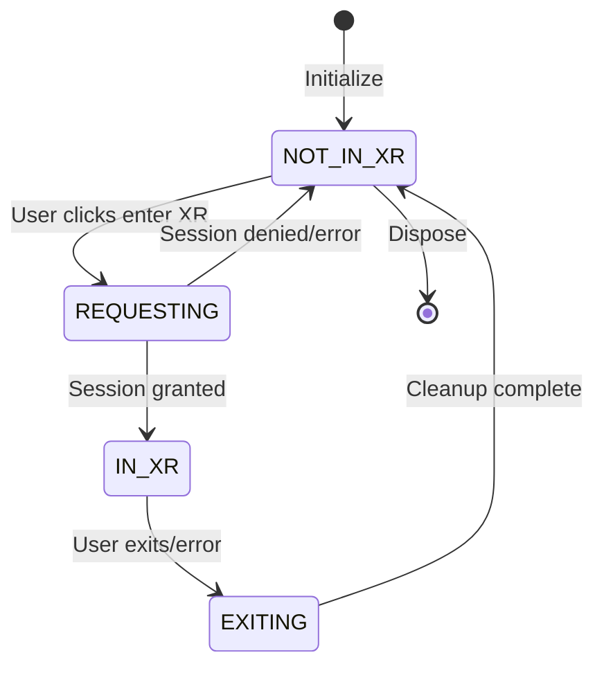
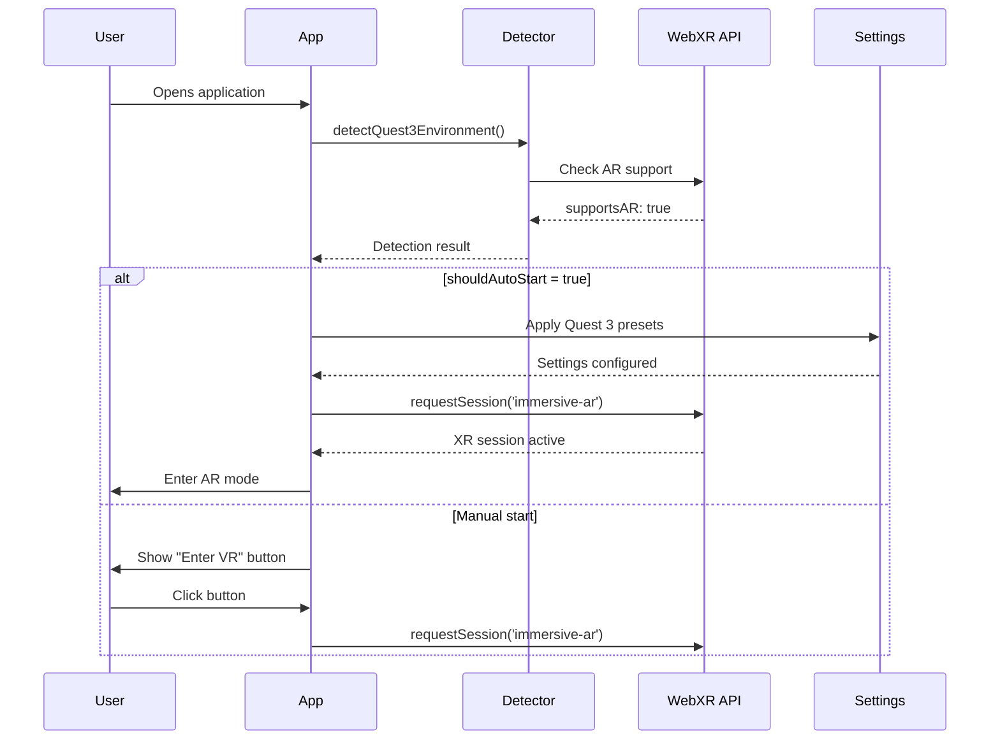
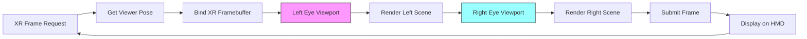
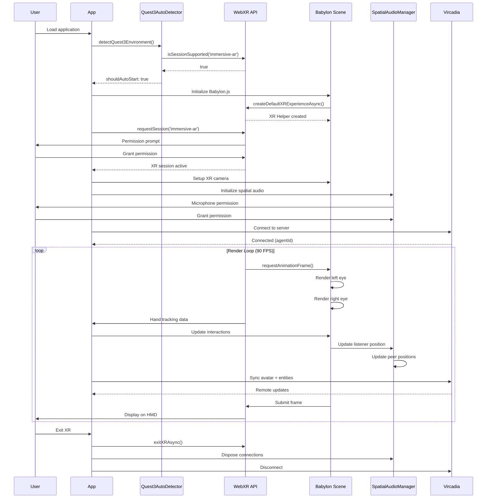

# XR/VR System Architecture - Complete Documentation

## Executive Summary

This document provides comprehensive technical documentation for the VisionFlow XR/VR system, covering WebXR API integration, Quest 3 device support, hand tracking, spatial audio, stereoscopic rendering, performance optimization, AR mode with passthrough, interaction systems, and legacy Vircadia platform integration.

**Target Device**: Meta Quest 3 (Primary)
**API Standard**: WebXR Device API
**Rendering Engine**: Babylon.js 6.x
**Performance Target**: 72 FPS minimum, 90 FPS target, 120 FPS optimal
**Supported Modes**: Immersive VR, Immersive AR with passthrough

---

## 1. WebXR API Integration and Session Management

### 1.1 WebXR Detection and Initialization

```typescript
// Location: client/src/immersive/babylon/XRManager.ts

class XRManager {
  private xrHelper: WebXRExperienceHelper | null = null;

  async initializeXR() {
    // Step 1: Check WebXR availability
    if ('xr' in navigator) {
      const vrSupported = await navigator.xr.isSessionSupported('immersive-vr');
      const arSupported = await navigator.xr.isSessionSupported('immersive-ar');

      // Step 2: Create Babylon.js XR experience helper
      const xrOptions = {
        floorMeshes: [],
        uiOptions: {
          sessionMode: 'immersive-ar',
          referenceSpaceType: 'local-floor',
          customButtons: undefined
        },
        optionalFeatures: true
      };

      this.xrHelper = await this.scene.createDefaultXRExperienceAsync(xrOptions);

      // Step 3: Setup state change listeners
      this.xrHelper.baseExperience.onStateChangedObservable.add((state) => {
        if (state === WebXRState.IN_XR) {
          this.onEnterXR();
        } else if (state === WebXRState.NOT_IN_XR) {
          this.onExitXR();
        }
      });
    }
  }
}
```

### 1.2 XR Session Lifecycle



### 1.3 Session Configuration

```typescript
interface XRSessionInit {
  requiredFeatures: [
    'local-floor'               // Floor-level tracking required
  ],
  optionalFeatures: [
    'hand-tracking',            // Native hand tracking
    'hit-test',                 // Surface detection
    'anchors',                  // Spatial anchors
    'plane-detection',          // Room geometry
    'light-estimation',         // Environmental lighting
    'depth-sensing',            // Depth map access
    'mesh-detection'            // Scene understanding
  ]
}

// Session Request
const session = await navigator.xr.requestSession('immersive-ar', sessionInit);

// Key Properties
session.environmentBlendMode  // 'opaque', 'additive', 'alpha-blend'
session.supportedFrameRates   // [72, 90, 120] for Quest 3
session.inputSources           // Controllers + hands
```

### 1.4 Reference Spaces

```typescript
// Floor-level tracking (recommended for Quest 3)
const refSpace = await session.requestReferenceSpace('local-floor');

// Alternative reference spaces:
// 'viewer'        - Head-locked space
// 'local'         - Origin at session start (no floor)
// 'bounded-floor' - Guardian boundary awareness
// 'unbounded'     - World-scale tracking
```

---

## 2. Quest 3 Detection and Initialization

### 2.1 Device Detection System

```typescript
// Location: client/src/services/quest3AutoDetector.ts

interface Quest3DetectionResult {
  isQuest3: boolean;           // Hardware detection
  isQuest3Browser: boolean;    // Browser detection
  supportsAR: boolean;          // AR capability check
  shouldAutoStart: boolean;     // Auto-launch decision
}

class Quest3AutoDetector {
  async detectQuest3Environment(): Promise<Quest3DetectionResult> {
    const userAgent = navigator.userAgent;

    // Hardware detection
    const isQuest3Hardware =
      userAgent.includes('Quest 3') ||
      userAgent.includes('Quest3');

    // Browser detection (Oculus Browser)
    const isQuest3Browser =
      userAgent.includes('OculusBrowser') ||
      (userAgent.includes('Mobile') && userAgent.includes('VR'));

    // AR capability check via WebXR
    let supportsAR = false;
    if ('xr' in navigator) {
      supportsAR = await navigator.xr.isSessionSupported('immersive-ar');
    }

    // Auto-start decision
    const shouldAutoStart = isQuest3Hardware && isQuest3Browser && supportsAR;

    return { isQuest3Hardware, isQuest3Browser, supportsAR, shouldAutoStart };
  }
}
```

### 2.2 Quest 3 Auto-Start Flow



### 2.3 Quest 3 Optimized Settings

```typescript
const quest3Settings = {
  xr: {
    enabled: true,
    clientSideEnableXR: true,
    displayMode: 'immersive-ar',
    spaceType: 'local-floor',
    enableHandTracking: true,
    enablePassthroughPortal: true,
    passthroughOpacity: 1.0,
    passthroughBrightness: 1.0,
    passthroughContrast: 1.0,
    enablePlaneDetection: true,
    enableSceneUnderstanding: true,
    locomotionMethod: 'teleport',
    movementSpeed: 1.0,
    interactionDistance: 1.5,
    quality: 'high'
  },
  visualisation: {
    rendering: {
      context: 'quest3-ar',
      enableAntialiasing: true,
      enableShadows: true,
      backgroundColor: 'transparent'
    },
    physics: {
      enabled: true,
      boundsSize: 5.0,      // 5m × 5m play space
      maxVelocity: 0.01     // Low velocity for stability
    }
  }
};
```

---

## 3. Hand Tracking and Controller Input

### 3.1 Hand Tracking System

```typescript
// Enable hand tracking feature
const handTrackingFeature = xrHelper.baseExperience.featuresManager.enableFeature(
  WebXRHandTracking.Name,
  'latest'
) as WebXRHandTracking;

// Hand detection
handTrackingFeature.onHandAddedObservable.add((hand) => {
  console.log('Hand detected:', hand.handedness); // 'left' or 'right'

  // Get joint information (25 joints per hand)
  const indexTip = hand.getJoint('index-finger-tip');
  const thumbTip = hand.getJoint('thumb-tip');
  const wrist = hand.getJoint('wrist');

  // Joint tracking in render loop
  scene.onBeforeRenderObservable.add(() => {
    if (indexTip) {
      const position = indexTip.position;  // Vector3
      const rotation = indexTip.rotation;  // Quaternion

      // Use for interaction
      this.handleFingerTipInteraction(indexTip, hand.handedness);
    }
  });
});
```

### 3.2 Hand Joint Structure

```
Hand Joints (25 per hand):
├── wrist
├── thumb-metacarpal
├── thumb-phalanx-proximal
├── thumb-phalanx-distal
├── thumb-tip
├── index-finger-metacarpal
├── index-finger-phalanx-proximal
├── index-finger-phalanx-intermediate
├── index-finger-phalanx-distal
├── index-finger-tip
├── middle-finger-metacarpal
├── middle-finger-phalanx-proximal
├── middle-finger-phalanx-intermediate
├── middle-finger-phalanx-distal
├── middle-finger-tip
├── ring-finger-metacarpal
├── ring-finger-phalanx-proximal
├── ring-finger-phalanx-intermediate
├── ring-finger-phalanx-distal
├── ring-finger-tip
├── pinky-finger-metacarpal
├── pinky-finger-phalanx-proximal
├── pinky-finger-phalanx-intermediate
├── pinky-finger-phalanx-distal
└── pinky-finger-tip
```

### 3.3 Controller Input Handling

```typescript
// Controller connection
xrHelper.baseExperience.onXRInputSourceObservable.add((inputSource) => {
  console.log('Controller connected:', inputSource.uniqueId);
  console.log('Handedness:', inputSource.handedness); // 'left', 'right', 'none'

  // Button input
  inputSource.onComponentChangedObservable.add((component) => {
    if (component.id === 'xr-standard-trigger') {
      if (component.pressed) {
        this.handleTriggerPress(inputSource);
      } else {
        this.handleTriggerRelease(inputSource);
      }
    }

    if (component.id === 'xr-standard-squeeze') {
      if (component.pressed) {
        this.handleSqueezePress(inputSource);
      }
    }

    if (component.id === 'xr-standard-thumbstick') {
      const axes = component.axes;  // [x, y] values -1 to 1
      this.handleThumbstickMove(axes.x, axes.y);
    }
  });

  // Controller ray (for pointing)
  inputSource.onPointerRayChangedObservable.add((ray) => {
    this.performRaycast(ray, inputSource);
  });
});
```

### 3.4 Input Mapping

| Controller Input | Quest 3 Touch Plus | Action |
|-----------------|-------------------|--------|
| Trigger | Index trigger | Select/Grab |
| Squeeze | Hand grip | Secondary action/UI toggle |
| Thumbstick | Analog stick | Movement/Navigation |
| Button A/X | Face button | Jump/Confirm |
| Button B/Y | Face button | Menu/Cancel |
| Menu Button | Three-line button | System menu |

---

## 4. Spatial Audio and Voice in VR

### 4.1 Web Audio API Integration

```typescript
// Location: client/src/services/vircadia/SpatialAudioManager.ts

class SpatialAudioManager {
  private audioContext: AudioContext;
  private peerConnections = new Map<string, PeerConnection>();

  async initialize() {
    // Create audio context
    this.audioContext = new AudioContext();

    // Get local microphone stream
    this.localStream = await navigator.mediaDevices.getUserMedia({
      audio: {
        echoCancellation: true,
        noiseSuppression: true,
        autoGainControl: true,
        sampleRate: 48000
      }
    });
  }

  // Setup spatial audio for remote peer
  setupSpatialAudio(remoteStream: MediaStream) {
    // Create audio source from remote stream
    const source = this.audioContext.createMediaStreamSource(remoteStream);

    // Create panner node for 3D positioning
    const panner = this.audioContext.createPanner();
    panner.panningModel = 'HRTF';           // Head-related transfer function
    panner.distanceModel = 'inverse';        // Realistic distance falloff
    panner.refDistance = 1;                  // 1 meter reference
    panner.maxDistance = 20;                 // 20 meter max audible
    panner.rolloffFactor = 1;                // Natural rolloff

    // Connect audio graph
    source.connect(panner);
    panner.connect(this.audioContext.destination);

    return panner;
  }
}
```

### 4.2 Listener Position Update (XR Camera Tracking)

```typescript
updateListenerPosition(
  position: Vector3,   // XR camera position
  forward: Vector3,    // Look direction
  up: Vector3          // Up vector
) {
  const listener = this.audioContext.listener;

  // Update listener position
  if (listener.positionX) {
    // Modern API (preferred)
    listener.positionX.value = position.x;
    listener.positionY.value = position.y;
    listener.positionZ.value = position.z;
  } else {
    // Legacy API fallback
    listener.setPosition(position.x, position.y, position.z);
  }

  // Update listener orientation
  if (listener.forwardX) {
    listener.forwardX.value = forward.x;
    listener.forwardY.value = forward.y;
    listener.forwardZ.value = forward.z;
    listener.upX.value = up.x;
    listener.upY.value = up.y;
    listener.upZ.value = up.z;
  } else {
    listener.setOrientation(
      forward.x, forward.y, forward.z,
      up.x, up.y, up.z
    );
  }
}
```

### 4.3 WebRTC Peer Connection for Voice

```typescript
async connectToPeer(agentId: string, username: string) {
  // Create peer connection
  const pc = new RTCPeerConnection({
    iceServers: [
      { urls: 'stun:stun.l.google.com:19302' }
    ]
  });

  // Add local audio tracks
  this.localStream.getTracks().forEach(track => {
    pc.addTrack(track, this.localStream);
  });

  // Handle remote audio track
  pc.ontrack = (event) => {
    const pannerNode = this.setupSpatialAudio(event.streams[0]);
    this.peerConnections.set(agentId, {
      pc,
      pannerNode,
      username
    });
  };

  // ICE candidate handling
  pc.onicecandidate = (event) => {
    if (event.candidate) {
      this.sendICECandidate(agentId, event.candidate);
    }
  };

  // Create and send offer
  const offer = await pc.createOffer();
  await pc.setLocalDescription(offer);
  await this.sendOffer(agentId, offer);
}
```

### 4.4 Audio Graph Architecture

```mermaid
graph TB
    subgraph "Local User"
        Mic[Microphone] --> LocalStream[MediaStream]
        LocalStream --> WebRTC1[WebRTC Peer 1]
        LocalStream --> WebRTC2[WebRTC Peer 2]
    end

    subgraph "Remote Peer 1"
        WebRTC1 --> RemoteStream1[Remote MediaStream]
        RemoteStream1 --> Source1[MediaStreamSource]
        Source1 --> Panner1[PannerNode]
        Panner1 --> Destination[AudioDestination]

        XRCamera1[XR Camera] -.Position.-> Panner1
    end

    subgraph "Remote Peer 2"
        WebRTC2 --> RemoteStream2[Remote MediaStream]
        RemoteStream2 --> Source2[MediaStreamSource]
        Source2 --> Panner2[PannerNode]
        Panner2 --> Destination

        XRCamera2[XR Camera] -.Position.-> Panner2
    end

    subgraph "Listener"
        Destination --> Headphones[Quest 3 Headphones]
        XRHeadset[XR Headset] -.Orientation.-> Listener[AudioListener]
        Listener -.Controls.-> Destination
    end
```

---

## 5. Render Pipeline for XR (Stereoscopic Rendering)

### 5.1 XR Render Loop

```typescript
// WebXR automatically handles stereoscopic rendering
xrSession.requestAnimationFrame(function onXRFrame(time, xrFrame) {
  const session = xrFrame.session;

  // 1. Get viewer pose (head position + orientation)
  const pose = xrFrame.getViewerPose(referenceSpace);
  if (!pose) {
    session.requestAnimationFrame(onXRFrame);
    return;
  }

  // 2. Get XR layer (rendering target)
  const glLayer = session.renderState.baseLayer;
  const framebuffer = glLayer.framebuffer;

  // 3. Bind XR framebuffer
  gl.bindFramebuffer(gl.FRAMEBUFFER, framebuffer);

  // 4. Render each view (left eye, right eye)
  for (const view of pose.views) {
    const viewport = glLayer.getViewport(view);
    gl.viewport(viewport.x, viewport.y, viewport.width, viewport.height);

    // 5. Setup camera for this eye
    const viewMatrix = view.transform.inverse.matrix;
    const projectionMatrix = view.projectionMatrix;

    // 6. Render scene
    renderScene(viewMatrix, projectionMatrix);
  }

  // 7. Request next frame
  session.requestAnimationFrame(onXRFrame);
});
```

### 5.2 Babylon.js XR Integration

```typescript
// Babylon.js handles XR rendering automatically
class BabylonScene {
  constructor(canvas: HTMLCanvasElement) {
    // Create engine with XR-compatible settings
    this.engine = new BABYLON.Engine(canvas, true, {
      preserveDrawingBuffer: true,  // Required for XR
      stencil: true,                 // For advanced effects
      antialias: true                // Quality
    });

    // Create scene
    this.scene = new BABYLON.Scene(this.engine);
    this.scene.clearColor = new Color4(0, 0, 0, 0); // Transparent for AR

    // Setup XR camera (replaces desktop camera in XR mode)
    this.camera = new UniversalCamera('camera', new Vector3(0, 1.6, -5));

    // Initialize XR
    this.xrManager = new XRManager(this.scene, this.camera);
  }

  run() {
    // Single render loop handles both desktop and XR
    this.engine.runRenderLoop(() => {
      this.scene.render();
    });
  }
}
```

### 5.3 Stereoscopic View Parameters (Quest 3)

```typescript
interface XRViewParameters {
  // Quest 3 specific values
  eye: 'left' | 'right',

  // Resolution per eye
  renderWidth: 1832,      // Horizontal pixels
  renderHeight: 1920,     // Vertical pixels

  // Field of view
  fieldOfView: {
    upDegrees: 53.13,
    downDegrees: 50.02,
    leftDegrees: 45.78,
    rightDegrees: 50.89
  },

  // Inter-pupillary distance (IPD)
  ipd: 0.063,             // ~63mm (varies by user)

  // Refresh rates
  supportedFrameRates: [72, 90, 120],

  // Eye offset from center
  viewOffset: {
    left: [-0.0315, 0, 0],   // -31.5mm
    right: [0.0315, 0, 0]     // +31.5mm
  }
}
```

### 5.4 Render Pipeline Stages



---

## 6. Performance Optimizations for Mobile VR

### 6.1 Target Performance Metrics

| Metric | Minimum | Target | Optimal |
|--------|---------|--------|---------|
| Frame Rate | 72 FPS | 90 FPS | 120 FPS |
| Frame Time | 13.89ms | 11.11ms | 8.33ms |
| CPU Time | <8ms | <6ms | <4ms |
| GPU Time | <10ms | <8ms | <6ms |
| Draw Calls | <500 | <300 | <200 |
| Triangles | <500K | <300K | <200K |
| Texture Memory | <512MB | <256MB | <128MB |
| Garbage Collection | <1ms/frame | <0.5ms/frame | 0ms/frame |

### 6.2 Rendering Optimizations

```typescript
// Quest 3 Optimizer
class Quest3Optimizer {
  applyOptimizations(scene: Scene, settings: Settings) {
    // 1. Dynamic LOD (Level of Detail)
    this.setupDynamicLOD(scene);

    // 2. Frustum culling
    scene.frustumCullingEnabled = true;

    // 3. Occlusion culling (software)
    scene.occlusionQueryAlgorithmType = Scene.OCCLUSION_ALGORITHM_TYPE_ACCURATE;

    // 4. Reduce shadow quality
    const shadowGen = this.getShadowGenerator(scene);
    if (shadowGen) {
      shadowGen.mapSize = 512;  // Lower for mobile
      shadowGen.useBlurExponentialShadowMap = false;
    }

    // 5. Instance meshes where possible
    this.instanceRepeatedGeometry(scene);

    // 6. Use simpler materials
    this.simplifyMaterials(scene);

    // 7. Reduce particle count
    this.optimizeParticles(scene, 0.5); // 50% reduction

    // 8. Limit post-processing
    this.disableExpensivePostFX(scene);
  }

  setupDynamicLOD(scene: Scene) {
    scene.meshes.forEach(mesh => {
      if (mesh.metadata?.hasLOD) {
        // High detail (< 2m)
        const highLOD = mesh;

        // Medium detail (2-5m)
        const medLOD = mesh.clone();
        medLOD.simplify([
          { quality: 0.7, distance: 2 }
        ]);

        // Low detail (5-10m)
        const lowLOD = mesh.clone();
        lowLOD.simplify([
          { quality: 0.4, distance: 5 }
        ]);

        // Very low detail (>10m)
        const veryLowLOD = mesh.clone();
        veryLowLOD.simplify([
          { quality: 0.2, distance: 10 }
        ]);
      }
    });
  }
}
```

### 6.3 Memory Management

```typescript
// Texture compression for Quest 3
function optimizeTexturesForQuest3(scene: Scene) {
  scene.textures.forEach(texture => {
    // Use basis universal compression
    if (texture.url.endsWith('.basis')) {
      texture.format = Engine.TEXTUREFORMAT_RGB;
    }

    // Reduce resolution for distant objects
    if (texture.metadata?.distanceFromCamera > 5) {
      texture.scale(0.5); // 50% scale
    }

    // Unload unused textures
    if (!texture.isReady()) {
      texture.dispose();
    }
  });
}

// Geometry instancing
function instanceGraphNodes(nodes: GraphNode[]) {
  const sphereTemplate = MeshBuilder.CreateSphere('nodeSphere', {
    diameter: 0.1
  });

  // Create instances instead of clones
  nodes.forEach(node => {
    const instance = sphereTemplate.createInstance(`node_${node.id}`);
    instance.position = new Vector3(node.x, node.y, node.z);
    instance.metadata = { nodeId: node.id };
  });

  sphereTemplate.setEnabled(false); // Hide template
}
```

### 6.4 Fixed Foveated Rendering (FFR)

```typescript
// Quest 3 supports fixed foveated rendering
interface FoveatedRenderingConfig {
  level: 'off' | 'low' | 'medium' | 'high',
  dynamic: boolean
}

// Apply via XR session
xrSession.updateRenderState({
  foveationLevel: 2  // 0=off, 1=low, 2=medium, 3=high
});

// Visual quality vs performance trade-off:
// Level 0 (Off):     100% resolution everywhere
// Level 1 (Low):     ~90% avg resolution, +10% perf
// Level 2 (Medium):  ~75% avg resolution, +25% perf
// Level 3 (High):    ~60% avg resolution, +40% perf
```

---

## 7. AR Mode and Passthrough Features

### 7.1 Passthrough Configuration

```typescript
// Enable passthrough for Quest 3
const passthroughSettings = {
  enabled: true,
  opacity: 1.0,           // 0.0 = invisible, 1.0 = fully visible
  brightness: 1.0,        // Brightness adjustment
  contrast: 1.0,          // Contrast adjustment
  saturation: 1.0,        // Color saturation

  // Edge blending for virtual objects
  edgeColor: new Color4(0, 0, 0, 0.5),

  // Environment blend mode
  blendMode: 'alpha-blend' as const  // 'opaque', 'additive', 'alpha-blend'
};

// Apply to scene
scene.clearColor = new Color4(0, 0, 0, 0); // Transparent background

// Configure passthrough layer (Quest-specific)
if (xrSession.environmentBlendMode === 'alpha-blend') {
  console.log('AR passthrough active');
}
```

### 7.2 Hit Testing (Surface Detection)

```typescript
// Enable hit test feature
const hitTestSource = await xrSession.requestHitTestSource({
  space: viewerSpace,
  offsetRay: new XRRay() // Ray from controller/hand
});

// Perform hit test each frame
function onXRFrame(time: number, xrFrame: XRFrame) {
  const hitTestResults = xrFrame.getHitTestResults(hitTestSource);

  if (hitTestResults.length > 0) {
    const hit = hitTestResults[0];
    const hitPose = hit.getPose(referenceSpace);

    if (hitPose) {
      // Place object at hit position
      const position = hitPose.transform.position;
      placeObjectAt(position.x, position.y, position.z);

      // Get surface normal
      const orientation = hitPose.transform.orientation;
      const normal = getNormalFromQuaternion(orientation);
    }
  }
}
```

### 7.3 Plane Detection

```typescript
// Enable plane detection
const planeDetectionFeature = xrHelper.baseExperience.featuresManager.enableFeature(
  'plane-detection',
  'latest'
);

// Listen for detected planes
xrFrame.detectedPlanes?.forEach((plane) => {
  const planePose = xrFrame.getPose(plane.planeSpace, referenceSpace);

  if (planePose) {
    // Visualize plane
    const planeGeometry = plane.polygon; // Array of [x, y, z] vertices
    const planeMesh = createPlaneVisualization(planeGeometry);

    // Plane orientation
    const orientation = plane.orientation; // 'horizontal', 'vertical'

    // Snap objects to detected planes
    if (orientation === 'horizontal') {
      snapObjectsToFloor(planePose);
    }
  }
});
```

### 7.4 Anchors (Persistent Spatial Markers)

```typescript
// Create anchor at specific pose
async function createAnchor(pose: XRRigidTransform) {
  const anchor = await xrFrame.createAnchor(pose, referenceSpace);

  if (anchor) {
    anchors.set(anchor.anchorSpace, {
      id: generateUUID(),
      createdAt: Date.now(),
      anchorSpace: anchor.anchorSpace
    });
  }

  return anchor;
}

// Track anchor positions each frame
function updateAnchors(xrFrame: XRFrame) {
  anchors.forEach((anchorData, anchorSpace) => {
    const anchorPose = xrFrame.getPose(anchorSpace, referenceSpace);

    if (anchorPose) {
      // Update object position to match anchor
      const object = getObjectByAnchorId(anchorData.id);
      object.position.copyFrom(anchorPose.transform.position);
      object.rotationQuaternion.copyFrom(anchorPose.transform.orientation);
    }
  });
}
```

---

## 8. Interaction Systems (Grab, Point, Teleport)

### 8.1 Ray-based Selection

```typescript
private performRaySelection(ray: Ray, sourceId: string): void {
  // Raycast against scene
  const hit = this.scene.pickWithRay(ray);

  if (hit?.pickedMesh) {
    // Get node ID from mesh metadata
    const nodeId = hit.pickedMesh.metadata?.nodeId;

    if (nodeId) {
      // Highlight selected node
      this.highlightNode(nodeId);

      // Emit selection event
      this.scene.onNodeSelectedObservable.notifyObservers({
        nodeId,
        sourceId,
        timestamp: Date.now(),
        hitPoint: hit.pickedPoint,
        distance: hit.distance
      });
    }
  }
}
```

### 8.2 Grab and Drag

```typescript
private startNodeInteraction(inputSource: WebXRInputSource): void {
  // Get currently selected node
  const selectedNodeId = this.getSelectedNodeId();

  if (selectedNodeId) {
    // Pin node (disable physics)
    this.pinnedNode = selectedNodeId;
    this.scene.onPhysicsPinObservable.notifyObservers({
      nodeId: selectedNodeId,
      pinned: true
    });

    // Track controller position
    this.activeInputSource = inputSource;

    // Update node position each frame
    const observer = this.scene.onBeforeRenderObservable.add(() => {
      if (this.activeInputSource && this.pinnedNode) {
        const grip = this.activeInputSource.grip || this.activeInputSource.pointer;

        if (grip) {
          // Move node to controller position
          this.updateNodePosition(this.pinnedNode, grip.position);
        }
      }
    });
  }
}

private endNodeInteraction(): void {
  if (this.pinnedNode) {
    // Unpin node (re-enable physics)
    this.scene.onPhysicsPinObservable.notifyObservers({
      nodeId: this.pinnedNode,
      pinned: false
    });

    this.pinnedNode = null;
  }

  this.activeInputSource = null;
}
```

### 8.3 Teleport Locomotion

```typescript
class TeleportController {
  private teleportRay: Ray;
  private teleportArc: Mesh[];
  private validTarget: Vector3 | null = null;

  // Show teleport arc
  showTeleportArc(origin: Vector3, direction: Vector3) {
    const arcPoints: Vector3[] = [];
    const gravity = -9.8;
    const velocity = 5.0;
    const timeStep = 0.1;

    // Simulate parabolic arc
    let currentPos = origin.clone();
    let currentVel = direction.scale(velocity);

    for (let t = 0; t < 2.0; t += timeStep) {
      arcPoints.push(currentPos.clone());

      // Apply gravity
      currentVel.y += gravity * timeStep;
      currentPos.addInPlace(currentVel.clone().scale(timeStep));

      // Check for ground collision
      const hit = this.scene.pickWithRay(new Ray(currentPos, Vector3.Down()));
      if (hit?.hit) {
        this.validTarget = hit.pickedPoint;
        break;
      }
    }

    // Visualize arc
    this.teleportArc = this.createArcMesh(arcPoints, this.validTarget !== null);
  }

  // Execute teleport
  teleportToTarget() {
    if (this.validTarget) {
      const xrCamera = this.scene.activeCamera as WebXRCamera;

      // Offset target by current camera height
      const targetPosition = this.validTarget.clone();
      targetPosition.y += xrCamera.position.y;

      // Move XR reference space
      xrCamera.position = targetPosition;

      // Hide teleport arc
      this.hideTeleportArc();
      this.validTarget = null;
    }
  }
}
```

### 8.4 Gesture Recognition (Pinch, Grab)

```typescript
class HandGestureRecognizer {
  detectPinch(hand: WebXRHand): boolean {
    const thumbTip = hand.getJoint('thumb-tip');
    const indexTip = hand.getJoint('index-finger-tip');

    if (thumbTip && indexTip) {
      const distance = Vector3.Distance(thumbTip.position, indexTip.position);
      return distance < 0.03; // 3cm threshold
    }

    return false;
  }

  detectGrab(hand: WebXRHand): boolean {
    const fingers = [
      hand.getJoint('index-finger-tip'),
      hand.getJoint('middle-finger-tip'),
      hand.getJoint('ring-finger-tip'),
      hand.getJoint('pinky-finger-tip')
    ];

    const palm = hand.getJoint('wrist');

    if (palm) {
      // Check if all fingertips are close to palm
      const distances = fingers.map(finger =>
        finger ? Vector3.Distance(finger.position, palm.position) : 999
      );

      const avgDistance = distances.reduce((a, b) => a + b) / distances.length;
      return avgDistance < 0.08; // 8cm threshold
    }

    return false;
  }

  detectPoint(hand: WebXRHand): Ray | null {
    const indexTip = hand.getJoint('index-finger-tip');
    const indexMiddle = hand.getJoint('index-finger-phalanx-intermediate');

    if (indexTip && indexMiddle) {
      const direction = indexTip.position.subtract(indexMiddle.position).normalize();
      return new Ray(indexTip.position, direction);
    }

    return null;
  }
}
```

---

## 9. UI Adaptation for VR/AR

### 9.1 3D UI Panel System

```typescript
// Location: client/src/immersive/babylon/XRUI.ts

class XRUI {
  private uiPlane: Mesh;
  private uiTexture: AdvancedDynamicTexture;

  initialize() {
    // Create UI plane in 3D space
    this.uiPlane = MeshBuilder.CreatePlane('uiPlane', {
      width: 2,    // 2 meters wide
      height: 1.5  // 1.5 meters tall
    });

    // Position UI in front of user
    this.uiPlane.position = new Vector3(2, 1.6, 0); // Right side at eye level

    // Create GUI texture
    this.uiTexture = AdvancedDynamicTexture.CreateForMesh(this.uiPlane);
    this.uiTexture.background = 'rgba(30, 30, 40, 0.9)';

    // Add UI controls
    this.createControlPanel();
  }

  createControlPanel() {
    const panel = new StackPanel('mainPanel');
    panel.widthInPixels = 400;
    panel.heightInPixels = 600;
    panel.background = 'rgba(0, 0, 0, 0.8)';

    // Title
    const title = new TextBlock('title', 'VisionFlow Settings');
    title.color = 'white';
    title.fontSize = 24;
    panel.addControl(title);

    // Slider
    const nodeSize = new Slider('nodeSize');
    nodeSize.minimum = 0.1;
    nodeSize.maximum = 2.0;
    nodeSize.value = 1.0;
    nodeSize.onValueChangedObservable.add((value) => {
      this.updateNodeSize(value);
    });
    panel.addControl(nodeSize);

    // Checkbox
    const showLabels = new Checkbox('showLabels');
    showLabels.isChecked = true;
    showLabels.onIsCheckedChangedObservable.add((checked) => {
      this.toggleLabels(checked);
    });
    panel.addControl(showLabels);

    this.uiTexture.addControl(panel);
  }
}
```

### 9.2 World-Space UI vs Screen-Space UI

```typescript
// World-Space UI (attached to objects)
function createWorldSpaceLabel(node: GraphNode): Mesh {
  const label = MeshBuilder.CreatePlane('label', { size: 0.3 });
  label.position = new Vector3(node.x, node.y + 0.2, node.z); // Above node

  const labelTexture = AdvancedDynamicTexture.CreateForMesh(label);
  const text = new TextBlock();
  text.text = node.label;
  text.color = 'white';
  text.fontSize = 64;
  labelTexture.addControl(text);

  // Billboard (always face camera)
  label.billboardMode = Mesh.BILLBOARDMODE_ALL;

  return label;
}

// Screen-Space UI (HUD overlay)
function createHUD(): AdvancedDynamicTexture {
  const hud = AdvancedDynamicTexture.CreateFullscreenUI('hud');

  // FPS counter (top-left)
  const fpsText = new TextBlock('fps');
  fpsText.text = 'FPS: 90';
  fpsText.color = 'lime';
  fpsText.top = 10;
  fpsText.left = 10;
  fpsText.textHorizontalAlignment = Control.HORIZONTAL_ALIGNMENT_LEFT;
  fpsText.textVerticalAlignment = Control.VERTICAL_ALIGNMENT_TOP;
  hud.addControl(fpsText);

  // Crosshair (center)
  const crosshair = new Ellipse('crosshair');
  crosshair.width = '10px';
  crosshair.height = '10px';
  crosshair.color = 'white';
  crosshair.thickness = 2;
  hud.addControl(crosshair);

  return hud;
}
```

### 9.3 UI Interaction with Controllers/Hands

```typescript
// Pointer events on 3D UI
uiPlane.actionManager = new ActionManager(scene);

uiPlane.actionManager.registerAction(
  new ExecuteCodeAction(
    ActionManager.OnPointerOverTrigger,
    (evt) => {
      // Controller/hand is pointing at UI
      uiPlane.material.emissiveColor = new Color3(0.2, 0.2, 0.3);
    }
  )
);

uiPlane.actionManager.registerAction(
  new ExecuteCodeAction(
    ActionManager.OnPointerOutTrigger,
    (evt) => {
      // Pointer left UI
      uiPlane.material.emissiveColor = Color3.Black();
    }
  )
);

uiPlane.actionManager.registerAction(
  new ExecuteCodeAction(
    ActionManager.OnPickTrigger,
    (evt) => {
      // UI clicked/selected
      console.log('UI interaction:', evt);
    }
  )
);
```

---

## 10. Legacy Vircadia Integration

### 10.1 Vircadia Client Core

```typescript
// Location: client/src/services/vircadia/VircadiaClientCore.ts

interface VircadiaConfig {
  serverUrl: string;          // WebSocket endpoint
  authToken: string;           // Authentication token
  authProvider: string;        // 'system', 'oauth', etc.
  reconnectAttempts: number;   // Auto-reconnect attempts
  reconnectDelay: number;      // Delay between attempts (ms)
  debug: boolean;              // Debug logging
}

class ClientCore {
  private ws: WebSocket | null = null;
  private agentId: string | null = null;
  private sessionId: string | null = null;

  async connect(config: VircadiaConfig): Promise<ConnectionInfo> {
    // Establish WebSocket connection
    this.ws = new WebSocket(config.serverUrl);

    return new Promise((resolve, reject) => {
      this.ws.onopen = () => {
        // Send auth message
        this.send({
          type: 'auth',
          token: config.authToken,
          provider: config.authProvider
        });
      };

      this.ws.onmessage = (event) => {
        const message = JSON.parse(event.data);

        if (message.type === 'auth_success') {
          this.agentId = message.agentId;
          this.sessionId = message.sessionId;

          resolve({
            agentId: this.agentId,
            sessionId: this.sessionId,
            isConnected: true
          });
        }
      };

      this.ws.onerror = reject;
    });
  }

  // Query Vircadia database
  async query<T>(options: { query: string, timeoutMs: number }): Promise<T> {
    return new Promise((resolve, reject) => {
      const messageId = generateUUID();
      const timeout = setTimeout(() => reject(new Error('Query timeout')), options.timeoutMs);

      // Setup response handler
      this.responseHandlers.set(messageId, (response) => {
        clearTimeout(timeout);
        resolve(response as T);
      });

      // Send query
      this.send({
        type: 'query',
        messageId,
        query: options.query
      });
    });
  }
}
```

### 10.2 Avatar Manager (XR Integration)

```typescript
// Location: client/src/services/vircadia/AvatarManager.ts

class AvatarManager {
  private avatars = new Map<string, Avatar>();

  // Create avatar for XR user
  createXRAvatar(agentId: string, headPose: XRPose): Avatar {
    const avatar = {
      agentId,
      headPosition: headPose.transform.position,
      headRotation: headPose.transform.orientation,
      leftHandPosition: null,
      rightHandPosition: null,
      mesh: this.createAvatarMesh()
    };

    this.avatars.set(agentId, avatar);
    return avatar;
  }

  // Update avatar from XR frame
  updateAvatarFromXR(agentId: string, xrFrame: XRFrame, refSpace: XRReferenceSpace) {
    const avatar = this.avatars.get(agentId);
    if (!avatar) return;

    // Update head
    const headPose = xrFrame.getViewerPose(refSpace);
    if (headPose) {
      avatar.headPosition = headPose.transform.position;
      avatar.headRotation = headPose.transform.orientation;
    }

    // Update hands
    xrFrame.session.inputSources.forEach(inputSource => {
      if (inputSource.hand) {
        const wrist = inputSource.hand.get('wrist');
        if (wrist) {
          const wristPose = xrFrame.getJointPose(wrist, refSpace);
          if (wristPose) {
            if (inputSource.handedness === 'left') {
              avatar.leftHandPosition = wristPose.transform.position;
            } else {
              avatar.rightHandPosition = wristPose.transform.position;
            }
          }
        }
      }
    });

    // Sync to Vircadia server
    this.syncAvatarToServer(avatar);
  }

  // Send avatar update to Vircadia
  private async syncAvatarToServer(avatar: Avatar) {
    await this.client.Utilities.Connection.query({
      query: `
        UPDATE entity.entities
        SET meta__data = jsonb_set(
          meta__data,
          '{avatar}',
          '${JSON.stringify({
            headPosition: avatar.headPosition,
            headRotation: avatar.headRotation,
            leftHand: avatar.leftHandPosition,
            rightHand: avatar.rightHandPosition,
            timestamp: Date.now()
          })}'::jsonb
        )
        WHERE general__entity_name = 'avatar_${avatar.agentId}'
      `,
      timeoutMs: 1000
    });
  }
}
```

### 10.3 Entity Sync Manager

```typescript
// Sync graph entities between XR client and Vircadia server
class EntitySyncManager {
  // Pull entities from Vircadia
  async fetchEntities(): Promise<Entity[]> {
    const result = await this.client.Utilities.Connection.query<{ result: any[] }>({
      query: `
        SELECT * FROM entity.entities
        WHERE group__sync = 'public.NORMAL'
        AND general__created_at > NOW() - INTERVAL '1 hour'
      `,
      timeoutMs: 5000
    });

    return result.result.map(this.mapToEntity);
  }

  // Push entity changes to Vircadia
  async updateEntity(entityId: string, updates: Partial<Entity>): Promise<void> {
    await this.client.Utilities.Connection.query({
      query: `
        UPDATE entity.entities
        SET
          meta__data = meta__data || '${JSON.stringify(updates)}'::jsonb,
          general__updated_at = NOW()
        WHERE general__entity_id = '${entityId}'
      `,
      timeoutMs: 2000
    });
  }

  // Real-time sync via WebSocket
  startRealtimeSync() {
    this.client.Utilities.Connection.addEventListener('syncUpdate', () => {
      this.fetchEntities().then(entities => {
        this.scene.updateEntities(entities);
      });
    });
  }
}
```

---

## 11. Complete XR System Flow



---

## 12. Performance Monitoring and Debugging

### 12.1 Frame Timing Analysis

```typescript
class XRPerformanceMonitor {
  private frameTimes: number[] = [];
  private lastFrameTime: number = 0;

  captureFrameMetrics(xrFrame: XRFrame) {
    const currentTime = xrFrame.predictedDisplayTime;

    if (this.lastFrameTime > 0) {
      const frameTime = currentTime - this.lastFrameTime;
      this.frameTimes.push(frameTime);

      // Keep last 90 frames (1 second at 90 FPS)
      if (this.frameTimes.length > 90) {
        this.frameTimes.shift();
      }

      // Calculate metrics
      const avgFrameTime = this.getAverage(this.frameTimes);
      const fps = 1000 / avgFrameTime;
      const p99 = this.getPercentile(this.frameTimes, 0.99);

      // Warn if below target
      if (fps < 72) {
        console.warn(`Low FPS: ${fps.toFixed(1)} (target: 90)`);
      }

      if (p99 > 13.89) { // 72 FPS threshold
        console.warn(`P99 frame time: ${p99.toFixed(2)}ms (limit: 13.89ms)`);
      }
    }

    this.lastFrameTime = currentTime;
  }

  getMetrics() {
    return {
      averageFPS: 1000 / this.getAverage(this.frameTimes),
      p50FrameTime: this.getPercentile(this.frameTimes, 0.50),
      p95FrameTime: this.getPercentile(this.frameTimes, 0.95),
      p99FrameTime: this.getPercentile(this.frameTimes, 0.99),
      droppedFrames: this.frameTimes.filter(t => t > 13.89).length
    };
  }
}
```

### 12.2 Common Issues and Solutions

| Issue | Symptom | Solution |
|-------|---------|----------|
| Low FPS | < 72 FPS | Reduce draw calls, enable FFR, lower texture quality |
| Stuttering | Frame time spikes | Eliminate garbage collection, use object pools |
| Jitter | Tracking instability | Improve lighting, enable inside-out tracking |
| Drift | Position inaccuracy | Recalibrate guardian, check room lighting |
| Passthrough not working | Black screen | Check permissions, verify AR session mode |
| Hand tracking失效 | No hand detection | Enable hand tracking feature, check lighting |
| Audio not spatial | Mono sound | Verify PannerNode setup, check listener position |
| UI not interactive | Can't click buttons | Enable ActionManager on UI mesh |

---

## 13. API Reference

### 13.1 Core WebXR APIs Used

```typescript
// Navigator XR
navigator.xr.isSessionSupported(mode: XRSessionMode): Promise<boolean>
navigator.xr.requestSession(mode: XRSessionMode, init?: XRSessionInit): Promise<XRSession>

// XR Session
xrSession.requestReferenceSpace(type: XRReferenceSpaceType): Promise<XRReferenceSpace>
xrSession.requestAnimationFrame(callback: XRFrameRequestCallback): number
xrSession.updateRenderState(state: XRRenderStateInit): void
xrSession.end(): Promise<void>

// XR Frame
xrFrame.session: XRSession
xrFrame.predictedDisplayTime: DOMHighResTimeStamp
xrFrame.getViewerPose(referenceSpace: XRReferenceSpace): XRViewerPose | null
xrFrame.getPose(space: XRSpace, baseSpace: XRReferenceSpace): XRPose | null

// XR Input
xrInputSource.handedness: XRHandedness
xrInputSource.targetRayMode: XRTargetRayMode
xrInputSource.grip: XRSpace | null
xrInputSource.hand: XRHand | null
```

### 13.2 Babylon.js XR Extensions

```typescript
// Scene
Scene.createDefaultXRExperienceAsync(options?: XROptions): Promise<WebXRExperienceHelper>

// WebXRExperienceHelper
helper.baseExperience: WebXRExperience
helper.enterExitUI: WebXREnterExitUI
helper.featuresManager: WebXRFeaturesManager

// Features
WebXRHandTracking.Name
WebXRHitTest.Name
WebXRPlaneDetector.Name
WebXRAnchorSystem.Name
```

---

## 14. Security and Privacy Considerations

### 14.1 Required Permissions

- **Camera Access**: Passthrough video feed
- **Microphone Access**: Voice chat
- **Motion Sensors**: Headset tracking
- **Storage**: Session persistence

### 14.2 HTTPS Requirement

WebXR requires secure context (HTTPS or localhost).

```bash
# For Quest 3 development via USB
adb reverse tcp:5173 tcp:5173  # Port forward
adb reverse tcp:3001 tcp:3001  # Backend

# Access via: https://localhost:5173
```

### 14.3 Privacy Best Practices

1. Request permissions explicitly
2. Show clear indicators when camera/mic active
3. Allow opt-out of spatial audio
4. Anonymize tracking data
5. Provide settings to disable hand tracking

---

## 15. Future Enhancements

### 15.1 Planned Features

- **Eye tracking**: Foveated rendering, gaze-based interaction
- **Scene understanding**: Advanced room layout detection
- **Multi-user AR**: Shared spatial anchors
- **Persistent content**: Cloud-anchored objects
- **6DOF controllers**: Full positional tracking
- **Haptic feedback**: Tactile responses

### 15.2 Experimental APIs

- `WebXR Layers API`: Advanced compositor control
- `WebXR Lighting Estimation`: Environmental lighting
- `WebXR Depth Sensing`: Real-time depth maps
- `WebXR DOM Overlays`: HTML UI in XR

---

---

---

## Related Documentation

- [VisionFlow Client Architecture - Deep Analysis](../../../archive/analysis/client-architecture-analysis-2025-12.md)
- [VisionFlow Client Architecture](../../../concepts/architecture/core/client.md)
- [REST API Architecture Documentation](../../server/api/rest-api-architecture.md)
- [ComfyUI MCP Server Integration with Management API](../../../comfyui-integration-design.md)
- [ComfyUI Management API Integration - Summary](../../../comfyui-management-api-integration-summary.md)

## Conclusion

This document provides complete technical documentation for the VisionFlow XR/VR system, covering all aspects from WebXR API integration to rendering optimization. The architecture is designed for Meta Quest 3 as the primary target device, with extensibility for other WebXR-compatible headsets.

**Key Takeaways**:
- WebXR API provides cross-platform XR support
- Babylon.js simplifies stereoscopic rendering
- Quest 3 auto-detection enables seamless AR experiences
- Spatial audio uses Web Audio API + WebRTC
- Performance optimization targets 90 FPS minimum
- Vircadia integration enables multi-user collaboration

For implementation questions, refer to the source code locations provided throughout this document.
