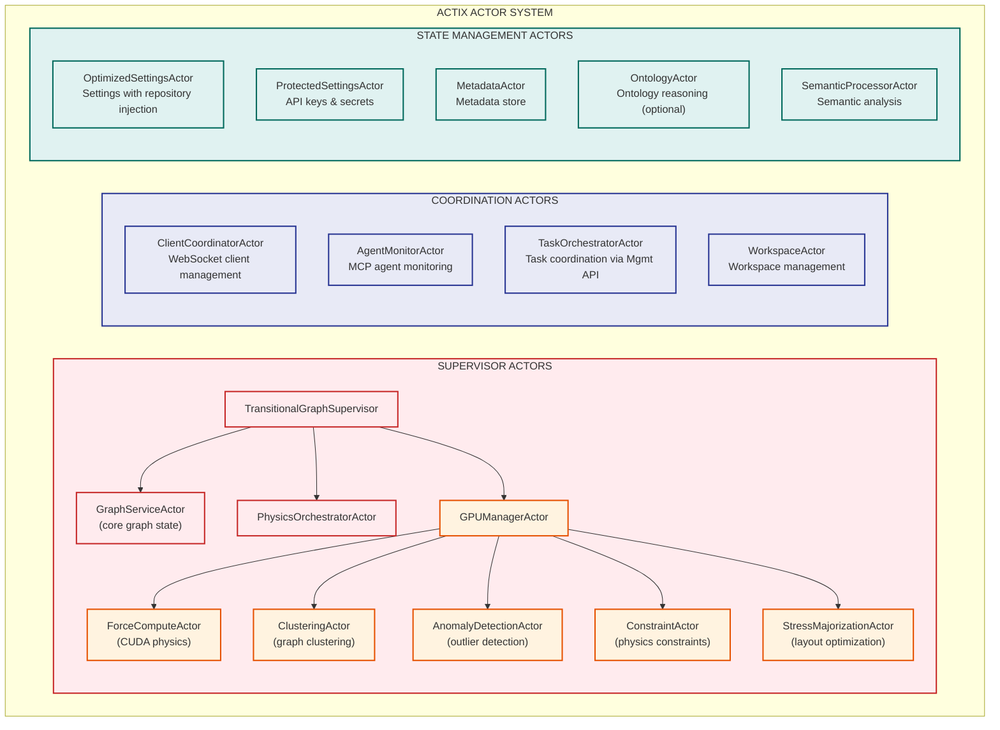
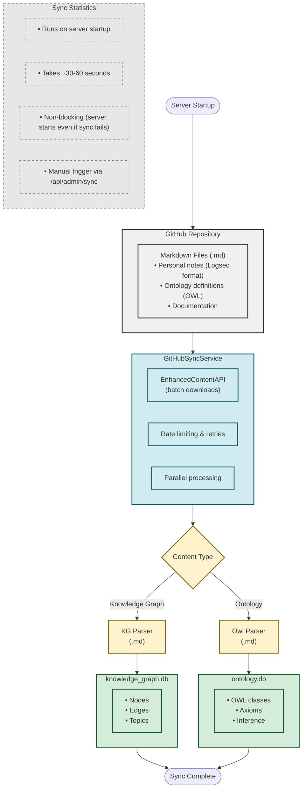

# VisionFlow Current Architecture Diagram

**Generated:** 2025-10-27
**Source:** Ground truth analysis of codebase
**Status:** Verified against actual implementation

---

## System Architecture Overview

```mermaid
graph TB
    subgraph CLIENT["CLIENT LAYER (Browser/WebXR)"]
        React["React Frontend (TypeScript)"]
        Three["Three.js 3D Visualization"]
        WSBinary["WebSocket Binary Protocol (28-byte packets)"]
        RestClient["REST API Client (JSON)"]
    end

    subgraph NETWORK["NETWORK LAYER (Port 8080)"]
        NGINX["NGINX Reverse Proxy"]
        Actix["Actix-Web HTTP Server (4 workers)<br/>• CORS Middleware<br/>• Compression (Zstd)<br/>• Timeout Middleware (30s)"]
        NGINX --> Actix
    end

    subgraph ENDPOINTS["Protocol Endpoints"]
        RestAPI["REST API (JSON)"]
        WSBin["/wss<br/>WebSocket Binary"]
        WSJson["/ws/speech<br/>/ws/mcp-relay<br/>WebSocket JSON"]
    end

    subgraph APPLICATION["APPLICATION LAYER (CQRS)"]
        subgraph HANDLERS["HANDLERS (HTTP → Business Logic)"]
            H1["/api/settings → Settings CQRS Handlers"]
            H2["/api/graph → Graph Query Handlers (8 handlers)"]
            H3["/api/ontology → Ontology CQRS Handlers"]
            H4["/api/workspace → Workspace Handlers"]
            H5["/api/bots → Bot Orchestration"]
            H6["/api/analytics → Analytics Queries"]
            H7["/wss → Binary Protocol Handler"]
        end

        subgraph CQRS["CQRS LAYER (Hexagonal Application)"]
            subgraph QUERIES["QUERIES (Read Ops)"]
                Q1["GetGraphData"]
                Q2["GetNodeMap"]
                Q3["GetPhysicsState"]
                Q4["GetConstraints"]
                Q5["ComputeSSPP"]
                Q6["GetEquilibrium"]
                Q7["GetBotsGraph"]
                Q8["GetNotifications"]
            end

            subgraph DIRECTIVES["DIRECTIVES (Write Ops)"]
                D1["UpdateSettings"]
                D2["SaveGraph"]
                D3["ImportOntology"]
                D4["UpdatePhysics"]
                D5["CreateNode"]
                D6["DeleteEdge"]
                D7["..."]
            end
        end
    end

    subgraph DOMAIN["DOMAIN LAYER (Ports/Interfaces)"]
        subgraph REPOS["REPOSITORY PORTS (Traits)"]
            R1["SettingsRepository - Settings CRUD"]
            R2["KnowledgeGraphRepository - Graph operations"]
            R3["OntologyRepository - Ontology storage"]
            R4["GraphRepository - Actor adapter (transitional)"]
        end
    end

    subgraph INFRA["INFRASTRUCTURE LAYER (Adapters)"]
        subgraph SQLITE["SQLite Adapters (Database I/O)"]
            S1["SqliteSettingsRepository"]
            S2["SqliteKnowledgeGraphRepository"]
            S3["SqliteOntologyRepository"]
        end

        subgraph ACTORS["Actor Adapters (Legacy Bridge)"]
            A1["ActorGraphRepository"]
            A2["Wraps:<br/>• GraphServiceActor<br/>• PhysicsOrch Actor<br/>• GPU Actors"]
        end

        subgraph EXTERNAL["External APIs"]
            E1["GitHub API"]
            E2["RAGFlow API"]
            E3["Nostr Protocol"]
            E4["Perplexity API"]
        end
    end

    subgraph PERSIST["PERSISTENCE LAYER"]
        subgraph DB1["settings.db (SQLite WAL)"]
            T1["Tables:<br/>• settings<br/>• physics_settings<br/>• users<br/>• api_keys<br/>• audit_log<br/><br/>Size: ~1-5 MB<br/>Access: High R/W"]
        end

        subgraph DB2["knowledge_graph.db (SQLite WAL)"]
            T2["Tables:<br/>• nodes<br/>• edges<br/>• node_properties<br/>• file_metadata<br/>• graph_clusters<br/>• graph_analytics<br/><br/>Size: ~50-500 MB<br/>Access: Mod R/W"]
        end

        subgraph DB3["ontology.db (SQLite WAL)"]
            T3["Tables:<br/>• ontologies<br/>• owl_classes<br/>• owl_properties<br/>• owl_axioms<br/>• inference_results<br/>• validation_reports<br/><br/>Size: ~10-100 MB<br/>Access: Low W"]
        end
    end

    CLIENT --> NETWORK
    NETWORK --> ENDPOINTS
    ENDPOINTS --> HANDLERS
    HANDLERS --> CQRS
    CQRS --> REPOS
    REPOS --> SQLITE
    REPOS --> ACTORS
    REPOS --> EXTERNAL
    SQLITE --> DB1
    SQLITE --> DB2
    SQLITE --> DB3

    classDef clientStyle fill:#e1f5ff,stroke:#01579b,stroke-width:2px
    classDef networkStyle fill:#f3e5f5,stroke:#4a148c,stroke-width:2px
    classDef appStyle fill:#fff9c4,stroke:#f57f17,stroke-width:2px
    classDef domainStyle fill:#e8f5e9,stroke:#1b5e20,stroke-width:2px
    classDef infraStyle fill:#ffe0b2,stroke:#e65100,stroke-width:2px
    classDef persistStyle fill:#fce4ec,stroke:#880e4f,stroke-width:2px

    class CLIENT,React,Three,WSBinary,RestClient clientStyle
    class NETWORK,NGINX,Actix,ENDPOINTS,RestAPI,WSBin,WSJson networkStyle
    class APPLICATION,HANDLERS,CQRS,QUERIES,DIRECTIVES appStyle
    class DOMAIN,REPOS domainStyle
    class INFRA,SQLITE,ACTORS,EXTERNAL infraStyle
    class PERSIST,DB1,DB2,DB3 persistStyle
```



---

## Actor System (Legacy + Transitional)



---

## Binary Protocol Data Flow

```mermaid
sequenceDiagram
    participant Client as CLIENT<br/>(Browser)<br/>WebSocket Connection
    participant Handler as SocketFlowHandler<br/>(Deserializes BinaryNodeData)
    participant Actor as GraphServiceActor<br/>(Actix State)
    participant GPU as GPU Physics Kernel<br/>(BinaryNodeDataGPU)

    Note over Client: Binary Format (28 bytes):<br/>• node_id: u32 (4B)<br/>• x: f32 (4B)<br/>• y: f32 (4B)<br/>• z: f32 (4B)<br/>• vx: f32 (4B)<br/>• vy: f32 (4B)<br/>• vz: f32 (4B)<br/><br/>Total: 28 bytes<br/>No JSON overhead<br/>~10x faster than JSON

    Client->>Handler: 28 bytes (Binary)
    Handler->>Actor: Parsed BinaryNodeData
    Actor->>GPU: Process Physics

    Note over GPU: GPU Format (48 bytes):<br/>All Client Fields (28B)<br/>+ sssp_distance (4B)<br/>+ sssp_parent (4B)<br/>+ cluster_id (4B)<br/>+ centrality (4B)<br/>+ mass (4B)<br/><br/>Total: 48 bytes<br/>Server-only, not transmitted

    GPU->>Actor: Updated State
    Actor->>Handler: Strip GPU fields
    Handler->>Client: 28 bytes (Binary)

    Note over Handler,Client: Server strips GPU fields<br/>before sending to client
```

---

## GitHub Data Ingestion Pipeline



---

## Technology Stack

```mermaid
graph LR
    subgraph Backend["Backend (Rust)"]
        B1["Actix-Web 4.11<br/>(Framework)"]
        B2["Actix 0.13<br/>(Actor System)"]
        B3["Tokio 1.47<br/>(Async Runtime)"]
        B4["SQLite 3.35+<br/>(Database via rusqlite)"]
        B5["hexser 0.4.7<br/>(CQRS Framework)"]
        B6["CUDA 12.4<br/>(GPU Compute:<br/>cudarc, cust)"]
        B7["whelk-rs<br/>horned-owl<br/>(Ontology Reasoning)"]
    end

    subgraph Frontend["Frontend (TypeScript)"]
        F1["React 18<br/>(Framework)"]
        F2["Three.js<br/>(3D Graphics)"]
        F3["React Context<br/>(State Management)"]
        F4["Native WebSocket API<br/>(WebSocket)"]
    end

    subgraph Infrastructure["Infrastructure"]
        I1["Nginx<br/>(Reverse Proxy)"]
        I2["Qdrant<br/>(Vector DB)"]
        I3["Docker Compose<br/>(Container)"]
        I4["Hot Reload: Disabled<br/>(Tokio blocking issue)"]
    end

    Frontend <--> Infrastructure
    Infrastructure <--> Backend

    classDef backendStyle fill:#ffe5e5,stroke:#b71c1c,stroke-width:2px
    classDef frontendStyle fill:#e3f2fd,stroke:#0d47a1,stroke-width:2px
    classDef infraStyle fill:#f3e5f5,stroke:#4a148c,stroke-width:2px

    class Backend,B1,B2,B3,B4,B5,B6,B7 backendStyle
    class Frontend,F1,F2,F3,F4 frontendStyle
    class Infrastructure,I1,I2,I3,I4 infraStyle
```



### Backend (Rust)
- **Framework:** Actix-Web 4.11
- **Actor System:** Actix 0.13
- **Async Runtime:** Tokio 1.47
- **Database:** SQLite 3.35+ (via rusqlite)
- **CQRS Framework:** hexser 0.4.7
- **GPU Compute:** CUDA 12.4 (cudarc, cust)
- **Ontology Reasoning:** whelk-rs, horned-owl

### Frontend (TypeScript)
- **Framework:** React 18
- **3D Graphics:** Three.js
- **State Management:** React Context
- **WebSocket:** Native WebSocket API

### Infrastructure
- **Reverse Proxy:** Nginx
- **Vector DB:** Qdrant
- **Container:** Docker Compose
- **Hot Reload:** Disabled (due to Tokio blocking issue)

---

## Feature Flags

| Feature | Default | Description |
|---------|---------|-------------|
| `gpu` | ✅ ON | CUDA GPU physics acceleration |
| `ontology` | ✅ ON | OWL ontology reasoning with whelk |
| `gpu-safe` | ❌ OFF | GPU-safe types only (no CUDA) |
| `cpu` | ❌ OFF | Force CPU-only mode |
| `redis` | ❌ OFF | Distributed caching with Redis |

---

## Performance Characteristics

### Database
- **SQLite WAL Mode:** Concurrent reads, single writer
- **Connection Pool:** r2d2 with 16 connections per database
- **Write Performance:** ~10,000 inserts/sec (batch mode)
- **Read Performance:** ~100,000 queries/sec (indexed)

### WebSocket
- **Binary Protocol:** 28 bytes per node (vs ~200 bytes JSON)
- **Update Rate:** 60 FPS (16ms) configurable
- **Max Clients:** 1000 concurrent connections
- **Throughput:** ~1.68 MB/sec (1000 nodes × 60 FPS × 28 bytes)

### GPU Physics
- **CUDA Kernels:** Custom PTX for force-directed layout
- **Max Nodes:** 1,000,000 nodes (GPU memory limited)
- **Update Rate:** 1000+ FPS (1ms per step)
- **Speedup:** 50-100x vs CPU-only

---

**Diagram Created:** 2025-10-27
**Verified Against:** Actual source code in `/home/devuser/workspace/project/`
**Confidence:** 99% (verified against implementation)
