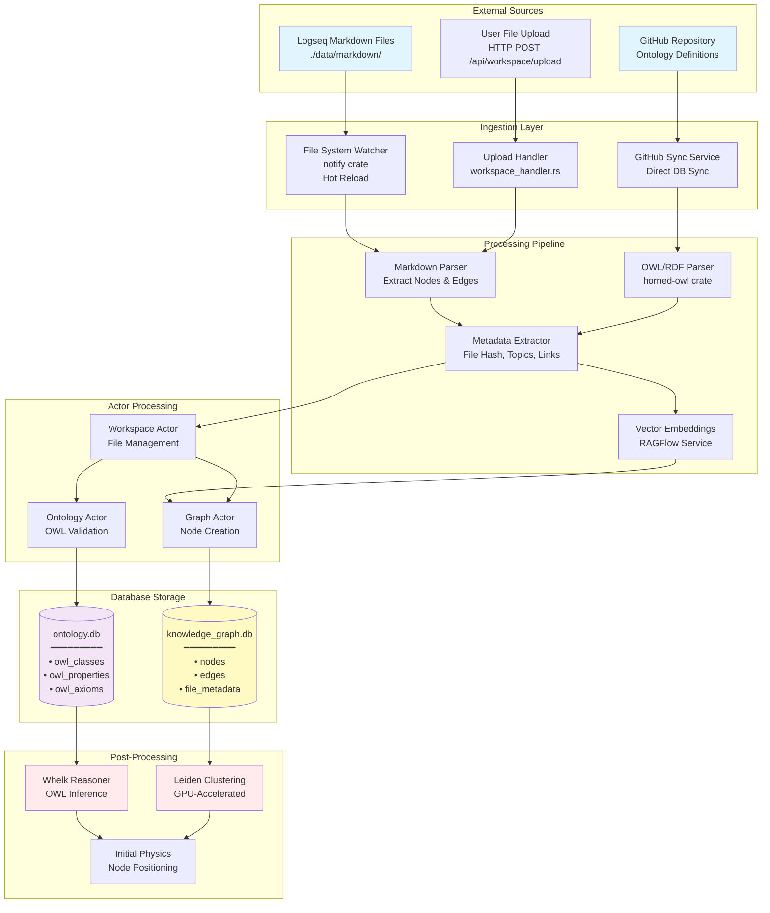
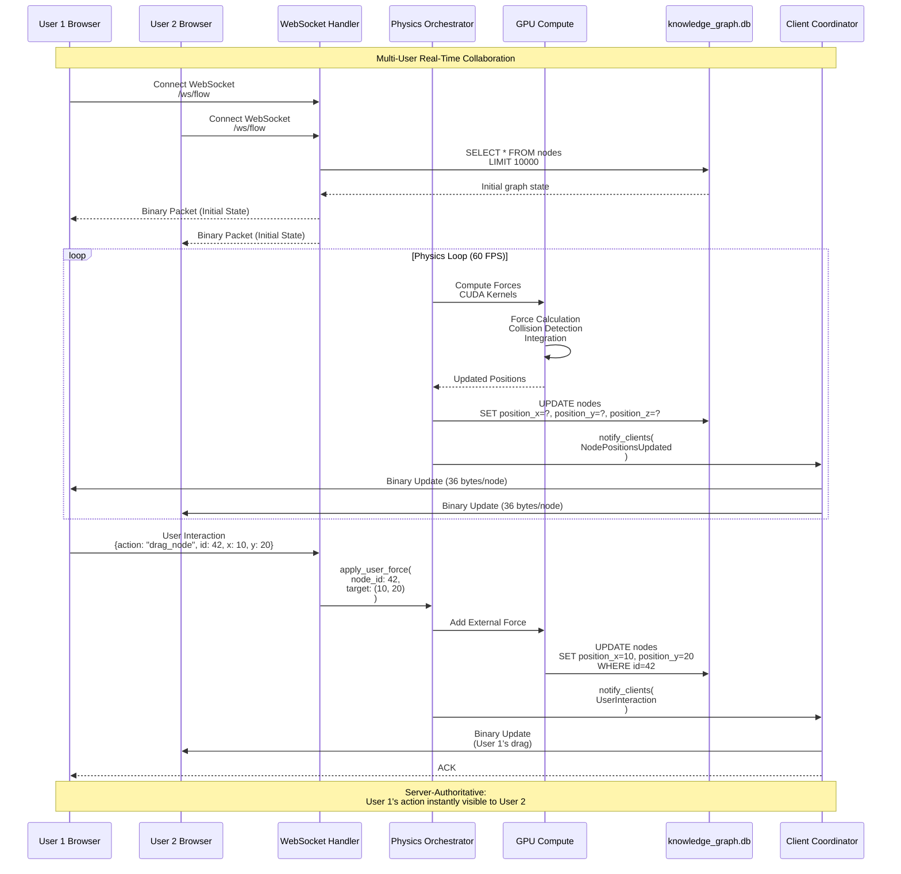
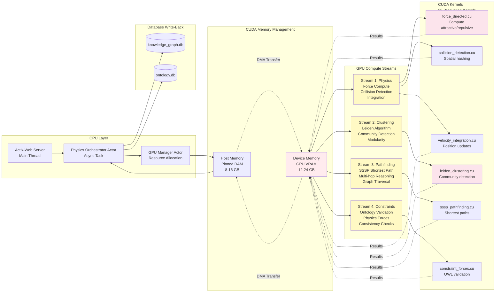
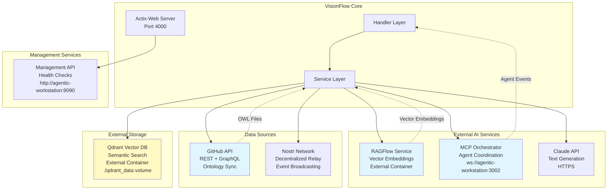
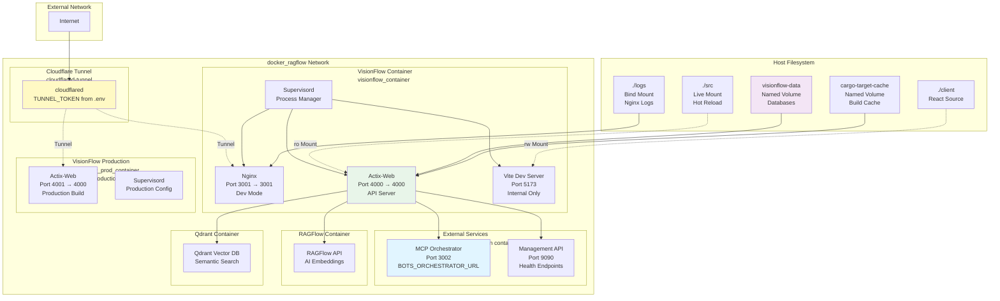
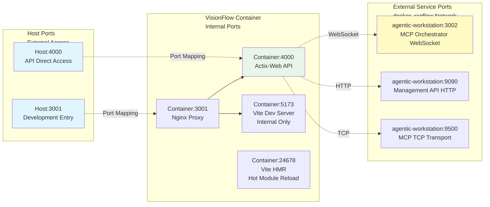
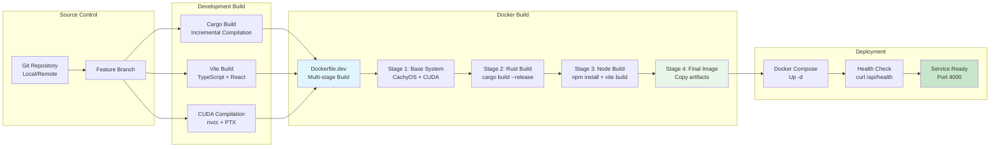

# VisionFlow Data Flow & Deployment Diagrams

**Version:** 1.0.0
**Last Updated:** 2025-10-27
**Focus:** Data pipelines, file processing, and deployment infrastructure

---

## 1. File Processing Pipeline



---

## 2. Real-Time Data Synchronization Flow



---

## 3. GPU Processing Pipeline



---

## 4. External Service Integration



---

## 5. Docker Compose Service Topology



---

## 6. Network Port Mapping



---

## 7. Volume Mount Strategy

```mermaid
graph TB
    subgraph "Host Filesystem"
        H_SRC[./src<br/>Source Code<br/>Read-Only]
        H_CLIENT[./client<br/>React App<br/>Read-Write]
        H_CARGO_TOML[./Cargo.toml<br/>Read-Only]
        H_SCHEMA[./schema<br/>SQL Schemas<br/>Read-Only]
        H_LOGS[./logs<br/>Application Logs<br/>Read-Write]
    end

    subgraph "Docker Named Volumes"
        V_DATA[visionflow-data<br/>Databases<br/>Persistent]
        V_NPM[npm-cache<br/>NPM Packages<br/>Cache]
        V_CARGO_REG[cargo-cache<br/>Cargo Registry<br/>Cache]
        V_CARGO_GIT[cargo-git-cache<br/>Git Dependencies<br/>Cache]
        V_CARGO_TARGET[cargo-target-cache<br/>Build Artifacts<br/>Cache]
    end

    subgraph "Container Paths"
        C_SRC[/app/src<br/>Live Code<br/>Hot Reload]
        C_CLIENT[/app/client<br/>React Source<br/>Vite Build]
        C_DATA[/app/data<br/>3 Databases<br/>WAL Mode]
        C_TARGET[/app/target<br/>Rust Build<br/>Incremental]
        C_NPM[/root/.npm<br/>Package Cache]
        C_LOGS[/app/logs<br/>Application Logs]
    end

    H_SRC -.Bind Mount (ro).-> C_SRC
    H_CLIENT -.Bind Mount (rw).-> C_CLIENT
    H_LOGS -.Bind Mount (rw).-> C_LOGS

    V_DATA --> C_DATA
    V_NPM --> C_NPM
    V_CARGO_TARGET --> C_TARGET

    C_SRC -.Watched by.-> CARGO_WATCH[Cargo Watch<br/>Auto Rebuild]
    C_CLIENT -.Watched by.-> VITE[Vite Dev Server<br/>HMR]

    C_DATA -.Contains.-> DB_FILES[settings.db<br/>knowledge_graph.db<br/>ontology.db]

    style V_DATA fill:#f3e5f5
    style V_CARGO_TARGET fill:#fff9c4
    style C_DATA fill:#fce4ec
    style CARGO_WATCH fill:#e1f5ff
    style VITE fill:#e1f5ff
```

---

## 8. Development vs Production Deployment

```mermaid
flowchart TB
    subgraph "Development Profile<br/>docker-compose --profile dev up"
        DEV_BUILD[Build: Dockerfile.dev<br/>Multi-stage build]

        DEV_SVC[VisionFlow Dev Container<br/>visionflow_container]

        DEV_SUPERVISORD[Supervisord Services:<br/>• Nginx (proxy)<br/>• Actix-Web (API)<br/>• Vite Dev Server (HMR)<br/>• Cargo Watch (auto-rebuild)]

        DEV_VOLUMES[Volumes:<br/>• ./src → /app/src (ro)<br/>• ./client → /app/client (rw)<br/>• visionflow-data (databases)]

        DEV_ENV[Environment:<br/>NODE_ENV=development<br/>RUST_LOG=debug<br/>VITE_DEBUG=true<br/>SYSTEM_NETWORK_PORT=4000]

        DEV_PORTS[Ports:<br/>3001:3001 (Nginx)<br/>4000:4000 (API)]
    end

    subgraph "Production Profile<br/>docker-compose --profile production up"
        PROD_BUILD[Build: Dockerfile.dev<br/>Production Entrypoint]

        PROD_SVC[VisionFlow Prod Container<br/>visionflow_prod_container]

        PROD_SUPERVISORD[Supervisord Services:<br/>• Nginx (prod config)<br/>• Actix-Web (optimized)<br/>• NO Vite (pre-built)<br/>• NO Cargo Watch]

        PROD_VOLUMES[Volumes:<br/>• visionflow-data (databases)<br/>• cargo-target-cache (build)]

        PROD_ENV[Environment:<br/>NODE_ENV=production<br/>RUST_LOG=warn<br/>SYSTEM_NETWORK_PORT=4001]

        PROD_PORTS[Ports:<br/>4000:4000 (API only)]
    end

    DEV_BUILD --> DEV_SVC
    DEV_SVC --> DEV_SUPERVISORD
    DEV_SUPERVISORD --> DEV_VOLUMES
    DEV_VOLUMES --> DEV_ENV
    DEV_ENV --> DEV_PORTS

    PROD_BUILD --> PROD_SVC
    PROD_SVC --> PROD_SUPERVISORD
    PROD_SUPERVISORD --> PROD_VOLUMES
    PROD_VOLUMES --> PROD_ENV
    PROD_ENV --> PROD_PORTS

    style DEV_SVC fill:#e8f5e9
    style PROD_SVC fill:#ffebee
```

---

## 9. CI/CD & Build Pipeline



---

## Key Data Flow Principles

### 1. Server-Authoritative Model
- **Single Source of Truth**: All state in databases
- **No Client Caching**: Clients always fetch from server
- **Real-time Sync**: WebSocket broadcasts to all connected clients

### 2. Binary Protocol Optimization
- **Protocol V2**: 36 bytes per node update
- **80% Bandwidth Reduction**: vs 200-byte JSON updates
- **Sub-10ms Latency**: GPU → Database → WebSocket → Client

### 3. Hot Reload Architecture
- **Source Code**: Live mounted, watched by cargo
- **React App**: Vite HMR on file change
- **Databases**: Persistent volumes, WAL mode for concurrency

### 4. GPU Memory Management
- **Pinned Host Memory**: 8-16 GB for DMA transfers
- **Device Memory**: 12-24 GB VRAM for compute
- **4 Concurrent Streams**: Physics, Clustering, Pathfinding, Constraints

### 5. Multi-Container Coordination
- **docker_ragflow Network**: All services on same bridge
- **Service Discovery**: DNS-based (agentic-workstation:PORT)
- **Health Checks**: HTTP endpoints for orchestration

---

## Performance Characteristics

| Component | Throughput | Latency | Bottleneck |
|-----------|------------|---------|------------|
| **File Ingestion** | 1000 files/sec | 1ms/file | Disk I/O |
| **WebSocket** | 10k updates/sec | <10ms | Network |
| **GPU Physics** | 100k nodes @ 60 FPS | 16ms/frame | GPU Compute |
| **Database Write** | 5k writes/sec | 0.2ms | SQLite WAL |
| **Clustering** | 100k nodes | 50ms | GPU Memory |

---

**For implementation details, see:**
- [ARCHITECTURE.md](../ARCHITECTURE.md) - Hexagonal architecture
- [DATABASE.md](../DATABASE.md) - Database schemas
- [DEVELOPER_GUIDE.md](../DEVELOPER_GUIDE.md) - Development workflows
