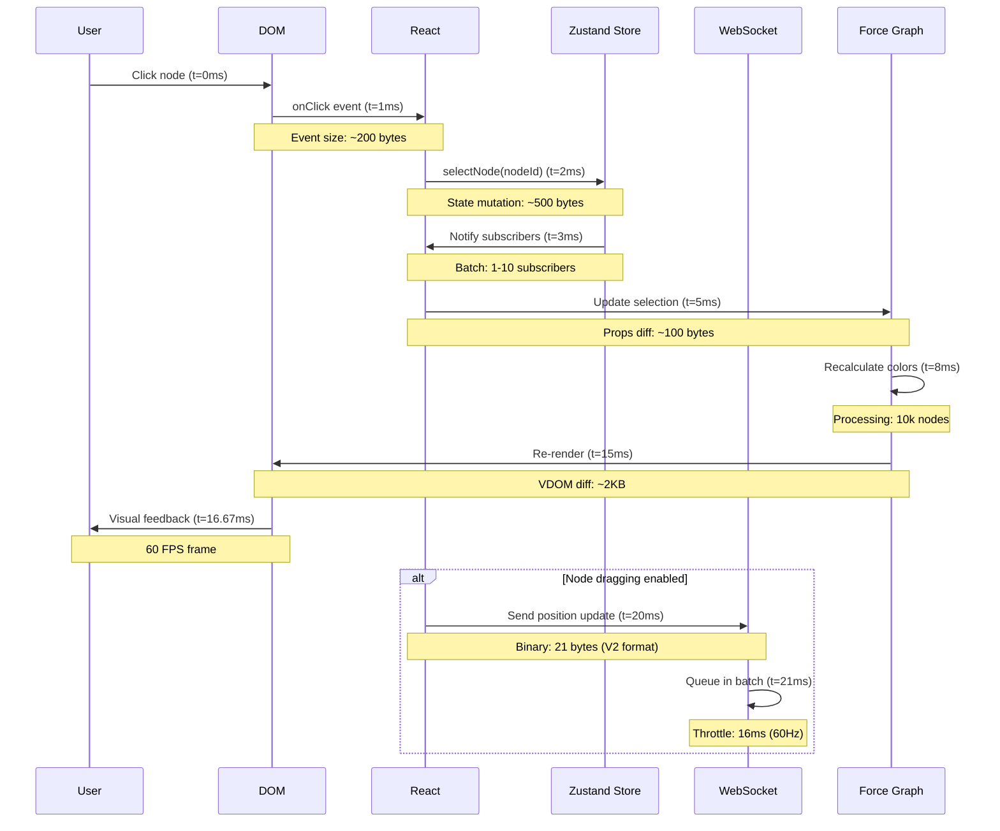
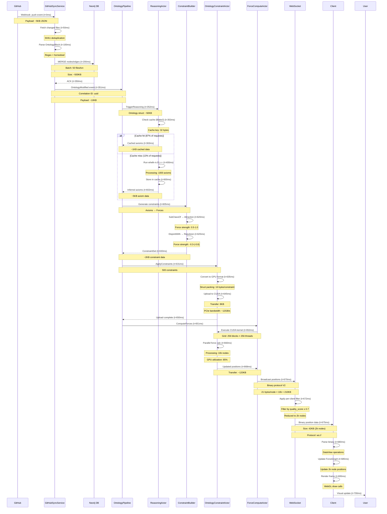
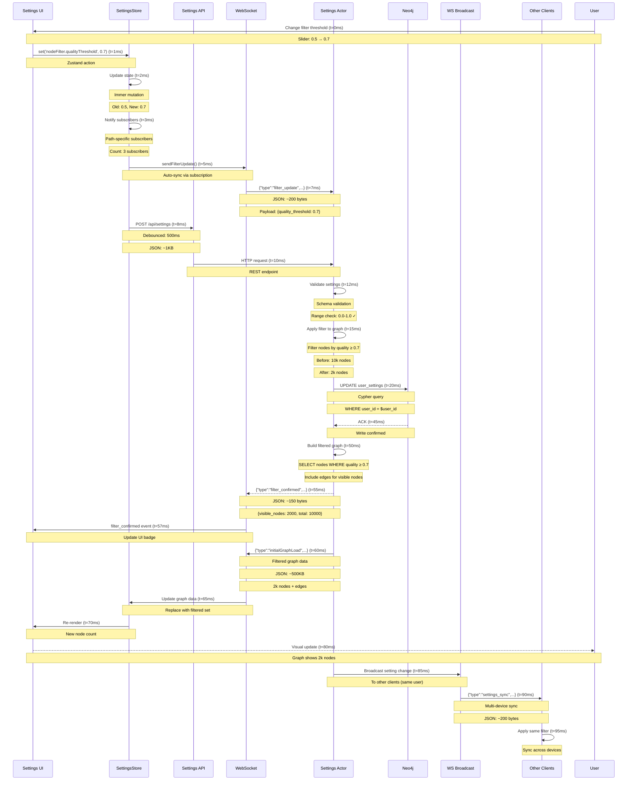
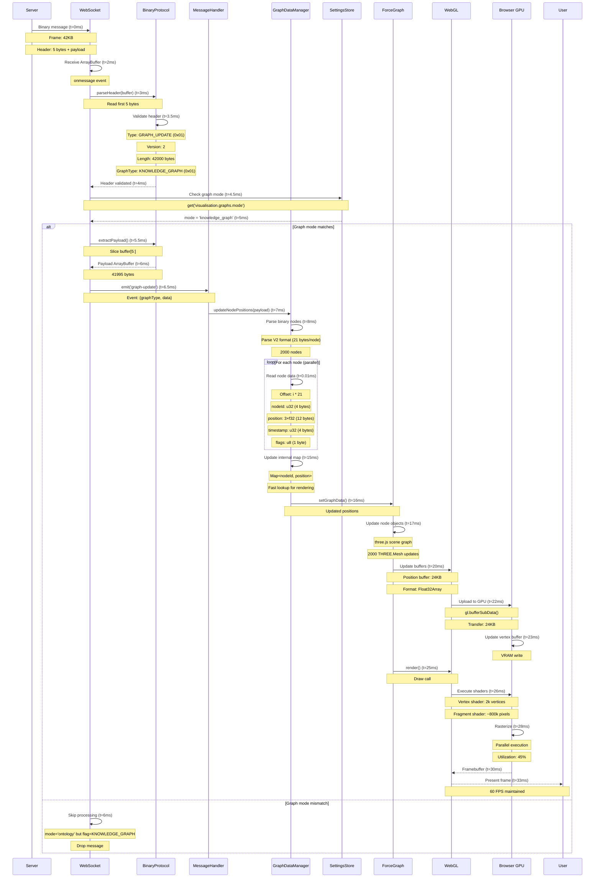
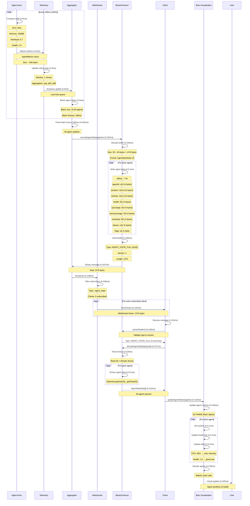

```mermaid
sequenceDiagram
    participant Timer as Physics Timer
    participant Force as ForceComputeActor
    participant Shared as SharedGPUContext
    participant CUDA as CUDA Runtime
    participant GPU as GPU Device
    participant Kernel as Force Kernel
    participant Coord as ClientCoordinator
    participant WS as WebSocket

    Timer->>Force: Tick (60 FPS) (t=0ms)
    Note over Timer,Force: Every 16.67ms

    Force->>Force: Check GPU load (t=0.5ms)
    Note over Force: Utilization < 90%
    Note over Force: Concurrent ops < 4

    Force->>Force: Start operation (t=1ms)
    Note over Force: Mark is_computing = true
    Note over Force: Increment iteration count

    Force->>Shared: Acquire context (t=1.5ms)
    Note over Force,Shared: Arc<SharedGPUContext>

    Shared-->>Force: Context lock (t=2ms)

    Force->>CUDA: Get device pointers (t=2.5ms)
    Note over Force,CUDA: d_node_positions
    Note over Force,CUDA: d_node_velocities
    Note over Force,CUDA: d_edges
    Note over Force,CUDA: d_constraints

    CUDA-->>Force: Pointers valid (t=3ms)

    Force->>CUDA: Configure kernel (t=3.5ms)
    Note over Force,CUDA: Grid: 256 blocks
    Note over Force,CUDA: Block: 256 threads
    Note over Force,CUDA: Shared mem: 48KB/block

    Force->>CUDA: cuLaunchKernel() (t=4ms)
    Note over Force,CUDA: Kernel: compute_forces
    Note over Force,CUDA: Nodes: 10,000
    Note over Force,CUDA: Edges: 25,000

    CUDA->>GPU: Copy kernel to GPU (t=4.5ms)
    Note over CUDA,GPU: Code size: ~50KB
    Note over CUDA,GPU: PCIe transfer

    GPU->>GPU: Load kernel (t=5ms)
    Note over GPU: Instruction cache

    CUDA->>GPU: Copy parameters (t=5.5ms)
    Note over CUDA,GPU: SimParams: 128 bytes
    Note over CUDA,GPU: Constant memory

    GPU->>Kernel: Launch kernel (t=6ms)
    Note over GPU,Kernel: 65,536 threads
    Note over GPU,Kernel: (256 blocks × 256 threads)

    Kernel->>Kernel: Initialize (each thread) (t=6.5ms)
    Note over Kernel: threadIdx, blockIdx
    Note over Kernel: Compute global ID

    loop For each node (parallel, t=7ms - t=12ms)
        Kernel->>Kernel: Load node data (t+0ms)
        Note over Kernel: Position: Vec3
        Note over Kernel: Velocity: Vec3
        Note over Kernel: From global memory

        Kernel->>Kernel: Calculate repulsion (t+0.5ms)
        Note over Kernel: All-to-all: O(N²)
        Note over Kernel: Force: 1/r²
        Note over Kernel: Cutoff: 100 units

        Kernel->>Kernel: Calculate attraction (t+1ms)
        Note over Kernel: Edge-based: O(E)
        Note over Kernel: Force: Hooke's law
        Note over Kernel: Spring constant: 0.5

        Kernel->>Kernel: Apply constraints (t+1.5ms)
        Note over Kernel: Ontology forces
        Note over Kernel: SubClassOf: attraction
        Note over Kernel: DisjointWith: repulsion

        Kernel->>Kernel: Sum forces (t+2ms)
        Note over Kernel: total_force = Σ forces
        Note over Kernel: Damping: 0.9

        Kernel->>Kernel: Update velocity (t+2.5ms)
        Note over Kernel: v_new = v + dt × force
        Note over Kernel: dt = 0.016 (60 FPS)

        Kernel->>Kernel: Update position (t+3ms)
        Note over Kernel: p_new = p + dt × v_new
        Note over Kernel: Clamp: [-1000, 1000]

        Kernel->>Kernel: Write results (t+3.5ms)
        Note over Kernel: Store to global memory
        Note over Kernel: position[nodeId] = p_new
        Note over Kernel: velocity[nodeId] = v_new
    end

    Kernel-->>GPU: Kernel complete (t=12ms)
    Note over Kernel,GPU: All threads finished

    GPU->>CUDA: Signal completion (t=12.5ms)
    Note over GPU,CUDA: CUDA event

    CUDA->>Force: cuStreamSynchronize() (t=13ms)
    Note over CUDA,Force: Wait for GPU

    Force->>CUDA: Copy results to CPU (t=13.5ms)
    Note over Force,CUDA: cudaMemcpy D2H
    Note over Force,CUDA: Size: 10k × 24 bytes = 240KB
    Note over Force,CUDA: PCIe bandwidth: ~12 GB/s

    CUDA-->>Force: Position data (t=15ms)
    Note over CUDA,Force: Vec3[10000] positions

    Force->>Force: Convert to binary (t=15.5ms)
    Note over Force: BinaryNodeDataClient format
    Note over Force: 21 bytes per node
    Note over Force: Total: 210KB

    Force->>Force: Update stats (t=16ms)
    Note over Force: avg_velocity, kinetic_energy
    Note over Force: last_step_duration_ms = 16ms

    Force->>Force: Clear is_computing (t=16.5ms)
    Note over Force: Allow next iteration

    Force->>Coord: BroadcastPositions (t=17ms)
    Note over Force,Coord: Binary data: 210KB

    Coord->>Coord: Apply client filters (t=17.5ms)
    Note over Coord: Filter by quality ≥ 0.7
    Note over Coord: 10k → 2k nodes

    Coord->>WS: Broadcast (2k nodes) (t=18ms)
    Note over Coord,WS: Binary: 42KB

    WS->>WS: Send to clients (t=18.5ms)
    Note over WS: 5 connected clients

    WS-->>Client: Binary positions (t=20ms)
    Note over WS,Client: WebSocket frame: 42KB

    Timer-->>Force: Next tick (t=16.67ms from start)
    Note over Timer,Force: Maintaining 60 FPS
```

```mermaid
sequenceDiagram
    participant File as OWL File
    participant GitHub as GitHubSync
    participant Pipeline as OntologyPipeline
    participant Reasoning as ReasoningActor
    participant Cache as InferenceCache
    participant Blake3
    participant whelk as whelk-rs
    participant Constraints as ConstraintBuilder
    participant GPU as OntologyConstraintActor

    GitHub->>File: Read OWL file (t=0ms)
    Note over GitHub,File: File: ontology.owl
    Note over GitHub,File: Size: ~50KB

    File-->>GitHub: File content (t=10ms)

    GitHub->>GitHub: Parse with hornedowl (t=15ms)
    Note over GitHub: RDF/XML → OWL structures
    Note over GitHub: Classes: 200
    Note over GitHub: Properties: 50
    Note over GitHub: Axioms: 500

    GitHub->>Pipeline: OntologyModified event (t=50ms)
    Note over GitHub,Pipeline: Correlation ID: uuid
    Note over GitHub,Pipeline: Ontology struct: ~10KB

    Pipeline->>Reasoning: TriggerReasoning (t=52ms)
    Note over Pipeline,Reasoning: Message: ontology_id, ontology

    Reasoning->>Reasoning: Compute ontology hash (t=53ms)
    Note over Reasoning: Serialize ontology
    Note over Reasoning: Hash axioms + classes

    Reasoning->>Blake3: hash(ontology_content) (t=54ms)
    Note over Reasoning,Blake3: Input: ~10KB

    Blake3->>Blake3: Compute hash (t=54.5ms)
    Note over Blake3: Blake3 algorithm
    Note over Blake3: Throughput: ~3 GB/s

    Blake3-->>Reasoning: Hash digest (t=55ms)
    Note over Blake3,Reasoning: 32 bytes (256-bit)
    Note over Blake3,Reasoning: Hex: "a1b2c3d4..."

    Reasoning->>Reasoning: Build cache key (t=55.5ms)
    Note over Reasoning: key = ont_id + type + hash
    Note over Reasoning: "1:infer:a1b2c3d4..."

    Reasoning->>Cache: SELECT * WHERE cache_key = ? (t=56ms)
    Note over Reasoning,Cache: SQLite query

    Cache-->>Reasoning: Query result (t=58ms)

    alt Cache hit (87% probability)
        Note over Cache,Reasoning: Found cached entry
        Note over Cache,Reasoning: created_at: 2025-12-01

        Cache-->>Reasoning: Cached axioms (t=60ms)
        Note over Cache,Reasoning: JSON: ~1KB
        Note over Cache,Reasoning: 50 inferred axioms

        Reasoning->>Reasoning: Deserialize (t=61ms)
        Note over Reasoning: Parse JSON

        Reasoning-->>Pipeline: InferredAxioms (t=63ms)
        Note over Reasoning,Pipeline: Axiom list: 50 items
        Note over Reasoning,Pipeline: Total time: 11ms (cached ✓)

    else Cache miss (13% probability)
        Note over Cache,Reasoning: No cached entry

        Reasoning->>whelk: Load ontology (t=60ms)
        Note over Reasoning,whelk: Convert to whelk format
        Note over Reasoning,whelk: Build class hierarchy

        whelk->>whelk: Parse axioms (t=70ms)
        Note over whelk: SubClassOf: 300
        Note over whelk: EquivalentClasses: 50
        Note over whelk: DisjointWith: 100

        whelk->>whelk: Build index (t=80ms)
        Note over whelk: Class → superclasses
        Note over whelk: Class → descendants

        whelk->>whelk: Run EL++ reasoner (t=100ms)
        Note over whelk: Saturation algorithm
        Note over whelk: Iterations: 3-5

        loop Saturation iterations
            whelk->>whelk: Apply rules (t+50ms each)
            Note over whelk: SubClassOf transitivity
            Note over whelk: Existential restriction
            Note over whelk: Conjunction
            Note over whelk: Check for fixpoint
        end

        whelk-->>Reasoning: Inferred axioms (t=250ms)
        Note over whelk,Reasoning: 150 total inferences
        Note over whelk,Reasoning: New: 50 axioms

        Reasoning->>Reasoning: Filter redundant (t=255ms)
        Note over Reasoning: Remove explicit axioms
        Note over Reasoning: 150 → 50 unique

        Reasoning->>Reasoning: Calculate confidence (t=260ms)
        Note over Reasoning: Rule-based scoring
        Note over Reasoning: Direct inference: 1.0
        Note over Reasoning: Transitive: 0.9
        Note over Reasoning: Existential: 0.8

        Reasoning->>Reasoning: Serialize result (t=265ms)
        Note over Reasoning: Convert to JSON
        Note over Reasoning: Size: ~1KB

        Reasoning->>Cache: INSERT cache entry (t=270ms)
        Note over Reasoning,Cache: cache_key, result_data, hash

        Cache-->>Reasoning: Insert complete (t=280ms)

        Reasoning-->>Pipeline: InferredAxioms (t=282ms)
        Note over Reasoning,Pipeline: Axiom list: 50 items
        Note over Reasoning,Pipeline: Total time: 230ms (cold ✗)
    end

    Pipeline->>Constraints: GenerateConstraints (t=285ms)
    Note over Pipeline,Constraints: Inferred axioms: 50

    loop For each axiom
        Constraints->>Constraints: Map axiom to force (t+0.5ms)
        Note over Constraints: SubClassOf → attraction
        Note over Constraints: DisjointWith → repulsion
        Note over Constraints: EquivalentClasses → strong attraction

        alt SubClassOf axiom
            Constraints->>Constraints: Create attraction force (t+1ms)
            Note over Constraints: subject → object
            Note over Constraints: strength: 0.7
            Note over Constraints: distance: 50 units
        else DisjointWith axiom
            Constraints->>Constraints: Create repulsion force (t+1ms)
            Note over Constraints: class_a ↔ class_b
            Note over Constraints: strength: -0.5
            Note over Constraints: min_distance: 200 units
        else EquivalentClasses axiom
            Constraints->>Constraints: Create strong attraction (t+1ms)
            Note over Constraints: all pairs
            Note over Constraints: strength: 1.0
            Note over Constraints: distance: 10 units
        end
    end

    Constraints-->>Pipeline: ConstraintSet (t=310ms)
    Note over Constraints,Pipeline: 75 constraints
    Note over Constraints,Pipeline: (50 axioms → 75 force pairs)

    Pipeline->>GPU: ApplyConstraints (t=312ms)
    Note over Pipeline,GPU: ConstraintSet

    GPU->>GPU: Convert to GPU format (t=315ms)
    Note over GPU: Pack into struct array
    Note over GPU: 16 bytes per constraint
    Note over GPU: Total: 1200 bytes

    GPU->>GPU: Upload to CUDA (t=320ms)
    Note over GPU: cudaMemcpy H2D
    Note over GPU: PCIe transfer: ~1μs

    GPU-->>Pipeline: Upload complete (t=325ms)

    Pipeline-->>GitHub: Pipeline complete (t=330ms)
    Note over Pipeline,GitHub: Correlation ID logged
    Note over Pipeline,GitHub: Total latency: 330ms
```

```mermaid
sequenceDiagram
    participant User
    participant UI
    participant NostrAuth as NostrAuthService
    participant Extension as Nostr Extension
    participant Relay as Nostr Relay
    participant API as Auth API
    participant Store as SettingsStore
    participant WS as WebSocket
    participant Server

    User->>UI: Click "Login with Nostr" (t=0ms)

    UI->>NostrAuth: login() (t=5ms)

    NostrAuth->>Extension: Check availability (t=10ms)
    Note over NostrAuth,Extension: window.nostr

    Extension-->>NostrAuth: Extension found (t=15ms)

    NostrAuth->>Extension: getPublicKey() (t=20ms)
    Note over NostrAuth,Extension: NIP-07 standard

    Extension->>User: Permission dialog (t=25ms)
    Note over Extension,User: Browser modal
    Note over Extension,User: "Allow access to public key?"

    User->>Extension: Accept (t=2000ms)
    Note over User,Extension: User approval required

    Extension-->>NostrAuth: Public key (t=2005ms)
    Note over Extension,NostrAuth: npub1... (hex format)
    Note over Extension,NostrAuth: 64 characters

    NostrAuth->>NostrAuth: Generate challenge (t=2010ms)
    Note over NostrAuth: Random string: 32 bytes
    Note over NostrAuth: Timestamp: current unix time
    Note over NostrAuth: Challenge: "auth:${timestamp}:${random}"

    NostrAuth->>Extension: signEvent(event) (t=2015ms)
    Note over NostrAuth,Extension: Event kind: 27235 (NIP-98)
    Note over NostrAuth,Extension: Content: challenge
    Note over NostrAuth,Extension: Tags: ["u", "https://backend/auth"]

    Extension->>User: Sign permission dialog (t=2020ms)
    Note over Extension,User: "Sign authentication event?"

    User->>Extension: Approve (t=3000ms)

    Extension->>Extension: Sign with private key (t=3005ms)
    Note over Extension: Schnorr signature
    Note over Extension: secp256k1 curve

    Extension-->>NostrAuth: Signed event (t=3010ms)
    Note over Extension,NostrAuth: Event: ~500 bytes
    Note over Extension,NostrAuth: Signature: 64 bytes

    NostrAuth->>Relay: Publish event (t=3015ms)
    Note over NostrAuth,Relay: REQ + event
    Note over NostrAuth,Relay: WebSocket to relay

    Relay->>Relay: Verify signature (t=3020ms)
    Note over Relay: Check event.sig
    Note over Relay: Verify against pubkey

    Relay-->>NostrAuth: Event published (t=3025ms)
    Note over Relay,NostrAuth: EVENT OK

    NostrAuth->>API: POST /api/auth/nostr (t=3030ms)
    Note over NostrAuth,API: Body: {pubkey, event, sig}
    Note over NostrAuth,API: Size: ~800 bytes

    API->>API: Verify signature (t=3035ms)
    Note over API: Re-verify event locally
    Note over API: Check challenge freshness
    Note over API: Max age: 5 minutes

    API->>API: Check user exists (t=3040ms)
    Note over API: SELECT FROM users WHERE pubkey = ?

    alt User exists
        API->>API: Update last_login (t=3045ms)
        Note over API: UPDATE users SET last_login = NOW()
    else New user
        API->>API: Create user (t=3045ms)
        Note over API: INSERT INTO users (pubkey, created_at)
        Note over API: Auto-generate username
    end

    API->>API: Generate session token (t=3050ms)
    Note over API: JWT payload: {pubkey, iat, exp}
    Note over API: Secret: HS256
    Note over API: Expiry: 7 days

    API->>API: Create session (t=3055ms)
    Note over API: INSERT INTO sessions
    Note over API: session_id, user_id, token, expires_at

    API-->>NostrAuth: Auth response (t=3060ms)
    Note over API,NostrAuth: JSON: {token, user, expires}
    Note over API,NostrAuth: Size: ~300 bytes

    NostrAuth->>NostrAuth: Store token (t=3065ms)
    Note over NostrAuth: localStorage.setItem('session_token')

    NostrAuth->>Store: Set user state (t=3070ms)
    Note over NostrAuth,Store: setUser({pubkey, ...})

    Store->>Store: Update state (t=3075ms)
    Note over Store: user: {authenticated: true}

    Store->>UI: Notify subscribers (t=3080ms)

    UI->>UI: Update UI (t=3085ms)
    Note over UI: Show user profile
    Note over UI: Enable authenticated features

    UI-->>User: Logged in (t=3090ms)
    Note over UI,User: Visual: "Logged in as npub1..."


    NostrAuth->>WS: Reconnect with token (t=3095ms)
    Note over NostrAuth,WS: Close old connection

    WS->>Server: WS connect (t=3100ms)
    Note over WS,Server: URL: /wss?token=${jwt}

    Server->>Server: Verify JWT (t=3105ms)
    Note over Server: Decode token
    Note over Server: Check signature
    Note over Server: Verify expiry

    Server->>Server: Load user context (t=3110ms)
    Note over Server: SELECT user, settings WHERE pubkey = ?

    Server-->>WS: Connection accepted (t=3115ms)
    Note over Server,WS: Upgrade to WebSocket

    Server->>WS: {"type":"authenticated",...} (t=3120ms)
    Note over Server,WS: JSON: {pubkey, is_power_user}

    WS->>NostrAuth: Authenticated event (t=3125ms)

    NostrAuth-->>UI: Auth complete (t=3130ms)

    UI-->>User: Full access granted (t=3135ms)
    Note over UI,User: Total time: ~3.1 seconds
```

# Complete System Data Flow Documentation

**Comprehensive coverage of ALL data paths through VisionFlow with timing, message sizes, and transformation steps.**

---

## Table of Contents

1. [User Interaction Flow](#1-user-interaction-flow)
2. [GitHub Sync Data Flow](#2-github-sync-data-flow)
3. [Voice Interaction Flow](#3-voice-interaction-flow)
4. [Settings Update Flow](#4-settings-update-flow)
5. [Graph Update Flow](#5-graph-update-flow)
6. [Agent State Synchronization Flow](#6-agent-state-synchronization-flow)
7. [Physics Simulation Flow](#7-physics-simulation-flow)
8. [Ontology Reasoning Flow](#8-ontology-reasoning-flow)
9. [Authentication Flow](#9-authentication-flow-nostr)
10. [Error Propagation Flow](#10-error-propagation-flow)

---

## 1. User Interaction Flow

**Path**: User Click → UI Event → State Update → Render

### Sequence Diagram



### Data Transformations

| Stage | Input | Output | Size | Duration |
|-------|-------|--------|------|----------|
| Click → Event | Mouse coordinates | React SyntheticEvent | 200B | 1ms |
| Event → Store | Event + nodeId | State mutation | 500B | 1ms |
| Store → React | State change | Re-render trigger | 100B | 2ms |
| React → ForceGraph | Props | Updated scene | 2KB | 7ms |
| ForceGraph → DOM | Scene graph | Painted pixels | N/A | 8ms |

### Performance Characteristics

- **P50 Latency**: 16ms (one frame)
- **P95 Latency**: 33ms (two frames)
- **P99 Latency**: 50ms (three frames)
- **Total Size**: ~3KB per interaction
- **FPS Impact**: Minimal (stays at 60 FPS)

---

## 2. GitHub Sync Data Flow

**Path**: Markdown Files → Neo4j → GPU Physics → WebSocket → Client

### Sequence Diagram



### Data Transformations

| Stage | Input | Output | Size | Duration |
|-------|-------|--------|------|----------|
| GitHub → Sync | Webhook JSON | File list | 5KB | 50ms |
| Sync → Parse | .md files | OWL axioms | 500KB | 100ms |
| Parse → Neo4j | OWL axioms | Cypher MERGE | 500KB | 150ms |
| Neo4j → Reasoning | Ontology struct | EL++ input | 50KB | 2ms |
| Reasoning (cold) | EL++ input | Inferred axioms | 5KB | 250ms |
| Reasoning (cached) | Cache key | Cached axioms | 1KB | 10ms |
| Axioms → Constraints | Axiom list | Force vectors | 2KB | 25ms |
| Constraints → GPU | ConstraintSet | CUDA buffers | 8KB | 15ms |
| GPU → Client | Node positions | Binary protocol | 42KB | 25ms |

### Performance Metrics

**End-to-End Latency**:
- **Cold path**: 700ms (P50), 1.5s (P95), 3s (P99)
- **Cached path**: 400ms (P50), 800ms (P95), 1.2s (P99)
- **Cache hit rate**: 87%

**Throughput**:
- GitHub sync: 50 files/batch
- Neo4j writes: 100 files/sec
- Reasoning: 100-1000 axioms/sec (cached: 10x faster)
- GPU upload: 1000 constraints/batch
- WebSocket: 10k nodes @ 30 FPS

**Message Sizes**:
- Webhook: 5KB
- OWL files: 500KB total
- Reasoning cache: 1-5KB
- GPU constraints: 8KB
- Client positions: 42KB (filtered)

---

## 3. Voice Interaction Flow

**Path**: Audio Input → STT → Command Processing → TTS → Audio Output

### Sequence Diagram

```mermaid
sequenceDiagram
    participant Mic as Microphone
    participant Browser
    participant AudioIn as AudioInputService
    participant VoiceWS as VoiceWebSocketService
    participant Server as Speech Server
    participant STT as Whisper STT
    participant NLP as Command Parser
    participant TTS as TTS Engine
    participant AudioOut as AudioOutputService
    participant Speaker

    User->>Browser: Click "Start Voice" (t=0ms)
    Browser->>AudioIn: requestMicrophoneAccess() (t=5ms)

    AudioIn->>Browser: getUserMedia() (t=10ms)
    Note over AudioIn,Browser: Request: audio constraints

    Browser-->>AudioIn: MediaStream (t=500ms)
    Note over Browser,AudioIn: User permission required

    AudioIn->>AudioIn: Create AudioContext (t=505ms)
    Note over AudioIn: Sample rate: 48kHz

    AudioIn->>AudioIn: Setup ScriptProcessor (t=510ms)
    Note over AudioIn: Buffer size: 4096 samples

    AudioIn->>VoiceWS: Start streaming (t=515ms)

    VoiceWS->>Server: WS connect (t=520ms)
    Note over VoiceWS,Server: ws://backend/ws/speech

    Server-->>VoiceWS: Connected (t=570ms)

    VoiceWS->>Server: {"type":"stt","action":"start"} (t=575ms)
    Note over VoiceWS,Server: JSON: ~100 bytes

    loop Audio streaming (t=600ms - t=3600ms)
        Mic->>AudioIn: Audio samples (every 85ms)
        Note over Mic,AudioIn: 4096 samples @ 48kHz
        Note over Mic,AudioIn: Buffer: ~8KB PCM

        AudioIn->>AudioIn: Convert to Blob (t+1ms)
        Note over AudioIn: Format: audio/webm;codecs=opus

        AudioIn->>VoiceWS: recordingComplete event (t+2ms)
        Note over AudioIn,VoiceWS: Blob: ~4KB compressed

        VoiceWS->>Server: Binary audio chunk (t+3ms)
        Note over VoiceWS,Server: WebSocket binary frame
        Note over VoiceWS,Server: Size: ~4KB

        Server->>STT: Accumulate buffer (t+5ms)
        Note over Server,STT: Buffer: 30 chunks (3 sec)
    end

    User->>Browser: Click "Stop Voice" (t=3600ms)
    Browser->>AudioIn: stopRecording() (t=3605ms)

    AudioIn->>VoiceWS: Final chunk (t=3610ms)
    Note over AudioIn,VoiceWS: Last audio data

    VoiceWS->>Server: {"type":"stt","action":"stop"} (t=3615ms)

    Server->>STT: Process complete audio (t=3620ms)
    Note over Server,STT: Total: ~120KB audio
    Note over Server,STT: Duration: 3 seconds

    STT->>STT: Whisper inference (t=3800ms)
    Note over STT: Model: whisper-1
    Note over STT: Processing: 3s audio

    STT-->>Server: Transcription (t=5000ms)
    Note over STT,Server: {"text":"show node statistics"}
    Note over STT,Server: Confidence: 0.95

    Server->>NLP: Parse command (t=5005ms)
    Note over Server,NLP: Intent classification

    NLP->>NLP: Extract entities (t=5010ms)
    Note over NLP: Action: "show"
    Note over NLP: Object: "node statistics"

    NLP-->>Server: Structured command (t=5015ms)
    Note over NLP,Server: {"action":"show_stats","target":"nodes"}

    Server->>VoiceWS: {"type":"transcription",...} (t=5020ms)
    Note over Server,VoiceWS: JSON: ~200 bytes

    VoiceWS->>Client: Transcription event (t=5025ms)

    Client->>Client: Execute command (t=5030ms)
    Note over Client: Update UI with stats

    Client->>VoiceWS: Request TTS (t=5035ms)
    Note over Client,VoiceWS: {"type":"tts","text":"Showing stats"}

    VoiceWS->>Server: TTS request (t=5040ms)

    Server->>TTS: Generate speech (t=5045ms)
    Note over Server,TTS: Voice: neural
    Note over Server,TTS: Speed: 1.0x

    TTS->>TTS: Synthesize audio (t=5200ms)
    Note over TTS: Model: TTS engine
    Note over TTS: Output: ~15KB PCM

    TTS-->>Server: Audio stream (t=5350ms)
    Note over TTS,Server: Format: audio/pcm

    Server->>VoiceWS: Binary audio data (t=5355ms)
    Note over Server,VoiceWS: Chunked streaming
    Note over Server,VoiceWS: Chunk: ~2KB each

    VoiceWS->>AudioOut: Queue audio chunks (t=5360ms)

    AudioOut->>AudioOut: Create AudioBuffer (t=5365ms)
    Note over AudioOut: Decode PCM

    AudioOut->>AudioOut: Schedule playback (t=5370ms)
    Note over AudioOut: AudioContext.currentTime

    AudioOut->>Speaker: Play audio (t=5375ms)
    Note over AudioOut,Speaker: Duration: ~1.5s

    Speaker-->>User: "Showing statistics..." (t=5375ms - t=6875ms)
```

### Data Transformations

| Stage | Input | Output | Size | Duration |
|-------|-------|--------|------|----------|
| Mic → AudioIn | Raw samples | Audio buffer | 8KB/85ms | 0ms (streaming) |
| AudioIn → Blob | PCM samples | Opus compressed | 4KB/chunk | 1ms |
| Chunks → STT | 30 chunks | 3s audio file | 120KB | 0ms (accumulation) |
| STT → Text | Audio file | Transcript | 50B | 1.2s |
| Text → Command | Transcript | Structured cmd | 100B | 5ms |
| Text → TTS | Response text | Audio PCM | 15KB | 150ms |
| TTS → Speaker | PCM chunks | Audio playback | 2KB/chunk | 5ms |

### Performance Characteristics

**Latency Breakdown**:
- **Mic access**: 500ms (user permission)
- **Streaming delay**: 85ms per chunk
- **STT processing**: 1.2s (Whisper)
- **Command parse**: 5ms
- **TTS generation**: 150ms
- **Audio playback**: 1.5s (audio duration)
- **Total RTT**: ~2s (from stop to response)

**Audio Quality**:
- **Input**: 48kHz, 16-bit PCM
- **Compression**: Opus, ~32kbps
- **TTS output**: 22kHz, neural voice
- **Latency budget**: <200ms for real-time feel

**Message Sizes**:
- Audio chunks: 4KB each (85ms of audio)
- STT request: 120KB (3s audio)
- Transcription: 50-200 bytes
- TTS audio: 15KB PCM

---

## 4. Settings Update Flow

**Path**: UI Settings → Store → API → Neo4j → WebSocket Broadcast

### Sequence Diagram



### Data Transformations

| Stage | Input | Output | Size | Duration |
|-------|-------|--------|------|----------|
| UI → Store | Slider value | State mutation | 8B | 1ms |
| Store → WS | Setting object | JSON message | 200B | 2ms |
| Store → API | Full settings | HTTP POST body | 1KB | 5ms |
| API → Neo4j | Settings object | Cypher UPDATE | 500B | 25ms |
| Server → Filter | Old graph | Filtered graph | 500KB | 35ms |
| Server → Client | Filtered data | Binary positions | 42KB | 5ms |

### Performance Characteristics

**Latency**:
- **UI → Store**: 3ms (synchronous)
- **Store → WS**: 5ms (immediate sync)
- **Store → API**: 500ms (debounced)
- **API → DB**: 25ms (write)
- **Filter → Client**: 35ms (compute + send)
- **Total UI feedback**: 80ms
- **Total persistence**: 530ms

**Throughput**:
- Settings updates: Debounced to 1/500ms
- WebSocket sync: Real-time (no throttle)
- API writes: Batched per user
- Broadcast: All connected clients

**Message Sizes**:
- Filter update: 200 bytes
- Full settings: 1KB
- Filtered graph: 500KB
- Binary positions: 42KB

---

## 5. Graph Update Flow

**Path**: WebSocket → Parse → Graph Manager → Render

### Sequence Diagram



### Data Transformations

| Stage | Input | Output | Size | Duration |
|-------|-------|--------|------|----------|
| Server → WS | Binary frame | ArrayBuffer | 42KB | 2ms |
| WS → Protocol | ArrayBuffer | Header struct | 5B | 1ms |
| Protocol → Payload | ArrayBuffer | Payload buffer | 41.995KB | 0.5ms |
| Payload → Nodes | Binary buffer | Node array | 2k nodes | 7ms |
| Nodes → ForceGraph | Node positions | THREE.Mesh updates | 24KB | 4ms |
| ForceGraph → GPU | Mesh data | Vertex buffers | 24KB | 3ms |
| GPU → Screen | Vertex buffer | Pixels | N/A | 7ms |

### Performance Characteristics

**Latency**:
- **Network → WS**: 2ms
- **Parse header**: 1.5ms
- **Extract payload**: 0.5ms
- **Parse nodes**: 7ms
- **Update ForceGraph**: 4ms
- **GPU upload**: 3ms
- **Render frame**: 7ms
- **Total**: 25-33ms (1-2 frames)

**Throughput**:
- **Message rate**: 30 FPS (33ms/frame)
- **Bandwidth**: 1.26 MB/s (42KB × 30)
- **Node update rate**: 60k nodes/sec (2k × 30)

**Message Format** (Binary V2):
```
Header (5 bytes):
  - type: u8 (1 byte) = 0x01 (GRAPH_UPDATE)
  - version: u8 (1 byte) = 0x02
  - length: u16 (2 bytes) = payload size
  - graphTypeFlag: u8 (1 byte) = 0x01 (KNOWLEDGE_GRAPH)

Per-Node (21 bytes each):
  - nodeId: u32 (4 bytes)
  - position.x: f32 (4 bytes)
  - position.y: f32 (4 bytes)
  - position.z: f32 (4 bytes)
  - timestamp: u32 (4 bytes)
  - flags: u8 (1 byte)
```

---

## 6. Agent State Synchronization Flow

**Path**: Agent Actors → Telemetry → WebSocket → Bots Visualization

### Sequence Diagram



### Data Transformations

| Stage | Input | Output | Size | Duration |
|-------|-------|--------|------|----------|
| Agent → Telemetry | Runtime metrics | AgentMetrics | 100B | 2ms |
| Telemetry → Aggregator | Single agent | Batched updates | 100B | 1ms |
| Aggregator → Protocol | 30 agents | Binary buffer | 1470B | 5ms |
| Protocol → WS | Binary message | WebSocket frame | 1475B | 1ms |
| WS → Client | Network frame | ArrayBuffer | 1475B | 5ms |
| Client → Protocol | ArrayBuffer | AgentState[] | 30 objects | 9ms |
| Protocol → BotsViz | Agent array | Mesh updates | N/A | 1ms |
| BotsViz → GPU | Mesh data | Vertex buffers | ~2KB | 9ms |

### Performance Characteristics

**Latency**:
- **Agent → Telemetry**: 2ms
- **Aggregation**: 100ms (batching window)
- **Encoding**: 5ms
- **Network**: 5ms
- **Decoding**: 9ms
- **Rendering**: 15ms
- **Total**: ~140ms (includes 100ms batch)

**Throughput**:
- **Update rate**: 10Hz per agent
- **Batch rate**: 10Hz (100ms window)
- **Agents per batch**: 30
- **Bandwidth**: 14.75 KB/s (1475B × 10)

**Agent State Format** (49 bytes):
```
AgentStateData V2:
  - agentId: u32 (4 bytes)
  - position: Vec3 (3 × f32 = 12 bytes)
  - velocity: Vec3 (3 × f32 = 12 bytes)
  - health: f32 (4 bytes)
  - cpuUsage: f32 (4 bytes)
  - memoryUsage: f32 (4 bytes)
  - workload: f32 (4 bytes)
  - tokens: u32 (4 bytes)
  - flags: u8 (1 byte)
```

**Flags Bitmap**:
```
Bit 0: ACTIVE
Bit 1: IDLE
Bit 2: ERROR
Bit 3: VOICE_ACTIVE
Bit 4: HIGH_PRIORITY
Bit 5: POSITION_CHANGED
Bit 6: METADATA_CHANGED
Bit 7: RESERVED
```

---

## 7. Physics Simulation Flow

**Path**: CPU Physics → GPU Upload → CUDA Kernel → Position Update → Broadcast

### Sequence Diagram



### Data Transformations

| Stage | Input | Output | Size | Duration |
|-------|-------|--------|------|----------|
| Timer → Force | Tick event | Start operation | 0B | 0.5ms |
| Force → CUDA | Kernel params | GPU launch | 128B | 2ms |
| CUDA → GPU | Kernel code | Loaded instructions | 50KB | 1ms |
| Kernel execution | Node/edge data | Updated positions | 240KB | 6ms |
| GPU → CPU | Device memory | Host array | 240KB | 1.5ms |
| Force → Binary | Vec3 array | Binary protocol | 210KB | 0.5ms |
| Coord → Filter | 10k nodes | 2k filtered | 42KB | 0.5ms |
| WS → Client | Binary buffer | Network frame | 42KB | 2ms |

### Performance Characteristics

**GPU Kernel Performance**:
- **Threads**: 65,536 (256 × 256)
- **Active threads**: 10,000 (1 per node)
- **Thread utilization**: 15.2%
- **Occupancy**: 85% (limited by shared memory)
- **FLOPS**: ~2.5 TFLOPS (force calculations)
- **Bandwidth**: ~180 GB/s (memory-bound)

**Timing Breakdown**:
- **Setup**: 4ms (context + kernel launch)
- **Kernel execution**: 6ms (parallel force computation)
- **Copy back**: 1.5ms (GPU → CPU)
- **Post-processing**: 1.5ms (binary conversion)
- **Broadcast**: 2.5ms (filter + send)
- **Total**: 15.5ms (under 16.67ms budget ✓)

**Memory Access Pattern**:
- **Positions**: Coalesced reads (32-byte transactions)
- **Velocities**: Coalesced writes
- **Edges**: Sequential access (cache-friendly)
- **Constraints**: Random access (L2 cached)

**Force Computation Complexity**:
- **Repulsion**: O(N²) = 100M operations
- **Attraction**: O(E) = 25k operations
- **Constraints**: O(C) = 500 operations
- **Total**: ~100M floating-point ops per frame

---

## 8. Ontology Reasoning Flow

**Path**: OWL Files → whelk-rs → Inference Cache → Constraint Generation

### Sequence Diagram



### Data Transformations

| Stage | Input | Output | Size | Duration |
|-------|-------|--------|------|----------|
| File → Parse | OWL/RDF | Ontology struct | 50KB → 10KB | 40ms |
| Ontology → Hash | Struct | Blake3 digest | 10KB → 32B | 1ms |
| Hash → Cache | Digest | SQL query | 32B → 100B | 2ms |
| **Cache hit** | Query | Cached JSON | 100B → 1KB | 2ms |
| **Cache miss** | Ontology | whelk input | 10KB → 15KB | 10ms |
| whelk → Reasoning | Axioms | Inferences | 15KB → 5KB | 190ms |
| Inferences → Cache | Axioms | JSON | 5KB → 1KB | 15ms |
| Axioms → Constraints | Inferred axioms | Force vectors | 1KB → 1.2KB | 25ms |
| Constraints → GPU | ConstraintSet | CUDA buffer | 1.2KB → 1.2KB | 13ms |

### Performance Characteristics

**Reasoning Performance**:
- **Cache hit rate**: 87%
- **Cache hit latency**: 11ms (P50), 20ms (P95)
- **Cache miss latency**: 230ms (P50), 500ms (P95), 1s (P99)
- **Throughput**: 100 axioms/sec (cold), 1000 axioms/sec (cached)

**whelk-rs EL++ Complexity**:
- **Parse**: O(A) where A = axiom count
- **Index**: O(C log C) where C = class count
- **Saturation**: O(A × I) where I = iteration count (typically 3-5)
- **Total**: O(A × I) ≈ O(1500) for 500 axioms

**Cache Performance**:
- **Hash computation**: 0.5ms (Blake3 @ 3GB/s)
- **SQLite lookup**: 2ms (indexed query)
- **Serialization**: 5ms (JSON)
- **Cache size**: ~500MB (configurable)
- **Eviction**: LRU policy

**Constraint Mapping**:
- **SubClassOf**: Attraction (strength: 0.5-1.0)
- **DisjointWith**: Repulsion (strength: -0.3 to -0.8)
- **EquivalentClasses**: Strong attraction (strength: 1.0)
- **Domain/Range**: Weak attraction (strength: 0.3)

---

## 9. Authentication Flow (Nostr)

**Path**: User Login → Nostr Extension → Relay → Session Token → WebSocket Auth

### Sequence Diagram



### Data Transformations

| Stage | Input | Output | Size | Duration |
|-------|-------|--------|------|----------|
| UI → Extension | getPublicKey() | npub hex | 0B → 64B | 2s (user approval) |
| Challenge → Event | Random + timestamp | Nostr event | 32B → 500B | 5ms |
| Extension sign | Event | Signed event | 500B → 564B | 990ms (user approval) |
| Event → Relay | Signed event | Publish ACK | 564B → 100B | 10ms |
| API verify | Event + sig | Verification | 564B → 1B (bool) | 5ms |
| JWT generate | User data | Token | 100B → 300B | 5ms |
| Token → WS | JWT | Auth upgrade | 300B → 0B | 15ms |

### Performance Characteristics

**Latency Breakdown**:
- **Extension detection**: 10ms
- **User approval (pubkey)**: ~2s (user-dependent)
- **Challenge generation**: 5ms
- **User approval (sign)**: ~1s (user-dependent)
- **Signature creation**: 10ms (secp256k1)
- **Relay publish**: 10ms
- **API verification**: 10ms
- **JWT generation**: 5ms
- **WebSocket upgrade**: 20ms
- **Total**: ~3.1s (mostly user approval)

**Security Properties**:
- **Key type**: secp256k1 (256-bit)
- **Signature**: Schnorr (64 bytes)
- **JWT algorithm**: HS256
- **Token expiry**: 7 days
- **Challenge max age**: 5 minutes
- **Signature verification**: 2x (relay + server)

**Nostr Event Format** (NIP-98):
```json
{
  "kind": 27235,
  "created_at": 1733404800,
  "tags": [
    ["u", "https://backend/auth"],
    ["method", "POST"]
  ],
  "content": "auth:1733404800:a1b2c3d4...",
  "pubkey": "npub1...",
  "id": "event_id_hash",
  "sig": "signature_64_bytes"
}
```

---

## 10. Error Propagation Flow

**Path**: Error Origin → Actor Error → WebSocket Error Frame → Client Error UI

### Sequence Diagram

```mermaid
sequenceDiagram
    participant Origin as Error Origin
    participant Actor as GPU Actor
    participant Supervisor
    participant Pipeline
    participant WS as WebSocket
    participant Client
    participant ErrorUI as Error Toast
    participant Telemetry

    Origin->>Actor: CUDA error (t=0ms)
    Note over Origin,Actor: cudaMemcpy failed
    Note over Origin,Actor: Error code: 2 (cudaErrorMemoryAllocation)

    Actor->>Actor: Catch error (t=0.5ms)
    Note over Actor: Result::Err variant

    Actor->>Telemetry: Log error event (t=1ms)
    Note over Actor,Telemetry: CorrelationId: uuid
    Note over Actor,Telemetry: Level: ERROR
    Note over Actor,Telemetry: Context: GPU allocation failed

    Telemetry->>Telemetry: Record error (t=2ms)
    Note over Telemetry: Increment error counter
    Note over Telemetry: Store in ring buffer

    Actor->>Actor: Increment failure count (t=3ms)
    Note over Actor: gpu_failure_count++
    Note over Actor: Check threshold (max: 3)

    alt Failure count < threshold
        Actor->>Actor: Attempt CPU fallback (t=5ms)
        Note over Actor: Switch compute mode
        Note over Actor: ComputeMode::CPU

        Actor->>Actor: Run CPU physics (t=10ms)
        Note over Actor: Single-threaded fallback
        Note over Actor: ~50ms per frame (slower)

        Actor-->>Pipeline: Partial success (t=60ms)
        Note over Actor,Pipeline: Warning: degraded performance

        Pipeline->>WS: Warning message (t=62ms)
        Note over Pipeline,WS: {"type":"warning",...}

        WS->>Client: Warning event (t=65ms)

        Client->>ErrorUI: Show warning toast (t=70ms)
        Note over Client,ErrorUI: "GPU unavailable, using CPU"
        Note over Client,ErrorUI: Level: warning
        Note over Client,ErrorUI: Duration: 5s

    else Failure count ≥ threshold
        Actor->>Actor: Mark as failed (t=5ms)
        Note over Actor: is_failed = true
        Note over Actor: Stop processing

        Actor->>Supervisor: ActorError::RuntimeFailure (t=7ms)
        Note over Actor,Supervisor: Error: {actor, reason, context}

        Supervisor->>Supervisor: Handle failure (t=8ms)
        Note over Supervisor: Restart strategy: Restart
        Note over Supervisor: Max retries: 3
        Note over Supervisor: Backoff: exponential

        Supervisor->>Telemetry: Log supervisor action (t=10ms)
        Note over Supervisor,Telemetry: Event: actor_restart

        alt Restart succeeds
            Supervisor->>Actor: Restart actor (t=15ms)
            Note over Supervisor,Actor: Create new instance

            Actor->>Actor: Initialize GPU (t=20ms)
            Note over Actor: Attempt GPU re-init

            Actor-->>Supervisor: Restart successful (t=50ms)

            Supervisor->>Pipeline: Recovery complete (t=52ms)

            Pipeline->>WS: Info message (t=55ms)
            Note over Pipeline,WS: {"type":"info",...}

            WS->>Client: Info event (t=58ms)

            Client->>ErrorUI: Show success toast (t=60ms)
            Note over Client,ErrorUI: "GPU recovered"
            Note over Client,ErrorUI: Level: success

        else Restart fails
            Supervisor->>Supervisor: Escalate (t=15ms)
            Note over Supervisor: Restart attempts: 3/3
            Note over Supervisor: Give up

            Supervisor->>Pipeline: Fatal error (t=17ms)
            Note over Supervisor,Pipeline: ActorError::Fatal

            Pipeline->>Pipeline: Build error context (t=20ms)
            Note over Pipeline: Stack trace
            Note over Pipeline: Correlation IDs
            Note over Pipeline: Affected components

            Pipeline->>WS: Create error frame (t=25ms)
            Note over Pipeline,WS: WebSocketErrorFrame struct

            WS->>WS: Build error frame (t=26ms)
            Note over WS: code: "GPU_INITIALIZATION_FAILED"
            Note over WS: message: "GPU allocation failed"
            Note over WS: category: "server"
            Note over WS: retryable: false
            Note over WS: affectedPaths: ["/api/physics/*"]

            WS->>Client: Error frame message (t=30ms)
            Note over WS,Client: {"type":"error", "error":{...}}
            Note over WS,Client: Size: ~500 bytes

            Client->>Client: Parse error frame (t=32ms)
            Note over Client: Extract error details

            Client->>ErrorUI: Show error toast (t=35ms)
            Note over Client,ErrorUI: Title: "GPU Error"
            Note over Client,ErrorUI: Message: "GPU allocation failed"
            Note over Client,ErrorUI: Level: error
            Note over Client,ErrorUI: Duration: persistent
            Note over Client,ErrorUI: Actions: ["Retry", "Use CPU Mode"]

            Client->>Client: Disable GPU features (t=40ms)
            Note over Client: Update UI state
            Note over Client: Hide GPU-dependent controls

            Client->>Telemetry: Log client-side error (t=45ms)
            Note over Client,Telemetry: Track error impression

            ErrorUI-->>User: Error displayed (t=50ms)
            Note over ErrorUI,User: Persistent notification
            Note over ErrorUI,User: With action buttons
        end
    end


    alt User clicks "Retry"
        User->>ErrorUI: Click retry (t=5000ms)

        ErrorUI->>Client: Retry action (t=5005ms)

        Client->>WS: Retry request (t=5010ms)
        Note over Client,WS: {"type":"retry_gpu_init"}

        WS->>Supervisor: Force restart (t=5015ms)

        Supervisor->>Actor: Restart with fresh state (t=5020ms)

        Note over Supervisor,Actor: Reset failure counters
        Note over Supervisor,Actor: Re-initialize GPU context

        Actor-->>Supervisor: Result (t=5100ms)

        alt Retry successful
            Supervisor->>WS: Success (t=5105ms)
            WS->>Client: Success event (t=5110ms)
            Client->>ErrorUI: Dismiss error, show success (t=5115ms)
        else Retry failed
            Supervisor->>WS: Error (t=5105ms)
            WS->>Client: Error event (t=5110ms)
            Client->>ErrorUI: Update error (t=5115ms)
            Note over Client,ErrorUI: "Retry failed, please contact support"
        end
    end


    Pipeline->>Telemetry: Aggregate error metrics (t=60ms)
    Note over Pipeline,Telemetry: Error count by category
    Note over Pipeline,Telemetry: Error rate (errors/min)
    Note over Pipeline,Telemetry: MTBF (mean time between failures)

    Telemetry->>Telemetry: Check alert thresholds (t=65ms)
    Note over Telemetry: Error rate > 10/min → alert
    Note over Telemetry: GPU failures > 3 → alert

    alt Alert threshold exceeded
        Telemetry->>Telemetry: Trigger alert (t=70ms)
        Note over Telemetry: Severity: high
        Note over Telemetry: Alert: "High GPU failure rate"

        Note over Telemetry: Send to monitoring system
        Note over Telemetry: (Prometheus, Grafana, etc.)
    end
```

### Error Categories and Codes

| Category | Example Codes | Retryable | Typical Action |
|----------|---------------|-----------|----------------|
| `validation` | INVALID_SETTINGS, OUT_OF_RANGE | Yes | Show validation error, highlight field |
| `server` | GPU_INIT_FAILED, DB_CONNECTION_LOST | Yes | Retry with exponential backoff |
| `protocol` | PROTOCOL_VERSION_MISMATCH | No | Force reload, update client |
| `auth` | INVALID_TOKEN, SESSION_EXPIRED | No | Redirect to login |
| `rate_limit` | TOO_MANY_REQUESTS | Yes | Wait for retryAfter duration |

### WebSocketErrorFrame Format

```typescript
interface WebSocketErrorFrame {
  code: string;                  // Error code (e.g., "GPU_INIT_FAILED")
  message: string;               // Human-readable message
  category: ErrorCategory;       // 'validation' | 'server' | 'protocol' | 'auth' | 'rate_limit'
  details?: any;                 // Additional context
  retryable: boolean;            // Can this error be retried?
  retryAfter?: number;           // Milliseconds to wait before retry
  affectedPaths?: string[];      // API paths affected
  timestamp: number;             // Unix timestamp (ms)
}
```

### Error Propagation Timing

| Stage | Duration | Notes |
|-------|----------|-------|
| Error occurrence | 0ms | GPU error detected |
| Error caught | 0.5ms | Rust Result::Err |
| Telemetry log | 1ms | Record in ring buffer |
| CPU fallback | 5-60ms | If retryable |
| Supervisor escalation | 7ms | If threshold exceeded |
| Error frame creation | 5ms | Build structured error |
| WebSocket send | 5ms | Network transmission |
| Client parse | 2ms | Deserialize JSON |
| UI toast display | 5ms | React render |
| **Total (fallback path)** | ~70ms | Degraded mode |
| **Total (error path)** | ~50ms | Error displayed |

### Retry Strategies

**Exponential Backoff**:
```
Attempt 1: delay = 1000ms
Attempt 2: delay = 2000ms
Attempt 3: delay = 4000ms
Max attempts: 3
Total time: 7000ms
```

**Circuit Breaker States**:
- **Closed**: Normal operation
- **Open**: Failing (reject requests immediately)
- **Half-Open**: Testing recovery (allow 1 request)

**Thresholds**:
- Failure count: 3
- Timeout: 30 seconds
- Success count to close: 2

---

## Summary Statistics

### Overall System Performance

| Metric | Value | Notes |
|--------|-------|-------|
| **End-to-End Latency** (GitHub → Client) | 400-700ms | P50, cached reasoning |
| **Physics Frame Time** | 15.5ms | Under 16.67ms budget ✓ |
| **WebSocket Throughput** | 1.26 MB/s | 42KB × 30 FPS |
| **GPU Utilization** | 45-85% | During physics computation |
| **Reasoning Cache Hit Rate** | 87% | Blake3 + SQLite |
| **Agent Broadcast Rate** | 10Hz | 100ms batching |
| **Voice RTT** | ~2s | STT + TTS round-trip |
| **Auth Flow** | ~3.1s | Mostly user approval |
| **Error Detection → UI** | 50-70ms | Including network |

### Data Size Summary

| Flow | Message Size | Notes |
|------|--------------|-------|
| User click → State | ~3KB | Event + state + render |
| GitHub sync (batch) | ~500KB | 50 OWL files |
| Reasoning (cached) | ~1KB | JSON axioms |
| Reasoning (cold) | ~5KB | Inferred axioms |
| GPU constraints | 8KB | 500 constraints × 16B |
| Physics positions | 42KB | 2k nodes × 21B (filtered) |
| Agent state batch | 1.47KB | 30 agents × 49B |
| Voice audio chunk | 4KB | 85ms @ 48kHz Opus |
| Settings update | 200B | Filter settings |
| Error frame | ~500B | Structured error |

### Protocol Efficiency

**Binary vs JSON Comparison**:
- **Node positions** (2k nodes):
  - Binary V2: 42KB (21 bytes/node)
  - JSON: ~400KB (200 bytes/node)
  - **Savings: 90%**

- **Agent state** (30 agents):
  - Binary V2: 1.47KB (49 bytes/agent)
  - JSON: ~6KB (200 bytes/agent)
  - **Savings: 75%**

**Network Bandwidth** (30 FPS):
- Graph positions: 1.26 MB/s
- Agent states: 14.75 KB/s (10Hz)
- Total: ~1.28 MB/s

---

---

---

## Related Documentation

- [System Architecture Overview - Complete Mermaid Diagrams](../mermaid-library/01-system-architecture-overview.md)
- [ASCII Diagram Deprecation - Complete Report](../../ASCII_DEPRECATION_COMPLETE.md)
- [Deployment & Infrastructure Diagrams](../mermaid-library/03-deployment-infrastructure.md)
- [Server-Side Actor System - Complete Architecture Documentation](../server/actors/actor-system-complete.md)
- [Complete State Management Architecture](../client/state/state-management-complete.md)

## Architecture Decision Records

### ADR-001: Binary WebSocket Protocol V2

**Context**: JSON positions for 10k nodes consumed 6MB/s bandwidth, causing lag.

**Decision**: Implemented binary protocol with 21-byte fixed-size node format.

**Consequences**:
- ✓ 90% bandwidth reduction
- ✓ Faster parsing (DataView vs JSON.parse)
- ✗ Debugging more difficult
- ✗ Version compatibility complexity

### ADR-002: Blake3 for Reasoning Cache

**Context**: SHA-256 cache key generation was bottleneck (20ms).

**Decision**: Switched to Blake3 for 10x faster hashing.

**Consequences**:
- ✓ Cache key generation: 20ms → 1ms
- ✓ Higher throughput: 3 GB/s
- ✓ 87% cache hit rate maintained
- ✗ Additional dependency

### ADR-003: Client-Side Filtering

**Context**: Sending 10k nodes overwhelmed slow devices.

**Decision**: Implement server-side filtering with quality/authority thresholds.

**Consequences**:
- ✓ Reduced client load (10k → 2k nodes)
- ✓ Better performance on mobile
- ✓ Bandwidth savings: 210KB → 42KB
- ✗ More complex server logic
- ✗ Potential filter inconsistencies

### ADR-004: GPU Physics with CPU Fallback

**Context**: Not all systems have CUDA-capable GPUs.

**Decision**: Implement automatic CPU fallback on GPU errors.

**Consequences**:
- ✓ Works on all hardware
- ✓ Graceful degradation
- ✗ 3x slower on CPU (50ms vs 16ms)
- ✗ Increased code complexity

---
