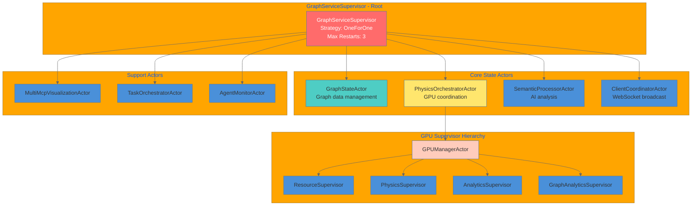
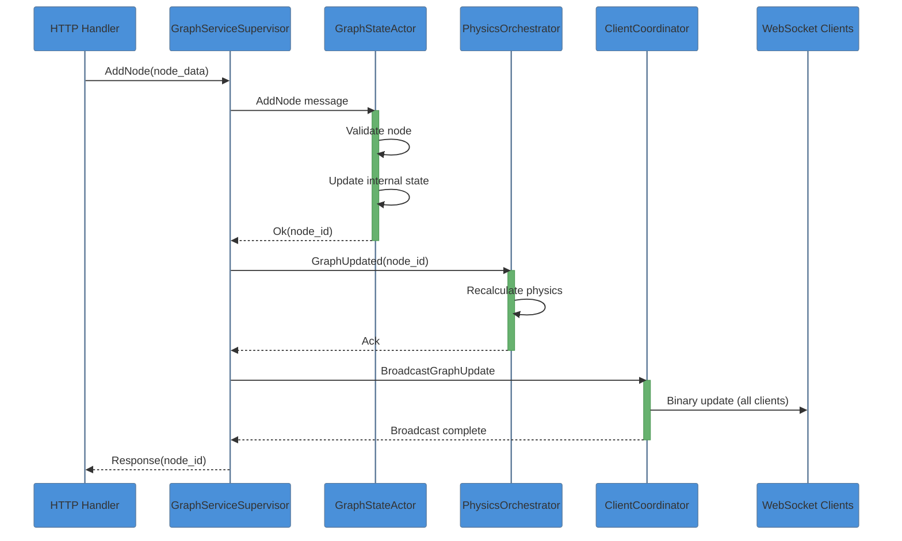
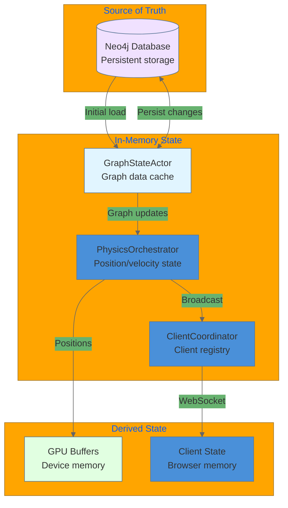
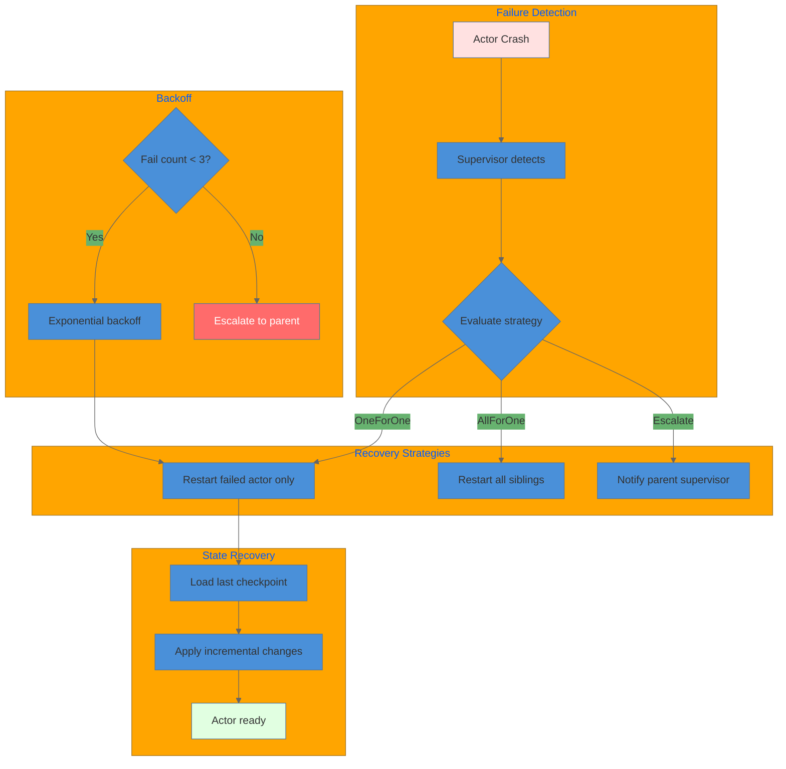
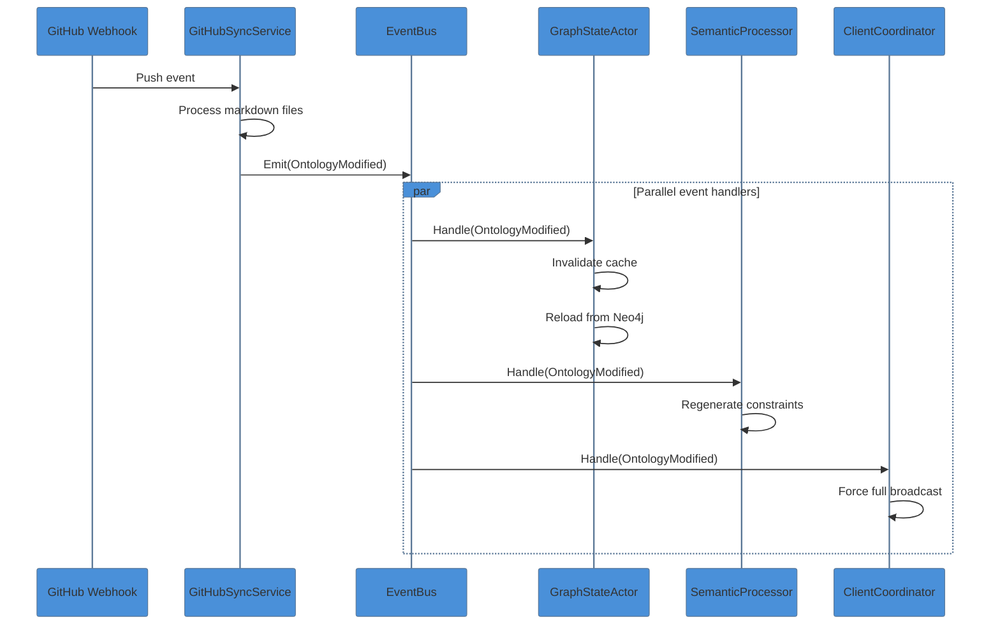

# Agent Coordination Data Flow

This document details the data flow for agent coordination in VisionFlow, including the actor message system, state synchronization, and fault tolerance patterns.

## Overview

VisionFlow uses Actix actors for concurrent processing with 24 specialized actors organized in a supervision hierarchy. This document covers how agents coordinate, share state, and recover from failures.

## Actor Hierarchy



## Message Flow Pattern



## State Synchronization



## Fault Tolerance



## Inter-Actor Message Types

| Category | Messages | Purpose |
|----------|----------|---------|
| Graph State | GetGraphData, AddNode, UpdateNode, DeleteNode | CRUD operations |
| Physics | SimulationStep, ComputeForces, UpdatePositions | Physics simulation |
| Client | RegisterClient, BroadcastPositions, Disconnect | WebSocket management |
| GPU | AllocateMemory, ExecuteKernel, FreeResources | GPU resource management |
| Semantic | ProcessMetadata, GenerateConstraints | AI/semantic analysis |

## Event-Driven Updates



## Performance Metrics

| Actor | Messages/sec | Latency P50 | Latency P99 |
|-------|--------------|-------------|-------------|
| GraphStateActor | 5,000 (write), 20,000 (read) | 50us | 200us |
| PhysicsOrchestrator | 60 | 2ms | 10ms |
| ClientCoordinator | 20 | 10ms | 100ms |
| SemanticProcessor | 1,000 | 20ms | 100ms |
| GPUResourceActor | 100 | 100us | 500us |

## Coordination Patterns

### Request-Response (Synchronous)
```rust
let result: Arc<GraphData> = graph_state_actor.send(GetGraphData).await?;
```

### Fire-and-Forget (Asynchronous)
```rust
client_coordinator.do_send(UpdateNodePositions { positions });
```

### Pub/Sub (Event-Driven)
```rust
event_bus.publish(GraphUpdateEvent { nodes_added, nodes_removed });
```

## Related Documentation

- [Actor System Complete](../../server/actors/actor-system-complete.md)
- [GPU Supervisor Hierarchy](../../infrastructure/gpu/gpu-supervisor-hierarchy.md)
- [CQRS Handlers](../../../architecture/patterns/hexagonal-cqrs.md)
