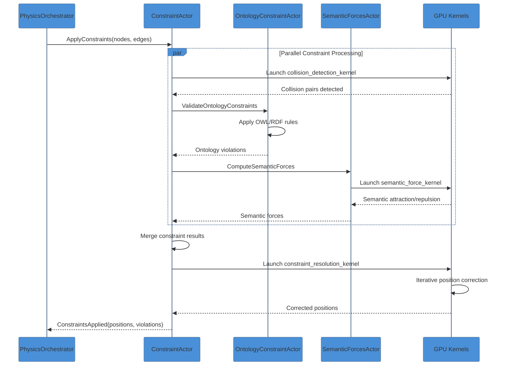
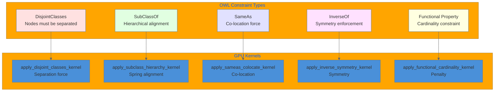
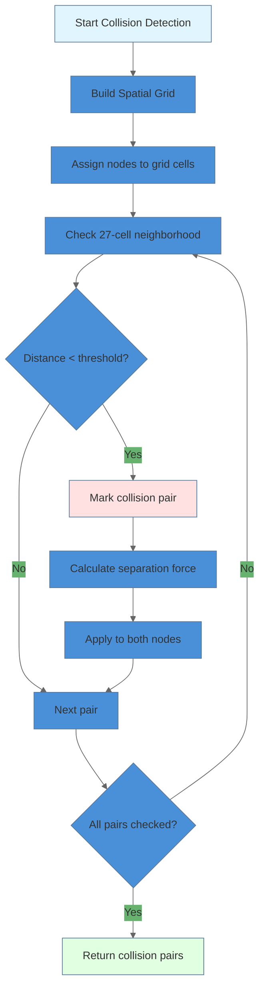
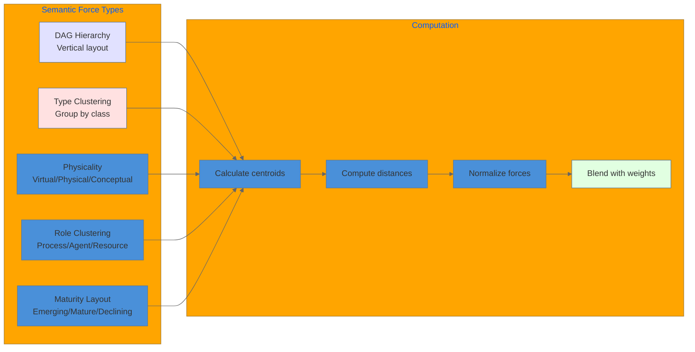

# Constraint Resolution Data Flow

This document details the data flow for constraint resolution in VisionFlow, including ontology constraints, collision detection, and semantic forces.

## Overview

Constraint resolution is a critical phase in the physics simulation pipeline that ensures:
1. Ontology rules (OWL/RDF) are enforced
2. Node collisions are resolved
3. Semantic clustering forces are applied

## Constraint Resolution Pipeline



## Constraint Priority Order

| Priority | Constraint Type | Force Multiplier | Resolution Strategy |
|----------|-----------------|------------------|---------------------|
| 1 (Highest) | Ontology Rules | 10.0x | Hard constraint, mandatory |
| 2 | Collision Detection | 5.0x | Separation force |
| 3 | Semantic Clustering | 2.0x | Attraction/repulsion |
| 4 (Lowest) | User Preferences | 1.0x | Soft constraint |

## Ontology Constraint Resolution



## Collision Detection Algorithm



## Semantic Force Computation



## Performance Characteristics

| Operation | GPU Kernel | Latency | Memory |
|-----------|------------|---------|--------|
| Collision detection | collision_detection_kernel | 0.5ms | O(n) |
| Ontology validation | apply_*_kernel (5 types) | 1.5ms | O(k) |
| Semantic forces | semantic_force_kernel | 0.8ms | O(n) |
| Position correction | constraint_resolution_kernel | 0.3ms | O(n) |
| **Total** | - | **~3ms** | - |

## Data Structures

**Constraint Data (28 bytes)**:
```cpp
struct ConstraintData {
    uint32_t node_a;        // 4 bytes
    uint32_t node_b;        // 4 bytes
    uint8_t  type;          // 1 byte (Ontology/Collision/Semantic)
    uint8_t  priority;      // 1 byte
    float    strength;      // 4 bytes
    float3   target_offset; // 12 bytes
    uint16_t flags;         // 2 bytes
}; // Total: 28 bytes
```

**Violation Report**:
```rust
pub struct ViolationReport {
    pub ontology_violations: Vec<(u32, u32, String)>,
    pub collision_count: usize,
    pub semantic_drift: f32,
    pub total_correction_force: f32,
}
```

## Related Documentation

- [Simulation Pipeline Flow](simulation-pipeline-flow.md)
- [GPU Architecture](../../infrastructure/gpu/cuda-architecture-complete.md)
- [Actor System](../../server/actors/actor-system-complete.md)
