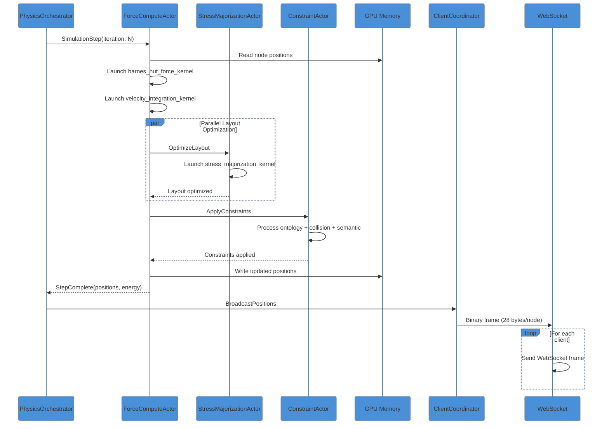

# Physics Simulation Pipeline Data Flow

This document details the complete data flow for VisionFlow's GPU-accelerated physics simulation, running at 60Hz for force-directed graph layout.

## Overview

The physics simulation pipeline processes graph positions through GPU kernels, applying forces and constraints to achieve optimal layout. The target is 100K nodes at 60 FPS (16.67ms per frame).

## Simulation Step Sequence



## Pipeline Timing Breakdown

```mermaid
%%{init: {'theme': 'base', 'themeVariables': {
  'primaryColor': '#4A90D9',
  'secondaryColor': '#67B26F',
  'tertiaryColor': '#FFA500',
  'primaryTextColor': '#333',
  'lineColor': '#666'
}}}%%
gantt
    title Physics Frame Timing (Target: 16.67ms)
    dateFormat X
    axisFormat %L ms

    section Grid Build
    Spatial hash: 0, 300

    section Forces
    Barnes-Hut repulsion: 300, 2000
    Spring attraction: 2000, 2800
    Centering gravity: 2800, 3000

    section Integration
    Velocity Verlet: 3000, 3500

    section Constraints
    Ontology: 3500, 5000
    Collision: 5000, 5500
    Semantic: 5500, 6000

    section Optimization
    Stress majorization: 6000, 8000

    section Broadcast
    Serialize: 8000, 8500
    WebSocket send: 8500, 10000
```



## Force Computation Pipeline

```mermaid
%%{init: {'theme': 'base', 'themeVariables': {
  'primaryColor': '#4A90D9',
  'secondaryColor': '#67B26F',
  'tertiaryColor': '#FFA500',
  'primaryTextColor': '#333',
  'lineColor': '#666'
}}}%%
graph TB
    subgraph "Input Data"
        POS[Node Positions<br/>Float32 x3<br/>2.4 MB @ 100K nodes]
        VEL[Node Velocities<br/>Float32 x3<br/>2.4 MB]
        EDGES[Edge List<br/>CSR Format<br/>~1.6 MB @ 200K edges]
    end

    subgraph "GPU Kernels"
        GRID[build_grid_kernel<br/>Spatial hashing<br/>O(n)]
        BOUNDS[compute_cell_bounds_kernel<br/>Cell ranges]
        FORCE[force_pass_kernel<br/>Multi-force integration<br/>O(n log n)]
        INTEGRATE[integrate_pass_kernel<br/>Verlet integration]
    end

    subgraph "Output"
        NEW_POS[Updated Positions]
        NEW_VEL[Updated Velocities]
        ENERGY[System Energy<br/>Convergence metric]
    end

    POS --> GRID --> BOUNDS --> FORCE
    VEL --> FORCE
    EDGES --> FORCE
    FORCE --> INTEGRATE
    INTEGRATE --> NEW_POS
    INTEGRATE --> NEW_VEL
    FORCE --> ENERGY

    style POS fill:#e1f5ff
    style FORCE fill:#ffe1e1
    style NEW_POS fill:#e1ffe1
```

## Barnes-Hut Algorithm

```mermaid
%%{init: {'theme': 'base', 'themeVariables': {
  'primaryColor': '#4A90D9',
  'secondaryColor': '#67B26F',
  'tertiaryColor': '#FFA500',
  'primaryTextColor': '#333',
  'lineColor': '#666'
}}}%%
graph TB
    subgraph "Octree Construction"
        ROOT[Root Node<br/>Full space] --> SPLIT[Subdivide]
        SPLIT --> CHILD1[Child 1<br/>Octant 1]
        SPLIT --> CHILD2[...]
        SPLIT --> CHILD8[Child 8<br/>Octant 8]
    end

    subgraph "Force Calculation"
        NODE[Current Node] --> CHECK{distance / size > theta?}
        CHECK -->|Yes| APPROX[Use Center of Mass<br/>Single interaction]
        CHECK -->|No| RECURSE[Recurse Children<br/>8 interactions]
    end

    subgraph "Complexity"
        FULL[O(n^2) direct]
        REDUCED[O(n log n) approximated]
    end

    style APPROX fill:#e1ffe1
    style RECURSE fill:#ffe1e1
```

## Verlet Integration

The position update uses velocity Verlet integration for numerical stability:

```
x(t+dt) = x(t) + v(t)*dt + 0.5*a(t)*dt^2
v(t+dt) = v(t) + 0.5*(a(t) + a(t+dt))*dt
```

With adaptive timestep:
- If |v| > v_max: dt = dt * 0.9
- If |v| < v_max: dt = dt * 1.01
- Clamped: 0.001 < dt < 0.1

## Energy and Convergence

```mermaid
%%{init: {'theme': 'base', 'themeVariables': {
  'primaryColor': '#4A90D9',
  'secondaryColor': '#67B26F',
  'tertiaryColor': '#FFA500',
  'primaryTextColor': '#333',
  'lineColor': '#666'
}}}%%
graph LR
    subgraph "Energy Metrics"
        KE[Kinetic Energy<br/>0.5 * m * v^2]
        PE[Potential Energy<br/>Spring + Repulsion]
        TOTAL[Total Energy<br/>KE + PE]
    end

    subgraph "Convergence Check"
        DELTA[Energy Delta<br/>E(t) - E(t-1)]
        THRESH{Delta < threshold?}
        STABLE[System Stable<br/>Reduce update rate]
        ACTIVE[System Active<br/>Continue 60Hz]
    end

    KE --> TOTAL
    PE --> TOTAL
    TOTAL --> DELTA --> THRESH
    THRESH -->|Yes| STABLE
    THRESH -->|No| ACTIVE

    style STABLE fill:#e1ffe1
    style ACTIVE fill:#ffe66d
```

## Memory Layout (SoA)

| Buffer | Type | Size (100K nodes) | Access Pattern |
|--------|------|-------------------|----------------|
| positions_x | f32[] | 400 KB | Coalesced read/write |
| positions_y | f32[] | 400 KB | Coalesced read/write |
| positions_z | f32[] | 400 KB | Coalesced read/write |
| velocities_x | f32[] | 400 KB | Coalesced read/write |
| velocities_y | f32[] | 400 KB | Coalesced read/write |
| velocities_z | f32[] | 400 KB | Coalesced read/write |
| forces_x | f32[] | 400 KB | Coalesced write |
| forces_y | f32[] | 400 KB | Coalesced write |
| forces_z | f32[] | 400 KB | Coalesced write |
| **Total** | - | **3.6 MB** | Fits in L2 cache |

## Performance Targets

| Metric | Target | Achieved |
|--------|--------|----------|
| Frame time | <16.67ms | ~10-14ms |
| Nodes supported | 100K | 100K |
| FPS | 60 | 60-83 |
| GPU utilization | >75% | ~80% |
| Memory bandwidth | <80% peak | ~1.2 GB/s |

## Related Documentation

- [Constraint Resolution Flow](constraint-resolution-flow.md)
- [GPU Architecture](../../infrastructure/gpu/cuda-architecture-complete.md)
- [WebSocket Message Flow](websocket-message-flow.md)
