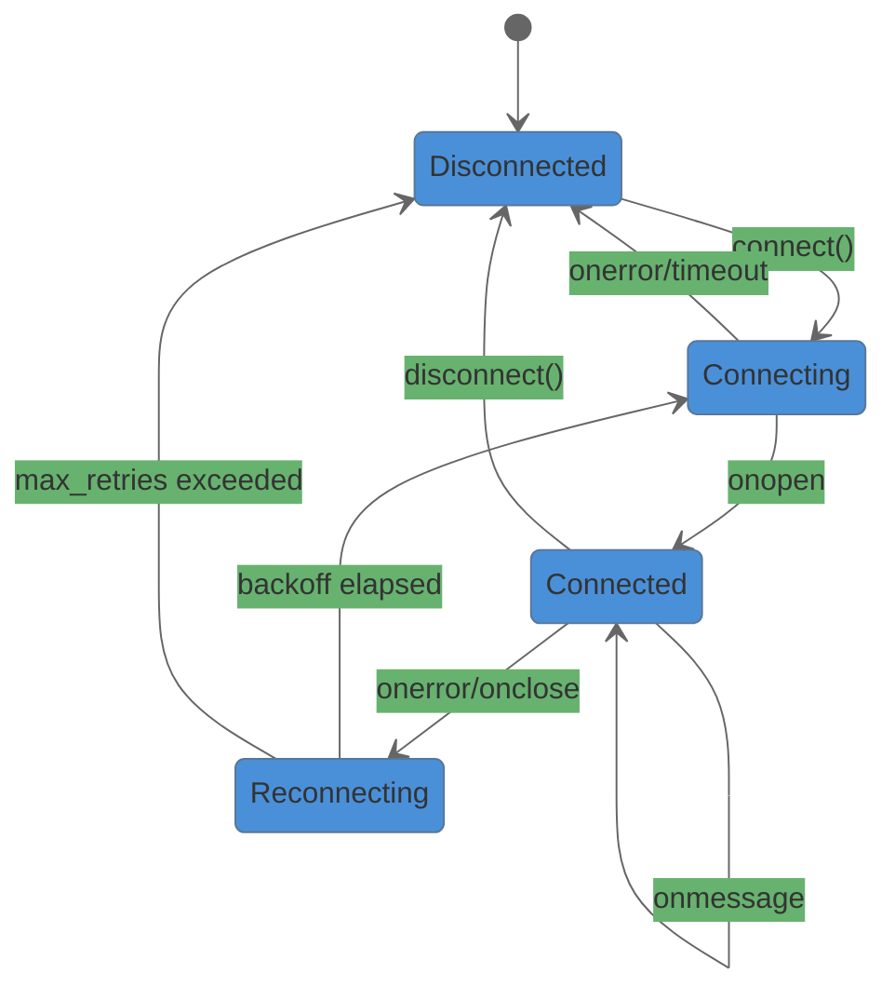
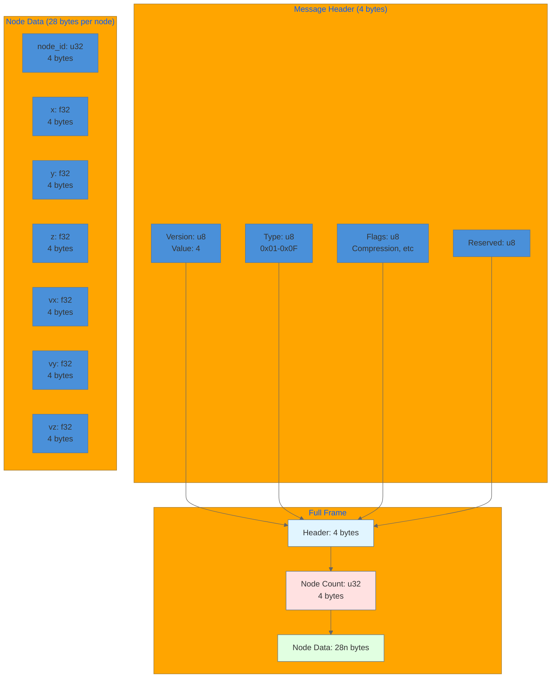
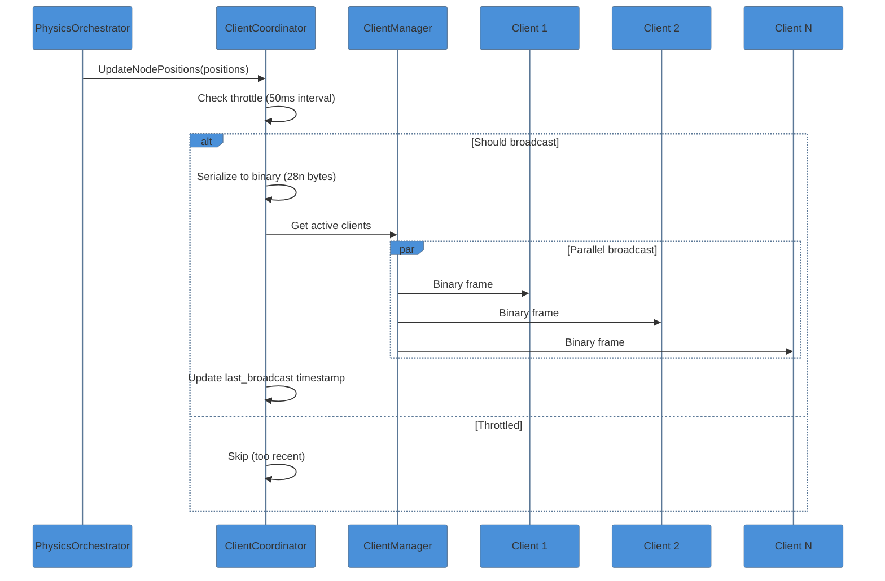
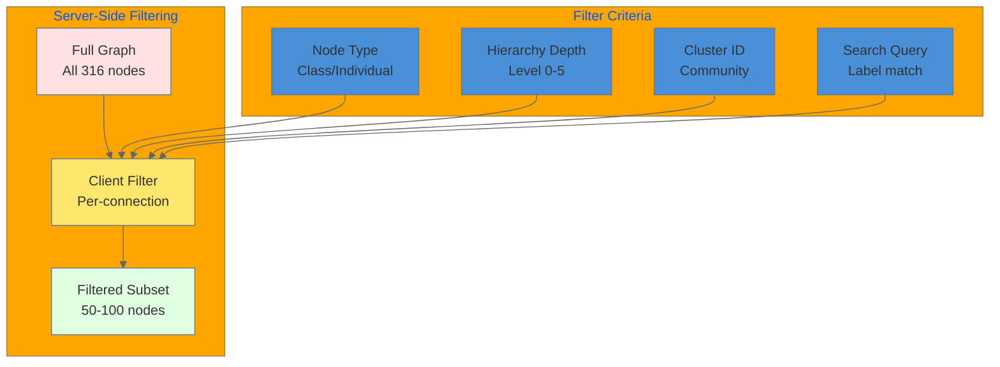
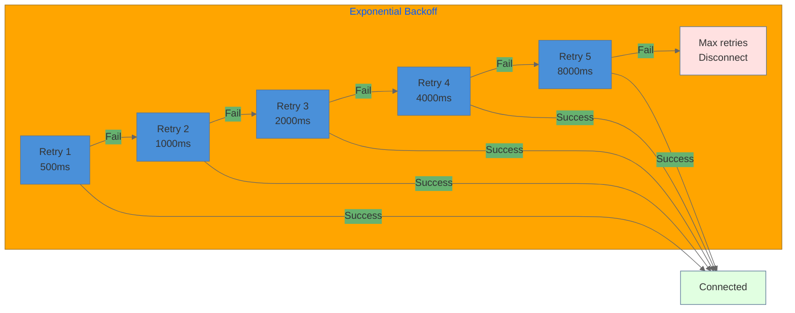

# WebSocket Message Data Flow

This document details the WebSocket communication protocol and message flow between the VisionFlow server and connected clients.

## Overview

VisionFlow uses a binary WebSocket protocol (V4) optimized for high-frequency graph updates at 60Hz. The protocol minimizes bandwidth while maintaining real-time synchronization across all connected clients.

## Connection Lifecycle

## Binary Protocol V4 Format

## Message Types

| Type ID | Name | Direction | Payload | Frequency |
|---------|------|-----------|---------|-----------|
| 0x01 | FullGraph | Server->Client | All nodes + edges | On connect |
| 0x02 | PositionUpdate | Server->Client | Node positions | 60Hz |
| 0x03 | NodeSelect | Client->Server | Selected node ID | On click |
| 0x04 | NodeDrag | Client->Server | Node ID + position | On drag |
| 0x05 | Heartbeat | Bidirectional | Timestamp | Every 30s |
| 0x06 | FilterUpdate | Client->Server | Filter criteria | On change |
| 0x07 | VoiceData | Bidirectional | PCM audio | Streaming |

## Broadcast Flow

## Client Filter System

## Performance Metrics

| Metric | Value | Notes |
|--------|-------|-------|
| Message size (10K nodes) | 280 KB | 4 + 4 + (28 * 10000) |
| Broadcast interval | 50ms active / 1000ms stable | Adaptive |
| Max concurrent clients | 50,000 | Connection limit |
| Latency P50 | 10ms | Server to client |
| Latency P95 | 30ms | Including processing |
| Bandwidth per client | 5.6 MB/s | At 60Hz, 10K nodes |

## Reconnection Strategy

## Data Transformations

| Stage | Input | Output | Size Change |
|-------|-------|--------|-------------|
| GPU -> Host | Device positions | Vec<BinaryNodeData> | 0% |
| Host -> Serialize | Vec<BinaryNodeData> | [u8] binary | +8 bytes header |
| Serialize -> Compress | [u8] binary | [u8] compressed | -20-40% |
| Compress -> Send | [u8] compressed | WebSocket frame | +2-14 bytes framing |

## Related Documentation

- [Binary Protocol Specification](../../infrastructure/websocket/binary-protocol-complete.md)
- [Client Coordinator Actor](../../server/actors/actor-system-complete.md)
- [Client State Management](../../client/state/state-management-complete.md)
