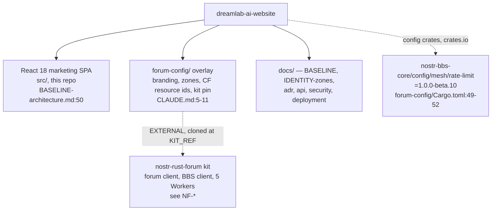
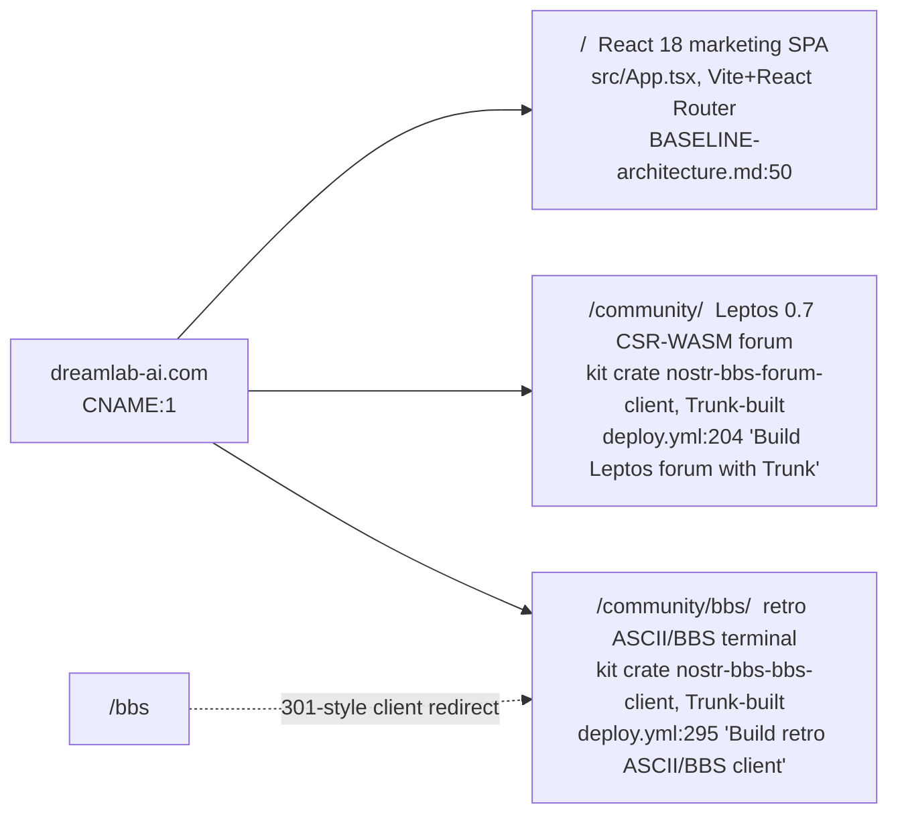
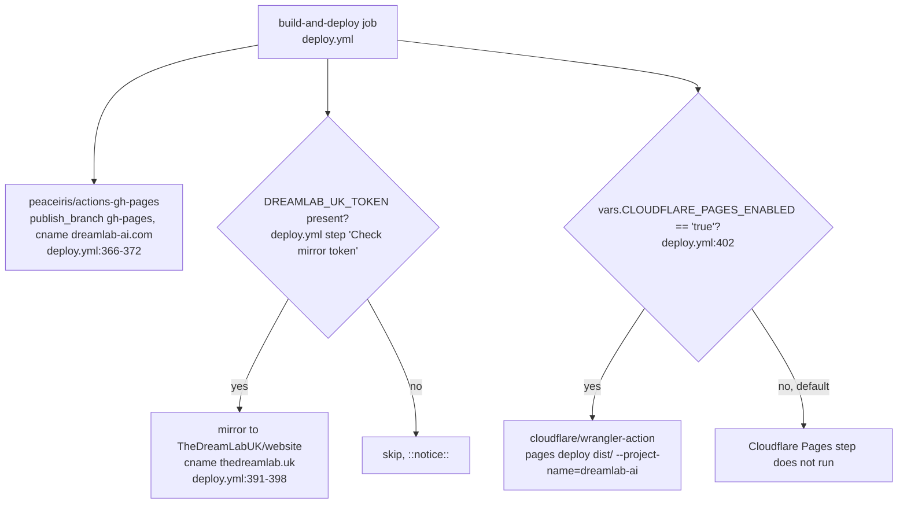
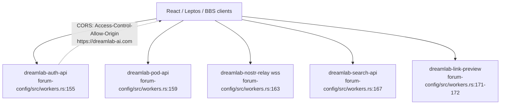
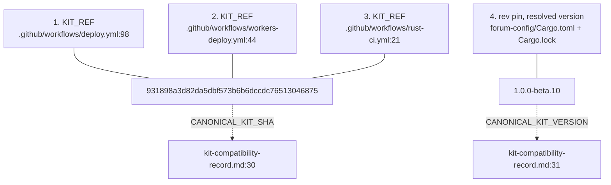
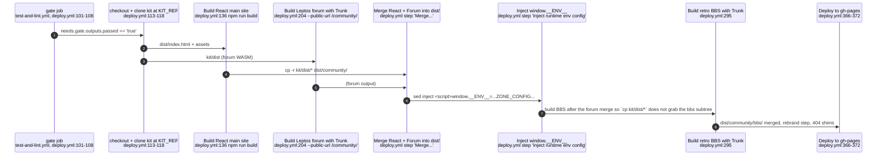
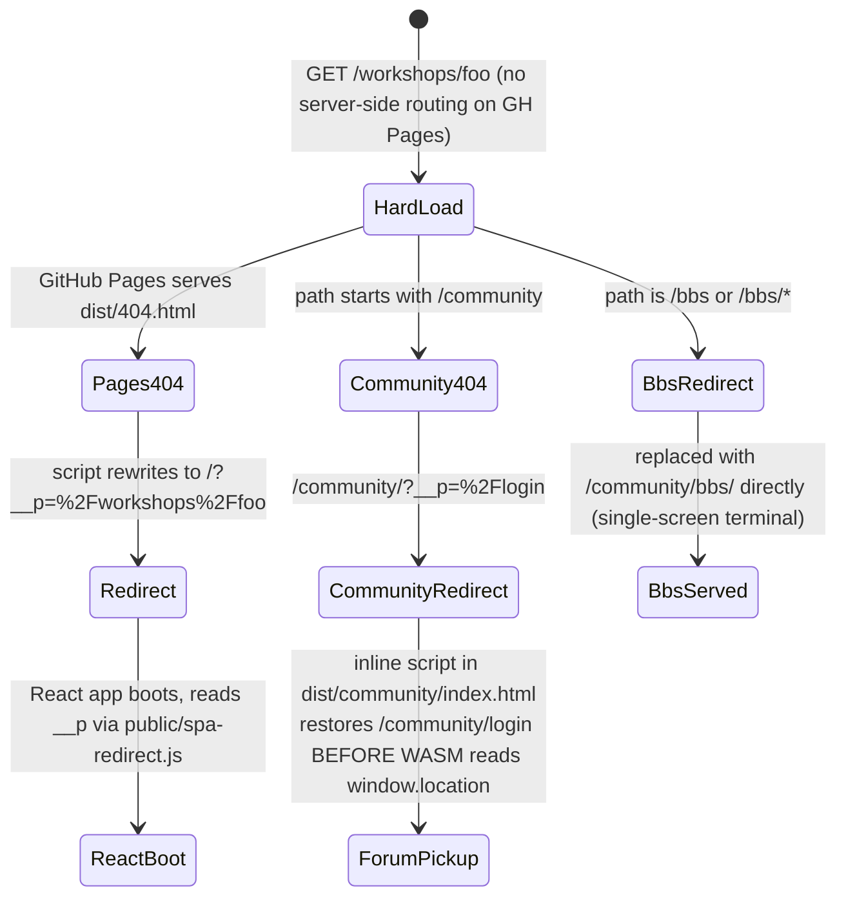
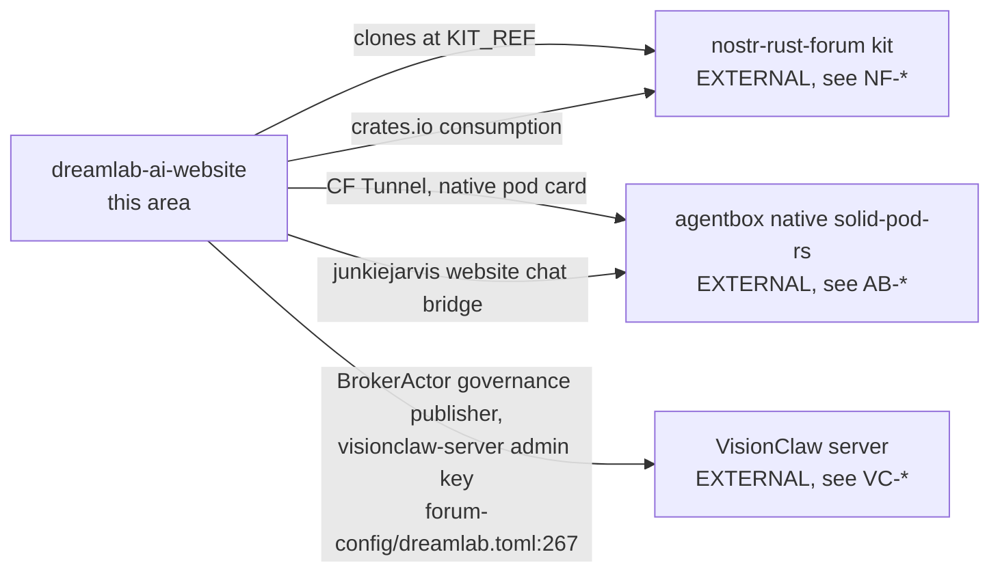

## DW-01.1 Repo composition — thin operator overlay, not a protocol owner

- "What this repo is" (BASELINE-architecture.md:35-41): a thin operator overlay — the forum source, Nostr crates, and five Workers all live upstream; this repo carries only the React site, `forum-config/`, and docs.
- INVARIANT: `forum-config/Cargo.toml` license is `AGPL-3.0-only` (Cargo.toml:9) because it statically links the AGPL kit crates — the package comment (Cargo.toml:6-8) explicitly corrects an earlier "Proprietary" framing as "legally incoherent".

## DW-01.2 Three frontends, one origin

- DOC-DRIFT: `README.md` frames the site as "Two SPAs, one origin"; the deploy ships a third client at `/community/bbs/` (BASELINE-architecture.md:122-124, `deploy.yml:295`).
- All three are static assets after build; React gets Vite build variables, forum/BBS get a `window.__ENV__` block injected by `sed` at deploy time (BASELINE-architecture.md:54-58).

## DW-01.3 Deploy topology — GitHub Pages primary, Cloudflare Pages gated off

- DOC-DRIFT: `README.md` frames the site as a "dual-SPA Cloudflare-edge deployment"; the origin is GitHub Pages, Cloudflare only hosts the backend Workers, and Cloudflare Pages is opt-in behind an explicit repo variable (BASELINE-architecture.md:117-121).
- INVARIANT: GitHub Pages is the origin of record for `dreamlab-ai.com` until DNS is re-cut; the Cloudflare Pages step must stay gated behind that repo variable (BASELINE-architecture.md:155-157, Invariant 4).

## DW-01.4 Backend — five Cloudflare Workers, raw `workers.dev` hosts

- The branded custom domains (`relay./api./pods./search./preview.dreamlab-ai.com`) are the documented end-state but are **not provisioned in DNS** (verified 2026-06-09 `ERR_NAME_NOT_RESOLVED`, not re-checked as of 2026-08-31) — shipping them baked in previously severed every client API call (BASELINE-architecture.md:77-82).
- The CORS claim is asserted live by CI: `tests/forum-smoke.spec.ts:404-410` ("workers return scoped CORS") checked against all four HTTP workers.

## DW-01.5 The dual-pin rule — four locations that must move together

- `workers-deploy.yml` fires on `forum-config/Cargo.lock` and `KIT_REF` changes precisely so a kit re-pin never ships a new client against old workers — the client/worker skew that "wiped the forum on 2026-06-15" (BASELINE-architecture.md:103-106).
- DOC-DRIFT: `BASELINE-architecture.md:99-101` cites `KIT_REF = a7544687b4d1c09807862d749b27f8c8da307a12` and crate version `"1.0.0-beta.9"` (line 96) as current; the live pins (verified in `deploy.yml:98`, `workers-deploy.yml:44`, `rust-ci.yml:21`, `forum-config/Cargo.toml:49-52`, and `kit-compatibility-record.md:30-31`) are `931898a3d82da5dbf573b6b6dccdc76513046875` / `1.0.0-beta.10` — the kit was re-pinned after this governing doc's `verified_commit: d852f61` without a doc update. All four pin sites and the compatibility record agree with each other; only the governing doc has drifted.
- DOC-DRIFT (Wave 2, the repo's most-read file): `README.md:289` states "Live pin `2d693ed2…` (beta.6, re-pinned 2026-07-21)" — a THIRD, even-older value distinct from both the governing doc's stale beta.9 citation above and the live beta.10 pin. The README is two releases stale, not one, and unlike `BASELINE-architecture.md` it is not covered by any `verified_commit` mechanism at all.

## DW-01.6 Deploy job sequence — clone kit, build three frontends, merge, inject, deploy

- Supply-chain hardening: every tool the deploy job downloads (Trunk, binaryen/`wasm-opt`, Tailwind CLI) is pinned to an exact version **and** SHA256-verified before use, because this job carries the Cloudflare API token (BASELINE-architecture.md:110-113, `deploy.yml:32-40`).

## DW-01.7 SPA deep-link 404 shim — load-bearing, not incidental

- "SPA deep links depend on a 404-redirect shim" is called out as load-bearing in the Known-divergences section, not incidental (BASELINE-architecture.md:138-141, `deploy.yml:327-363`, `250-262`).
- The React pickup script is deliberately external (`public/spa-redirect.js`), not an inline `<script>`, because `index.html`'s CSP (`script-src 'self'`, no `'unsafe-inline'`) would block an injected inline script — exactly the bug class that broke `/workshops` deep links (`deploy.yml` comment above the "Deploy" step).

## DW-01.8 EXTERNAL — estate authority map beyond this repo

- `visionclaw-server` is a governance publisher pubkey shared with the forum's primary admin pubkey — see DW-03/DW-04 for the identity implications and IDENTITY-zones.md. The `[governance].agent_pubkeys` list this repo authors is at `forum-config/dreamlab.toml:256,267`; the ecosystem statement itself is at `CLAUDE.md:17`.
