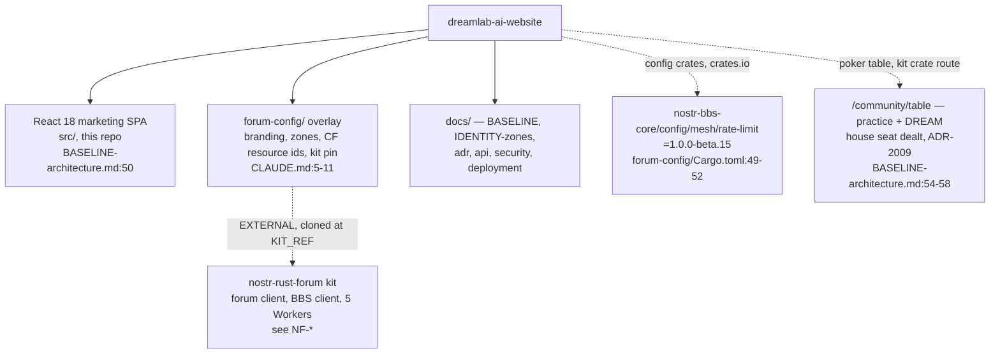
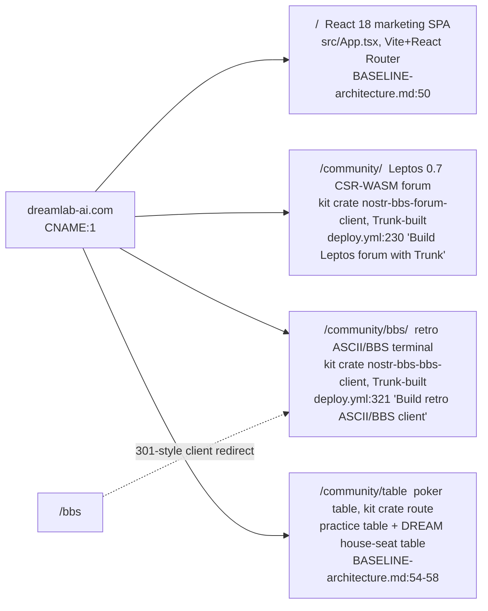
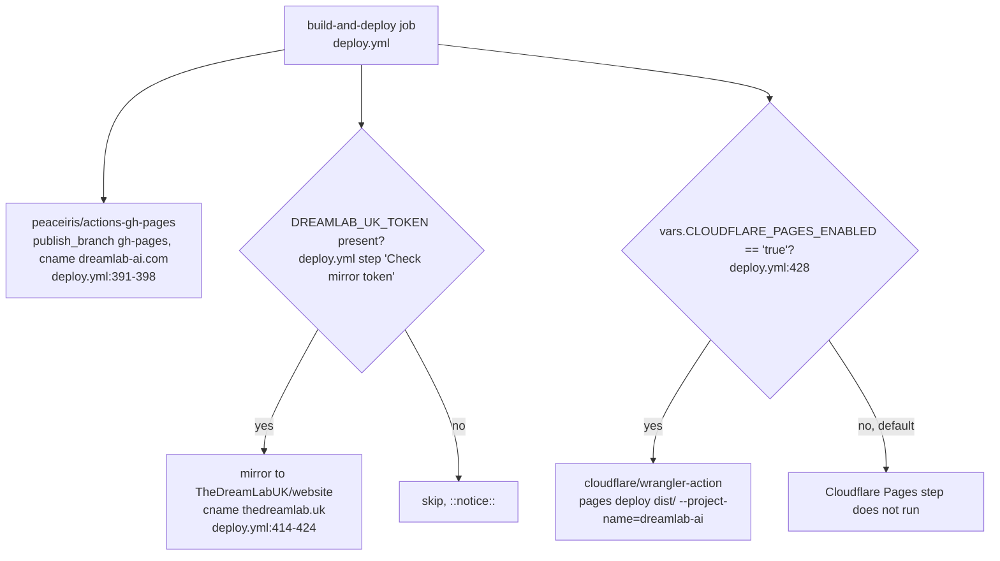
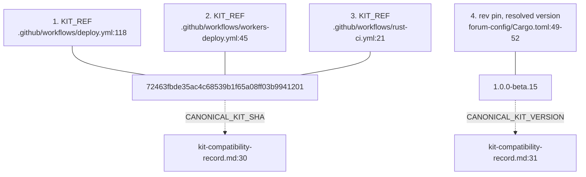
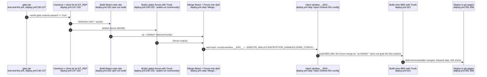
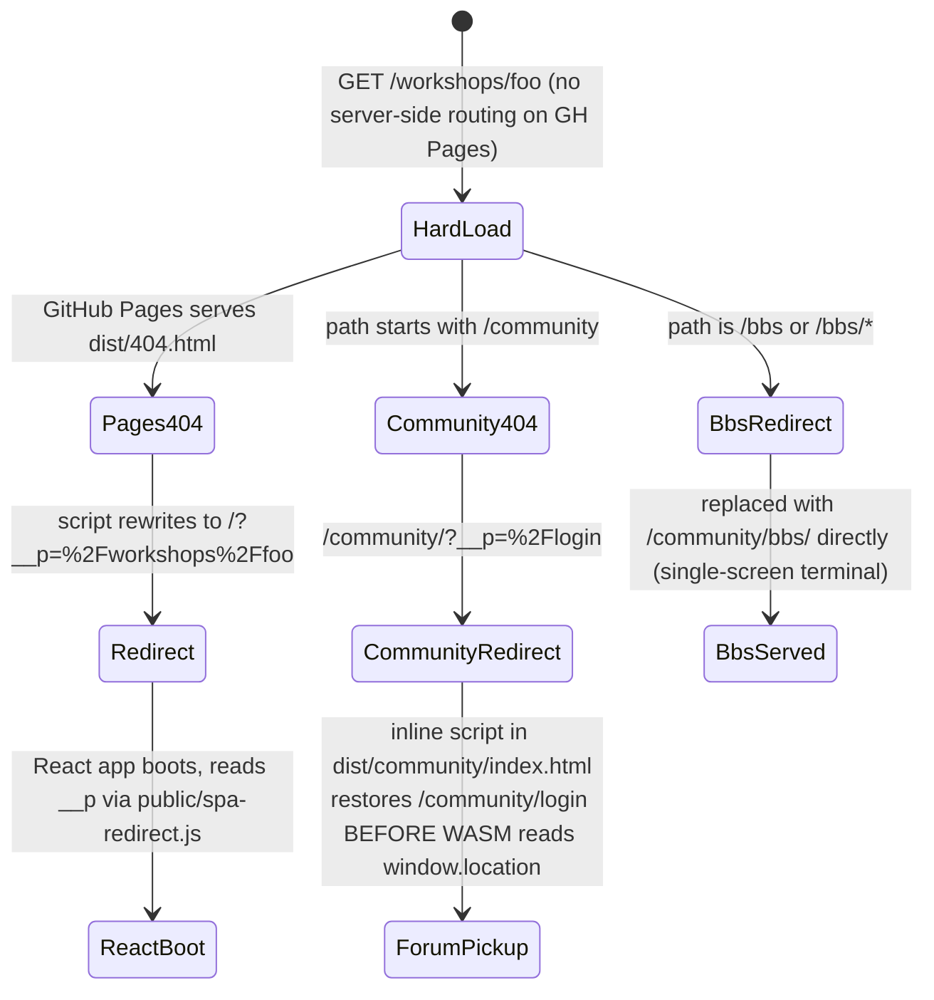
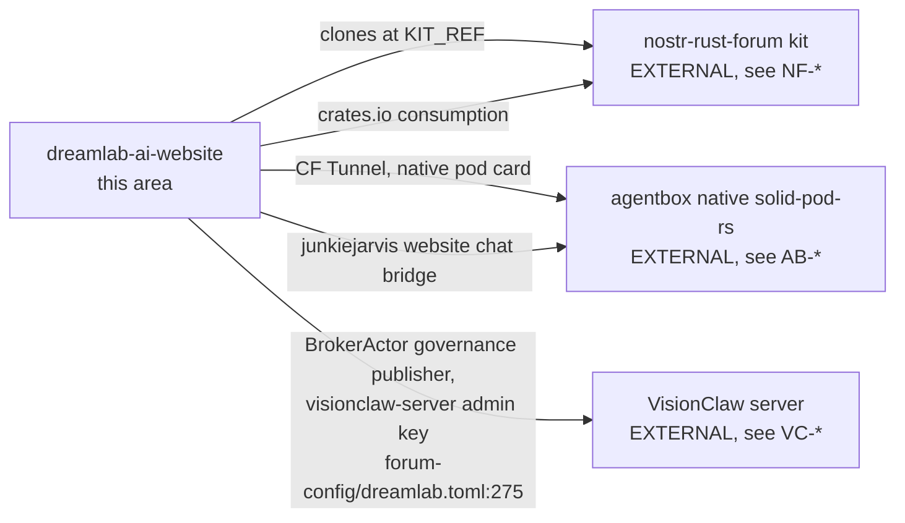

## DW-01.1 Repo composition — thin operator overlay, not a protocol owner

```mermaid
flowchart TB
    REPO["dreamlab-ai-website"] --> REACT["React 18 marketing SPA<br/>src/, this repo<br/>BASELINE-architecture.md:50"]
    REPO --> FCFG["forum-config/ overlay<br/>branding, zones, CF resource ids, kit pin<br/>CLAUDE.md:5-11"]
    REPO --> DOCS["docs/ — BASELINE, IDENTITY-zones,<br/>adr, api, security, deployment"]
    FCFG -. "EXTERNAL, cloned at KIT_REF" .-> KIT["nostr-rust-forum kit<br/>forum client, BBS client, 5 Workers<br/>see NF-*"]
    REPO -. "config crates, crates.io" .-> CRATES["nostr-bbs-core/config/mesh/rate-limit<br/>=1.0.0-beta.15<br/>forum-config/Cargo.toml:49-52"]
    REPO -. "poker table, kit crate route" .-> POKER["/community/table — practice + DREAM<br/>house seat dealt, ADR-2009<br/>BASELINE-architecture.md:54-58"]
```
- "What this repo is" (BASELINE-architecture.md:35-41): a thin operator overlay — the forum source, Nostr crates, and five Workers all live upstream; this repo carries only the React site, `forum-config/`, and docs.
- INVARIANT: `forum-config/Cargo.toml` license is `AGPL-3.0-only` (Cargo.toml:9) because it statically links the AGPL kit crates — the package comment (Cargo.toml:6-8) explicitly corrects an earlier "Proprietary" framing as "legally incoherent".

## DW-01.2 Three frontends, one origin

```mermaid
flowchart LR
    ORIGIN["dreamlab-ai.com<br/>CNAME:1"] --> ROOT["/  React 18 marketing SPA<br/>src/App.tsx, Vite+React Router<br/>BASELINE-architecture.md:50"]
    ORIGIN --> COMM["/community/  Leptos 0.7 CSR-WASM forum<br/>kit crate nostr-bbs-forum-client, Trunk-built<br/>deploy.yml:230 'Build Leptos forum with Trunk'"]
    ORIGIN --> BBS["/community/bbs/  retro ASCII/BBS terminal<br/>kit crate nostr-bbs-bbs-client, Trunk-built<br/>deploy.yml:321 'Build retro ASCII/BBS client'"]
    ORIGIN --> TBL["/community/table  poker table, kit crate route<br/>practice table + DREAM house-seat table<br/>BASELINE-architecture.md:54-58"]
    LEGACY["/bbs"] -. "301-style client redirect" .-> BBS
```
- DOC-DRIFT: `README.md` frames the site as "Two SPAs, one origin"; the deploy ships a third client at `/community/bbs/` (BASELINE-architecture.md:136-138, `deploy.yml:321`).
- The forum client also carries the poker table at `/community/table` (ADR-2009, kit ADR-2020): a practice table plus a DREAM table dealt by the `nostr-bbs-poker-citizen` house seat in the agentbox (BASELINE-architecture.md:54-58).
- All three are static assets after build; React gets Vite build variables, forum/BBS get a `window.__ENV__` block injected by `sed` at deploy time (BASELINE-architecture.md:66-70).

## DW-01.3 Deploy topology — GitHub Pages primary, Cloudflare Pages gated off

```mermaid
flowchart TB
    BUILD["build-and-deploy job<br/>deploy.yml"] --> GHPAGES["peaceiris/actions-gh-pages<br/>publish_branch gh-pages, cname dreamlab-ai.com<br/>deploy.yml:391-398"]
    BUILD --> MIRROR{"DREAMLAB_UK_TOKEN present?<br/>deploy.yml step 'Check mirror token'"}
    MIRROR -->|yes| MIRRORDEPLOY["mirror to TheDreamLabUK/website<br/>cname thedreamlab.uk<br/>deploy.yml:414-424"]
    MIRROR -->|no| SKIP["skip, ::notice::"]
    BUILD --> CFGATE{"vars.CLOUDFLARE_PAGES_ENABLED == 'true'?<br/>deploy.yml:428"}
    CFGATE -->|yes| CFPAGES["cloudflare/wrangler-action<br/>pages deploy dist/ --project-name=dreamlab-ai"]
    CFGATE -->|no, default| CFOFF["Cloudflare Pages step does not run"]
```
- DOC-DRIFT: `README.md` frames the site as a "dual-SPA Cloudflare-edge deployment"; the origin is GitHub Pages, Cloudflare only hosts the backend Workers (five: auth, pod, relay, search, preview — `forum-config/src/workers.rs:155-172`), and Cloudflare Pages is opt-in behind an explicit repo variable (BASELINE-architecture.md:131-135).
- INVARIANT: GitHub Pages is the origin of record for `dreamlab-ai.com` until DNS is re-cut; the Cloudflare Pages step must stay gated behind that repo variable (BASELINE-architecture.md:169-171, Invariant 4).
- The branded custom domains for those Workers (`relay./api./pods./search./preview.dreamlab-ai.com`) are the documented end-state but are **not provisioned in DNS** — the client instead talks to raw `*.workers.dev` hosts baked into the build env (`deploy.yml:50-54`; verified 2026-06-09 `ERR_NAME_NOT_RESOLVED`, not re-checked as of 2026-08-31) — shipping the branded domains baked in previously severed every client API call (BASELINE-architecture.md:91-97).

## DW-01.5 The dual-pin rule — four locations that must move together

```mermaid
flowchart TB
    A["1. KIT_REF<br/>.github/workflows/deploy.yml:118"] --- SHA["72463fbde35ac4c68539b1f65a08ff03b9941201"]
    B["2. KIT_REF<br/>.github/workflows/workers-deploy.yml:45"] --- SHA
    C["3. KIT_REF<br/>.github/workflows/rust-ci.yml:21"] --- SHA
    D["4. rev pin, resolved version<br/>forum-config/Cargo.toml:49-52"] --- VER["1.0.0-beta.15"]
    SHA -.->|"CANONICAL_KIT_SHA"| REC["kit-compatibility-record.md:30"]
    VER -.->|"CANONICAL_KIT_VERSION"| REC2["kit-compatibility-record.md:31"]
```
- `workers-deploy.yml` fires on `forum-config/Cargo.lock` and `KIT_REF` changes precisely so a kit re-pin never ships a new client against old workers — the client/worker skew that "wiped the forum on 2026-06-15" (BASELINE-architecture.md:117-120).
- DOC-DRIFT: `BASELINE-architecture.md:113` still cites `KIT_REF = a7544687b4d1c09807862d749b27f8c8da307a12` and crate version `"1.0.0-beta.9"` (line 110) as current; the live pins (`deploy.yml:118`, `workers-deploy.yml:45`, `rust-ci.yml:21`, `forum-config/Cargo.toml:49-52`, `kit-compatibility-record.md:30-31`) are `72463fbde35ac4c68539b1f65a08ff03b9941201` / `1.0.0-beta.15` (re-pinned 2026-10-05 by `53976da`, current at HEAD `ebaf16c`: poker table + house seats, zone keys granted on allocation/admin sign-in, ontology Promote/Demote, expired-NIP-40 refusal, beta.13 yanked, four library crates republished at beta.15) — the kit has been re-pinned repeatedly since this governing doc's `verified_commit: d852f61` without a doc update. All four pin sites and the compatibility record agree with each other; only the governing doc has drifted.
- DOC-DRIFT (Wave 2, the repo's most-read file): `README.md:298` still states "Live pin `2d693ed2…` (beta.6, re-pinned 2026-07-21)" — a THIRD, even-older value distinct from both the governing doc's stale beta.9 citation above and the live beta.15 pin, and not covered by any `verified_commit` mechanism at all.
- The pin-site comments no longer restate release notes (`325734e`, 2026-10-02): `rust-ci.yml:19`, `deploy.yml:113-117` and `workers-deploy.yml:40-44` now say only that the kit crates resolve and defer provenance to the compatibility record, which pin-parity checks against the exact SHA. The earlier drift (a beta.9 annotation beside a newer pin) is closed at the source — but a NEWER minor one opened: the three comments say `v1.0.0-beta.14` (`deploy.yml:113`, `rust-ci.yml:19`, `workers-deploy.yml:40`) while the crates.io pins and the record's `CANONICAL_KIT_VERSION` say `1.0.0-beta.15` (`forum-config/Cargo.toml:49-52`, `kit-compatibility-record.md:31`); pin-parity compares the SHA, so the stale version annotation does not fail the gate.
- **Drift:** the deployment row's SHA column and the machine-readable field now agree at `72463fbd` with a "Kit branch/tag at pin" column reading "`main` at 72463fb" and notes describing the change set (`kit-compatibility-record.md:26,30`) — the self-contradiction the previous revision carried is closed. The History table, however, still marks `931898a` (tag `v1.0.0-beta.10`) as "Current (canonical — matches `CANONICAL_KIT_SHA` above and the `KIT_REF` pins)" (`kit-compatibility-record.md:347`), two releases behind. pin-parity compares only the SHA, so this does not fail the gate.
- INVARIANT: the machine-readable pin lives in exactly one place the gate reads — `CANONICAL_KIT_SHA` / `CANONICAL_KIT_VERSION` in `kit-compatibility-record.md:30-31` — and every other site is compared against it, which is why the surrounding comments can rot without the gate noticing.

## DW-01.6 Deploy job sequence — clone kit, build three frontends, merge, inject, deploy

```mermaid
sequenceDiagram
    autonumber
    participant GH as gate job<br/>test-and-lint.yml, deploy.yml:130-137
    participant CO as checkout + clone kit at KIT_REF<br/>deploy.yml:147-150
    participant RB as Build React main site<br/>deploy.yml:162 npm run build
    participant LB as Build Leptos forum with Trunk<br/>deploy.yml:230-232 --public-url /community/
    participant MG as Merge React + Forum into dist/<br/>deploy.yml step 'Merge...'
    participant ENV as Inject window.__ENV__<br/>deploy.yml step 'Inject runtime env config'
    participant BB as Build retro BBS with Trunk<br/>deploy.yml:321
    participant PG as Deploy to gh-pages<br/>deploy.yml:391-398
    GH->>CO: needs.gate.outputs.passed == 'true'
    CO->>RB: dist/index.html + assets
    CO->>LB: kit/dist (forum WASM)
    RB->>MG: cp -r kit/dist/* dist/community/
    LB->>MG: (forum output)
    MG->>ENV: sed inject <script>window.__ENV__=...SIDESTR_WALLET,ENCRYPTION_ENABLED,ZONE_CONFIG...
    ENV->>BB: build BBS after the forum merge so `cp kit/dist/*` does not grab the bbs subtree
    BB->>PG: dist/community/bbs/ merged, rebrand step, 404 shims
```
- Since `d3ecd05` (2026-10-02) the deploy also fires on a lockfile-only change: `package-lock.json` joined the push path filter (`deploy.yml:13-21`), so a dependency bump that touches nothing else still republishes the site.
- Supply-chain hardening: every tool the deploy job downloads (Trunk, binaryen/`wasm-opt`, Tailwind CLI) is pinned to an exact version **and** SHA256-verified before use, because this job carries the Cloudflare API token (BASELINE-architecture.md:124-126, `deploy.yml:34-41`).
- The injected payload has grown since ADR-2015/ADR-2016 shipped: `SIDESTR_WALLET:'on'` (deploy.yml:77) gates the testnet4 wallet nav/tip UI, `SIDESTR_CHAINS_JSON` (deploy.yml:82) lists the two sidestr chains (kit ADR-2021), `ENCRYPTION_ENABLED:'true'` (deploy.yml:93) is the zone E2EE master switch, `ZONE_CONFIG_JSON` (deploy.yml:94) marks zones 2-4 `encrypted:true` with zone4 carrying `agent_keys:true`, and `POKER:'on'` + `POKER_CONFIG_JSON` (deploy.yml:88-89) gate and parameterise the poker table — see DW-03/DW-04 for the zone model and encryption detail this step only injects.

## DW-01.7 SPA deep-link 404 shim — load-bearing, not incidental

```mermaid
stateDiagram-v2
    [*] --> HardLoad: GET /workshops/foo (no server-side routing on GH Pages)
    HardLoad --> Pages404: GitHub Pages serves dist/404.html
    Pages404 --> Redirect: script rewrites to /?__p=%2Fworkshops%2Ffoo
    Redirect --> ReactBoot: React app boots, reads __p via public/spa-redirect.js
    HardLoad --> Community404: path starts with /community
    Community404 --> CommunityRedirect: /community/?__p=%2Flogin
    CommunityRedirect --> ForumPickup: inline script in dist/community/index.html<br/>restores /community/login BEFORE WASM reads window.location
    HardLoad --> BbsRedirect: path is /bbs or /bbs/*
    BbsRedirect --> BbsServed: replaced with /community/bbs/ directly (single-screen terminal)
```
- "SPA deep links depend on a 404-redirect shim" is called out as load-bearing in the Known-divergences section, not incidental (BASELINE-architecture.md:152-155, `deploy.yml:353-383`, `277-286`).
- The React pickup script is deliberately external (`public/spa-redirect.js`), not an inline `<script>`, because `index.html`'s CSP (`script-src 'self'`, no `'unsafe-inline'`) would block an injected inline script — exactly the bug class that broke `/workshops` deep links (`deploy.yml` comment above the "Deploy" step).

## DW-01.8 EXTERNAL — estate authority map beyond this repo

```mermaid
flowchart LR
    DW["dreamlab-ai-website<br/>this area"] -->|"clones at KIT_REF"| NF["nostr-rust-forum kit<br/>EXTERNAL, see NF-*"]
    DW -->|"crates.io consumption"| NF
    DW -->|"CF Tunnel, native pod card"| AB["agentbox native solid-pod-rs<br/>EXTERNAL, see AB-*"]
    DW -->|"BrokerActor governance publisher,<br/>visionclaw-server admin key<br/>forum-config/dreamlab.toml:275"| VC["VisionClaw server<br/>EXTERNAL, see VC-*"]
    DW -->|"junkiejarvis website chat bridge"| AB
```
- `visionclaw-server` is a governance publisher pubkey shared with the forum's primary admin pubkey — see DW-03/DW-04 for the identity implications and IDENTITY-zones.md. The `[governance].agent_pubkeys` list this repo authors is at `forum-config/dreamlab.toml:264,275-277`; the ecosystem statement itself is at `CLAUDE.md:17`.
