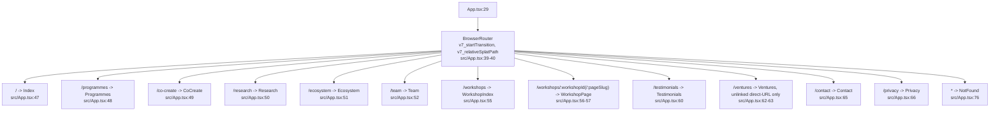
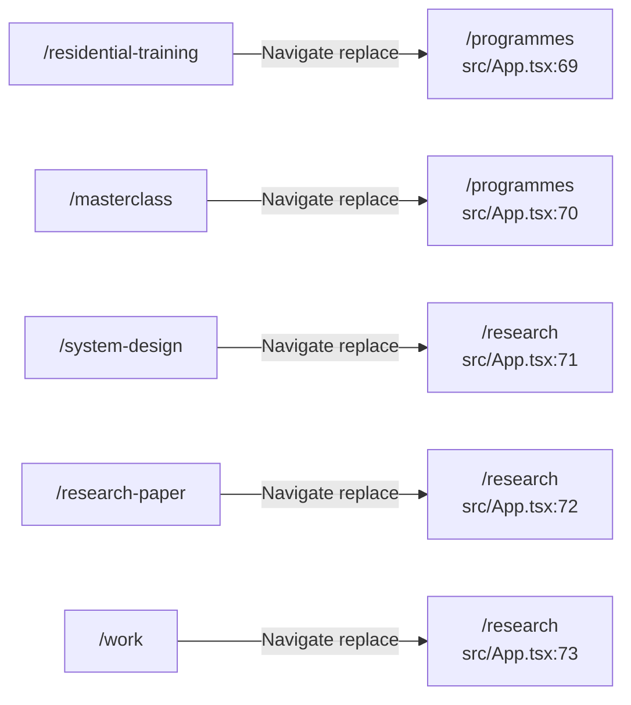
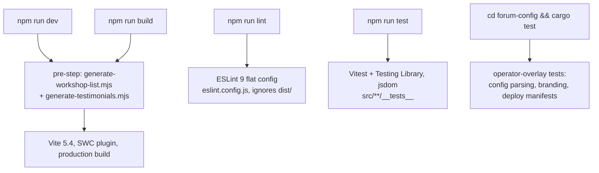
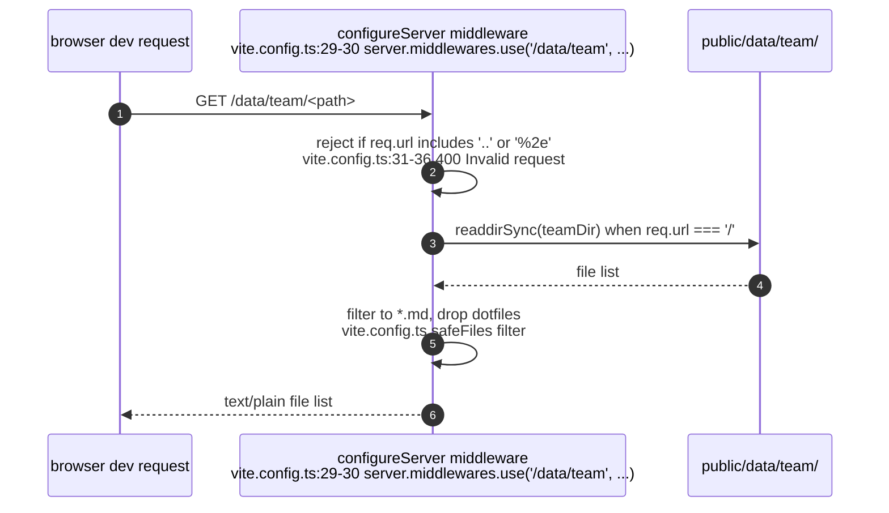
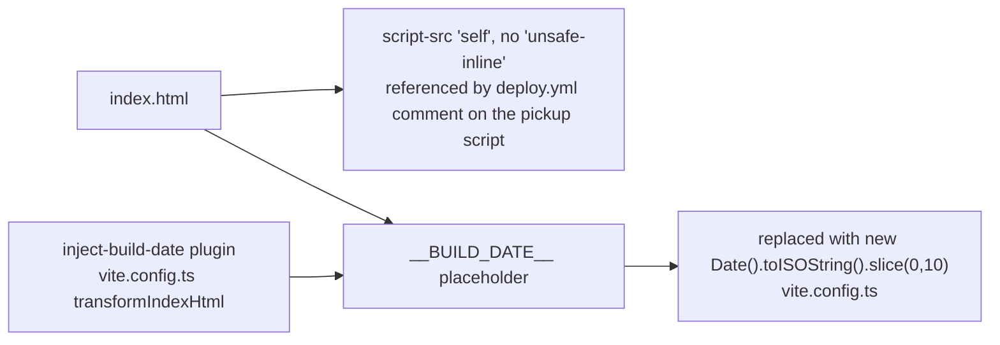
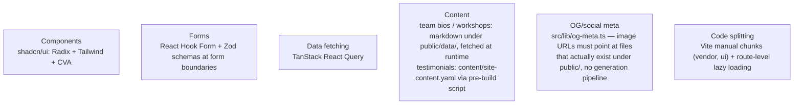

## DW-02.1 Route table — lazy-loaded, code-split

- All route components are `lazy()`-loaded (src/App.tsx:10-22); `RouteErrorBoundary` (src/App.tsx:44) contains a failed lazy chunk so it does not white-screen the whole SPA (Sprint v9 D3, src/App.tsx:42-43 comment).
- `v7_relativeSplatPath` is audited as a no-op here (the sole splat route's links are all absolute); `v7_startTransition` only changes how a navigation to a not-yet-loaded chunk holds the outgoing page (src/App.tsx:32-38).

## DW-02.2 Legacy redirects

- `public/sitemap.xml` must be kept in sync with the route table by hand when routes change (CLAUDE.md route-table section).

## DW-02.3 Build & test commands

- CLAUDE.md's Behavioral Rules require `npm run build` and `npm run lint` before committing.

## DW-02.4 Dev-server hardening — `/data/team` path-traversal guard

- This middleware exists only in the Vite dev server (`configureServer`); the production static build serves `public/data/team/` as plain files with no equivalent runtime guard.

## DW-02.5 `index.html` — CSP and build-date injection

- The CSP is why the React `__p` deep-link pickup lives in the external `public/spa-redirect.js` rather than an inline script injected at deploy time (see DW-01.7); an inline script would be blocked.

## DW-02.6 Key patterns

- TypeScript: strict mode is **partial** — `noImplicitAny: false`, `strictNullChecks: true`; target ES2020, module ESNext, JSX react-jsx (CLAUDE.md TypeScript Configuration section).
