## DW-03.1 The four-zone model, authored once
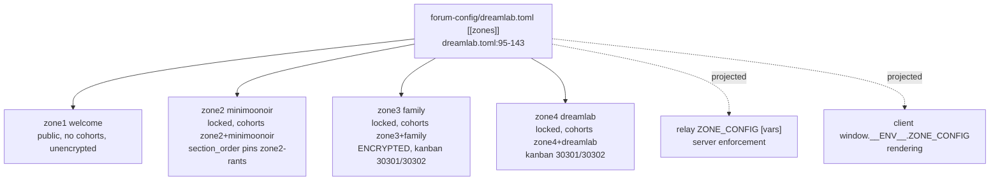
- INVARIANT (`IDENTITY-zones.md:144-145`): `required_cohorts` must stay dual-accept (zone id + legacy slug) until every legacy slug grant is migrated, or locked-zone members lose access — dropping either arm collapsed legacy members to welcome-only in a 2026-07-20 regression (`dreamlab.toml:110-113` comment).
- INVARIANT: only `zone3` (Family) carries `encrypted = true` (`dreamlab.toml:131`); changing `encrypted` on any zone changes the E2E guarantee and must be recorded (`IDENTITY-zones.md:146-147`).
- DOC-DRIFT: `README.md` markets locked "Friends, Family, and DreamLab" zones; the config has no `friends` zone — the second zone is `minimoonoir` (`IDENTITY-zones.md:120-123`, `dreamlab.toml:106-109`). The public zone is `zone1` Welcome, not `minimoonoir`; "Public MiniMooNoir landing" in the README is misleading — `minimoonoir` (`zone2`) is `visibility = "locked"` (`IDENTITY-zones.md:124-127`, `dreamlab.toml:101,115`).

## DW-03.2 DOC-DRIFT — `dreamlab_zone_names()` predates the four-zone model
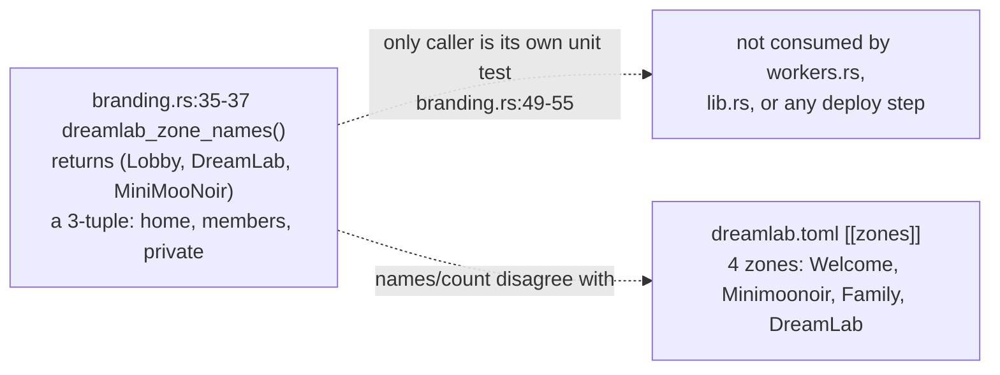
- DOC-DRIFT: `dreamlab_zone_names()` (src/branding.rs:35-37) documents "the kit's default zone IDs are `home`/`members`/`private`", a legacy 3-zone shape; the shipped config is the 4-zone `zone1..zone4` model in DW-03.1. A repo-wide search finds no caller besides the function's own test (`branding.rs:49-55`) — this function is dead code describing a superseded naming scheme.

## DW-03.3 Admin roster — four trust domains, one unsplit key
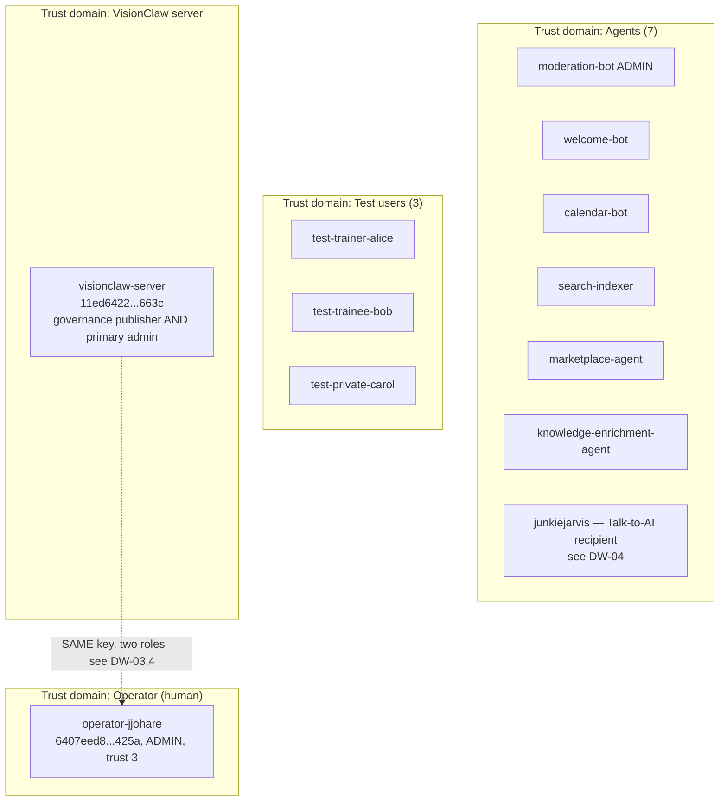
- All entities carry `authorised_by` naming the human operator `operator-jjohare` (`forum-config/README.md`, `IDENITY-zones.md:85-87`); admin pubkeys are static (`[admin].mode = "static"`, `dreamlab.toml:33-34`), not resolved from D1.
- DOC-DRIFT: `authorised_by` is authored in `[[agents]]` but not rendered — the kit renders the authorising principal from server-side D1 `agent_registry.registered_by`, and `ForumConfig` does not parse the `[[agents]]` table at all (`IDENTITY-zones.md:134-137`, `dreamlab.toml` `[[agents]]` comment).

## DW-03.4 Open, staged: the admin/governance key split
```mermaid
stateDiagram-v2
    [*] --> Unsplit
    Unsplit: visionclaw-server (11ed6422...663c) is BOTH\nprimary admin AND [governance].agent_pubkeys publisher
    Unsplit --> Staged: operator mints a distinct operator/admin key\ndocumented in admin-key-split-runbook.md
    Staged --> Split: FOUR-location atomic change executed by an operator
    Split --> [*]
    note right of Unsplit
      dreamlab.toml:33-56 comment; legacy ADR-040 D3.
      Held deliberately: the auth-worker ADMIN_PUBKEYS
      CF secret cannot be rotated from this repo or CI.
    end note
```
- The four locations the split must move together: `[admin].static_pubkeys` in `dreamlab.toml`, the relay/search worker `ADMIN_PUBKEYS` `[vars]`, and the auth-worker `ADMIN_PUBKEYS` Cloudflare secret (`docs/deployment/admin-key-split-runbook.md`, referenced `dreamlab.toml:52-56`).
- `deploy.yml:60-64` marks `VITE_ADMIN_PUBKEY` as INTERIM per legacy ADR-041: the operator's current working admin key, already relay-whitelisted so signup DMs deliver with no runbook step; the ADR-040 D3 runbook must re-point it when executed, extending the split to a five-location atomic change (adding the client mirror).

## DW-03.5 The hand-synced mirror set (1/2) — admin, jarvis, zone-model
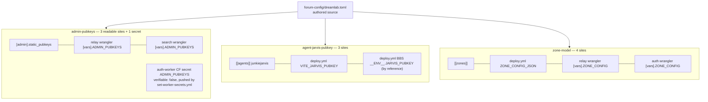
- `scripts/lib/config-mirrors.mjs:1-18` frames the whole mechanism: ADR-2005 accepts hand-synced mirrors as a deferred single-source-generator; before 2026-09-05 CI compared only ONE of these (admin pubkeys across relay+search), leaving the rest unchecked — a rotation that updated the TOML and missed a mirror shipped stale keys or zones silently.
- INVARIANT (`config-mirrors.mjs:145-150`): a plaintext `ADMIN_PUBKEYS` entry in the auth-worker's wrangler `[vars]` is itself an error — it would shadow the Cloudflare secret and silently win, so the check asserts the key is absent from `[vars]` there.

## DW-03.6 The hand-synced mirror set (2/2) — pod, client-admin, relay
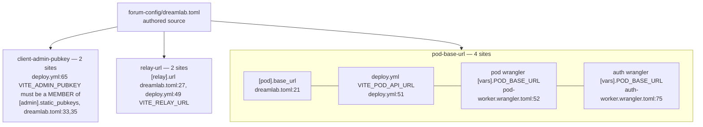
- Six mirror groups total across DW-03.5/DW-03.6 — this is the actual shape of the brief's "known three-way manual sync anomaly": not three locations but six independently-tracked governed data points, each with its own site count.

## DW-03.7 Completeness sweep — catching an unenumerated mirror
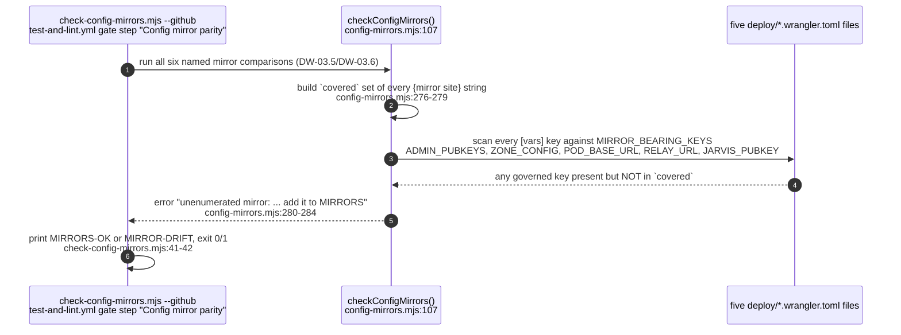
- This is the second half of the ADR-2005 mitigation: enumerating six mirrors is only safe if the sweep also proves nothing ELSE governed exists unchecked — a future worker `[vars]` entry reusing one of the five `MIRROR_BEARING_KEYS` fails CI until it is added to `MIRRORS`.

## DW-03.8 KV placeholder and required-secret fail-closed gates
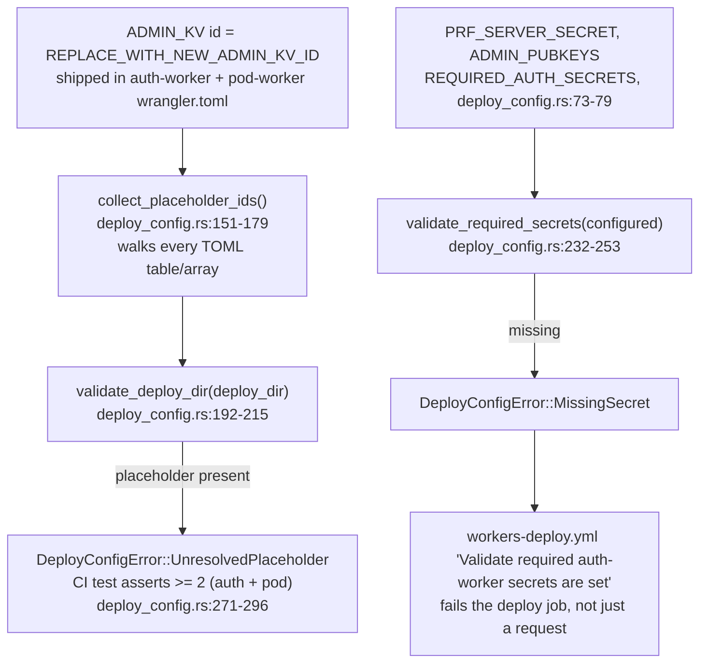
- The `provision-kv` pre-job in `workers-deploy.yml` (line 60) resolves or creates a SINGLE shared `dreamlab-admin-kv` namespace before the per-worker matrix runs, specifically so the auth-worker's `ADMIN_KV` (read/write) and pod-worker's `ADMIN_KV_RO` (read-only) bind the same namespace — a per-worker title would split it and silently drop bans/mutes.
- `NATIVE_POD_ADMIN_KEY`/`NATIVE_POD_URL` are OPTIONAL secrets (`workers-deploy.yml:298-304`): absent, `/api/native-pod/provision` 503s "native pod not configured" rather than crashing — the deploy step warns but does not block on these two.

## DW-03.9 Per-worker wrangler bindings (1/2) — auth-worker and pod-worker
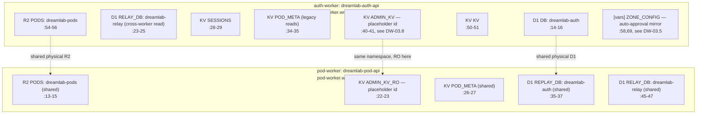
- `ADMIN_KV` (auth, read/write) and `ADMIN_KV_RO` (pod, read-only) are a deliberate split; both ship the unresolved `REPLACE_WITH_NEW_ADMIN_KV_ID` placeholder (DW-03.8) — `workers-deploy.yml`'s `provision-kv` job substitutes the real id into both at deploy time.

## DW-03.10 Per-worker wrangler bindings (2/2) — relay, search, preview
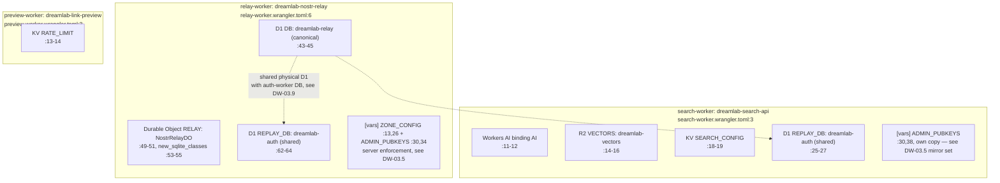
- INVARIANT: `dreamlab-auth` D1 hosts the `nip98_replay` table read via `REPLAY_DB`/`RELAY_DB`/`DB` bindings from all four HTTP workers — auth/pod/search's `REPLAY_DB` and relay's own `DB` are the same physical database under different binding names per worker (see DW-03.9/DW-03.10).
- `preview-worker` is the only one of the five with no D1/R2 binding at all — its state is a single rate-limit KV namespace, consistent with it being a stateless SSRF-guarded link-preview fetcher (see DW-04.8).
- `search-worker`'s `ADMIN_PUBKEYS` is its own separate `[vars]` copy, not read from `ADMIN_KV`/`ADMIN_KV_RO` — the gap DW-04.6 notes (D1-promoted admins invisible to search) follows directly from this file's binding shape.

## DW-03.11 The forum's only D1 DDL — `migrations/001_init.sql`
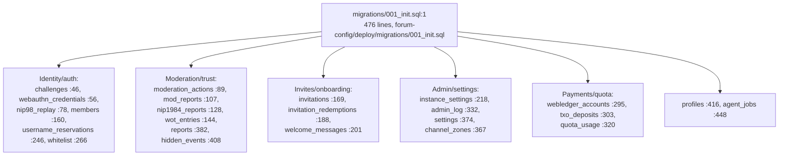
- 24 `CREATE TABLE IF NOT EXISTS` statements, run against the `dreamlab-auth` D1 database via `auth-worker.wrangler.toml:18` `migrations_dir = "migrations"` — this file is the only DDL in the repo; `dreamlab-relay`'s Durable Object storage (DW-03.10 `RELAYW`) has no equivalent SQL file because `NostrRelayDO` manages its own SQLite schema at runtime.
- `moderation_actions`/`mod_reports` back `docs/api/MODERATION_API.md`'s kind 30910-30914 projections (see DW-06.5); `whitelist`/`members` back the D1 half of admin resolution (DW-04.6); `nip98_replay` backs the replay-protection binding shared across all four HTTP workers (DW-03.9/DW-03.10).
