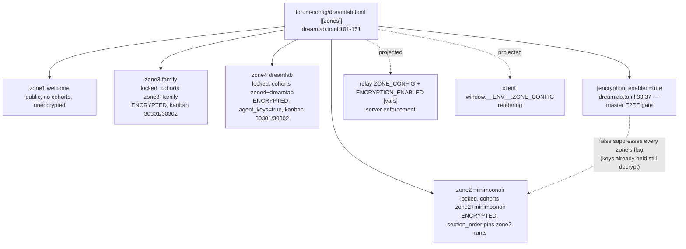
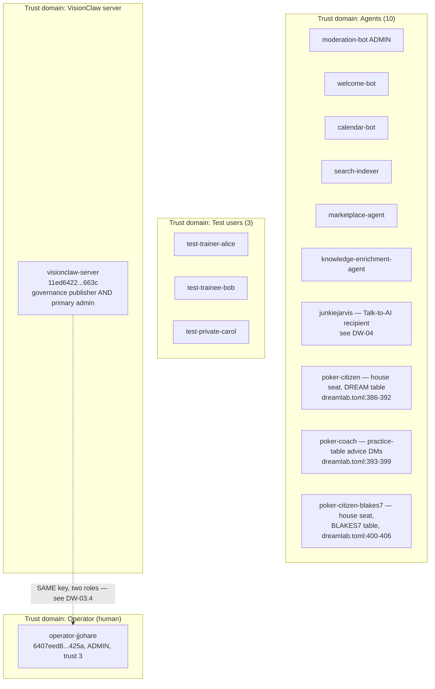
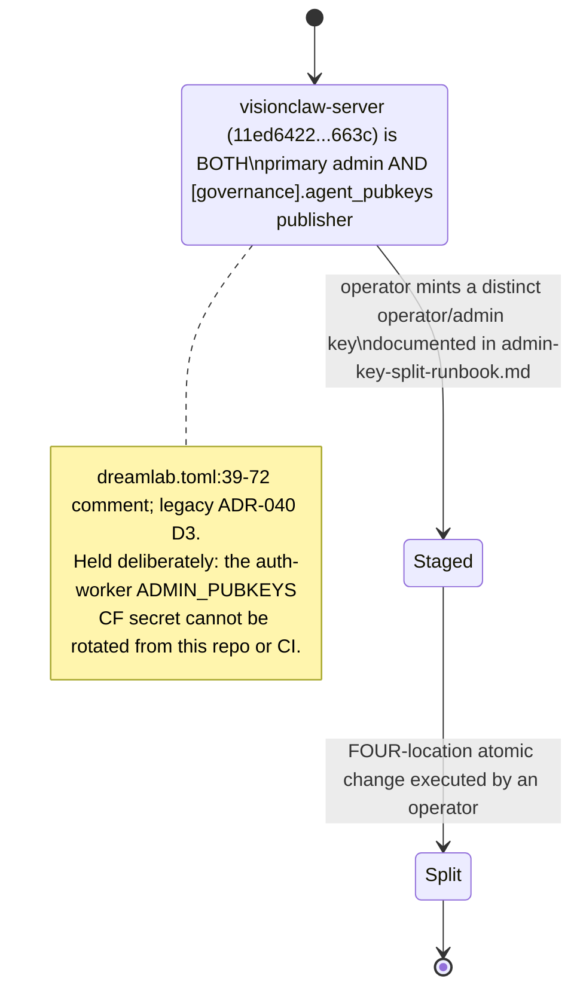
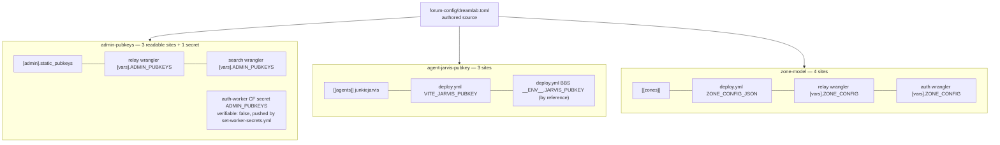
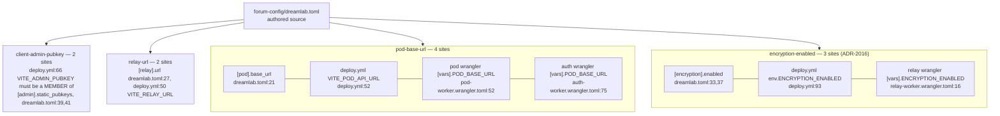
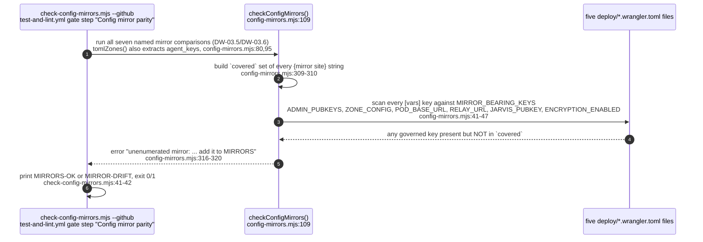
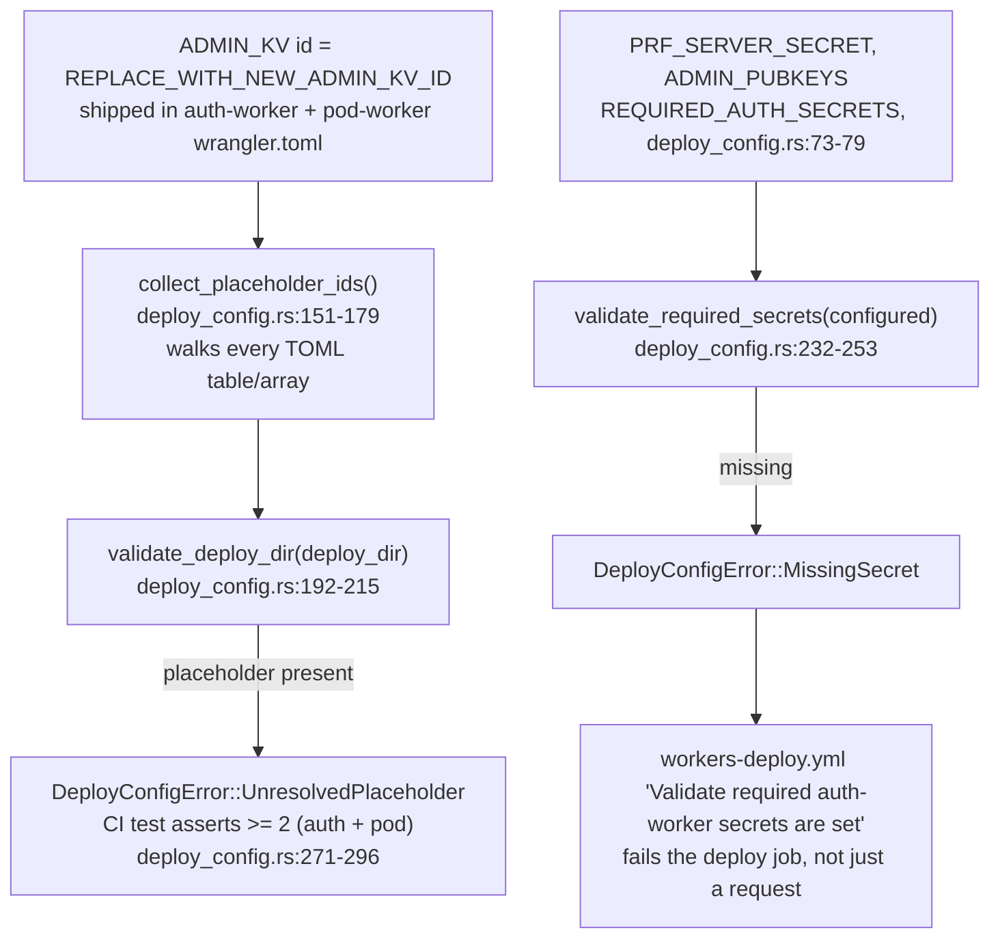
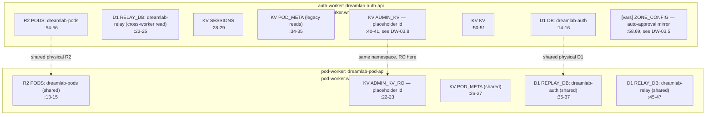
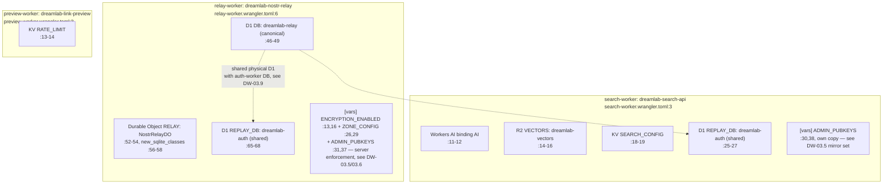
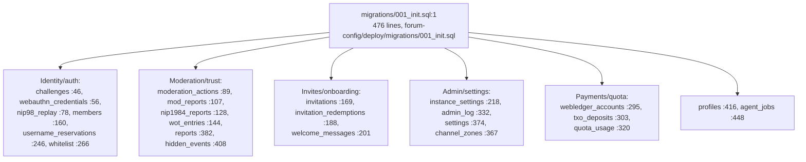

## DW-03.1 The four-zone model plus the encryption master gate

```mermaid
flowchart TB
    TOML["forum-config/dreamlab.toml [[zones]]<br/>dreamlab.toml:101-151"] --> Z1["zone1 welcome<br/>public, no cohorts, unencrypted"]
    TOML --> Z2["zone2 minimoonoir<br/>locked, cohorts zone2+minimoonoir<br/>ENCRYPTED, section_order pins zone2-rants"]
    TOML --> Z3["zone3 family<br/>locked, cohorts zone3+family<br/>ENCRYPTED, kanban 30301/30302"]
    TOML --> Z4["zone4 dreamlab<br/>locked, cohorts zone4+dreamlab<br/>ENCRYPTED, agent_keys=true, kanban 30301/30302"]
    TOML --> ENC["[encryption] enabled=true<br/>dreamlab.toml:33,37 — master E2EE gate"]
    ENC -.->|"false suppresses every zone's flag<br/>(keys already held still decrypt)"| Z2
    TOML -.->|projected| RELAY["relay ZONE_CONFIG + ENCRYPTION_ENABLED [vars]<br/>server enforcement"]
    TOML -.->|projected| CLIENT["client window.__ENV__.ZONE_CONFIG<br/>rendering"]
```
- INVARIANT (`IDENTITY-zones.md:164-165`): `required_cohorts` must stay dual-accept (zone id + legacy slug) until every legacy slug grant is migrated, or locked-zone members lose access — dropping either arm collapsed legacy members to welcome-only in a 2026-07-20 regression (`dreamlab.toml:116-119` comment).
- DOC-DRIFT: `IDENTITY-zones.md`'s invariant "only `zone3` is encrypted" (`IDENTITY-zones.md:166-167`) no longer holds — `zone2`/`zone3`/`zone4` all carry `encrypted = true` (`dreamlab.toml:123,137,148`) and `zone4` additionally sets `agent_keys = true` (`dreamlab.toml:149`); the new `[encryption].enabled` gate is the actual global override (`dreamlab.toml:33-37`) and is itself a hand-synced mirror — see DW-03.6 M7.
- DOC-DRIFT: `README.md` markets locked "Friends, Family, and DreamLab" zones; the config has no `friends` zone — the second zone is `minimoonoir` (`IDENTITY-zones.md:140-142`, `dreamlab.toml:112-115`). The public zone is `zone1` Welcome, not `minimoonoir`; "Public MiniMooNoir landing" in the README is misleading — `minimoonoir` (`zone2`) is `visibility = "locked"` (`IDENTITY-zones.md:144-146`, `dreamlab.toml:107,121`).
- DOC-DRIFT: `dreamlab_zone_names()` (`branding.rs:41-43`) documents a legacy 3-zone naming scheme (`home`/`members`/`private` displayed as `Lobby`/`DreamLab`/`MiniMooNoir`) predating this four-zone model; its only caller is its own unit test (`branding.rs:66-72`) — not `workers.rs`, `lib.rs`, or any deploy step — so it is dead code describing a superseded scheme.
- The branding overlay now matches the authored TOML: `dreamlab_branding()` sets `node_name` to `MINIMOONOIR` and `logo_url` to `None` (`branding.rs:18,29`), the values `dreamlab.toml:82,86` author, and a unit test pins the pair so the programmatic mirror cannot diverge again (`branding.rs:56-63`; dream-cycle candidate `5dbf18b`, 2026-10-02). Before it the overlay said `DREAMLAB BBS` and pointed at `/assets/logo.svg`.
- **Drift:** the deploy env the overlay claims to mirror (`branding.rs:24-25`) still projects the dead asset: `BBS_LOGO_URL` is `https://dreamlab-ai.com/assets/logo.svg` (`deploy.yml:107`) and is injected into the BBS client's `window.__ENV__.LOGO_URL` (`deploy.yml:346`), while `dreamlab.toml:86` records that path as a 404 and the overlay now returns no logo. `BBS_NODE_NAME` (`deploy.yml:103`) does agree.

## DW-03.3 Admin roster — four trust domains, one unsplit key

```mermaid
flowchart TB
    subgraph Operator["Trust domain: Operator (human)"]
        OP["operator-jjohare<br/>6407eed8...425a, ADMIN, trust 3"]
    end
    subgraph Agents["Trust domain: Agents (10)"]
        MB["moderation-bot ADMIN"]
        WB["welcome-bot"]
        CB["calendar-bot"]
        SI["search-indexer"]
        MA["marketplace-agent"]
        KE["knowledge-enrichment-agent"]
        JJ["junkiejarvis — Talk-to-AI recipient<br/>see DW-04"]
        PC["poker-citizen — house seat, DREAM table<br/>dreamlab.toml:386-392"]
        PCK["poker-coach — practice-table advice DMs<br/>dreamlab.toml:393-399"]
        PCB["poker-citizen-blakes7 — house seat,<br/>BLAKES7 table, dreamlab.toml:400-406"]
    end
    subgraph TestUsers["Trust domain: Test users (3)"]
        TA["test-trainer-alice"]
        TB2["test-trainee-bob"]
        TC["test-private-carol"]
    end
    subgraph VC["Trust domain: VisionClaw server"]
        VS["visionclaw-server<br/>11ed6422...663c<br/>governance publisher AND primary admin"]
    end
    VS -.->|"SAME key, two roles — see DW-03.4"| OP
```
- All entities carry `authorised_by` naming the human operator `operator-jjohare` (`forum-config/README.md`, `IDENTITY-zones.md:86-87`); admin pubkeys are static (`[admin].mode = "static"`, `dreamlab.toml:39-40`), not resolved from D1.
- DOC-DRIFT: `authorised_by` is authored in `[[agents]]` but not rendered — the kit renders the authorising principal from server-side D1 `agent_registry.registered_by`, and `ForumConfig` does not parse the `[[agents]]` table at all (`IDENTITY-zones.md:154-157`, `dreamlab.toml` `[[agents]]` comment).
- DOC-DRIFT: `[[agents]]` has grown from seven to ten — `poker-citizen`, `poker-coach` and `poker-citizen-blakes7` joined for the poker table (`dreamlab.toml:386-405`, ADR-2009/kit ADR-2021) — but `IDENTITY-zones.md:89` still reads "Seven agents and three test users".

## DW-03.4 Open, staged: the admin/governance key split

```mermaid
stateDiagram-v2
    [*] --> Unsplit
    Unsplit: visionclaw-server (11ed6422...663c) is BOTH\nprimary admin AND [governance].agent_pubkeys publisher
    Unsplit --> Staged: operator mints a distinct operator/admin key\ndocumented in admin-key-split-runbook.md
    Staged --> Split: FOUR-location atomic change executed by an operator
    Split --> [*]
    note right of Unsplit
      dreamlab.toml:39-72 comment; legacy ADR-040 D3.
      Held deliberately: the auth-worker ADMIN_PUBKEYS
      CF secret cannot be rotated from this repo or CI.
    end note
```
- The four locations the split must move together: `[admin].static_pubkeys` in `dreamlab.toml`, the relay/search worker `ADMIN_PUBKEYS` `[vars]`, and the auth-worker `ADMIN_PUBKEYS` Cloudflare secret (`docs/deployment/admin-key-split-runbook.md`, referenced `dreamlab.toml:54-55`).
- `deploy.yml:61-66` marks `VITE_ADMIN_PUBKEY` as INTERIM per legacy ADR-041: the operator's current working admin key, already relay-whitelisted so signup DMs deliver with no runbook step; the ADR-040 D3 runbook must re-point it when executed, extending the split to a five-location atomic change (adding the client mirror).

## DW-03.5 The hand-synced mirror set (1/2) — admin, jarvis, zone-model

```mermaid
flowchart TB
    T["forum-config/dreamlab.toml<br/>authored source"] --> M1
    subgraph M1["admin-pubkeys — 3 readable sites + 1 secret"]
        direction LR
        A1["[admin].static_pubkeys"] --- A2["relay wrangler [vars].ADMIN_PUBKEYS"] --- A3["search wrangler [vars].ADMIN_PUBKEYS"]
        A4["auth-worker CF secret ADMIN_PUBKEYS<br/>verifiable: false, pushed by set-worker-secrets.yml"]
    end
    T --> M2
    subgraph M2["agent-jarvis-pubkey — 3 sites"]
        direction LR
        J1["[[agents]] junkiejarvis"] --- J2["deploy.yml VITE_JARVIS_PUBKEY"] --- J3["deploy.yml BBS __ENV__.JARVIS_PUBKEY (by reference)"]
    end
    T --> M3
    subgraph M3["zone-model — 4 sites"]
        direction LR
        Z1["[[zones]]"] --- Z2["deploy.yml ZONE_CONFIG_JSON"] --- Z3["relay wrangler [vars].ZONE_CONFIG"] --- Z4["auth wrangler [vars].ZONE_CONFIG"]
    end
```
- `scripts/lib/config-mirrors.mjs:1-18` frames the whole mechanism: ADR-2005 accepts hand-synced mirrors as a deferred single-source-generator; before 2026-09-05 CI compared only ONE of these (admin pubkeys across relay+search), leaving the rest unchecked — a rotation that updated the TOML and missed a mirror shipped stale keys or zones silently.
- INVARIANT (`config-mirrors.mjs:145-150`): a plaintext `ADMIN_PUBKEYS` entry in the auth-worker's wrangler `[vars]` is itself an error — it would shadow the Cloudflare secret and silently win, so the check asserts the key is absent from `[vars]` there.

## DW-03.6 The hand-synced mirror set (2/2) — pod, client-admin, relay

```mermaid
flowchart TB
    T["forum-config/dreamlab.toml<br/>authored source"] --> M4
    subgraph M4["pod-base-url — 4 sites"]
        direction LR
        P1["[pod].base_url<br/>dreamlab.toml:21"] --- P2["deploy.yml VITE_POD_API_URL<br/>deploy.yml:52"] --- P3["pod wrangler [vars].POD_BASE_URL<br/>pod-worker.wrangler.toml:52"] --- P4["auth wrangler [vars].POD_BASE_URL<br/>auth-worker.wrangler.toml:75"]
    end
    T --> M5["client-admin-pubkey — 2 sites<br/>deploy.yml:66 VITE_ADMIN_PUBKEY must be a MEMBER of<br/>[admin].static_pubkeys, dreamlab.toml:39,41"]
    T --> M6["relay-url — 2 sites<br/>[relay].url dreamlab.toml:27, deploy.yml:50 VITE_RELAY_URL"]
    T --> M7
    subgraph M7["encryption-enabled — 3 sites (ADR-2016)"]
        direction LR
        E1["[encryption].enabled<br/>dreamlab.toml:33,37"] --- E2["deploy.yml env.ENCRYPTION_ENABLED<br/>deploy.yml:93"] --- E3["relay wrangler [vars].ENCRYPTION_ENABLED<br/>relay-worker.wrangler.toml:16"]
    end
```
- Seven mirror groups total across DW-03.5/DW-03.6 — this is the actual shape of the brief's "known three-way manual sync anomaly": not three locations but seven independently-tracked governed data points, each with its own site count. `encryption-enabled` is the newest of the enumerated seven, added alongside `[encryption].enabled` (see DW-03.1).
- **Drift (an eighth, unenumerated mirror):** the poker parameters are now also hand-synced — `dreamlab.toml` `[poker]` is mirrored BY HAND into `deploy.yml` `POKER_CONFIG_JSON` (dreamlab.toml:305-308 comment; deploy.yml:83-89, injected at deploy.yml:274,346). Neither site appears in `config-mirrors.mjs`'s `MIRROR_BEARING_KEYS` (`config-mirrors.mjs:41-47`), so the DW-03.7 completeness sweep cannot see it: a `[poker]` edit that misses the deploy mirror ships stale table parameters silently. The sweep's guarantee ("nothing ELSE governed exists unchecked") holds only for the six keys it enumerates.

## DW-03.7 Completeness sweep — catching an unenumerated mirror

```mermaid
sequenceDiagram
    autonumber
    participant CI as check-config-mirrors.mjs --github<br/>test-and-lint.yml gate step "Config mirror parity"
    participant LIB as checkConfigMirrors()<br/>config-mirrors.mjs:109
    participant W as five deploy/*.wrangler.toml files
    CI->>LIB: run all seven named mirror comparisons (DW-03.5/DW-03.6)<br/>tomlZones() also extracts agent_keys, config-mirrors.mjs:80,95
    LIB->>LIB: build `covered` set of every {mirror site} string<br/>config-mirrors.mjs:309-310
    LIB->>W: scan every [vars] key against MIRROR_BEARING_KEYS<br/>ADMIN_PUBKEYS, ZONE_CONFIG, POD_BASE_URL, RELAY_URL, JARVIS_PUBKEY, ENCRYPTION_ENABLED<br/>config-mirrors.mjs:41-47
    W-->>LIB: any governed key present but NOT in `covered`
    LIB-->>CI: error "unenumerated mirror: ... add it to MIRRORS"<br/>config-mirrors.mjs:316-320
    CI->>CI: print MIRRORS-OK or MIRROR-DRIFT, exit 0/1<br/>check-config-mirrors.mjs:41-42
```
- This is the second half of the ADR-2005 mitigation: enumerating seven mirrors is only safe if the sweep also proves nothing ELSE governed exists unchecked — a future worker `[vars]` entry reusing one of the six `MIRROR_BEARING_KEYS` fails CI until it is added to `MIRRORS`.

## DW-03.8 KV placeholder and required-secret fail-closed gates

```mermaid
flowchart TB
    KVID["ADMIN_KV id = REPLACE_WITH_NEW_ADMIN_KV_ID<br/>shipped in auth-worker + pod-worker wrangler.toml"] --> SCAN["collect_placeholder_ids()<br/>deploy_config.rs:151-179<br/>walks every TOML table/array"]
    SCAN --> DETECT["validate_deploy_dir(deploy_dir)<br/>deploy_config.rs:192-215"]
    DETECT -->|placeholder present| FAIL1["DeployConfigError::UnresolvedPlaceholder<br/>CI test asserts >= 2 (auth + pod)<br/>deploy_config.rs:271-296"]
    SECRETS["PRF_SERVER_SECRET, ADMIN_PUBKEYS<br/>REQUIRED_AUTH_SECRETS, deploy_config.rs:73-79"] --> CHECK["validate_required_secrets(configured)<br/>deploy_config.rs:232-253"]
    CHECK -->|missing| FAIL2["DeployConfigError::MissingSecret"]
    FAIL2 --> DEPLOYSTEP["workers-deploy.yml 'Validate required auth-worker secrets are set'<br/>fails the deploy job, not just a request"]
```
- The `provision-kv` pre-job in `workers-deploy.yml` (line 61) resolves or creates a SINGLE shared `dreamlab-admin-kv` namespace before the per-worker matrix runs, specifically so the auth-worker's `ADMIN_KV` (read/write) and pod-worker's `ADMIN_KV_RO` (read-only) bind the same namespace — a per-worker title would split it and silently drop bans/mutes.
- `NATIVE_POD_ADMIN_KEY`/`NATIVE_POD_URL` are OPTIONAL secrets (`workers-deploy.yml:299-305`): absent, `/api/native-pod/provision` 503s "native pod not configured" rather than crashing — the deploy step warns but does not block on these two.

## DW-03.9 Per-worker wrangler bindings (1/2) — auth-worker and pod-worker

```mermaid
flowchart TB
    subgraph AUTHW["auth-worker: dreamlab-auth-api<br/>auth-worker.wrangler.toml:7"]
        A_DB["D1 DB: dreamlab-auth<br/>:14-16"]
        A_RDB["D1 RELAY_DB: dreamlab-relay (cross-worker read)<br/>:23-25"]
        A_SESS["KV SESSIONS<br/>:28-29"]
        A_PODM["KV POD_META (legacy reads)<br/>:34-35"]
        A_ADMIN["KV ADMIN_KV — placeholder id<br/>:40-41, see DW-03.8"]
        A_KV["KV KV<br/>:50-51"]
        A_R2["R2 PODS: dreamlab-pods<br/>:54-56"]
        A_ZONE["[vars] ZONE_CONFIG — auto-approval mirror<br/>:58,69, see DW-03.5"]
    end
    subgraph PODW["pod-worker: dreamlab-pod-api<br/>pod-worker.wrangler.toml:6"]
        P_R2["R2 PODS: dreamlab-pods (shared)<br/>:13-15"]
        P_KVRO["KV ADMIN_KV_RO — placeholder id<br/>:22-23"]
        P_PODM["KV POD_META (shared)<br/>:26-27"]
        P_RDB["D1 REPLAY_DB: dreamlab-auth (shared)<br/>:35-37"]
        P_RELDB["D1 RELAY_DB: dreamlab-relay (shared)<br/>:45-47"]
    end
    A_DB -.->|"shared physical D1"| P_RDB
    A_R2 -.->|"shared physical R2"| P_R2
    A_ADMIN -.->|"same namespace, RO here"| P_KVRO
```
- `ADMIN_KV` (auth, read/write) and `ADMIN_KV_RO` (pod, read-only) are a deliberate split; both ship the unresolved `REPLACE_WITH_NEW_ADMIN_KV_ID` placeholder (DW-03.8) — `workers-deploy.yml`'s `provision-kv` job substitutes the real id into both at deploy time.

## DW-03.10 Per-worker wrangler bindings (2/2) — relay, search, preview

```mermaid
flowchart TB
    subgraph RELAYW["relay-worker: dreamlab-nostr-relay<br/>relay-worker.wrangler.toml:6"]
        R_DB["D1 DB: dreamlab-relay (canonical)<br/>:46-49"]
        R_DO["Durable Object RELAY: NostrRelayDO<br/>:52-54, new_sqlite_classes :56-58"]
        R_RDB["D1 REPLAY_DB: dreamlab-auth (shared)<br/>:65-68"]
        R_VARS["[vars] ENCRYPTION_ENABLED :13,16 + ZONE_CONFIG :26,29<br/>+ ADMIN_PUBKEYS :31,37 — server enforcement, see DW-03.5/03.6"]
    end
    subgraph SEARCHW["search-worker: dreamlab-search-api<br/>search-worker.wrangler.toml:3"]
        S_AI["Workers AI binding AI<br/>:11-12"]
        S_R2["R2 VECTORS: dreamlab-vectors<br/>:14-16"]
        S_KV["KV SEARCH_CONFIG<br/>:18-19"]
        S_RDB["D1 REPLAY_DB: dreamlab-auth (shared)<br/>:25-27"]
        S_ADMIN["[vars] ADMIN_PUBKEYS<br/>:30,38, own copy — see DW-03.5 mirror set"]
    end
    subgraph PREVIEWW["preview-worker: dreamlab-link-preview<br/>preview-worker.wrangler.toml:3"]
        PR_KV["KV RATE_LIMIT<br/>:13-14"]
    end
    R_DB -.->|"shared physical D1<br/>with auth-worker DB, see DW-03.9"| R_RDB
    R_DB -.-> S_RDB
```
- INVARIANT: `dreamlab-auth` D1 hosts the `nip98_replay` table read via `REPLAY_DB`/`RELAY_DB`/`DB` bindings from all four HTTP workers — auth/pod/search's `REPLAY_DB` and relay's own `DB` are the same physical database under different binding names per worker (see DW-03.9/DW-03.10).
- `preview-worker` is the only one of the five with no D1/R2 binding at all — its state is a single rate-limit KV namespace, consistent with it being a stateless SSRF-guarded link-preview fetcher (see DW-04.8).
- `search-worker`'s `ADMIN_PUBKEYS` is its own separate `[vars]` copy, not read from `ADMIN_KV`/`ADMIN_KV_RO` — the gap DW-04.6 notes (D1-promoted admins invisible to search) follows directly from this file's binding shape.

## DW-03.11 The forum's only D1 DDL — `migrations/001_init.sql`

```mermaid
flowchart TB
    MIG["migrations/001_init.sql:1<br/>476 lines, forum-config/deploy/migrations/001_init.sql"] --> IDENTITY["Identity/auth:<br/>challenges :46, webauthn_credentials :56,<br/>nip98_replay :78, members :160,<br/>username_reservations :246, whitelist :266"]
    MIG --> MOD["Moderation/trust:<br/>moderation_actions :89, mod_reports :107,<br/>nip1984_reports :128, wot_entries :144,<br/>reports :382, hidden_events :408"]
    MIG --> INVITE["Invites/onboarding:<br/>invitations :169, invitation_redemptions :188,<br/>welcome_messages :201"]
    MIG --> ADMIN["Admin/settings:<br/>instance_settings :218, admin_log :332,<br/>settings :374, channel_zones :367"]
    MIG --> PAY["Payments/quota:<br/>webledger_accounts :295, txo_deposits :303,<br/>quota_usage :320"]
    MIG --> MISC["profiles :416, agent_jobs :448"]
```
- 24 `CREATE TABLE IF NOT EXISTS` statements, run against the `dreamlab-auth` D1 database via `auth-worker.wrangler.toml:18` `migrations_dir = "migrations"` — this file is the only DDL in the repo; `dreamlab-relay`'s Durable Object storage (DW-03.10 `RELAYW`) has no equivalent SQL file because `NostrRelayDO` manages its own SQLite schema at runtime.
- `moderation_actions`/`mod_reports` back `docs/api/MODERATION_API.md`'s kind 30910-30914 projections (see DW-06.5); `whitelist`/`members` back the D1 half of admin resolution (DW-04.6); `nip98_replay` backs the replay-protection binding shared across all four HTTP workers (DW-03.9/DW-03.10).
