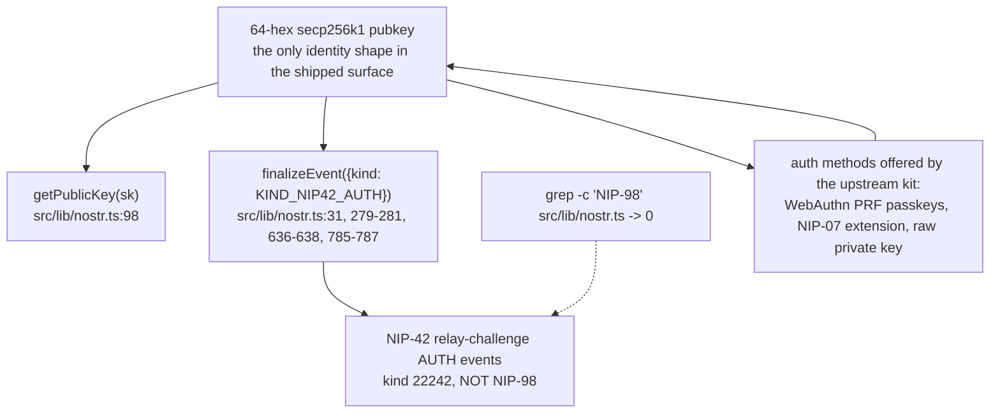
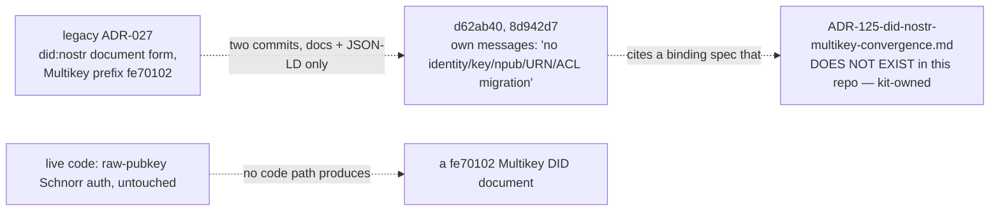
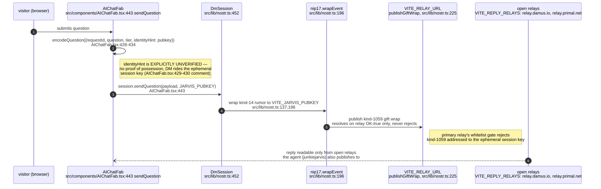
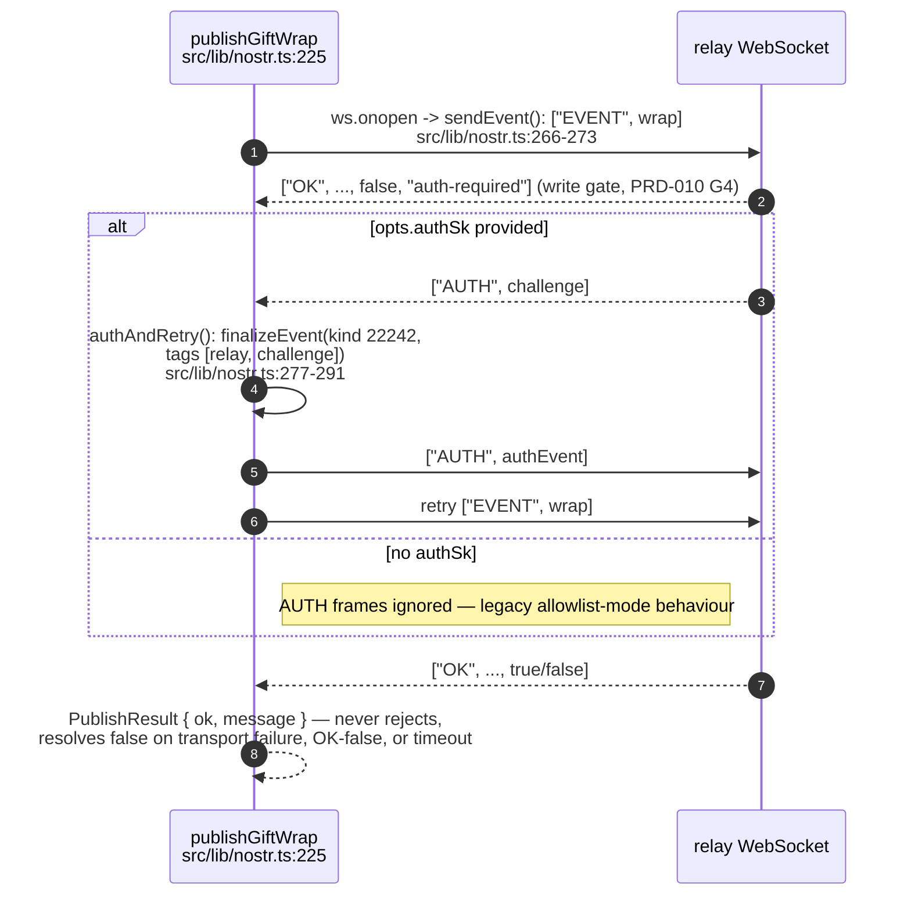
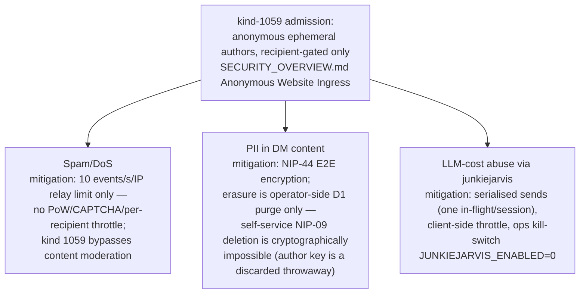
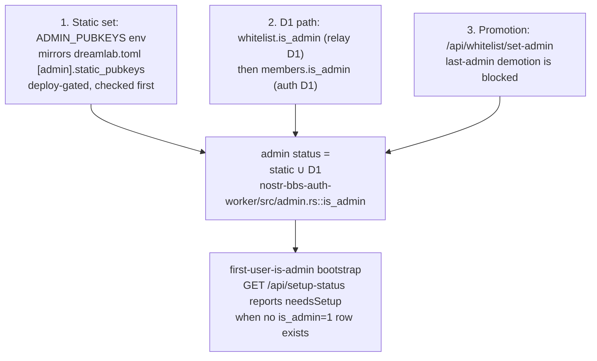
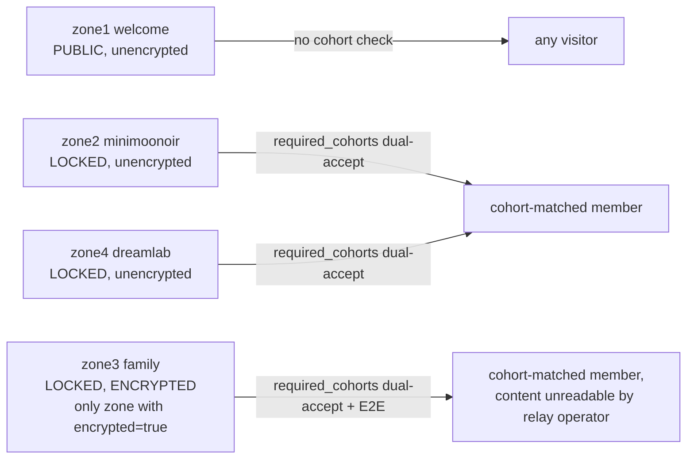
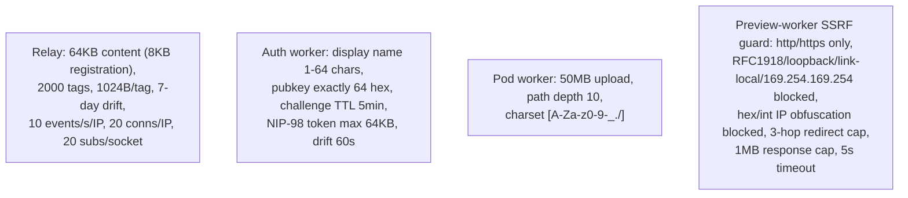

## DW-04.1 Identity is raw-hex Schnorr, not a DID document

- INVARIANT (`IDENTITY-zones.md:141-143`): identity in the shipped surface is the raw 64-hex secp256k1 pubkey; any move to emit or require a Multikey/DID document is a code change and a new ADR, not a docs edit.
- DOC-DRIFT within this repo's OWN docs: `docs/security/AUTHENTICATION.md` (`## NIP-98 HTTP Authentication`, line 200) documents NIP-98 as the upstream kit auth-worker's HTTP-API scheme (passkey/session auth to REST endpoints) — a genuinely different protocol from the NIP-42 relay-challenge flow this repo's own `src/lib/nostr.ts` implements for DM transport. `IDENTITY-zones.md:34-35`'s claim that "the string NIP-98 appears nowhere in nostr.ts" is true and specific to that one file; it does not mean NIP-98 is absent from the deployed system.

## DW-04.2 DID/Multikey convergence — documentation-only

- `fe70102` is not a commit hash — it is the Multikey encoding prefix itself: base16-multibase `f` + secp256k1-pub multicodec varint `e701` + compressed-point `02` (`IDENTITY-zones.md:46-49`).
- ADR-027 is archived as "Deferred — kit-owned" (`IDENTITY-zones.md:56`); treat any claim that this repo emits `did:nostr` Multikey documents as false until a code path produces one (`IDENTITY-zones.md:128-130`).

## DW-04.3 Talk-to-AI — client-side Nostr DM, not an HTTP chat endpoint

- INVARIANT (`IDENTITY-zones.md:148-149`): the Talk-to-AI reply-relay set must remain a subset of the agent's own publish fan-out, or replies are never seen.
- `AIChatFab.tsx`'s own closeout comment flags what is NOT yet built: "the DM transport carries no protocol-level correlation" for request/reply matching — a late answer to a timed-out question can otherwise read as the answer to whatever was asked most recently (`ChatMessage.lateForQuestion`, `AIChatFab.tsx:9-19`); the estate closeout note (`IDENTITY-zones.md:169`) calls this out explicitly: "Preserve sender verification while adding request/reply correlation and verifying real agent fan-out."

## DW-04.4 NIP-42 AUTH — lazy challenge-response on publish

- The challenge is answered lazily — only after a rejection — "so allowlist-mode relays keep the zero-round-trip fast path" (`src/lib/nostr.ts:260-263` comment).
- `authSk` is minted per submission and discarded, exactly as for the wrap signature — anonymity is preserved even though the publish now requires proof of key possession (`src/lib/nostr.ts:213-216`).

## DW-04.5 Anonymous website ingress — threat register

- Admission rule: the first `["p", ...]` tag pubkey must be whitelisted while the ephemeral author is deliberately unchecked; publishing an EVENT requires no NIP-42 AUTH, but reading kind-1059 DOES require it, with the filter's `#p` force-rewritten to the authed pubkey — a session can only ever read its own inbox (`SECURITY_OVERVIEW.md` Anonymous Website Ingress section).
- Federation posture: single relay today; kind 1059 is already in `dreamlab.toml [mesh].federated_kinds` (see DW-03), so this surface is "federation-ready by construction" though the mesh transport itself is designed, not shipped.

## DW-04.6 Admin identity resolution — three layers

- Known gap: the search-worker honours only its own `ADMIN_PUBKEYS` `[vars]` value — D1-promoted admins are not visible to it (`SECURITY_OVERVIEW.md` Admin Identity, "see the forum-flow cartography Gap 2").
- `workers-deploy.yml` blocks the auth-worker deploy if the `ADMIN_PUBKEYS` secret is unset (cross-reference DW-03.7's `validate_required_secrets` gate).

## DW-04.7 Zone visibility and encryption — the security-relevant subset

- INVARIANT (`IDENTITY-zones.md:146-147`): only `zone3` (Family) is encrypted; changing `encrypted` on any zone changes the E2E guarantee and must be recorded — see DW-03.1 for the full zone model this diagram's security view is drawn from.
- The estate closeout note (`IDENTITY-zones.md:169`) flags that zone encryption and cohort configuration "require deployed deny/revoke/recovery evidence before complete-system acceptance" — the config exists and is CI-checked for mirror parity (DW-03.5/03.6), but revocation behaviour has not been separately verified live.

## DW-04.8 Rate/size limits relevant to the identity surface

- Source: `docs/security/SECURITY_OVERVIEW.md` Relay/Auth-worker/Pod-worker Limits tables and SSRF Protection section — these limits are enforced in the upstream kit's worker source (cloned at `KIT_REF`, not vendored in this repo), so this diagram documents the operator-visible contract rather than code this repo owns.
