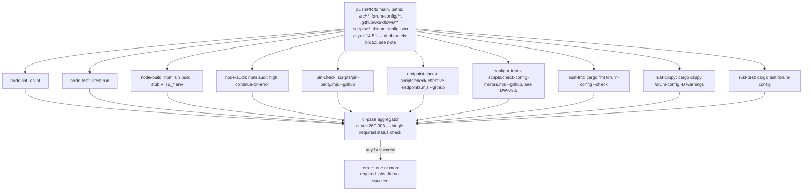
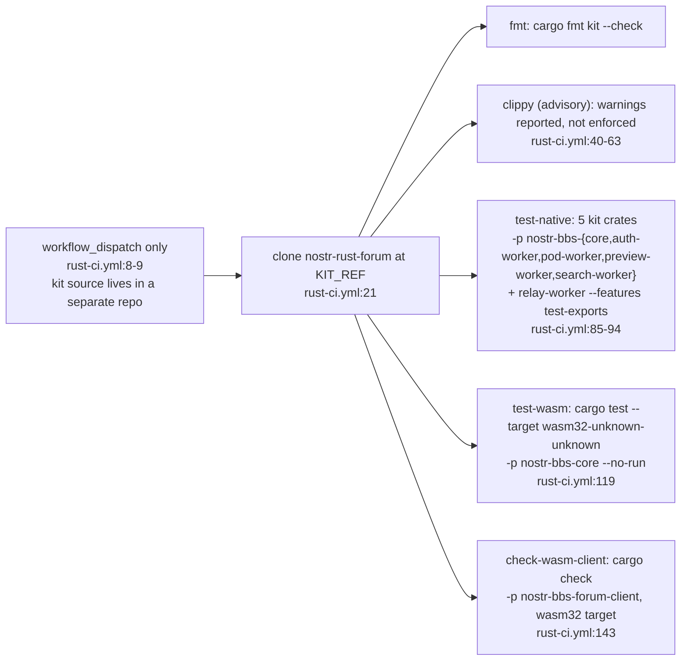
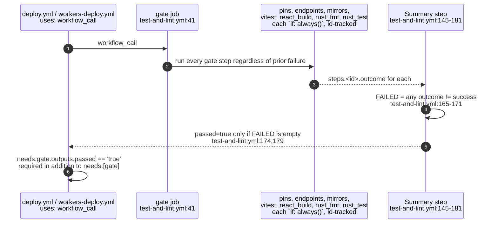
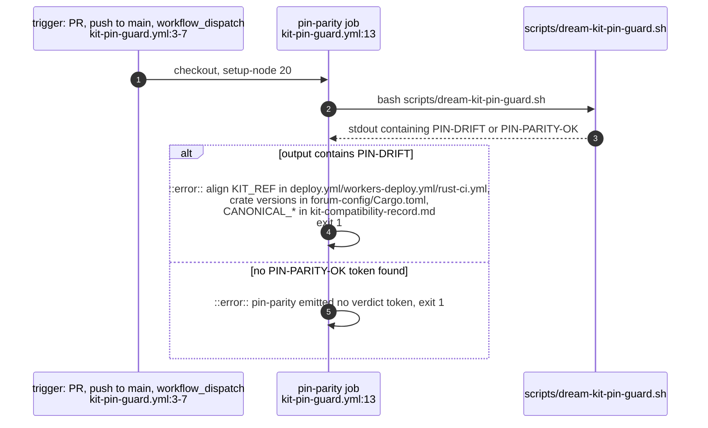
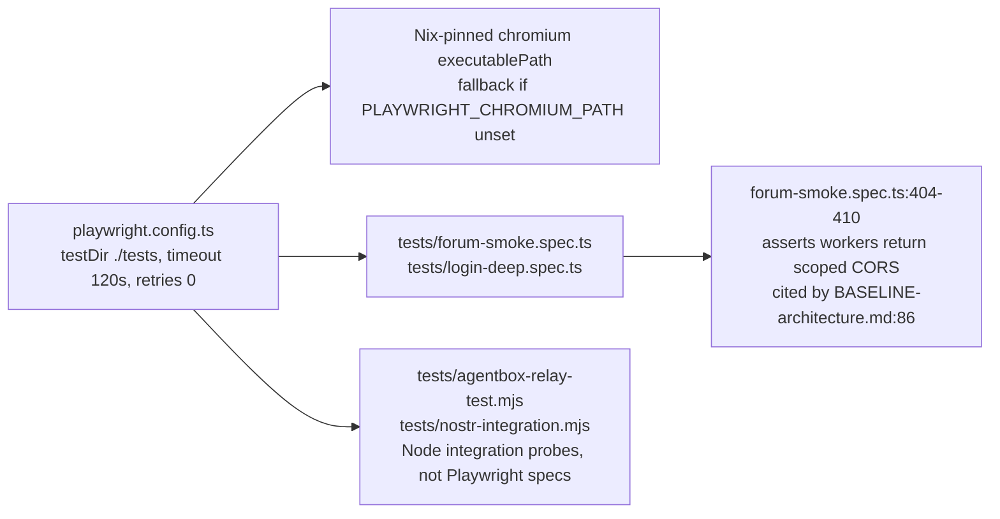
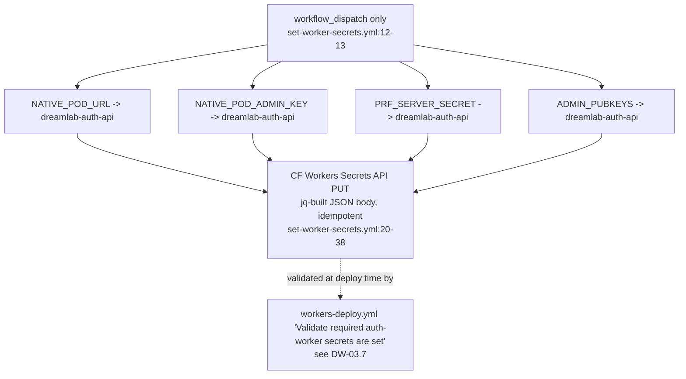

## DW-05.1 `ci.yml` — the ten-job PR/push gate and its aggregator

- `ci.yml:14-30` deliberately enumerates `.github/workflows/**` and `scripts/**` as trigger paths, not just the three `KIT_REF` pin sites: pin-check sweeps ALL workflow files for tag-pinned actions, so any workflow edit can break it — narrower path filters previously let `kit-pin-guard.yml` carry an unpinned `actions/checkout@v4` without re-running the gate that rejects it (2026-09-06 incident, `ci.yml:23-27` comment).
- `rust-clippy` here is `-D warnings` (blocking, `ci.yml:` rust-clippy job) — unlike `rust-ci.yml`'s clippy job against the kit, which is explicitly advisory (DW-05.2).

## DW-05.2 `rust-ci.yml` — manual-only gate against the upstream kit

- `rust-ci.yml:4-6` states the division of labour explicitly: "Triggered by workflow_dispatch (manual) since kit source lives in a separate repo. The test-and-lint.yml workflow covers forum-config/ on every push/PR automatically" — `forum-config/` gets automatic gating (DW-05.3); the kit itself only gets this manual, advisory-clippy check.

## DW-05.3 `test-and-lint.yml` — the reusable pre-deploy gate, fixed 2026-09-05

- INVARIANT: `test-and-lint.yml:1-17` documents two closed defects (ADR-2002/2003 closeout, 2026-09-05): (1) it previously ran no unit tests at all — Vitest lived only in the separate `ci.yml`, which `deploy.yml` does not depend on, so a red suite never blocked a deploy; (2) the final step wrote `passed=true` unconditionally under `if: always()`, so the output was true even when an earlier step had failed.
- `deploy.yml:111-117` and `workers-deploy.yml:62-66` both check `needs.gate.outputs.passed == 'true'` explicitly, not merely `needs: [gate]` — the comment notes this is deliberate: requiring the gate's own verdict means a future change that makes a gate step non-blocking cannot quietly re-open the publication path.
- DOC-DRIFT: `docs/BASELINE-architecture.md:173` (estate closeout, dated 2026-09-04) claims "CI has a Vitest/pin/admin aggregator, while deployment uses a separate reusable gate without Vitest" — that description predates the fix `test-and-lint.yml`'s own header documents as landing 2026-09-05 (one day later); as of this verified commit, `test-and-lint.yml` DOES run Vitest (`id: vitest`, line 89-92) and its `passed` output is a real aggregation, not a constant.

## DW-05.4 `kit-pin-guard.yml` — pin-parity as its own gate

- This is a narrower, faster check than `ci.yml`'s `pin-check` job (which runs the fuller `scripts/pin-parity.mjs --github`, also covering Action SHA pinning across all workflows) — `kit-pin-guard.yml` delegates to a plain-ESM shell+node script with no deps, pinned to Node 20 specifically because it "delegates to scripts/pin-parity.mjs" (kit-pin-guard.yml:18-19 comment).

## DW-05.5 Playwright / E2E surface

- Playwright/E2E specs are NOT wired into `ci.yml`, `test-and-lint.yml`, or any gate job in this tree — `CLAUDE.md:63` documents `npx playwright test` as a manual command requiring a running deployment (`playwright.config.ts` comment), consistent with `package.json`'s `test:e2e` script existing outside the `predev`/`prebuild` and CI-invoked script set.

## DW-05.6 `set-worker-secrets.yml` — the one-shot operator secret push

- `set-worker-secrets.yml:1-9` states the pipeline never generates these four values — they are read from GitHub repo secrets and pushed as-is; `PUT` on the CF secrets endpoint is idempotent, so the workflow is safe to re-run.
