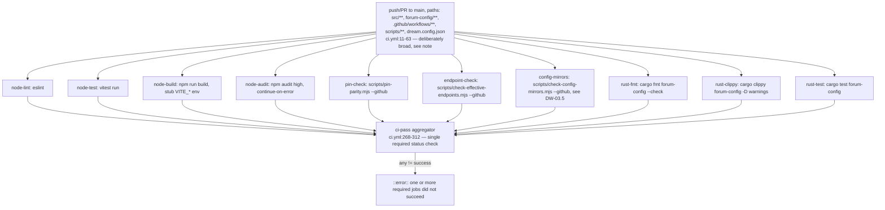
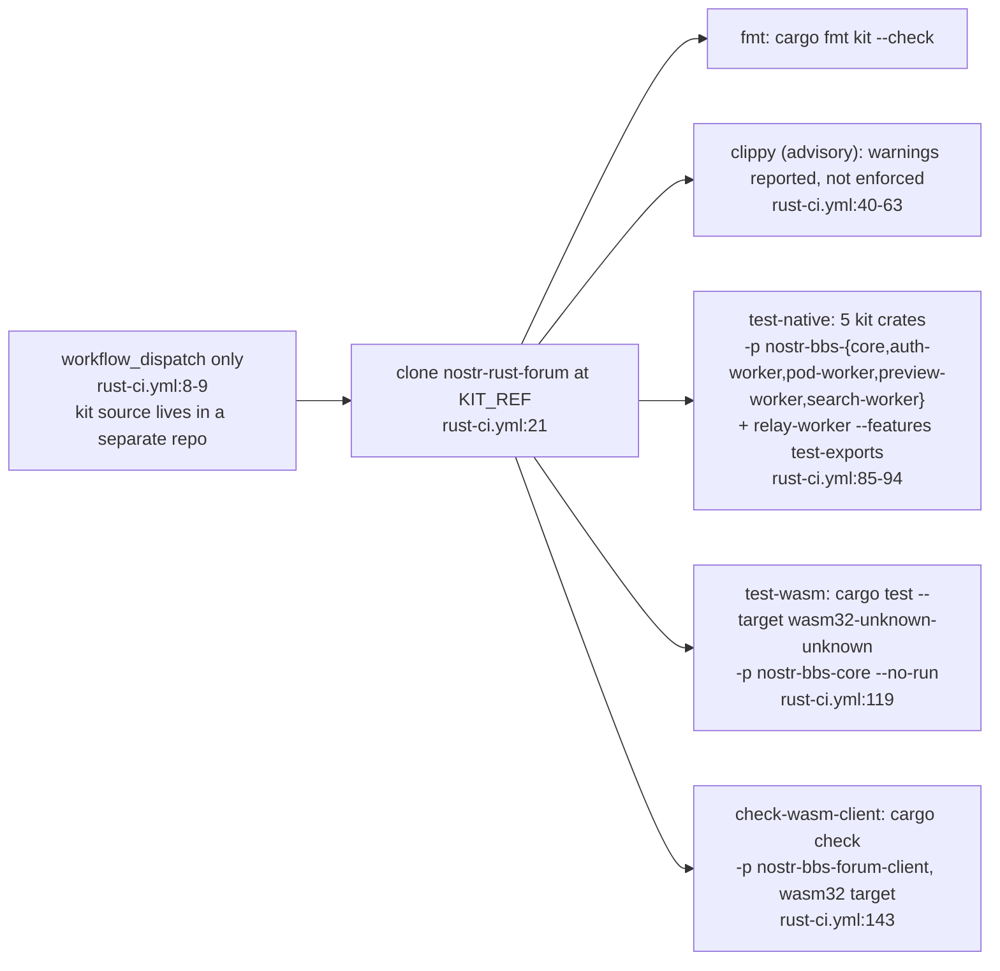
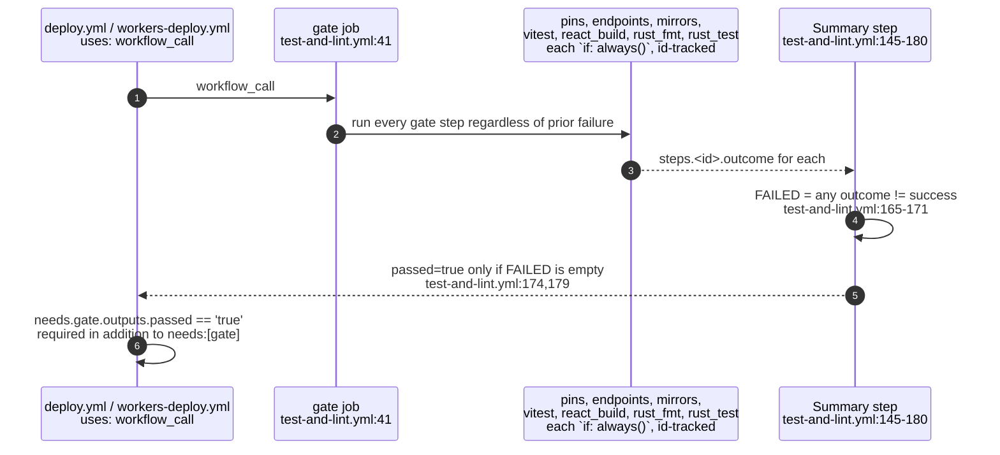
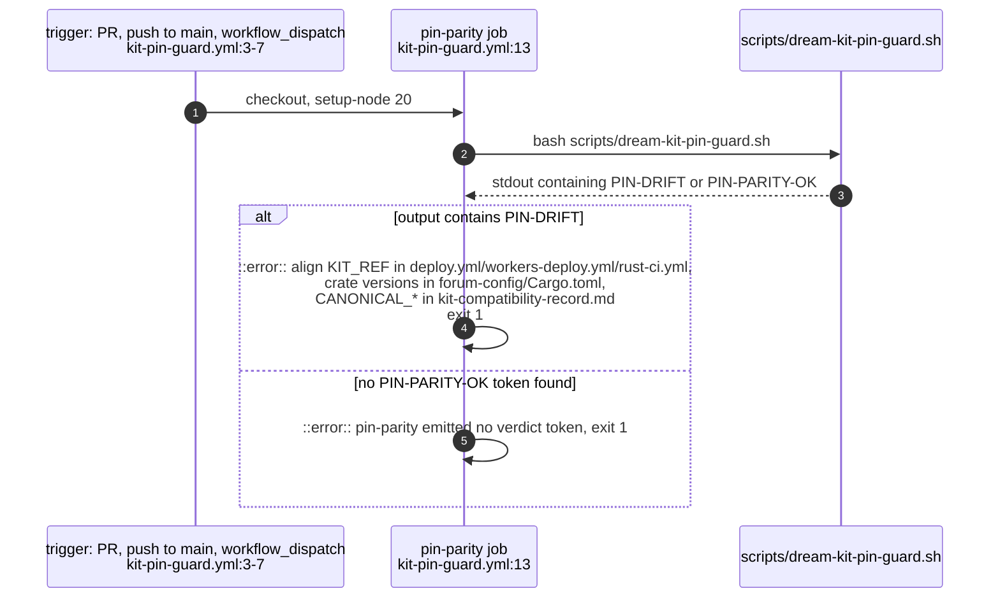
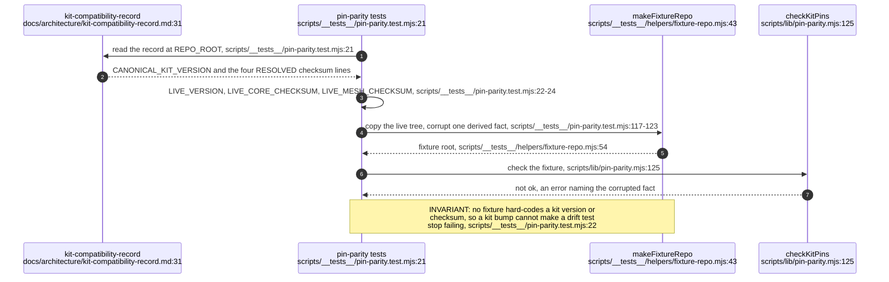

## DW-05.1 `ci.yml` — the ten-job PR/push gate and its aggregator

```mermaid
flowchart TB
    TRIG["push/PR to main, paths: src/**, forum-config/**,<br/>.github/workflows/**, scripts/**, dream.config.json<br/>ci.yml:11-63 — deliberately broad, see note"] --> NL["node-lint: eslint"]
    TRIG --> NT["node-test: vitest run"]
    TRIG --> NB["node-build: npm run build, stub VITE_* env"]
    TRIG --> NA["node-audit: npm audit high, continue-on-error"]
    TRIG --> PC["pin-check: scripts/pin-parity.mjs --github"]
    TRIG --> EC["endpoint-check: scripts/check-effective-endpoints.mjs --github"]
    TRIG --> CM["config-mirrors: scripts/check-config-mirrors.mjs --github, see DW-03.5"]
    TRIG --> RF["rust-fmt: cargo fmt forum-config --check"]
    TRIG --> RC["rust-clippy: cargo clippy forum-config -D warnings"]
    TRIG --> RT["rust-test: cargo test forum-config"]
    NL & NT & NB & NA & PC & EC & CM & RF & RC & RT --> PASS["ci-pass aggregator<br/>ci.yml:268-312 — single required status check"]
    PASS -->|any != success| BLOCK["::error:: one or more required jobs did not succeed"]
```
- `ci.yml:14-37` (push) and its mirror `ci.yml:40-62` (pull_request) deliberately enumerate `.github/workflows/**` and `scripts/**` as trigger paths, not just the three `KIT_REF` pin sites: pin-check sweeps ALL workflow files for tag-pinned actions, so any workflow edit can break it — narrower path filters previously let `kit-pin-guard.yml` carry an unpinned `actions/checkout@v4` without re-running the gate that rejects it (2026-09-06 incident, `ci.yml:26-30` comment).
- `rust-clippy` here is `-D warnings` (blocking, `ci.yml:171-188`) — unlike `rust-ci.yml`'s clippy job against the kit, which is explicitly advisory (DW-05.2).
- Playwright/E2E specs (`playwright.config.ts`, `tests/forum-smoke.spec.ts`) are deliberately NOT wired into `ci.yml`, `test-and-lint.yml` or any gate job in this tree — `CLAUDE.md:63-64` documents `npx playwright test` as a manual command requiring a running deployment; `forum-smoke.spec.ts:404-410` is the only spec asserting workers return scoped CORS, cited by `BASELINE-architecture.md:100`.
- `set-worker-secrets.yml` (`workflow_dispatch` only, `set-worker-secrets.yml:12-13`) is a one-shot operator push of four secrets (`NATIVE_POD_URL`, `NATIVE_POD_ADMIN_KEY`, `PRF_SERVER_SECRET`, `ADMIN_PUBKEYS`) to the `dreamlab-auth-api` CF Worker via the CF Workers Secrets API — the pipeline never generates these values, and the `PUT` is idempotent so the workflow is safe to re-run (`set-worker-secrets.yml:3-10`); all four are validated at deploy time by `workers-deploy.yml`'s "Validate required auth-worker secrets are set" step (`workers-deploy.yml:288`).
- `docs-update.yml` is the one workflow with `contents: write` in this tree: a Sunday 22:00 UTC cron (`docs-update.yml:4-6`) that only ever proposes changes — `update-timestamps` opens a PR on `docs/auto-update-timestamps` rather than committing to `main` (`docs-update.yml:60-72`), and a second `check-outdated` job flags docs with `last_updated` >90 days old into a deduplicated rolling issue rather than spamming new ones (`docs-update.yml:126-128` names prior duplicate issues #35/#37/#39/#40 as the reason).

## DW-05.2 `rust-ci.yml` — manual-only gate against the upstream kit

```mermaid
flowchart LR
    TRIG["workflow_dispatch only<br/>rust-ci.yml:8-9<br/>kit source lives in a separate repo"] --> CLONE["clone nostr-rust-forum at KIT_REF<br/>rust-ci.yml:21"]
    CLONE --> FMT["fmt: cargo fmt kit --check"]
    CLONE --> CLIPPY["clippy (advisory): warnings reported, not enforced<br/>rust-ci.yml:40-63"]
    CLONE --> TN["test-native: 5 kit crates<br/>-p nostr-bbs-{core,auth-worker,pod-worker,preview-worker,search-worker}<br/>+ relay-worker --features test-exports<br/>rust-ci.yml:85-94"]
    CLONE --> TW["test-wasm: cargo test --target wasm32-unknown-unknown<br/>-p nostr-bbs-core --no-run<br/>rust-ci.yml:119"]
    CLONE --> CWC["check-wasm-client: cargo check<br/>-p nostr-bbs-forum-client, wasm32 target<br/>rust-ci.yml:143"]
```
- `rust-ci.yml:4-6` states the division of labour explicitly: "Triggered by workflow_dispatch (manual) since kit source lives in a separate repo. The test-and-lint.yml workflow covers forum-config/ on every push/PR automatically" — `forum-config/` gets automatic gating (DW-05.3); the kit itself only gets this manual, advisory-clippy check.

## DW-05.3 `test-and-lint.yml` — the reusable pre-deploy gate, fixed 2026-09-05

```mermaid
sequenceDiagram
    autonumber
    participant CALLER as deploy.yml / workers-deploy.yml<br/>uses: workflow_call
    participant GATE as gate job<br/>test-and-lint.yml:41
    participant STEPS as pins, endpoints, mirrors,<br/>vitest, react_build, rust_fmt, rust_test<br/>each `if: always()`, id-tracked
    participant SUM as Summary step<br/>test-and-lint.yml:145-180
    CALLER->>GATE: workflow_call
    GATE->>STEPS: run every gate step regardless of prior failure
    STEPS-->>SUM: steps.<id>.outcome for each
    SUM->>SUM: FAILED = any outcome != success<br/>test-and-lint.yml:165-171
    SUM-->>CALLER: passed=true only if FAILED is empty<br/>test-and-lint.yml:174,179
    CALLER->>CALLER: needs.gate.outputs.passed == 'true'<br/>required in addition to needs:[gate]
```
- INVARIANT: `test-and-lint.yml:1-17` documents two closed defects (ADR-2002/2003 closeout, 2026-09-05): (1) it previously ran no unit tests at all — Vitest lived only in the separate `ci.yml`, which `deploy.yml` does not depend on, so a red suite never blocked a deploy; (2) the final step wrote `passed=true` unconditionally under `if: always()`, so the output was true even when an earlier step had failed.
- `deploy.yml:130-137` and `workers-deploy.yml:63-67` both check `needs.gate.outputs.passed == 'true'` explicitly, not merely `needs: [gate]` — the comment notes this is deliberate: requiring the gate's own verdict means a future change that makes a gate step non-blocking cannot quietly re-open the publication path.
- DOC-DRIFT: `docs/BASELINE-architecture.md:187` (estate closeout, dated 2026-09-04) claims "CI has a Vitest/pin/admin aggregator, while deployment uses a separate reusable gate without Vitest" — that description predates the fix `test-and-lint.yml`'s own header documents as landing 2026-09-05 (one day later); as of this verified commit, `test-and-lint.yml` DOES run Vitest (`id: vitest`, line 89-92) and its `passed` output is a real aggregation, not a constant.

## DW-05.4 `kit-pin-guard.yml` — pin-parity as its own gate

```mermaid
sequenceDiagram
    autonumber
    participant T as trigger: PR, push to main, workflow_dispatch<br/>kit-pin-guard.yml:3-7
    participant J as pin-parity job<br/>kit-pin-guard.yml:13
    participant S as scripts/dream-kit-pin-guard.sh
    T->>J: checkout, setup-node 20
    J->>S: bash scripts/dream-kit-pin-guard.sh
    S-->>J: stdout containing PIN-DRIFT or PIN-PARITY-OK
    alt output contains PIN-DRIFT
        J->>J: ::error:: align KIT_REF in deploy.yml/workers-deploy.yml/rust-ci.yml,<br/>crate versions in forum-config/Cargo.toml,<br/>CANONICAL_* in kit-compatibility-record.md<br/>exit 1
    else no PIN-PARITY-OK token found
        J->>J: ::error:: pin-parity emitted no verdict token, exit 1
    end
```
- This is a narrower, faster check than `ci.yml`'s `pin-check` job (which runs the fuller `scripts/pin-parity.mjs --github`, also covering Action SHA pinning across all workflows) — `kit-pin-guard.yml` delegates to a plain-ESM shell+node script with no deps, pinned to Node 20 specifically because it "delegates to scripts/pin-parity.mjs" (kit-pin-guard.yml:18-19 comment).

## DW-05.8 Pin-parity fixtures derive the pin from the live record

```mermaid
sequenceDiagram
    autonumber
    participant REC as kit-compatibility-record<br/>docs/architecture/kit-compatibility-record.md:31
    participant PP as pin-parity tests<br/>scripts/__tests__/pin-parity.test.mjs:21
    participant FX as makeFixtureRepo<br/>scripts/__tests__/helpers/fixture-repo.mjs:43
    participant CK as checkKitPins<br/>scripts/lib/pin-parity.mjs:125
    PP->>REC: read the record at REPO_ROOT, scripts/__tests__/pin-parity.test.mjs:21
    REC-->>PP: CANONICAL_KIT_VERSION and the four RESOLVED checksum lines
    PP->>PP: LIVE_VERSION, LIVE_CORE_CHECKSUM, LIVE_MESH_CHECKSUM, scripts/__tests__/pin-parity.test.mjs:22-24
    PP->>FX: copy the live tree, corrupt one derived fact, scripts/__tests__/pin-parity.test.mjs:117-123
    FX-->>PP: fixture root, scripts/__tests__/helpers/fixture-repo.mjs:54
    PP->>CK: check the fixture, scripts/lib/pin-parity.mjs:125
    CK-->>PP: not ok, an error naming the corrupted fact
    Note over PP,FX: INVARIANT: no fixture hard-codes a kit version or<br/>checksum, so a kit bump cannot make a drift test<br/>stop failing, scripts/__tests__/pin-parity.test.mjs:22
```
- The wrapper suite derives the same two facts independently (`scripts/__tests__/dream-kit-pin-guard.test.mjs:23-24`) and drives them through `scripts/dream-kit-pin-guard.sh`, so the thin wrapper and the gate it delegates to are both exercised against the live record rather than against a snapshot of it.
- **Debt:** `scripts/dream-kit-pin-guard.sh:9-18` records the cost already paid for the previous shape — a verbatim shell transcription of the evaluator reported `PIN-DRIFT-RECORD-VER` against a correctly pinned repository once the manifest moved to exact `=` pins, and never opened `forum-config/Cargo.lock` at all.
- **Invariant:** the guard prints `PIN-PARITY-OK` or `PIN-DRIFT` and always exits 0 (`scripts/dream-kit-pin-guard.sh:20-22`); enforcement lives in `kit-pin-guard.yml`, so changing the exit code here silently disarms the gate.
