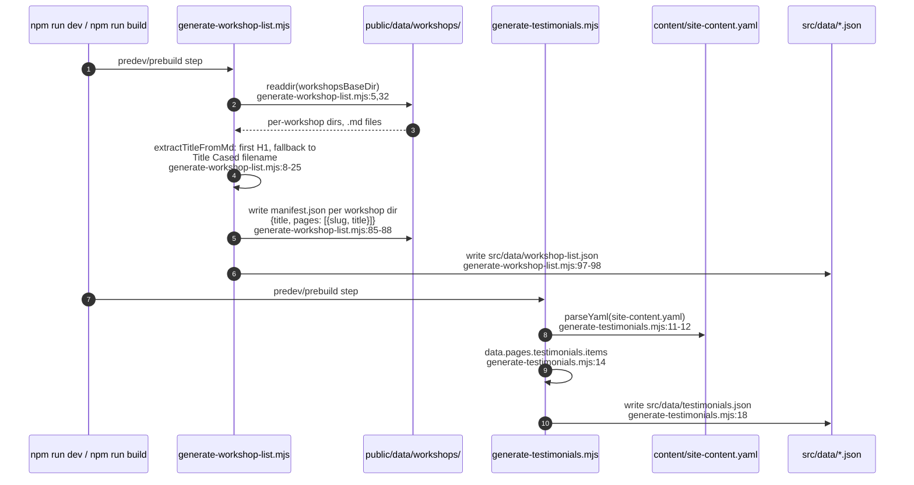
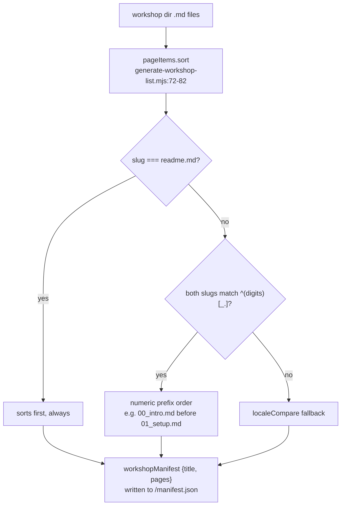
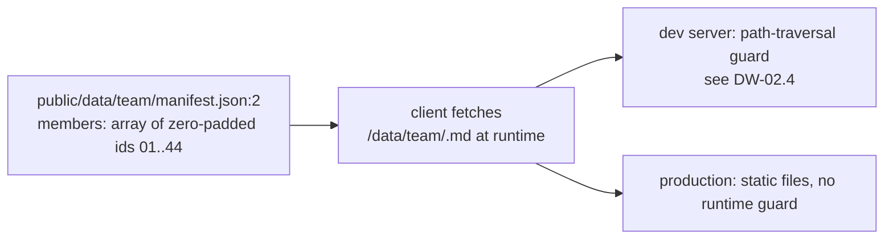
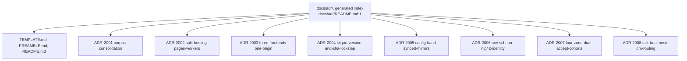
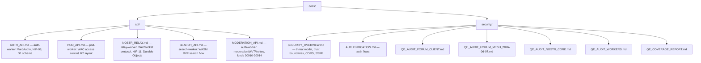
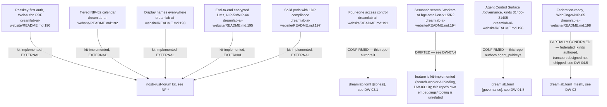

## DW-06.1 Pre-build content pipeline — two generators, run before every dev/build

- Both generators fail soft: a missing `public/data/workshops/` writes an empty `workshop-list.json` instead of failing the build (`generate-workshop-list.mjs:97-99`), and a YAML parse error writes an empty `testimonials.json` (`generate-testimonials.mjs:22-25`) — CLAUDE.md's Data directory note explicitly marks these two JSON files as GENERATED, do-not-hand-edit.

## DW-06.2 Workshop manifest generation — page ordering rules

- The workshop id itself is reformatted for display: `workshop-01-foo` becomes `01 - Foo` via a regex that splits the leading number from the rest and title-cases each word (`generate-workshop-list.mjs:39-45`).

## DW-06.3 Team roster — manifest + per-member markdown, fetched at runtime

- Team portraits live under `public/images/team/` (`01..44.webp`), loaded via the same manifest (`CLAUDE.md:96`).

## DW-06.4 ADR pack — living-doc ledger, ADR-2001 through ADR-2008

- This is a **thin ledger** amending `BASELINE-architecture.md` / `IDENTITY-zones.md` (the living docs are normative); the pre-2026-08-31 legacy corpus (numbered 013+) is frozen under `docs/archive/adr/` as evidence, not authority (`CLAUDE.md:19-21`).
- Numbering overlaps VisionFlow/agentbox's own ADR-2xxx space by design — the brief's ledger-overlap note applies: each area's ADR ids are area-scoped, resolved by directory, not globally unique across repos.

## DW-06.5 API and security documentation inventory

- `MODERATION_API.md`'s four endpoint families are backed by Nostr parameterised-replaceable event kinds **30910-30914**, with D1 projections into `moderation_actions`/`reports` for fast querying; every mutating endpoint requires a NIP-98 header binding method, URL and body-SHA256 to prevent replay (`docs/api/MODERATION_API.md:1-10`).

## DW-06.6 Invariants register — consolidated from both governing docs

```mermaid
flowchart TB
    I1["1. KIT_REF + Cargo pin lockstep<br/>BASELINE-architecture.md:145-148 — see DW-01.5"]
    I2["2. Privileged deploy downloads nothing unverified<br/>BASELINE-architecture.md:149-151 — see DW-01.6"]
    I3["3. window.__ENV__ vs Vite build vars, validate every endpoint<br/>BASELINE-architecture.md:152-154"]
    I4["4. GitHub Pages is origin of record until DNS re-cut<br/>BASELINE-architecture.md:155-157 — see DW-01.3"]
    I5["5. Identity stays raw 64-hex pubkey, no silent DID move<br/>IDENTITY-zones.md:141-143 — see DW-04.2"]
    I6["6. Zone required_cohorts stays dual-accept<br/>IDENTITY-zones.md:144-145 — see DW-03.1"]
    I7["7. Only zone3 is encrypted; changing it is a recorded event<br/>IDENTITY-zones.md:146-147 — see DW-03.1"]
    I8["8. Talk-to-AI reply relays subset of of agent publish fan-out<br/>IDENTITY-zones.md:148-149 — see DW-04.3"]
    I9["9. Admin/Jarvis pubkeys + ZONE_CONFIG hand-mirrored, rotation touches every mirror<br/>IDENTITY-zones.md:150-152 — see DW-03.3/DW-03.5"]
```

- These nine invariants are the compliance surface for this area: any change touching them requires a governing-doc update plus a thin ADR under `docs/adr/`, per each doc's own Change-process section.

## DW-06.7 Known divergences / DOC-DRIFT register — this area's open items

```mermaid
flowchart TB
    D1["README: two SPAs vs three shipped clients<br/>see DW-01.2"]
    D2["README: Cloudflare-edge vs GitHub Pages origin<br/>see DW-01.3"]
    D3["forum-config/README.md pin note stale: git rev vs crates.io version<br/>BASELINE-architecture.md:132-134"]
    D4["Branded worker custom domains undeployed, workers.dev is shipped reality<br/>see DW-01.4"]
    D5["dreamlab.toml README: 'Friends' zone does not exist<br/>see DW-03.1"]
    D6["DID/Multikey convergence is documentation-only<br/>see DW-04.2"]
    D7["Admin/governance key unsplit, staged not applied<br/>see DW-03.4"]
    D8["Roster authorised_by authored but not rendered by the kit<br/>see DW-03.5"]
    D9["BASELINE-architecture.md itself cites a stale KIT_REF and crate version<br/>see DW-01.5"]
    D10["branding.rs dead code contradicts live dreamlab.toml branding values<br/>see DW-03.8/DW-03.2"]
    D11["BASELINE-architecture.md estate-closeout note predates the 2026-09-05 gate fix<br/>see DW-05.3"]
    D12["README.md itself cites a stale kit pin, two releases behind live<br/>dreamlab-ai-website/README.md:289 vs rust-ci.yml:21, workers-deploy.yml:44 — see DW-06.8"]
    D13["Root-level seed scripts hardcode a plaintext private key<br/>+ an unresolvable absolute import path — see DW-07.2"]
    D14["README's semantic-search claim (Workers AI bge-small-en-v1.5/R2) has no<br/>in-repo build path; this repo's embeddings/ tooling targets an unrelated<br/>RuVector Postgres + all-MiniLM-L6-v2 pipeline — see DW-07.4"]
```

- D9 and D11 are findings from this diagram-authoring pass, not pre-existing entries in either governing doc's own Known-divergences section — both are consequences of the governing docs' `verified_commit: d852f61` being older than this area's current HEAD (`9a3dd8830`) and the estate-closeout note's own explicit 2026-09-04 dating.
- D12/D13/D14 are Wave 2 findings, closing the material gaps the estate audit (`reports/audit-web.md`) identified for this area.

## DW-06.8 README feature claims — confirmed, kit-external, or drifted

- Of the nine README feature bullets (`dreamlab-ai-website/README.md:190-198`), only two (four-zone access control, Agent Control Surface pubkey roster) are things THIS repo's own config directly implements and this diagram tree can verify from `forum-config/`; the rest are upstream-kit behaviour (cloned at `KIT_REF`, not vendored) that this repo cannot confirm or deny from its own source — the auditor's "unconfirmed, unflagged" characterisation is accurate for six of the nine, and one (semantic search) is actively misleading about which pipeline in THIS repo relates to it (DW-07.4).
