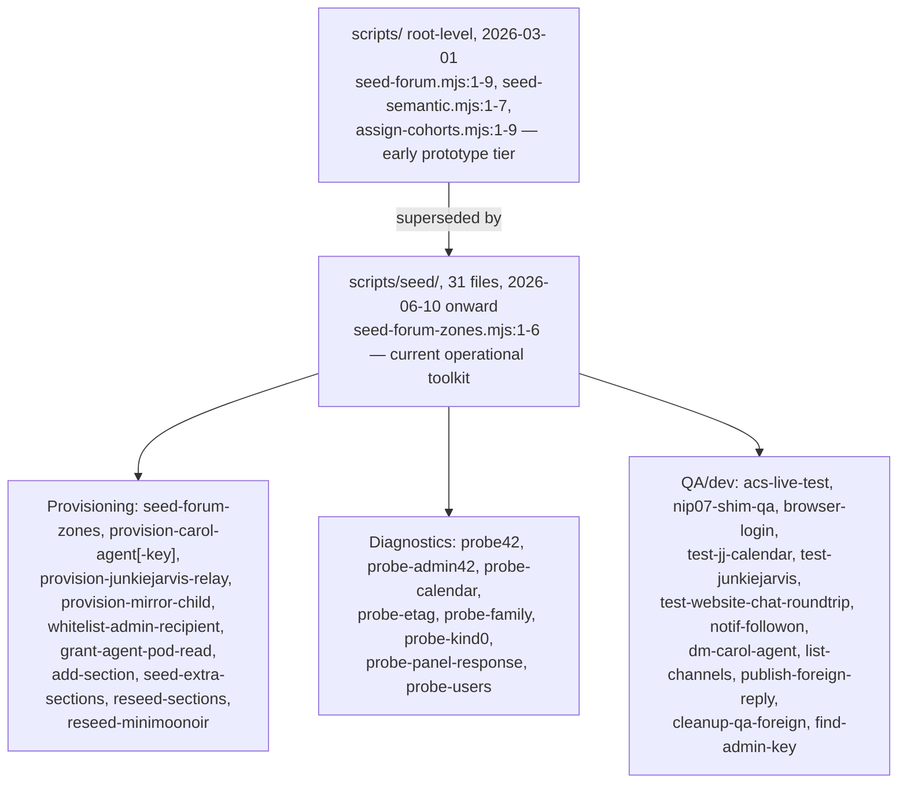
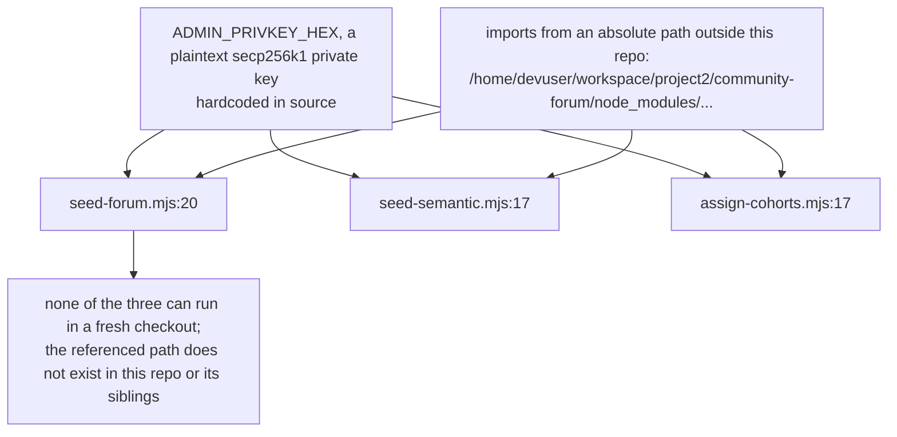
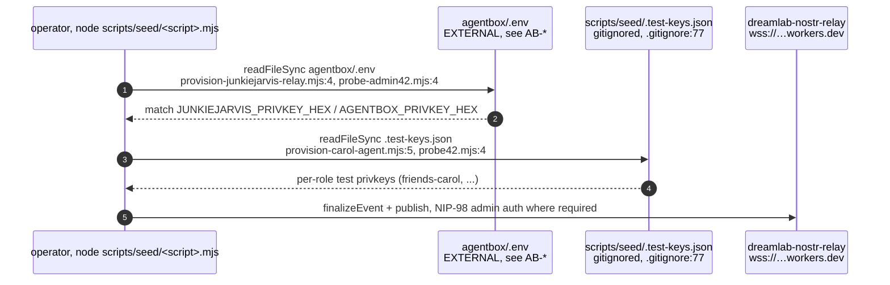
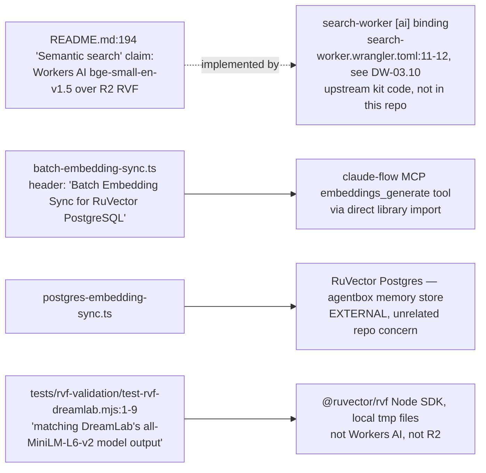
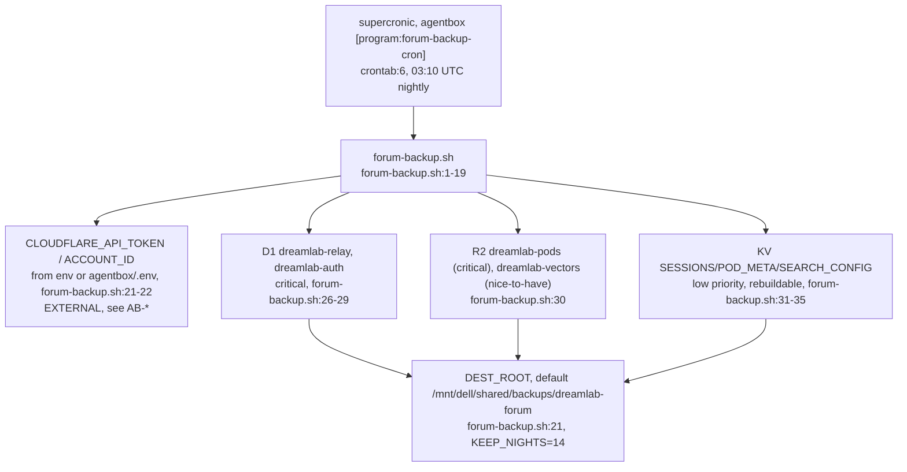
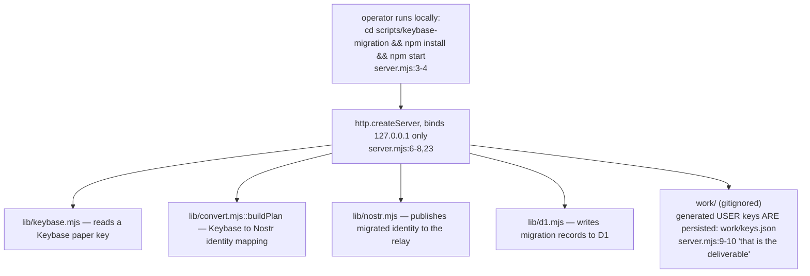
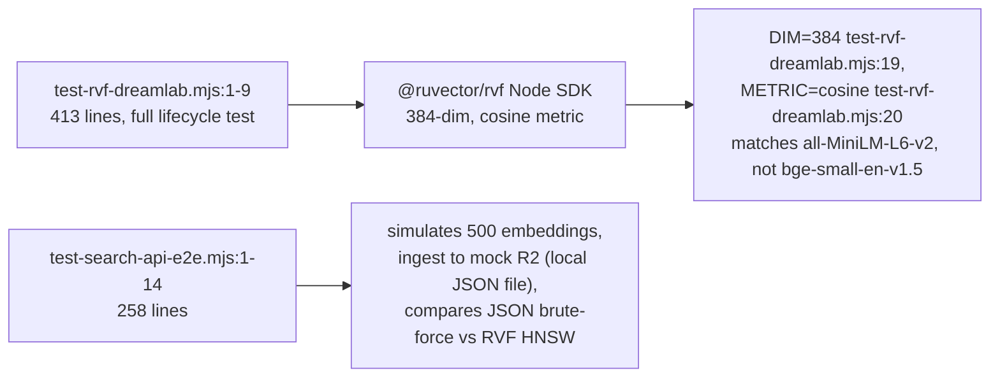

## DW-07.1 Two generations of forum-provisioning scripts

- DIVERGENCE from the audit's count: `scripts/seed/` holds **31** files (verified `find scripts/seed -type f | wc -l`), not the 37 the wave-2 brief cites; the three root-level seeders (`seed-forum.mjs`, `seed-semantic.mjs`, `assign-cohorts.mjs`) bring the total provisioning-script count to **34**. None of the excess 3 the brief implies were found under any plausible additional path.
- The root-level tier and `scripts/seed/` are not two views of the same thing — they are chronologically distinct generations (git-log dates above) that happen to share a directory prefix; DW-07.2 details why this matters operationally.

## DW-07.2 Root-level seeders — a hardcoded key and a broken import path

- INVARIANT VIOLATION: `CLAUDE.md`'s own Security Rules state "NEVER hardcode API keys, secrets, or credentials in source files" (`CLAUDE.md` Security Rules section) — these three files do exactly that, unconditionally, not behind a `--dev`/env-gated fallback.
- Whether the embedded key is still live cannot be determined from this repo alone; it is not one of the pubkeys enumerated in `dreamlab.toml [admin]`/`[[agents]]` (DW-03.3), so it appears to be a standalone test identity rather than the operator's admin key — but a plaintext private key checked into git history is a credential-hygiene defect regardless of scope.
- Contrast with `scripts/seed/`'s current tier (DW-07.3): every script there reads its signing key from an external `.env` at request time, never embeds one.

## DW-07.3 `scripts/seed/` — keys sourced externally, not embedded

- `scripts/seed/probes/` is also gitignored (`.gitignore:78`) — ad hoc probe output/scratch state never lands in the tree.
- `whitelist-admin-recipient.mjs:1-6` documents its own no-op status as of 2026-07-14: the interim contact-DM recipient is already whitelisted, so the script is a safety check pending ADR-041 Decision 5's key-split cutover (cross-reference DW-03.4).
- `reseed-minimoonoir.mjs:1-6` records an in-repo migration note: the `friends`→`minimoonoir` zone-id rename orphaned `friends-*` channels (kind-40 section tags are immutable), requiring a delete-and-recreate rather than an in-place rename — direct evidence for the "Friends zone does not exist" DOC-DRIFT already flagged in DW-03.1.

## DW-07.4 `scripts/embeddings/*` — a different pipeline than README's semantic-search claim

- DOC-DRIFT: `README.md:194` markets semantic search as `bge-small-en-v1.5` embeddings over an R2-backed RVF store. Nothing in `scripts/embeddings/*` or `tests/rvf-validation/*` builds that pipeline: `batch-embedding-sync.ts` and `mcp-embedding-sync.ts` sync **RuVector Postgres memory entries** via the **claude-flow MCP** toolchain (agentbox's own memory system, not this site's search index), and the two `tests/rvf-validation/*` suites validate the `@ruvector/rvf` Node SDK against a **384-dim `all-MiniLM-L6-v2`** model over local JSON/tmp files — a different model and a different store than the README's `bge-small-en-v1.5`/R2 claim. The feature README:194 describes is real (search-worker's Workers AI binding, DW-03.10), but its build/index path is upstream-kit code this repo does not vendor; the embeddings tooling that does live in this repo is a separate, unrelated concern that happens to share the word "embedding".
- This resolves the audit's "index-build path has no home" gap: the path exists, just not for the feature the auditor was looking for it in service of.

## DW-07.5 Nightly Cloudflare-to-NAS backup

- INVARIANT: missing Cloudflare credentials exit the script with code 2 rather than silently succeeding, "so the cron surface shows the gap instead of silently succeeding" (`forum-backup.sh:14`).
- Content-sensitivity note in the script header: kind-1059 DMs are E2E encrypted at rest, but kind-40/42/0 events are signed plaintext, so "the NAS copy is readable content — keep it on the trusted segment only" (`forum-backup.sh:16-18`).
- This is the only backup/restore path for the forum found in this repo — there is no corresponding restore script, only the raw D1/R2/KV export.

## DW-07.6 `keybase-migration/` — a standalone local-only importer

- Security posture stated in its own header: the keybase paper key and the relay admin key "live in process memory for the duration of a request/job and are never logged or written to disk" (`server.mjs:6-8`); by contrast, generated per-user output keys are deliberately persisted to `work/keys.json` as the tool's actual deliverable, handed to the friend being migrated.
- This is a fully standalone Node app (own `package.json`/`package-lock.json`) nested inside the main repo's `scripts/` tree, not wired into any CI workflow or the main `npm` scripts (DW-02.3) — it is operator-run, out-of-band tooling.

## DW-07.7 `tests/rvf-validation/` — RVF library validation, not a forum test

- Both suites run as plain Node scripts (`node test-rvf-dreamlab.mjs`), not through Playwright or Vitest — they are not wired into `playwright.config.ts`'s `testDir` discovery (DW-05.5) or any `npm test` script (DW-02.3), and are absent from every CI workflow (DW-05.1-05.4). They validate the `@ruvector/rvf` library itself against a simulated workload, not this repo's live search-worker.
- Together with DW-07.4, these confirm the audit's "MISSING" finding was really two gaps in one: the *feature* README:194 describes has no in-repo build path (it's upstream-kit code), and the *tests* named after it validate unrelated tooling.
